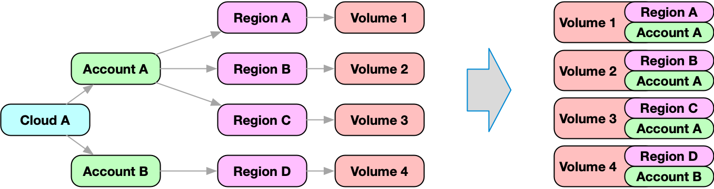
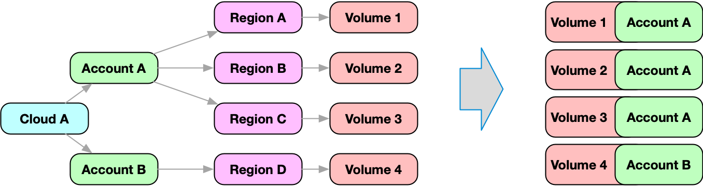

# Merging Nodes in Search

While it is possible to search and retrieve a filtered part of the graph, it is sometimes helpful to retrieve structural graph data as part of the node.

This approach merges multiple nodes in a graph into one node. This combined node can simplify processing the node.



The nested search is executed for every node in the result. The result of the nested search is then merged with the original node data.

:::tip Example

Most cloud resources are maintained in an account. Accounts are modeled as [nodes](../../concepts/graph/index.md) in Resoto.

Resources reference the region node, while the region node references the account node. In order to retrieve the account, the graph has to be traversed inbound from the resource node until the account node is found. While this is possible, it might be more convenient to get the account information as part of the node!

In this example, we search for nodes of kind `volume`. For every element that is returned, a nested search is executed, which will traverse the graph inbound until it finds a node of kind `account`.

```bash
> search is(volume) { account: <-[0:]- is(account) } limit 1 | dump
# highlight-start
​reported:
​    .
​    .
​account:
​    reported:
​        .
​        .
# highlight-end
```

The result of this nested search is merged with the volume node on root level under the name account.

The complete information about the account is then available as part of the volume node:



You will notice that the account, cloud, region, and zone are displayed for every resource. This data is available in the `/ancestors` node section.

:::

A nested search is a complete, standalone query and can use the features of any other search.

The result of a nested search is merged with the original node under the given merge name.

If the merge name is a simple literal, zero or one result of the nested search is expected. This also means, that the graph traversal of the nested search stops, when the first matching element is found.

If the expected result of the nested search is a list, than the merge name has to be defined with square brackets.

:::tip Example

The following search will traverse inbound on every element and collect all predecessors under the name `predecessors`). Please note the square brackets in the name `predecessors[]` - which will tell the search engine to return all predecessors, not only the first one. As a result the node is returned with a new property, which contains the list of all predecessors.

```bash
> search is(volume) { predecessors[]: <-- all } limit 1 | dump
# highlight-start
​reported:
​    .
​    .
​predecessors:
​- reported:
​    .
​    .
​- reported:
​    .
​    .
# highlight-end
```

:::

It is also possible to define multiple merge queries in one `search` statement.

:::tip Example

As a result every node that is returned has two additional properties: `account` holds the complete data of the account node, as well `region`, which contains the related region node.

```bash
> search is(volume) { account: <-[0:]- is(account), region: <-[0:]- is(region) } limit 1 | dump
# highlight-start
​reported:
​    .
​    .
​account:
​    reported:
​        .
​        .
​region:
​    reported:
​        .
​        .
# highlight-end
```


You will notice that the account, cloud, region, and zone are displayed for every resource. The data is available in the `/ancestors` node section. :::

A nested search can even be defined using nested searches:

```bash
> search = <pre_filter> { <merge_name_1>: <query>, .., <merge_name_n>: <query> } <post_filter>
```

:::

:::note

Be aware that a nested search is executed for every node of the original search and might be expensive and time intensive to compute.

:::

## Ancestors and Descendants

A rather common use case is to walk the graph until you find a node of specific `kind`, and merge it with the current node.

For example, cloud, account, region and zone of every resource is modeled as parent node using the default edge type. In order to retrieve the related information, you would need to perform a nested search.

Resoto provides the `ancestors` and `descendants` section as part of every resource to make this a little easier.

If we want to filter resources in a specific account by their identifiers, we can simply add a filter expression:

```bash
> search is(volume) and /ancestors.account.reported.id==dev limit 1
```

Let's break down the filter expression:

- It starts with a `/`. Resoto interprets property paths relative to the `reported` section by default. Since we want to access a property on the object root level, we need to prefix the path with a `/`.

- `ancestors` defines the direction in which to traverse; `ancestors` traverses inbound, while `descendants` would traverse outbound.

- `account` defines the kind of the node to look for. It is possible to define any `kind` here; `account` is just an example.

  :::note

  The related node is selected by kind and not based on any other other criteria.

  :::

- `reported.id` defines the property path in the target node (in this case, the account node). The path in this notation is always absolute.

It is possible to access every property of every parent or child resource in this way. You can use this notation anywhere a property path is specified: in [filters](./filters.md), [aggregations](./aggregation.md), [`with` clauses](./with-clause.md), and [CLI commands](../../reference/cli/index.md). Resoto is clever enough to create nested searches on demand when it encocunters this notation.

This is the nested search that is automatically created for the above example:

```bash
> search is(volume) {/ancestors.account: <-[1:]- is(account)} /ancestors.account.reported.id==dev
```

### Cloud, Account, Region, and Zone

Nested merge queries are powerful, and the shorthand notation using `/ancestors` or `/descendants` allows accessing properties of any kind in the hierarchy easily.

Resoto provides the following information as part of every resource node.

- `/ancestors/cloud` the cloud provider with reported `id` and `name`
- `/ancestors/account` the related account of the resource with reported `id` and `name`
- `/ancestors/region` the related region (if applicable) with reported `id` and `name`
- `/ancestors/zone` the related zone (if applicable) with reported `id` and `name`

The [command-line interface](../../reference/cli/index.md) uses `list` for outputs by default, which always prints the above data if available.

:::note

The above data is resolved during import time and duplicated to every node. There is zero performance penalty using this data as filter in aggregations or output.

:::
