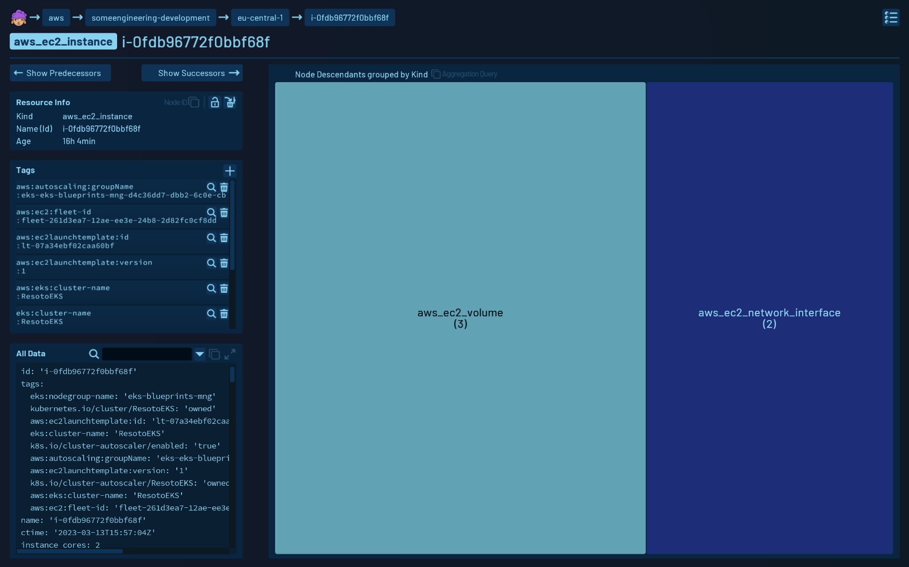
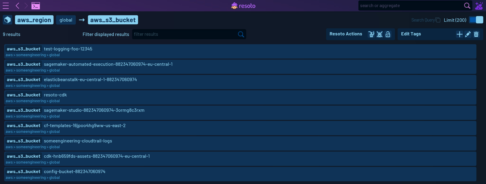

# Explore

## Overview

The Explore feature of the Resoto User Interface allows you to navigate through your infrastructure using inbound and outbound connections, deep diving into their resources, and obtaining detailed information about them, including their tags and metadata.

## Interface

### Top

Upon opening the Explore feature, a **breadcrumb view is displayed on the top**, showing the connection to the **root of the infrastructure** represented by **the Resoto Sheep Icon**. Clicking on it will always take you back to the root.

Below the breadcrumb view, there is information about the **type of the resource, its name, and the id**.

### Left Side

The bottom view is split into two sides. The left side displays more **detailed information about the resource, action icons, the tag editor, and the [reported section](../search/filters.md#property-sections) of the metadata** of this resource. The top of the interface displays two buttons to navigate to the successors or predecessors of this resource.

### Right Side

On the right side, there is a **treemap view** of the **successors, sorted by their descendant count**. This view will sometimes automatically switch to an alternate displaying mode, displaying this node's descendants grouped by their kind. This can be switched using the switch button on top of the treemap view.

The Treemap can be used to **quickly navigate through your infrastructure** by clicking on one of the boxes with the <kbd>Left Mouse Button</kbd>.

Clicking the <kbd>Right Mouse Button</kbd> will navigate **back one level**.

### List View

While navigating in Expore, sometimes the multi-resource display of Explore mode may be opened to display a list of resources.

A list of resources is displayed when the resulting navigation step is not displaying a single resource, for example **when clicking on a kind label**.

To **get back** to the single node view, **click the box icon on the top left**.

Clicking on any **resource in the list** will also take you back to view this resource in the default view.

## Usage

The Explore feature is useful for deep diving into your infrastructure, navigating through resources, and obtaining detailed information about them. By representing the infrastructure as a graph, users can drill down and get a comprehensive view of the infrastructure quickly.

You can also **take action** on the resources by using the action icons, **editing tags, marking them for clean-up, or searching their metadata**.

Overall, the Explore feature is a powerful tool for navigating and understanding your infrastructure in Resoto.
