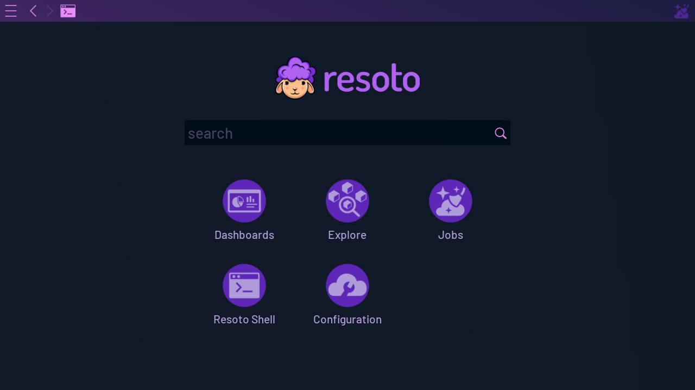
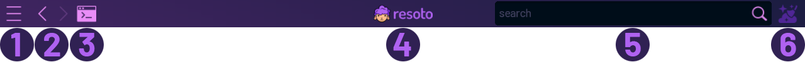
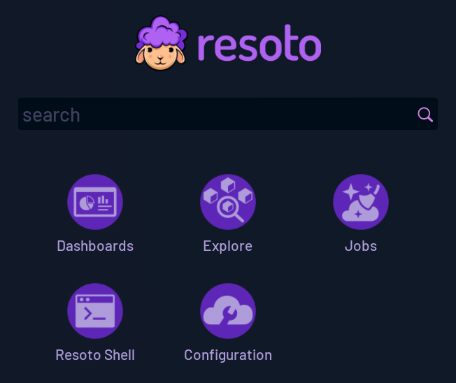
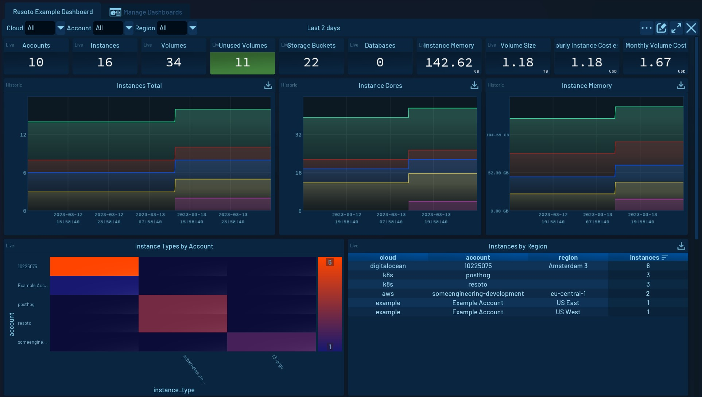
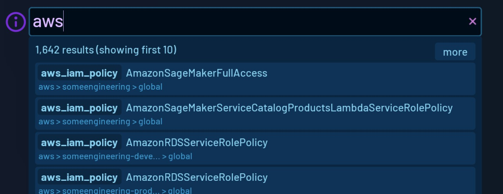
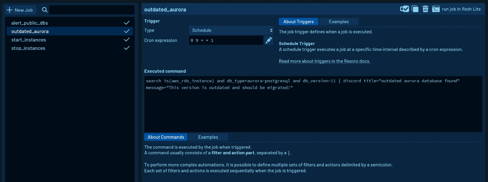
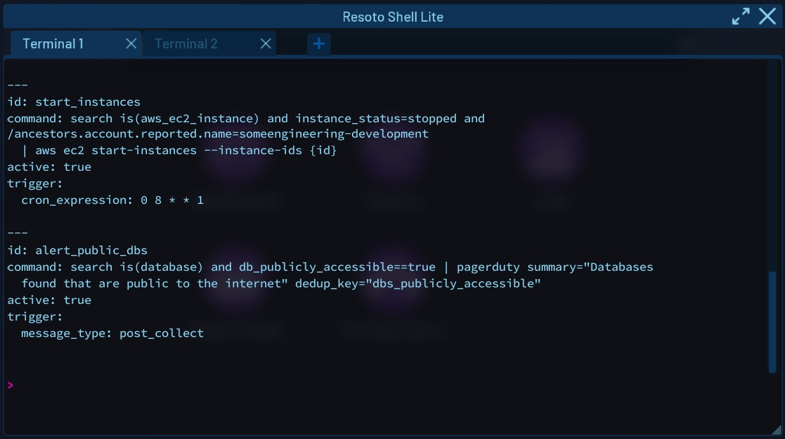
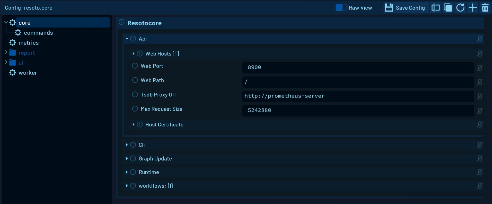

# Resoto User Interface

## Overview

The Resoto User Interface offers a simple way to interact with your infrastructure in your web browser. It helps you to discover, interact and automate more easily. Being built using the [Godot Engine](https://godotengine.org/), it uses a [web assembly](https://github.com/WebAssembly/design) application to run.

:::tip

We recommend using [Google Chrome](https://www.google.com/intl/en_en/chrome/) to run the Resoto UI. Other web browsers can have issues with accessing the clipboard. On Firefox there is a workaround described [here](https://github.com/godotengine/godot/issues/57382#issuecomment-1262280650)](https://github.com/godotengine/godot/issues/57382#issuecomment-1262280650).

:::

## Top Menu Bar

The Resoto user interface features a menu bar at the top of the screen.

**(1) Menu** (or pressing <kbd>Esc</kbd>) opens the main menu which gives you to access all the [features](#ui-features) and the [UI Settings](./settings-and-tools.md#user-interface-settings).

**(2) Navigation** (only in standalone) to navigate back and forward. When using the UI in a web browser, the browser back and forward buttons are used for this and the native ones are hidden.

**(3) Resh Lite** opens a popup of the [Resoto Shell Lite](./resh-lite.md).

**(4) Resoto logo** navigates to the default home screen.

**(5) Search box** on the right side of the menu bar is visible when the UI is not showing the home screen. You can use this to quickly start a new [search](./search.md).

**(5) Workflow status** indicates if a workflow is currently running. Click on it to get more information about the running [workflow](../../concepts/automation/index.md).

## Home Screen

The home screen is displayed by default. Clicking on these icons opens the other features or starts a new [search](./search.md).

## UI features

### Dashboards

[Dashboards](dashboards/index.md) give rich insights about the infrastructure that is being scraped by Resoto from live or historic data. They are built by combining [widgets](dashboards/widgets/index.md) using different [data sources](dashboards/data-sources/index.md). 

### Search

[Search](./search.md) your infrastructure simply and quickly. 

### Explore

[Explore](./explore.md) allows navigating the infrastructure using the neighborhood of your resources. 

### Job Editor

The [Job Editor](./job-editor.md) gives an easy-to-use interface to set up and manage [automation jobs](../../concepts/automation/index.md). 

### Resoto Shell Lite

[Resoto Shell Lite](./resh-lite.md) (Resh Lite) gives you access to the full range of [CLI commands](../../reference/cli/) as a popup you can open anywhere in the user interface. 

### Configuration Editor

The [Configuration Editor](./configuration-editor.md) gives you an easy way of editing Resoto [configurations](../configuration/index.md). 

### Setup Wizard

The [Setup Wizard](./setup-wizard.md) guides you through the initial setup of Resoto. 

### Settings and Tools

In the [UI settings](./settings-and-tools.md#user-interface-settings) connection and cleanup settings can be managed. The [Wizard Editor](./settings-and-tools.md#wizard-editor) is also found there. With the Wizard Editor, wizards can be created and edited.

## Contributing

The Resoto User Interface is maintained in a separate [GitHub repository](https://github.com/someengineering/resoto-ui). We are looking forward to your contribution!
