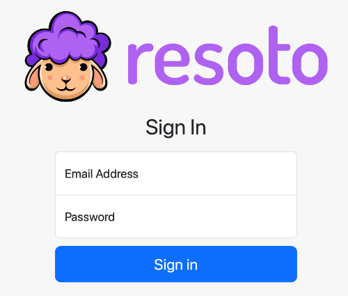

# User Management

[Resoto UI](../user-interface/index.mdx) and [Resoto Shell](../components/shell.mdx) are protected by a login screen that require a username and password:

## User Sessions

**User authorization uses a [JSON web token](../security.mdx#json-web-token) and is session-based.**

Session durations default to one hour. This duration is configurable in [Resoto Core](../components/core.mdx).

Active sessions will renew automatically in the background before they expire.

An active user session lasts for the configured session duration and can not be revoked. When a session expires, a new login of the user can be forced by changing the password of the related user.

An administrator can block a user from the system by deleting their user data.

:::info

Pleae refer to [`user` command](../cli/user/index.mdx) for details on how to manage users.

:::
