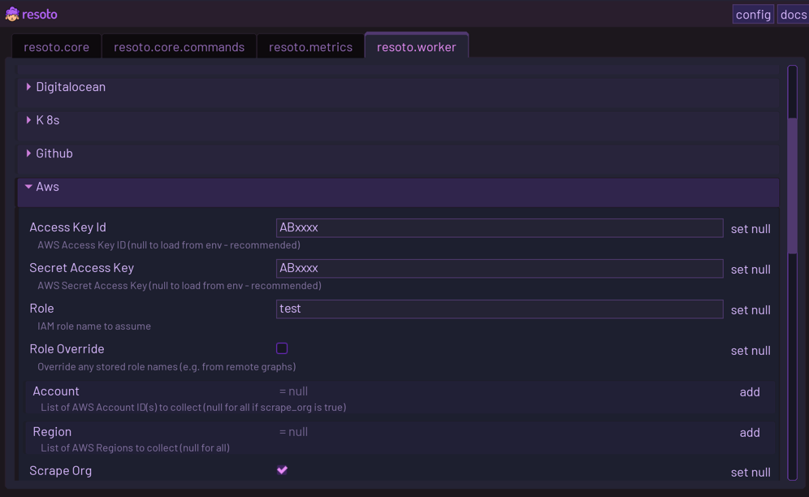
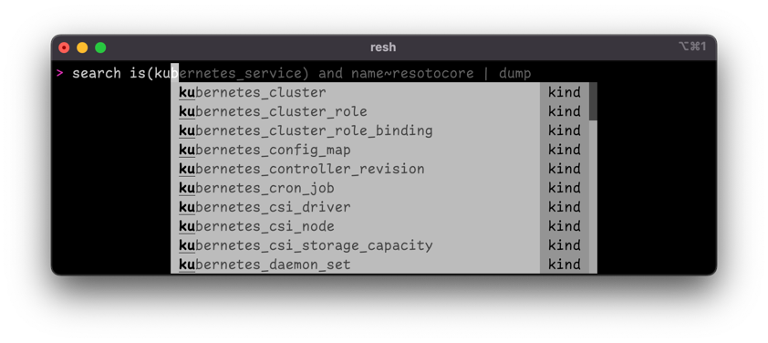
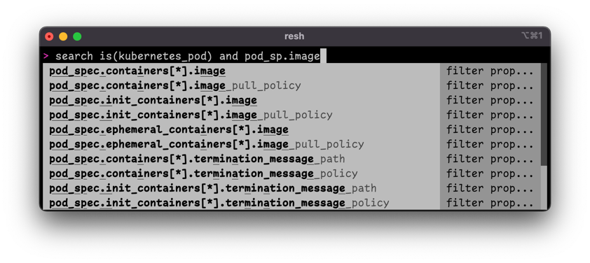
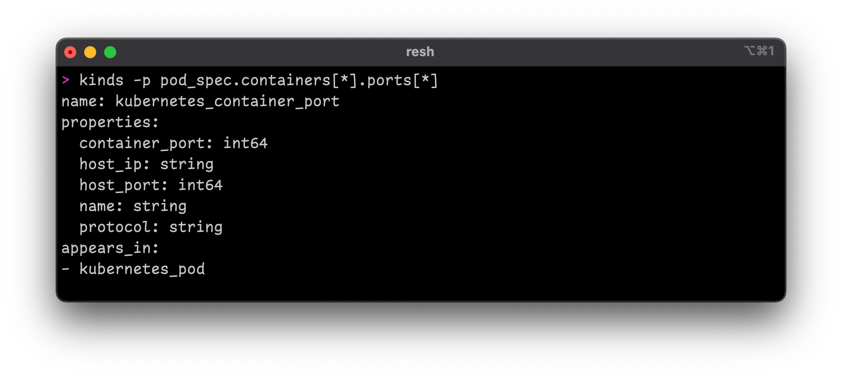

# 2.3.1

## Highlights

### Support for Kubernetes

[Kubernetes](https://kubernetes.io) is the de-facto standard for orchestrating containerized applications. It is the go-to solution no matter where your infrastructure is running. This release adds support for Kubernetes resources. All standard Kubernetes resources are supported and fully covered.

#### Further Reading

- [Kubernetes Support](/blog/2022/06/22/kubernetes-support)
- [Install Resoto with Kubernetes](/docs/getting-started/install-resoto/local/kubernetes)
- [Configure Kubernetes Access](/docs/getting-started/configure-cloud-provider-access/kubernetes)
- [Kubernetes Resources](/docs/reference/data-models/kubernetes)

### UI to Configure Resoto

We now ship a user interface (UI) in [Resoto Core](/docs/concepts/components/core), from which it is possible to configure Resoto.

If you are running Resoto locally via [Docker](/docs/getting-started/install-resoto/local/docker), the UI is accessible via [https://localhost:8900/ui](https://localhost:8900/ui):

### Complex Model Handling

Resoto had limited support to handle complex models. This release adds the ability to handle any deeply structured type while also introspecting them.

[Resoto Shell](/docs/concepts/components/shell) now provides better, type-aware suggestions:

[Resoto Shell](/docs/concepts/components/shell) is also able to suggest deeply nested properties, since it knows the complete model structure:

The `kinds` command can be used to lookup the model behind a nested property path:

And last but not least, the UML model endpoint can generate diagrams with complex models.

### Support for Graph Edges Between Clouds

Resoto uses collectors to retrieve data from a specific cloud provider. Those collectors are not only able to collect the resource data, but also define the relationships between the resources. Some relationships cannot be resolved inside the collector, since the relationship points to resources that are not part of this cloud.

:::tip Examples

- A [Kubernetes](/docs/reference/data-models/kubernetes) node is running on an [AWS](/docs/reference/data-models/aws) EC2 instance. The [Kubernetes](/docs/reference/data-models/kubernetes) collector is unable to resolve the reference, since it points to a resource provided by [AWS](/docs/reference/data-models/aws).
- A load balancer in [AWS](/docs/reference/data-models/aws) that points to compute resources in [Google Cloud](/docs/reference/data-models/gcp). The [AWS](/docs/reference/data-models/aws) collector does not know anything about [GCP](/docs/reference/data-models/gcp).

:::

Resoto now has support for creating edges that cannot be resolved during the phase of collecting the data but are resolved once all collectors have delivered their current snapshot. Going forward, we will continue extend our collectors to provide insights into relationships across cloud providers.

<!--truncate-->

## What's Changed

### Features

- [`8dba845`](https://github.com/someengineering/resoto/commit/8dba845) plugins/k8s Add deferred edges to digitalocean ([#921](https://github.com/someengineering/resoto/pull/921))
- [`396205a`](https://github.com/someengineering/resoto/commit/396205a) k8s Migrate from v1 config ([#933](https://github.com/someengineering/resoto/pull/933))
- [`c28fb7f`](https://github.com/someengineering/resoto/commit/c28fb7f) resotometrics Turn metrics type into enum ([#912](https://github.com/someengineering/resoto/pull/912))
- [`5a8d960`](https://github.com/someengineering/resoto/commit/5a8d960) k8s Order status conditions by time. ([#926](https://github.com/someengineering/resoto/pull/926))
- [`9f32c24`](https://github.com/someengineering/resoto/commit/9f32c24) k8s Add edge from node to pod ([#924](https://github.com/someengineering/resoto/pull/924))
- [`829f363`](https://github.com/someengineering/resoto/commit/829f363) resotocore Improve nested path handling ([#922](https://github.com/someengineering/resoto/pull/922))
- [`8fea151`](https://github.com/someengineering/resoto/commit/8fea151) resotocore Send event when usage metrics are turned off ([#918](https://github.com/someengineering/resoto/pull/918))
- [`bf3b286`](https://github.com/someengineering/resoto/commit/bf3b286) k8s Implement tag update, tag delete and resource delete ([#920](https://github.com/someengineering/resoto/pull/920))
- [`7171c99`](https://github.com/someengineering/resoto/commit/7171c99) k8s Configure access directly or via file ([#911](https://github.com/someengineering/resoto/pull/911))
- [`68bab3c`](https://github.com/someengineering/resoto/commit/68bab3c) resotoworker Outer edge support - part 4/4 ([#916](https://github.com/someengineering/resoto/pull/916))
- [`5f0e440`](https://github.com/someengineering/resoto/commit/5f0e440) k8s Define successors ([#917](https://github.com/someengineering/resoto/pull/917))
- [`ba317bf`](https://github.com/someengineering/resoto/commit/ba317bf) resotocore Uml model shows dependant complex types ([#913](https://github.com/someengineering/resoto/pull/913))
- [`ea63d67`](https://github.com/someengineering/resoto/commit/ea63d67) resotocore Make EdgeType typed ([#909](https://github.com/someengineering/resoto/pull/909))
- [`33a4649`](https://github.com/someengineering/resoto/commit/33a4649) k8s Add collector test ([#908](https://github.com/someengineering/resoto/pull/908))
- [`9097d08`](https://github.com/someengineering/resoto/commit/9097d08) resotocore Outer Edges collection support - Part 3/4: ([#902](https://github.com/someengineering/resoto/pull/902))
- [`e1694a0`](https://github.com/someengineering/resoto/commit/e1694a0) k8s Implement kuberenetes plugin ([#903](https://github.com/someengineering/resoto/pull/903))
- [`c873cc9`](https://github.com/someengineering/resoto/commit/c873cc9) resotolib Extend update check to distinguish between stable and pre-releases ([#898](https://github.com/someengineering/resoto/pull/898))
- [`9f97b56`](https://github.com/someengineering/resoto/commit/9f97b56) resoto Remove trailing slash ([#905](https://github.com/someengineering/resoto/pull/905))
- [`941eaca`](https://github.com/someengineering/resoto/commit/941eaca) resoto Outer edge collection support - Part 2/4 ([#892](https://github.com/someengineering/resoto/pull/892))
- [`25cb049`](https://github.com/someengineering/resoto/commit/25cb049) resotolib Use 120 lines length for formatting ([#896](https://github.com/someengineering/resoto/pull/896))
- [`ad42bd4`](https://github.com/someengineering/resoto/commit/ad42bd4) resoto Add a package to install all resoto components at once ([#890](https://github.com/someengineering/resoto/pull/890))
- [`fb7c25b`](https://github.com/someengineering/resoto/commit/fb7c25b) resotolib Update check ([#895](https://github.com/someengineering/resoto/pull/895))
- [`552feeb`](https://github.com/someengineering/resoto/commit/552feeb) resoto Initial DNS support ([#894](https://github.com/someengineering/resoto/pull/894))
- [`973a9be`](https://github.com/someengineering/resoto/commit/973a9be) resotocore format --json prettifies json ([#893](https://github.com/someengineering/resoto/pull/893))
- [`99c09e7`](https://github.com/someengineering/resoto/commit/99c09e7) resotoeventlog Genesis of resotoeventlog ([#883](https://github.com/someengineering/resoto/pull/883))
- [`503b736`](https://github.com/someengineering/resoto/commit/503b736) resotocore Add typed ConfigId ([#886](https://github.com/someengineering/resoto/pull/886))
- [`3909d5b`](https://github.com/someengineering/resoto/commit/3909d5b) resoto fix: resotolib/requirements.txt to reduce vulnerabilities ([#888](https://github.com/someengineering/resoto/pull/888))
- [`2d9bf57`](https://github.com/someengineering/resoto/commit/2d9bf57) resotocore Typed WorkerId ([#885](https://github.com/someengineering/resoto/pull/885))
- [`9ad54b0`](https://github.com/someengineering/resoto/commit/9ad54b0) resotocore Typed Ids: TaskId ([#882](https://github.com/someengineering/resoto/pull/882))
- [`b009c2c`](https://github.com/someengineering/resoto/commit/b009c2c) resotocore Typed Ids: SubscriberId ([#881](https://github.com/someengineering/resoto/pull/881))
- [`c5a4b2b`](https://github.com/someengineering/resoto/commit/c5a4b2b) resotocore Sort config based on model order ([#875](https://github.com/someengineering/resoto/pull/875))
- [`6bb14fd`](https://github.com/someengineering/resoto/commit/6bb14fd) resotocore Rename config option analytics_opt_out -> usage_metrics ([#874](https://github.com/someengineering/resoto/pull/874))
- [`9bc4086`](https://github.com/someengineering/resoto/commit/9bc4086) resotocore Outer edge collection support - Part 1/4 ([#877](https://github.com/someengineering/resoto/pull/877))
- [`d53b757`](https://github.com/someengineering/resoto/commit/d53b757) resotocore Add sort properties to list output ([#870](https://github.com/someengineering/resoto/pull/870))

### Fixes

- [`7537283`](https://github.com/someengineering/resoto/commit/7537283) docker Only build amd images ([#947](https://github.com/someengineering/resoto/pull/947))
- [`81f5966`](https://github.com/someengineering/resoto/commit/81f5966) resotoshell Use correct url ([#931](https://github.com/someengineering/resoto/pull/931))
- [`5723e1b`](https://github.com/someengineering/resoto/commit/5723e1b) resotoworker Wrap collector plugins in try/except block ([#929](https://github.com/someengineering/resoto/pull/929))
- [`e62206e`](https://github.com/someengineering/resoto/commit/e62206e) resotometrics Fix metrics type ([#928](https://github.com/someengineering/resoto/pull/928))
- [`43d1588`](https://github.com/someengineering/resoto/commit/43d1588) k8s Handle optional properties correctly ([#930](https://github.com/someengineering/resoto/pull/930))
- [`b2faf77`](https://github.com/someengineering/resoto/commit/b2faf77) resotoeventlog Update PyPI secret name ([#927](https://github.com/someengineering/resoto/pull/927))
- [`b0374ee`](https://github.com/someengineering/resoto/commit/b0374ee) plugins/digitalocean Type validation ([#900](https://github.com/someengineering/resoto/pull/900))
- [`df85e18`](https://github.com/someengineering/resoto/commit/df85e18) k8s Fix api client handling ([#925](https://github.com/someengineering/resoto/pull/925))
- [`418c488`](https://github.com/someengineering/resoto/commit/418c488) resotoworker Retry sending of graph data ([#923](https://github.com/someengineering/resoto/pull/923))
- [`c7eedf8`](https://github.com/someengineering/resoto/commit/c7eedf8) resotolib Units are computed correctly ([#915](https://github.com/someengineering/resoto/pull/915))
- [`a726bdd`](https://github.com/someengineering/resoto/commit/a726bdd) resotocore Search and coerce for arrays and backticks ([#914](https://github.com/someengineering/resoto/pull/914))
- [`7e389ab`](https://github.com/someengineering/resoto/commit/7e389ab) resoto Update git repo check in setup_venv script ([#910](https://github.com/someengineering/resoto/pull/910))
- [`3afe204`](https://github.com/someengineering/resoto/commit/3afe204) resotocore Typed NodeId ([#897](https://github.com/someengineering/resoto/pull/897))
- [`c31cfe5`](https://github.com/someengineering/resoto/commit/c31cfe5) resotocore search navigation after tail ([#891](https://github.com/someengineering/resoto/pull/891))
- [`6650606`](https://github.com/someengineering/resoto/commit/6650606) resotocore Allow complex config override values ([#887](https://github.com/someengineering/resoto/pull/887))
- [`a0a511d`](https://github.com/someengineering/resoto/commit/a0a511d) resotocore Make helm test more reliable ([#884](https://github.com/someengineering/resoto/pull/884))
- [`80cc046`](https://github.com/someengineering/resoto/commit/80cc046) resotocore package need to be marked as module ([#880](https://github.com/someengineering/resoto/pull/880))
- [`0fdbfc7`](https://github.com/someengineering/resoto/commit/0fdbfc7) resotocore Content disposition header for ca certificate ([#879](https://github.com/someengineering/resoto/pull/879))
- [`55dfbf8`](https://github.com/someengineering/resoto/commit/55dfbf8) ci Properly handle commits without associated PRs in release notes generator ([#878](https://github.com/someengineering/resoto/pull/878))
- [`b79b14a`](https://github.com/someengineering/resoto/commit/b79b14a) docker Increase file limits for ArangoDB ([#845](https://github.com/someengineering/resoto/pull/845))
- [`dc08974`](https://github.com/someengineering/resoto/commit/dc08974) docker Use TLS setup for prometheus ([#873](https://github.com/someengineering/resoto/pull/873))
- [`5b326a5`](https://github.com/someengineering/resoto/commit/5b326a5) resotocore Make query parser more strict ([#869](https://github.com/someengineering/resoto/pull/869))
- [`d9a2617`](https://github.com/someengineering/resoto/commit/d9a2617) plugins/digitalocean Rename do -> digitalocean ([#871](https://github.com/someengineering/resoto/pull/871))
- [`0db53ce`](https://github.com/someengineering/resoto/commit/0db53ce) resotocore Export model in correct format ([#868](https://github.com/someengineering/resoto/pull/868))
- [`1b538d5`](https://github.com/someengineering/resoto/commit/1b538d5) plugins/aws Add extra logging during EKS collection ([#866](https://github.com/someengineering/resoto/pull/866))
- [`c47a422`](https://github.com/someengineering/resoto/commit/c47a422) resoto Build and push to PyPI on tag push ([#865](https://github.com/someengineering/resoto/pull/865))

### Chores

- [`4e64f64`](https://github.com/someengineering/resoto/commit/4e64f64) resoto [resoto][chore] bump release version
- [`a516fbf`](https://github.com/someengineering/resoto/commit/a516fbf) resoto [resoto][chore] Bump release version.
- [`04399c3`](https://github.com/someengineering/resoto/commit/04399c3) k8s Update Readme. ([#939](https://github.com/someengineering/resoto/pull/939))
- [`799911f`](https://github.com/someengineering/resoto/commit/799911f) resoto Move duration parsing from resotocore to resotolib ([#919](https://github.com/someengineering/resoto/pull/919))
- [`f26bd09`](https://github.com/someengineering/resoto/commit/f26bd09) resoto Bump versions - take #2 ([#907](https://github.com/someengineering/resoto/pull/907))
- [`43ac678`](https://github.com/someengineering/resoto/commit/43ac678) resoto Bump versions ([#906](https://github.com/someengineering/resoto/pull/906))
- [`bfcf62d`](https://github.com/someengineering/resoto/commit/bfcf62d) resotoeventlog Remove experimental eventlog UI ([#904](https://github.com/someengineering/resoto/pull/904))
- [`e2f7a33`](https://github.com/someengineering/resoto/commit/e2f7a33) resoto use 120 characters line length for everything ([#899](https://github.com/someengineering/resoto/pull/899))
- [`b2736cf`](https://github.com/someengineering/resoto/commit/b2736cf) resoto Update README ([#867](https://github.com/someengineering/resoto/pull/867))
- [`637c4ee`](https://github.com/someengineering/resoto/commit/637c4ee) resoto Bump 2.3.0a0 ([#864](https://github.com/someengineering/resoto/pull/864))
- [`c017e45`](https://github.com/someengineering/resoto/commit/c017e45) k8s Add reference to configmap and secret from env ([#932](https://github.com/someengineering/resoto/pull/932))

## Docker Images

- `somecr.io/someengineering/resotocore:2.3.1`
- `somecr.io/someengineering/resotoworker:2.3.1`
- `somecr.io/someengineering/resotoshell:2.3.1`
- `somecr.io/someengineering/resotometrics:2.3.1`
