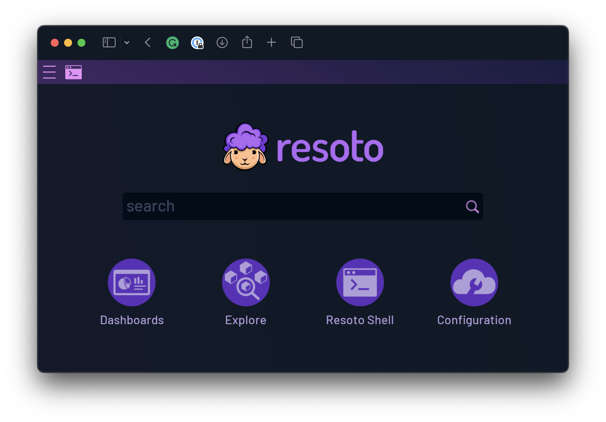
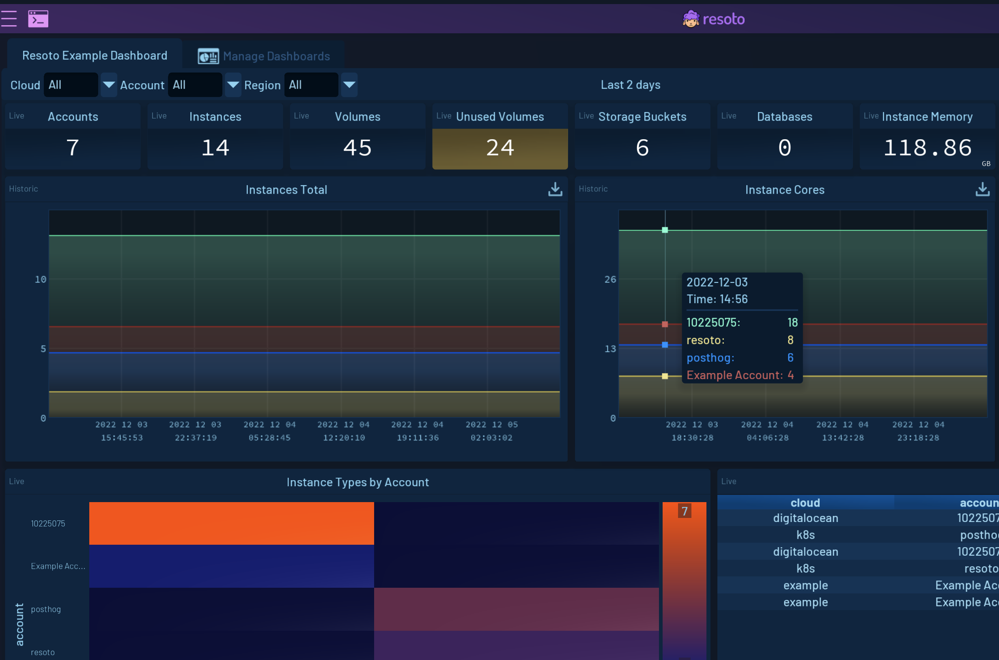
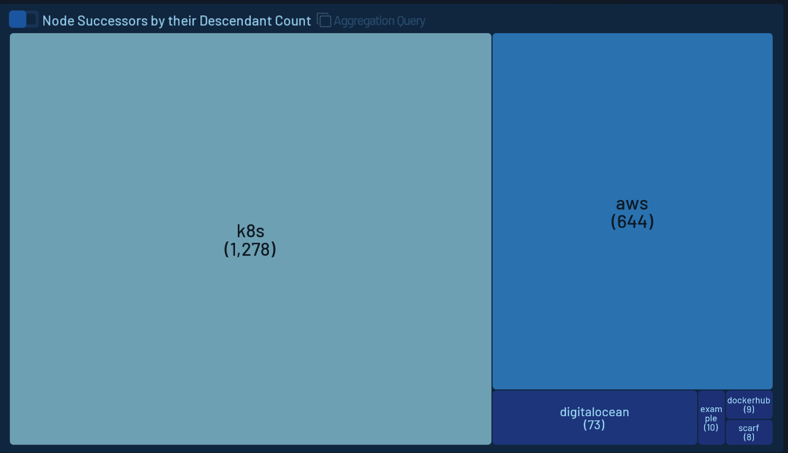
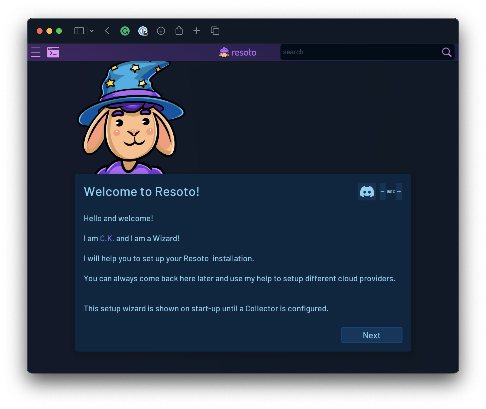
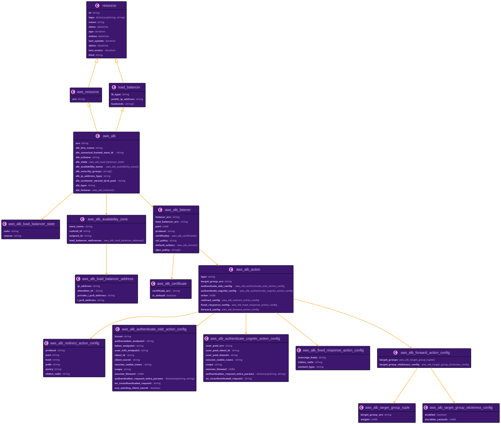

# 3.0.0

```mdx-code-block
import ZoomPanPinch from '@site/src/components/ZoomPanPinch';
import IconExternalLink from '@theme/Icon/ExternalLink';
```

## Highlights

### UI

Resoto now ships a new UI, which will make interacting with Resoto much easier and a lot more fun.



It comes with dashboards to visualize your resource data either from a time series metric, an aggregated search on the current snapshot or the result of a search. You can create your own dashboards and widgets to visualize your data in the way you want.



Explore all your cloud resources in a way you never did before. You can now search for resources and filter them by tags, attributes, and more. It allows you exploring your resource data in multiple ways - for example as a tree view.



Last but not least, it comes with a setup wizard that guides you through the initial configuration of Resoto.



### AWS: All Details and Better Service Coverage

Resoto now supports all details of each supported resource. This means that you can now search resources by any attribute, tag, or any other detail of the resource.

As an example I picked the AWS application load balancer to show the complete structure of the data to expect:

<ZoomPanPinch>



</ZoomPanPinch>

See the full list of supported AWS resources in the [AWS reference](/docs/reference/unified-data-model/aws).

### Cloud2SQL: Export Your Data into a SQL Database

It is now possible to leverage the power of our collectors and export your data into a SQL database. This allows you to use your data in any way you want. You can use it for reporting, analytics, or even machine learning.

We currently support the following list of database servers:

- [PostgreSQL](https://postgresql.org)
- [MySQL](https://mysql.com)
- [MariaDB](https://mariadb.org)
- [SQLite](https://sqlite.org)

See the the [someengineering/cloud2sql <span class="badge badge--secondary">github.com <IconExternalLink width="10" height="10" /></span>](https://github.com/someengineering/cloud2sql) repository for more details.

### Simplified Installation

#### Kubernetes Helm Chart

Resoto's default installation method is Kubernetes. We now provide a Helm chart to simplify this installation process. You can find the chart in the [someengineering/helm-charts](https://github.com/someengineering/helm-charts/tree/main/someengineering/resoto) repository. Installing Resoto on Kubernetes is now a `helm install` command away. Please see [Install Resoto with Kubernetes](/docs/getting-started/install-resoto/kubernetes) for more details.

#### AWS CDK

If you want to have full control over the CloudFormation stack that is created to install Resoto, you can use the AWS CDK construct that we provide. The construct definition can be found in the [someengineering/resoto-cdk](https://github.com/someengineering/resoto-cdk) repository. You can find more information in [Deploy Resoto with AWS Cloud Development Kit](/docs/getting-started/install-resoto/aws).

### History of Changes

Version 3.0.0 of Resoto does not only offer the current snapshot data and aggregated time series data, it now also keeps track of changes to any of your resources. This not only allows you to see how a resource has changed over time, you can also use it to list the changes that happened in a specific time frame.

Think of an outage in your production cluster, and you want to know what happened in the last 2 hours before this outage. You can now use the history of changes to find out what has changed and how it has changed.

If you think this topic is interesting, you can read more about it in [this blog post](/blog/what-we-can-learn-from-history). Find details and examples in the documentation of the [`history` command](/docs/reference/cli/search-commands/history).

### Extend the List of Commands via Plugins

Resoto has always been extensible via plugins for collect and cleanup. This release adds the option to programmatically add commands to Resoto. We use this feature to provide the `aws` command line tool as part of the AWS collector plugin, which allows you to interact with AWS resources directly from the Resoto CLI.

See the [`aws` Command](/docs/reference/cli/action-commands/aws) documentation for more information.

<!-- TODO: Once the blog post is published, link it here. -->

### Client to Interact with Resoto

We also created a Python client as part of this release that allows you to interact with Resoto from your own applications. You can find the latest version of the client in this [resotoclient-python](https://github.com/someengineering/resotoclient-python) repository.

If your programming language of choice is not Python, you can still use the [Resoto API](/docs/reference/api) directly.

<!--truncate-->

## What's Changed

### Features

- [`46dde383`](https://github.com/someengineering/resoto/commit/46dde383) <span class="badge badge--secondary">aws</span> Make the list of called mutator APIs available (#1323)
- [`d8ea453a`](https://github.com/someengineering/resoto/commit/d8ea453a) <span class="badge badge--secondary">resoto</span> Use ArangoDB 3.10.1 in docker-compose (#1321)
- [`8fedb029`](https://github.com/someengineering/resoto/commit/8fedb029) <span class="badge badge--secondary">resoto</span> add edge between glacier job and sns topic (#1314)
- [`e044fa88`](https://github.com/someengineering/resoto/commit/e044fa88) <span class="badge badge--secondary">resotocore</span> Allow authorization message as first ws message (#1308)
- [`1744a092`](https://github.com/someengineering/resoto/commit/1744a092) <span class="badge badge--secondary">resotolib</span> Allow authorization header as cookie (#1305)
- [`2b5468b8`](https://github.com/someengineering/resoto/commit/2b5468b8) <span class="badge badge--secondary">docker</span> Bump Python 3.11 (#1300)
- [`bdfc0bdd`](https://github.com/someengineering/resoto/commit/bdfc0bdd) <span class="badge badge--secondary">resotocore</span> Allow . and / in format to reference the object (#1298)
- [`5700c092`](https://github.com/someengineering/resoto/commit/5700c092) <span class="badge badge--secondary">plugins</span> support deferred edges between kubernetes and AWS (#1293)
- [`c9fb9718`](https://github.com/someengineering/resoto/commit/c9fb9718) <span class="badge badge--secondary">resotocore</span> Maintain history of nodes and make it available via CLI/API (#1289)
- [`abde8621`](https://github.com/someengineering/resoto/commit/abde8621) <span class="badge badge--secondary">resotoworker</span> Expose list of loaded collectors (#1288)
- [`9a8e6947`](https://github.com/someengineering/resoto/commit/9a8e6947) <span class="badge badge--secondary">resoto</span> fix: resotocore/requirements.txt to reduce vulnerabilities (#1286)
- [`aa0a1a2b`](https://github.com/someengineering/resoto/commit/aa0a1a2b) <span class="badge badge--secondary">resotocore</span> Improve TSDB proxy behaviour (#1284)
- [`7075ef5c`](https://github.com/someengineering/resoto/commit/7075ef5c) <span class="badge badge--secondary">resotolib</span> Customize model export and logging (#1278)
- [`0f3c7b13`](https://github.com/someengineering/resoto/commit/0f3c7b13) <span class="badge badge--secondary">resoto</span> Remove SQLAlchemy dependency (#1270)
- [`3ba0acaf`](https://github.com/someengineering/resoto/commit/3ba0acaf) <span class="badge badge--secondary">resotoworker</span> Report errors that are happening during cleanup (#1258)
- [`b9e0b230`](https://github.com/someengineering/resoto/commit/b9e0b230) <span class="badge badge--secondary">resotocore</span> Maintain the list of workflow tasks (#1257)
- [`ae158cca`](https://github.com/someengineering/resoto/commit/ae158cca) <span class="badge badge--secondary">resoto</span> Add .cyjs info to cli output (#1256)
- [`37fd663b`](https://github.com/someengineering/resoto/commit/37fd663b) <span class="badge badge--secondary">resotoshell</span> Allow ignoring updates from event stream. (#1252)
- [`2f9c5494`](https://github.com/someengineering/resoto/commit/2f9c5494) <span class="badge badge--secondary">resotocore</span> Config Service should allow testing updates using a dry run (#1250)
- [`6f23361e`](https://github.com/someengineering/resoto/commit/6f23361e) <span class="badge badge--secondary">aws</span> Define ignorable errors (#1249)
- [`709b3602`](https://github.com/someengineering/resoto/commit/709b3602) <span class="badge badge--secondary">docker</span> set an explicit resh download directory (#1243)
- [`5fdfbe0d`](https://github.com/someengineering/resoto/commit/5fdfbe0d) <span class="badge badge--secondary">resoto</span> Add progress and error for k8s, digialocean and gcp (#1246)
- [`b6dc2405`](https://github.com/someengineering/resoto/commit/b6dc2405) <span class="badge badge--secondary">resotoshell</span> Attach to the message_bus and print error messages (#1245)
- [`2d482a26`](https://github.com/someengineering/resoto/commit/2d482a26) <span class="badge badge--secondary">resotoshell</span> Use the 1.2.0 version of the resotoclient (#1187)
- [`ba096520`](https://github.com/someengineering/resoto/commit/ba096520) <span class="badge badge--secondary">aws</span> Report errors and progress (#1240)
- [`fe1674f9`](https://github.com/someengineering/resoto/commit/fe1674f9) <span class="badge badge--secondary">resoto</span> take care of users with no past password use (#1244)
- [`e9ebbb12`](https://github.com/someengineering/resoto/commit/e9ebbb12) <span class="badge badge--secondary">resotocore</span> Add ability to send action info and progress messages (#1227)
- [`e1b3bb0a`](https://github.com/someengineering/resoto/commit/e1b3bb0a) <span class="badge badge--secondary">resotocore</span> Add API to send analytics events (#1222)
- [`3f20a02e`](https://github.com/someengineering/resoto/commit/3f20a02e) <span class="badge badge--secondary">resotolib</span> Add more log levels (#1198)
- [`373657f0`](https://github.com/someengineering/resoto/commit/373657f0) <span class="badge badge--secondary">resotocore</span> Allow custom commands (#1182)
- [`9ef77bd2`](https://github.com/someengineering/resoto/commit/9ef77bd2) <span class="badge badge--secondary">resotocore</span> Allow serving ui test builds (#1215)
- [`9de40d38`](https://github.com/someengineering/resoto/commit/9de40d38) <span class="badge badge--secondary">resotocore</span> clearer Jira custom command parameter names (#1212)
- [`98dadbdc`](https://github.com/someengineering/resoto/commit/98dadbdc) <span class="badge badge--secondary">digitalocean</span> fix cleanup in DigitalOcean plugin (#1213)
- [`6e53560b`](https://github.com/someengineering/resoto/commit/6e53560b) <span class="badge badge--secondary">resotocore</span> Add Jira custom command (#1205)
- [`031d4b23`](https://github.com/someengineering/resoto/commit/031d4b23) <span class="badge badge--secondary">resoto</span> Bump protobuf from 4.21.1 to 4.21.6 in /resoto-bundle (#1195)
- [`4080f0cb`](https://github.com/someengineering/resoto/commit/4080f0cb) <span class="badge badge--secondary">posthog</span> Initial posthog plugin (#1207)
- [`95c03658`](https://github.com/someengineering/resoto/commit/95c03658) <span class="badge badge--secondary">resotocore</span> Add a tip of the day functionality (#1204)
- [`08347669`](https://github.com/someengineering/resoto/commit/08347669) <span class="badge badge--secondary">resotocore</span> Add slack custom command (#1200)
- [`721af66a`](https://github.com/someengineering/resoto/commit/721af66a) <span class="badge badge--secondary">resotocore</span> Add basic auth support to http command (#1201)
- [`9438c42f`](https://github.com/someengineering/resoto/commit/9438c42f) <span class="badge badge--secondary">scarf</span> Initial scarf collector (#1202)
- [`ec6b9026`](https://github.com/someengineering/resoto/commit/ec6b9026) <span class="badge badge--secondary">aws</span> Add methods to handle missing ARNs/IDs (#1171)
- [`4f1b4f59`](https://github.com/someengineering/resoto/commit/4f1b4f59) <span class="badge badge--secondary">aws</span> Add Support for SNS (#1188)
- [`51da54b9`](https://github.com/someengineering/resoto/commit/51da54b9) <span class="badge badge--secondary">resoto</span> Bump oauthlib from 3.2.0 to 3.2.1 in /resoto-bundle (#1179)
- [`43dc8d05`](https://github.com/someengineering/resoto/commit/43dc8d05) <span class="badge badge--secondary">docker</span> add aws cli in dockerbase (#1184)
- [`bc6457b0`](https://github.com/someengineering/resoto/commit/bc6457b0) <span class="badge badge--secondary">aws</span> Add support for ECS (#1169)
- [`705350c7`](https://github.com/someengineering/resoto/commit/705350c7) <span class="badge badge--secondary">resoto</span> rename service parameter of client (#1163)
- [`158c75ba`](https://github.com/someengineering/resoto/commit/158c75ba) <span class="badge badge--secondary">resotoworker</span> Start the post-collection plugins automatically (#1162)
- [`5da59e5c`](https://github.com/someengineering/resoto/commit/5da59e5c) <span class="badge badge--secondary">aws</span> Collect Custom Domain Names (ApiGateway) (#1154)
- [`a05dfaf2`](https://github.com/someengineering/resoto/commit/a05dfaf2) <span class="badge badge--secondary">aws_k8s</span> Support aws_k8s deferred edge collection (#1156)
- [`e9a9ccbb`](https://github.com/someengineering/resoto/commit/e9a9ccbb) <span class="badge badge--secondary">resoto</span> remove api spec (#1157)
- [`b90d32c1`](https://github.com/someengineering/resoto/commit/b90d32c1) <span class="badge badge--secondary">aws</span> Add support for ApiGateway (#1147)
- [`38152420`](https://github.com/someengineering/resoto/commit/38152420) <span class="badge badge--secondary">aws</span> Allow regional resources to be collected in parallel (#1140)
- [`b6f16ad5`](https://github.com/someengineering/resoto/commit/b6f16ad5) <span class="badge badge--secondary">resoto</span> fix(digitalocean): remove redundant connection args (#1152)
- [`7fbf8632`](https://github.com/someengineering/resoto/commit/7fbf8632) <span class="badge badge--secondary">resotocore</span> Build jupyterlite in docker (#1151)
- [`6af1e698`](https://github.com/someengineering/resoto/commit/6af1e698) <span class="badge badge--secondary">resotocore</span> [fix[ Fix the broken resotocore workflow (#1146)
- [`f2013f9d`](https://github.com/someengineering/resoto/commit/f2013f9d) <span class="badge badge--secondary">dockerhub</span> add pagination support (#1145)
- [`82f449eb`](https://github.com/someengineering/resoto/commit/82f449eb) <span class="badge badge--secondary">resotocore</span> Serve jupyterlite from resotocore (#1138)
- [`db4c5f7b`](https://github.com/someengineering/resoto/commit/db4c5f7b) <span class="badge badge--secondary">resotocore</span> Show commands in sections (#1141)
- [`10c4b116`](https://github.com/someengineering/resoto/commit/10c4b116) <span class="badge badge--secondary">aws</span> Add support for Glacier (#1130)
- [`5d6c0f57`](https://github.com/someengineering/resoto/commit/5d6c0f57) <span class="badge badge--secondary">dockerhub</span> Docker Hub MVP collector (#1137)
- [`4bbe74dd`](https://github.com/someengineering/resoto/commit/4bbe74dd) <span class="badge badge--secondary">aws</span> Collect Dedicated Hosts (EC2) (#1134)
- [`4ef05e70`](https://github.com/someengineering/resoto/commit/4ef05e70) <span class="badge badge--secondary">aws</span> Return all API's that get called during collect (#1129)
- [`0c187ea8`](https://github.com/someengineering/resoto/commit/0c187ea8) <span class="badge badge--secondary">resoto</span> fix s3 tag collection bug (#1124)
- [`57764948`](https://github.com/someengineering/resoto/commit/57764948) <span class="badge badge--secondary">aws</span> Normalise KMS Key IDs and add edges (#1097)
- [`324040b8`](https://github.com/someengineering/resoto/commit/324040b8) <span class="badge badge--secondary">resoto</span> add tags to s3 resource instances (#1123)
- [`90a5378b`](https://github.com/someengineering/resoto/commit/90a5378b) <span class="badge badge--secondary">aws</span> Collect tags and enable tagging methods for Route53 Hosted Zones (#1113)
- [`ba826260`](https://github.com/someengineering/resoto/commit/ba826260) <span class="badge badge--secondary">resoto</span> collect tags (#1111)
- [`f1c58f1c`](https://github.com/someengineering/resoto/commit/f1c58f1c) <span class="badge badge--secondary">resoto</span> collect tags (#1110)
- [`750d9d74`](https://github.com/someengineering/resoto/commit/750d9d74) <span class="badge badge--secondary">resoto</span> collect tags (#1109)
- [`77c7b281`](https://github.com/someengineering/resoto/commit/77c7b281) <span class="badge badge--secondary">aws</span> Collect ARN for s3 and others (#1106)
- [`b914fa0e`](https://github.com/someengineering/resoto/commit/b914fa0e) <span class="badge badge--secondary">aws</span> Use adaptive rate limiter (#1100)
- [`e0206180`](https://github.com/someengineering/resoto/commit/e0206180) <span class="badge badge--secondary">resoto</span> add reference_kinds (#1098)
- [`b5ed518f`](https://github.com/someengineering/resoto/commit/b5ed518f) <span class="badge badge--secondary">resoto</span> connect function to key (#1096)
- [`7a3a1e22`](https://github.com/someengineering/resoto/commit/7a3a1e22) <span class="badge badge--secondary">aws</span> Do not overload AWS rate limits when collecting resources. (#1093)
- [`eec7f774`](https://github.com/someengineering/resoto/commit/eec7f774) <span class="badge badge--secondary">aws</span> Add edge between ElastiCache Replication Group and KMS Key (#1090)
- [`e430173a`](https://github.com/someengineering/resoto/commit/e430173a) <span class="badge badge--secondary">resoto</span> solve key mixup (#1095)
- [`2a9e8cf3`](https://github.com/someengineering/resoto/commit/2a9e8cf3) <span class="badge badge--secondary">aws</span> Add support for DynamoDB (#1069)
- [`f2f6fcfb`](https://github.com/someengineering/resoto/commit/f2f6fcfb) <span class="badge badge--secondary">aws</span> Collect Athena resources (#1088)
- [`2277dd02`](https://github.com/someengineering/resoto/commit/2277dd02) <span class="badge badge--secondary">resoto</span> connect snapshots and volumes to keys (#1087)
- [`98b77832`](https://github.com/someengineering/resoto/commit/98b77832) <span class="badge badge--secondary">resoto</span> connect queue to key (#1086)
- [`f95b67bd`](https://github.com/someengineering/resoto/commit/f95b67bd) <span class="badge badge--secondary">resoto</span> connect cluster to key (#1089)
- [`e5e888ed`](https://github.com/someengineering/resoto/commit/e5e888ed) <span class="badge badge--secondary">resotocore</span> Check the updated model not the update (#1084)
- [`cf68d481`](https://github.com/someengineering/resoto/commit/cf68d481) <span class="badge badge--secondary">aws</span> Add support for KMS (#1083)
- [`b2958dfa`](https://github.com/someengineering/resoto/commit/b2958dfa) <span class="badge badge--secondary">resoto</span> bump main to 2.5 (#1075)
- [`6a4d39dc`](https://github.com/someengineering/resoto/commit/6a4d39dc) <span class="badge badge--secondary">aws</span> Use the new style collector (#1023)
- [`df0221af`](https://github.com/someengineering/resoto/commit/df0221af) <span class="badge badge--secondary">resoto</span> Adds a serviceMonitor and its service to scrape resoto metrics (#1058)
- [`5b652f6a`](https://github.com/someengineering/resoto/commit/5b652f6a) <span class="badge badge--secondary">aws</span> Support Elasticache collection. (#1073)
- [`5d4db2e6`](https://github.com/someengineering/resoto/commit/5d4db2e6) <span class="badge badge--secondary">resoto</span> Incompatible attribute type (#1071)
- [`1beefaf4`](https://github.com/someengineering/resoto/commit/1beefaf4) <span class="badge badge--secondary">aws</span> Add redshift collection support (#1067)
- [`8323da64`](https://github.com/someengineering/resoto/commit/8323da64) <span class="badge badge--secondary">aws</span> Add edge from Beanstalk resource to SQS Queue (#1070)
- [`64f46888`](https://github.com/someengineering/resoto/commit/64f46888) <span class="badge badge--secondary">aws</span> Add support for SQS (#1066)
- [`5679d943`](https://github.com/someengineering/resoto/commit/5679d943) <span class="badge badge--secondary">resoto</span> fix node direction (#1068)
- [`340fa446`](https://github.com/someengineering/resoto/commit/340fa446) <span class="badge badge--secondary">aws</span> [aws][feat] Add support for Elastic Beanstalk Application Environments and Resources (#1064)
- [`7a5d20b5`](https://github.com/someengineering/resoto/commit/7a5d20b5) <span class="badge badge--secondary">aws</span> Add support for kinesis streams (#1065)
- [`c598a788`](https://github.com/someengineering/resoto/commit/c598a788) <span class="badge badge--secondary">aws</span> Enable new resources pre_cleanup/cleanup (#1063)
- [`79cb52df`](https://github.com/someengineering/resoto/commit/79cb52df) <span class="badge badge--secondary">aws</span> Support s3 bucket deletion (#1062)
- [`568d6331`](https://github.com/someengineering/resoto/commit/568d6331) <span class="badge badge--secondary">aws</span> Support RDS deletion (#1061)
- [`fc959ba1`](https://github.com/someengineering/resoto/commit/fc959ba1) <span class="badge badge--secondary">aws</span> Support lambda deletion (#1060)
- [`38f91797`](https://github.com/someengineering/resoto/commit/38f91797) <span class="badge badge--secondary">aws</span> Support IAM resources deleteon (#1059)
- [`5746279c`](https://github.com/someengineering/resoto/commit/5746279c) <span class="badge badge--secondary">aws</span> Add support for Elastic Beanstalk Applications (#1052)
- [`a3efec71`](https://github.com/someengineering/resoto/commit/a3efec71) <span class="badge badge--secondary">aws</span> Support ELB deletion (#1055)
- [`d27e53d0`](https://github.com/someengineering/resoto/commit/d27e53d0) <span class="badge badge--secondary">aws</span> Supprt ELB v2 deletion (#1056)
- [`c09d3a76`](https://github.com/someengineering/resoto/commit/c09d3a76) <span class="badge badge--secondary">aws</span> Support deletion of the EKS resources (#1054)
- [`fc814f66`](https://github.com/someengineering/resoto/commit/fc814f66) <span class="badge badge--secondary">aws</span> Support route table deletion (#1051)
- [`2bc149c6`](https://github.com/someengineering/resoto/commit/2bc149c6) <span class="badge badge--secondary">aws</span> Support internet gateway deletion (#1050)
- [`e05b0a86`](https://github.com/someengineering/resoto/commit/e05b0a86) <span class="badge badge--secondary">aws</span> Delete ec2 nat gateways support (#1049)
- [`96f47d62`](https://github.com/someengineering/resoto/commit/96f47d62) <span class="badge badge--secondary">aws</span> Support security groups deletion (#1048)
- [`25c3eada`](https://github.com/someengineering/resoto/commit/25c3eada) <span class="badge badge--secondary">aws</span> Support subnet deletion (#1047)
- [`cc078de1`](https://github.com/someengineering/resoto/commit/cc078de1) <span class="badge badge--secondary">aws</span> Support vpc endpoints deletion (#1046)
- [`7e55db7a`](https://github.com/someengineering/resoto/commit/7e55db7a) <span class="badge badge--secondary">aws</span> Support vpc peering connection deletion (#1045)
- [`f326114c`](https://github.com/someengineering/resoto/commit/f326114c) <span class="badge badge--secondary">aws</span> Support ec2 network interface deletion (#1043)
- [`1dc0321a`](https://github.com/someengineering/resoto/commit/1dc0321a) <span class="badge badge--secondary">aws</span> Support Vpc deletion (#1044)
- [`6923d126`](https://github.com/someengineering/resoto/commit/6923d126) <span class="badge badge--secondary">aws</span> Support Elastic Ip deletion (#1042)
- [`dae4c11a`](https://github.com/someengineering/resoto/commit/dae4c11a) <span class="badge badge--secondary">aws</span> Support network acl deletion (#1041)
- [`c74cc9f9`](https://github.com/someengineering/resoto/commit/c74cc9f9) <span class="badge badge--secondary">aws</span> Support EC2 instance deletion (#1040)
- [`85bdae5c`](https://github.com/someengineering/resoto/commit/85bdae5c) <span class="badge badge--secondary">aws</span> Support ec2 keypair deletion (#1039)
- [`554fb497`](https://github.com/someengineering/resoto/commit/554fb497) <span class="badge badge--secondary">aws</span> Support snapshot deletion (#1038)
- [`505888dd`](https://github.com/someengineering/resoto/commit/505888dd) <span class="badge badge--secondary">aws</span> Add ec2 volumes deletion support (#1037)
- [`e90bd26d`](https://github.com/someengineering/resoto/commit/e90bd26d) <span class="badge badge--secondary">aws</span> Support deletion of Cloudwatch alarms (#1036)
- [`bbce886d`](https://github.com/someengineering/resoto/commit/bbce886d) <span class="badge badge--secondary">aws</span> Support deletion of cf stack sets (#1035)
- [`fff2f4f6`](https://github.com/someengineering/resoto/commit/fff2f4f6) <span class="badge badge--secondary">aws</span> Support CloudFormatonStack deletion (#1034)
- [`d4dae499`](https://github.com/someengineering/resoto/commit/d4dae499) <span class="badge badge--secondary">aws</span> Support deletion in ASG (#1033)
- [`57b66e01`](https://github.com/someengineering/resoto/commit/57b66e01) <span class="badge badge--secondary">aws</span> Tagging support (#1027)
- [`2d86a467`](https://github.com/someengineering/resoto/commit/2d86a467) <span class="badge badge--secondary">resoto</span> add Anja as codeowner (#1032)
- [`377b13ac`](https://github.com/someengineering/resoto/commit/377b13ac) <span class="badge badge--secondary">aws</span> Add support for Lambda Functions (#992)
- [`e8250ec0`](https://github.com/someengineering/resoto/commit/e8250ec0) <span class="badge badge--secondary">aws</span> Add Iam Instance Profile (#1026)
- [`2604246c`](https://github.com/someengineering/resoto/commit/2604246c) <span class="badge badge--secondary">aws</span> Add lambda functions (#1022)
- [`f04cef97`](https://github.com/someengineering/resoto/commit/f04cef97) <span class="badge badge--secondary">resotolib</span> Allow to define predecessor and successor (#1025)
- [`3b739598`](https://github.com/someengineering/resoto/commit/3b739598) <span class="badge badge--secondary">aws</span> Use stored account profile to access AWS (#1021)
- [`c466b55a`](https://github.com/someengineering/resoto/commit/c466b55a) <span class="badge badge--secondary">aws</span> Add auth test before collect (#1013)
- [`892be14c`](https://github.com/someengineering/resoto/commit/892be14c) <span class="badge badge--secondary">aws</span> Integrate cloudwatch and use it for atime and mtime (#1019)
- [`a7166dc0`](https://github.com/someengineering/resoto/commit/a7166dc0) <span class="badge badge--secondary">aws</span> Add Elb (#1017)
- [`51ceeb4c`](https://github.com/someengineering/resoto/commit/51ceeb4c) <span class="badge badge--secondary">aws</span> Add quota limits (#1015)
- [`41ecec4a`](https://github.com/someengineering/resoto/commit/41ecec4a) <span class="badge badge--secondary">aws</span> Add support for RDS (#1012)
- [`1c8c96ba`](https://github.com/someengineering/resoto/commit/1c8c96ba) <span class="badge badge--secondary">aws</span> Add support for AWS profiles (#990)
- [`b35e6134`](https://github.com/someengineering/resoto/commit/b35e6134) <span class="badge badge--secondary">resoto</span> build arm64 docker images (#1002)
- [`45894393`](https://github.com/someengineering/resoto/commit/45894393) <span class="badge badge--secondary">aws</span> Define remaining AWS EC2 resources (#1007)
- [`7ce70e2f`](https://github.com/someengineering/resoto/commit/7ce70e2f) <span class="badge badge--secondary">aws</span> Add eks Cluster and Nodegroups (#1001)
- [`a8e3addf`](https://github.com/someengineering/resoto/commit/a8e3addf) <span class="badge badge--secondary">aws</span> Add cloud formation stack + stack set (#999)
- [`1c24bec9`](https://github.com/someengineering/resoto/commit/1c24bec9) <span class="badge badge--secondary">resoto</span> Allow plural for month in duration strings (#1003)
- [`36a9a469`](https://github.com/someengineering/resoto/commit/36a9a469) <span class="badge badge--secondary">aws</span> Add support for CloudWatch alarms (#1004)
- [`03ad8421`](https://github.com/someengineering/resoto/commit/03ad8421) <span class="badge badge--secondary">aws</span> Add S3 Service (#998)
- [`8c97c503`](https://github.com/someengineering/resoto/commit/8c97c503) <span class="badge badge--secondary">resoto</span> Pin latest cattrs (#997)
- [`2d0ca35e`](https://github.com/someengineering/resoto/commit/2d0ca35e) <span class="badge badge--secondary">aws</span> Add autoscaling AutoScalingGroup (#996)
- [`1ae165d0`](https://github.com/someengineering/resoto/commit/1ae165d0) <span class="badge badge--secondary">aws</span> Add elbv2 Alb + TargetGroup (#993)
- [`fccd3560`](https://github.com/someengineering/resoto/commit/fccd3560) <span class="badge badge--secondary">aws</span> IAM: use get-account-authorization-details API call (#991)
- [`3e6d41f8`](https://github.com/someengineering/resoto/commit/3e6d41f8) <span class="badge badge--secondary">aws</span> Add Route53 Service (#984)
- [`daa1ddf4`](https://github.com/someengineering/resoto/commit/daa1ddf4) <span class="badge badge--secondary">digitalocean</span> Collect droplet pricing information (#985)
- [`319d4e67`](https://github.com/someengineering/resoto/commit/319d4e67) <span class="badge badge--secondary">digitalocean</span> Collect volume pricing information (#986)
- [`549fd0c6`](https://github.com/someengineering/resoto/commit/549fd0c6) <span class="badge badge--secondary">resoto</span> Bump paramiko 2.11.0 (#981)
- [`1b97981b`](https://github.com/someengineering/resoto/commit/1b97981b) <span class="badge badge--secondary">aws</span> Add IAM resources (#971)
- [`a996618b`](https://github.com/someengineering/resoto/commit/a996618b) <span class="badge badge--secondary">aws</span> Implement Account Collector (#970)
- [`547d3378`](https://github.com/someengineering/resoto/commit/547d3378) <span class="badge badge--secondary">random</span> MVP Random Graph collector (#966)
- [`7725ec53`](https://github.com/someengineering/resoto/commit/7725ec53) <span class="badge badge--secondary">aws</span> AWS collector improvement - genesis (#961)
- [`e7f7167e`](https://github.com/someengineering/resoto/commit/e7f7167e) <span class="badge badge--secondary">resoto</span> Set CORS headers on all methods (#959)
- [`f0ede91b`](https://github.com/someengineering/resoto/commit/f0ede91b) <span class="badge badge--secondary">resotolib</span> Check model when it changes. (#962)
- [`1a5875db`](https://github.com/someengineering/resoto/commit/1a5875db) <span class="badge badge--secondary">resoto</span> load with proper type (#950)
- [`8dba8451`](https://github.com/someengineering/resoto/commit/8dba8451) <span class="badge badge--secondary">k8s</span> Add deferred edges to digitalocean (#921)
- [`396205a3`](https://github.com/someengineering/resoto/commit/396205a3) <span class="badge badge--secondary">k8s</span> Migrate from v1 config (#933)
- [`c017e45d`](https://github.com/someengineering/resoto/commit/c017e45d) <span class="badge badge--secondary">k8s</span> Add reference to configmap and secret from env (#932)
- [`c28fb7f8`](https://github.com/someengineering/resoto/commit/c28fb7f8) <span class="badge badge--secondary">resotometrics</span> Turn metrics type into enum (#912)
- [`5a8d9601`](https://github.com/someengineering/resoto/commit/5a8d9601) <span class="badge badge--secondary">k8s</span> Order status conditions by time. (#926)
- [`9f32c242`](https://github.com/someengineering/resoto/commit/9f32c242) <span class="badge badge--secondary">k8s</span> Add edge from node to pod (#924)
- [`829f363a`](https://github.com/someengineering/resoto/commit/829f363a) <span class="badge badge--secondary">resotocore</span> Improve nested path handling (#922)
- [`8fea1518`](https://github.com/someengineering/resoto/commit/8fea1518) <span class="badge badge--secondary">resotocore</span> Send event when usage metrics are turned off (#918)
- [`bf3b286d`](https://github.com/someengineering/resoto/commit/bf3b286d) <span class="badge badge--secondary">k8s</span> Implement tag update, tag delete and resource delete (#920)
- [`7171c99e`](https://github.com/someengineering/resoto/commit/7171c99e) <span class="badge badge--secondary">k8s</span> Configure access directly or via file (#911)
- [`68bab3c6`](https://github.com/someengineering/resoto/commit/68bab3c6) <span class="badge badge--secondary">resotoworker</span> Outer edge support - part 4/4 (#916)
- [`5f0e440b`](https://github.com/someengineering/resoto/commit/5f0e440b) <span class="badge badge--secondary">k8s</span> Define successors (#917)
- [`ba317bfe`](https://github.com/someengineering/resoto/commit/ba317bfe) <span class="badge badge--secondary">resotocore</span> Uml model shows dependant complex types (#913)
- [`ea63d677`](https://github.com/someengineering/resoto/commit/ea63d677) <span class="badge badge--secondary">resotocore</span> Make EdgeType typed (#909)
- [`33a4649b`](https://github.com/someengineering/resoto/commit/33a4649b) <span class="badge badge--secondary">k8s</span> Add collector test (#908)
- [`9097d085`](https://github.com/someengineering/resoto/commit/9097d085) <span class="badge badge--secondary">resotocore</span> Outer Edges collection support - Part 3/4: (#902)
- [`e1694a06`](https://github.com/someengineering/resoto/commit/e1694a06) <span class="badge badge--secondary">k8s</span> Implement kuberenetes plugin (#903)
- [`c873cc96`](https://github.com/someengineering/resoto/commit/c873cc96) <span class="badge badge--secondary">resotolib</span> Extend update check to distinguish between stable and pre-releases (#898)
- [`9f97b568`](https://github.com/someengineering/resoto/commit/9f97b568) <span class="badge badge--secondary">resoto</span> Remove trailing slash (#905)
- [`941eacae`](https://github.com/someengineering/resoto/commit/941eacae) <span class="badge badge--secondary">resoto</span> Outer edge collection support - Part 2/4 (#892)
- [`25cb0493`](https://github.com/someengineering/resoto/commit/25cb0493) <span class="badge badge--secondary">resotolib</span> Use 120 lines length for formatting (#896)
- [`ad42bd44`](https://github.com/someengineering/resoto/commit/ad42bd44) <span class="badge badge--secondary">resoto</span> Add a package to install all resoto components at once (#890)
- [`fb7c25b1`](https://github.com/someengineering/resoto/commit/fb7c25b1) <span class="badge badge--secondary">resotolib</span> Update check (#895)
- [`552feeb4`](https://github.com/someengineering/resoto/commit/552feeb4) <span class="badge badge--secondary">resoto</span> Initial DNS support (#894)
- [`973a9be7`](https://github.com/someengineering/resoto/commit/973a9be7) <span class="badge badge--secondary">resotocore</span> format --json prettifies json (#893)
- [`3eab4e20`](https://github.com/someengineering/resoto/commit/3eab4e20) <span class="badge badge--secondary">digitalocean</span> Use Gb instead of Mb for DO instances (#861)
- [`99c09e74`](https://github.com/someengineering/resoto/commit/99c09e74) <span class="badge badge--secondary">resotoeventlog</span> Genesis of resotoeventlog (#883)
- [`503b7369`](https://github.com/someengineering/resoto/commit/503b7369) <span class="badge badge--secondary">resotocore</span> Add typed ConfigId (#886)
- [`3909d5bd`](https://github.com/someengineering/resoto/commit/3909d5bd) <span class="badge badge--secondary">resoto</span> fix: resotolib/requirements.txt to reduce vulnerabilities (#888)
- [`2d9bf577`](https://github.com/someengineering/resoto/commit/2d9bf577) <span class="badge badge--secondary">resotocore</span> Typed WorkerId (#885)
- [`9ad54b0f`](https://github.com/someengineering/resoto/commit/9ad54b0f) <span class="badge badge--secondary">resotocore</span> Typed Ids: TaskId (#882)
- [`b009c2cc`](https://github.com/someengineering/resoto/commit/b009c2cc) <span class="badge badge--secondary">resotocore</span> Typed Ids: SubscriberId (#881)
- [`c5a4b2b9`](https://github.com/someengineering/resoto/commit/c5a4b2b9) <span class="badge badge--secondary">resotocore</span> Sort config based on model order (#875)
- [`6bb14fd2`](https://github.com/someengineering/resoto/commit/6bb14fd2) <span class="badge badge--secondary">resotocore</span> Rename config option analytics_opt_out -> usage_metrics (#874)
- [`9bc4086e`](https://github.com/someengineering/resoto/commit/9bc4086e) <span class="badge badge--secondary">resotocore</span> Outer edge collection support - Part 1/4 (#877)
- [`d53b757d`](https://github.com/someengineering/resoto/commit/d53b757d) <span class="badge badge--secondary">resotocore</span> Add sort properties to list output (#870)
- [`4379cbe3`](https://github.com/someengineering/resoto/commit/4379cbe3) <span class="badge badge--secondary">resotocore</span> Add separate sort and limit commands (#862)
- [`788a4ba9`](https://github.com/someengineering/resoto/commit/788a4ba9) <span class="badge badge--secondary">digitalocean</span> Rename Network -> VPC (#860)
- [`2ba8c2ce`](https://github.com/someengineering/resoto/commit/2ba8c2ce) <span class="badge badge--secondary">resoto</span> Add possible successors to the model (#853)
- [`f2eb950b`](https://github.com/someengineering/resoto/commit/f2eb950b) <span class="badge badge--secondary">aws</span> Fetch S3 bucket tag sets in parallel (#851)
- [`fccbcae7`](https://github.com/someengineering/resoto/commit/fccbcae7) <span class="badge badge--secondary">aws</span> Allow fetching and updating of S3 bucket tags (#847)
- [`f1dcc0a9`](https://github.com/someengineering/resoto/commit/f1dcc0a9) <span class="badge badge--secondary">resotoshell</span> Load metadata from core (#833)
- [`be10bb46`](https://github.com/someengineering/resoto/commit/be10bb46) <span class="badge badge--secondary">resoto</span> pypy 3.9 and bump minimal version (#835)
- [`41e652a9`](https://github.com/someengineering/resoto/commit/41e652a9) <span class="badge badge--secondary">resotoshell</span> select mode if stdin is not a tty (#831)
- [`b9b28d25`](https://github.com/someengineering/resoto/commit/b9b28d25) <span class="badge badge--secondary">pypi</span> Publish to PyPI (#832)
- [`0aad50b6`](https://github.com/someengineering/resoto/commit/0aad50b6) <span class="badge badge--secondary">resotoshell</span> Add aggregate completer (#825)
- [`2d0aa6ab`](https://github.com/someengineering/resoto/commit/2d0aa6ab) <span class="badge badge--secondary">resoto</span> Use json as logging output format (#824)
- [`f6aea4a5`](https://github.com/someengineering/resoto/commit/f6aea4a5) <span class="badge badge--secondary">resotoshell</span> Use resotoclient in resotoshell (#822)
- [`121709db`](https://github.com/someengineering/resoto/commit/121709db) <span class="badge badge--secondary">resotoshell</span> Check resotocore returned filename for invalid path element (#821)
- [`2952fe93`](https://github.com/someengineering/resoto/commit/2952fe93) <span class="badge badge--secondary">resotoshell</span> Better startup error messages (#820)
- [`140b06b9`](https://github.com/someengineering/resoto/commit/140b06b9) <span class="badge badge--secondary">resotoshell</span> Improve search completion (#816)
- [`bdb1585e`](https://github.com/someengineering/resoto/commit/bdb1585e) <span class="badge badge--secondary">resotoshell</span> Add debug output containing the http error code on resh error (#819)
- [`1206f529`](https://github.com/someengineering/resoto/commit/1206f529) <span class="badge badge--secondary">resotolib</span> Send regular pings over websocket (#818)
- [`8fc56881`](https://github.com/someengineering/resoto/commit/8fc56881) <span class="badge badge--secondary">resotoshell</span> Add autocomplete in interactive shell session (#811)
- [`c968f881`](https://github.com/someengineering/resoto/commit/c968f881) <span class="badge badge--secondary">resotocore</span> Export available command line arguments (#813)
- [`9f9c03d2`](https://github.com/someengineering/resoto/commit/9f9c03d2) <span class="badge badge--secondary">helm</span> Simplify helm chart deployment (#805)
- [`7c808a7e`](https://github.com/someengineering/resoto/commit/7c808a7e) <span class="badge badge--secondary">resotocore</span> Improve analytics data (#800)
- [`90c69059`](https://github.com/someengineering/resoto/commit/90c69059) <span class="badge badge--secondary">resoto</span> add more script documentation (#773)
- [`7cd260df`](https://github.com/someengineering/resoto/commit/7cd260df) <span class="badge badge--secondary">docker</span> Add someengineering/resh container (#789)
- [`74533b31`](https://github.com/someengineering/resoto/commit/74533b31) <span class="badge badge--secondary">resoto</span> Add documentation as release note section (#792)

### Fixes

- [`c5f3a886`](https://github.com/someengineering/resoto/commit/c5f3a886) <span class="badge badge--secondary">resotocore</span> Also show ActionErrors in log (#1332)
- [`fff3b40f`](https://github.com/someengineering/resoto/commit/fff3b40f) <span class="badge badge--secondary">aws</span> Handle Kinesis response correctly (#1330)
- [`6e8de0cf`](https://github.com/someengineering/resoto/commit/6e8de0cf) <span class="badge badge--secondary">resotolib</span> Initialize empty config to {} (#1327)
- [`59a00d84`](https://github.com/someengineering/resoto/commit/59a00d84) <span class="badge badge--secondary">resotocore</span> Turn on WebSocket pings (#1324)
- [`2c3e9d80`](https://github.com/someengineering/resoto/commit/2c3e9d80) <span class="badge badge--secondary">resoto</span> Allow worker and metrics to start webserver without TLS (#1320)
- [`2a95f9ca`](https://github.com/someengineering/resoto/commit/2a95f9ca) <span class="badge badge--secondary">resotocore</span> Fix multipart response handling (#1315)
- [`dd7260e3`](https://github.com/someengineering/resoto/commit/dd7260e3) <span class="badge badge--secondary">resotocore</span> Support ArangoDB 3.10 (#1313)
- [`31be2170`](https://github.com/someengineering/resoto/commit/31be2170) <span class="badge badge--secondary">resotocore</span> Define correct progress order (#1310)
- [`589b0d2d`](https://github.com/someengineering/resoto/commit/589b0d2d) <span class="badge badge--secondary">resotolib</span> Compare origin to host in cookie based JWT auth (#1306)
- [`67529a8c`](https://github.com/someengineering/resoto/commit/67529a8c) <span class="badge badge--secondary">aws</span> Support legacy interface (#1303)
- [`78045c68`](https://github.com/someengineering/resoto/commit/78045c68) <span class="badge badge--secondary">aws</span> Handle custom command arguments correctly (#1302)
- [`79b134a3`](https://github.com/someengineering/resoto/commit/79b134a3) <span class="badge badge--secondary">aws</span> Coerce to correct parameter type (#1296)
- [`602d26f3`](https://github.com/someengineering/resoto/commit/602d26f3) <span class="badge badge--secondary">aws</span> Ignore NoSuchEntity in get-account-password-policy (#1297)
- [`dbc713eb`](https://github.com/someengineering/resoto/commit/dbc713eb) <span class="badge badge--secondary">aws</span> Handle paginated results that are not lists correctly (#1299)
- [`bedaf8e8`](https://github.com/someengineering/resoto/commit/bedaf8e8) <span class="badge badge--secondary">resotocore</span> Respect limit in with clause (#1292)
- [`fa18723f`](https://github.com/someengineering/resoto/commit/fa18723f) <span class="badge badge--secondary">resotoworker</span> Allow multiple tag updates (#1287)
- [`1d248a03`](https://github.com/someengineering/resoto/commit/1d248a03) <span class="badge badge--secondary">aws</span> Policy Document is json not string (#1283)
- [`b058ec43`](https://github.com/someengineering/resoto/commit/b058ec43) <span class="badge badge--secondary">docker</span> Optimize swap space (#1281)
- [`b94c8578`](https://github.com/someengineering/resoto/commit/b94c8578) <span class="badge badge--secondary">docker</span> Refactor to use resotopython:1.0.2 (#1280)
- [`1a42a3e3`](https://github.com/someengineering/resoto/commit/1a42a3e3) <span class="badge badge--secondary">aws</span> Exception handling for individual resource kinds and rename of progress prefix (#1269)
- [`c234fd36`](https://github.com/someengineering/resoto/commit/c234fd36) <span class="badge badge--secondary">docker</span> Rebase on resotopython base image and update to Node 16 actions (#1276)
- [`aa48ea01`](https://github.com/someengineering/resoto/commit/aa48ea01) <span class="badge badge--secondary">resotocore</span> Fix api doc description for config validation (#1268)
- [`21b9634a`](https://github.com/someengineering/resoto/commit/21b9634a) <span class="badge badge--secondary">resotocore</span> Send progress messages when the progress has changed internally (#1264)
- [`677a78be`](https://github.com/someengineering/resoto/commit/677a78be) <span class="badge badge--secondary">aws</span> include set identifier in \_keys() for RRSets (#1262)
- [`6e2fd0b9`](https://github.com/someengineering/resoto/commit/6e2fd0b9) <span class="badge badge--secondary">resoto</span> No analytics during post-flight (#1263)
- [`bffcc49a`](https://github.com/someengineering/resoto/commit/bffcc49a) <span class="badge badge--secondary">aws</span> s3 objects are removed before the bucket is deleted (#1260)
- [`c19932d4`](https://github.com/someengineering/resoto/commit/c19932d4) <span class="badge badge--secondary">resotolib</span> UnionType and NoneType in python 3.9 (#1261)
- [`00ff998f`](https://github.com/someengineering/resoto/commit/00ff998f) <span class="badge badge--secondary">aws</span> Fix duplicate ids (#1259)
- [`4920e29c`](https://github.com/someengineering/resoto/commit/4920e29c) <span class="badge badge--secondary">aws</span> Service quotas need to match the correct region (#1241)
- [`d7022d29`](https://github.com/someengineering/resoto/commit/d7022d29) <span class="badge badge--secondary">resotocore</span> Make sure no analytics event is sent during test (#1242)
- [`cf7747d8`](https://github.com/someengineering/resoto/commit/cf7747d8) <span class="badge badge--secondary">aws</span> Fill atime for aws_iam_user correctly (#1239)
- [`6d6b4cb3`](https://github.com/someengineering/resoto/commit/6d6b4cb3) <span class="badge badge--secondary">github</span> Update use of deprecated `set-output` (#1238)
- [`805515b8`](https://github.com/someengineering/resoto/commit/805515b8) <span class="badge badge--secondary">resotolib</span> When searching for parent nodes only check them once (#1233)
- [`a67b4d7f`](https://github.com/someengineering/resoto/commit/a67b4d7f) <span class="badge badge--secondary">resotocore</span> Update JupyterLite and add an explicit configuration flag. (#1232)
- [`c8638456`](https://github.com/someengineering/resoto/commit/c8638456) <span class="badge badge--secondary">docker</span> Create swap file for ARM builds (#1228)
- [`db7b0c62`](https://github.com/someengineering/resoto/commit/db7b0c62) <span class="badge badge--secondary">resotolib</span> return closest parent class (#1230)
- [`ed854254`](https://github.com/someengineering/resoto/commit/ed854254) <span class="badge badge--secondary">resotocore</span> Show meaningful error message if a task is already running. (#1223)
- [`013c766e`](https://github.com/someengineering/resoto/commit/013c766e) <span class="badge badge--secondary">resotocore</span> Display no more than 25 result items in Jira issue (#1220)
- [`47bacd8a`](https://github.com/someengineering/resoto/commit/47bacd8a) <span class="badge badge--secondary">resotolib</span> Make resotolib win32 compatible again (#1218)
- [`e694d011`](https://github.com/someengineering/resoto/commit/e694d011) <span class="badge badge--secondary">resoto</span> Pin the version of requests-toolbelt (#1216)
- [`610adfc9`](https://github.com/someengineering/resoto/commit/610adfc9) <span class="badge badge--secondary">resotocore</span> Show the correct kind for synthetic properties (#1193)
- [`40e875ab`](https://github.com/someengineering/resoto/commit/40e875ab) <span class="badge badge--secondary">scarf</span> Correctly update headers (#1203)
- [`01b31428`](https://github.com/someengineering/resoto/commit/01b31428) <span class="badge badge--secondary">resotoworker</span> having no post collectors is not an error (#1206)
- [`4afd6e69`](https://github.com/someengineering/resoto/commit/4afd6e69) <span class="badge badge--secondary">resotocore</span> Fix Typo (#1199)
- [`f23be8f0`](https://github.com/someengineering/resoto/commit/f23be8f0) <span class="badge badge--secondary">digitalocean</span> Fix the snapshots regions collection (#1194)
- [`d0845b64`](https://github.com/someengineering/resoto/commit/d0845b64) <span class="badge badge--secondary">resotocore</span> Fix api test setup (#1192)
- [`c1b9b056`](https://github.com/someengineering/resoto/commit/c1b9b056) <span class="badge badge--secondary">docker</span> fix typo in Dockerfile (#1190)
- [`3b61fff3`](https://github.com/someengineering/resoto/commit/3b61fff3) <span class="badge badge--secondary">aws</span> Correction of edges to IAM Roles (#1189)
- [`025b0daa`](https://github.com/someengineering/resoto/commit/025b0daa) <span class="badge badge--secondary">aws</span> Fix EKS tagging (#1183)
- [`30c29b0d`](https://github.com/someengineering/resoto/commit/30c29b0d) <span class="badge badge--secondary">aws</span> Do not collect the default AwsDataCatalog (#1181)
- [`248e1f7b`](https://github.com/someengineering/resoto/commit/248e1f7b) <span class="badge badge--secondary">aws</span> Fix wrong default values for ApiGateway (#1180)
- [`b59bcd03`](https://github.com/someengineering/resoto/commit/b59bcd03) <span class="badge badge--secondary">aws</span> Map ctime and mtime for aws_sqs_queue correctly (#1170)
- [`67e50c85`](https://github.com/someengineering/resoto/commit/67e50c85) <span class="badge badge--secondary">resotocore</span> Use a separate venv for jupyterlite build (#1167)
- [`ddf47490`](https://github.com/someengineering/resoto/commit/ddf47490) <span class="badge badge--secondary">aws</span> Remove the ephemeral iam service quota class (#1161)
- [`b7c90d48`](https://github.com/someengineering/resoto/commit/b7c90d48) <span class="badge badge--secondary">resotoshell</span> Add argument to wait for resotocore to be online (#1155)
- [`877bfaa0`](https://github.com/someengineering/resoto/commit/877bfaa0) <span class="badge badge--secondary">aws</span> Improve error messages on exception (#1160)
- [`f2bf577a`](https://github.com/someengineering/resoto/commit/f2bf577a) <span class="badge badge--secondary">docker</span> Define container names in Compose YAML (#1158)
- [`487bd6ed`](https://github.com/someengineering/resoto/commit/487bd6ed) <span class="badge badge--secondary">dockerV1</span> Fix typo in Dockerfile (#1150)
- [`6597377c`](https://github.com/someengineering/resoto/commit/6597377c) <span class="badge badge--secondary">docker</span> Set default COLORTERM if not set by client (#1149)
- [`6ec5b5a8`](https://github.com/someengineering/resoto/commit/6ec5b5a8) <span class="badge badge--secondary">aws</span> Fix wrong property name (#1142)
- [`89098906`](https://github.com/someengineering/resoto/commit/89098906) <span class="badge badge--secondary">resotocore</span> Do not run jupyterlite build when in pypy (#1143)
- [`8fa2ad21`](https://github.com/someengineering/resoto/commit/8fa2ad21) <span class="badge badge--secondary">resotometrics</span> Fix counter metrics (#1144)
- [`f0316714`](https://github.com/someengineering/resoto/commit/f0316714) <span class="badge badge--secondary">dockerhub</span> Fix copy error (#1139)
- [`c0837cf1`](https://github.com/someengineering/resoto/commit/c0837cf1) <span class="badge badge--secondary">aws</span> Get service quotas from region (#1136)
- [`4c9c4f5c`](https://github.com/someengineering/resoto/commit/4c9c4f5c) <span class="badge badge--secondary">aws</span> Revert "[plugins/aws][fix] enable legacy retry mode (#1133)" (#1135)
- [`d5bc084d`](https://github.com/someengineering/resoto/commit/d5bc084d) <span class="badge badge--secondary">aws</span> enable legacy retry mode (#1133)
- [`90dd10b7`](https://github.com/someengineering/resoto/commit/90dd10b7) <span class="badge badge--secondary">aws</span> Revert ALB delete edge and fix some client code (#1128)
- [`1e5a93a7`](https://github.com/someengineering/resoto/commit/1e5a93a7) <span class="badge badge--secondary">aws</span> Use the correct region in the client (#1127)
- [`8d62d72a`](https://github.com/someengineering/resoto/commit/8d62d72a) <span class="badge badge--secondary">resotolib</span> Resolve attrs types in model exporter (#1126)
- [`a7b9f30b`](https://github.com/someengineering/resoto/commit/a7b9f30b) <span class="badge badge--secondary">resotocore</span> Use default timedelta representation (#1122)
- [`ef7e9530`](https://github.com/someengineering/resoto/commit/ef7e9530) <span class="badge badge--secondary">resotocore</span> Use unicode characters for text result (#1121)
- [`1aeb8781`](https://github.com/someengineering/resoto/commit/1aeb8781) <span class="badge badge--secondary">aws</span> alb -delete-> target_group (#1117)
- [`08d06283`](https://github.com/someengineering/resoto/commit/08d06283) <span class="badge badge--secondary">aws</span> Fix property names for network interfaces (#1112)
- [`c63511e6`](https://github.com/someengineering/resoto/commit/c63511e6) <span class="badge badge--secondary">aws</span> Do not add the same VolumeType multiple times (#1114)
- [`6a216d6f`](https://github.com/someengineering/resoto/commit/6a216d6f) <span class="badge badge--secondary">aws</span> Migrate the db config on config class change (#1108)
- [`1e6dd832`](https://github.com/someengineering/resoto/commit/1e6dd832) <span class="badge badge--secondary">aws</span> Use sequential collection of service quotas (#1105)
- [`c16a8a48`](https://github.com/someengineering/resoto/commit/c16a8a48) <span class="badge badge--secondary">aws</span> Give up collecting a region in case of UnauthorizedException (#1104)
- [`6dc16968`](https://github.com/someengineering/resoto/commit/6dc16968) <span class="badge badge--secondary">aws</span> Make DNSZone.id() part of DNSRecord and DNSRecordSet \_keys() (#1101)
- [`68471511`](https://github.com/someengineering/resoto/commit/68471511) <span class="badge badge--secondary">aws</span> Set correct DNS Record values (#1099)
- [`7c3bc98a`](https://github.com/someengineering/resoto/commit/7c3bc98a) <span class="badge badge--secondary">aws</span> Correct name for quotas (#1094)
- [`6c01319e`](https://github.com/someengineering/resoto/commit/6c01319e) <span class="badge badge--secondary">aws</span> Consistent use of service prefixes (#1085)
- [`726bb78d`](https://github.com/someengineering/resoto/commit/726bb78d) <span class="badge badge--secondary">resotoshell</span> Wait for resotocore to be online when starting (#1091)
- [`8b1c5060`](https://github.com/someengineering/resoto/commit/8b1c5060) <span class="badge badge--secondary">resotocore</span> Improve model check (#1092)
- [`d8ec7add`](https://github.com/someengineering/resoto/commit/d8ec7add) <span class="badge badge--secondary">resotolib</span> Use the snapshot version of the cattrs (#1081)
- [`9575afae`](https://github.com/someengineering/resoto/commit/9575afae) <span class="badge badge--secondary">kubernetes</span> Fix directory name (#1080)
- [`ce2f4d63`](https://github.com/someengineering/resoto/commit/ce2f4d63) <span class="badge badge--secondary">aws</span> Do not use new collector classes (#1074)
- [`3c04b6b2`](https://github.com/someengineering/resoto/commit/3c04b6b2) <span class="badge badge--secondary">aws</span> Move pre-deletion to its own method (#1053)
- [`1efca2ad`](https://github.com/someengineering/resoto/commit/1efca2ad) <span class="badge badge--secondary">aws</span> Remove access_key_status and redundant base resource (#1031)
- [`143dc2ea`](https://github.com/someengineering/resoto/commit/143dc2ea) <span class="badge badge--secondary">aws</span> Update resource insert order and dependencies (#1029)
- [`337f7476`](https://github.com/someengineering/resoto/commit/337f7476) <span class="badge badge--secondary">aws</span> Fix delete relationships (#1028)
- [`762dd084`](https://github.com/someengineering/resoto/commit/762dd084) <span class="badge badge--secondary">aws</span> Make collector work (#1024)
- [`8a852c5f`](https://github.com/someengineering/resoto/commit/8a852c5f) <span class="badge badge--secondary">resotolib</span> Make config cache-friendly (#1018)
- [`a4f9d715`](https://github.com/someengineering/resoto/commit/a4f9d715) <span class="badge badge--secondary">resotocore</span> Do not normalize configuration values (#1020)
- [`15a16268`](https://github.com/someengineering/resoto/commit/15a16268) <span class="badge badge--secondary">resotolib</span> Fix broken tag updates (#1014)
- [`3888d5ca`](https://github.com/someengineering/resoto/commit/3888d5ca) <span class="badge badge--secondary">aws</span> Add missing kwargs (#1011)
- [`0fe4c101`](https://github.com/someengineering/resoto/commit/0fe4c101) <span class="badge badge--secondary">aws</span> Collector json handling (#1009)
- [`b0cc1178`](https://github.com/someengineering/resoto/commit/b0cc1178) <span class="badge badge--secondary">resotocore</span> DOT renderer should allow dashes (#1005)
- [`5be3f8f4`](https://github.com/someengineering/resoto/commit/5be3f8f4) <span class="badge badge--secondary">resoto</span> Do not export the new Aws\* classes until done. (#1006)
- [`4670e3f5`](https://github.com/someengineering/resoto/commit/4670e3f5) <span class="badge badge--secondary">docker</span> Install git into the build env (#1000)
- [`808bbbaa`](https://github.com/someengineering/resoto/commit/808bbbaa) <span class="badge badge--secondary">resotolib</span> Fix the resource cleanup process (#995)
- [`0df34325`](https://github.com/someengineering/resoto/commit/0df34325) <span class="badge badge--secondary">resotolib</span> Fix tagging and attrs init (#994)
- [`7a4c3c6e`](https://github.com/someengineering/resoto/commit/7a4c3c6e) <span class="badge badge--secondary">resotocore</span> Ignore PyTz deprecation shim warnings (#989)
- [`d027d21f`](https://github.com/someengineering/resoto/commit/d027d21f) <span class="badge badge--secondary">example</span> Remove post init from example collector (#988)
- [`ffd781d5`](https://github.com/someengineering/resoto/commit/ffd781d5) <span class="badge badge--secondary">resotocore</span> Migrate to zoneinfo (#982)
- [`f594079b`](https://github.com/someengineering/resoto/commit/f594079b) <span class="badge badge--secondary">resotolib</span> pass class to fields() (#987)
- [`eaa1d102`](https://github.com/someengineering/resoto/commit/eaa1d102) <span class="badge badge--secondary">docker</span> deactivate recursive chmod for ~resoto/ (#983)
- [`c59c6026`](https://github.com/someengineering/resoto/commit/c59c6026) <span class="badge badge--secondary">resotocore</span> Allow for empty Discord alert message & move to embed description (#976)
- [`df04f7f5`](https://github.com/someengineering/resoto/commit/df04f7f5) <span class="badge badge--secondary">resotolib</span> Process actions messages in threadpool (#980)
- [`64a1476d`](https://github.com/someengineering/resoto/commit/64a1476d) <span class="badge badge--secondary">resoto</span> Remove Optional from fields that are not optional (#979)
- [`a6f8f937`](https://github.com/someengineering/resoto/commit/a6f8f937) <span class="badge badge--secondary">resotolib</span> Fix enum model export (#975)
- [`cd1b630a`](https://github.com/someengineering/resoto/commit/cd1b630a) <span class="badge badge--secondary">resotolib</span> Use str as enum value (#977)
- [`408546c2`](https://github.com/someengineering/resoto/commit/408546c2) <span class="badge badge--secondary">k8s</span> Use proper enumeration type. (#973)
- [`4a870462`](https://github.com/someengineering/resoto/commit/4a870462) <span class="badge badge--secondary">resotocore</span> Fix typo (#960)
- [`95d684c5`](https://github.com/someengineering/resoto/commit/95d684c5) <span class="badge badge--secondary">resotoshell</span> Reserve autocomplete rows depending on terminal size (#958)
- [`4fa57f09`](https://github.com/someengineering/resoto/commit/4fa57f09) <span class="badge badge--secondary">resotocore</span> Fix outer edge merge handler (#956)
- [`3d3e9936`](https://github.com/someengineering/resoto/commit/3d3e9936) <span class="badge badge--secondary">resoto</span> Fix the broken resotobundle job (#954)
- [`f6e913e8`](https://github.com/someengineering/resoto/commit/f6e913e8) <span class="badge badge--secondary">resotoworker</span> Add a timeout to post_collect collectors (#951)
- [`54019b1c`](https://github.com/someengineering/resoto/commit/54019b1c) <span class="badge badge--secondary">resotocore</span> use proper datetime (#953)
- [`1c61b997`](https://github.com/someengineering/resoto/commit/1c61b997) <span class="badge badge--secondary">resotocore</span> Redirect to UI (#952)
- [`9017ffc0`](https://github.com/someengineering/resoto/commit/9017ffc0) <span class="badge badge--secondary">resoto</span> Fix release notes generator (#948)
- [`fde2141f`](https://github.com/someengineering/resoto/commit/fde2141f) <span class="badge badge--secondary">docker</span> Only build amd images (#947)
- [`c8a176f6`](https://github.com/someengineering/resoto/commit/c8a176f6) <span class="badge badge--secondary">resotoworker</span> Improve type correctness in resotoworker (#944)
- [`81f59660`](https://github.com/someengineering/resoto/commit/81f59660) <span class="badge badge--secondary">resotoshell</span> Use correct url (#931)
- [`5723e1be`](https://github.com/someengineering/resoto/commit/5723e1be) <span class="badge badge--secondary">resotoworker</span> Wrap collector plugins in try/except block (#929)
- [`e62206ef`](https://github.com/someengineering/resoto/commit/e62206ef) <span class="badge badge--secondary">resotometrics</span> Fix metrics type (#928)
- [`43d15883`](https://github.com/someengineering/resoto/commit/43d15883) <span class="badge badge--secondary">k8s</span> Handle optional properties correctly (#930)
- [`b2faf778`](https://github.com/someengineering/resoto/commit/b2faf778) <span class="badge badge--secondary">resotoeventlog</span> Update PyPI secret name (#927)
- [`b0374eee`](https://github.com/someengineering/resoto/commit/b0374eee) <span class="badge badge--secondary">digitalocean</span> Type validation (#900)
- [`df85e18e`](https://github.com/someengineering/resoto/commit/df85e18e) <span class="badge badge--secondary">k8s</span> Fix api client handling (#925)
- [`418c4886`](https://github.com/someengineering/resoto/commit/418c4886) <span class="badge badge--secondary">resotoworker</span> Retry sending of graph data (#923)
- [`c7eedf84`](https://github.com/someengineering/resoto/commit/c7eedf84) <span class="badge badge--secondary">resotolib</span> Units are computed correctly (#915)
- [`a726bdd6`](https://github.com/someengineering/resoto/commit/a726bdd6) <span class="badge badge--secondary">resotocore</span> Search and coerce for arrays and backticks (#914)
- [`7e389ab0`](https://github.com/someengineering/resoto/commit/7e389ab0) <span class="badge badge--secondary">resoto</span> Update git repo check in setup_venv script (#910)
- [`3afe2041`](https://github.com/someengineering/resoto/commit/3afe2041) <span class="badge badge--secondary">resotocore</span> Typed NodeId (#897)
- [`c31cfe5d`](https://github.com/someengineering/resoto/commit/c31cfe5d) <span class="badge badge--secondary">resotocore</span> search navigation after tail (#891)
- [`66506060`](https://github.com/someengineering/resoto/commit/66506060) <span class="badge badge--secondary">resotocore</span> Allow complex config override values (#887)
- [`a0a511d1`](https://github.com/someengineering/resoto/commit/a0a511d1) <span class="badge badge--secondary">resotocore</span> Make helm test more reliable (#884)
- [`80cc046e`](https://github.com/someengineering/resoto/commit/80cc046e) <span class="badge badge--secondary">resotocore</span> package need to be marked as module (#880)
- [`0fdbfc74`](https://github.com/someengineering/resoto/commit/0fdbfc74) <span class="badge badge--secondary">resotocore</span> Content disposition header for ca certificate (#879)
- [`55dfbf8f`](https://github.com/someengineering/resoto/commit/55dfbf8f) <span class="badge badge--secondary">ci</span> Properly handle commits without associated PRs in release notes generator (#878)
- [`b79b14a8`](https://github.com/someengineering/resoto/commit/b79b14a8) <span class="badge badge--secondary">docker</span> Increase file limits for ArangoDB (#845)
- [`dc08974e`](https://github.com/someengineering/resoto/commit/dc08974e) <span class="badge badge--secondary">docker</span> Use TLS setup for prometheus (#873)
- [`5b326a58`](https://github.com/someengineering/resoto/commit/5b326a58) <span class="badge badge--secondary">resotocore</span> Make query parser more strict (#869)
- [`d9a26174`](https://github.com/someengineering/resoto/commit/d9a26174) <span class="badge badge--secondary">digitalocean</span> Rename do -> digitalocean (#871)
- [`0db53ce0`](https://github.com/someengineering/resoto/commit/0db53ce0) <span class="badge badge--secondary">resotocore</span> Export model in correct format (#868)
- [`1b538d59`](https://github.com/someengineering/resoto/commit/1b538d59) <span class="badge badge--secondary">aws</span> Add extra logging during EKS collection (#866)
- [`c47a422d`](https://github.com/someengineering/resoto/commit/c47a422d) <span class="badge badge--secondary">resoto</span> Build and push to PyPI on tag push (#865)
- [`080441d7`](https://github.com/someengineering/resoto/commit/080441d7) <span class="badge badge--secondary">resotocore</span> format also supports yaml which was not listed (#863)
- [`69749eff`](https://github.com/someengineering/resoto/commit/69749eff) <span class="badge badge--secondary">resoto</span> Escape inputs to mute snyk (#859)
- [`449d79b9`](https://github.com/someengineering/resoto/commit/449d79b9) <span class="badge badge--secondary">resotoworker</span> Better logging of cleanup (#858)
- [`21b60af4`](https://github.com/someengineering/resoto/commit/21b60af4) <span class="badge badge--secondary">resotolib</span> Send action reply via object ref not local (#856)
- [`190d2fb0`](https://github.com/someengineering/resoto/commit/190d2fb0) <span class="badge badge--secondary">resotolib</span> Handle failure to save config after load gracefully (#854)
- [`5116ab15`](https://github.com/someengineering/resoto/commit/5116ab15) <span class="badge badge--secondary">resotolib</span> Change severity of auto-recovering info and error messages (#848)
- [`923aaaf4`](https://github.com/someengineering/resoto/commit/923aaaf4) <span class="badge badge--secondary">resotoshell</span> handle wrong PSK (#846)
- [`0f7284b8`](https://github.com/someengineering/resoto/commit/0f7284b8) <span class="badge badge--secondary">resotocore</span> Handle connection errors more gracefully (#844)
- [`a09e53d8`](https://github.com/someengineering/resoto/commit/a09e53d8) <span class="badge badge--secondary">resotolib</span> Use debug instead of error log severity (#842)
- [`44a5a543`](https://github.com/someengineering/resoto/commit/44a5a543) <span class="badge badge--secondary">resotoshell</span> Graceful exception handling (#843)
- [`9ffb7b2e`](https://github.com/someengineering/resoto/commit/9ffb7b2e) <span class="badge badge--secondary">resotocore</span> CLI info for all commands (#841)
- [`a4440ba0`](https://github.com/someengineering/resoto/commit/a4440ba0) <span class="badge badge--secondary">resoto</span> Remove type ignores for pypy 3.8 (#836)
- [`60c92ceb`](https://github.com/someengineering/resoto/commit/60c92ceb) <span class="badge badge--secondary">resotocore</span> Revert bumping arangodb driver (#840)
- [`c7a71655`](https://github.com/someengineering/resoto/commit/c7a71655) <span class="badge badge--secondary">resotoshell</span> shutdown the client thread (#839)
- [`95fd4d21`](https://github.com/someengineering/resoto/commit/95fd4d21) <span class="badge badge--secondary">resotoshell</span> Bump resotoclient (#838)
- [`ee17313f`](https://github.com/someengineering/resoto/commit/ee17313f) <span class="badge badge--secondary">resotoshell</span> Fix sort suggestion and improve option information (#829)
- [`d59e0c72`](https://github.com/someengineering/resoto/commit/d59e0c72) <span class="badge badge--secondary">plugins</span> Remove \_ from plugin package names (#830)
- [`22cba647`](https://github.com/someengineering/resoto/commit/22cba647) <span class="badge badge--secondary">resotolib</span> close fds more targeted during restart (#827)
- [`9cb6277a`](https://github.com/someengineering/resoto/commit/9cb6277a) <span class="badge badge--secondary">resotocore</span> Validate tarfile content (#823)
- [`f13e8ccd`](https://github.com/someengineering/resoto/commit/f13e8ccd) <span class="badge badge--secondary">resoto</span> Add .dccache to .gitignore (#817)
- [`860ec682`](https://github.com/someengineering/resoto/commit/860ec682) <span class="badge badge--secondary">plugins</span> Fix aws excluded accounts default and update gcp severity (#815)
- [`c494d909`](https://github.com/someengineering/resoto/commit/c494d909) <span class="badge badge--secondary">resotoshell</span> Compare config checksum instead of ctime/mtime (#814)
- [`a143f573`](https://github.com/someengineering/resoto/commit/a143f573) <span class="badge badge--secondary">resoto</span> Define the UI by default in helm chart (#812)
- [`cce14442`](https://github.com/someengineering/resoto/commit/cce14442) <span class="badge badge--secondary">resotocore</span> Use resotoclient in tests (#809)
- [`dee2cd9a`](https://github.com/someengineering/resoto/commit/dee2cd9a) <span class="badge badge--secondary">docker</span> Add cache version to cache key for easy invalidation (#810)
- [`e471bbb8`](https://github.com/someengineering/resoto/commit/e471bbb8) <span class="badge badge--secondary">docker</span> copy ArangoDB dump/restore client binaries (#806)
- [`1bcf470d`](https://github.com/someengineering/resoto/commit/1bcf470d) <span class="badge badge--secondary">docker</span> Add vi and nano to Docker images (#804)
- [`35467b76`](https://github.com/someengineering/resoto/commit/35467b76) <span class="badge badge--secondary">resotolib</span> Update TLS certificate files on disk after a certain time has passed (#803)
- [`32e39236`](https://github.com/someengineering/resoto/commit/32e39236) <span class="badge badge--secondary">plugins</span> Rename protect_snowflakes -> protector and make plugins restart on enable (#794)
- [`dff92da3`](https://github.com/someengineering/resoto/commit/dff92da3) <span class="badge badge--secondary">docker</span> Allow docker-compose run resotoshell (#798)
- [`89f509a2`](https://github.com/someengineering/resoto/commit/89f509a2) <span class="badge badge--secondary">resotocore</span> write ca bundle periodically to tmp (#797)
- [`c04aec04`](https://github.com/someengineering/resoto/commit/c04aec04) <span class="badge badge--secondary">resotocore</span> No analytics in CI (#799)
- [`4248c8a5`](https://github.com/someengineering/resoto/commit/4248c8a5) <span class="badge badge--secondary">resotocore</span> Not should affect only the next simple term (#793)
- [`3ddd92a4`](https://github.com/someengineering/resoto/commit/3ddd92a4) <span class="badge badge--secondary">docker</span> Use released 2.0.0 version in docker-compose (#787)

### Documentation

- [`2ec9caee`](https://github.com/someengineering/resoto/commit/2ec9caee) <span class="badge badge--secondary">fix</span> Undo grammar mistake (#1237)
- [`9f93c698`](https://github.com/someengineering/resoto/commit/9f93c698) <span class="badge badge--secondary">fix</span> Added a few commas to enhance readability. (#1236)
- [`8a872180`](https://github.com/someengineering/resoto/commit/8a872180) <span class="badge badge--secondary">resoto</span> fix typo in render_dot readme (#807)
- [`e048ae3b`](https://github.com/someengineering/resoto/commit/e048ae3b) <span class="badge badge--secondary">resoto</span> Update rendering script docs (#796)
- [`f82e3ea3`](https://github.com/someengineering/resoto/commit/f82e3ea3) <span class="badge badge--secondary">resoto</span> Add the instruction for the graph rendering script (#795)
- [`6d51d8b0`](https://github.com/someengineering/resoto/commit/6d51d8b0) <span class="badge badge--secondary">fix</span> Update all plugin READMEs (#790)

### Chores

- [`8ee01371`](https://github.com/someengineering/resoto/commit/8ee01371) <span class="badge badge--secondary">resoto</span> Bump 3.0.0 🥳 (#1333)
- [`1f65226e`](https://github.com/someengineering/resoto/commit/1f65226e) <span class="badge badge--secondary">resoto</span> Bump 3.0.0rc5 (#1328)
- [`d5a54eb3`](https://github.com/someengineering/resoto/commit/d5a54eb3) <span class="badge badge--secondary">resoto</span> Bump 3.0.0rc4 (#1322)
- [`fd77e902`](https://github.com/someengineering/resoto/commit/fd77e902) <span class="badge badge--secondary">resoto</span> Bump 3.0.0rc3 (#1317)
- [`541db3f0`](https://github.com/someengineering/resoto/commit/541db3f0) <span class="badge badge--secondary">resoto</span> Bump 3.0.0rc2 (#1312)
- [`fd33bdea`](https://github.com/someengineering/resoto/commit/fd33bdea) <span class="badge badge--secondary">resoto</span> Bump 3.0.0rc1 (#1311)
- [`fe6fcba2`](https://github.com/someengineering/resoto/commit/fe6fcba2) <span class="badge badge--secondary">resoto</span> Bump 3.0.0a5 (#1309)
- [`a8ae7c37`](https://github.com/someengineering/resoto/commit/a8ae7c37) <span class="badge badge--secondary">resoto</span> Bump 3.0.0a4 (#1307)
- [`c930dc71`](https://github.com/someengineering/resoto/commit/c930dc71) <span class="badge badge--secondary">resoto</span> Bump 3.0.0a3 (#1304)
- [`80d0c78c`](https://github.com/someengineering/resoto/commit/80d0c78c) <span class="badge badge--secondary">resotolib</span> Bump cattrs 22.2.0 (#1301)
- [`0f954d3a`](https://github.com/someengineering/resoto/commit/0f954d3a) <span class="badge badge--secondary">resoto</span> Bump 3.0.0a2 (#1295)
- [`9557ea7d`](https://github.com/someengineering/resoto/commit/9557ea7d) <span class="badge badge--secondary">ci</span> Fix cache keys (#1291)
- [`5bad4353`](https://github.com/someengineering/resoto/commit/5bad4353) <span class="badge badge--secondary">resoto</span> Bump 3.0.0a1 (#1290)
- [`16137a91`](https://github.com/someengineering/resoto/commit/16137a91) <span class="badge badge--secondary">ci</span> Update/tag respective stable version docs on tag (#1279)
- [`3b0a9ad1`](https://github.com/someengineering/resoto/commit/3b0a9ad1) <span class="badge badge--secondary">resoto</span> Bump versions and fix setuptools (#1282)
- [`e02fcf84`](https://github.com/someengineering/resoto/commit/e02fcf84) <span class="badge badge--secondary">resotoworker</span> Update log message (#1274)
- [`b3125e79`](https://github.com/someengineering/resoto/commit/b3125e79) <span class="badge badge--secondary">ci</span> Update API docs CI (#1267)
- [`ce92951d`](https://github.com/someengineering/resoto/commit/ce92951d) <span class="badge badge--secondary">aws</span> Remove unused imports (#1265)
- [`c8fe8257`](https://github.com/someengineering/resoto/commit/c8fe8257) <span class="badge badge--secondary">resoto</span> Bump libs (#1251)
- [`afa2929c`](https://github.com/someengineering/resoto/commit/afa2929c) <span class="badge badge--secondary">resotocore</span> Adjust analytics events (#1229)
- [`76333af8`](https://github.com/someengineering/resoto/commit/76333af8) <span class="badge badge--secondary">resoto</span> Bump libraries (#1226)
- [`e001a5f1`](https://github.com/someengineering/resoto/commit/e001a5f1) <span class="badge badge--secondary">resotocore</span> remove the readme in the jupyterlite folder (#1235)
- [`04a56238`](https://github.com/someengineering/resoto/commit/04a56238) <span class="badge badge--secondary">ci</span> Fix release notes generation (#1217)
- [`52604276`](https://github.com/someengineering/resoto/commit/52604276) <span class="badge badge--secondary">ci</span> Correct link for release notes (#1214)
- [`d80e7262`](https://github.com/someengineering/resoto/commit/d80e7262) <span class="badge badge--secondary">ci</span> Correct file path & link for release notes (#1211)
- [`88c1f3b9`](https://github.com/someengineering/resoto/commit/88c1f3b9) <span class="badge badge--secondary">ci</span> Update path to helm chart yaml (#1210)
- [`62a08d45`](https://github.com/someengineering/resoto/commit/62a08d45) <span class="badge badge--secondary">resoto</span> Add a vscode launch and test config (#1209)
- [`88db68a5`](https://github.com/someengineering/resoto/commit/88db68a5) <span class="badge badge--secondary">ci</span> Update CI for versioned docs (#1164)
- [`28b259b4`](https://github.com/someengineering/resoto/commit/28b259b4) <span class="badge badge--secondary">docker</span> Stop building deprecated all-in-one image (#1191)
- [`88e64638`](https://github.com/someengineering/resoto/commit/88e64638) <span class="badge badge--secondary">resotocore</span> Add RESOTOCORE_ANALYTICS_OPT_OUT to docker-compose.yml (#1185)
- [`41104039`](https://github.com/someengineering/resoto/commit/41104039) <span class="badge badge--secondary">ci</span> Fix release notes generator when no PR, bump helm-charts versions (#1148)
- [`0aa41e2f`](https://github.com/someengineering/resoto/commit/0aa41e2f) <span class="badge badge--secondary">k8s</span> Remove chart from the main repository (#1120)
- [`d576679c`](https://github.com/someengineering/resoto/commit/d576679c) <span class="badge badge--secondary">aws</span> Log collect call runtime (#1132)
- [`ea443ea4`](https://github.com/someengineering/resoto/commit/ea443ea4) <span class="badge badge--secondary">aws</span> Enable sandbox testing not maintained by git (#1107)
- [`640e9f3e`](https://github.com/someengineering/resoto/commit/640e9f3e) <span class="badge badge--secondary">resotolib</span> Update resotoclient to 0.1.13 (#1125)
- [`d146f39d`](https://github.com/someengineering/resoto/commit/d146f39d) <span class="badge badge--secondary">resoto</span> Bump 3.0.0a0 (#1116)
- [`ae8ab890`](https://github.com/someengineering/resoto/commit/ae8ab890) <span class="badge badge--secondary">ci</span> Handle reversed component/group in release notes generator (#1078)
- [`15e2ef11`](https://github.com/someengineering/resoto/commit/15e2ef11) <span class="badge badge--secondary">resotolib, resotoworker, digitalocean</span> Refactor tag operations (#1016)
- [`a5d599d7`](https://github.com/someengineering/resoto/commit/a5d599d7) <span class="badge badge--secondary">resoto</span> make baseresource kwargs only (#1008)
- [`da942de7`](https://github.com/someengineering/resoto/commit/da942de7) <span class="badge badge--secondary">resoto</span> Use attrs instead of dataclasses (#972)
- [`b02016dc`](https://github.com/someengineering/resoto/commit/b02016dc) <span class="badge badge--secondary">plugins</span> Fix the \_volume_status_setter (#969)
- [`94cc4d99`](https://github.com/someengineering/resoto/commit/94cc4d99) <span class="badge badge--secondary">resoto/plugins</span> Fix the \_instance_setter (#968)
- [`642de1ac`](https://github.com/someengineering/resoto/commit/642de1ac) <span class="badge badge--secondary">aws</span> Add mypy support (#967)
- [`d03e976a`](https://github.com/someengineering/resoto/commit/d03e976a) <span class="badge badge--secondary">resoto</span> central place for json marshalling/unmarshalling (#965)
- [`16b04f29`](https://github.com/someengineering/resoto/commit/16b04f29) <span class="badge badge--secondary">resoto</span> utc formatted iso-8601 timestamps (#964)
- [`6e624b75`](https://github.com/someengineering/resoto/commit/6e624b75) <span class="badge badge--secondary">resotolib</span> Cleanup utils (#963)
- [`2666acce`](https://github.com/someengineering/resoto/commit/2666acce) <span class="badge badge--secondary">ci</span> Create preleases for non-stable versions (#955)
- [`0f7dbe93`](https://github.com/someengineering/resoto/commit/0f7dbe93) <span class="badge badge--secondary">resoto</span> Move the plugin bundle into the main package bundle (#949)
- [`91f65458`](https://github.com/someengineering/resoto/commit/91f65458) <span class="badge badge--secondary">resoto</span> Bump next release version. (#945)
- [`04399c38`](https://github.com/someengineering/resoto/commit/04399c38) <span class="badge badge--secondary">k8s</span> Update Readme. (#939)
- [`799911fa`](https://github.com/someengineering/resoto/commit/799911fa) <span class="badge badge--secondary">resoto</span> Move duration parsing from resotocore to resotolib (#919)
- [`f26bd097`](https://github.com/someengineering/resoto/commit/f26bd097) <span class="badge badge--secondary">resoto</span> Bump versions - take #2 (#907)
- [`43ac6781`](https://github.com/someengineering/resoto/commit/43ac6781) <span class="badge badge--secondary">resoto</span> Bump versions (#906)
- [`bfcf62d0`](https://github.com/someengineering/resoto/commit/bfcf62d0) <span class="badge badge--secondary">resotoeventlog</span> Remove experimental eventlog UI (#904)
- [`e2f7a33c`](https://github.com/someengineering/resoto/commit/e2f7a33c) <span class="badge badge--secondary">resoto</span> use 120 characters line length for everything (#899)
- [`b2736cfd`](https://github.com/someengineering/resoto/commit/b2736cfd) <span class="badge badge--secondary">resoto</span> Update README (#867)
- [`637c4eea`](https://github.com/someengineering/resoto/commit/637c4eea) <span class="badge badge--secondary">resoto</span> Bump 2.3.0a0 (#864)
- [`d9304b19`](https://github.com/someengineering/resoto/commit/d9304b19) <span class="badge badge--secondary">docker</span> Use nano as default editor in Docker 🤷 (#857)
- [`ca6ebbf3`](https://github.com/someengineering/resoto/commit/ca6ebbf3) <span class="badge badge--secondary">aws</span> Bump boto3 1.22.6 -> 1.22.11 (#855)
- [`2b2a9efd`](https://github.com/someengineering/resoto/commit/2b2a9efd) <span class="badge badge--secondary">resoto</span> Bump libs (#834)
- [`95137fe3`](https://github.com/someengineering/resoto/commit/95137fe3) <span class="badge badge--secondary">resotolib</span> rename package resotolib.logging and resotolib.signal (#828)
- [`12dea089`](https://github.com/someengineering/resoto/commit/12dea089) <span class="badge badge--secondary">resoto</span> Bump 2.2.0a0 (#826)
- [`9d571914`](https://github.com/someengineering/resoto/commit/9d571914) <span class="badge badge--secondary">ci</span> remove individual Docker images from generated release notes (#791)
- [`0a27e8a8`](https://github.com/someengineering/resoto/commit/0a27e8a8) <span class="badge badge--secondary">docker</span> Update compose file for 2.0.0 (#788)
- [`edc9e22e`](https://github.com/someengineering/resoto/commit/edc9e22e) <span class="badge badge--secondary">resoto</span> Bump 2.1.0a0 (#786)

<!--truncate-->

## Docker Images

- `somecr.io/someengineering/resotocore:3.0.0`
- `somecr.io/someengineering/resotoworker:3.0.0`
- `somecr.io/someengineering/resotoshell:3.0.0`
- `somecr.io/someengineering/resotometrics:3.0.0`
