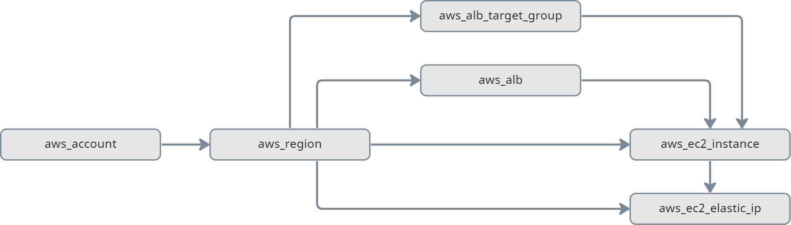
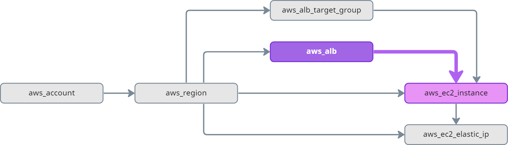
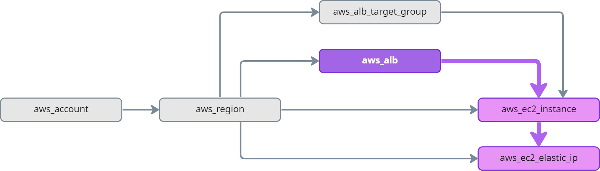
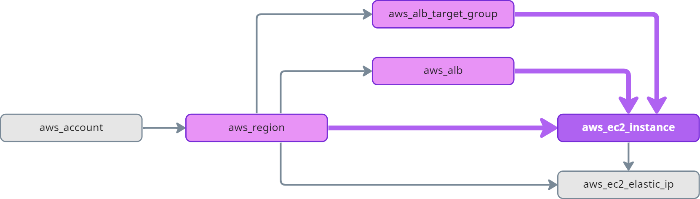
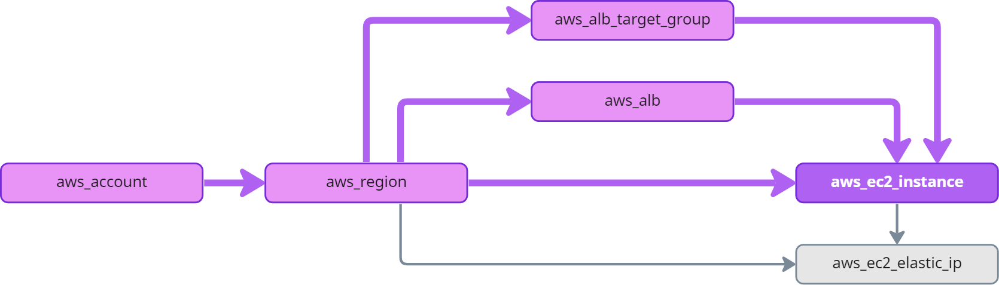

# Graph Edge

Nodes in the graph are connected via edges. Edges in the graph are directed, starting from a node pointing to a node.

In order to traverse the graph in a meaningful way, it is important to understand the structure of the graph. The following model is only a subset of the graph model you will find in Resoto, but illustrates how we can "walk" edges in the graph:

All of the resources in AWS are placed in a region. The region is one node in the graph.

If we want to find all resources in the graph, we need to walk _outbound_ (following the edges in direction of the arrow).

If we want to know the account of a specific resource, we need to walk _inbound_ (following the edge in reverse direction of the arrow) in the graph until we find an account.

## Edge Traversal Terminology

In Resoto and this documentation you will find four terms that we use to describe traversals on inbound and outbound edges from and to nodes. You can learn more about the [traversal commands here](../../reference/search/traversals#commands).

In the following examples we always use _one node_ as the _current node_. This is depending on the selection or search, it could also be _multiple nodes_.

## Outbound

### Successors

These are nodes that are **directly** connected to the current node in an **outbound** direction. Example: _aws_alb_ is selected. The next level of outbound node includes _aws_ec2_instance_.

aws_ec2_instance is a **successor** of aws_alb.

### Descendants

These are nodes that are connected to the current node in an **outbound** direction on any depth level. Example: _aws_alb_ is selected. Any node connected to this outbound on any level of depth is it's ancestor.

aws_ec2_instance and aws_ec2_elastic_ip are **ancestors** of aws_alb.

## Inbound

### Predecessors

These are nodes that are **directly** connected to the current node in an **inbound** direction. Example: _aws_ec2_instance_ is selected. The next level of inbound nodes includes _aws_region_, _aws_alb_ and _aws_alb_target_group_.

aws_region, aws_alb, and aws_alb_target_group are **predecessors** of aws_ec2_instance.

### Ancestors

These are nodes that are connected to the current node in an **inbound** direction on any depth level. Example: _aws_ec2_instance_ is selected. Any node connected to this inbound on any level of depth is it's ancestor.

aws_region, aws_alb, aws_alb_target_group, and aws_account are **ancestors** of aws_ec2_instance.
