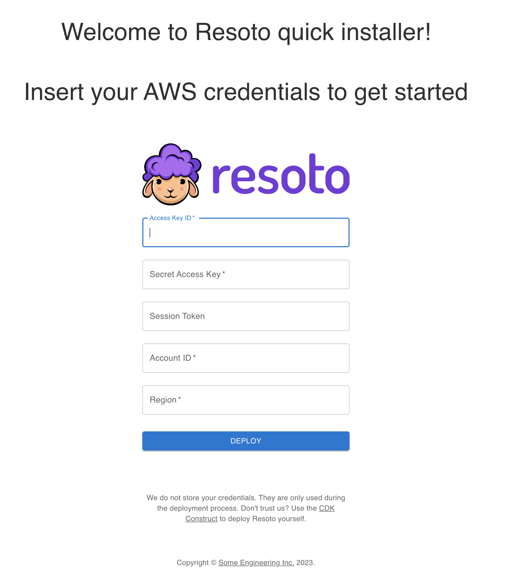
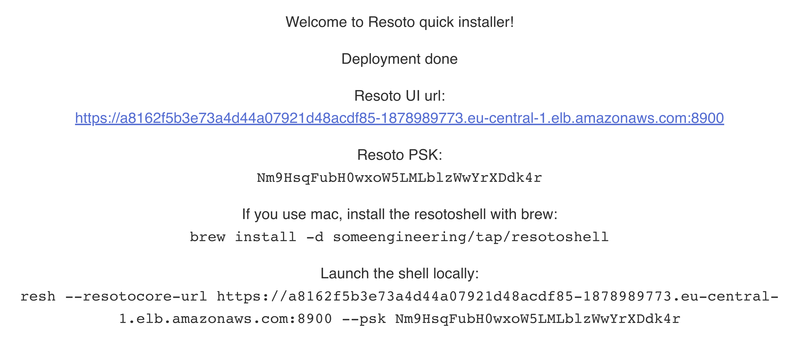
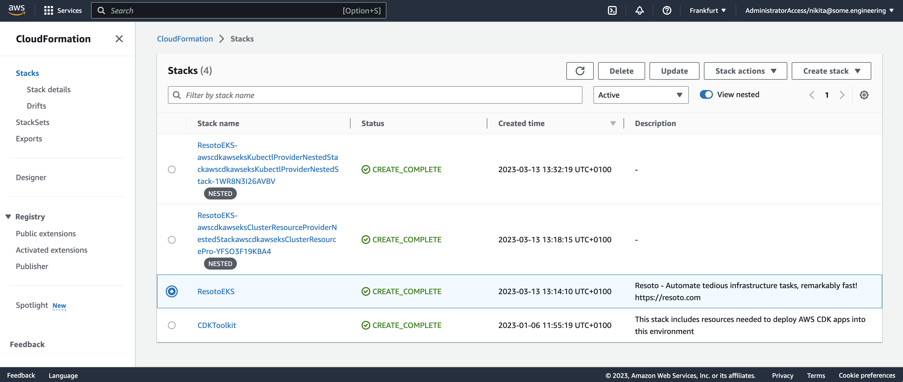

# Deploy Resoto to Amazon Web Services Using the Resoto Web Installer

We provide a web installer for one-click deployment of Resoto to <abbr title="Amazon Web Services">AWS</abbr>.

:::tip

When deploying Resoto, we only use provided AWS credentials for the deployment. Credentials are not stored or retained after the deployment is complete.

If you are not comfortable sharing your credentials, you can alternatively use the [CDK construct](../cdk.md) to deploy Resoto.

:::

## Deploying Resoto

1. Open the [Resoto web installer](https://install.resoto.com).

2. Enter your AWS credentials.

   

3. Wait until the deployment process is complete.

   

4. Once the deployment is successful, take note of the credentials required to connect to your Resoto cluster. Please keep them in a safe place as they will not be displayed again.

   

## Removing the Resoto Deployment

To remove the Resoto deployment and all associated resources:

1. Open the AWS console.

2. Select the region where you deployed Resoto, and open the CloudFormation service.

3. Select the `ResotoEKS` stack and click **Delete** button.

   

:::warning

Removing the Resoto stack will also delete all data stored in the Resoto database.

:::
