# How to Export Data to Google Sheets

This how-to guide creates a chart in Google Sheets depicting the distribution of storage across accounts:

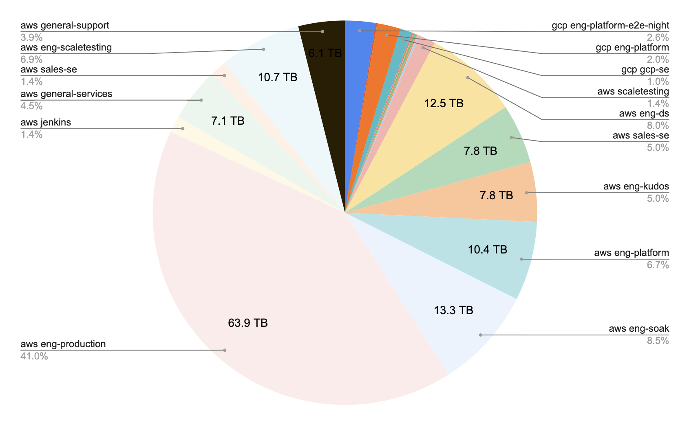

We will first perform a search that aggregates all storage volumes across all clouds and accounts and returns the total size of all volumes per account. We will then pipe the aggregated result into the [`format` command](../../../reference/cli/format-commands/format.md) to flatten the data into rows and columns, and export the data as a CSV file. Finally, we will import the CSV-format data into Google Sheets and create a pie chart.

## Prerequisites

This guide assumes that you have already [installed](../../../getting-started/install-resoto/index.md) and configured Resoto to [collect your cloud resources](../../../getting-started/configure-cloud-provider-access/index.md).

## Directions

1. Execute the following [aggregate search](../../../reference/search/aggregation.md) in [Resoto Shell](../../../reference/components/shell.md):

   ```bash
   > search aggregate(/ancestors.cloud.reported.name as cloud, /ancestors.account.reported.name as account: sum(volume_size * 1024 * 1024 * 1024) as volume_bytes): is(volume)
   # highlight-start
   ​---
   ​group:
   ​  cloud: aws
   ​  account: sales-demo
   ​volume_bytes: 2123861327872
   ​
   ​---
   ​group:
   ​  cloud: aws
   ​  account: eng-scaletesting
   ​volume_bytes: 10733123272704
   ​
   ​---
   ​group:
   ​  cloud: aws
   ​  account: general-support
   ​volume_bytes: 6096706076672
   # highlight-end
   ```

2. Next, pipe the search result into the [`format `command](../../../reference/cli/format-commands/format.md) to flatten it into rows and columns:

   ```bash
   > search aggregate(/ancestors.cloud.reported.name as cloud, /ancestors.account.reported.name as account: sum(volume_size * 1024 * 1024 * 1024) as volume_bytes): is(volume) | format {/group.cloud} {/group.account},{/volume_bytes}
   # highlight-start
   ​cloud,account,volume_bytes
   ​aws,sales-demo,2123861327872
   ​aws,eng-scaletesting,10733123272704
   ​aws,general-support,6096706076672
   # highlight-end
   ```

3. Then, use the [`write` command](.././../../reference/cli/miscellaneous-commands/write.md) to output the data to a CSV file on our local disk:

   ```bash
   > search aggregate(/ancestors.cloud.reported.name as cloud, /ancestors.account.reported.name as account: sum(volume_size * 1024 * 1024 * 1024) as volume_bytes): is(volume) | format {/group.cloud} {/group.account},{/volume_bytes} | write storage.csv
   # highlight-next-line
   ​Received a file storage.csv, which is stored to ./storage.csv.
   ```

   The resulting CSV now contains a list of cloud providers and their associated account names and storage sizes:

   ```csv title="storage.csv"
   gcp eng-platform-e2e-night,4006130745344
   gcp maestro-124419,183609851904
   gcp sre-tests,10737418240
   gcp kubecon-demo,10737418240
   gcp eng-platform,3081639034880
   gcp gcp-se,1501091069952
   gcp support,63350767616
   digitalocean 10225075,185757335552
   aws eng-testmatrix,42949672960
   aws eng-devprod,309237645312
   aws eng-qualification,214748364800
   aws eng-sre,8589934592
   aws eng-insights,268435456000
   aws scaletesting,2194728288256
   aws eng-ds,12474732511232
   aws sales-se,7816840478720
   aws eng-kudos,7823282929664
   aws eng-platform,10393820856320
   aws eng-soak,13278965137408
   aws eng-production,63944546844672
   aws jenkins,2164663517184
   aws general-services,7095285972992
   aws sales-se,2123861327872
   aws eng-scaletesting,10733123272704
   aws general-support,6096706076672
   ```

4. [Create a new Google Sheet](https://docs.google.com/spreadsheets/u/0/create).

5. Open **Import** from the **File** menu and select the **Upload** tab:

   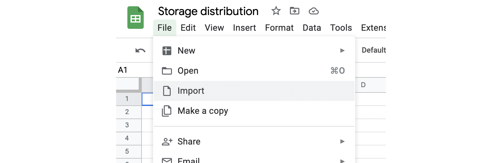

6. Drag and drop the `storage.csv` file generated in step 3 into the **Import file** dialog:

   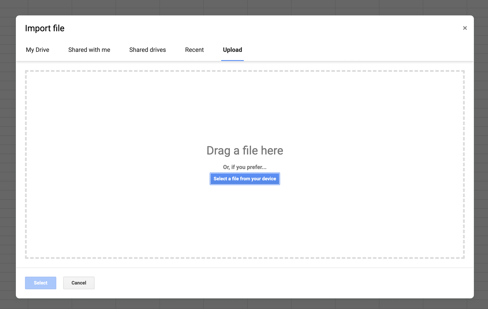

7. Select **Replace current sheet** and click **Import data**:

   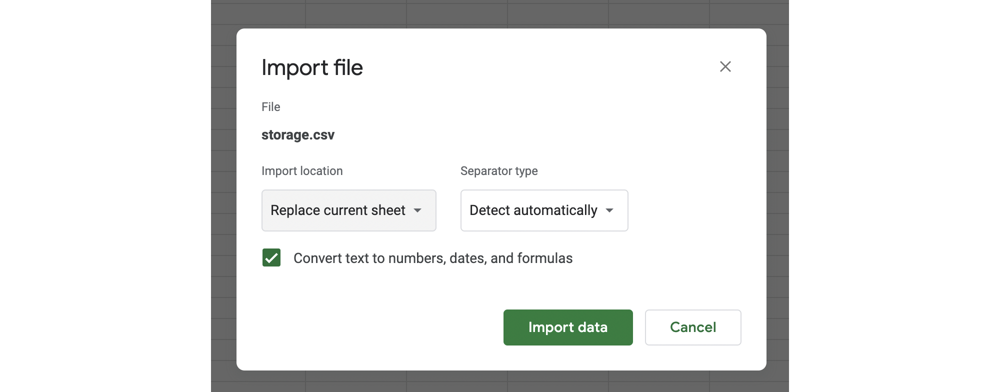

   The imported data will be displayed in the sheet:

   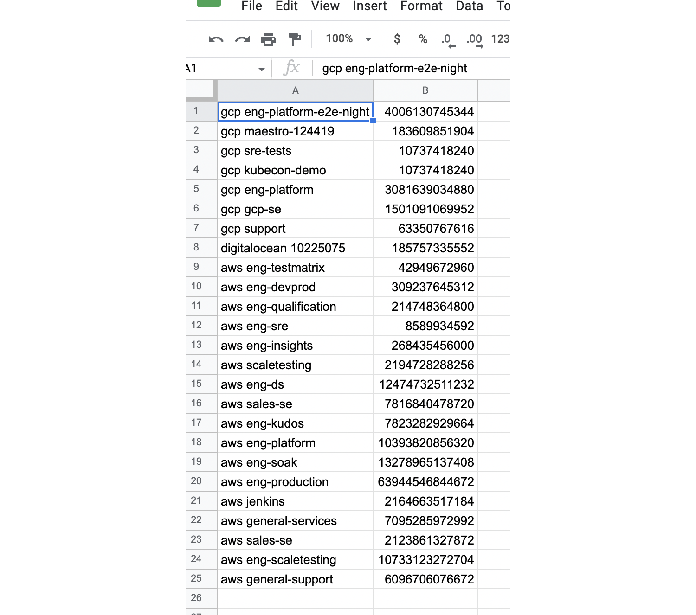

8. Select column B:

   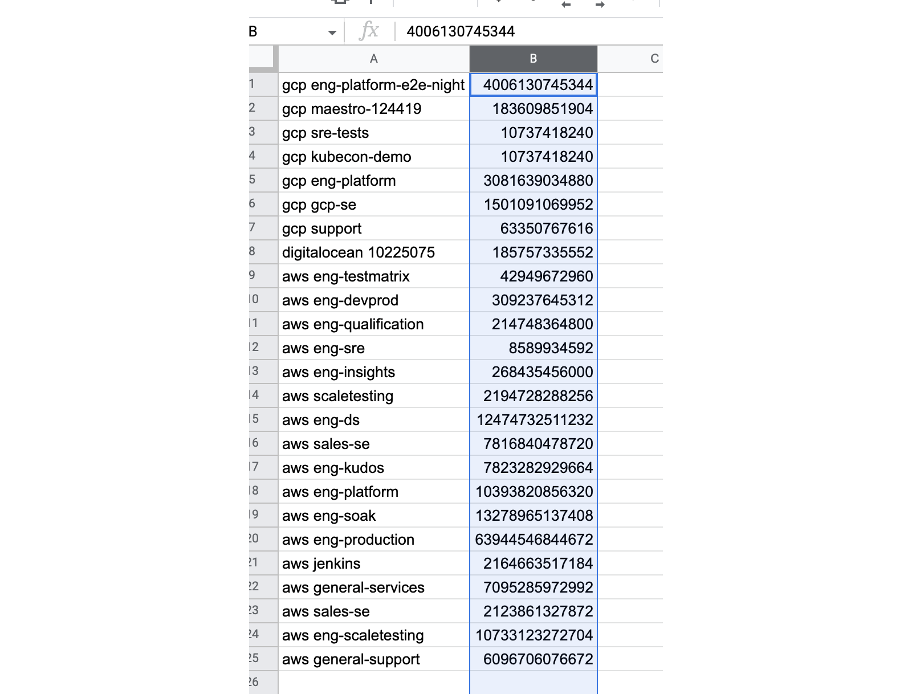

9. In the **Format** menu, select **Number > Custom number format**:

   

10. Enter `[<1000000000]0.00,," MB";[<1000000000000]0.0,,," GB";0.0,,,," TB"` and click **Apply**:

    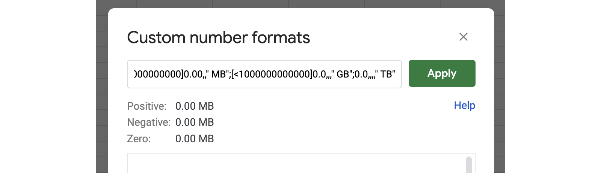

    The size column should now be formatted as MB, GB, or TB:

    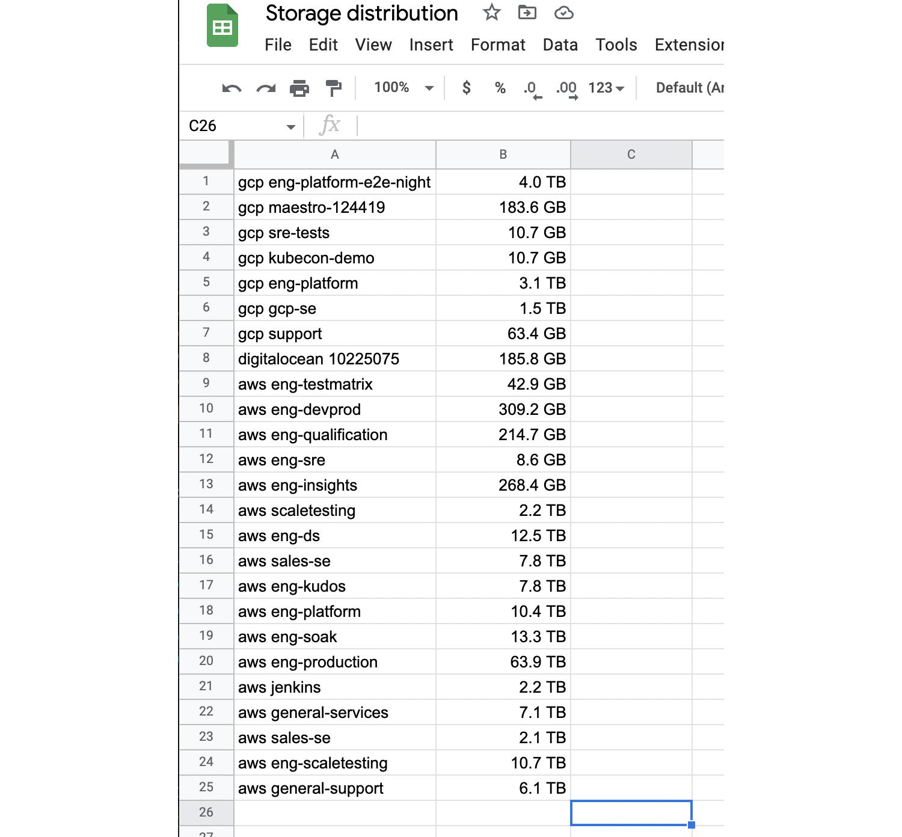

11. Select both columns A and B:

    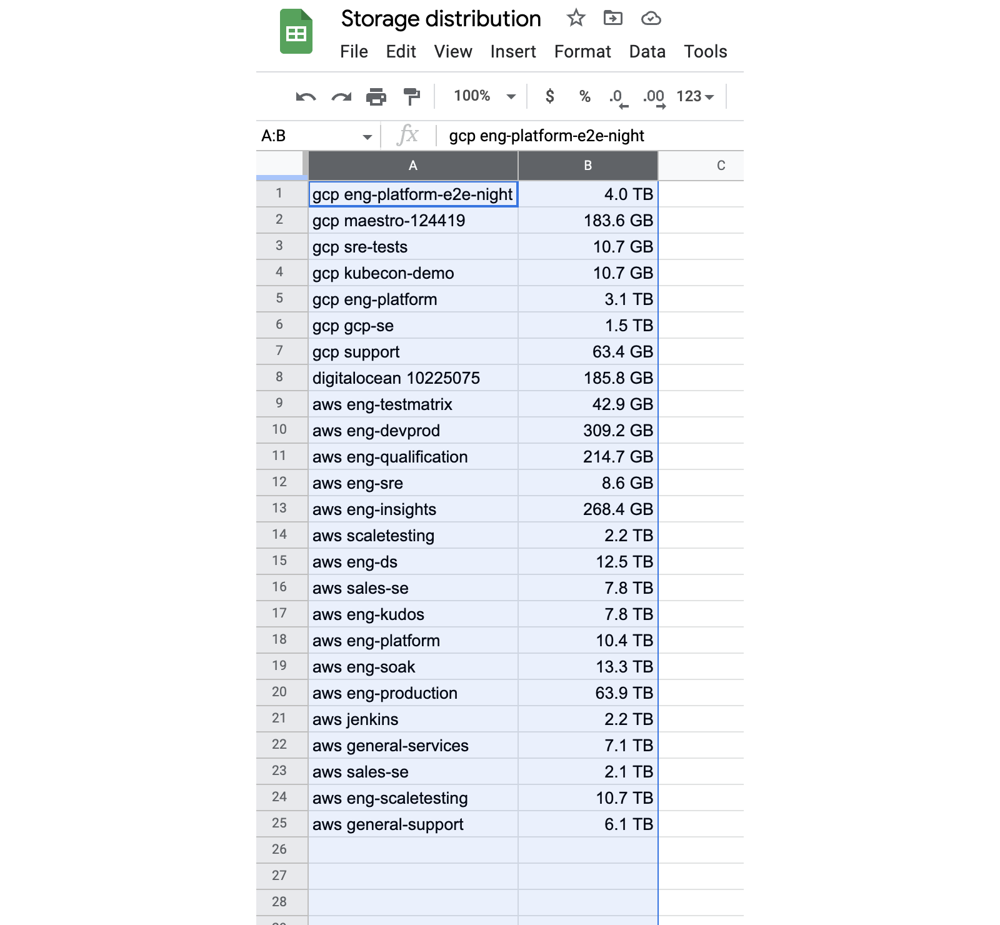

12. In the **Insert** menu, select **Chart**:

    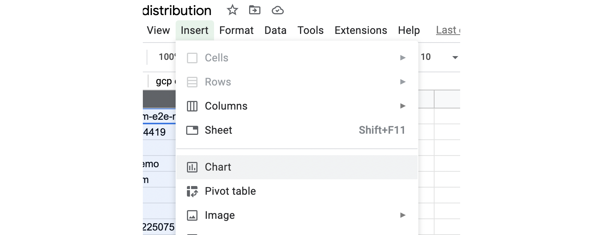

13. Double-click on the new chart object to open its settings. In the **Setup** tab, select **Pie** for **Chart type**:

    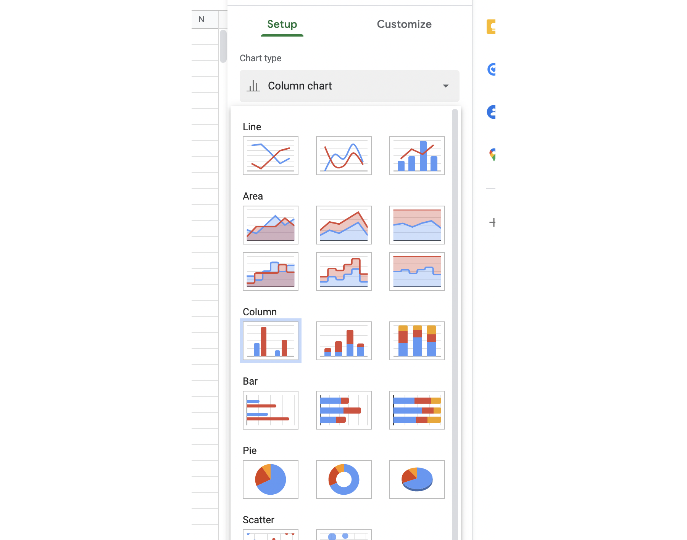

14. In the **Customize** tab, expand **Pie chart** and select **Value** for **Slice label**:

    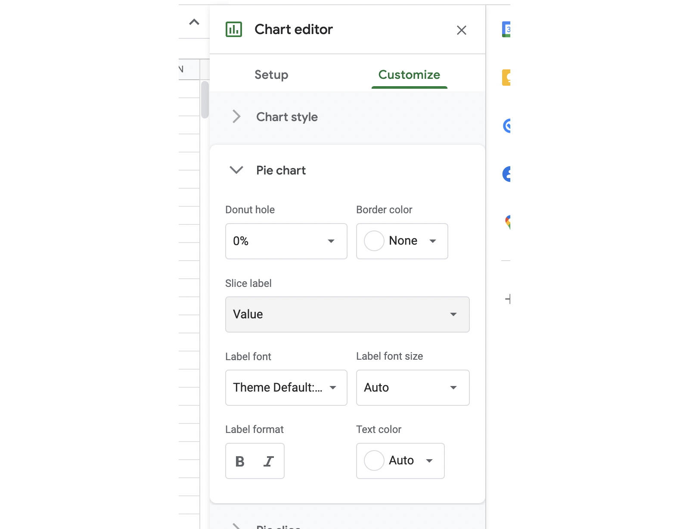

We now have a chart showing how storage usage is distributed between cloud accounts:


## Further Reading

- [Search](../../../reference/search/index.md)
- [Command-Line Interface](../../../reference/cli/index.md)
