# Amazon Web Services Resource Data Models

```mdx-code-block
import ZoomPanPinch from '@site/src/components/ZoomPanPinch';
```

:::info

Please refer to [Configure Amazon Web Services Access](../../../getting-started/configure-cloud-provider-access/aws.md) for details on how to set up Resoto to collect [Amazon Web Services (AWS)](https://aws.amazon.com) resources.

:::

## `aws_account`

<ZoomPanPinch>

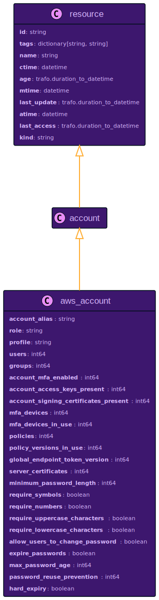

</ZoomPanPinch>

<details>
<summary>Relationship to Other Resources</summary>
<div>
<ZoomPanPinch>

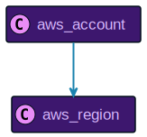

</ZoomPanPinch>
</div>
</details>

## `aws_alb`

<ZoomPanPinch>

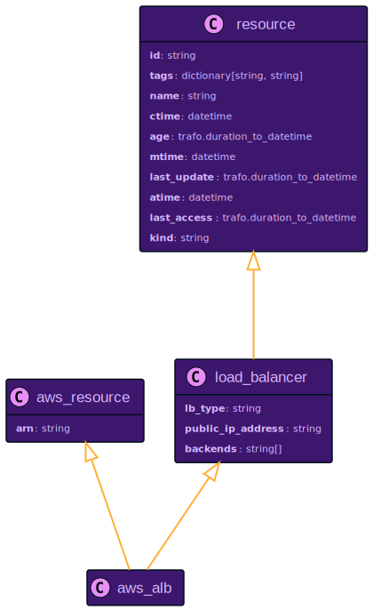

</ZoomPanPinch>

<details>
<summary>Relationship to Other Resources</summary>
<div>
<ZoomPanPinch>

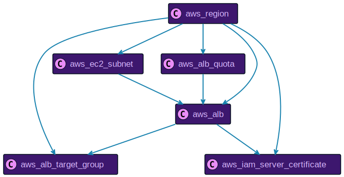

</ZoomPanPinch>
</div>
</details>

## `aws_alb_quota`

<ZoomPanPinch>

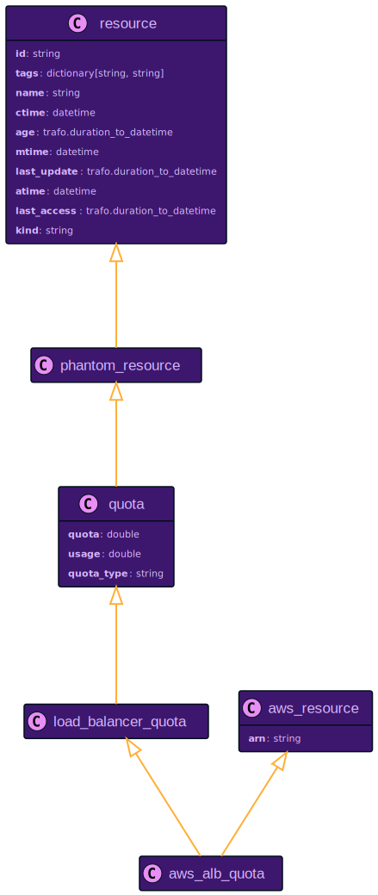

</ZoomPanPinch>

<details>
<summary>Relationship to Other Resources</summary>
<div>
<ZoomPanPinch>

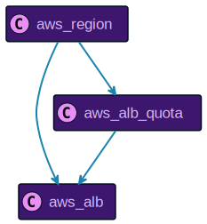

</ZoomPanPinch>
</div>
</details>

## `aws_alb_target_group`

<ZoomPanPinch>

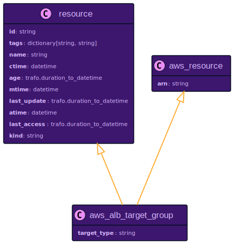

</ZoomPanPinch>

<details>
<summary>Relationship to Other Resources</summary>
<div>
<ZoomPanPinch>

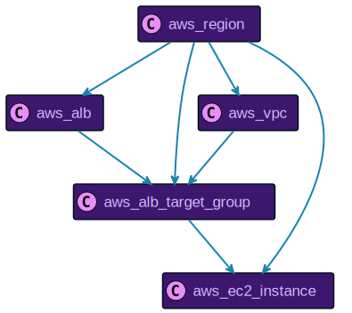

</ZoomPanPinch>
</div>
</details>

## `aws_autoscaling_group`

<ZoomPanPinch>

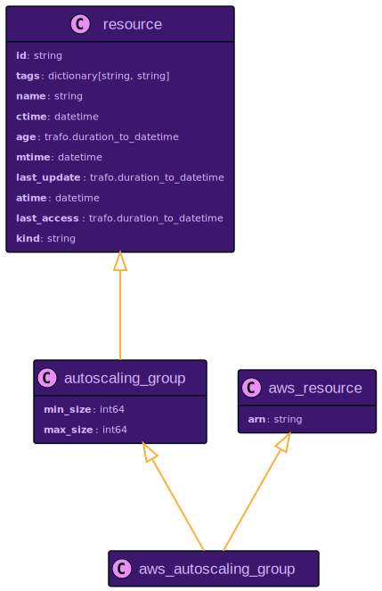

</ZoomPanPinch>

<details>
<summary>Relationship to Other Resources</summary>
<div>
<ZoomPanPinch>

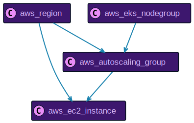

</ZoomPanPinch>
</div>
</details>

## `aws_cloudformation_stack`

<ZoomPanPinch>

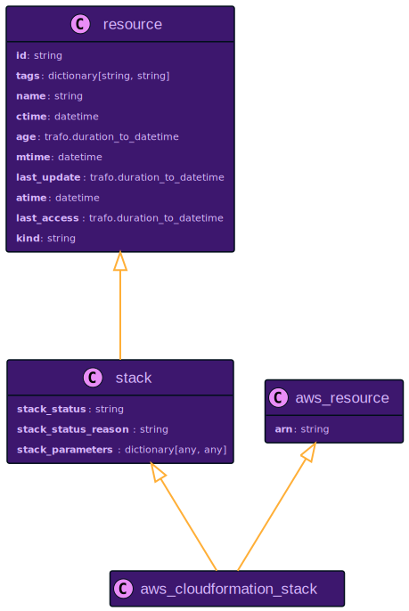

</ZoomPanPinch>

<details>
<summary>Relationship to Other Resources</summary>
<div>
<ZoomPanPinch>


</ZoomPanPinch>
</div>
</details>

## `aws_cloudformation_stack_set`

<ZoomPanPinch>

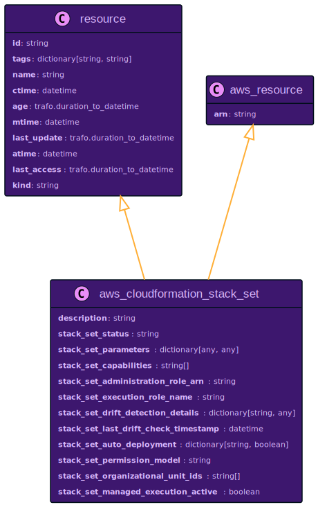

</ZoomPanPinch>

<details>
<summary>Relationship to Other Resources</summary>
<div>
<ZoomPanPinch>

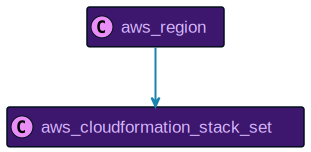

</ZoomPanPinch>
</div>
</details>

## `aws_cloudwatch_alarm`

<ZoomPanPinch>

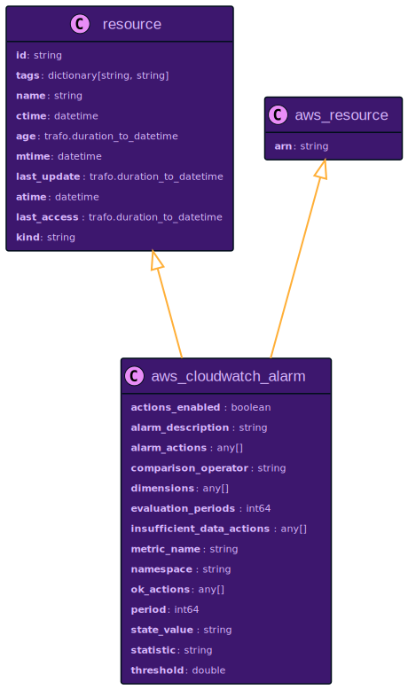

</ZoomPanPinch>

<details>
<summary>Relationship to Other Resources</summary>
<div>
<ZoomPanPinch>

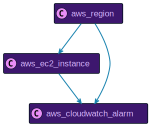

</ZoomPanPinch>
</div>
</details>

## `aws_ec2_elastic_ip`

<ZoomPanPinch>

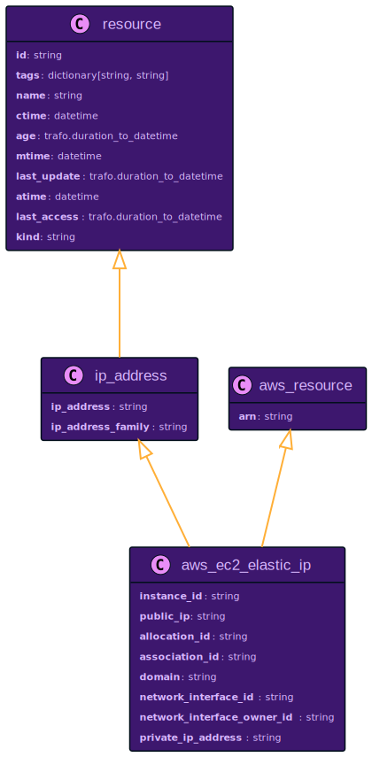

</ZoomPanPinch>

<details>
<summary>Relationship to Other Resources</summary>
<div>
<ZoomPanPinch>

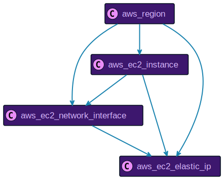

</ZoomPanPinch>
</div>
</details>

## `aws_ec2_instance`

<ZoomPanPinch>

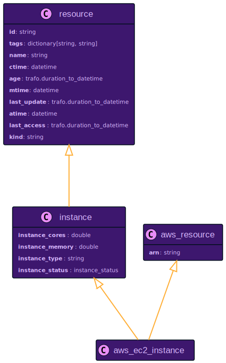

</ZoomPanPinch>

<details>
<summary>Relationship to Other Resources</summary>
<div>
<ZoomPanPinch>

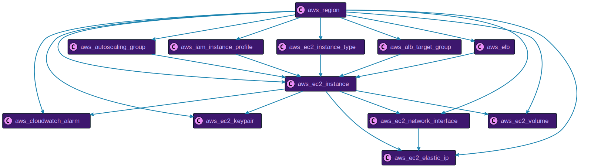

</ZoomPanPinch>
</div>
</details>

## `aws_ec2_instance_quota`

<ZoomPanPinch>

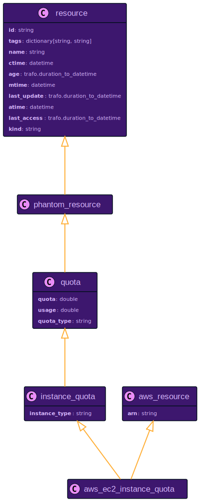

</ZoomPanPinch>

<details>
<summary>Relationship to Other Resources</summary>
<div>
<ZoomPanPinch>

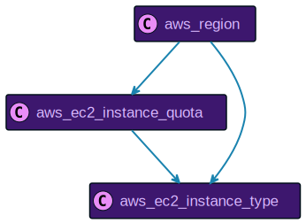

</ZoomPanPinch>
</div>
</details>

## `aws_ec2_instance_type`

<ZoomPanPinch>

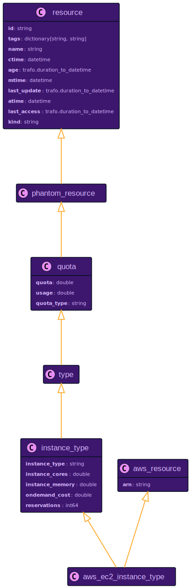

</ZoomPanPinch>

<details>
<summary>Relationship to Other Resources</summary>
<div>
<ZoomPanPinch>

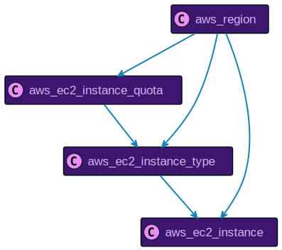

</ZoomPanPinch>
</div>
</details>

## `aws_ec2_internet_gateway`

<ZoomPanPinch>


</ZoomPanPinch>

<details>
<summary>Relationship to Other Resources</summary>
<div>
<ZoomPanPinch>

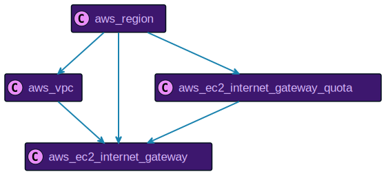

</ZoomPanPinch>
</div>
</details>

## `aws_ec2_internet_gateway_quota`

<ZoomPanPinch>


</ZoomPanPinch>

<details>
<summary>Relationship to Other Resources</summary>
<div>
<ZoomPanPinch>

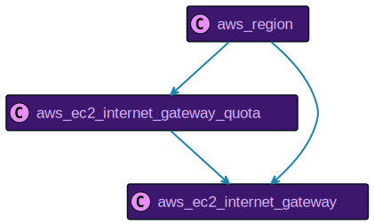

</ZoomPanPinch>
</div>
</details>

## `aws_ec2_keypair`

<ZoomPanPinch>

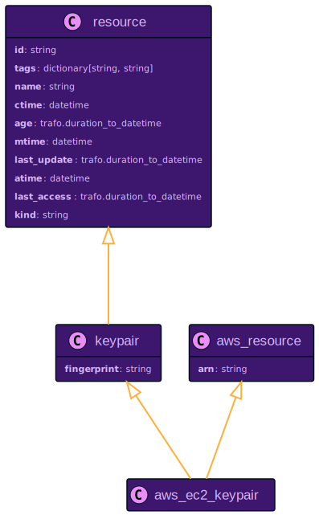

</ZoomPanPinch>

<details>
<summary>Relationship to Other Resources</summary>
<div>
<ZoomPanPinch>

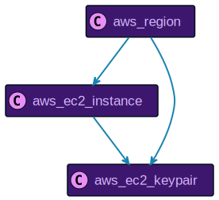

</ZoomPanPinch>
</div>
</details>

## `aws_ec2_nat_gateway`

<ZoomPanPinch>

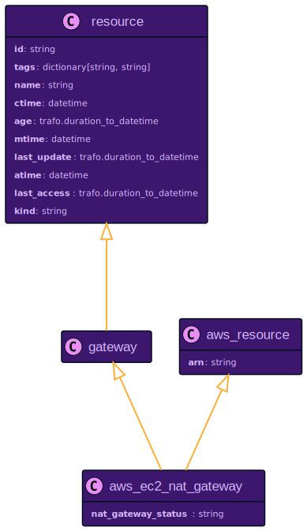

</ZoomPanPinch>

<details>
<summary>Relationship to Other Resources</summary>
<div>
<ZoomPanPinch>

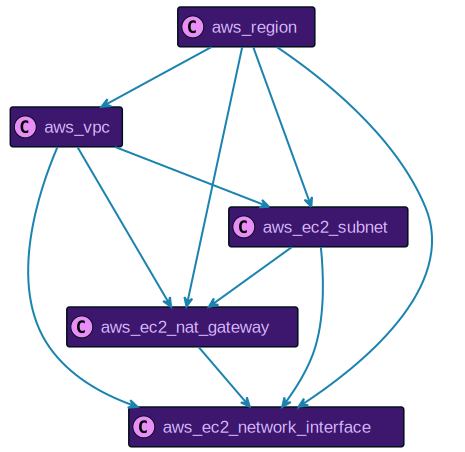

</ZoomPanPinch>
</div>
</details>

## `aws_ec2_network_acl`

<ZoomPanPinch>

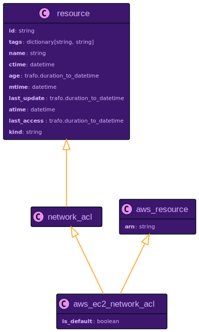

</ZoomPanPinch>

<details>
<summary>Relationship to Other Resources</summary>
<div>
<ZoomPanPinch>


</ZoomPanPinch>
</div>
</details>

## `aws_ec2_network_interface`

<ZoomPanPinch>

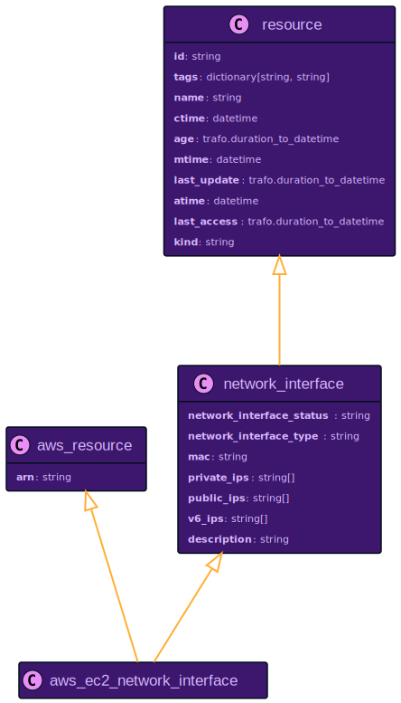

</ZoomPanPinch>

<details>
<summary>Relationship to Other Resources</summary>
<div>
<ZoomPanPinch>

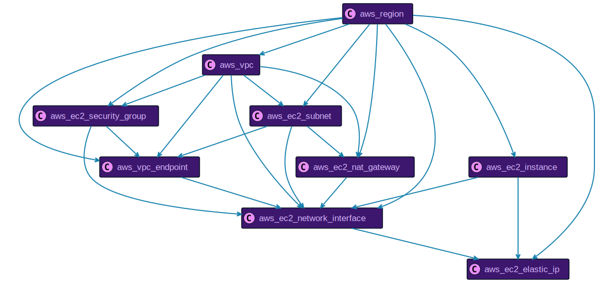

</ZoomPanPinch>
</div>
</details>

## `aws_ec2_route_table`

<ZoomPanPinch>

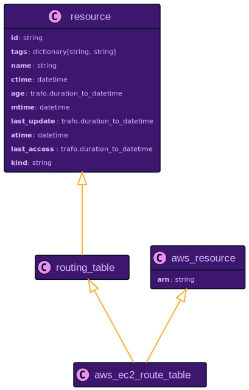

</ZoomPanPinch>

<details>
<summary>Relationship to Other Resources</summary>
<div>
<ZoomPanPinch>

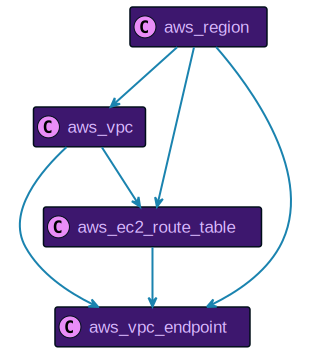

</ZoomPanPinch>
</div>
</details>

## `aws_ec2_security_group`

<ZoomPanPinch>

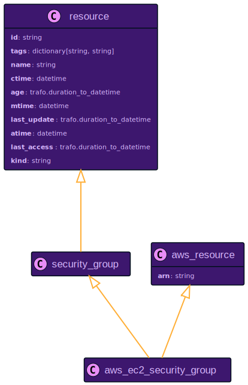

</ZoomPanPinch>

<details>
<summary>Relationship to Other Resources</summary>
<div>
<ZoomPanPinch>

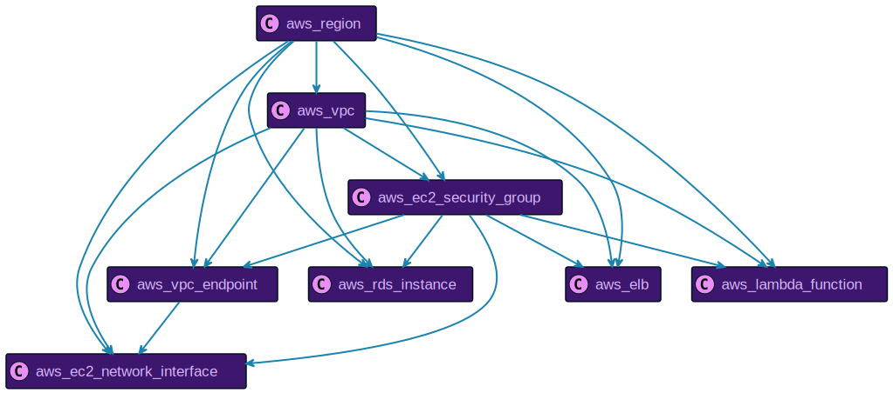

</ZoomPanPinch>
</div>
</details>

## `aws_ec2_snapshot`

<ZoomPanPinch>

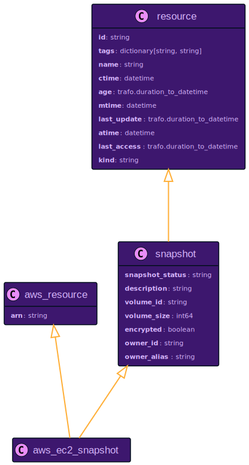

</ZoomPanPinch>

<details>
<summary>Relationship to Other Resources</summary>
<div>
<ZoomPanPinch>


</ZoomPanPinch>
</div>
</details>

## `aws_ec2_subnet`

<ZoomPanPinch>

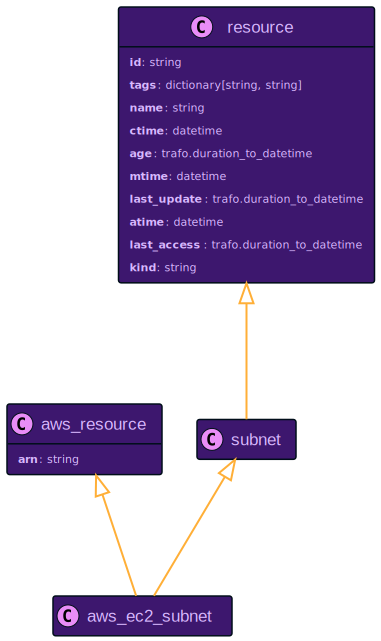

</ZoomPanPinch>

<details>
<summary>Relationship to Other Resources</summary>
<div>
<ZoomPanPinch>

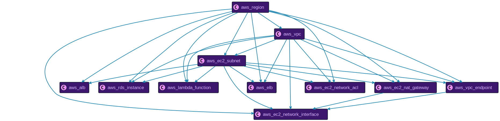

</ZoomPanPinch>
</div>
</details>

## `aws_ec2_volume`

<ZoomPanPinch>

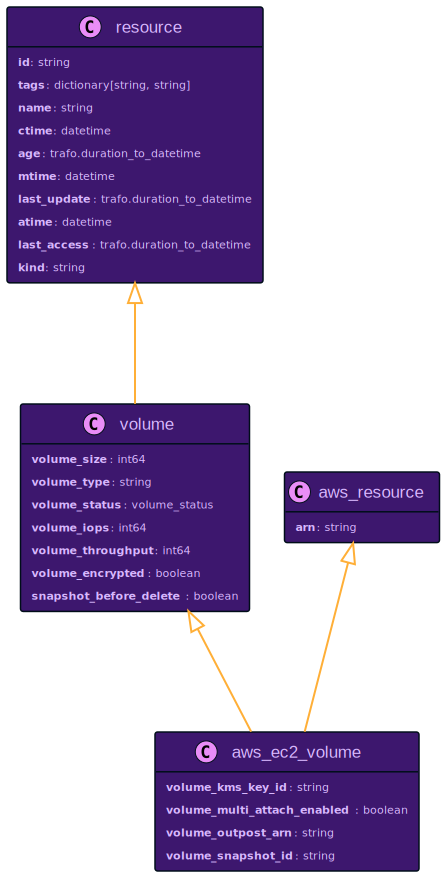

</ZoomPanPinch>

<details>
<summary>Relationship to Other Resources</summary>
<div>
<ZoomPanPinch>

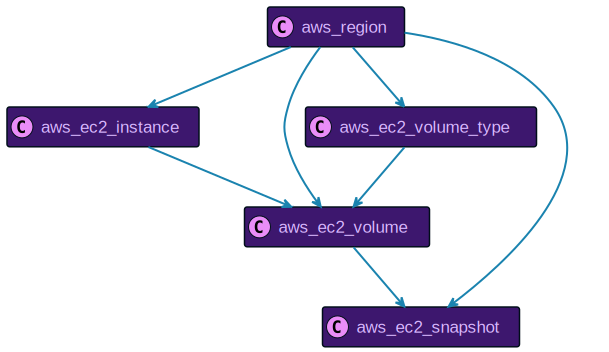

</ZoomPanPinch>
</div>
</details>

## `aws_ec2_volume_type`

<ZoomPanPinch>

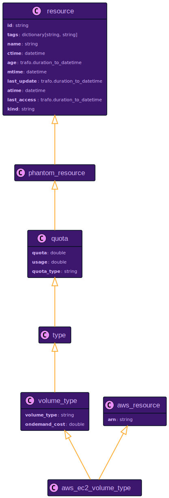

</ZoomPanPinch>

<details>
<summary>Relationship to Other Resources</summary>
<div>
<ZoomPanPinch>

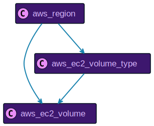

</ZoomPanPinch>
</div>
</details>

## `aws_eks_cluster`

<ZoomPanPinch>

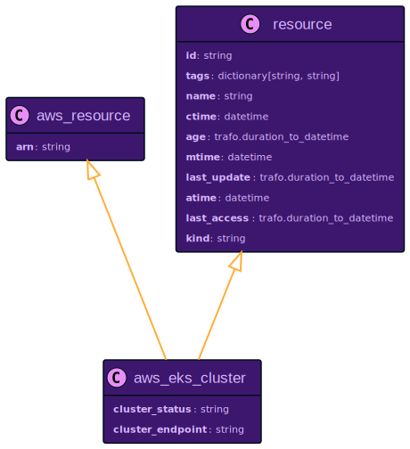

</ZoomPanPinch>

<details>
<summary>Relationship to Other Resources</summary>
<div>
<ZoomPanPinch>

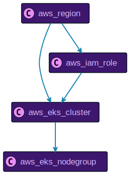

</ZoomPanPinch>
</div>
</details>

## `aws_eks_nodegroup`

<ZoomPanPinch>

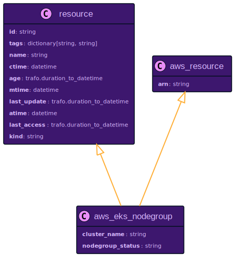

</ZoomPanPinch>

<details>
<summary>Relationship to Other Resources</summary>
<div>
<ZoomPanPinch>

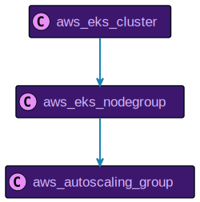

</ZoomPanPinch>
</div>
</details>

## `aws_elb`

<ZoomPanPinch>


</ZoomPanPinch>

<details>
<summary>Relationship to Other Resources</summary>
<div>
<ZoomPanPinch>

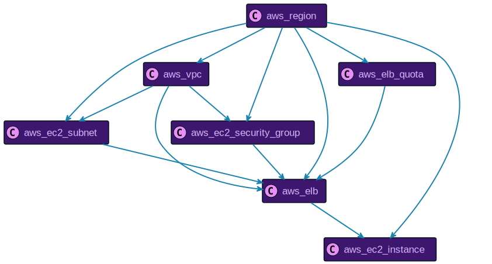

</ZoomPanPinch>
</div>
</details>

## `aws_elb_quota`

<ZoomPanPinch>

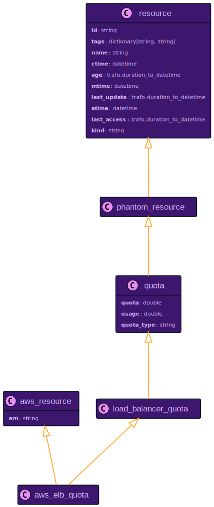

</ZoomPanPinch>

<details>
<summary>Relationship to Other Resources</summary>
<div>
<ZoomPanPinch>

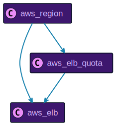

</ZoomPanPinch>
</div>
</details>

## `aws_iam_access_key`

<ZoomPanPinch>

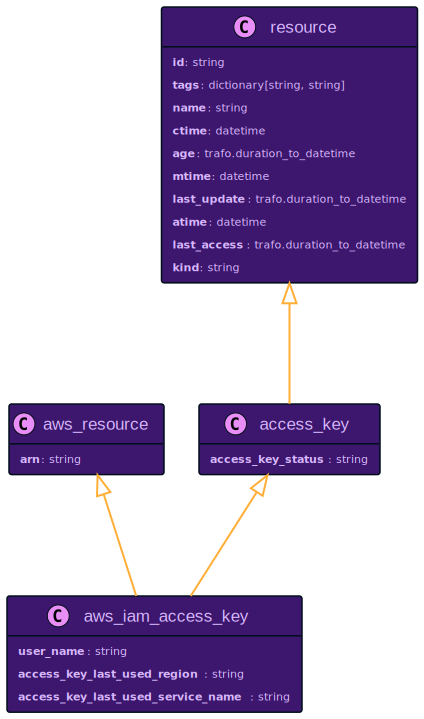

</ZoomPanPinch>

<details>
<summary>Relationship to Other Resources</summary>
<div>
<ZoomPanPinch>

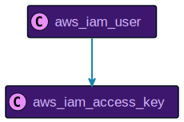

</ZoomPanPinch>
</div>
</details>

## `aws_iam_group`

<ZoomPanPinch>

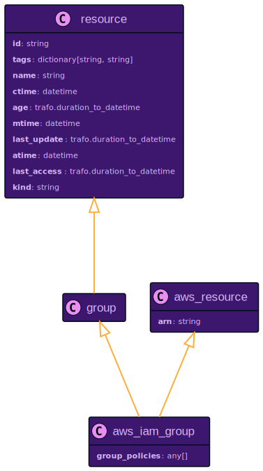

</ZoomPanPinch>

<details>
<summary>Relationship to Other Resources</summary>
<div>
<ZoomPanPinch>

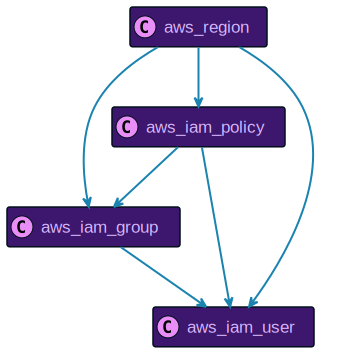

</ZoomPanPinch>
</div>
</details>

## `aws_iam_instance_profile`

<ZoomPanPinch>

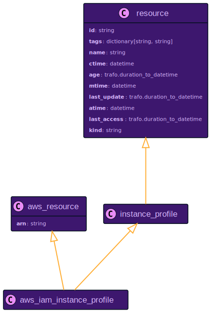

</ZoomPanPinch>

<details>
<summary>Relationship to Other Resources</summary>
<div>
<ZoomPanPinch>

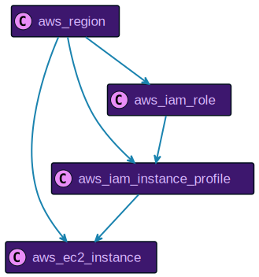

</ZoomPanPinch>
</div>
</details>

## `aws_iam_policy`

<ZoomPanPinch>

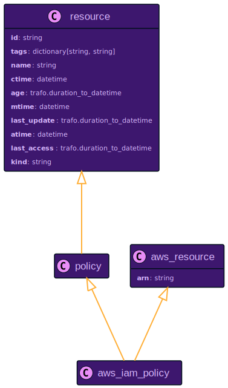

</ZoomPanPinch>

<details>
<summary>Relationship to Other Resources</summary>
<div>
<ZoomPanPinch>

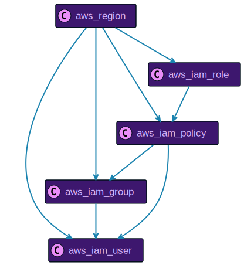

</ZoomPanPinch>
</div>
</details>

## `aws_iam_role`

<ZoomPanPinch>

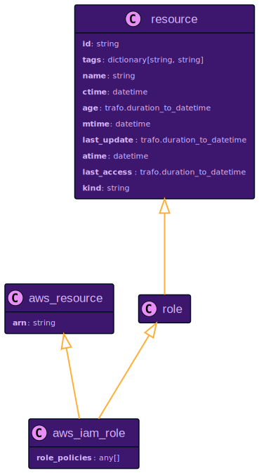

</ZoomPanPinch>

<details>
<summary>Relationship to Other Resources</summary>
<div>
<ZoomPanPinch>

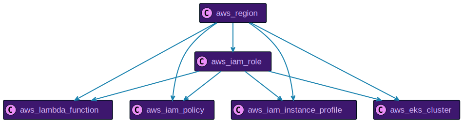

</ZoomPanPinch>
</div>
</details>

## `aws_iam_server_certificate`

<ZoomPanPinch>


</ZoomPanPinch>

<details>
<summary>Relationship to Other Resources</summary>
<div>
<ZoomPanPinch>

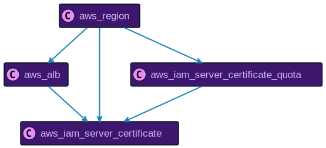

</ZoomPanPinch>
</div>
</details>

## `aws_iam_server_certificate_quota`

<ZoomPanPinch>

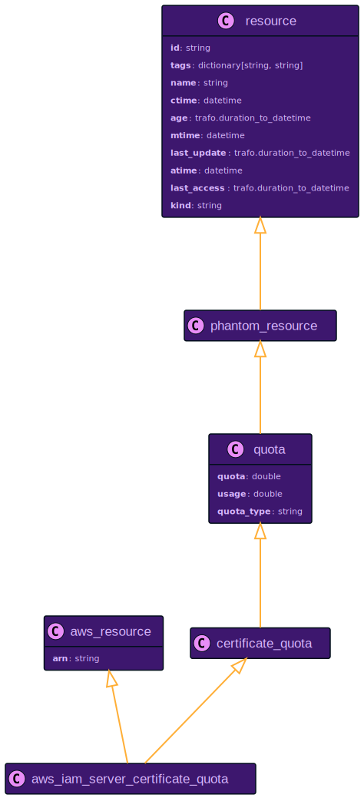

</ZoomPanPinch>

<details>
<summary>Relationship to Other Resources</summary>
<div>
<ZoomPanPinch>

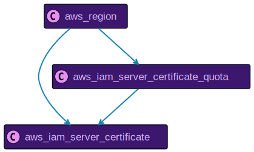

</ZoomPanPinch>
</div>
</details>

## `aws_iam_user`

<ZoomPanPinch>

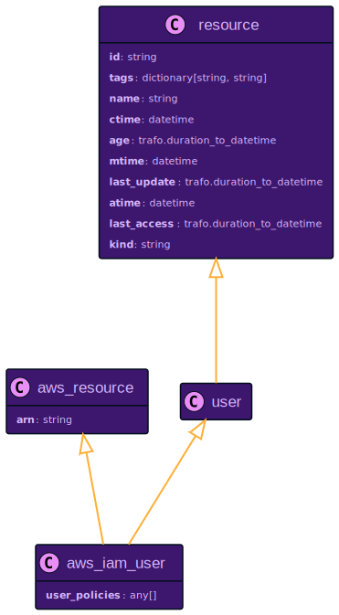

</ZoomPanPinch>

<details>
<summary>Relationship to Other Resources</summary>
<div>
<ZoomPanPinch>

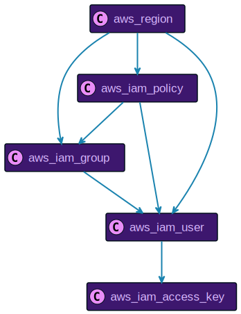

</ZoomPanPinch>
</div>
</details>

## `aws_lambda_function`

<ZoomPanPinch>

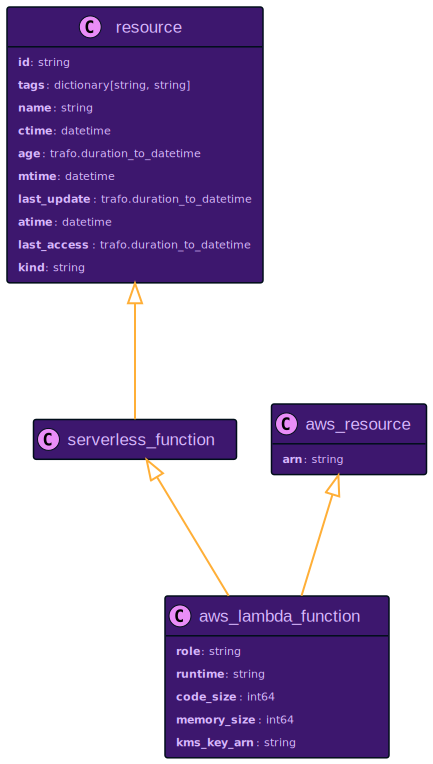

</ZoomPanPinch>

<details>
<summary>Relationship to Other Resources</summary>
<div>
<ZoomPanPinch>

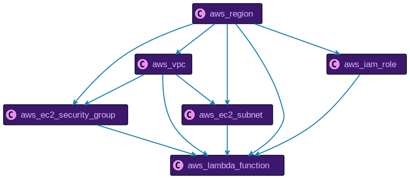

</ZoomPanPinch>
</div>
</details>

## `aws_rds_instance`

<ZoomPanPinch>

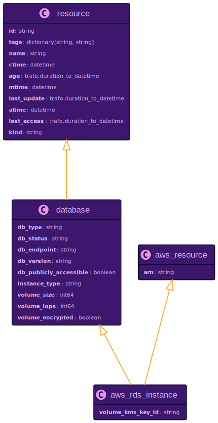

</ZoomPanPinch>

<details>
<summary>Relationship to Other Resources</summary>
<div>
<ZoomPanPinch>

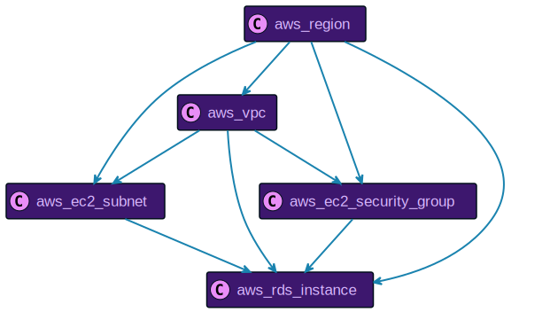

</ZoomPanPinch>
</div>
</details>

## `aws_region`

<ZoomPanPinch>

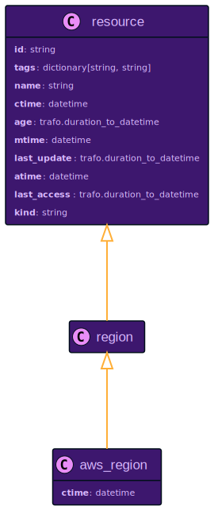

</ZoomPanPinch>

<details>
<summary>Relationship to Other Resources</summary>
<div>
<ZoomPanPinch>

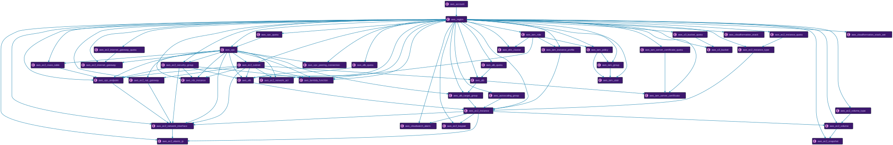

</ZoomPanPinch>
</div>
</details>

## `aws_route53_resource_record`

<ZoomPanPinch>

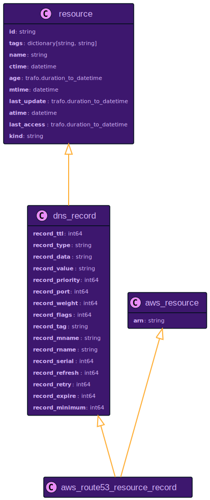

</ZoomPanPinch>

<details>
<summary>Relationship to Other Resources</summary>
<div>
<ZoomPanPinch>

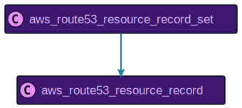

</ZoomPanPinch>
</div>
</details>

## `aws_route53_resource_record_set`

<ZoomPanPinch>

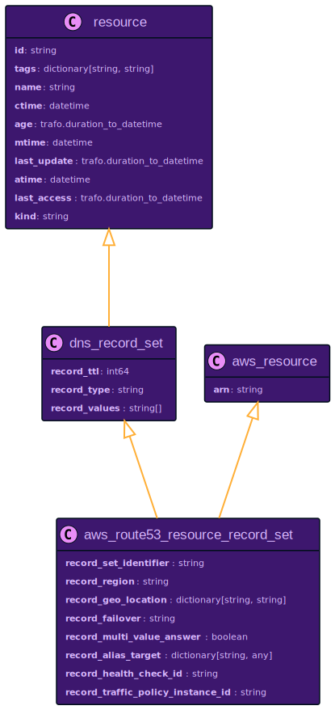

</ZoomPanPinch>

<details>
<summary>Relationship to Other Resources</summary>
<div>
<ZoomPanPinch>

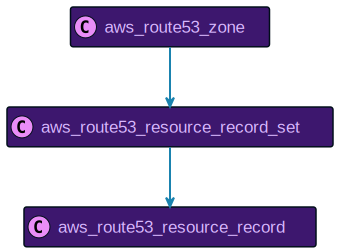

</ZoomPanPinch>
</div>
</details>

## `aws_route53_zone`

<ZoomPanPinch>

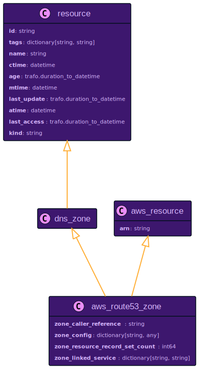

</ZoomPanPinch>

<details>
<summary>Relationship to Other Resources</summary>
<div>
<ZoomPanPinch>

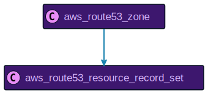

</ZoomPanPinch>
</div>
</details>

## `aws_s3_bucket`

<ZoomPanPinch>

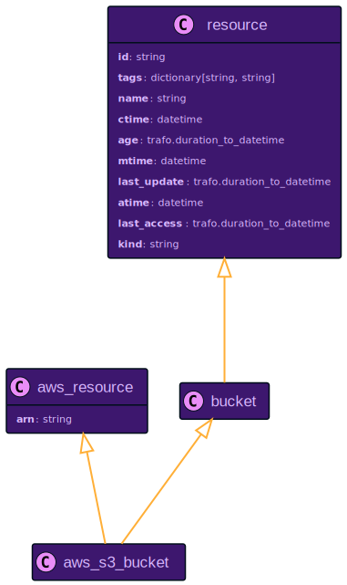

</ZoomPanPinch>

<details>
<summary>Relationship to Other Resources</summary>
<div>
<ZoomPanPinch>

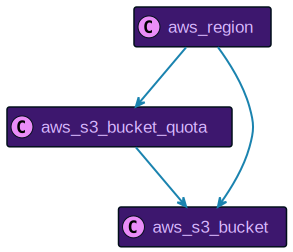

</ZoomPanPinch>
</div>
</details>

## `aws_s3_bucket_quota`

<ZoomPanPinch>

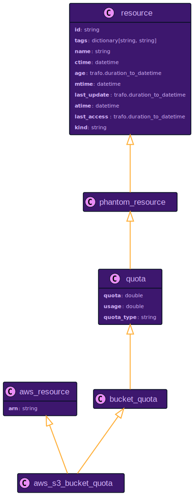

</ZoomPanPinch>

<details>
<summary>Relationship to Other Resources</summary>
<div>
<ZoomPanPinch>

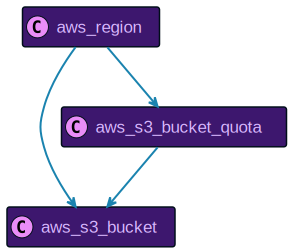

</ZoomPanPinch>
</div>
</details>

## `aws_vpc`

<ZoomPanPinch>

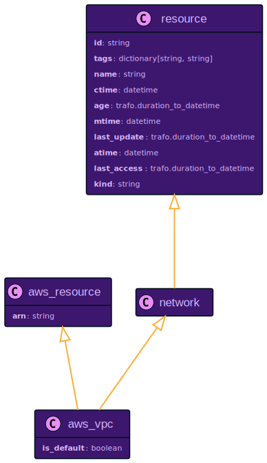

</ZoomPanPinch>

<details>
<summary>Relationship to Other Resources</summary>
<div>
<ZoomPanPinch>

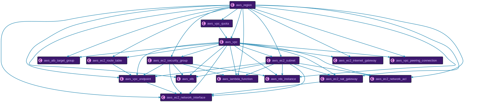

</ZoomPanPinch>
</div>
</details>

## `aws_vpc_endpoint`

<ZoomPanPinch>

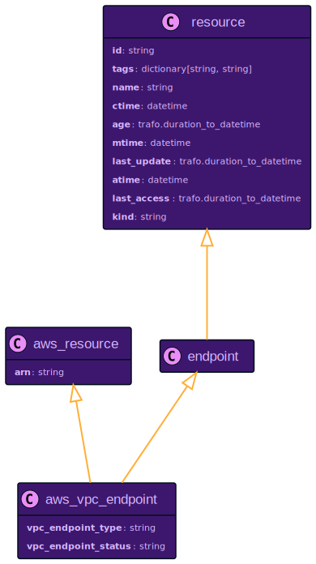

</ZoomPanPinch>

<details>
<summary>Relationship to Other Resources</summary>
<div>
<ZoomPanPinch>

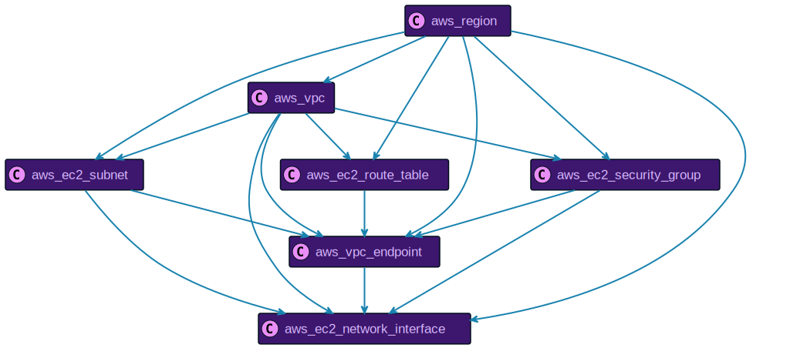

</ZoomPanPinch>
</div>
</details>

## `aws_vpc_peering_connection`

<ZoomPanPinch>

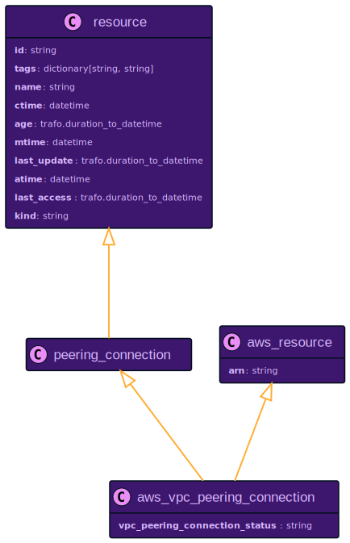

</ZoomPanPinch>

<details>
<summary>Relationship to Other Resources</summary>
<div>
<ZoomPanPinch>

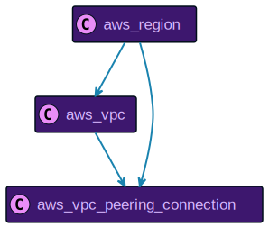

</ZoomPanPinch>
</div>
</details>

## `aws_vpc_quota`

<ZoomPanPinch>

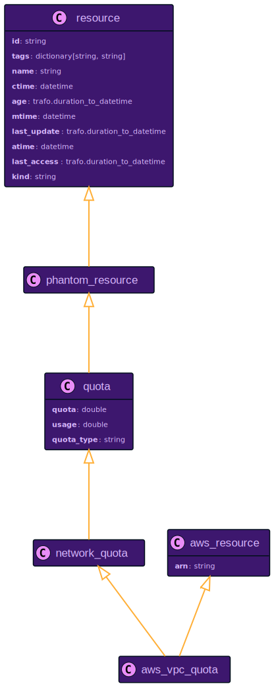

</ZoomPanPinch>

<details>
<summary>Relationship to Other Resources</summary>
<div>
<ZoomPanPinch>

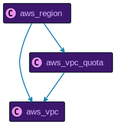

</ZoomPanPinch>
</div>
</details>
