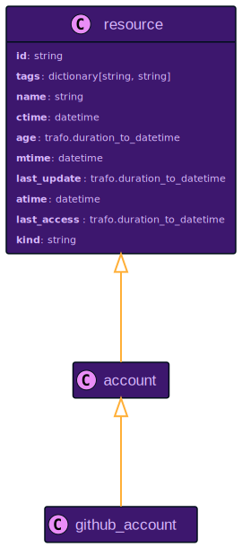
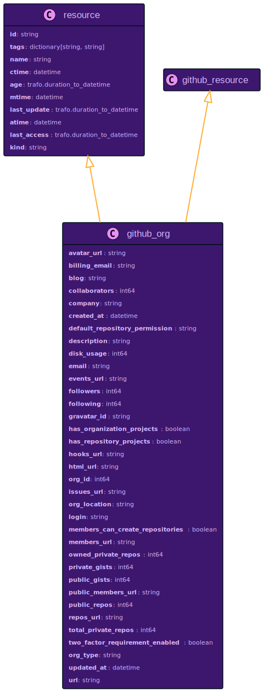
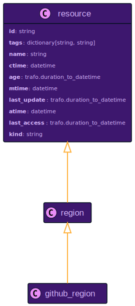
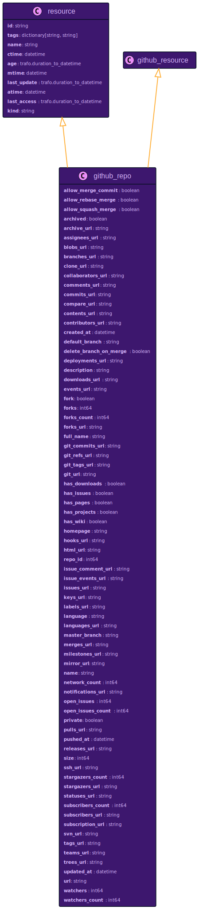
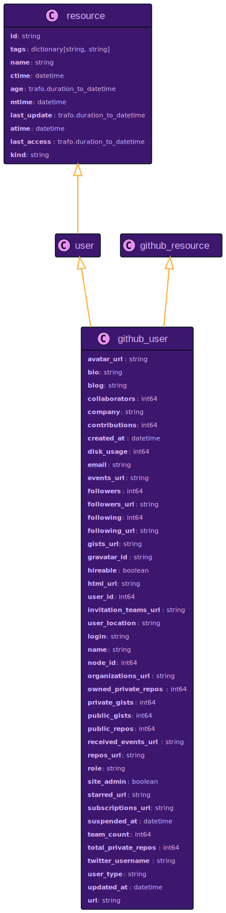

# GitHub Resource Data Models

## `github_account`

Relationship to Other Resources

## `github_org`

Relationship to Other Resources

## `github_region`

Relationship to Other Resources

## `github_repo`

Relationship to Other Resources

## `github_user`

Relationship to Other Resources

