# Kubernetes Resource Data Models

```mdx-code-block
import ZoomPanPinch from '@site/src/components/ZoomPanPinch';
```

:::info

Please refer to [Configure Kubernetes Access](../../../getting-started/configure-resoto/kubernetes.md) for details on how to set up Resoto to collect [Kuberenetes](https://kubernetes.io) resources.

:::

## `kubernetes_cluster`

<ZoomPanPinch>

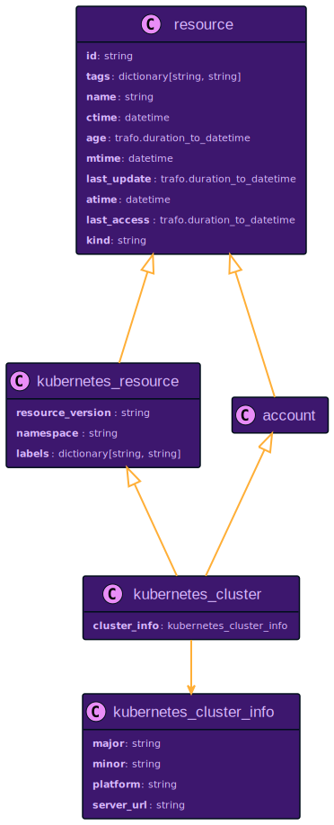

</ZoomPanPinch>

<details>
<summary>Relationships to Other Resources</summary>
<div>
<ZoomPanPinch>

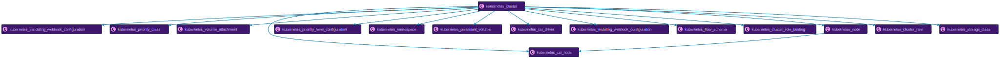

</ZoomPanPinch>
</div>
</details>

## `kubernetes_cluster_role`

<ZoomPanPinch>

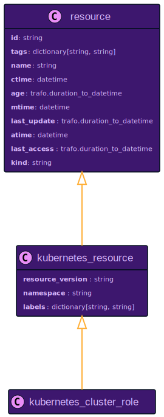

</ZoomPanPinch>

<details>
<summary>Relationships to Other Resources</summary>
<div>
<ZoomPanPinch>

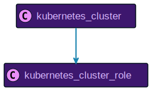

</ZoomPanPinch>
</div>
</details>

## `kubernetes_cluster_role_binding`

<ZoomPanPinch>

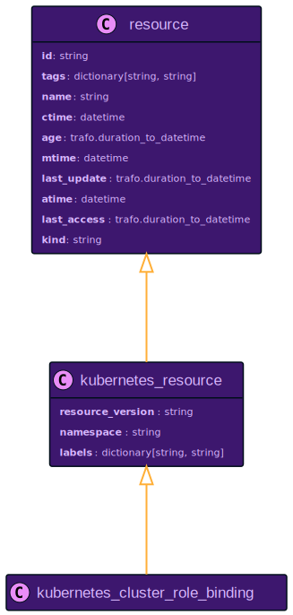

</ZoomPanPinch>

<details>
<summary>Relationships to Other Resources</summary>
<div>
<ZoomPanPinch>

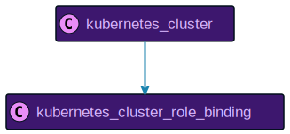

</ZoomPanPinch>
</div>
</details>

## `kubernetes_config_map`

<ZoomPanPinch>


</ZoomPanPinch>

<details>
<summary>Relationships to Other Resources</summary>
<div>
<ZoomPanPinch>

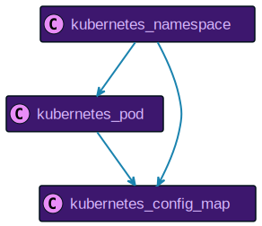

</ZoomPanPinch>
</div>
</details>

## `kubernetes_controller_revision`

<ZoomPanPinch>

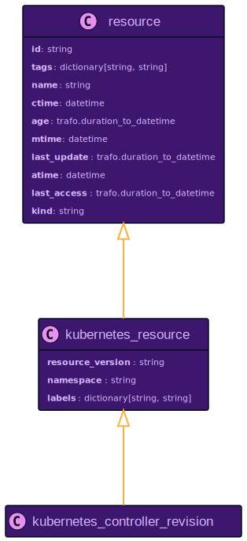

</ZoomPanPinch>

<details>
<summary>Relationships to Other Resources</summary>
<div>
<ZoomPanPinch>

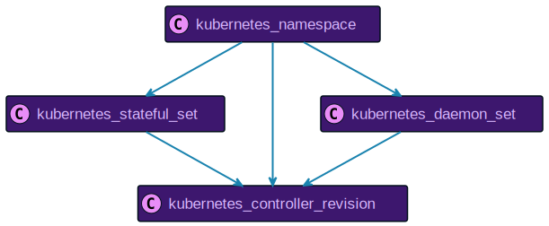

</ZoomPanPinch>
</div>
</details>

## `kubernetes_cron_job`

<ZoomPanPinch>

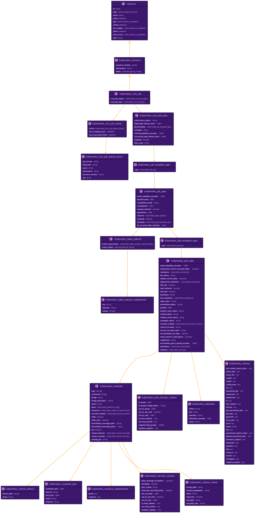

</ZoomPanPinch>

<details>
<summary>Relationships to Other Resources</summary>
<div>
<ZoomPanPinch>

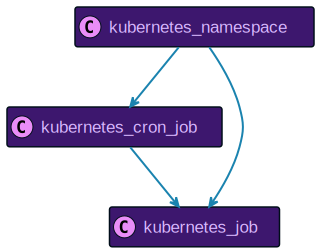

</ZoomPanPinch>
</div>
</details>

## `kubernetes_csi_driver`

<ZoomPanPinch>

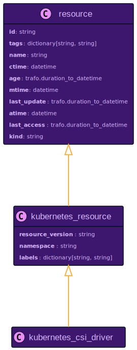

</ZoomPanPinch>

<details>
<summary>Relationships to Other Resources</summary>
<div>
<ZoomPanPinch>

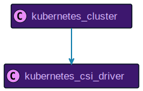

</ZoomPanPinch>
</div>
</details>

## `kubernetes_csi_node`

<ZoomPanPinch>

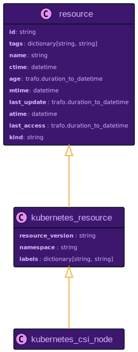

</ZoomPanPinch>

<details>
<summary>Relationships to Other Resources</summary>
<div>
<ZoomPanPinch>

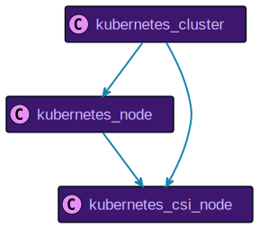

</ZoomPanPinch>
</div>
</details>

## `kubernetes_csi_storage_capacity`

<ZoomPanPinch>

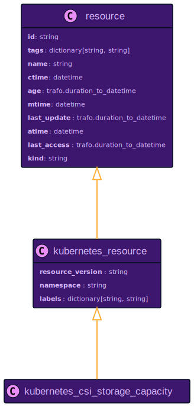

</ZoomPanPinch>

<details>
<summary>Relationships to Other Resources</summary>
<div>
<ZoomPanPinch>


</ZoomPanPinch>
</div>
</details>

## `kubernetes_daemon_set`

<ZoomPanPinch>

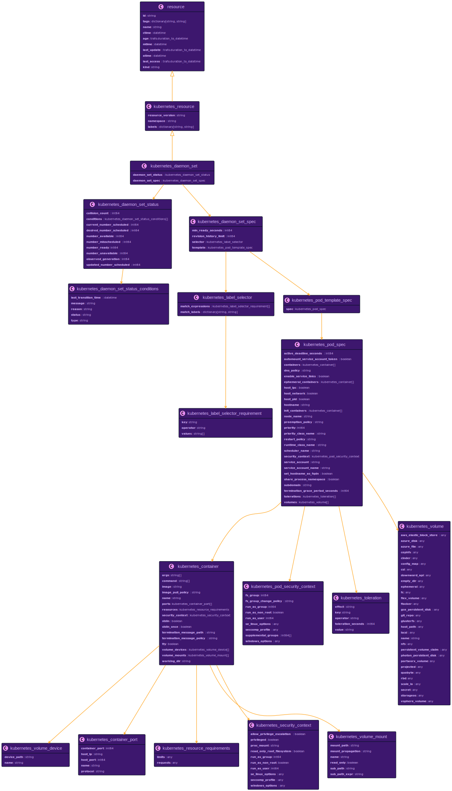

</ZoomPanPinch>

<details>
<summary>Relationships to Other Resources</summary>
<div>
<ZoomPanPinch>


</ZoomPanPinch>
</div>
</details>

## `kubernetes_deployment`

<ZoomPanPinch>

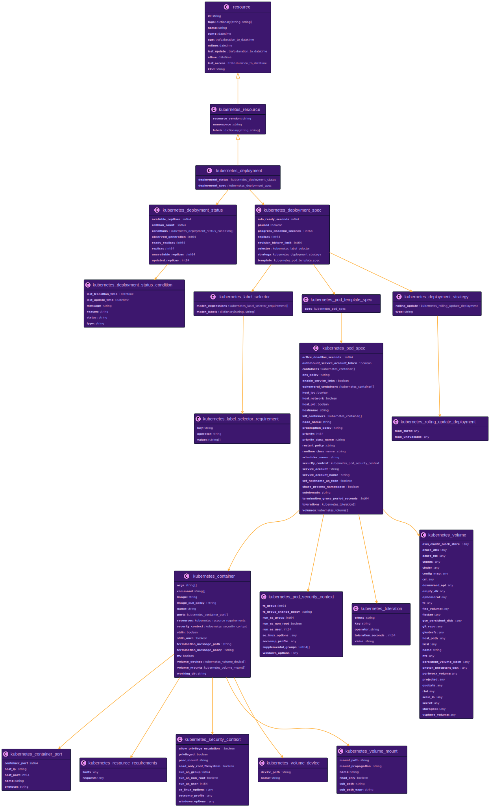

</ZoomPanPinch>

<details>
<summary>Relationships to Other Resources</summary>
<div>
<ZoomPanPinch>

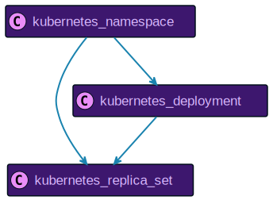

</ZoomPanPinch>
</div>
</details>

## `kubernetes_endpoint`

<ZoomPanPinch>

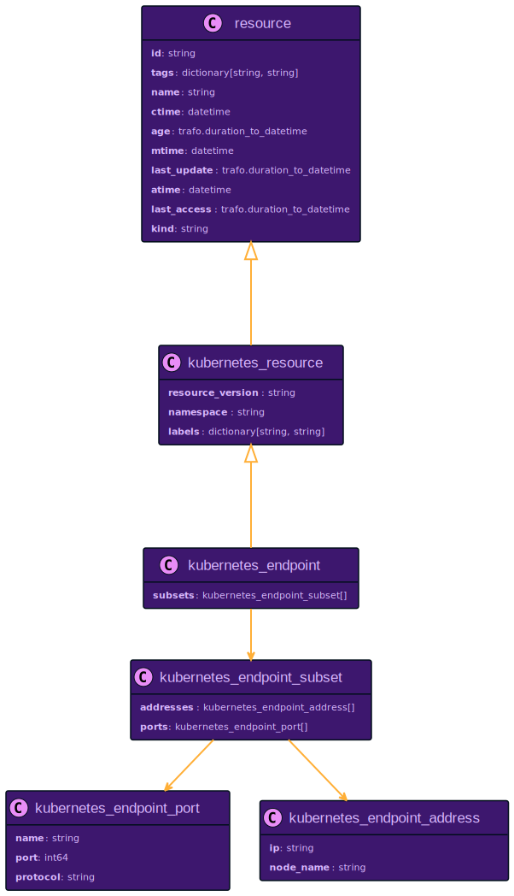

</ZoomPanPinch>

<details>
<summary>Relationships to Other Resources</summary>
<div>
<ZoomPanPinch>

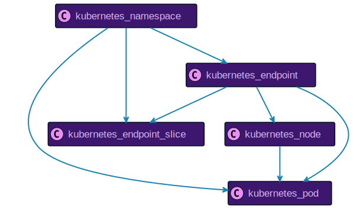

</ZoomPanPinch>
</div>
</details>

## `kubernetes_endpoint_slice`

<ZoomPanPinch>

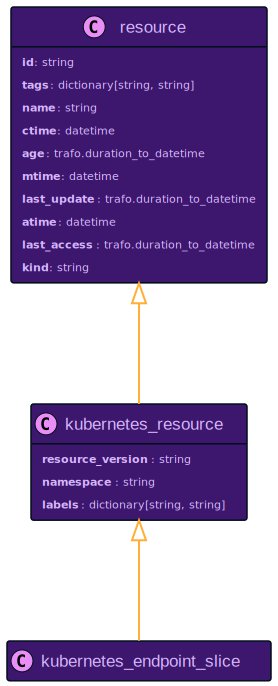

</ZoomPanPinch>

<details>
<summary>Relationships to Other Resources</summary>
<div>
<ZoomPanPinch>

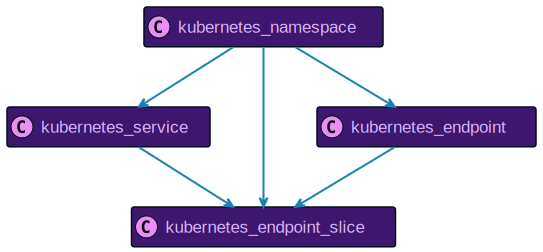

</ZoomPanPinch>
</div>
</details>

## `kubernetes_flow_schema`

<ZoomPanPinch>

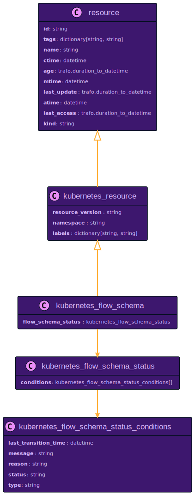

</ZoomPanPinch>

<details>
<summary>Relationships to Other Resources</summary>
<div>
<ZoomPanPinch>

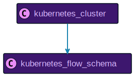

</ZoomPanPinch>
</div>
</details>

## `kubernetes_horizontal_pod_autoscaler`

<ZoomPanPinch>

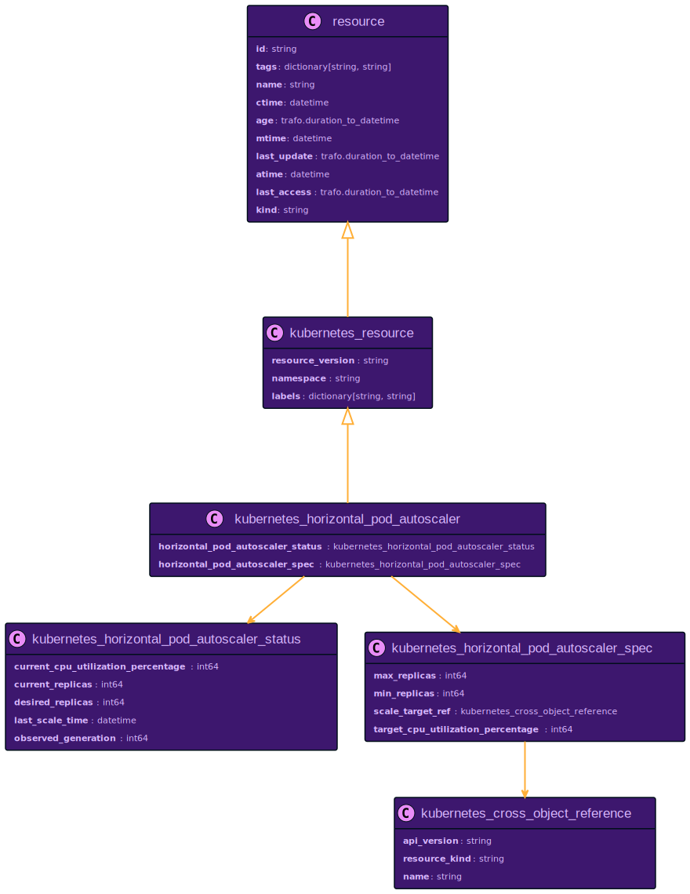

</ZoomPanPinch>

<details>
<summary>Relationships to Other Resources</summary>
<div>
<ZoomPanPinch>


</ZoomPanPinch>
</div>
</details>

## `kubernetes_ingress`

<ZoomPanPinch>

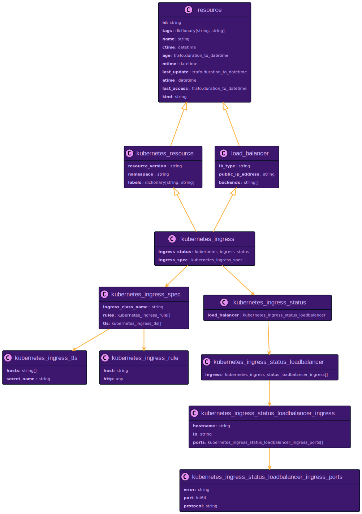

</ZoomPanPinch>

<details>
<summary>Relationships to Other Resources</summary>
<div>
<ZoomPanPinch>


</ZoomPanPinch>
</div>
</details>

## `kubernetes_ingress_class`

<ZoomPanPinch>


</ZoomPanPinch>

<details>
<summary>Relationships to Other Resources</summary>
<div>
<ZoomPanPinch>


</ZoomPanPinch>
</div>
</details>

## `kubernetes_job`

<ZoomPanPinch>

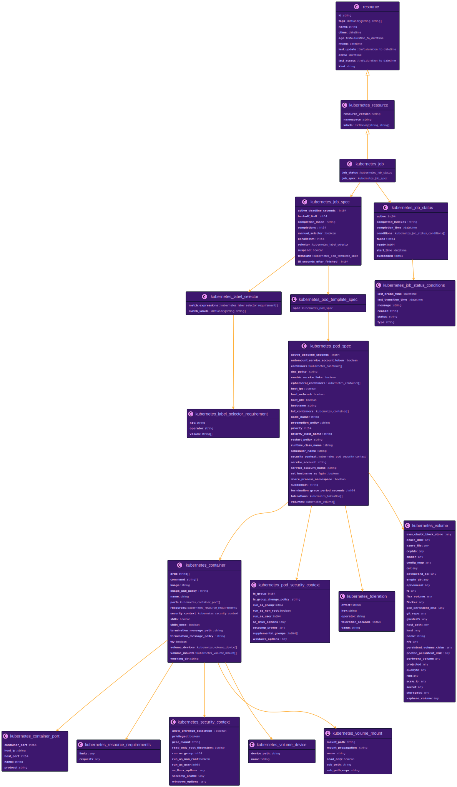

</ZoomPanPinch>

<details>
<summary>Relationships to Other Resources</summary>
<div>
<ZoomPanPinch>

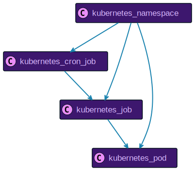

</ZoomPanPinch>
</div>
</details>

## `kubernetes_limit_range`

<ZoomPanPinch>

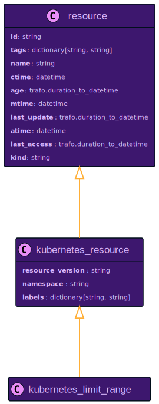

</ZoomPanPinch>

<details>
<summary>Relationships to Other Resources</summary>
<div>
<ZoomPanPinch>


</ZoomPanPinch>
</div>
</details>

## `kubernetes_mutating_webhook_configuration`

<ZoomPanPinch>

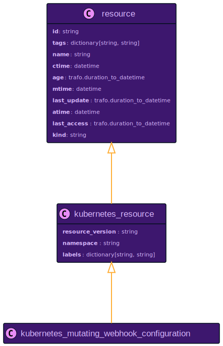

</ZoomPanPinch>

<details>
<summary>Relationships to Other Resources</summary>
<div>
<ZoomPanPinch>


</ZoomPanPinch>
</div>
</details>

## `kubernetes_namespace`

<ZoomPanPinch>

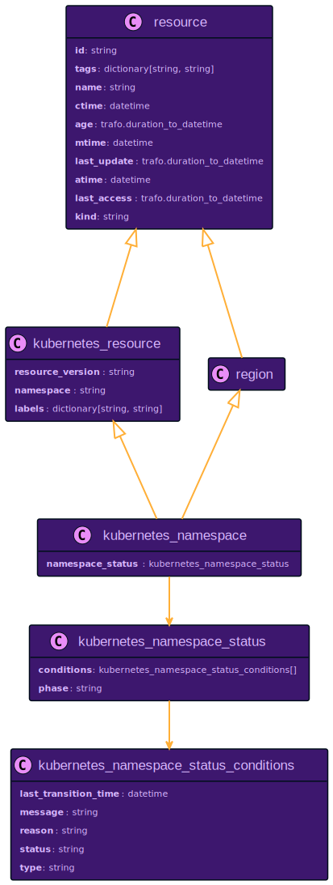

</ZoomPanPinch>

<details>
<summary>Relationships to Other Resources</summary>
<div>
<ZoomPanPinch>

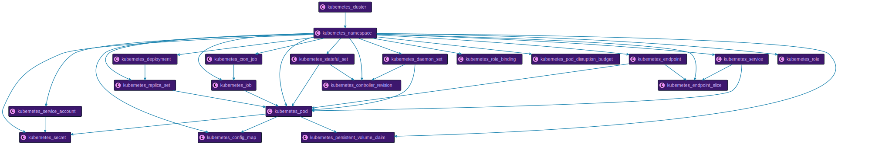

</ZoomPanPinch>
</div>
</details>

## `kubernetes_network_policy`

<ZoomPanPinch>

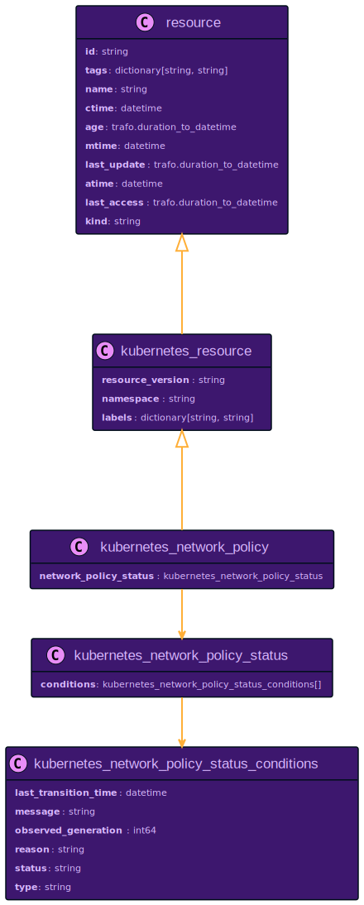

</ZoomPanPinch>

<details>
<summary>Relationships to Other Resources</summary>
<div>
<ZoomPanPinch>


</ZoomPanPinch>
</div>
</details>

## `kubernetes_node`

<ZoomPanPinch>


</ZoomPanPinch>

<details>
<summary>Relationships to Other Resources</summary>
<div>
<ZoomPanPinch>

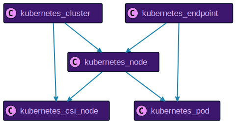

</ZoomPanPinch>
</div>
</details>

## `kubernetes_persistent_volume`

<ZoomPanPinch>

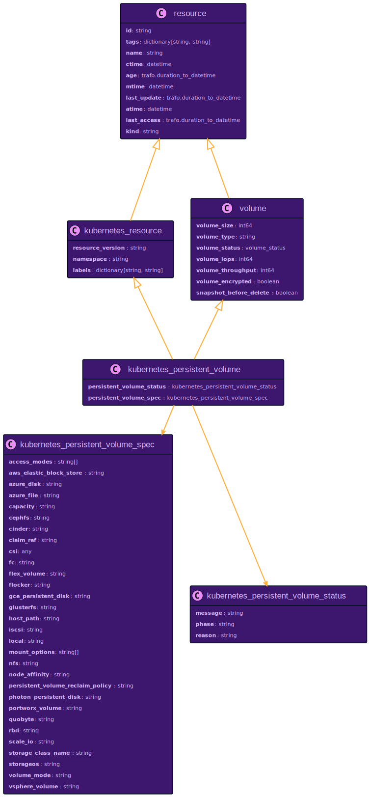

</ZoomPanPinch>

<details>
<summary>Relationships to Other Resources</summary>
<div>
<ZoomPanPinch>


</ZoomPanPinch>
</div>
</details>

## `kubernetes_persistent_volume_claim`

<ZoomPanPinch>


</ZoomPanPinch>

<details>
<summary>Relationships to Other Resources</summary>
<div>
<ZoomPanPinch>

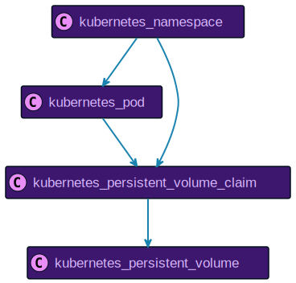

</ZoomPanPinch>
</div>
</details>

## `kubernetes_pod`

<ZoomPanPinch>

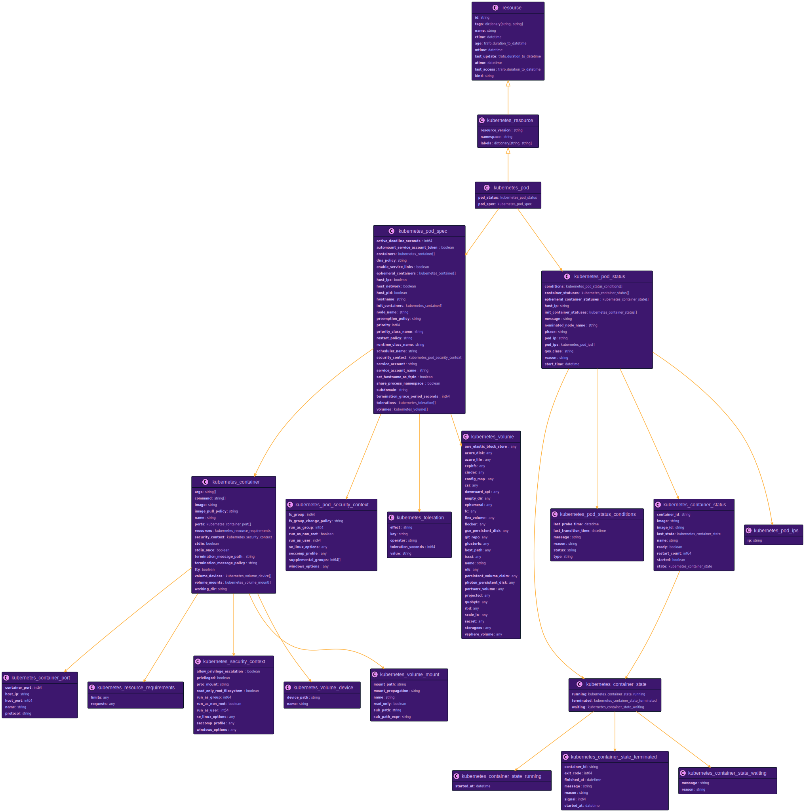

</ZoomPanPinch>

<details>
<summary>Relationships to Other Resources</summary>
<div>
<ZoomPanPinch>


</ZoomPanPinch>
</div>
</details>

## `kubernetes_pod_disruption_budget`

<ZoomPanPinch>

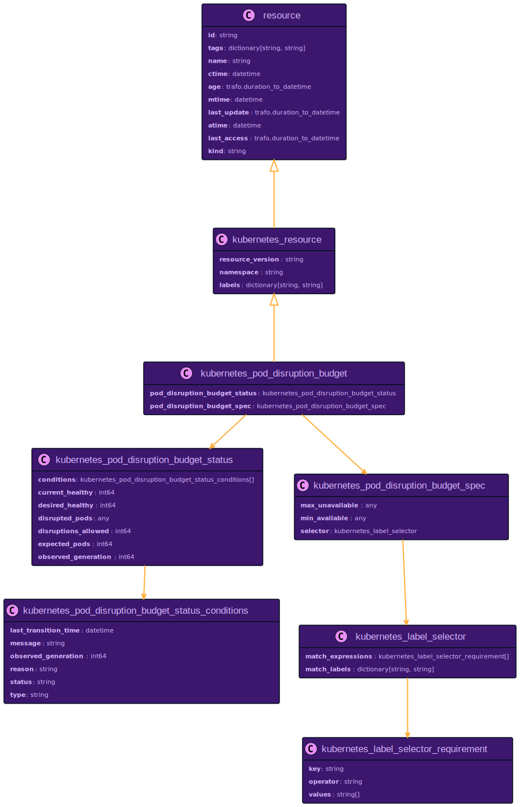

</ZoomPanPinch>

<details>
<summary>Relationships to Other Resources</summary>
<div>
<ZoomPanPinch>


</ZoomPanPinch>
</div>
</details>

## `kubernetes_pod_template`

<ZoomPanPinch>

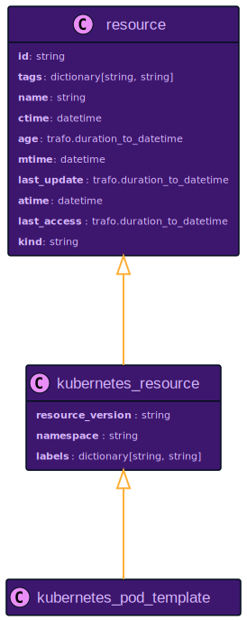

</ZoomPanPinch>

<details>
<summary>Relationships to Other Resources</summary>
<div>
<ZoomPanPinch>


</ZoomPanPinch>
</div>
</details>

## `kubernetes_priority_class`

<ZoomPanPinch>


</ZoomPanPinch>

<details>
<summary>Relationships to Other Resources</summary>
<div>
<ZoomPanPinch>


</ZoomPanPinch>
</div>
</details>

## `kubernetes_priority_level_configuration`

<ZoomPanPinch>

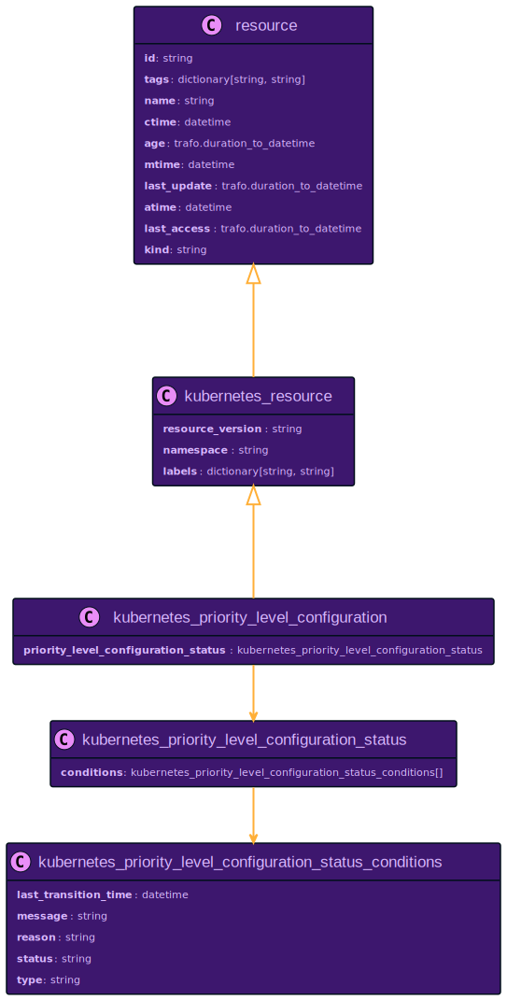

</ZoomPanPinch>

<details>
<summary>Relationships to Other Resources</summary>
<div>
<ZoomPanPinch>


</ZoomPanPinch>
</div>
</details>

## `kubernetes_replica_set`

<ZoomPanPinch>

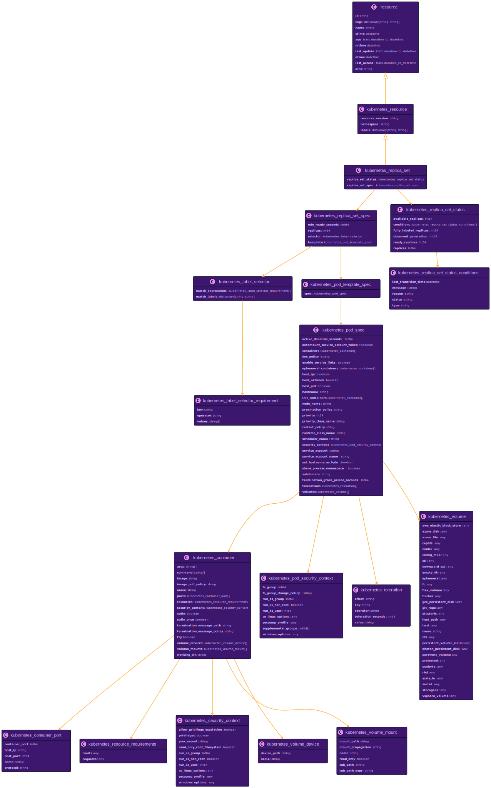

</ZoomPanPinch>

<details>
<summary>Relationships to Other Resources</summary>
<div>
<ZoomPanPinch>

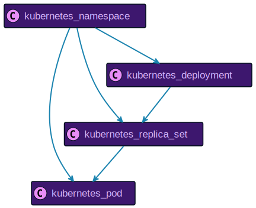

</ZoomPanPinch>
</div>
</details>

## `kubernetes_replication_controller`

<ZoomPanPinch>

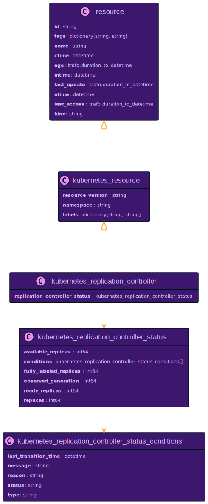

</ZoomPanPinch>

<details>
<summary>Relationships to Other Resources</summary>
<div>
<ZoomPanPinch>


</ZoomPanPinch>
</div>
</details>

## `kubernetes_resource`

<ZoomPanPinch>

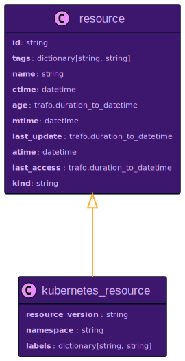

</ZoomPanPinch>

<details>
<summary>Relationships to Other Resources</summary>
<div>
<ZoomPanPinch>


</ZoomPanPinch>
</div>
</details>

## `kubernetes_resource_quota`

<ZoomPanPinch>

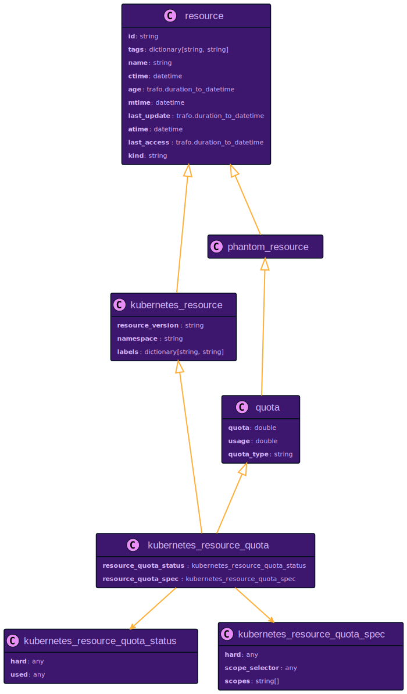

</ZoomPanPinch>

<details>
<summary>Relationships to Other Resources</summary>
<div>
<ZoomPanPinch>


</ZoomPanPinch>
</div>
</details>

## `kubernetes_role`

<ZoomPanPinch>

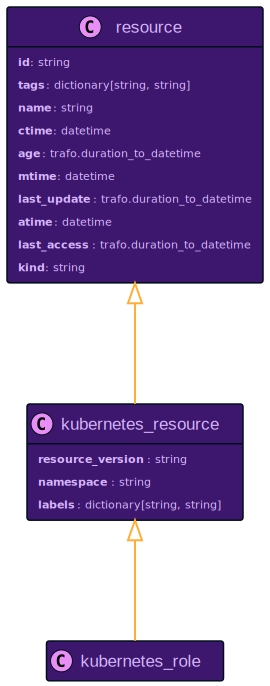

</ZoomPanPinch>

<details>
<summary>Relationships to Other Resources</summary>
<div>
<ZoomPanPinch>

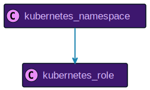

</ZoomPanPinch>
</div>
</details>

## `kubernetes_role_binding`

<ZoomPanPinch>

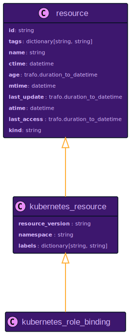

</ZoomPanPinch>

<details>
<summary>Relationships to Other Resources</summary>
<div>
<ZoomPanPinch>

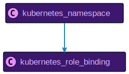

</ZoomPanPinch>
</div>
</details>

## `kubernetes_runtime_class`

<ZoomPanPinch>

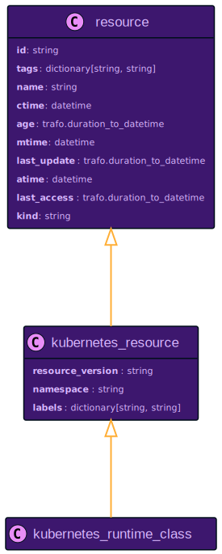

</ZoomPanPinch>

<details>
<summary>Relationships to Other Resources</summary>
<div>
<ZoomPanPinch>


</ZoomPanPinch>
</div>
</details>

## `kubernetes_secret`

<ZoomPanPinch>


</ZoomPanPinch>

<details>
<summary>Relationships to Other Resources</summary>
<div>
<ZoomPanPinch>

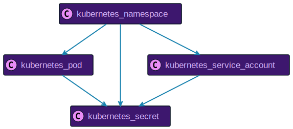

</ZoomPanPinch>
</div>
</details>

## `kubernetes_service`

<ZoomPanPinch>

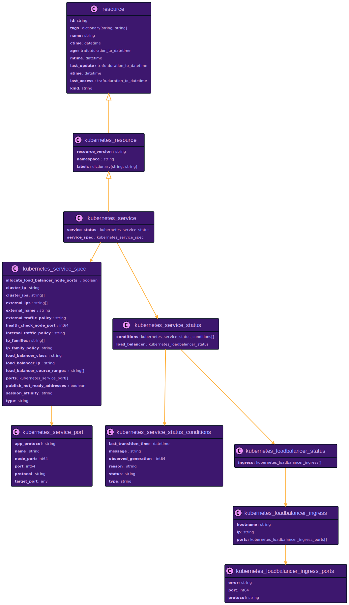

</ZoomPanPinch>

<details>
<summary>Relationships to Other Resources</summary>
<div>
<ZoomPanPinch>

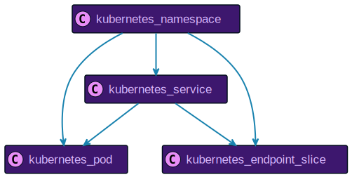

</ZoomPanPinch>
</div>
</details>

## `kubernetes_service_account`

<ZoomPanPinch>


</ZoomPanPinch>

<details>
<summary>Relationships to Other Resources</summary>
<div>
<ZoomPanPinch>

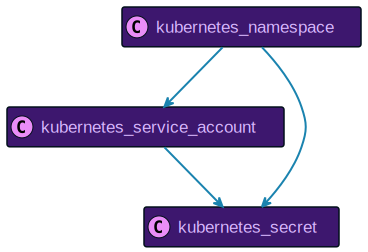

</ZoomPanPinch>
</div>
</details>

## `kubernetes_stateful_set`

<ZoomPanPinch>

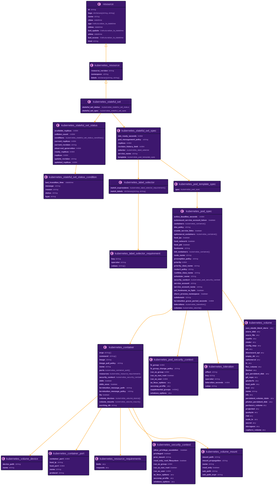

</ZoomPanPinch>

<details>
<summary>Relationships to Other Resources</summary>
<div>
<ZoomPanPinch>

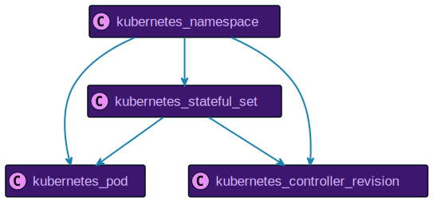

</ZoomPanPinch>
</div>
</details>

## `kubernetes_storage_class`

<ZoomPanPinch>

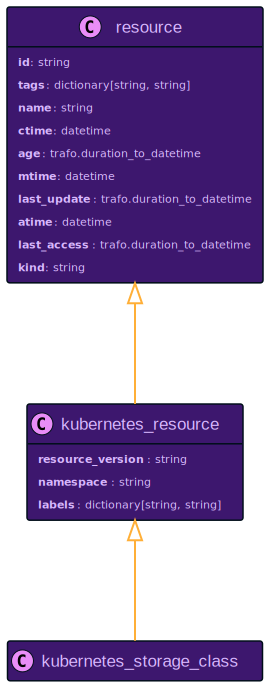

</ZoomPanPinch>

<details>
<summary>Relationships to Other Resources</summary>
<div>
<ZoomPanPinch>

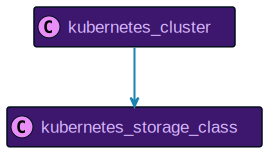

</ZoomPanPinch>
</div>
</details>

## `kubernetes_validating_webhook_configuration`

<ZoomPanPinch>

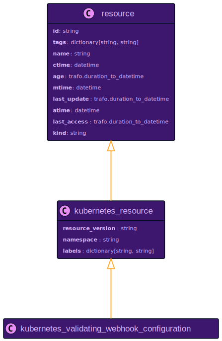

</ZoomPanPinch>

<details>
<summary>Relationships to Other Resources</summary>
<div>
<ZoomPanPinch>


</ZoomPanPinch>
</div>
</details>

## `kubernetes_volume_attachment`

<ZoomPanPinch>

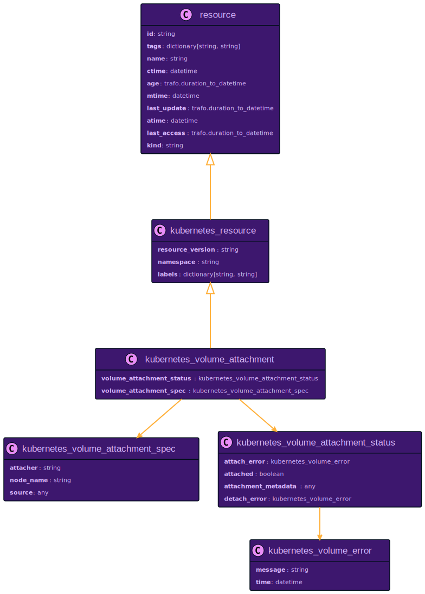

</ZoomPanPinch>

<details>
<summary>Relationships to Other Resources</summary>
<div>
<ZoomPanPinch>


</ZoomPanPinch>
</div>
</details>
