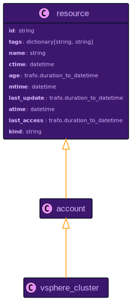
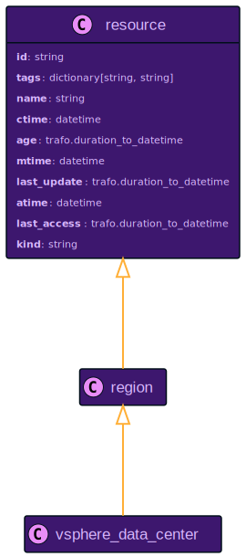
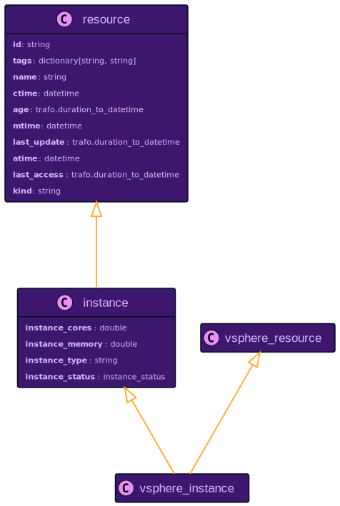

# VMware vSphere Resource Data Models

:::caution

vSphere support is still in alpha. Please [report any issues on GitHub](https://github.com/someengineering/resoto/issues/new?assignees=&labels=bug&template=bug.yml)!

:::

## `vsphere_cluster`

Relationship to Other Resources

## `vsphere_data_center`

Relationship to Other Resources

## `vsphere_instance`

Relationship to Other Resources

