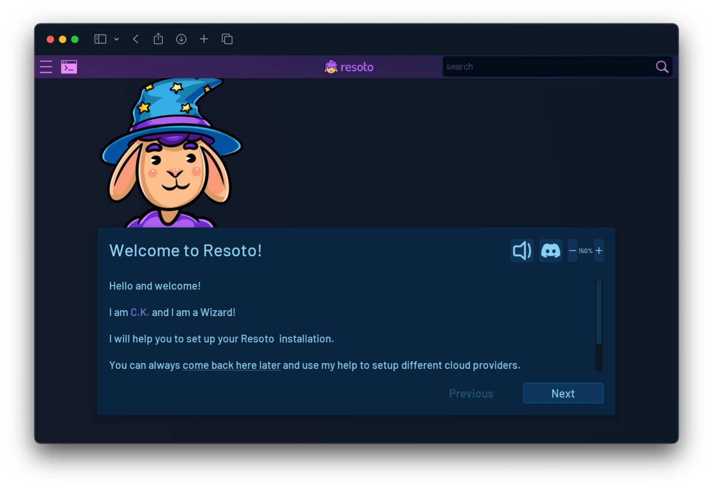

# Deploy Resoto with AWS Cloud Development Kit

The Resoto Cloud Development Kit (CDK) construct gives more control over the setup than the [CloudFormation template](./cloudformation.md).

## Prerequisites

- [Git](https://git-scm.com)
- [<abbr title="Amazon Web Services">AWS</abbr>](https://aws.amazon.com) account with IAM role permissions
- [`kubectl`](https://kubernetes.io/docs/reference/kubectl) command-line tool
- [Node.js](https://nodejs.org)

## Deploying Resoto

1. Run the following commands in the terminal:

   ```bash
   $ git clone git@github.com:someengineering/resoto-cdk.git
   $ cd resoto-cdk
   $ npm ci
   ```

2. Then, deploy Resoto with the following command:

   ```bash
   $ npm run cdk deploy -- --parameters ResotoTag={{imageTag}}
   ```

   :::note

   If this is your first CDK deployment, you will need to bootstrap your AWS account. You can do so with the following command:

   ```bash
   $ npm run cdk bootstrap
   ```

   :::

   :::info

   It is possible to override the default CloudFormation parameter values:

   ```bash
   $ npm run cdk deploy -- --parameters ResotoTag={{imageTag}} --parameters MngInstanceType=t3.large
   ```

   | Parameter         | Description                                                   | Default Value     |
   | ----------------- | ------------------------------------------------------------- | ----------------- |
   | `ResotoTag`       | The Resoto image tag to use                                   | <LatestRelease /> |
   | `MngMaxSize`      | The maximum number of instances in the k8s managed node group | `3`               |
   | `MngMinSize`      | The minimum number of instances in the k8s managed node group | `1`               |
   | `MngDesiredSize`  | The desired number of instances in the k8s managed node group | `1`               |
   | `MngInstanceType` | The instance type of the k8s managed node group               | `t3.medium`       |

   :::

3. Confirm the deployment. This will trigger CDK to create an EKS cluster and install the [Resoto Helm chart](https://github.com/someengineering/helm-charts).

   :::info

   **The deployment will take approximately 30 minutes.** You can follow the progress in the terminal.

   Once deployment is complete, you will see output similar to the following:

   ```bash
   Outputs:
   ResotoEKS.ResotoEKSConfigCommandXXXX = aws eks update-kubeconfig ...
   ResotoEKS.ResotoPskSecret = kubectl get secrets ...
   ResotoEKS.ResotoUI = https://a3xxxxxx.us-east-1.elb.amazonaws.com:8900

   Stack ARN:
   arn:aws:cloudformation:us-east-1:115717706081:stack/ResotoEKS/e1b9e6a0-d5f6-11eb-8498-0a374cd00e27e
   ```

   :::

4. Copy the command with the key `ResotoEKSConfigCommandXXXX` and paste it into your terminal. This will configure your `kubectl` to connect to the EKS cluster. This requires the `aws` command line client to be installed and configured as well as the `kubectl` command line client.

## Launching the UI

1. Look for the ResotoUI Key in the Outputs result. Copy the link into your browser.

2. The UI needs a PSK token to authenticate. You can find the command to obtain the token in the **Outputs** section under the key `ResotoPskSecret`. Copy the command and paste it into your terminal. Please note: the certificate is self-signed and will not be trusted by your browser. You can safely ignore the warning.

   ```bash
   $ kubectl get secrets resoto-psk -o jsonpath="{.data.psk}" | base64 -d
   ```

3. Copy the token and paste it into the UI into the PSK field.

4. The Resoto UI is starting up and will guide you through the configuration.



## Launching the Command-Line Interface

The `resh` command is used to interact with [`resotocore`](../../../concepts/components/core.md).

Simply execute the following to access the [Resoto Shell](../../../concepts/components/shell.md) interface:

```bash
$ kubectl exec -it service/resoto-resotocore -- resh
```


## Removing the Resoto Deployment

To remove the Resoto deployment and all associated resources, run the following command in the terminal:

```bash
$ cdk destroy
```

:::warning

Removing the Resoto stack will also delete all data stored in the Resoto database.

:::
