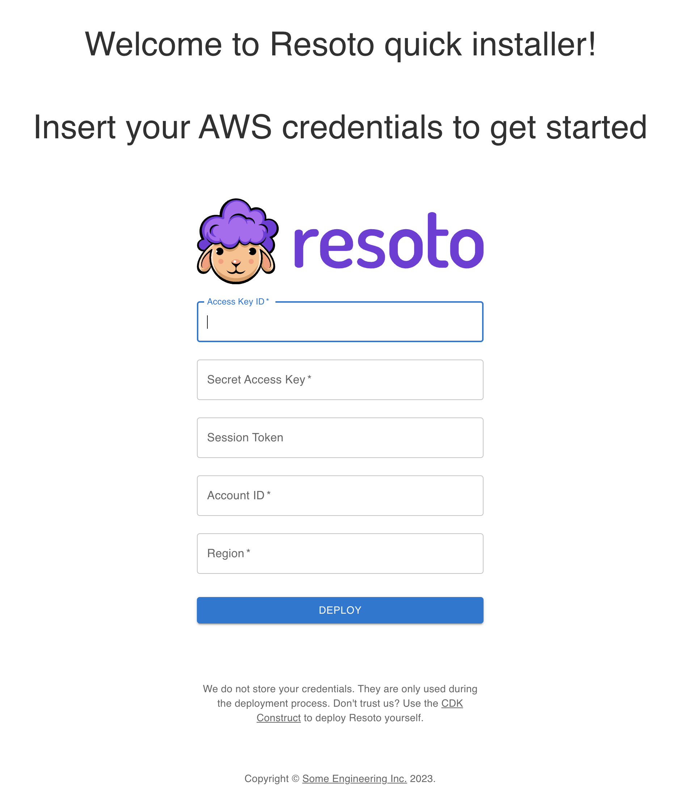
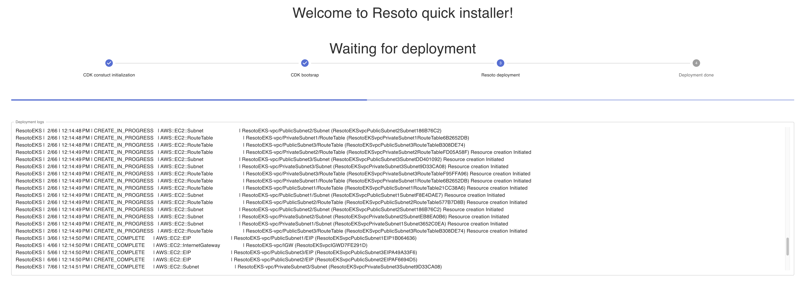
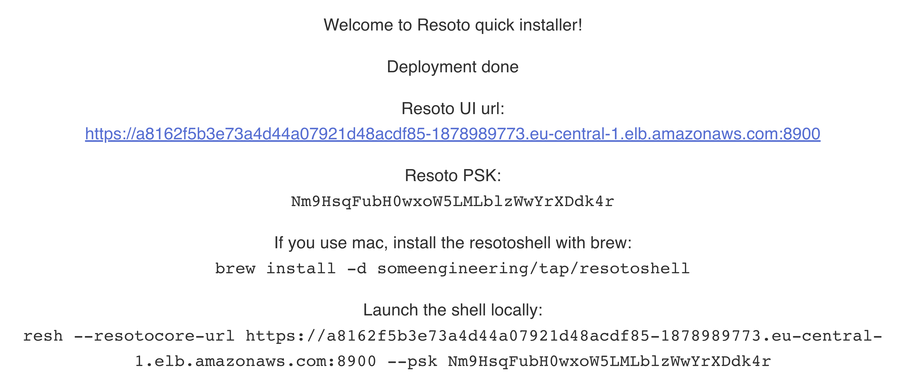

# Deploy Resoto to AWS Using the Resoto Web Installer

We provide a web installer for one-click deployment of Resoto to <abbr title="Amazon Web Services">AWS</abbr>.

:::tip

When deploying Resoto, we only use provided AWS credentials for the deployment. Credentials are not stored or retained after the deployment is complete.

If you are not comfortable sharing your credentials, you can alternatively use the [CDK construct](../cdk.mdx) to deploy Resoto.

:::

## Directions

1. Open the [Resoto web installer](https://install.resoto.com).

2. Enter your AWS credentials.

   

3. Wait until the deployment process is complete.

   

4. Once the deployment is successful, take note of the credentials required to connect to your Resoto cluster. Please keep them in a safe place as they will not be displayed again.

   

5. Open the Resoto UI by clicking on the Resoto UI URL. You will be prompted to enter the PSK. Use the PSK shown in the installer result.
