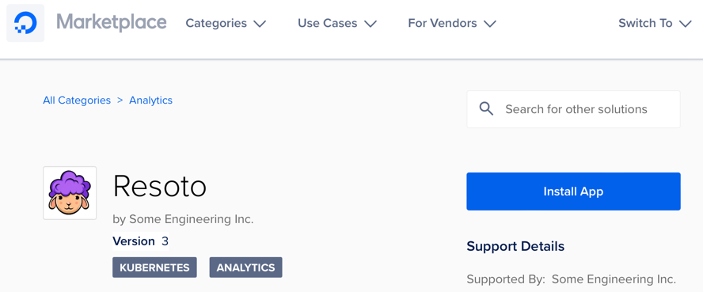
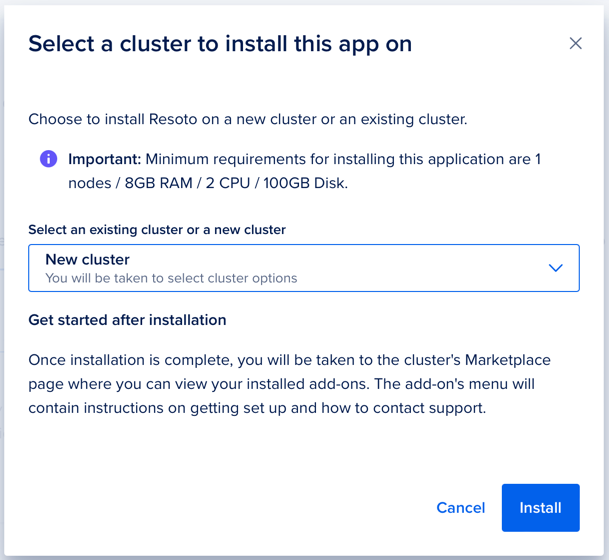

# Deploy Resoto to DigitalOcean

You can deploy Resoto from the DigitalOcean Marketplace in just a few clicks.

1. Open Resoto in the DigitalOcean Marketplace:

   

2. Click **Install App**.

   

3. Select an existing Kubernetes cluster, or create a new one. Resoto will be installed into the selected cluster.

   
