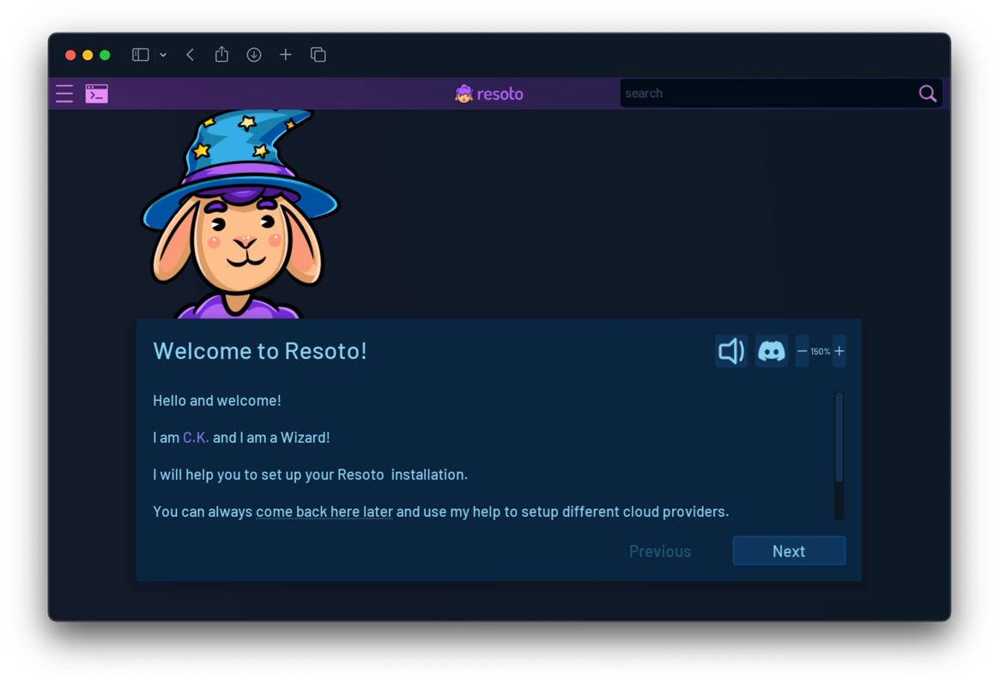
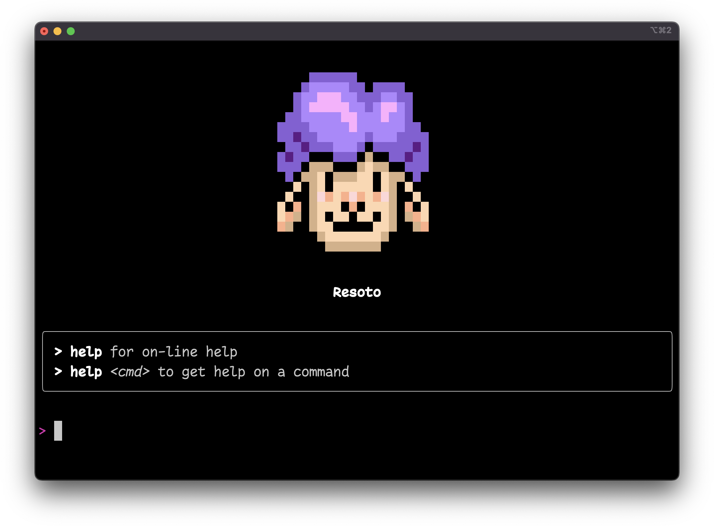

# Install Resoto with Docker

```mdx-code-block
import LatestRelease from '@site/src/components/LatestRelease';
import VersionOnly from '@site/src/components/VersionOnly';
import TabItem from '@theme/TabItem';
import Tabs from '@theme/Tabs';
```

[Docker](https://docker.com) provides the ability to run an application in a loosely isolated environment called a [container](https://docs.docker.com/get-started/overview#containers). For more information on Docker, please see the [official Docker documentation](https://docs.docker.com).

Resoto consists of multiple [components](../../reference/components/index.md) published as individual Docker images:

- [`somecr.io/someengineering/resotocore`](https://hub.docker.com/repository/docker/someengineering/resotocore) maintains the infrastructure graph.
- [`somecr.io/someengineering/resotoworker`](https://hub.docker.com/repository/docker/someengineering/resotoworker) collects infrastructure data from the cloud provider APIs.
- [`somecr.io/someengineering/resotometrics`](https://hub.docker.com/repository/docker/someengineering/resotometrics) exports metrics in Prometheus format.
- [`somecr.io/someengineering/resotoshell`](https://hub.docker.com/repository/docker/someengineering/resotoshell) provides the [command-line interface](../../reference/cli/index.md) used to interact with Resoto.

https://youtu.be/U5L4z71WI-w

## Prerequisites

- [Docker](https://docs.docker.com/get-started#download-and-install-docker)
- [Docker Compose >= 1.29](https://docs.docker.com/compose/install)
- At least 2 CPU cores and 8 GB of RAM

:::note

Resoto performs CPU-intensive graph operations. In a production setup, we recommend at least four cores and 16 gigabytes of RAM. See [Configuring Resoto Worker](../../reference/configuration/worker.md#multi-core-machines) for more information.

:::

## Installing Resoto

1. Fetch the required files from the [`someengineering/resoto` GitHub repository](https://github.com/someengineering/resoto):

   ```bash
   $ mkdir -p resoto/dockerV2
   $ cd resoto
   $ curl -Lo docker-compose.yaml {{dockerComposeUrl}}
   $ curl -Lo dockerV2/prometheus.yml https://raw.githubusercontent.com/someengineering/resoto/{{repoBranch}}/dockerV2/prometheus.yml
   ```

   :::note

   By default, the `resotoshell` service bind-mounts the `~/resoto-downloads` directory to `/home/resoto/downloads` in the container. This allows you to access files outputted by Resoto Shell on the host.

   If you would like to change the download location from `~/resoto-downloads` to another directory, you can do so by editing the `docker-compose.yaml` file:

   ```yaml
   resotoshell:
     ...
     volumes:
   # highlight-next-line
       - ~/resoto-downloads:/home/resoto/downloads
     ...
   ```

   :::

2. Start the services defined in the `docker-compose.yaml` file:

   ```bash
   $ docker-compose up -d
   ```

   Upon execution of `docker-compose up -d`, Docker Compose will start all components and set up the system. This process takes approximately 1-3 minutes, depending on your machine and internet connection.

   :::note

   [Docker Compose V2 integrated compose functions in to the Docker platform.](https://docs.docker.com/compose/#compose-v2-and-the-new-docker-compose-command)

   In Docker Compose V2, the command is `docker compose` (no hyphen) instead of `docker-compose`.

   :::

   <VersionOnly allowed="current">

   :::info

   Resoto publishes packages for both x86 and ARM architectures for stable releases, but `edge` versions are only available for x86.

   If you have an Apple Silicon or other ARM-based machine, please use the latest stable release (<LatestRelease /> or `latest`).

   :::

   </VersionOnly>

## Launching the Web UI

1. Resoto UI listens on port `8900` by default. You can access it by opening <https://localhost:8900> in your browser.

   :::note

   The SSL certificate is self-signed, but you can safely ignore any browser warnings.

   :::

2. If it is your first time starting Resoto UI, the setup wizard will appear and help you configure Resoto:

   

## Launching the Command-Line Interface

The `resh` command is used to interact with [`resotocore`](../../reference/components/core.md).

Simply execute the following to access the [Resoto Shell](../../reference/components/shell.md) interface:

```bash
$ docker exec -it resotoshell resh
```


