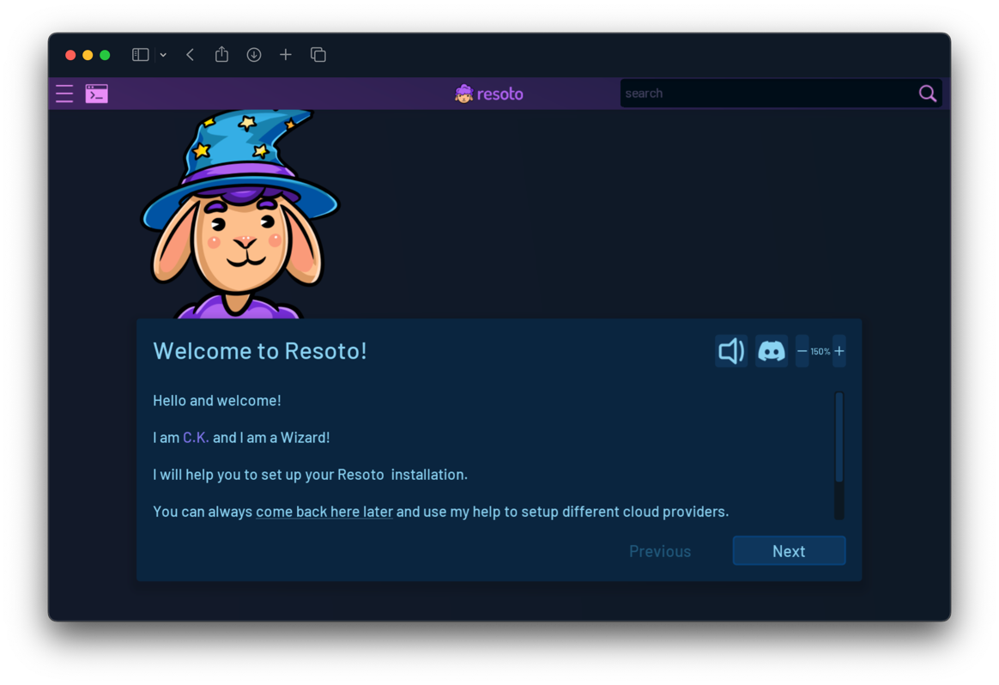

# Launch Resoto

Resoto allows you to manage and explore your cloud infrastructure via a web or shell interface.

## Resoto UI

Resoto UI is a user-friendly web interface that simplifies managing and exploring your cloud infrastructure.

The steps to launch Resoto UI are dependent on how you installed Resoto.

<Tabs groupId="install-method" querystring>

<TabItem value="aws" label="AWS">

1. Log in to the [AWS CloudFormation console](https://console.aws.amazon.com/cloudformation).

2. Click **Stacks**.

3. Enter `ResotoEKS` into the search box, and click on the **ResotoEKS** stack.

   

4. Click the **Outputs** tab.

5. Enter `ResotoUI` into the search box. There should be exactly one entry. Copy the value (e.g., `https://a3xxxxxx.us-east-1.elb.amazonaws.com:8900`).

   :::info

   The value of `ResotoEKS.ResotoUI` in **Outputs** is the URL of the Resoto UI.

   :::

6. Open the copied URL in your browser to launch Resoto UI.

7. In the AWS Cloudformation console, enter `ResotoPSK` into the search box. There should be exactly one entry. Copy the value (e.g., `kubectl get secrets ...`).

   :::info

   The value of `ResotoEKS.ResotoPskSecret` in **Outputs** is a command to retrieve the Resoto PSK.

   :::

8. Copy the command and paste it into your terminal to print the Resoto PSK to the terminal.

   ```bash
   $ kubectl get secrets resoto-psk -o jsonpath='{.data.psk}' | base64 -d
   ```

9. Enter the Resoto PSK in the Resoto UI prompt and click **Connect**.

   :::note

   The SSL certificate is self-signed, but you can safely ignore any browser warnings.

   :::

10. If it is your first time starting Resoto UI, a setup wizard will appear to help you configure Resoto:

    

</TabItem>

<TabItem value="digitalocean" label="DigitalOcean">

1. Resoto is available via an externally accessible service address. Get the address by executing the following in your terminal:

   ```bash
   export SERVICE_ADDRESS=$(kubectl get --namespace resoto service resoto-resotocore -o jsonpath="{.status.loadBalancer.ingress[0].ip}")
   echo "Visit https://$SERVICE_ADDRESS:8900 to use Resoto."
   ```

2. Copy the URL into your browser to launch Resoto UI.

   :::note

   The SSL certificate is self-signed, but you can safely ignore any browser warnings.

   :::

3. If it is your first time starting Resoto UI, a setup wizard will appear to help you configure Resoto:

   

</TabItem>

<TabItem value="docker" label="Docker">

1. Resoto UI listens on port `8900` by default. You can access it by opening <https://localhost:8900> in your browser.

   :::note

   The SSL certificate is self-signed, but you can safely ignore any browser warnings.

   :::

2. If it is your first time starting Resoto UI, a setup wizard will appear to help you configure Resoto:

   

</TabItem>

<TabItem value="kubernetes" label="Kubernetes">

1. Resoto provides a service that exposes Resoto UI on port `8900`. We recommend configuring an [Ingress](https://kubernetes.io/docs/concepts/services-networking/ingress) with a valid certificate for UI access, but you can port-forward the service as a temporary solution:

   ```bash
   $ kubectl port-forward services/resoto-resotocore 8900
   ```

2. Retrieve the PSK:

   ```bash
   kubectl get secret arango-user -o jsonpath="{.data.password}" | base64 --decode
   ```

   :::info

   The PSK is required to access Resoto UI, and is stored as a [Kubernetes Secret](https://kubernetes.io/docs/concepts/configuration/secret), `resoto-psk`.

   :::

3. Enter the Resoto PSK in the Resoto UI prompt and click **Connect**.

   :::note

   The SSL certificate is self-signed, but you can safely ignore any browser warnings.

   :::

4. If it is your first time starting Resoto UI, a setup wizard will appear to help you configure Resoto:

   

</TabItem>

<TabItem value="pip" label="pip">

1. Resoto UI listens on port `8900` by default. You can access it by opening <https://localhost:8900> in your browser.

   :::note

   The SSL certificate is self-signed, but you can safely ignore any browser warnings.

   :::

2. If it is your first time starting Resoto UI, a setup wizard will appear to help you configure Resoto:

   

</TabItem>

</Tabs>

## Resoto Shell

Resoto Shell is Resoto's command-line interface.

The steps to launch Resoto Shell depend on how you installed Resoto.

<Tabs groupId="install-method" querystring>

<TabItem value="aws" label="AWS">

1. Log in to the [AWS CloudFormation console](https://console.aws.amazon.com/cloudformation).

2. Click **Stacks**.

3. Enter `ResotoEKS` into the search box, and click on the **ResotoEKS** stack.

   

4. Click the **Outputs** tab.

5. Enter `ResotoEKSConfigCommand` into the search box. There should be exactly one entry. Copy the value (`aws eks ...`).

   

   :::info

   The value of `ResotoEKS.ResotoEKSConfigCommandXXXX` in **Outputs** is a command to configure `kubectl` to connect to the EKS cluster.

   :::

6. Open a terminal and execute the copied command.

   

7. Execute the following in the terminal to access the [Resoto Shell](../../reference/components/shell.mdx) interface:

   ```bash
   $ kubectl exec -it service/resoto-resotocore -- resh
   ```

</TabItem>

<TabItem value="digitalocean" label="DigitalOcean">

Execute the following to access the [Resoto Shell](../../reference/components/shell.mdx) interface:

```bash
kubectl --namespace resoto exec -it service/resoto-resotocore -- resh
```

</TabItem>

<TabItem value="docker" label="Docker">

Execute the following to access the [Resoto Shell](../../reference/components/shell.mdx) interface:

```bash
$ docker exec -it resotoshell resh
```

</TabItem>

<TabItem value="kubernetes" label="Kubernetes">

1. Make sure that the deployment is available:

   ```bash
   $ kubectl wait --for=condition=available deployment/resoto-resotocore
   ```

2. Execute the following to access the [Resoto Shell](../../reference/components/shell.mdx) interface:

   ```bash
   $ kubectl exec -it service/resoto-resotocore -- resh
   ```

</TabItem>

<TabItem value="pip" label="pip">

Execute the following to access the [Resoto Shell](../../reference/components/shell.mdx) interface:

```bash
$ resh
```

</TabItem>

</Tabs>


