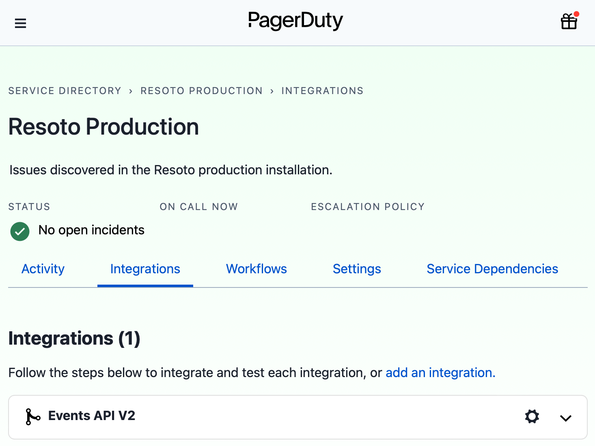

# How to Create PagerDuty Alerts

Resoto constantly monitors your infrastructure, and can alert you to any detected issues. [PagerDuty](https://pagerduty.com) is the de-facto standard to escalate alerts. In this guide, we will configure Resoto to send alerts to PagerDuty with a [custom command](../../../reference/cli/index.md).

## Prerequisites

This guide assumes that you have already [installed](../../../getting-started/install-resoto/index.md) and configured Resoto to [collect your cloud resources](../../../getting-started/configure-resoto/index.md).

You will also need a valid routing key for your [PagerDuty](https://pagerduty.com) account.

## Directions

1. Open the relevant service in [PagerDuty](https://pagerduty.com) and click **Integrations**. Then, click the **Add new integration** button.

2. Expand **Events API V2** and copy the revealed integration key:

   

   :::note

   We will refer to this key as the "routing key" for the remainder of these instructions.

   :::

3. Open the `resoto.core.commands` configuration:

   ```bash
   > config edit resoto.core.commands
   ```

4. Add the routing key copied in step 2 as the default value of the `routing_key` parameter in the `pagerduty` section. This will allow you to execute the `pagerduty` command without specifying the routing key parameter each time.

   :::info

   The `pagerduty` command has the following parameters, all of which are required:

   | Parameter      | Description                                                                                      | Default Value                             |
   | -------------- | ------------------------------------------------------------------------------------------------ | ----------------------------------------- |
   | `summary`      | Alert summary                                                                                    |                                           |
   | `routing_key`  | Events API V2 integration key                                                                    |                                           |
   | `dedup_key`    | String identifier that PagerDuty will use to ensure that only a single alert is active at a time |                                           |
   | `source`       | Alert source                                                                                     | `Resoto`                                  |
   | `severity`     | Alert severity (`critical`, `error`, `warning`, or `info`)                                       | `warning`                                 |
   | `source`       | Location of the affected system (preferably a hostname or FQDN)                                  | `Resoto`                                  |
   | `event_action` | Alert action (`trigger`, `acknowledge`, `resolve` or `assign`)                                   | `trigger`                                 |
   | `client`       | Name of the monitoring client submitting the event                                               | `Resoto`                                  |
   | `client_url`   | URL to the monitoring client                                                                     | `https://resoto.com`                      |
   | `webhook_url`  | PagerDuty events API URL endpoint                                                                | `https://events.pagerduty.com/v2/enqueue` |

   :::

5. Define the search criteria that will trigger an alert. For example, let's say we want to send alerts whenever we find a [Kubernetes Pod](https://kubernetes.io/docs/concepts/workloads/pods) updated in the last hour with a restart count greater than 20:

   ```bash
   > search is(kubernetes_pod) and pod_status.container_statuses[*].restart_count > 20 and last_update<1h
   # highlight-next-line
   ​kind=kubernetes_pod, name=db-operator-mcd4g, restart_count=[42], age=2mo5d, last_update=23m, cloud=k8s, account=prod, region=kube-system
   ```

6. Now that we've defined the alert trigger, we will simply pipe the result of the search query to the `pagerduty` command, replacing the `name` with your desired alert name:

   ```bash
   > search is(kubernetes_pod) and pod_status.container_statuses[*].restart_count > 20 and last_update<1h | pagerduty summary="Pods are restarting too often!" dedup_key="Resoto::PodRestartedTooOften"
   ```

   If the defined condition is currently true, you should see a new alert in PagerDuty.

7. Finally, we want to automate checking of the defined alert trigger and send alerts to [PagerDuty](https://www.pagerduty.com) whenever the result is true. We can accomplish this by creating a [job](../../../concepts/automation/index.md#jobs):

   ```bash
   > jobs add --id alert_on_pod_failure--wait-for-event post_collect 'search is(kubernetes_pod) and pod_status.container_statuses[*].restart_count > 20 and last_update<1h | pagerduty summary="Pods are restarting too often!" dedup_key="Resoto::PodRestartedTooOften"
   ```

## Further Reading

- [Search](../../../reference/search/index.md)
- [Automation](../../../concepts/automation/index.md)
- [Command-Line Interface](../../../reference/cli/index.md)
