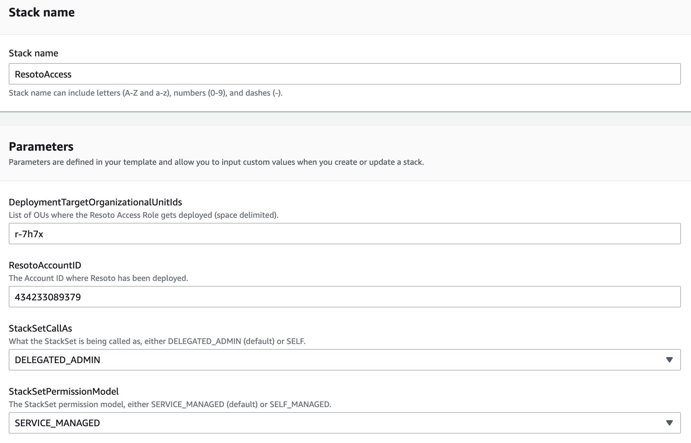
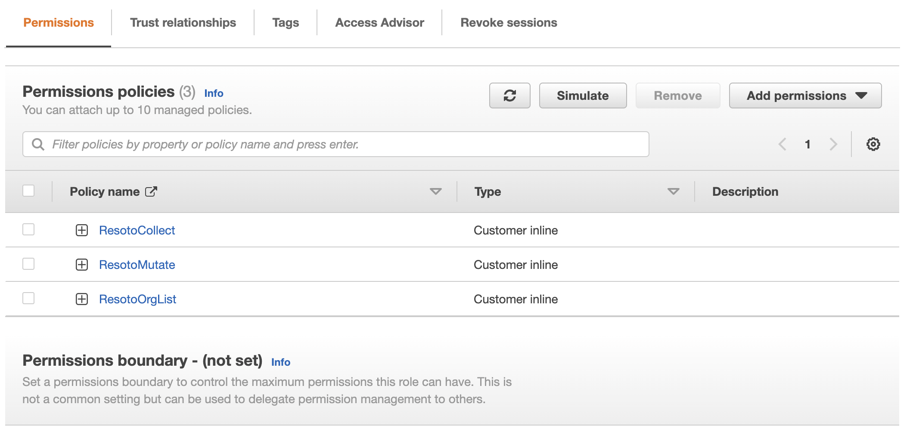
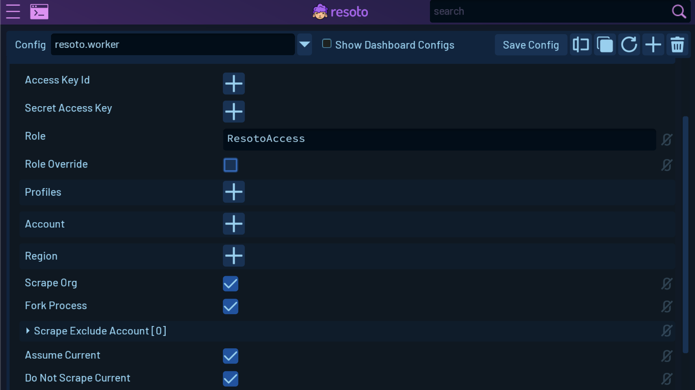

# How to Roll Out Resoto AWS Permissions with CloudFormation

```mdx-code-block
import TabItem from '@theme/TabItem';
import Tabs from '@theme/Tabs';
```

Each version of Resoto programmatically generates the specific <abbr title="Identity and Access Management">IAM</abbr> permissions it requires to collect (and optionally, manipulate) AWS resources. Manually maintaining these permissions is a tedious task, especially if you have multiple AWS accounts.

**To eliminate this pain point, we provide a CloudFormation template that automatically creates a `ResotoAccess` role with the required permissions and a trust that allows a specified AWS account to assume this role.**

The stack can be deployed in a single account, or organization-wide as a [CloudFormation StackSet](https://docs.aws.amazon.com/AWSCloudFormation/latest/UserGuide/what-is-cfnstacksets.html). In this how-to guide, we use this template to create a StackSet that deploys the `ResotoAccess` role to all accounts in your organization.

:::info

The source code can be found in the [someengineering/resoto-cf GitHub repository](https://github.com/someengineering/resoto-cf).

:::

:::note

If you prefer to deploy the StackSet yourself, the S3 URL of the template to create the `ResotoAccess` role is <https://resotopublic.s3.amazonaws.com/cf/resoto-role.template>.

:::

## Prerequisites

This guide assumes that you have already [installed](../../../getting-started/install-resoto/index.md) Resoto.

You also need an [AWS Organization](https://aws.amazon.com/organizations) that meets the [prerequisites for StackSet operations](https://docs.aws.amazon.com/AWSCloudFormation/latest/UserGuide/stacksets-prereqs.html).

## Directions

### Deploying the StackSet

<Tabs groupId="aws-interface">
<TabItem value="console" label="AWS Console">

1. Open the [AWS Organizations Console](https://console.aws.amazon.com/organizations/v2/home/accounts) and find the Organization Unit (OU) where you want to deploy the `ResotoAccess` role. The role will be deployed to all accounts in this OU and all child OUs.

   The OU is the cryptic string underneath the <abbr title="Organization Unit">OU</abbr> name. To deploy the role to all accounts in the organization, use the **Root** OU (`r-7h7x` in the below example).

   

2. If you are not already in the correct account, log into the account where you want to deploy the StackSet. This account will be the account that manages the StackSet and the role that is deployed to all accounts in the organization unit.

3. Navigate to the [Cloudformation Console](https://console.aws.amazon.com/cloudformation/home) and click **Create Stack**. Leave all the default settings, enter the S3 URL <https://resotopublic.s3.amazonaws.com/cf/resoto-stackset.template> in the **Amazon S3 URL** field and click **Next**.

   

4. Enter a stack name (e.g., `ResotoAccess`) and configure the four parameters as follows:

   | Parameter | Description |
   | --- | --- |
   | `DeploymentTargetOrganizationalUnitIds` | The <abbr title="Organization Unit">OU</abbr> (or multiple, space-delimited <abbr title="Organization Unit">OU</abbr>s) where you wish to deploy the role. |
   | `ResotoAccountID` | The account ID of the account where you have Resoto deployed. This account will be the one the Role has a trust relationship with. |
   | `StackSetCallAs` | Defaults to `DELEGATED_ADMIN` but can be changed to `SELF` depending on the permissions you have in your organization and whether the account you are deploying the StackSet in is registered as a delegated administrator for your organization (recommended). |
   | `StackSetPermissionModel` | Defaults to `SERVICE_MANAGED` but can be changed to `SELF_MANAGED` if you want to manage the StackSet permissions yourself. We prefer `SERVICE_MANAGED` as it allows us to turn on automatic deployments to accounts that we add to our organization in the future. |

   

5. Click **Next** on both this page and the next, then click **Create Stack**.

   The stack will take a few minutes to deploy.

   

6. In the menu to the left, click **StackSets**. You can see that the StackSet is being created on the **Self-managed** or **Service-managed** tab (depending on the option you chose).

   

7. After a few minutes, the StackSet will be created and begin deploying to all accounts in our organization. Reviewing the stacks in `us-east-1`, you should now see a new stack created by the StackSet:

   

   If we click it and check out its resources, you will see the `ResotoAccess` <abbr title="Identity and Access Management">IAM</abbr> role:

   

   Selecting the role, you can confirm it has the correct permissions as well as a trust relationship with the account where Resoto is deployed:

   

</TabItem>
<TabItem value="cli" label="AWS CLI">

1. Open the [AWS Organizations Console](https://console.aws.amazon.com/organizations/v2/home/accounts) and find the Organization Unit (OU) where you want to deploy the `ResotoAccess` role. The role will be deployed to all accounts in this OU and all child OUs.

   The OU is the cryptic string underneath the <abbr title="Organization Unit">OU</abbr> name. To deploy the role to all accounts in the organization, use the **Root** OU (`r-7h7x` in the below example).

   

2. Execute the following in your terminal, replacing the values of `AWS_OU` and `RESOTO_ACCOUNT_ID` with your <abbr title="Organization Unit">OU</abbr> and the ID of the account where you have Resoto deployed:

   ```bash
   AWS_OU="r-7h7x"  # Replace with your OU
   RESOTO_ACCOUNT_ID="434236089377"  # Replace with your Resoto account ID
   aws cloudformation create-stack \
     --region us-east-1 \
     --stack-name ResotoAccess \
     --template-url https://resotopublic.s3.amazonaws.com/cf/resoto-stackset.template \
     --parameters ParameterKey=DeploymentTargetOrganizationalUnitIds,ParameterValue="$AWS_OU" ParameterKey=ResotoAccountID,ParameterValue=$RESOTO_ACCOUNT_ID
   ```

   :::info

   The region can be changed to any region you like, but [<abbr title="Identity and Access Management">IAM</abbr> is a global service running in `us-east-1`](https://docs.aws.amazon.com/IAM/latest/UserGuide/reference_policies_condition-keys.html#condition-keys-requestedregion).

   :::

</TabItem>
</Tabs>

### Configuring Resoto to Assume the `ResotoAccess` Role and Scrape the Organization

<Tabs groupId="resoto-interface">
<TabItem value="ui" label="Resoto UI">

1. Open the `resoto.worker` configuration and locate the **Aws** section.

2. Enter the role name in the **Role** field and check the **Scrape Org** checkbox.

   Depending on your organization setup, check **Assume Current** and **Do Not Scrape Current** checkboxes. They control whether Resoto should assume the role inside the account it is running in, or just collect that account with the permissions it already has. (For instance, if you deploy Resoto using Kubernetes and it is using a service account that is already using the `ResotoAccess` role, there would be no need to assume the same role again.)

   

3. Save the configuration.

</TabItem>
<TabItem value="shell" label="Resoto Shell">

1. In Resoto Shell, execute `config edit resoto.worker` and locate the `aws` section.

2. Modify the configuration as follows:

   ```yaml
   aws:
     role: 'ResotoAccess'
     scrape_org: true
     assume_current: true
     do_not_scrape_current: true
   ```

   The `assume_current` and `do_not_scrape_current` options depend on your organization setup. They control whether Resoto should assume the role inside the account it is running in, or just collect that account with the permissions it already has. (For instance, if you deploy Resoto using Kubernetes and it is using a service account that is already using the `ResotoAccess` role, there would be no need to assume the same role again.)

</TabItem>
</Tabs>
