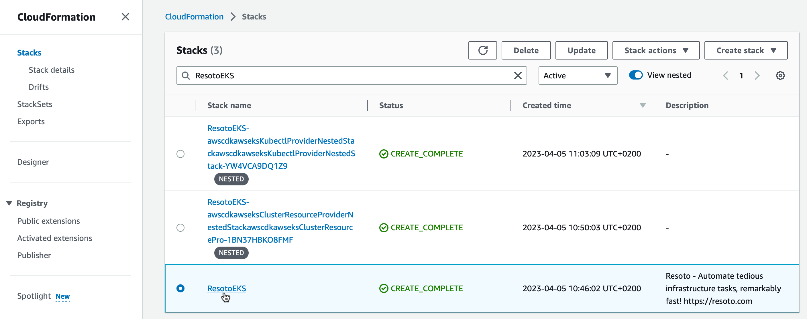

# How to Uninstall Resoto

```mdx-code-block
import LatestRelease from '@site/src/components/LatestRelease';
import VersionOnly from '@site/src/components/VersionOnly';
import TabItem from '@theme/TabItem';
import Tabs from '@theme/Tabs';
```

:::note

Need help or have feedback on Resoto? [Open an issue on GitHub](https://github.com/someengineering/resoto/issues/new/choose) or [chat with us on Discord](https://discord.gg/someengineering).

:::

## Directions

The process to uninstall Resoto is dependent on the installation method used.

<Tabs groupId="install-method" querystring>

<TabItem value="aws" label="Amazon Web Services">

1. Log in to the [AWS console](https://console.aws.amazon.com).

2. Select the region where you deployed Resoto, and open the CloudFormation service.

3. Select the `ResotoEKS` stack and click **Delete** button.

   

   :::warning

   This will remove the Resoto deployment and all associated resources.

   :::

</TabItem>

<TabItem value="docker" label="Docker">

In the directory where you installed Resoto (containing the file `docker-compose.yaml`), run the following command:

```bash
$ docker-compose down
```

:::note

[Docker Compose V2 integrated compose functions in to the Docker platform.](https://docs.docker.com/compose/#compose-v2-and-the-new-docker-compose-command)

In Docker Compose V2, the command is `docker compose` (no hyphen) instead of `docker-compose`.

:::

</TabItem>

<TabItem value="kubernetes" label="Kubernetes">

Run the following command:

```bash
$ helm uninstall resoto
```

</TabItem>

</Tabs>
