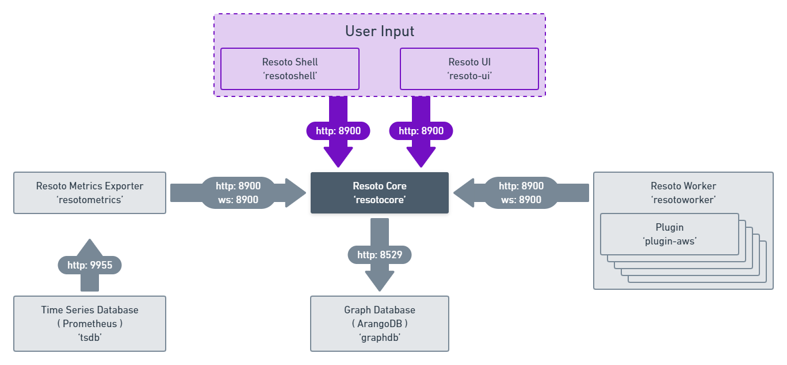

# Components

- [Resoto Core](./core.md) maintains all cloud resource metadata in an indexed and searchable [directed multigraph](<https://en.wikipedia.org/wiki/Multigraph#Directed_multigraph_(edges_with_own_identity)>). It can run automated jobs whenever data in the graph changes. A job in turn could create reports, validate resource tags, fix invalid or missing tags, notify users or even clean up resources.
- [Resoto Worker](./worker.md) loads cloud collectors and [plugins](./plugins/index.md) to perform collect and cleanup operations. It is the component that talks to the cloud provider APIs. It sends collected data to the [Resoto Core](./core.md). One or more workers can collect data from multiple cloud providers and accounts.
- [Resoto Shell](./shell.md) allows for interactions with Resoto Core and is the main user interface.
- [Resoto Metrics](./metrics.md) is a [Prometheus exporter](https://prometheus.io/docs/instrumenting/exporters) that allows exporting of metrics for display on e.g. [Grafana](https://grafana.com) dashboards.

