# Amazon Web Services Resource Data Models

```mdx-code-block
import ZoomPanPinch from '@site/src/components/ZoomPanPinch';
```

:::info

See [How to Collect AWS Resource Data](../../../how-to-guides/data-sources/collect-aws-resource-data.md) for step-by-step directions to configure Resoto to collect [Amazon Web Services (AWS)](https://aws.amazon.com) resources.

:::

## `aws_account`

<ZoomPanPinch>

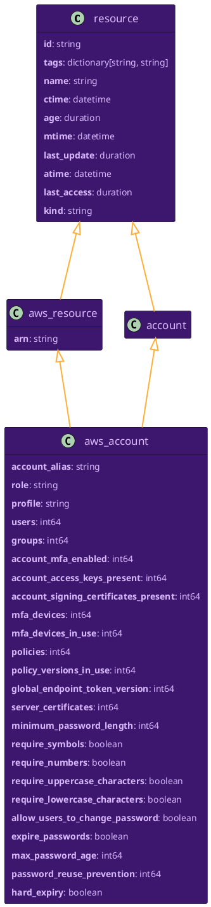

</ZoomPanPinch>

<details>
<summary>Relationships to Other Resources</summary>
<div>
<ZoomPanPinch>

```plantuml Diagram of aws_account resource relationships
@startuml
hide empty members
skinparam ArrowColor #ffaf37
skinparam ArrowFontColor #ffaf37
skinparam ArrowFontName Helvetica
skinparam ArrowThickness 2
skinparam BackgroundColor transparent
skinparam ClassAttributeFontColor #d9b8ff
skinparam ClassBackgroundColor #3d176e
skinparam ClassBorderColor #000d19
skinparam ClassFontColor #d9b8ff
skinparam ClassFontName Helvetica
skinparam ClassFontSize 17
skinparam NoteBackgroundColor #d9b8ff
skinparam NoteBorderColor #000d19
skinparam NoteFontColor #3d176e
skinparam NoteFontName Helvetica
skinparam Padding 5
skinparam RoundCorner 5
skinparam Shadowing false
skinparam stereotypeCBackgroundColor #e98df7
skinparam stereotypeIBackgroundColor #e98df7

class aws_region [[#aws_region]] {

}
class aws_root_user [[#aws_root_user]] {

}
class aws_s3_account_settings [[#aws_s3_account_settings]] {

}
class aws_account [[#aws_account]] {

}
aws_s3_account_settings -[#1A83AF]-> aws_account
aws_account -[#1A83AF]-> aws_region
aws_account -[#1A83AF]-> aws_root_user

@enduml
```

</ZoomPanPinch>
</div>
</details>

## `aws_alb`

<ZoomPanPinch>

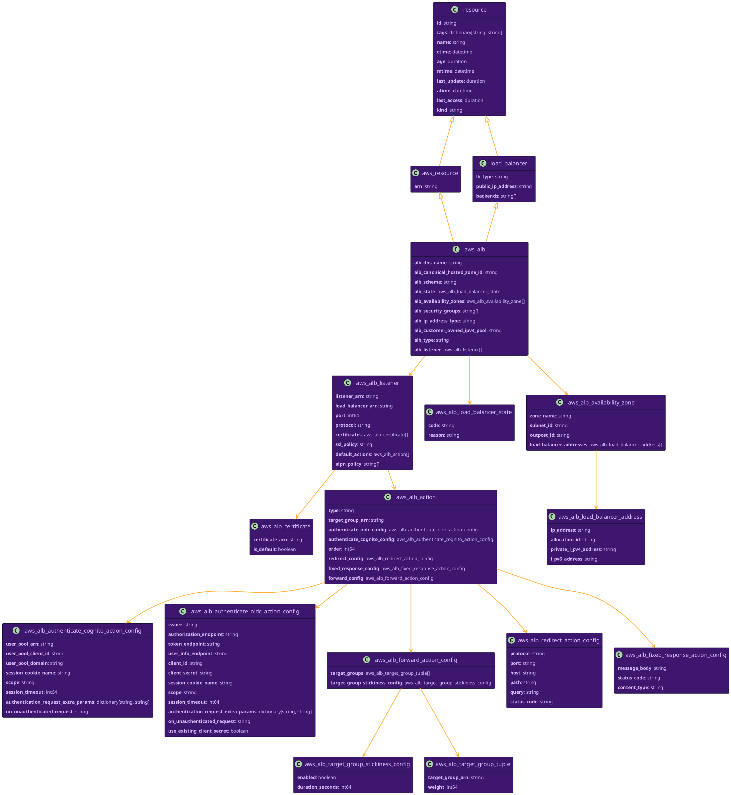

</ZoomPanPinch>

<details>
<summary>Relationships to Other Resources</summary>
<div>
<ZoomPanPinch>

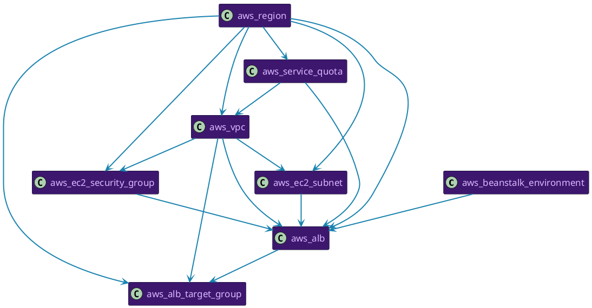

</ZoomPanPinch>
</div>
</details>

## `aws_alb_target_group`

<ZoomPanPinch>

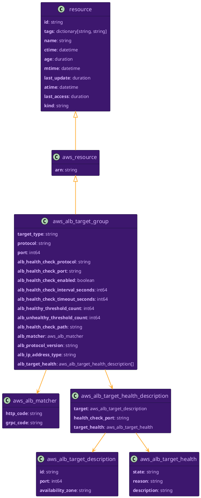

</ZoomPanPinch>

<details>
<summary>Relationships to Other Resources</summary>
<div>
<ZoomPanPinch>

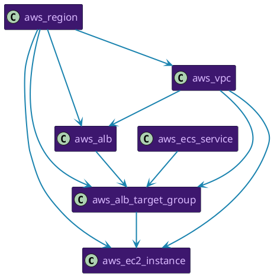

</ZoomPanPinch>
</div>
</details>

## `aws_api_gateway_authorizer`

<ZoomPanPinch>

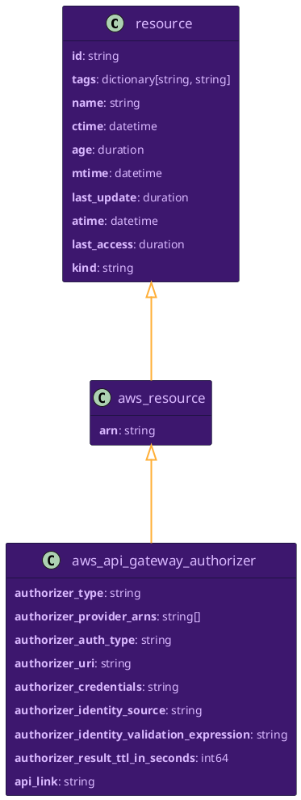

</ZoomPanPinch>

<details>
<summary>Relationships to Other Resources</summary>
<div>
<ZoomPanPinch>

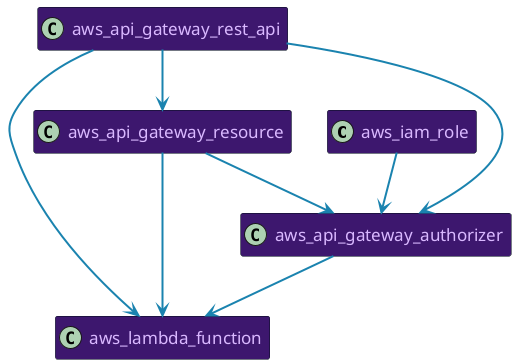

</ZoomPanPinch>
</div>
</details>

## `aws_api_gateway_deployment`

<ZoomPanPinch>

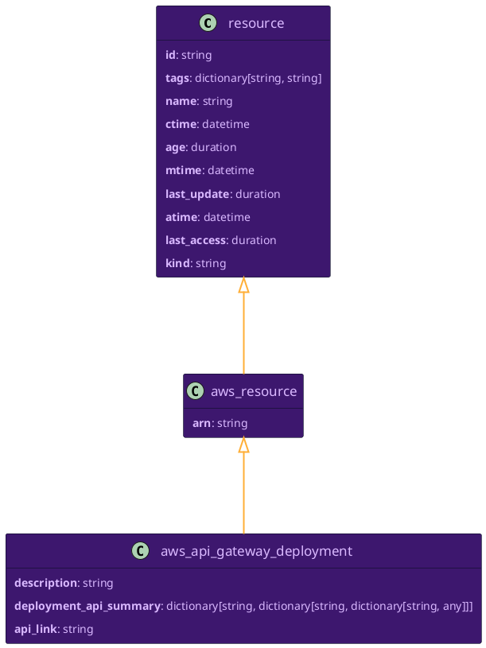

</ZoomPanPinch>

<details>
<summary>Relationships to Other Resources</summary>
<div>
<ZoomPanPinch>

```plantuml Diagram of aws_api_gateway_deployment resource relationships
@startuml
hide empty members
skinparam ArrowColor #ffaf37
skinparam ArrowFontColor #ffaf37
skinparam ArrowFontName Helvetica
skinparam ArrowThickness 2
skinparam BackgroundColor transparent
skinparam ClassAttributeFontColor #d9b8ff
skinparam ClassBackgroundColor #3d176e
skinparam ClassBorderColor #000d19
skinparam ClassFontColor #d9b8ff
skinparam ClassFontName Helvetica
skinparam ClassFontSize 17
skinparam NoteBackgroundColor #d9b8ff
skinparam NoteBorderColor #000d19
skinparam NoteFontColor #3d176e
skinparam NoteFontName Helvetica
skinparam Padding 5
skinparam RoundCorner 5
skinparam Shadowing false
skinparam stereotypeCBackgroundColor #e98df7
skinparam stereotypeIBackgroundColor #e98df7

class aws_api_gateway_rest_api [[#aws_api_gateway_rest_api]] {

}
class aws_api_gateway_deployment [[#aws_api_gateway_deployment]] {

}
class aws_api_gateway_stage [[#aws_api_gateway_stage]] {

}
aws_api_gateway_rest_api -[#1A83AF]-> aws_api_gateway_deployment
aws_api_gateway_deployment -[#1A83AF]-> aws_api_gateway_stage

@enduml
```

</ZoomPanPinch>
</div>
</details>

## `aws_api_gateway_domain_name`

<ZoomPanPinch>

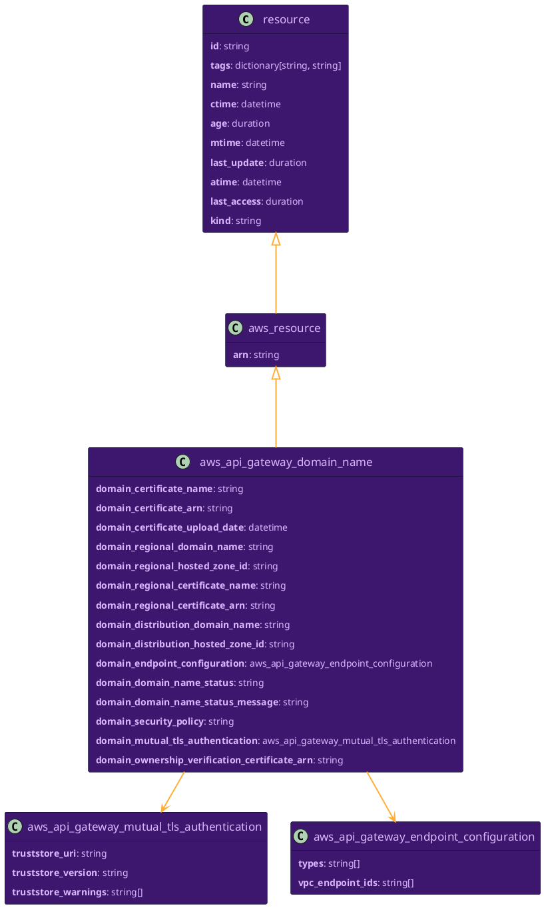

</ZoomPanPinch>

<details>
<summary>Relationships to Other Resources</summary>
<div>
<ZoomPanPinch>

```plantuml Diagram of aws_api_gateway_domain_name resource relationships
@startuml
hide empty members
skinparam ArrowColor #ffaf37
skinparam ArrowFontColor #ffaf37
skinparam ArrowFontName Helvetica
skinparam ArrowThickness 2
skinparam BackgroundColor transparent
skinparam ClassAttributeFontColor #d9b8ff
skinparam ClassBackgroundColor #3d176e
skinparam ClassBorderColor #000d19
skinparam ClassFontColor #d9b8ff
skinparam ClassFontName Helvetica
skinparam ClassFontSize 17
skinparam NoteBackgroundColor #d9b8ff
skinparam NoteBorderColor #000d19
skinparam NoteFontColor #3d176e
skinparam NoteFontName Helvetica
skinparam Padding 5
skinparam RoundCorner 5
skinparam Shadowing false
skinparam stereotypeCBackgroundColor #e98df7
skinparam stereotypeIBackgroundColor #e98df7

class aws_vpc_endpoint [[#aws_vpc_endpoint]] {

}
class aws_api_gateway_domain_name [[#aws_api_gateway_domain_name]] {

}
class aws_route53_zone [[#aws_route53_zone]] {

}
aws_api_gateway_domain_name -[#1A83AF]-> aws_route53_zone
aws_api_gateway_domain_name -[#1A83AF]-> aws_vpc_endpoint

@enduml
```

</ZoomPanPinch>
</div>
</details>

## `aws_api_gateway_resource`

<ZoomPanPinch>

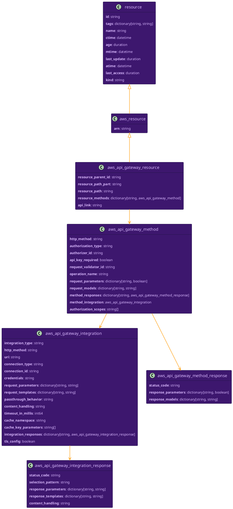

</ZoomPanPinch>

<details>
<summary>Relationships to Other Resources</summary>
<div>
<ZoomPanPinch>

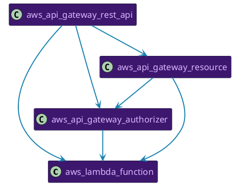

</ZoomPanPinch>
</div>
</details>

## `aws_api_gateway_rest_api`

<ZoomPanPinch>

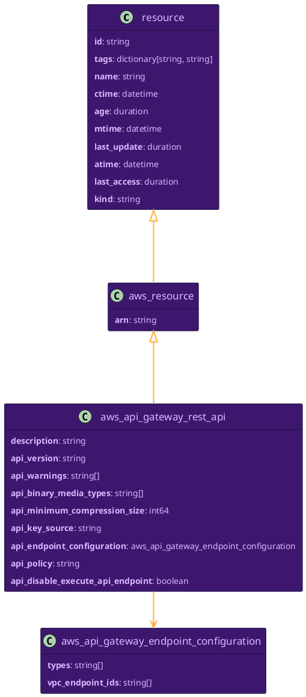

</ZoomPanPinch>

<details>
<summary>Relationships to Other Resources</summary>
<div>
<ZoomPanPinch>

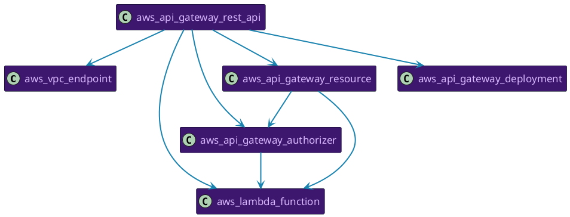

</ZoomPanPinch>
</div>
</details>

## `aws_api_gateway_stage`

<ZoomPanPinch>

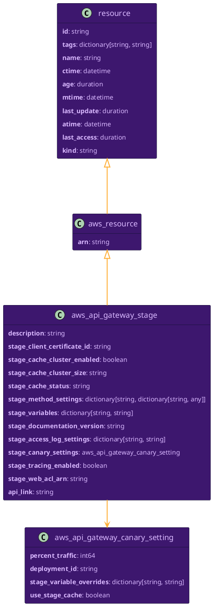

</ZoomPanPinch>

<details>
<summary>Relationships to Other Resources</summary>
<div>
<ZoomPanPinch>

```plantuml Diagram of aws_api_gateway_stage resource relationships
@startuml
hide empty members
skinparam ArrowColor #ffaf37
skinparam ArrowFontColor #ffaf37
skinparam ArrowFontName Helvetica
skinparam ArrowThickness 2
skinparam BackgroundColor transparent
skinparam ClassAttributeFontColor #d9b8ff
skinparam ClassBackgroundColor #3d176e
skinparam ClassBorderColor #000d19
skinparam ClassFontColor #d9b8ff
skinparam ClassFontName Helvetica
skinparam ClassFontSize 17
skinparam NoteBackgroundColor #d9b8ff
skinparam NoteBorderColor #000d19
skinparam NoteFontColor #3d176e
skinparam NoteFontName Helvetica
skinparam Padding 5
skinparam RoundCorner 5
skinparam Shadowing false
skinparam stereotypeCBackgroundColor #e98df7
skinparam stereotypeIBackgroundColor #e98df7

class aws_api_gateway_deployment [[#aws_api_gateway_deployment]] {

}
class aws_api_gateway_stage [[#aws_api_gateway_stage]] {

}
aws_api_gateway_deployment -[#1A83AF]-> aws_api_gateway_stage

@enduml
```

</ZoomPanPinch>
</div>
</details>

## `aws_athena_data_catalog`

<ZoomPanPinch>

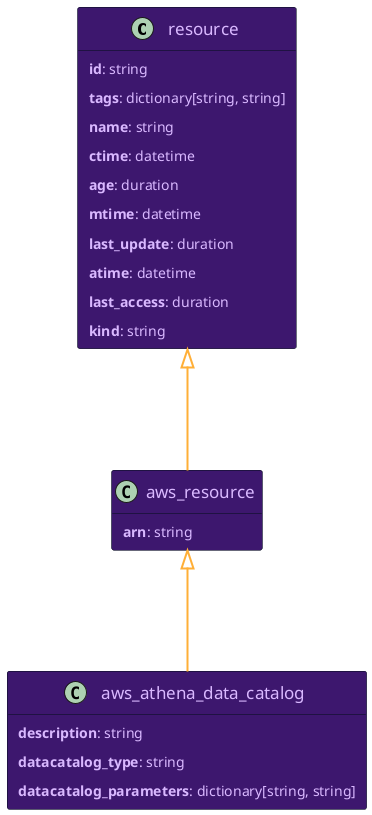

</ZoomPanPinch>

<details>
<summary>Relationships to Other Resources</summary>
<div>
<ZoomPanPinch>

```plantuml Diagram of aws_athena_data_catalog resource relationships
@startuml
hide empty members
skinparam ArrowColor #ffaf37
skinparam ArrowFontColor #ffaf37
skinparam ArrowFontName Helvetica
skinparam ArrowThickness 2
skinparam BackgroundColor transparent
skinparam ClassAttributeFontColor #d9b8ff
skinparam ClassBackgroundColor #3d176e
skinparam ClassBorderColor #000d19
skinparam ClassFontColor #d9b8ff
skinparam ClassFontName Helvetica
skinparam ClassFontSize 17
skinparam NoteBackgroundColor #d9b8ff
skinparam NoteBorderColor #000d19
skinparam NoteFontColor #3d176e
skinparam NoteFontName Helvetica
skinparam Padding 5
skinparam RoundCorner 5
skinparam Shadowing false
skinparam stereotypeCBackgroundColor #e98df7
skinparam stereotypeIBackgroundColor #e98df7

class aws_sagemaker_processing_job [[#aws_sagemaker_processing_job]] {

}
class aws_athena_data_catalog [[#aws_athena_data_catalog]] {

}
aws_athena_data_catalog -[#1A83AF]-> aws_sagemaker_processing_job

@enduml
```

</ZoomPanPinch>
</div>
</details>

## `aws_athena_work_group`

<ZoomPanPinch>

```plantuml Diagram of aws_athena_work_group data model
@startuml
hide empty members
skinparam ArrowColor #ffaf37
skinparam ArrowFontColor #ffaf37
skinparam ArrowFontName Helvetica
skinparam ArrowThickness 2
skinparam BackgroundColor transparent
skinparam ClassAttributeFontColor #d9b8ff
skinparam ClassBackgroundColor #3d176e
skinparam ClassBorderColor #000d19
skinparam ClassFontColor #d9b8ff
skinparam ClassFontName Helvetica
skinparam ClassFontSize 17
skinparam NoteBackgroundColor #d9b8ff
skinparam NoteBorderColor #000d19
skinparam NoteFontColor #3d176e
skinparam NoteFontName Helvetica
skinparam Padding 5
skinparam RoundCorner 5
skinparam Shadowing false
skinparam stereotypeCBackgroundColor #e98df7
skinparam stereotypeIBackgroundColor #e98df7

class resource [[#resource]] {
**id**: string
**tags**: dictionary[string, string]
**name**: string
**ctime**: datetime
**age**: duration
**mtime**: datetime
**last_update**: duration
**atime**: datetime
**last_access**: duration
**kind**: string
}
class aws_resource [[#aws_resource]] {
**arn**: string
}
class aws_athena_work_group_configuration [[#aws_athena_work_group_configuration]] {
**result_configuration**: aws_athena_result_configuration
**enforce_work_group_configuration**: boolean
**publish_cloud_watch_metrics_enabled**: boolean
**bytes_scanned_cutoff_per_query**: int64
**requester_pays_enabled**: boolean
**engine_version**: aws_athena_engine_version
}
class aws_athena_result_configuration [[#aws_athena_result_configuration]] {
**output_location**: string
**encryption_configuration**: aws_athena_encryption_configuration
**expected_bucket_owner**: string
}
class aws_athena_encryption_configuration [[#aws_athena_encryption_configuration]] {
**encryption_option**: string
**kms_key**: string
}
class aws_athena_engine_version [[#aws_athena_engine_version]] {
**selected_engine_version**: string
**effective_engine_version**: string
}
class aws_athena_work_group [[#aws_athena_work_group]] {
**workgroup_state**: string
**workgroup_configuration**: aws_athena_work_group_configuration
**description**: string
}
resource <|--- aws_resource
aws_athena_work_group_configuration --> aws_athena_result_configuration
aws_athena_work_group_configuration --> aws_athena_engine_version
aws_athena_result_configuration --> aws_athena_encryption_configuration
aws_resource <|--- aws_athena_work_group
aws_athena_work_group --> aws_athena_work_group_configuration

@enduml
```

</ZoomPanPinch>

<details>
<summary>Relationships to Other Resources</summary>
<div>
<ZoomPanPinch>

```plantuml Diagram of aws_athena_work_group resource relationships
@startuml
hide empty members
skinparam ArrowColor #ffaf37
skinparam ArrowFontColor #ffaf37
skinparam ArrowFontName Helvetica
skinparam ArrowThickness 2
skinparam BackgroundColor transparent
skinparam ClassAttributeFontColor #d9b8ff
skinparam ClassBackgroundColor #3d176e
skinparam ClassBorderColor #000d19
skinparam ClassFontColor #d9b8ff
skinparam ClassFontName Helvetica
skinparam ClassFontSize 17
skinparam NoteBackgroundColor #d9b8ff
skinparam NoteBorderColor #000d19
skinparam NoteFontColor #3d176e
skinparam NoteFontName Helvetica
skinparam Padding 5
skinparam RoundCorner 5
skinparam Shadowing false
skinparam stereotypeCBackgroundColor #e98df7
skinparam stereotypeIBackgroundColor #e98df7

class aws_kms_key [[#aws_kms_key]] {

}
class aws_s3_bucket [[#aws_s3_bucket]] {

}
class aws_sagemaker_processing_job [[#aws_sagemaker_processing_job]] {

}
class aws_athena_work_group [[#aws_athena_work_group]] {

}
aws_sagemaker_processing_job -[#1A83AF]-> aws_kms_key
aws_sagemaker_processing_job -[#1A83AF]-> aws_s3_bucket
aws_athena_work_group -[#1A83AF]-> aws_kms_key
aws_athena_work_group -[#1A83AF]-> aws_s3_bucket
aws_athena_work_group -[#1A83AF]-> aws_sagemaker_processing_job

@enduml
```

</ZoomPanPinch>
</div>
</details>

## `aws_autoscaling_group`

<ZoomPanPinch>

```plantuml Diagram of aws_autoscaling_group data model
@startuml
hide empty members
skinparam ArrowColor #ffaf37
skinparam ArrowFontColor #ffaf37
skinparam ArrowFontName Helvetica
skinparam ArrowThickness 2
skinparam BackgroundColor transparent
skinparam ClassAttributeFontColor #d9b8ff
skinparam ClassBackgroundColor #3d176e
skinparam ClassBorderColor #000d19
skinparam ClassFontColor #d9b8ff
skinparam ClassFontName Helvetica
skinparam ClassFontSize 17
skinparam NoteBackgroundColor #d9b8ff
skinparam NoteBorderColor #000d19
skinparam NoteFontColor #3d176e
skinparam NoteFontName Helvetica
skinparam Padding 5
skinparam RoundCorner 5
skinparam Shadowing false
skinparam stereotypeCBackgroundColor #e98df7
skinparam stereotypeIBackgroundColor #e98df7

class resource [[#resource]] {
**id**: string
**tags**: dictionary[string, string]
**name**: string
**ctime**: datetime
**age**: duration
**mtime**: datetime
**last_update**: duration
**atime**: datetime
**last_access**: duration
**kind**: string
}
class aws_resource [[#aws_resource]] {
**arn**: string
}
class aws_autoscaling_instance_requirements [[#aws_autoscaling_instance_requirements]] {
**v_cpu_count**: aws_autoscaling_min_max
**memory_mi_b**: aws_autoscaling_min_max
**cpu_manufacturers**: string[]
**memory_gi_b_per_v_cpu**: aws_autoscaling_min_max
**excluded_instance_types**: string[]
**instance_generations**: string[]
**spot_max_price_percentage_over_lowest_price**: int64
**on_demand_max_price_percentage_over_lowest_price**: int64
**bare_metal**: string
**burstable_performance**: string
**require_hibernate_support**: boolean
**network_interface_count**: aws_autoscaling_min_max
**local_storage**: string
**local_storage_types**: string[]
**total_local_storage_gb**: aws_autoscaling_min_max
**baseline_ebs_bandwidth_mbps**: aws_autoscaling_min_max
**accelerator_types**: string[]
**accelerator_count**: aws_autoscaling_min_max
**accelerator_manufacturers**: string[]
**accelerator_names**: string[]
**accelerator_total_memory_mi_b**: aws_autoscaling_min_max
}
class aws_autoscaling_min_max [[#aws_autoscaling_min_max]] {
**min**: int64
**max**: int64
}
class aws_autoscaling_group [[#aws_autoscaling_group]] {
**autoscaling_launch_configuration_name**: string
**autoscaling_launch_template**: aws_autoscaling_launch_template_specification
**autoscaling_mixed_instances_policy**: aws_autoscaling_mixed_instances_policy
**autoscaling_predicted_capacity**: int64
**autoscaling_default_cooldown**: int64
**autoscaling_availability_zones**: string[]
**autoscaling_load_balancer_names**: string[]
**autoscaling_target_group_ar_ns**: string[]
**autoscaling_health_check_type**: string
**autoscaling_health_check_grace_period**: int64
**autoscaling_instances**: aws_autoscaling_instance[]
**autoscaling_suspended_processes**: aws_autoscaling_suspended_process[]
**autoscaling_placement_group**: string
**autoscaling_vpc_zone_identifier**: string
**autoscaling_enabled_metrics**: aws_autoscaling_enabled_metric[]
**autoscaling_status**: string
**autoscaling_termination_policies**: string[]
**autoscaling_new_instances_protected_from_scale_in**: boolean
**autoscaling_service_linked_role_arn**: string
**autoscaling_max_instance_lifetime**: int64
**autoscaling_capacity_rebalance**: boolean
**autoscaling_warm_pool_configuration**: aws_autoscaling_warm_pool_configuration
**autoscaling_warm_pool_size**: int64
**autoscaling_context**: string
**autoscaling_desired_capacity_type**: string
**autoscaling_default_instance_warmup**: int64
}
class aws_autoscaling_enabled_metric [[#aws_autoscaling_enabled_metric]] {
**metric**: string
**granularity**: string
}
class aws_autoscaling_instance [[#aws_autoscaling_instance]] {
**instance_id**: string
**instance_type**: string
**availability_zone**: string
**lifecycle_state**: string
**health_status**: string
**launch_configuration_name**: string
**launch_template**: aws_autoscaling_launch_template_specification
**protected_from_scale_in**: boolean
**weighted_capacity**: string
}
class aws_autoscaling_launch_template_specification [[#aws_autoscaling_launch_template_specification]] {
**launch_template_id**: string
**launch_template_name**: string
**version**: string
}
class aws_autoscaling_mixed_instances_policy [[#aws_autoscaling_mixed_instances_policy]] {
**launch_template**: aws_autoscaling_launch_template
**instances_distribution**: aws_autoscaling_instances_distribution
}
class aws_autoscaling_launch_template [[#aws_autoscaling_launch_template]] {
**launch_template_specification**: aws_autoscaling_launch_template_specification
**overrides**: aws_autoscaling_launch_template_overrides[]
}
class aws_autoscaling_launch_template_overrides [[#aws_autoscaling_launch_template_overrides]] {
**instance_type**: string
**weighted_capacity**: string
**launch_template_specification**: aws_autoscaling_launch_template_specification
**instance_requirements**: aws_autoscaling_instance_requirements
}
class aws_autoscaling_instances_distribution [[#aws_autoscaling_instances_distribution]] {
**on_demand_allocation_strategy**: string
**on_demand_base_capacity**: int64
**on_demand_percentage_above_base_capacity**: int64
**spot_allocation_strategy**: string
**spot_instance_pools**: int64
**spot_max_price**: string
}
class autoscaling_group [[#autoscaling_group]] {
**min_size**: int64
**max_size**: int64
}
class aws_autoscaling_suspended_process [[#aws_autoscaling_suspended_process]] {
**process_name**: string
**suspension_reason**: string
}
class aws_autoscaling_warm_pool_configuration [[#aws_autoscaling_warm_pool_configuration]] {
**max_group_prepared_capacity**: int64
**min_size**: int64
**pool_state**: string
**status**: string
**instance_reuse_policy**: boolean
}
resource <|--- aws_resource
aws_autoscaling_instance_requirements --> aws_autoscaling_min_max
aws_resource <|--- aws_autoscaling_group
autoscaling_group <|--- aws_autoscaling_group
aws_autoscaling_group --> aws_autoscaling_launch_template_specification
aws_autoscaling_group --> aws_autoscaling_mixed_instances_policy
aws_autoscaling_group --> aws_autoscaling_instance
aws_autoscaling_group --> aws_autoscaling_suspended_process
aws_autoscaling_group --> aws_autoscaling_enabled_metric
aws_autoscaling_group --> aws_autoscaling_warm_pool_configuration
aws_autoscaling_instance --> aws_autoscaling_launch_template_specification
aws_autoscaling_mixed_instances_policy --> aws_autoscaling_launch_template
aws_autoscaling_mixed_instances_policy --> aws_autoscaling_instances_distribution
aws_autoscaling_launch_template --> aws_autoscaling_launch_template_specification
aws_autoscaling_launch_template --> aws_autoscaling_launch_template_overrides
aws_autoscaling_launch_template_overrides --> aws_autoscaling_launch_template_specification
aws_autoscaling_launch_template_overrides --> aws_autoscaling_instance_requirements
resource <|--- autoscaling_group

@enduml
```

</ZoomPanPinch>

<details>
<summary>Relationships to Other Resources</summary>
<div>
<ZoomPanPinch>

```plantuml Diagram of aws_autoscaling_group resource relationships
@startuml
hide empty members
skinparam ArrowColor #ffaf37
skinparam ArrowFontColor #ffaf37
skinparam ArrowFontName Helvetica
skinparam ArrowThickness 2
skinparam BackgroundColor transparent
skinparam ClassAttributeFontColor #d9b8ff
skinparam ClassBackgroundColor #3d176e
skinparam ClassBorderColor #000d19
skinparam ClassFontColor #d9b8ff
skinparam ClassFontName Helvetica
skinparam ClassFontSize 17
skinparam NoteBackgroundColor #d9b8ff
skinparam NoteBorderColor #000d19
skinparam NoteFontColor #3d176e
skinparam NoteFontName Helvetica
skinparam Padding 5
skinparam RoundCorner 5
skinparam Shadowing false
skinparam stereotypeCBackgroundColor #e98df7
skinparam stereotypeIBackgroundColor #e98df7

class aws_ec2_instance [[#aws_ec2_instance]] {

}
class aws_beanstalk_environment [[#aws_beanstalk_environment]] {

}
class aws_ecs_capacity_provider [[#aws_ecs_capacity_provider]] {

}
class aws_autoscaling_group [[#aws_autoscaling_group]] {

}
class aws_region [[#aws_region]] {

}
class aws_eks_nodegroup [[#aws_eks_nodegroup]] {

}
aws_beanstalk_environment -[#1A83AF]-> aws_ec2_instance
aws_beanstalk_environment -[#1A83AF]-> aws_autoscaling_group
aws_ecs_capacity_provider -[#1A83AF]-> aws_autoscaling_group
aws_autoscaling_group -[#1A83AF]-> aws_ec2_instance
aws_region -[#1A83AF]-> aws_autoscaling_group
aws_region -[#1A83AF]-> aws_ec2_instance
aws_eks_nodegroup -[#1A83AF]-> aws_autoscaling_group

@enduml
```

</ZoomPanPinch>
</div>
</details>

## `aws_beanstalk_application`

<ZoomPanPinch>

```plantuml Diagram of aws_beanstalk_application data model
@startuml
hide empty members
skinparam ArrowColor #ffaf37
skinparam ArrowFontColor #ffaf37
skinparam ArrowFontName Helvetica
skinparam ArrowThickness 2
skinparam BackgroundColor transparent
skinparam ClassAttributeFontColor #d9b8ff
skinparam ClassBackgroundColor #3d176e
skinparam ClassBorderColor #000d19
skinparam ClassFontColor #d9b8ff
skinparam ClassFontName Helvetica
skinparam ClassFontSize 17
skinparam NoteBackgroundColor #d9b8ff
skinparam NoteBorderColor #000d19
skinparam NoteFontColor #3d176e
skinparam NoteFontName Helvetica
skinparam Padding 5
skinparam RoundCorner 5
skinparam Shadowing false
skinparam stereotypeCBackgroundColor #e98df7
skinparam stereotypeIBackgroundColor #e98df7

class resource [[#resource]] {
**id**: string
**tags**: dictionary[string, string]
**name**: string
**ctime**: datetime
**age**: duration
**mtime**: datetime
**last_update**: duration
**atime**: datetime
**last_access**: duration
**kind**: string
}
class aws_resource [[#aws_resource]] {
**arn**: string
}
class aws_beanstalk_max_age_rule [[#aws_beanstalk_max_age_rule]] {
**enabled**: boolean
**max_age_in_days**: int64
**delete_source_from_s3**: boolean
}
class aws_beanstalk_application_version_lifecycle_config [[#aws_beanstalk_application_version_lifecycle_config]] {
**max_count_rule**: aws_beanstalk_max_count_rule
**max_age_rule**: aws_beanstalk_max_age_rule
}
class aws_beanstalk_max_count_rule [[#aws_beanstalk_max_count_rule]] {
**enabled**: boolean
**max_count**: int64
**delete_source_from_s3**: boolean
}
class aws_beanstalk_application [[#aws_beanstalk_application]] {
**description**: string
**beanstalk_versions**: string[]
**beanstalk_configuration_templates**: string[]
**beanstalk_resource_lifecycle_config**: aws_beanstalk_application_resource_lifecycle_config
}
class aws_beanstalk_application_resource_lifecycle_config [[#aws_beanstalk_application_resource_lifecycle_config]] {
**service_role**: string
**version_lifecycle_config**: aws_beanstalk_application_version_lifecycle_config
}
resource <|--- aws_resource
aws_beanstalk_application_version_lifecycle_config --> aws_beanstalk_max_count_rule
aws_beanstalk_application_version_lifecycle_config --> aws_beanstalk_max_age_rule
aws_resource <|--- aws_beanstalk_application
aws_beanstalk_application --> aws_beanstalk_application_resource_lifecycle_config
aws_beanstalk_application_resource_lifecycle_config --> aws_beanstalk_application_version_lifecycle_config

@enduml
```

</ZoomPanPinch>

<details>
<summary>Relationships to Other Resources</summary>
<div>
<ZoomPanPinch>

```plantuml Diagram of aws_beanstalk_application resource relationships
@startuml
hide empty members
skinparam ArrowColor #ffaf37
skinparam ArrowFontColor #ffaf37
skinparam ArrowFontName Helvetica
skinparam ArrowThickness 2
skinparam BackgroundColor transparent
skinparam ClassAttributeFontColor #d9b8ff
skinparam ClassBackgroundColor #3d176e
skinparam ClassBorderColor #000d19
skinparam ClassFontColor #d9b8ff
skinparam ClassFontName Helvetica
skinparam ClassFontSize 17
skinparam NoteBackgroundColor #d9b8ff
skinparam NoteBorderColor #000d19
skinparam NoteFontColor #3d176e
skinparam NoteFontName Helvetica
skinparam Padding 5
skinparam RoundCorner 5
skinparam Shadowing false
skinparam stereotypeCBackgroundColor #e98df7
skinparam stereotypeIBackgroundColor #e98df7

class aws_beanstalk_environment [[#aws_beanstalk_environment]] {

}
class aws_beanstalk_application [[#aws_beanstalk_application]] {

}
aws_beanstalk_application -[#1A83AF]-> aws_beanstalk_environment

@enduml
```

</ZoomPanPinch>
</div>
</details>

## `aws_beanstalk_environment`

<ZoomPanPinch>

```plantuml Diagram of aws_beanstalk_environment data model
@startuml
hide empty members
skinparam ArrowColor #ffaf37
skinparam ArrowFontColor #ffaf37
skinparam ArrowFontName Helvetica
skinparam ArrowThickness 2
skinparam BackgroundColor transparent
skinparam ClassAttributeFontColor #d9b8ff
skinparam ClassBackgroundColor #3d176e
skinparam ClassBorderColor #000d19
skinparam ClassFontColor #d9b8ff
skinparam ClassFontName Helvetica
skinparam ClassFontSize 17
skinparam NoteBackgroundColor #d9b8ff
skinparam NoteBorderColor #000d19
skinparam NoteFontColor #3d176e
skinparam NoteFontName Helvetica
skinparam Padding 5
skinparam RoundCorner 5
skinparam Shadowing false
skinparam stereotypeCBackgroundColor #e98df7
skinparam stereotypeIBackgroundColor #e98df7

class resource [[#resource]] {
**id**: string
**tags**: dictionary[string, string]
**name**: string
**ctime**: datetime
**age**: duration
**mtime**: datetime
**last_update**: duration
**atime**: datetime
**last_access**: duration
**kind**: string
}
class aws_beanstalk_environment_link [[#aws_beanstalk_environment_link]] {
**link_name**: string
**environment_name**: string
}
class aws_resource [[#aws_resource]] {
**arn**: string
}
class aws_beanstalk_environment [[#aws_beanstalk_environment]] {
**description**: string
**beanstalk_application_name**: string
**beanstalk_version_label**: string
**beanstalk_solution_stack_name**: string
**beanstalk_platform_arn**: string
**beanstalk_template_name**: string
**beanstalk_endpoint_url**: string
**beanstalk_cname**: string
**beanstalk_status**: string
**beanstalk_abortable_operation_in_progress**: boolean
**beanstalk_health**: string
**beanstalk_health_status**: string
**beanstalk_resources**: aws_beanstalk_environment_resources
**beanstalk_tier**: aws_beanstalk_environment_tier
**beanstalk_environment_links**: aws_beanstalk_environment_link[]
**beanstalk_operations_role**: string
}
class aws_beanstalk_environment_resources [[#aws_beanstalk_environment_resources]] {
**auto_scaling_groups**: aws_beanstalk_auto_scaling_group_description[]
**instances**: aws_beanstalk_instances_description[]
**load_balancers**: aws_beanstalk_load_balancer_description[]
**queues**: aws_beanstalk_queue_description[]
}
class aws_beanstalk_auto_scaling_group_description [[#aws_beanstalk_auto_scaling_group_description]] {
**auto_scaling_group_name**: string
}
class aws_beanstalk_instances_description [[#aws_beanstalk_instances_description]] {
**instance_id**: string
}
class aws_beanstalk_load_balancer_description [[#aws_beanstalk_load_balancer_description]] {
**load_balancer_name**: string
}
class aws_beanstalk_queue_description [[#aws_beanstalk_queue_description]] {
**queue_name**: string
**queue_url**: string
}
class aws_beanstalk_environment_tier [[#aws_beanstalk_environment_tier]] {
**name**: string
**type**: string
**version**: string
}
resource <|--- aws_resource
aws_resource <|--- aws_beanstalk_environment
aws_beanstalk_environment --> aws_beanstalk_environment_resources
aws_beanstalk_environment --> aws_beanstalk_environment_tier
aws_beanstalk_environment --> aws_beanstalk_environment_link
aws_beanstalk_environment_resources --> aws_beanstalk_auto_scaling_group_description
aws_beanstalk_environment_resources --> aws_beanstalk_instances_description
aws_beanstalk_environment_resources --> aws_beanstalk_load_balancer_description
aws_beanstalk_environment_resources --> aws_beanstalk_queue_description

@enduml
```

</ZoomPanPinch>

<details>
<summary>Relationships to Other Resources</summary>
<div>
<ZoomPanPinch>

```plantuml Diagram of aws_beanstalk_environment resource relationships
@startuml
hide empty members
skinparam ArrowColor #ffaf37
skinparam ArrowFontColor #ffaf37
skinparam ArrowFontName Helvetica
skinparam ArrowThickness 2
skinparam BackgroundColor transparent
skinparam ClassAttributeFontColor #d9b8ff
skinparam ClassBackgroundColor #3d176e
skinparam ClassBorderColor #000d19
skinparam ClassFontColor #d9b8ff
skinparam ClassFontName Helvetica
skinparam ClassFontSize 17
skinparam NoteBackgroundColor #d9b8ff
skinparam NoteBorderColor #000d19
skinparam NoteFontColor #3d176e
skinparam NoteFontName Helvetica
skinparam Padding 5
skinparam RoundCorner 5
skinparam Shadowing false
skinparam stereotypeCBackgroundColor #e98df7
skinparam stereotypeIBackgroundColor #e98df7

class aws_ec2_instance [[#aws_ec2_instance]] {

}
class aws_sqs_queue [[#aws_sqs_queue]] {

}
class aws_beanstalk_environment [[#aws_beanstalk_environment]] {

}
class aws_autoscaling_group [[#aws_autoscaling_group]] {

}
class aws_alb [[#aws_alb]] {

}
class aws_beanstalk_application [[#aws_beanstalk_application]] {

}
aws_beanstalk_environment -[#1A83AF]-> aws_alb
aws_beanstalk_environment -[#1A83AF]-> aws_sqs_queue
aws_beanstalk_environment -[#1A83AF]-> aws_ec2_instance
aws_beanstalk_environment -[#1A83AF]-> aws_autoscaling_group
aws_autoscaling_group -[#1A83AF]-> aws_ec2_instance
aws_beanstalk_application -[#1A83AF]-> aws_beanstalk_environment

@enduml
```

</ZoomPanPinch>
</div>
</details>

## `aws_cloud_formation_stack_instance_summary`

<ZoomPanPinch>

```plantuml Diagram of aws_cloud_formation_stack_instance_summary data model
@startuml
hide empty members
skinparam ArrowColor #ffaf37
skinparam ArrowFontColor #ffaf37
skinparam ArrowFontName Helvetica
skinparam ArrowThickness 2
skinparam BackgroundColor transparent
skinparam ClassAttributeFontColor #d9b8ff
skinparam ClassBackgroundColor #3d176e
skinparam ClassBorderColor #000d19
skinparam ClassFontColor #d9b8ff
skinparam ClassFontName Helvetica
skinparam ClassFontSize 17
skinparam NoteBackgroundColor #d9b8ff
skinparam NoteBorderColor #000d19
skinparam NoteFontColor #3d176e
skinparam NoteFontName Helvetica
skinparam Padding 5
skinparam RoundCorner 5
skinparam Shadowing false
skinparam stereotypeCBackgroundColor #e98df7
skinparam stereotypeIBackgroundColor #e98df7

class resource [[#resource]] {
**id**: string
**tags**: dictionary[string, string]
**name**: string
**ctime**: datetime
**age**: duration
**mtime**: datetime
**last_update**: duration
**atime**: datetime
**last_access**: duration
**kind**: string
}
class aws_resource [[#aws_resource]] {
**arn**: string
}
class aws_cloud_formation_stack_instance_summary [[#aws_cloud_formation_stack_instance_summary]] {
**stack_instance_stack_set_id**: string
**stack_instance_region**: string
**stack_instance_account**: string
**stack_instance_stack_id**: string
**stack_instance_status**: string
**stack_instance_status_reason**: string
**stack_instance_stack_instance_status**: string
**stack_instance_organizational_unit_id**: string
**stack_instance_drift_status**: string
**stack_instance_last_drift_check_timestamp**: datetime
**stack_instance_last_operation_id**: string
}
resource <|--- aws_resource
aws_resource <|--- aws_cloud_formation_stack_instance_summary

@enduml
```

</ZoomPanPinch>

<details>
<summary>Relationships to Other Resources</summary>
<div>
<ZoomPanPinch>

```plantuml Diagram of aws_cloud_formation_stack_instance_summary resource relationships
@startuml
hide empty members
skinparam ArrowColor #ffaf37
skinparam ArrowFontColor #ffaf37
skinparam ArrowFontName Helvetica
skinparam ArrowThickness 2
skinparam BackgroundColor transparent
skinparam ClassAttributeFontColor #d9b8ff
skinparam ClassBackgroundColor #3d176e
skinparam ClassBorderColor #000d19
skinparam ClassFontColor #d9b8ff
skinparam ClassFontName Helvetica
skinparam ClassFontSize 17
skinparam NoteBackgroundColor #d9b8ff
skinparam NoteBorderColor #000d19
skinparam NoteFontColor #3d176e
skinparam NoteFontName Helvetica
skinparam Padding 5
skinparam RoundCorner 5
skinparam Shadowing false
skinparam stereotypeCBackgroundColor #e98df7
skinparam stereotypeIBackgroundColor #e98df7

class aws_cloud_formation_stack_instance_summary [[#aws_cloud_formation_stack_instance_summary]] {

}

@enduml
```

</ZoomPanPinch>
</div>
</details>

## `aws_cloud_trail`

<ZoomPanPinch>

```plantuml Diagram of aws_cloud_trail data model
@startuml
hide empty members
skinparam ArrowColor #ffaf37
skinparam ArrowFontColor #ffaf37
skinparam ArrowFontName Helvetica
skinparam ArrowThickness 2
skinparam BackgroundColor transparent
skinparam ClassAttributeFontColor #d9b8ff
skinparam ClassBackgroundColor #3d176e
skinparam ClassBorderColor #000d19
skinparam ClassFontColor #d9b8ff
skinparam ClassFontName Helvetica
skinparam ClassFontSize 17
skinparam NoteBackgroundColor #d9b8ff
skinparam NoteBorderColor #000d19
skinparam NoteFontColor #3d176e
skinparam NoteFontName Helvetica
skinparam Padding 5
skinparam RoundCorner 5
skinparam Shadowing false
skinparam stereotypeCBackgroundColor #e98df7
skinparam stereotypeIBackgroundColor #e98df7

class resource [[#resource]] {
**id**: string
**tags**: dictionary[string, string]
**name**: string
**ctime**: datetime
**age**: duration
**mtime**: datetime
**last_update**: duration
**atime**: datetime
**last_access**: duration
**kind**: string
}
class aws_cloud_trail_event_selector [[#aws_cloud_trail_event_selector]] {
**name**: string
**field_selectors**: dictionary[string, aws_cloud_trail_advanced_field_selector]
}
class aws_cloud_trail_advanced_field_selector [[#aws_cloud_trail_advanced_field_selector]] {
**equals**: string[]
**starts_with**: string[]
**ends_with**: string[]
**not_equals**: string[]
**not_starts_with**: string[]
**not_ends_with**: string[]
}
class aws_resource [[#aws_resource]] {
**arn**: string
}
class aws_cloud_trail [[#aws_cloud_trail]] {
**trail_s3_bucket_name**: string
**trail_s3_key_prefix**: string
**trail_sns_topic_name**: string
**trail_sns_topic_arn**: string
**trail_include_global_service_events**: boolean
**trail_is_multi_region_trail**: boolean
**trail_home_region**: string
**trail_log_file_validation_enabled**: boolean
**trail_cloud_watch_logs_log_group_arn**: string
**trail_cloud_watch_logs_role_arn**: string
**trail_kms_key_id**: string
**trail_has_custom_event_selectors**: boolean
**trail_has_insight_selectors**: boolean
**trail_is_organization_trail**: boolean
**trail_status**: aws_cloud_trail_status
**trail_event_selectors**: aws_cloud_trail_event_selector[]
**trail_insight_selectors**: string[]
}
class aws_cloud_trail_status [[#aws_cloud_trail_status]] {
**is_logging**: boolean
**latest_delivery_error**: string
**latest_notification_error**: string
**latest_delivery_time**: datetime
**latest_notification_time**: datetime
**start_logging_time**: datetime
**stop_logging_time**: datetime
**latest_cloud_watch_logs_delivery_error**: string
**latest_cloud_watch_logs_delivery_time**: datetime
**latest_digest_delivery_time**: datetime
**latest_digest_delivery_error**: string
**latest_delivery_attempt_time**: datetime
**latest_notification_attempt_time**: datetime
**latest_notification_attempt_succeeded**: datetime
**latest_delivery_attempt_succeeded**: datetime
**time_logging_started**: datetime
**time_logging_stopped**: datetime
}
aws_cloud_trail_event_selector --> aws_cloud_trail_advanced_field_selector
resource <|--- aws_resource
aws_resource <|--- aws_cloud_trail
aws_cloud_trail --> aws_cloud_trail_status
aws_cloud_trail --> aws_cloud_trail_event_selector

@enduml
```

</ZoomPanPinch>

<details>
<summary>Relationships to Other Resources</summary>
<div>
<ZoomPanPinch>

```plantuml Diagram of aws_cloud_trail resource relationships
@startuml
hide empty members
skinparam ArrowColor #ffaf37
skinparam ArrowFontColor #ffaf37
skinparam ArrowFontName Helvetica
skinparam ArrowThickness 2
skinparam BackgroundColor transparent
skinparam ClassAttributeFontColor #d9b8ff
skinparam ClassBackgroundColor #3d176e
skinparam ClassBorderColor #000d19
skinparam ClassFontColor #d9b8ff
skinparam ClassFontName Helvetica
skinparam ClassFontSize 17
skinparam NoteBackgroundColor #d9b8ff
skinparam NoteBorderColor #000d19
skinparam NoteFontColor #3d176e
skinparam NoteFontName Helvetica
skinparam Padding 5
skinparam RoundCorner 5
skinparam Shadowing false
skinparam stereotypeCBackgroundColor #e98df7
skinparam stereotypeIBackgroundColor #e98df7

class aws_kms_key [[#aws_kms_key]] {

}
class aws_s3_bucket [[#aws_s3_bucket]] {

}
class aws_cloud_trail [[#aws_cloud_trail]] {

}
class aws_sns_topic [[#aws_sns_topic]] {

}
aws_cloud_trail -[#1A83AF]-> aws_kms_key
aws_cloud_trail -[#1A83AF]-> aws_sns_topic
aws_cloud_trail -[#1A83AF]-> aws_s3_bucket
aws_sns_topic -[#1A83AF]-> aws_kms_key

@enduml
```

</ZoomPanPinch>
</div>
</details>

## `aws_cloudformation_stack`

<ZoomPanPinch>

```plantuml Diagram of aws_cloudformation_stack data model
@startuml
hide empty members
skinparam ArrowColor #ffaf37
skinparam ArrowFontColor #ffaf37
skinparam ArrowFontName Helvetica
skinparam ArrowThickness 2
skinparam BackgroundColor transparent
skinparam ClassAttributeFontColor #d9b8ff
skinparam ClassBackgroundColor #3d176e
skinparam ClassBorderColor #000d19
skinparam ClassFontColor #d9b8ff
skinparam ClassFontName Helvetica
skinparam ClassFontSize 17
skinparam NoteBackgroundColor #d9b8ff
skinparam NoteBorderColor #000d19
skinparam NoteFontColor #3d176e
skinparam NoteFontName Helvetica
skinparam Padding 5
skinparam RoundCorner 5
skinparam Shadowing false
skinparam stereotypeCBackgroundColor #e98df7
skinparam stereotypeIBackgroundColor #e98df7

class resource [[#resource]] {
**id**: string
**tags**: dictionary[string, string]
**name**: string
**ctime**: datetime
**age**: duration
**mtime**: datetime
**last_update**: duration
**atime**: datetime
**last_access**: duration
**kind**: string
}
class aws_resource [[#aws_resource]] {
**arn**: string
}
class aws_cloudformation_stack [[#aws_cloudformation_stack]] {
**stack_change_set_id**: string
**description**: string
**stack_deletion_time**: datetime
**stack_rollback_configuration**: aws_cloudformation_rollback_configuration
**stack_disable_rollback**: boolean
**stack_notification_ar_ns**: string[]
**stack_timeout_in_minutes**: int64
**stack_capabilities**: string[]
**stack_outputs**: aws_cloudformation_output[]
**stack_role_arn**: string
**stack_enable_termination_protection**: boolean
**stack_parent_id**: string
**stack_root_id**: string
**stack_drift_information**: aws_cloudformation_stack_drift_information
}
class stack [[#stack]] {
**stack_status**: string
**stack_status_reason**: string
**stack_parameters**: dictionary[string, string]
}
class aws_cloudformation_rollback_configuration [[#aws_cloudformation_rollback_configuration]] {
**rollback_triggers**: aws_cloudformation_rollback_trigger[]
**monitoring_time_in_minutes**: int64
}
class aws_cloudformation_rollback_trigger [[#aws_cloudformation_rollback_trigger]] {
**arn**: string
**type**: string
}
class aws_cloudformation_output [[#aws_cloudformation_output]] {
**output_key**: string
**output_value**: string
**description**: string
**export_name**: string
}
class aws_cloudformation_stack_drift_information [[#aws_cloudformation_stack_drift_information]] {
**stack_drift_status**: string
**last_check_timestamp**: datetime
}
resource <|--- aws_resource
aws_resource <|--- aws_cloudformation_stack
stack <|--- aws_cloudformation_stack
aws_cloudformation_stack --> aws_cloudformation_rollback_configuration
aws_cloudformation_stack --> aws_cloudformation_output
aws_cloudformation_stack --> aws_cloudformation_stack_drift_information
resource <|--- stack
aws_cloudformation_rollback_configuration --> aws_cloudformation_rollback_trigger

@enduml
```

</ZoomPanPinch>

<details>
<summary>Relationships to Other Resources</summary>
<div>
<ZoomPanPinch>

```plantuml Diagram of aws_cloudformation_stack resource relationships
@startuml
hide empty members
skinparam ArrowColor #ffaf37
skinparam ArrowFontColor #ffaf37
skinparam ArrowFontName Helvetica
skinparam ArrowThickness 2
skinparam BackgroundColor transparent
skinparam ClassAttributeFontColor #d9b8ff
skinparam ClassBackgroundColor #3d176e
skinparam ClassBorderColor #000d19
skinparam ClassFontColor #d9b8ff
skinparam ClassFontName Helvetica
skinparam ClassFontSize 17
skinparam NoteBackgroundColor #d9b8ff
skinparam NoteBorderColor #000d19
skinparam NoteFontColor #3d176e
skinparam NoteFontName Helvetica
skinparam Padding 5
skinparam RoundCorner 5
skinparam Shadowing false
skinparam stereotypeCBackgroundColor #e98df7
skinparam stereotypeIBackgroundColor #e98df7

class aws_cloudformation_stack [[#aws_cloudformation_stack]] {

}
class aws_region [[#aws_region]] {

}
aws_region -[#1A83AF]-> aws_cloudformation_stack

@enduml
```

</ZoomPanPinch>
</div>
</details>

## `aws_cloudformation_stack_set`

<ZoomPanPinch>

```plantuml Diagram of aws_cloudformation_stack_set data model
@startuml
hide empty members
skinparam ArrowColor #ffaf37
skinparam ArrowFontColor #ffaf37
skinparam ArrowFontName Helvetica
skinparam ArrowThickness 2
skinparam BackgroundColor transparent
skinparam ClassAttributeFontColor #d9b8ff
skinparam ClassBackgroundColor #3d176e
skinparam ClassBorderColor #000d19
skinparam ClassFontColor #d9b8ff
skinparam ClassFontName Helvetica
skinparam ClassFontSize 17
skinparam NoteBackgroundColor #d9b8ff
skinparam NoteBorderColor #000d19
skinparam NoteFontColor #3d176e
skinparam NoteFontName Helvetica
skinparam Padding 5
skinparam RoundCorner 5
skinparam Shadowing false
skinparam stereotypeCBackgroundColor #e98df7
skinparam stereotypeIBackgroundColor #e98df7

class resource [[#resource]] {
**id**: string
**tags**: dictionary[string, string]
**name**: string
**ctime**: datetime
**age**: duration
**mtime**: datetime
**last_update**: duration
**atime**: datetime
**last_access**: duration
**kind**: string
}
class aws_resource [[#aws_resource]] {
**arn**: string
}
class aws_cloudformation_auto_deployment [[#aws_cloudformation_auto_deployment]] {
**enabled**: boolean
**retain_stacks_on_account_removal**: boolean
}
class aws_cloudformation_stack_set [[#aws_cloudformation_stack_set]] {
**description**: string
**stack_set_status**: string
**stack_set_auto_deployment**: aws_cloudformation_auto_deployment
**stack_set_permission_model**: string
**stack_set_drift_status**: string
**stack_set_last_drift_check_timestamp**: datetime
**stack_set_managed_execution**: boolean
**stack_set_parameters**: dictionary[string, any]
}
resource <|--- aws_resource
aws_resource <|--- aws_cloudformation_stack_set
aws_cloudformation_stack_set --> aws_cloudformation_auto_deployment

@enduml
```

</ZoomPanPinch>

<details>
<summary>Relationships to Other Resources</summary>
<div>
<ZoomPanPinch>

```plantuml Diagram of aws_cloudformation_stack_set resource relationships
@startuml
hide empty members
skinparam ArrowColor #ffaf37
skinparam ArrowFontColor #ffaf37
skinparam ArrowFontName Helvetica
skinparam ArrowThickness 2
skinparam BackgroundColor transparent
skinparam ClassAttributeFontColor #d9b8ff
skinparam ClassBackgroundColor #3d176e
skinparam ClassBorderColor #000d19
skinparam ClassFontColor #d9b8ff
skinparam ClassFontName Helvetica
skinparam ClassFontSize 17
skinparam NoteBackgroundColor #d9b8ff
skinparam NoteBorderColor #000d19
skinparam NoteFontColor #3d176e
skinparam NoteFontName Helvetica
skinparam Padding 5
skinparam RoundCorner 5
skinparam Shadowing false
skinparam stereotypeCBackgroundColor #e98df7
skinparam stereotypeIBackgroundColor #e98df7

class aws_region [[#aws_region]] {

}
class aws_cloudformation_stack_set [[#aws_cloudformation_stack_set]] {

}
aws_region -[#1A83AF]-> aws_cloudformation_stack_set

@enduml
```

</ZoomPanPinch>
</div>
</details>

## `aws_cloudfront_cache_policy`

<ZoomPanPinch>

```plantuml Diagram of aws_cloudfront_cache_policy data model
@startuml
hide empty members
skinparam ArrowColor #ffaf37
skinparam ArrowFontColor #ffaf37
skinparam ArrowFontName Helvetica
skinparam ArrowThickness 2
skinparam BackgroundColor transparent
skinparam ClassAttributeFontColor #d9b8ff
skinparam ClassBackgroundColor #3d176e
skinparam ClassBorderColor #000d19
skinparam ClassFontColor #d9b8ff
skinparam ClassFontName Helvetica
skinparam ClassFontSize 17
skinparam NoteBackgroundColor #d9b8ff
skinparam NoteBorderColor #000d19
skinparam NoteFontColor #3d176e
skinparam NoteFontName Helvetica
skinparam Padding 5
skinparam RoundCorner 5
skinparam Shadowing false
skinparam stereotypeCBackgroundColor #e98df7
skinparam stereotypeIBackgroundColor #e98df7

class resource [[#resource]] {
**id**: string
**tags**: dictionary[string, string]
**name**: string
**ctime**: datetime
**age**: duration
**mtime**: datetime
**last_update**: duration
**atime**: datetime
**last_access**: duration
**kind**: string
}
class aws_resource [[#aws_resource]] {
**arn**: string
}
class aws_cloudfront_cache_policy_query_strings_config [[#aws_cloudfront_cache_policy_query_strings_config]] {
**query_string_behavior**: string
**query_strings**: string[]
}
class aws_cloudfront_cache_policy_config [[#aws_cloudfront_cache_policy_config]] {
**comment**: string
**name**: string
**default_ttl**: int64
**max_ttl**: int64
**min_ttl**: int64
**parameters_in_cache_key_and_forwarded_to_origin**: aws_cloudfront_parameters_in_cache_key_and_forwarded_to_origin
}
class aws_cloudfront_parameters_in_cache_key_and_forwarded_to_origin [[#aws_cloudfront_parameters_in_cache_key_and_forwarded_to_origin]] {
**enable_accept_encoding_gzip**: boolean
**enable_accept_encoding_brotli**: boolean
**headers_config**: aws_cloudfront_cache_policy_headers_config
**cookies_config**: aws_cloudfront_cache_policy_cookies_config
**query_strings_config**: aws_cloudfront_cache_policy_query_strings_config
}
class aws_cloudfront_cache_policy_headers_config [[#aws_cloudfront_cache_policy_headers_config]] {
**header_behavior**: string
**headers**: string[]
}
class aws_cloudfront_cache_policy_cookies_config [[#aws_cloudfront_cache_policy_cookies_config]] {
**cookie_behavior**: string
**cookies**: string[]
}
class aws_cloudfront_cache_policy [[#aws_cloudfront_cache_policy]] {
**cache_policy_config**: aws_cloudfront_cache_policy_config
}
resource <|--- aws_resource
aws_cloudfront_cache_policy_config --> aws_cloudfront_parameters_in_cache_key_and_forwarded_to_origin
aws_cloudfront_parameters_in_cache_key_and_forwarded_to_origin --> aws_cloudfront_cache_policy_headers_config
aws_cloudfront_parameters_in_cache_key_and_forwarded_to_origin --> aws_cloudfront_cache_policy_cookies_config
aws_cloudfront_parameters_in_cache_key_and_forwarded_to_origin --> aws_cloudfront_cache_policy_query_strings_config
aws_resource <|--- aws_cloudfront_cache_policy
aws_cloudfront_cache_policy --> aws_cloudfront_cache_policy_config

@enduml
```

</ZoomPanPinch>

<details>
<summary>Relationships to Other Resources</summary>
<div>
<ZoomPanPinch>

```plantuml Diagram of aws_cloudfront_cache_policy resource relationships
@startuml
hide empty members
skinparam ArrowColor #ffaf37
skinparam ArrowFontColor #ffaf37
skinparam ArrowFontName Helvetica
skinparam ArrowThickness 2
skinparam BackgroundColor transparent
skinparam ClassAttributeFontColor #d9b8ff
skinparam ClassBackgroundColor #3d176e
skinparam ClassBorderColor #000d19
skinparam ClassFontColor #d9b8ff
skinparam ClassFontName Helvetica
skinparam ClassFontSize 17
skinparam NoteBackgroundColor #d9b8ff
skinparam NoteBorderColor #000d19
skinparam NoteFontColor #3d176e
skinparam NoteFontName Helvetica
skinparam Padding 5
skinparam RoundCorner 5
skinparam Shadowing false
skinparam stereotypeCBackgroundColor #e98df7
skinparam stereotypeIBackgroundColor #e98df7

class aws_cloudfront_cache_policy [[#aws_cloudfront_cache_policy]] {

}
class aws_cloudfront_distribution [[#aws_cloudfront_distribution]] {

}
aws_cloudfront_distribution -[#1A83AF]-> aws_cloudfront_cache_policy

@enduml
```

</ZoomPanPinch>
</div>
</details>

## `aws_cloudfront_distribution`

<ZoomPanPinch>

```plantuml Diagram of aws_cloudfront_distribution data model
@startuml
hide empty members
skinparam ArrowColor #ffaf37
skinparam ArrowFontColor #ffaf37
skinparam ArrowFontName Helvetica
skinparam ArrowThickness 2
skinparam BackgroundColor transparent
skinparam ClassAttributeFontColor #d9b8ff
skinparam ClassBackgroundColor #3d176e
skinparam ClassBorderColor #000d19
skinparam ClassFontColor #d9b8ff
skinparam ClassFontName Helvetica
skinparam ClassFontSize 17
skinparam NoteBackgroundColor #d9b8ff
skinparam NoteBorderColor #000d19
skinparam NoteFontColor #3d176e
skinparam NoteFontName Helvetica
skinparam Padding 5
skinparam RoundCorner 5
skinparam Shadowing false
skinparam stereotypeCBackgroundColor #e98df7
skinparam stereotypeIBackgroundColor #e98df7

class resource [[#resource]] {
**id**: string
**tags**: dictionary[string, string]
**name**: string
**ctime**: datetime
**age**: duration
**mtime**: datetime
**last_update**: duration
**atime**: datetime
**last_access**: duration
**kind**: string
}
class aws_resource [[#aws_resource]] {
**arn**: string
}
class aws_cloudfront_forwarded_values [[#aws_cloudfront_forwarded_values]] {
**query_string**: boolean
**cookies**: aws_cloudfront_cookie_preference
**headers**: string[]
**query_string_cache_keys**: string[]
}
class aws_cloudfront_cookie_preference [[#aws_cloudfront_cookie_preference]] {
**forward**: string
**whitelisted_names**: string[]
}
class aws_cloudfront_cache_behavior [[#aws_cloudfront_cache_behavior]] {
**path_pattern**: string
**target_origin_id**: string
**trusted_signers**: string[]
**trusted_key_groups**: string[]
**viewer_protocol_policy**: string
**allowed_methods**: string[]
**smooth_streaming**: boolean
**compress**: boolean
**lambda_function_association**: aws_cloudfront_lambda_function_association[]
**function_association**: aws_cloudfront_function_association[]
**field_level_encryption_id**: string
**realtime_log_config_arn**: string
**cache_policy_id**: string
**origin_request_policy_id**: string
**response_headers_policy_id**: string
**forwarded_values**: aws_cloudfront_forwarded_values
**min_ttl**: int64
**default_ttl**: int64
**max_ttl**: int64
}
class aws_cloudfront_lambda_function_association [[#aws_cloudfront_lambda_function_association]] {
**lambda_function_arn**: string
**event_type**: string
**include_body**: boolean
}
class aws_cloudfront_function_association [[#aws_cloudfront_function_association]] {
**function_arn**: string
**event_type**: string
}
class aws_cloudfront_custom_error_response [[#aws_cloudfront_custom_error_response]] {
**error_code**: int64
**response_page_path**: string
**response_code**: string
**error_caching_min_ttl**: int64
}
class aws_cloudfront_default_cache_behavior [[#aws_cloudfront_default_cache_behavior]] {
**target_origin_id**: string
**trusted_signers**: string[]
**trusted_key_groups**: string[]
**viewer_protocol_policy**: string
**allowed_methods**: string[]
**smooth_streaming**: boolean
**compress**: boolean
**lambda_function_association**: aws_cloudfront_lambda_function_association[]
**function_association**: aws_cloudfront_function_association[]
**field_level_encryption_id**: string
**realtime_log_config_arn**: string
**cache_policy_id**: string
**origin_request_policy_id**: string
**response_headers_policy_id**: string
**forwarded_values**: aws_cloudfront_forwarded_values
**min_ttl**: int64
**default_ttl**: int64
**max_ttl**: int64
}
class aws_cloudfront_alias_icp_recordal [[#aws_cloudfront_alias_icp_recordal]] {
**cname**: string
**icp_recordal_status**: string
}
class aws_cloudfront_distribution [[#aws_cloudfront_distribution]] {
**distribution_status**: string
**distribution_domain_name**: string
**distribution_aliases**: string[]
**distribution_origin**: aws_cloudfront_origin[]
**distribution_origin_group**: aws_cloudfront_origin_group[]
**distribution_default_cache_behavior**: aws_cloudfront_default_cache_behavior
**distribution_cache_behavior**: aws_cloudfront_cache_behavior[]
**distribution_custom_error_response**: aws_cloudfront_custom_error_response[]
**distribution_comment**: string
**distribution_price_class**: string
**distribution_enabled**: boolean
**distribution_viewer_certificate**: aws_cloudfront_viewer_certificate
**distribution_restrictions**: aws_cloudfront_restrictions
**distribution_web_acl_id**: string
**distribution_http_version**: string
**distribution_is_ipv6_enabled**: boolean
**distribution_alias_icp_recordals**: aws_cloudfront_alias_icp_recordal[]
}
class aws_cloudfront_origin_shield [[#aws_cloudfront_origin_shield]] {
**enabled**: boolean
**origin_shield_region**: string
}
class aws_cloudfront_origin_custom_header [[#aws_cloudfront_origin_custom_header]] {
**header_name**: string
**header_value**: string
}
class aws_cloudfront_viewer_certificate [[#aws_cloudfront_viewer_certificate]] {
**cloudfront_default_certificate**: boolean
**iam_certificate_id**: string
**acm_certificate_arn**: string
**ssl_support_method**: string
**minimum_protocol_version**: string
**certificate**: string
**certificate_source**: string
}
class aws_cloudfront_origin_group_failover_criteria [[#aws_cloudfront_origin_group_failover_criteria]] {
**status_codes**: string[]
}
class aws_cloudfront_custom_origin_config [[#aws_cloudfront_custom_origin_config]] {
**http_port**: int64
**https_port**: int64
**origin_protocol_policy**: string
**origin_ssl_protocol**: string[]
**origin_read_timeout**: int64
**origin_keepalive_timeout**: int64
}
class aws_cloudfront_origin_group_members [[#aws_cloudfront_origin_group_members]] {
**members**: string
}
class aws_cloudfront_restrictions [[#aws_cloudfront_restrictions]] {
**geo_restriction**: string[]
}
class aws_cloudfront_origin [[#aws_cloudfront_origin]] {
**id**: string
**domain_name**: string
**origin_path**: string
**custom_header**: aws_cloudfront_origin_custom_header[]
**s3_origin_config**: string
**custom_origin_config**: aws_cloudfront_custom_origin_config
**connection_attempts**: int64
**connection_timeout**: int64
**origin_shield**: aws_cloudfront_origin_shield
**origin_access_control_id**: string
}
class aws_cloudfront_origin_group [[#aws_cloudfront_origin_group]] {
**id**: string
**failover_criteria**: aws_cloudfront_origin_group_failover_criteria
**members**: aws_cloudfront_origin_group_members[]
}
resource <|--- aws_resource
aws_cloudfront_forwarded_values --> aws_cloudfront_cookie_preference
aws_cloudfront_cache_behavior --> aws_cloudfront_lambda_function_association
aws_cloudfront_cache_behavior --> aws_cloudfront_function_association
aws_cloudfront_cache_behavior --> aws_cloudfront_forwarded_values
aws_cloudfront_default_cache_behavior --> aws_cloudfront_lambda_function_association
aws_cloudfront_default_cache_behavior --> aws_cloudfront_function_association
aws_cloudfront_default_cache_behavior --> aws_cloudfront_forwarded_values
aws_resource <|--- aws_cloudfront_distribution
aws_cloudfront_distribution --> aws_cloudfront_origin
aws_cloudfront_distribution --> aws_cloudfront_origin_group
aws_cloudfront_distribution --> aws_cloudfront_default_cache_behavior
aws_cloudfront_distribution --> aws_cloudfront_cache_behavior
aws_cloudfront_distribution --> aws_cloudfront_custom_error_response
aws_cloudfront_distribution --> aws_cloudfront_viewer_certificate
aws_cloudfront_distribution --> aws_cloudfront_restrictions
aws_cloudfront_distribution --> aws_cloudfront_alias_icp_recordal
aws_cloudfront_origin --> aws_cloudfront_origin_custom_header
aws_cloudfront_origin --> aws_cloudfront_custom_origin_config
aws_cloudfront_origin --> aws_cloudfront_origin_shield
aws_cloudfront_origin_group --> aws_cloudfront_origin_group_failover_criteria
aws_cloudfront_origin_group --> aws_cloudfront_origin_group_members

@enduml
```

</ZoomPanPinch>

<details>
<summary>Relationships to Other Resources</summary>
<div>
<ZoomPanPinch>

```plantuml Diagram of aws_cloudfront_distribution resource relationships
@startuml
hide empty members
skinparam ArrowColor #ffaf37
skinparam ArrowFontColor #ffaf37
skinparam ArrowFontName Helvetica
skinparam ArrowThickness 2
skinparam BackgroundColor transparent
skinparam ClassAttributeFontColor #d9b8ff
skinparam ClassBackgroundColor #3d176e
skinparam ClassBorderColor #000d19
skinparam ClassFontColor #d9b8ff
skinparam ClassFontName Helvetica
skinparam ClassFontSize 17
skinparam NoteBackgroundColor #d9b8ff
skinparam NoteBorderColor #000d19
skinparam NoteFontColor #3d176e
skinparam NoteFontName Helvetica
skinparam Padding 5
skinparam RoundCorner 5
skinparam Shadowing false
skinparam stereotypeCBackgroundColor #e98df7
skinparam stereotypeIBackgroundColor #e98df7

class aws_cloudfront_function [[#aws_cloudfront_function]] {

}
class aws_s3_bucket [[#aws_s3_bucket]] {

}
class aws_iam_server_certificate [[#aws_iam_server_certificate]] {

}
class aws_lambda_function [[#aws_lambda_function]] {

}
class aws_cloudfront_cache_policy [[#aws_cloudfront_cache_policy]] {

}
class aws_cloudfront_distribution [[#aws_cloudfront_distribution]] {

}
class aws_cloudfront_origin_access_control [[#aws_cloudfront_origin_access_control]] {

}
class aws_cloudfront_realtime_log_config [[#aws_cloudfront_realtime_log_config]] {

}
class aws_cloudfront_response_headers_policy [[#aws_cloudfront_response_headers_policy]] {

}
class aws_cloudfront_field_level_encryption_config [[#aws_cloudfront_field_level_encryption_config]] {

}
aws_cloudfront_distribution -[#1A83AF]-> aws_cloudfront_origin_access_control
aws_cloudfront_distribution -[#1A83AF]-> aws_cloudfront_realtime_log_config
aws_cloudfront_distribution -[#1A83AF]-> aws_iam_server_certificate
aws_cloudfront_distribution -[#1A83AF]-> aws_lambda_function
aws_cloudfront_distribution -[#1A83AF]-> aws_cloudfront_response_headers_policy
aws_cloudfront_distribution -[#1A83AF]-> aws_cloudfront_cache_policy
aws_cloudfront_distribution -[#1A83AF]-> aws_s3_bucket
aws_cloudfront_distribution -[#1A83AF]-> aws_cloudfront_function
aws_cloudfront_distribution -[#1A83AF]-> aws_cloudfront_field_level_encryption_config

@enduml
```

</ZoomPanPinch>
</div>
</details>

## `aws_cloudfront_field_level_encryption_config`

<ZoomPanPinch>

```plantuml Diagram of aws_cloudfront_field_level_encryption_config data model
@startuml
hide empty members
skinparam ArrowColor #ffaf37
skinparam ArrowFontColor #ffaf37
skinparam ArrowFontName Helvetica
skinparam ArrowThickness 2
skinparam BackgroundColor transparent
skinparam ClassAttributeFontColor #d9b8ff
skinparam ClassBackgroundColor #3d176e
skinparam ClassBorderColor #000d19
skinparam ClassFontColor #d9b8ff
skinparam ClassFontName Helvetica
skinparam ClassFontSize 17
skinparam NoteBackgroundColor #d9b8ff
skinparam NoteBorderColor #000d19
skinparam NoteFontColor #3d176e
skinparam NoteFontName Helvetica
skinparam Padding 5
skinparam RoundCorner 5
skinparam Shadowing false
skinparam stereotypeCBackgroundColor #e98df7
skinparam stereotypeIBackgroundColor #e98df7

class resource [[#resource]] {
**id**: string
**tags**: dictionary[string, string]
**name**: string
**ctime**: datetime
**age**: duration
**mtime**: datetime
**last_update**: duration
**atime**: datetime
**last_access**: duration
**kind**: string
}
class aws_resource [[#aws_resource]] {
**arn**: string
}
class aws_cloudfront_query_arg_profile [[#aws_cloudfront_query_arg_profile]] {
**query_arg**: string
**profile_id**: string
}
class aws_cloudfront_content_type_profile [[#aws_cloudfront_content_type_profile]] {
**format**: string
**profile_id**: string
**content_type**: string
}
class aws_cloudfront_content_type_profile_config [[#aws_cloudfront_content_type_profile_config]] {
**forward_when_content_type_is_unknown**: boolean
**content_type_profiles**: aws_cloudfront_content_type_profile[]
}
class aws_cloudfront_field_level_encryption_config [[#aws_cloudfront_field_level_encryption_config]] {
**field_level_encryption_config_comment**: string
**field_level_encryption_config_query_arg_profile_config**: aws_cloudfront_query_arg_profile_config
**field_level_encryption_config_content_type_profile_config**: aws_cloudfront_content_type_profile_config
}
class aws_cloudfront_query_arg_profile_config [[#aws_cloudfront_query_arg_profile_config]] {
**forward_when_query_arg_profile_is_unknown**: boolean
**query_arg_profiles**: aws_cloudfront_query_arg_profile[]
}
resource <|--- aws_resource
aws_cloudfront_content_type_profile_config --> aws_cloudfront_content_type_profile
aws_resource <|--- aws_cloudfront_field_level_encryption_config
aws_cloudfront_field_level_encryption_config --> aws_cloudfront_query_arg_profile_config
aws_cloudfront_field_level_encryption_config --> aws_cloudfront_content_type_profile_config
aws_cloudfront_query_arg_profile_config --> aws_cloudfront_query_arg_profile

@enduml
```

</ZoomPanPinch>

<details>
<summary>Relationships to Other Resources</summary>
<div>
<ZoomPanPinch>

```plantuml Diagram of aws_cloudfront_field_level_encryption_config resource relationships
@startuml
hide empty members
skinparam ArrowColor #ffaf37
skinparam ArrowFontColor #ffaf37
skinparam ArrowFontName Helvetica
skinparam ArrowThickness 2
skinparam BackgroundColor transparent
skinparam ClassAttributeFontColor #d9b8ff
skinparam ClassBackgroundColor #3d176e
skinparam ClassBorderColor #000d19
skinparam ClassFontColor #d9b8ff
skinparam ClassFontName Helvetica
skinparam ClassFontSize 17
skinparam NoteBackgroundColor #d9b8ff
skinparam NoteBorderColor #000d19
skinparam NoteFontColor #3d176e
skinparam NoteFontName Helvetica
skinparam Padding 5
skinparam RoundCorner 5
skinparam Shadowing false
skinparam stereotypeCBackgroundColor #e98df7
skinparam stereotypeIBackgroundColor #e98df7

class aws_cloudfront_field_level_encryption_profile [[#aws_cloudfront_field_level_encryption_profile]] {

}
class aws_cloudfront_distribution [[#aws_cloudfront_distribution]] {

}
class aws_cloudfront_field_level_encryption_config [[#aws_cloudfront_field_level_encryption_config]] {

}
aws_cloudfront_distribution -[#1A83AF]-> aws_cloudfront_field_level_encryption_config
aws_cloudfront_field_level_encryption_config -[#1A83AF]-> aws_cloudfront_field_level_encryption_profile

@enduml
```

</ZoomPanPinch>
</div>
</details>

## `aws_cloudfront_field_level_encryption_profile`

<ZoomPanPinch>

```plantuml Diagram of aws_cloudfront_field_level_encryption_profile data model
@startuml
hide empty members
skinparam ArrowColor #ffaf37
skinparam ArrowFontColor #ffaf37
skinparam ArrowFontName Helvetica
skinparam ArrowThickness 2
skinparam BackgroundColor transparent
skinparam ClassAttributeFontColor #d9b8ff
skinparam ClassBackgroundColor #3d176e
skinparam ClassBorderColor #000d19
skinparam ClassFontColor #d9b8ff
skinparam ClassFontName Helvetica
skinparam ClassFontSize 17
skinparam NoteBackgroundColor #d9b8ff
skinparam NoteBorderColor #000d19
skinparam NoteFontColor #3d176e
skinparam NoteFontName Helvetica
skinparam Padding 5
skinparam RoundCorner 5
skinparam Shadowing false
skinparam stereotypeCBackgroundColor #e98df7
skinparam stereotypeIBackgroundColor #e98df7

class resource [[#resource]] {
**id**: string
**tags**: dictionary[string, string]
**name**: string
**ctime**: datetime
**age**: duration
**mtime**: datetime
**last_update**: duration
**atime**: datetime
**last_access**: duration
**kind**: string
}
class aws_resource [[#aws_resource]] {
**arn**: string
}
class aws_cloudfront_field_level_encryption_profile [[#aws_cloudfront_field_level_encryption_profile]] {
**field_level_encryption_profile_encryption_entities**: aws_cloudfront_encryption_entity[]
**field_level_encryption_profile_comment**: string
}
class aws_cloudfront_encryption_entity [[#aws_cloudfront_encryption_entity]] {
**public_key_id**: string
**provider_id**: string
**field_patterns**: string[]
}
resource <|--- aws_resource
aws_resource <|--- aws_cloudfront_field_level_encryption_profile
aws_cloudfront_field_level_encryption_profile --> aws_cloudfront_encryption_entity

@enduml
```

</ZoomPanPinch>

<details>
<summary>Relationships to Other Resources</summary>
<div>
<ZoomPanPinch>

```plantuml Diagram of aws_cloudfront_field_level_encryption_profile resource relationships
@startuml
hide empty members
skinparam ArrowColor #ffaf37
skinparam ArrowFontColor #ffaf37
skinparam ArrowFontName Helvetica
skinparam ArrowThickness 2
skinparam BackgroundColor transparent
skinparam ClassAttributeFontColor #d9b8ff
skinparam ClassBackgroundColor #3d176e
skinparam ClassBorderColor #000d19
skinparam ClassFontColor #d9b8ff
skinparam ClassFontName Helvetica
skinparam ClassFontSize 17
skinparam NoteBackgroundColor #d9b8ff
skinparam NoteBorderColor #000d19
skinparam NoteFontColor #3d176e
skinparam NoteFontName Helvetica
skinparam Padding 5
skinparam RoundCorner 5
skinparam Shadowing false
skinparam stereotypeCBackgroundColor #e98df7
skinparam stereotypeIBackgroundColor #e98df7

class aws_cloudfront_field_level_encryption_profile [[#aws_cloudfront_field_level_encryption_profile]] {

}
class aws_cloudfront_public_key [[#aws_cloudfront_public_key]] {

}
class aws_cloudfront_field_level_encryption_config [[#aws_cloudfront_field_level_encryption_config]] {

}
aws_cloudfront_field_level_encryption_profile -[#1A83AF]-> aws_cloudfront_public_key
aws_cloudfront_field_level_encryption_config -[#1A83AF]-> aws_cloudfront_field_level_encryption_profile

@enduml
```

</ZoomPanPinch>
</div>
</details>

## `aws_cloudfront_function`

<ZoomPanPinch>

```plantuml Diagram of aws_cloudfront_function data model
@startuml
hide empty members
skinparam ArrowColor #ffaf37
skinparam ArrowFontColor #ffaf37
skinparam ArrowFontName Helvetica
skinparam ArrowThickness 2
skinparam BackgroundColor transparent
skinparam ClassAttributeFontColor #d9b8ff
skinparam ClassBackgroundColor #3d176e
skinparam ClassBorderColor #000d19
skinparam ClassFontColor #d9b8ff
skinparam ClassFontName Helvetica
skinparam ClassFontSize 17
skinparam NoteBackgroundColor #d9b8ff
skinparam NoteBorderColor #000d19
skinparam NoteFontColor #3d176e
skinparam NoteFontName Helvetica
skinparam Padding 5
skinparam RoundCorner 5
skinparam Shadowing false
skinparam stereotypeCBackgroundColor #e98df7
skinparam stereotypeIBackgroundColor #e98df7

class resource [[#resource]] {
**id**: string
**tags**: dictionary[string, string]
**name**: string
**ctime**: datetime
**age**: duration
**mtime**: datetime
**last_update**: duration
**atime**: datetime
**last_access**: duration
**kind**: string
}
class aws_resource [[#aws_resource]] {
**arn**: string
}
class aws_cloudfront_function [[#aws_cloudfront_function]] {
**function_status**: string
**function_stage**: string
**function_config**: aws_cloudfront_function_config
}
class aws_cloudfront_function_config [[#aws_cloudfront_function_config]] {
**comment**: string
**runtime**: string
}
resource <|--- aws_resource
aws_resource <|--- aws_cloudfront_function
aws_cloudfront_function --> aws_cloudfront_function_config

@enduml
```

</ZoomPanPinch>

<details>
<summary>Relationships to Other Resources</summary>
<div>
<ZoomPanPinch>

```plantuml Diagram of aws_cloudfront_function resource relationships
@startuml
hide empty members
skinparam ArrowColor #ffaf37
skinparam ArrowFontColor #ffaf37
skinparam ArrowFontName Helvetica
skinparam ArrowThickness 2
skinparam BackgroundColor transparent
skinparam ClassAttributeFontColor #d9b8ff
skinparam ClassBackgroundColor #3d176e
skinparam ClassBorderColor #000d19
skinparam ClassFontColor #d9b8ff
skinparam ClassFontName Helvetica
skinparam ClassFontSize 17
skinparam NoteBackgroundColor #d9b8ff
skinparam NoteBorderColor #000d19
skinparam NoteFontColor #3d176e
skinparam NoteFontName Helvetica
skinparam Padding 5
skinparam RoundCorner 5
skinparam Shadowing false
skinparam stereotypeCBackgroundColor #e98df7
skinparam stereotypeIBackgroundColor #e98df7

class aws_cloudfront_function [[#aws_cloudfront_function]] {

}
class aws_cloudfront_distribution [[#aws_cloudfront_distribution]] {

}
aws_cloudfront_distribution -[#1A83AF]-> aws_cloudfront_function

@enduml
```

</ZoomPanPinch>
</div>
</details>

## `aws_cloudfront_origin_access_control`

<ZoomPanPinch>

```plantuml Diagram of aws_cloudfront_origin_access_control data model
@startuml
hide empty members
skinparam ArrowColor #ffaf37
skinparam ArrowFontColor #ffaf37
skinparam ArrowFontName Helvetica
skinparam ArrowThickness 2
skinparam BackgroundColor transparent
skinparam ClassAttributeFontColor #d9b8ff
skinparam ClassBackgroundColor #3d176e
skinparam ClassBorderColor #000d19
skinparam ClassFontColor #d9b8ff
skinparam ClassFontName Helvetica
skinparam ClassFontSize 17
skinparam NoteBackgroundColor #d9b8ff
skinparam NoteBorderColor #000d19
skinparam NoteFontColor #3d176e
skinparam NoteFontName Helvetica
skinparam Padding 5
skinparam RoundCorner 5
skinparam Shadowing false
skinparam stereotypeCBackgroundColor #e98df7
skinparam stereotypeIBackgroundColor #e98df7

class resource [[#resource]] {
**id**: string
**tags**: dictionary[string, string]
**name**: string
**ctime**: datetime
**age**: duration
**mtime**: datetime
**last_update**: duration
**atime**: datetime
**last_access**: duration
**kind**: string
}
class aws_resource [[#aws_resource]] {
**arn**: string
}
class aws_cloudfront_origin_access_control [[#aws_cloudfront_origin_access_control]] {
**origin_access_control_description**: string
**origin_access_control_signing_protocol**: string
**origin_access_control_signing_behavior**: string
**origin_access_control_origin_access_control_origin_type**: string
}
resource <|--- aws_resource
aws_resource <|--- aws_cloudfront_origin_access_control

@enduml
```

</ZoomPanPinch>

<details>
<summary>Relationships to Other Resources</summary>
<div>
<ZoomPanPinch>

```plantuml Diagram of aws_cloudfront_origin_access_control resource relationships
@startuml
hide empty members
skinparam ArrowColor #ffaf37
skinparam ArrowFontColor #ffaf37
skinparam ArrowFontName Helvetica
skinparam ArrowThickness 2
skinparam BackgroundColor transparent
skinparam ClassAttributeFontColor #d9b8ff
skinparam ClassBackgroundColor #3d176e
skinparam ClassBorderColor #000d19
skinparam ClassFontColor #d9b8ff
skinparam ClassFontName Helvetica
skinparam ClassFontSize 17
skinparam NoteBackgroundColor #d9b8ff
skinparam NoteBorderColor #000d19
skinparam NoteFontColor #3d176e
skinparam NoteFontName Helvetica
skinparam Padding 5
skinparam RoundCorner 5
skinparam Shadowing false
skinparam stereotypeCBackgroundColor #e98df7
skinparam stereotypeIBackgroundColor #e98df7

class aws_cloudfront_distribution [[#aws_cloudfront_distribution]] {

}
class aws_cloudfront_origin_access_control [[#aws_cloudfront_origin_access_control]] {

}
aws_cloudfront_distribution -[#1A83AF]-> aws_cloudfront_origin_access_control

@enduml
```

</ZoomPanPinch>
</div>
</details>

## `aws_cloudfront_public_key`

<ZoomPanPinch>

```plantuml Diagram of aws_cloudfront_public_key data model
@startuml
hide empty members
skinparam ArrowColor #ffaf37
skinparam ArrowFontColor #ffaf37
skinparam ArrowFontName Helvetica
skinparam ArrowThickness 2
skinparam BackgroundColor transparent
skinparam ClassAttributeFontColor #d9b8ff
skinparam ClassBackgroundColor #3d176e
skinparam ClassBorderColor #000d19
skinparam ClassFontColor #d9b8ff
skinparam ClassFontName Helvetica
skinparam ClassFontSize 17
skinparam NoteBackgroundColor #d9b8ff
skinparam NoteBorderColor #000d19
skinparam NoteFontColor #3d176e
skinparam NoteFontName Helvetica
skinparam Padding 5
skinparam RoundCorner 5
skinparam Shadowing false
skinparam stereotypeCBackgroundColor #e98df7
skinparam stereotypeIBackgroundColor #e98df7

class resource [[#resource]] {
**id**: string
**tags**: dictionary[string, string]
**name**: string
**ctime**: datetime
**age**: duration
**mtime**: datetime
**last_update**: duration
**atime**: datetime
**last_access**: duration
**kind**: string
}
class aws_resource [[#aws_resource]] {
**arn**: string
}
class aws_cloudfront_public_key [[#aws_cloudfront_public_key]] {
**public_key_encoded_key**: string
**public_key_comment**: string
}
resource <|--- aws_resource
aws_resource <|--- aws_cloudfront_public_key

@enduml
```

</ZoomPanPinch>

<details>
<summary>Relationships to Other Resources</summary>
<div>
<ZoomPanPinch>

```plantuml Diagram of aws_cloudfront_public_key resource relationships
@startuml
hide empty members
skinparam ArrowColor #ffaf37
skinparam ArrowFontColor #ffaf37
skinparam ArrowFontName Helvetica
skinparam ArrowThickness 2
skinparam BackgroundColor transparent
skinparam ClassAttributeFontColor #d9b8ff
skinparam ClassBackgroundColor #3d176e
skinparam ClassBorderColor #000d19
skinparam ClassFontColor #d9b8ff
skinparam ClassFontName Helvetica
skinparam ClassFontSize 17
skinparam NoteBackgroundColor #d9b8ff
skinparam NoteBorderColor #000d19
skinparam NoteFontColor #3d176e
skinparam NoteFontName Helvetica
skinparam Padding 5
skinparam RoundCorner 5
skinparam Shadowing false
skinparam stereotypeCBackgroundColor #e98df7
skinparam stereotypeIBackgroundColor #e98df7

class aws_cloudfront_field_level_encryption_profile [[#aws_cloudfront_field_level_encryption_profile]] {

}
class aws_cloudfront_public_key [[#aws_cloudfront_public_key]] {

}
aws_cloudfront_field_level_encryption_profile -[#1A83AF]-> aws_cloudfront_public_key

@enduml
```

</ZoomPanPinch>
</div>
</details>

## `aws_cloudfront_realtime_log_config`

<ZoomPanPinch>

```plantuml Diagram of aws_cloudfront_realtime_log_config data model
@startuml
hide empty members
skinparam ArrowColor #ffaf37
skinparam ArrowFontColor #ffaf37
skinparam ArrowFontName Helvetica
skinparam ArrowThickness 2
skinparam BackgroundColor transparent
skinparam ClassAttributeFontColor #d9b8ff
skinparam ClassBackgroundColor #3d176e
skinparam ClassBorderColor #000d19
skinparam ClassFontColor #d9b8ff
skinparam ClassFontName Helvetica
skinparam ClassFontSize 17
skinparam NoteBackgroundColor #d9b8ff
skinparam NoteBorderColor #000d19
skinparam NoteFontColor #3d176e
skinparam NoteFontName Helvetica
skinparam Padding 5
skinparam RoundCorner 5
skinparam Shadowing false
skinparam stereotypeCBackgroundColor #e98df7
skinparam stereotypeIBackgroundColor #e98df7

class resource [[#resource]] {
**id**: string
**tags**: dictionary[string, string]
**name**: string
**ctime**: datetime
**age**: duration
**mtime**: datetime
**last_update**: duration
**atime**: datetime
**last_access**: duration
**kind**: string
}
class aws_resource [[#aws_resource]] {
**arn**: string
}
class aws_cloudfront_end_point [[#aws_cloudfront_end_point]] {
**stream_type**: string
**kinesis_stream_config**: aws_cloudfront_kinesis_stream_config
}
class aws_cloudfront_kinesis_stream_config [[#aws_cloudfront_kinesis_stream_config]] {
**role_arn**: string
**stream_arn**: string
}
class aws_cloudfront_realtime_log_config [[#aws_cloudfront_realtime_log_config]] {
**realtime_log_sampling_rate**: int64
**realtime_log_end_points**: aws_cloudfront_end_point[]
**realtime_log_fields**: string[]
}
resource <|--- aws_resource
aws_cloudfront_end_point --> aws_cloudfront_kinesis_stream_config
aws_resource <|--- aws_cloudfront_realtime_log_config
aws_cloudfront_realtime_log_config --> aws_cloudfront_end_point

@enduml
```

</ZoomPanPinch>

<details>
<summary>Relationships to Other Resources</summary>
<div>
<ZoomPanPinch>

```plantuml Diagram of aws_cloudfront_realtime_log_config resource relationships
@startuml
hide empty members
skinparam ArrowColor #ffaf37
skinparam ArrowFontColor #ffaf37
skinparam ArrowFontName Helvetica
skinparam ArrowThickness 2
skinparam BackgroundColor transparent
skinparam ClassAttributeFontColor #d9b8ff
skinparam ClassBackgroundColor #3d176e
skinparam ClassBorderColor #000d19
skinparam ClassFontColor #d9b8ff
skinparam ClassFontName Helvetica
skinparam ClassFontSize 17
skinparam NoteBackgroundColor #d9b8ff
skinparam NoteBorderColor #000d19
skinparam NoteFontColor #3d176e
skinparam NoteFontName Helvetica
skinparam Padding 5
skinparam RoundCorner 5
skinparam Shadowing false
skinparam stereotypeCBackgroundColor #e98df7
skinparam stereotypeIBackgroundColor #e98df7

class aws_cloudfront_distribution [[#aws_cloudfront_distribution]] {

}
class aws_cloudfront_realtime_log_config [[#aws_cloudfront_realtime_log_config]] {

}
aws_cloudfront_distribution -[#1A83AF]-> aws_cloudfront_realtime_log_config

@enduml
```

</ZoomPanPinch>
</div>
</details>

## `aws_cloudfront_response_headers_policy`

<ZoomPanPinch>

```plantuml Diagram of aws_cloudfront_response_headers_policy data model
@startuml
hide empty members
skinparam ArrowColor #ffaf37
skinparam ArrowFontColor #ffaf37
skinparam ArrowFontName Helvetica
skinparam ArrowThickness 2
skinparam BackgroundColor transparent
skinparam ClassAttributeFontColor #d9b8ff
skinparam ClassBackgroundColor #3d176e
skinparam ClassBorderColor #000d19
skinparam ClassFontColor #d9b8ff
skinparam ClassFontName Helvetica
skinparam ClassFontSize 17
skinparam NoteBackgroundColor #d9b8ff
skinparam NoteBorderColor #000d19
skinparam NoteFontColor #3d176e
skinparam NoteFontName Helvetica
skinparam Padding 5
skinparam RoundCorner 5
skinparam Shadowing false
skinparam stereotypeCBackgroundColor #e98df7
skinparam stereotypeIBackgroundColor #e98df7

class resource [[#resource]] {
**id**: string
**tags**: dictionary[string, string]
**name**: string
**ctime**: datetime
**age**: duration
**mtime**: datetime
**last_update**: duration
**atime**: datetime
**last_access**: duration
**kind**: string
}
class aws_resource [[#aws_resource]] {
**arn**: string
}
class aws_cloudfront_response_headers_policy_security_headers_config [[#aws_cloudfront_response_headers_policy_security_headers_config]] {
**xss_protection**: aws_cloudfront_response_headers_policy_xss_protection
**frame_options**: aws_cloudfront_response_headers_policy_frame_options
**referrer_policy**: aws_cloudfront_response_headers_policy_referrer_policy
**content_security_policy**: aws_cloudfront_response_headers_policy_content_security_policy
**content_type_options**: boolean
**strict_transport_security**: aws_cloudfront_response_headers_policy_strict_transport_security
}
class aws_cloudfront_response_headers_policy_xss_protection [[#aws_cloudfront_response_headers_policy_xss_protection]] {
**override**: boolean
**protection**: boolean
**mode_block**: boolean
**report_uri**: string
}
class aws_cloudfront_response_headers_policy_frame_options [[#aws_cloudfront_response_headers_policy_frame_options]] {
**override**: boolean
**frame_option**: string
}
class aws_cloudfront_response_headers_policy_referrer_policy [[#aws_cloudfront_response_headers_policy_referrer_policy]] {
**override**: boolean
**referrer_policy**: string
}
class aws_cloudfront_response_headers_policy_content_security_policy [[#aws_cloudfront_response_headers_policy_content_security_policy]] {
**override**: boolean
**content_security_policy**: string
}
class aws_cloudfront_response_headers_policy_strict_transport_security [[#aws_cloudfront_response_headers_policy_strict_transport_security]] {
**override**: boolean
**include_subdomains**: boolean
**preload**: boolean
**access_control_max_age_sec**: int64
}
class aws_cloudfront_response_headers_policy_server_timing_headers_config [[#aws_cloudfront_response_headers_policy_server_timing_headers_config]] {
**enabled**: boolean
**sampling_rate**: double
}
class aws_cloudfront_response_headers_policy_custom_header [[#aws_cloudfront_response_headers_policy_custom_header]] {
**header**: string
**value**: string
**override**: boolean
}
class aws_cloudfront_response_headers_policy_cors_config [[#aws_cloudfront_response_headers_policy_cors_config]] {
**access_control_allow_origins**: string[]
**access_control_allow_headers**: string[]
**access_control_allow_methods**: string[]
**access_control_allow_credentials**: boolean
**access_control_expose_headers**: string[]
**access_control_max_age_sec**: int64
**origin_override**: boolean
}
class aws_cloudfront_response_headers_policy [[#aws_cloudfront_response_headers_policy]] {
**response_headers_policy_type**: string
**response_headers_policy_config**: aws_cloudfront_response_headers_policy_config
}
class aws_cloudfront_response_headers_policy_config [[#aws_cloudfront_response_headers_policy_config]] {
**comment**: string
**name**: string
**cors_config**: aws_cloudfront_response_headers_policy_cors_config
**security_headers_config**: aws_cloudfront_response_headers_policy_security_headers_config
**server_timing_headers_config**: aws_cloudfront_response_headers_policy_server_timing_headers_config
**custom_headers_config**: aws_cloudfront_response_headers_policy_custom_header[]
}
resource <|--- aws_resource
aws_cloudfront_response_headers_policy_security_headers_config --> aws_cloudfront_response_headers_policy_xss_protection
aws_cloudfront_response_headers_policy_security_headers_config --> aws_cloudfront_response_headers_policy_frame_options
aws_cloudfront_response_headers_policy_security_headers_config --> aws_cloudfront_response_headers_policy_referrer_policy
aws_cloudfront_response_headers_policy_security_headers_config --> aws_cloudfront_response_headers_policy_content_security_policy
aws_cloudfront_response_headers_policy_security_headers_config --> aws_cloudfront_response_headers_policy_strict_transport_security
aws_resource <|--- aws_cloudfront_response_headers_policy
aws_cloudfront_response_headers_policy --> aws_cloudfront_response_headers_policy_config
aws_cloudfront_response_headers_policy_config --> aws_cloudfront_response_headers_policy_cors_config
aws_cloudfront_response_headers_policy_config --> aws_cloudfront_response_headers_policy_security_headers_config
aws_cloudfront_response_headers_policy_config --> aws_cloudfront_response_headers_policy_server_timing_headers_config
aws_cloudfront_response_headers_policy_config --> aws_cloudfront_response_headers_policy_custom_header

@enduml
```

</ZoomPanPinch>

<details>
<summary>Relationships to Other Resources</summary>
<div>
<ZoomPanPinch>

```plantuml Diagram of aws_cloudfront_response_headers_policy resource relationships
@startuml
hide empty members
skinparam ArrowColor #ffaf37
skinparam ArrowFontColor #ffaf37
skinparam ArrowFontName Helvetica
skinparam ArrowThickness 2
skinparam BackgroundColor transparent
skinparam ClassAttributeFontColor #d9b8ff
skinparam ClassBackgroundColor #3d176e
skinparam ClassBorderColor #000d19
skinparam ClassFontColor #d9b8ff
skinparam ClassFontName Helvetica
skinparam ClassFontSize 17
skinparam NoteBackgroundColor #d9b8ff
skinparam NoteBorderColor #000d19
skinparam NoteFontColor #3d176e
skinparam NoteFontName Helvetica
skinparam Padding 5
skinparam RoundCorner 5
skinparam Shadowing false
skinparam stereotypeCBackgroundColor #e98df7
skinparam stereotypeIBackgroundColor #e98df7

class aws_cloudfront_distribution [[#aws_cloudfront_distribution]] {

}
class aws_cloudfront_response_headers_policy [[#aws_cloudfront_response_headers_policy]] {

}
aws_cloudfront_distribution -[#1A83AF]-> aws_cloudfront_response_headers_policy

@enduml
```

</ZoomPanPinch>
</div>
</details>

## `aws_cloudfront_streaming_distribution`

<ZoomPanPinch>

```plantuml Diagram of aws_cloudfront_streaming_distribution data model
@startuml
hide empty members
skinparam ArrowColor #ffaf37
skinparam ArrowFontColor #ffaf37
skinparam ArrowFontName Helvetica
skinparam ArrowThickness 2
skinparam BackgroundColor transparent
skinparam ClassAttributeFontColor #d9b8ff
skinparam ClassBackgroundColor #3d176e
skinparam ClassBorderColor #000d19
skinparam ClassFontColor #d9b8ff
skinparam ClassFontName Helvetica
skinparam ClassFontSize 17
skinparam NoteBackgroundColor #d9b8ff
skinparam NoteBorderColor #000d19
skinparam NoteFontColor #3d176e
skinparam NoteFontName Helvetica
skinparam Padding 5
skinparam RoundCorner 5
skinparam Shadowing false
skinparam stereotypeCBackgroundColor #e98df7
skinparam stereotypeIBackgroundColor #e98df7

class resource [[#resource]] {
**id**: string
**tags**: dictionary[string, string]
**name**: string
**ctime**: datetime
**age**: duration
**mtime**: datetime
**last_update**: duration
**atime**: datetime
**last_access**: duration
**kind**: string
}
class aws_resource [[#aws_resource]] {
**arn**: string
}
class aws_cloudfront_streaming_distribution [[#aws_cloudfront_streaming_distribution]] {
**streaming_distribution_status**: string
**streaming_distribution_domain_name**: string
**streaming_distribution_trusted_signers**: string[]
**streaming_distribution_comment**: string
**streaming_distribution_price_class**: string
**streaming_distribution_enabled**: boolean
}
resource <|--- aws_resource
aws_resource <|--- aws_cloudfront_streaming_distribution

@enduml
```

</ZoomPanPinch>

<details>
<summary>Relationships to Other Resources</summary>
<div>
<ZoomPanPinch>

```plantuml Diagram of aws_cloudfront_streaming_distribution resource relationships
@startuml
hide empty members
skinparam ArrowColor #ffaf37
skinparam ArrowFontColor #ffaf37
skinparam ArrowFontName Helvetica
skinparam ArrowThickness 2
skinparam BackgroundColor transparent
skinparam ClassAttributeFontColor #d9b8ff
skinparam ClassBackgroundColor #3d176e
skinparam ClassBorderColor #000d19
skinparam ClassFontColor #d9b8ff
skinparam ClassFontName Helvetica
skinparam ClassFontSize 17
skinparam NoteBackgroundColor #d9b8ff
skinparam NoteBorderColor #000d19
skinparam NoteFontColor #3d176e
skinparam NoteFontName Helvetica
skinparam Padding 5
skinparam RoundCorner 5
skinparam Shadowing false
skinparam stereotypeCBackgroundColor #e98df7
skinparam stereotypeIBackgroundColor #e98df7

class aws_cloudfront_streaming_distribution [[#aws_cloudfront_streaming_distribution]] {

}

@enduml
```

</ZoomPanPinch>
</div>
</details>

## `aws_cloudwatch_alarm`

<ZoomPanPinch>

```plantuml Diagram of aws_cloudwatch_alarm data model
@startuml
hide empty members
skinparam ArrowColor #ffaf37
skinparam ArrowFontColor #ffaf37
skinparam ArrowFontName Helvetica
skinparam ArrowThickness 2
skinparam BackgroundColor transparent
skinparam ClassAttributeFontColor #d9b8ff
skinparam ClassBackgroundColor #3d176e
skinparam ClassBorderColor #000d19
skinparam ClassFontColor #d9b8ff
skinparam ClassFontName Helvetica
skinparam ClassFontSize 17
skinparam NoteBackgroundColor #d9b8ff
skinparam NoteBorderColor #000d19
skinparam NoteFontColor #3d176e
skinparam NoteFontName Helvetica
skinparam Padding 5
skinparam RoundCorner 5
skinparam Shadowing false
skinparam stereotypeCBackgroundColor #e98df7
skinparam stereotypeIBackgroundColor #e98df7

class resource [[#resource]] {
**id**: string
**tags**: dictionary[string, string]
**name**: string
**ctime**: datetime
**age**: duration
**mtime**: datetime
**last_update**: duration
**atime**: datetime
**last_access**: duration
**kind**: string
}
class aws_resource [[#aws_resource]] {
**arn**: string
}
class aws_cloudwatch_alarm [[#aws_cloudwatch_alarm]] {
**cloudwatch_alarm_description**: string
**cloudwatch_actions_enabled**: boolean
**cloudwatch_ok_actions**: string[]
**cloudwatch_alarm_actions**: string[]
**cloudwatch_insufficient_data_actions**: string[]
**cloudwatch_state_value**: string
**cloudwatch_state_reason**: string
**cloudwatch_state_reason_data**: string
**cloudwatch_state_updated_timestamp**: datetime
**cloudwatch_metric_name**: string
**cloudwatch_namespace**: string
**cloudwatch_statistic**: string
**cloudwatch_extended_statistic**: string
**cloudwatch_dimensions**: aws_cloudwatch_dimension[]
**cloudwatch_period**: int64
**cloudwatch_unit**: string
**cloudwatch_evaluation_periods**: int64
**cloudwatch_datapoints_to_alarm**: int64
**cloudwatch_threshold**: double
**cloudwatch_comparison_operator**: string
**cloudwatch_treat_missing_data**: string
**cloudwatch_evaluate_low_sample_count_percentile**: string
**cloudwatch_metrics**: aws_cloudwatch_metric_data_query[]
**cloudwatch_threshold_metric_id**: string
}
class aws_cloudwatch_dimension [[#aws_cloudwatch_dimension]] {
**name**: string
**value**: string
}
class aws_cloudwatch_metric_data_query [[#aws_cloudwatch_metric_data_query]] {
**id**: string
**metric_stat**: aws_cloudwatch_metric_stat
**expression**: string
**label**: string
**return_data**: boolean
**period**: int64
**account_id**: string
}
class aws_cloudwatch_metric_stat [[#aws_cloudwatch_metric_stat]] {
**metric**: aws_cloudwatch_metric
**period**: int64
**stat**: string
**unit**: string
}
class aws_cloudwatch_metric [[#aws_cloudwatch_metric]] {
**namespace**: string
**metric_name**: string
**dimensions**: aws_cloudwatch_dimension[]
}
resource <|--- aws_resource
aws_resource <|--- aws_cloudwatch_alarm
aws_cloudwatch_alarm --> aws_cloudwatch_dimension
aws_cloudwatch_alarm --> aws_cloudwatch_metric_data_query
aws_cloudwatch_metric_data_query --> aws_cloudwatch_metric_stat
aws_cloudwatch_metric_stat --> aws_cloudwatch_metric
aws_cloudwatch_metric --> aws_cloudwatch_dimension

@enduml
```

</ZoomPanPinch>

<details>
<summary>Relationships to Other Resources</summary>
<div>
<ZoomPanPinch>

```plantuml Diagram of aws_cloudwatch_alarm resource relationships
@startuml
hide empty members
skinparam ArrowColor #ffaf37
skinparam ArrowFontColor #ffaf37
skinparam ArrowFontName Helvetica
skinparam ArrowThickness 2
skinparam BackgroundColor transparent
skinparam ClassAttributeFontColor #d9b8ff
skinparam ClassBackgroundColor #3d176e
skinparam ClassBorderColor #000d19
skinparam ClassFontColor #d9b8ff
skinparam ClassFontName Helvetica
skinparam ClassFontSize 17
skinparam NoteBackgroundColor #d9b8ff
skinparam NoteBorderColor #000d19
skinparam NoteFontColor #3d176e
skinparam NoteFontName Helvetica
skinparam Padding 5
skinparam RoundCorner 5
skinparam Shadowing false
skinparam stereotypeCBackgroundColor #e98df7
skinparam stereotypeIBackgroundColor #e98df7

class aws_ec2_instance [[#aws_ec2_instance]] {

}
class aws_region [[#aws_region]] {

}
class aws_cloudwatch_alarm [[#aws_cloudwatch_alarm]] {

}
class aws_sagemaker_endpoint [[#aws_sagemaker_endpoint]] {

}
class aws_cloudwatch_metric_filter [[#aws_cloudwatch_metric_filter]] {

}
aws_ec2_instance -[#1A83AF]-> aws_cloudwatch_alarm
aws_region -[#1A83AF]-> aws_ec2_instance
aws_region -[#1A83AF]-> aws_cloudwatch_alarm
aws_sagemaker_endpoint -[#1A83AF]-> aws_cloudwatch_alarm
aws_cloudwatch_metric_filter -[#1A83AF]-> aws_cloudwatch_alarm

@enduml
```

</ZoomPanPinch>
</div>
</details>

## `aws_cloudwatch_log_group`

<ZoomPanPinch>

```plantuml Diagram of aws_cloudwatch_log_group data model
@startuml
hide empty members
skinparam ArrowColor #ffaf37
skinparam ArrowFontColor #ffaf37
skinparam ArrowFontName Helvetica
skinparam ArrowThickness 2
skinparam BackgroundColor transparent
skinparam ClassAttributeFontColor #d9b8ff
skinparam ClassBackgroundColor #3d176e
skinparam ClassBorderColor #000d19
skinparam ClassFontColor #d9b8ff
skinparam ClassFontName Helvetica
skinparam ClassFontSize 17
skinparam NoteBackgroundColor #d9b8ff
skinparam NoteBorderColor #000d19
skinparam NoteFontColor #3d176e
skinparam NoteFontName Helvetica
skinparam Padding 5
skinparam RoundCorner 5
skinparam Shadowing false
skinparam stereotypeCBackgroundColor #e98df7
skinparam stereotypeIBackgroundColor #e98df7

class resource [[#resource]] {
**id**: string
**tags**: dictionary[string, string]
**name**: string
**ctime**: datetime
**age**: duration
**mtime**: datetime
**last_update**: duration
**atime**: datetime
**last_access**: duration
**kind**: string
}
class aws_resource [[#aws_resource]] {
**arn**: string
}
class aws_cloudwatch_log_group [[#aws_cloudwatch_log_group]] {
**group_retention_in_days**: int64
**group_metric_filter_count**: int64
**group_stored_bytes**: int64
**group_data_protection_status**: string
}
resource <|--- aws_resource
aws_resource <|--- aws_cloudwatch_log_group

@enduml
```

</ZoomPanPinch>

<details>
<summary>Relationships to Other Resources</summary>
<div>
<ZoomPanPinch>

```plantuml Diagram of aws_cloudwatch_log_group resource relationships
@startuml
hide empty members
skinparam ArrowColor #ffaf37
skinparam ArrowFontColor #ffaf37
skinparam ArrowFontName Helvetica
skinparam ArrowThickness 2
skinparam BackgroundColor transparent
skinparam ClassAttributeFontColor #d9b8ff
skinparam ClassBackgroundColor #3d176e
skinparam ClassBorderColor #000d19
skinparam ClassFontColor #d9b8ff
skinparam ClassFontName Helvetica
skinparam ClassFontSize 17
skinparam NoteBackgroundColor #d9b8ff
skinparam NoteBorderColor #000d19
skinparam NoteFontColor #3d176e
skinparam NoteFontName Helvetica
skinparam Padding 5
skinparam RoundCorner 5
skinparam Shadowing false
skinparam stereotypeCBackgroundColor #e98df7
skinparam stereotypeIBackgroundColor #e98df7

class aws_kms_key [[#aws_kms_key]] {

}
class aws_cloudwatch_log_group [[#aws_cloudwatch_log_group]] {

}
class aws_cloudwatch_metric_filter [[#aws_cloudwatch_metric_filter]] {

}
aws_cloudwatch_log_group -[#1A83AF]-> aws_kms_key
aws_cloudwatch_log_group -[#1A83AF]-> aws_cloudwatch_metric_filter

@enduml
```

</ZoomPanPinch>
</div>
</details>

## `aws_cloudwatch_metric_filter`

<ZoomPanPinch>

```plantuml Diagram of aws_cloudwatch_metric_filter data model
@startuml
hide empty members
skinparam ArrowColor #ffaf37
skinparam ArrowFontColor #ffaf37
skinparam ArrowFontName Helvetica
skinparam ArrowThickness 2
skinparam BackgroundColor transparent
skinparam ClassAttributeFontColor #d9b8ff
skinparam ClassBackgroundColor #3d176e
skinparam ClassBorderColor #000d19
skinparam ClassFontColor #d9b8ff
skinparam ClassFontName Helvetica
skinparam ClassFontSize 17
skinparam NoteBackgroundColor #d9b8ff
skinparam NoteBorderColor #000d19
skinparam NoteFontColor #3d176e
skinparam NoteFontName Helvetica
skinparam Padding 5
skinparam RoundCorner 5
skinparam Shadowing false
skinparam stereotypeCBackgroundColor #e98df7
skinparam stereotypeIBackgroundColor #e98df7

class resource [[#resource]] {
**id**: string
**tags**: dictionary[string, string]
**name**: string
**ctime**: datetime
**age**: duration
**mtime**: datetime
**last_update**: duration
**atime**: datetime
**last_access**: duration
**kind**: string
}
class aws_resource [[#aws_resource]] {
**arn**: string
}
class aws_cloudwatch_metric_transformation [[#aws_cloudwatch_metric_transformation]] {
**metric_name**: string
**metric_namespace**: string
**metric_value**: string
**default_value**: double
**dimensions**: dictionary[string, string]
**unit**: string
}
class aws_cloudwatch_metric_filter [[#aws_cloudwatch_metric_filter]] {
**filter_pattern**: string
**filter_transformations**: aws_cloudwatch_metric_transformation[]
}
resource <|--- aws_resource
aws_resource <|--- aws_cloudwatch_metric_filter
aws_cloudwatch_metric_filter --> aws_cloudwatch_metric_transformation

@enduml
```

</ZoomPanPinch>

<details>
<summary>Relationships to Other Resources</summary>
<div>
<ZoomPanPinch>

```plantuml Diagram of aws_cloudwatch_metric_filter resource relationships
@startuml
hide empty members
skinparam ArrowColor #ffaf37
skinparam ArrowFontColor #ffaf37
skinparam ArrowFontName Helvetica
skinparam ArrowThickness 2
skinparam BackgroundColor transparent
skinparam ClassAttributeFontColor #d9b8ff
skinparam ClassBackgroundColor #3d176e
skinparam ClassBorderColor #000d19
skinparam ClassFontColor #d9b8ff
skinparam ClassFontName Helvetica
skinparam ClassFontSize 17
skinparam NoteBackgroundColor #d9b8ff
skinparam NoteBorderColor #000d19
skinparam NoteFontColor #3d176e
skinparam NoteFontName Helvetica
skinparam Padding 5
skinparam RoundCorner 5
skinparam Shadowing false
skinparam stereotypeCBackgroundColor #e98df7
skinparam stereotypeIBackgroundColor #e98df7

class aws_cloudwatch_alarm [[#aws_cloudwatch_alarm]] {

}
class aws_cloudwatch_log_group [[#aws_cloudwatch_log_group]] {

}
class aws_cloudwatch_metric_filter [[#aws_cloudwatch_metric_filter]] {

}
aws_cloudwatch_log_group -[#1A83AF]-> aws_cloudwatch_metric_filter
aws_cloudwatch_metric_filter -[#1A83AF]-> aws_cloudwatch_alarm

@enduml
```

</ZoomPanPinch>
</div>
</details>

## `aws_cognito_group`

<ZoomPanPinch>

```plantuml Diagram of aws_cognito_group data model
@startuml
hide empty members
skinparam ArrowColor #ffaf37
skinparam ArrowFontColor #ffaf37
skinparam ArrowFontName Helvetica
skinparam ArrowThickness 2
skinparam BackgroundColor transparent
skinparam ClassAttributeFontColor #d9b8ff
skinparam ClassBackgroundColor #3d176e
skinparam ClassBorderColor #000d19
skinparam ClassFontColor #d9b8ff
skinparam ClassFontName Helvetica
skinparam ClassFontSize 17
skinparam NoteBackgroundColor #d9b8ff
skinparam NoteBorderColor #000d19
skinparam NoteFontColor #3d176e
skinparam NoteFontName Helvetica
skinparam Padding 5
skinparam RoundCorner 5
skinparam Shadowing false
skinparam stereotypeCBackgroundColor #e98df7
skinparam stereotypeIBackgroundColor #e98df7

class resource [[#resource]] {
**id**: string
**tags**: dictionary[string, string]
**name**: string
**ctime**: datetime
**age**: duration
**mtime**: datetime
**last_update**: duration
**atime**: datetime
**last_access**: duration
**kind**: string
}
class aws_resource [[#aws_resource]] {
**arn**: string
}
class aws_cognito_group [[#aws_cognito_group]] {
**user_pool_id**: string
**description**: string
**role_arn**: string
**precedence**: int64
}
resource <|--- aws_resource
aws_resource <|--- aws_cognito_group

@enduml
```

</ZoomPanPinch>

<details>
<summary>Relationships to Other Resources</summary>
<div>
<ZoomPanPinch>

```plantuml Diagram of aws_cognito_group resource relationships
@startuml
hide empty members
skinparam ArrowColor #ffaf37
skinparam ArrowFontColor #ffaf37
skinparam ArrowFontName Helvetica
skinparam ArrowThickness 2
skinparam BackgroundColor transparent
skinparam ClassAttributeFontColor #d9b8ff
skinparam ClassBackgroundColor #3d176e
skinparam ClassBorderColor #000d19
skinparam ClassFontColor #d9b8ff
skinparam ClassFontName Helvetica
skinparam ClassFontSize 17
skinparam NoteBackgroundColor #d9b8ff
skinparam NoteBorderColor #000d19
skinparam NoteFontColor #3d176e
skinparam NoteFontName Helvetica
skinparam Padding 5
skinparam RoundCorner 5
skinparam Shadowing false
skinparam stereotypeCBackgroundColor #e98df7
skinparam stereotypeIBackgroundColor #e98df7

class aws_iam_role [[#aws_iam_role]] {

}
class aws_cognito_user_pool [[#aws_cognito_user_pool]] {

}
class aws_cognito_group [[#aws_cognito_group]] {

}
class aws_sagemaker_workteam [[#aws_sagemaker_workteam]] {

}
aws_iam_role -[#1A83AF]-> aws_cognito_group
aws_cognito_user_pool -[#1A83AF]-> aws_cognito_group
aws_sagemaker_workteam -[#1A83AF]-> aws_cognito_user_pool
aws_sagemaker_workteam -[#1A83AF]-> aws_cognito_group

@enduml
```

</ZoomPanPinch>
</div>
</details>

## `aws_cognito_user`

<ZoomPanPinch>

```plantuml Diagram of aws_cognito_user data model
@startuml
hide empty members
skinparam ArrowColor #ffaf37
skinparam ArrowFontColor #ffaf37
skinparam ArrowFontName Helvetica
skinparam ArrowThickness 2
skinparam BackgroundColor transparent
skinparam ClassAttributeFontColor #d9b8ff
skinparam ClassBackgroundColor #3d176e
skinparam ClassBorderColor #000d19
skinparam ClassFontColor #d9b8ff
skinparam ClassFontName Helvetica
skinparam ClassFontSize 17
skinparam NoteBackgroundColor #d9b8ff
skinparam NoteBorderColor #000d19
skinparam NoteFontColor #3d176e
skinparam NoteFontName Helvetica
skinparam Padding 5
skinparam RoundCorner 5
skinparam Shadowing false
skinparam stereotypeCBackgroundColor #e98df7
skinparam stereotypeIBackgroundColor #e98df7

class resource [[#resource]] {
**id**: string
**tags**: dictionary[string, string]
**name**: string
**ctime**: datetime
**age**: duration
**mtime**: datetime
**last_update**: duration
**atime**: datetime
**last_access**: duration
**kind**: string
}
class aws_resource [[#aws_resource]] {
**arn**: string
}
class aws_cognito_mfa_option_type [[#aws_cognito_mfa_option_type]] {
**delivery_medium**: string
**attribute_name**: string
}
class aws_cognito_user [[#aws_cognito_user]] {
**user_attributes**: aws_cognito_attribute_type[]
**enabled**: boolean
**user_status**: string
**mfa_options**: aws_cognito_mfa_option_type[]
}
class user [[#user]] {

}
class aws_cognito_attribute_type [[#aws_cognito_attribute_type]] {
**name**: string
**value**: string
}
resource <|--- aws_resource
aws_resource <|--- aws_cognito_user
user <|--- aws_cognito_user
aws_cognito_user --> aws_cognito_attribute_type
aws_cognito_user --> aws_cognito_mfa_option_type
resource <|--- user

@enduml
```

</ZoomPanPinch>

<details>
<summary>Relationships to Other Resources</summary>
<div>
<ZoomPanPinch>

```plantuml Diagram of aws_cognito_user resource relationships
@startuml
hide empty members
skinparam ArrowColor #ffaf37
skinparam ArrowFontColor #ffaf37
skinparam ArrowFontName Helvetica
skinparam ArrowThickness 2
skinparam BackgroundColor transparent
skinparam ClassAttributeFontColor #d9b8ff
skinparam ClassBackgroundColor #3d176e
skinparam ClassBorderColor #000d19
skinparam ClassFontColor #d9b8ff
skinparam ClassFontName Helvetica
skinparam ClassFontSize 17
skinparam NoteBackgroundColor #d9b8ff
skinparam NoteBorderColor #000d19
skinparam NoteFontColor #3d176e
skinparam NoteFontName Helvetica
skinparam Padding 5
skinparam RoundCorner 5
skinparam Shadowing false
skinparam stereotypeCBackgroundColor #e98df7
skinparam stereotypeIBackgroundColor #e98df7

class aws_cognito_user [[#aws_cognito_user]] {

}
class aws_cognito_user_pool [[#aws_cognito_user_pool]] {

}
aws_cognito_user_pool -[#1A83AF]-> aws_cognito_user

@enduml
```

</ZoomPanPinch>
</div>
</details>

## `aws_cognito_user_pool`

<ZoomPanPinch>

```plantuml Diagram of aws_cognito_user_pool data model
@startuml
hide empty members
skinparam ArrowColor #ffaf37
skinparam ArrowFontColor #ffaf37
skinparam ArrowFontName Helvetica
skinparam ArrowThickness 2
skinparam BackgroundColor transparent
skinparam ClassAttributeFontColor #d9b8ff
skinparam ClassBackgroundColor #3d176e
skinparam ClassBorderColor #000d19
skinparam ClassFontColor #d9b8ff
skinparam ClassFontName Helvetica
skinparam ClassFontSize 17
skinparam NoteBackgroundColor #d9b8ff
skinparam NoteBorderColor #000d19
skinparam NoteFontColor #3d176e
skinparam NoteFontName Helvetica
skinparam Padding 5
skinparam RoundCorner 5
skinparam Shadowing false
skinparam stereotypeCBackgroundColor #e98df7
skinparam stereotypeIBackgroundColor #e98df7

class resource [[#resource]] {
**id**: string
**tags**: dictionary[string, string]
**name**: string
**ctime**: datetime
**age**: duration
**mtime**: datetime
**last_update**: duration
**atime**: datetime
**last_access**: duration
**kind**: string
}
class aws_resource [[#aws_resource]] {
**arn**: string
}
class aws_cognito_user_pool [[#aws_cognito_user_pool]] {
**lambda_config**: aws_cognito_lambda_config_type
**status**: string
}
class aws_cognito_lambda_config_type [[#aws_cognito_lambda_config_type]] {
**pre_sign_up**: string
**custom_message**: string
**post_confirmation**: string
**pre_authentication**: string
**post_authentication**: string
**define_auth_challenge**: string
**create_auth_challenge**: string
**verify_auth_challenge_response**: string
**pre_token_generation**: string
**user_migration**: string
**custom_sms_sender**: aws_cognito_custom_sms_lambda_version_config_type
**custom_email_sender**: aws_cognito_custom_email_lambda_version_config_type
**kms_key_id**: string
}
class aws_cognito_custom_sms_lambda_version_config_type [[#aws_cognito_custom_sms_lambda_version_config_type]] {
**lambda_version**: string
**lambda_arn**: string
}
class aws_cognito_custom_email_lambda_version_config_type [[#aws_cognito_custom_email_lambda_version_config_type]] {
**lambda_version**: string
**lambda_arn**: string
}
resource <|--- aws_resource
aws_resource <|--- aws_cognito_user_pool
aws_cognito_user_pool --> aws_cognito_lambda_config_type
aws_cognito_lambda_config_type --> aws_cognito_custom_sms_lambda_version_config_type
aws_cognito_lambda_config_type --> aws_cognito_custom_email_lambda_version_config_type

@enduml
```

</ZoomPanPinch>

<details>
<summary>Relationships to Other Resources</summary>
<div>
<ZoomPanPinch>

```plantuml Diagram of aws_cognito_user_pool resource relationships
@startuml
hide empty members
skinparam ArrowColor #ffaf37
skinparam ArrowFontColor #ffaf37
skinparam ArrowFontName Helvetica
skinparam ArrowThickness 2
skinparam BackgroundColor transparent
skinparam ClassAttributeFontColor #d9b8ff
skinparam ClassBackgroundColor #3d176e
skinparam ClassBorderColor #000d19
skinparam ClassFontColor #d9b8ff
skinparam ClassFontName Helvetica
skinparam ClassFontSize 17
skinparam NoteBackgroundColor #d9b8ff
skinparam NoteBorderColor #000d19
skinparam NoteFontColor #3d176e
skinparam NoteFontName Helvetica
skinparam Padding 5
skinparam RoundCorner 5
skinparam Shadowing false
skinparam stereotypeCBackgroundColor #e98df7
skinparam stereotypeIBackgroundColor #e98df7

class aws_kms_key [[#aws_kms_key]] {

}
class aws_cognito_user [[#aws_cognito_user]] {

}
class aws_cognito_user_pool [[#aws_cognito_user_pool]] {

}
class aws_cognito_group [[#aws_cognito_group]] {

}
class aws_lambda_function [[#aws_lambda_function]] {

}
class aws_sagemaker_workteam [[#aws_sagemaker_workteam]] {

}
aws_cognito_user_pool -[#1A83AF]-> aws_kms_key
aws_cognito_user_pool -[#1A83AF]-> aws_cognito_group
aws_cognito_user_pool -[#1A83AF]-> aws_lambda_function
aws_cognito_user_pool -[#1A83AF]-> aws_cognito_user
aws_lambda_function -[#1A83AF]-> aws_kms_key
aws_sagemaker_workteam -[#1A83AF]-> aws_cognito_user_pool
aws_sagemaker_workteam -[#1A83AF]-> aws_cognito_group

@enduml
```

</ZoomPanPinch>
</div>
</details>

## `aws_config_recorder`

<ZoomPanPinch>

```plantuml Diagram of aws_config_recorder data model
@startuml
hide empty members
skinparam ArrowColor #ffaf37
skinparam ArrowFontColor #ffaf37
skinparam ArrowFontName Helvetica
skinparam ArrowThickness 2
skinparam BackgroundColor transparent
skinparam ClassAttributeFontColor #d9b8ff
skinparam ClassBackgroundColor #3d176e
skinparam ClassBorderColor #000d19
skinparam ClassFontColor #d9b8ff
skinparam ClassFontName Helvetica
skinparam ClassFontSize 17
skinparam NoteBackgroundColor #d9b8ff
skinparam NoteBorderColor #000d19
skinparam NoteFontColor #3d176e
skinparam NoteFontName Helvetica
skinparam Padding 5
skinparam RoundCorner 5
skinparam Shadowing false
skinparam stereotypeCBackgroundColor #e98df7
skinparam stereotypeIBackgroundColor #e98df7

class resource [[#resource]] {
**id**: string
**tags**: dictionary[string, string]
**name**: string
**ctime**: datetime
**age**: duration
**mtime**: datetime
**last_update**: duration
**atime**: datetime
**last_access**: duration
**kind**: string
}
class aws_resource [[#aws_resource]] {
**arn**: string
}
class aws_config_recording_group [[#aws_config_recording_group]] {
**all_supported**: boolean
**include_global_resource_types**: boolean
**resource_types**: string[]
}
class aws_config_recorder_status [[#aws_config_recorder_status]] {
**last_start_time**: datetime
**last_stop_time**: datetime
**recording**: boolean
**last_status**: string
**last_error_code**: string
**last_error_message**: string
**last_status_change_time**: datetime
}
class aws_config_recorder [[#aws_config_recorder]] {
**recorder_group**: aws_config_recording_group
**recorder_status**: aws_config_recorder_status
}
resource <|--- aws_resource
aws_resource <|--- aws_config_recorder
aws_config_recorder --> aws_config_recording_group
aws_config_recorder --> aws_config_recorder_status

@enduml
```

</ZoomPanPinch>

<details>
<summary>Relationships to Other Resources</summary>
<div>
<ZoomPanPinch>

```plantuml Diagram of aws_config_recorder resource relationships
@startuml
hide empty members
skinparam ArrowColor #ffaf37
skinparam ArrowFontColor #ffaf37
skinparam ArrowFontName Helvetica
skinparam ArrowThickness 2
skinparam BackgroundColor transparent
skinparam ClassAttributeFontColor #d9b8ff
skinparam ClassBackgroundColor #3d176e
skinparam ClassBorderColor #000d19
skinparam ClassFontColor #d9b8ff
skinparam ClassFontName Helvetica
skinparam ClassFontSize 17
skinparam NoteBackgroundColor #d9b8ff
skinparam NoteBorderColor #000d19
skinparam NoteFontColor #3d176e
skinparam NoteFontName Helvetica
skinparam Padding 5
skinparam RoundCorner 5
skinparam Shadowing false
skinparam stereotypeCBackgroundColor #e98df7
skinparam stereotypeIBackgroundColor #e98df7

class aws_config_recorder [[#aws_config_recorder]] {

}

@enduml
```

</ZoomPanPinch>
</div>
</details>

## `aws_dynamo_db_global_table`

<ZoomPanPinch>

```plantuml Diagram of aws_dynamo_db_global_table data model
@startuml
hide empty members
skinparam ArrowColor #ffaf37
skinparam ArrowFontColor #ffaf37
skinparam ArrowFontName Helvetica
skinparam ArrowThickness 2
skinparam BackgroundColor transparent
skinparam ClassAttributeFontColor #d9b8ff
skinparam ClassBackgroundColor #3d176e
skinparam ClassBorderColor #000d19
skinparam ClassFontColor #d9b8ff
skinparam ClassFontName Helvetica
skinparam ClassFontSize 17
skinparam NoteBackgroundColor #d9b8ff
skinparam NoteBorderColor #000d19
skinparam NoteFontColor #3d176e
skinparam NoteFontName Helvetica
skinparam Padding 5
skinparam RoundCorner 5
skinparam Shadowing false
skinparam stereotypeCBackgroundColor #e98df7
skinparam stereotypeIBackgroundColor #e98df7

class resource [[#resource]] {
**id**: string
**tags**: dictionary[string, string]
**name**: string
**ctime**: datetime
**age**: duration
**mtime**: datetime
**last_update**: duration
**atime**: datetime
**last_access**: duration
**kind**: string
}
class aws_resource [[#aws_resource]] {
**arn**: string
}
class aws_dynamo_db_global_table [[#aws_dynamo_db_global_table]] {
**dynamodb_replication_group**: aws_dynamo_db_replica_description[]
**dynamodb_global_table_status**: string
}
class aws_dynamo_db_replica_global_secondary_index_description [[#aws_dynamo_db_replica_global_secondary_index_description]] {
**index_name**: string
**provisioned_throughput_override**: int64
}
class aws_dynamo_db_table_class_summary [[#aws_dynamo_db_table_class_summary]] {
**table_class**: string
**last_update_date_time**: datetime
}
class aws_dynamo_db_replica_description [[#aws_dynamo_db_replica_description]] {
**region_name**: string
**replica_status**: string
**replica_status_description**: string
**replica_status_percent_progress**: string
**kms_master_key_id**: string
**provisioned_throughput_override**: int64
**global_secondary_indexes**: aws_dynamo_db_replica_global_secondary_index_description[]
**replica_inaccessible_date_time**: datetime
**replica_table_class_summary**: aws_dynamo_db_table_class_summary
}
resource <|--- aws_resource
aws_resource <|--- aws_dynamo_db_global_table
aws_dynamo_db_global_table --> aws_dynamo_db_replica_description
aws_dynamo_db_replica_description --> aws_dynamo_db_replica_global_secondary_index_description
aws_dynamo_db_replica_description --> aws_dynamo_db_table_class_summary

@enduml
```

</ZoomPanPinch>

<details>
<summary>Relationships to Other Resources</summary>
<div>
<ZoomPanPinch>

```plantuml Diagram of aws_dynamo_db_global_table resource relationships
@startuml
hide empty members
skinparam ArrowColor #ffaf37
skinparam ArrowFontColor #ffaf37
skinparam ArrowFontName Helvetica
skinparam ArrowThickness 2
skinparam BackgroundColor transparent
skinparam ClassAttributeFontColor #d9b8ff
skinparam ClassBackgroundColor #3d176e
skinparam ClassBorderColor #000d19
skinparam ClassFontColor #d9b8ff
skinparam ClassFontName Helvetica
skinparam ClassFontSize 17
skinparam NoteBackgroundColor #d9b8ff
skinparam NoteBorderColor #000d19
skinparam NoteFontColor #3d176e
skinparam NoteFontName Helvetica
skinparam Padding 5
skinparam RoundCorner 5
skinparam Shadowing false
skinparam stereotypeCBackgroundColor #e98df7
skinparam stereotypeIBackgroundColor #e98df7

class aws_kms_key [[#aws_kms_key]] {

}
class aws_dynamo_db_global_table [[#aws_dynamo_db_global_table]] {

}
aws_dynamo_db_global_table -[#1A83AF]-> aws_kms_key

@enduml
```

</ZoomPanPinch>
</div>
</details>

## `aws_dynamo_db_table`

<ZoomPanPinch>

```plantuml Diagram of aws_dynamo_db_table data model
@startuml
hide empty members
skinparam ArrowColor #ffaf37
skinparam ArrowFontColor #ffaf37
skinparam ArrowFontName Helvetica
skinparam ArrowThickness 2
skinparam BackgroundColor transparent
skinparam ClassAttributeFontColor #d9b8ff
skinparam ClassBackgroundColor #3d176e
skinparam ClassBorderColor #000d19
skinparam ClassFontColor #d9b8ff
skinparam ClassFontName Helvetica
skinparam ClassFontSize 17
skinparam NoteBackgroundColor #d9b8ff
skinparam NoteBorderColor #000d19
skinparam NoteFontColor #3d176e
skinparam NoteFontName Helvetica
skinparam Padding 5
skinparam RoundCorner 5
skinparam Shadowing false
skinparam stereotypeCBackgroundColor #e98df7
skinparam stereotypeIBackgroundColor #e98df7

class resource [[#resource]] {
**id**: string
**tags**: dictionary[string, string]
**name**: string
**ctime**: datetime
**age**: duration
**mtime**: datetime
**last_update**: duration
**atime**: datetime
**last_access**: duration
**kind**: string
}
class aws_resource [[#aws_resource]] {
**arn**: string
}
class aws_dynamo_db_projection [[#aws_dynamo_db_projection]] {
**projection_type**: string
**non_key_attributes**: string[]
}
class aws_dynamo_db_stream_specification [[#aws_dynamo_db_stream_specification]] {
**stream_enabled**: boolean
**stream_view_type**: string
}
class aws_dynamo_db_table [[#aws_dynamo_db_table]] {
**dynamodb_attribute_definitions**: aws_dynamo_db_attribute_definition[]
**dynamodb_key_schema**: aws_dynamo_db_key_schema_element[]
**dynamodb_table_status**: string
**dynamodb_provisioned_throughput**: aws_dynamo_db_provisioned_throughput_description
**dynamodb_table_size_bytes**: int64
**dynamodb_item_count**: int64
**dynamodb_billing_mode_summary**: aws_dynamo_db_billing_mode_summary
**dynamodb_local_secondary_indexes**: aws_dynamo_db_local_secondary_index_description[]
**dynamodb_global_secondary_indexes**: aws_dynamo_db_global_secondary_index_description[]
**dynamodb_stream_specification**: aws_dynamo_db_stream_specification
**dynamodb_latest_stream_label**: string
**dynamodb_latest_stream_arn**: string
**dynamodb_global_table_version**: string
**dynamodb_replicas**: aws_dynamo_db_replica_description[]
**dynamodb_restore_summary**: aws_dynamo_db_restore_summary
**dynamodb_sse_description**: aws_dynamo_db_sse_description
**dynamodb_archival_summary**: aws_dynamo_db_archival_summary
**dynamodb_table_class_summary**: aws_dynamo_db_table_class_summary
}
class aws_dynamo_db_replica_global_secondary_index_description [[#aws_dynamo_db_replica_global_secondary_index_description]] {
**index_name**: string
**provisioned_throughput_override**: int64
}
class aws_dynamo_db_table_class_summary [[#aws_dynamo_db_table_class_summary]] {
**table_class**: string
**last_update_date_time**: datetime
}
class aws_dynamo_db_archival_summary [[#aws_dynamo_db_archival_summary]] {
**archival_date_time**: datetime
**archival_reason**: string
**archival_backup_arn**: string
}
class aws_dynamo_db_replica_description [[#aws_dynamo_db_replica_description]] {
**region_name**: string
**replica_status**: string
**replica_status_description**: string
**replica_status_percent_progress**: string
**kms_master_key_id**: string
**provisioned_throughput_override**: int64
**global_secondary_indexes**: aws_dynamo_db_replica_global_secondary_index_description[]
**replica_inaccessible_date_time**: datetime
**replica_table_class_summary**: aws_dynamo_db_table_class_summary
}
class aws_dynamo_db_restore_summary [[#aws_dynamo_db_restore_summary]] {
**source_backup_arn**: string
**source_table_arn**: string
**restore_date_time**: datetime
**restore_in_progress**: boolean
}
class aws_dynamo_db_attribute_definition [[#aws_dynamo_db_attribute_definition]] {
**attribute_name**: string
**attribute_type**: string
}
class aws_dynamo_db_key_schema_element [[#aws_dynamo_db_key_schema_element]] {
**attribute_name**: string
**key_type**: string
}
class aws_dynamo_db_provisioned_throughput_description [[#aws_dynamo_db_provisioned_throughput_description]] {
**last_increase_date_time**: datetime
**last_decrease_date_time**: datetime
**number_of_decreases_today**: int64
**read_capacity_units**: int64
**write_capacity_units**: int64
}
class aws_dynamo_db_billing_mode_summary [[#aws_dynamo_db_billing_mode_summary]] {
**billing_mode**: string
**last_update_to_pay_per_request_date_time**: datetime
}
class aws_dynamo_db_local_secondary_index_description [[#aws_dynamo_db_local_secondary_index_description]] {
**index_name**: string
**key_schema**: aws_dynamo_db_key_schema_element[]
**projection**: aws_dynamo_db_projection
**index_size_bytes**: int64
**item_count**: int64
**index_arn**: string
}
class aws_dynamo_db_global_secondary_index_description [[#aws_dynamo_db_global_secondary_index_description]] {
**index_name**: string
**key_schema**: aws_dynamo_db_key_schema_element[]
**projection**: aws_dynamo_db_projection
**index_status**: string
**backfilling**: boolean
**provisioned_throughput**: aws_dynamo_db_provisioned_throughput_description
**index_size_bytes**: int64
**item_count**: int64
**index_arn**: string
}
class aws_dynamo_db_sse_description [[#aws_dynamo_db_sse_description]] {
**status**: string
**sse_type**: string
**kms_master_key_arn**: string
**inaccessible_encryption_date_time**: datetime
}
resource <|--- aws_resource
aws_resource <|--- aws_dynamo_db_table
aws_dynamo_db_table --> aws_dynamo_db_attribute_definition
aws_dynamo_db_table --> aws_dynamo_db_key_schema_element
aws_dynamo_db_table --> aws_dynamo_db_provisioned_throughput_description
aws_dynamo_db_table --> aws_dynamo_db_billing_mode_summary
aws_dynamo_db_table --> aws_dynamo_db_local_secondary_index_description
aws_dynamo_db_table --> aws_dynamo_db_global_secondary_index_description
aws_dynamo_db_table --> aws_dynamo_db_stream_specification
aws_dynamo_db_table --> aws_dynamo_db_replica_description
aws_dynamo_db_table --> aws_dynamo_db_restore_summary
aws_dynamo_db_table --> aws_dynamo_db_sse_description
aws_dynamo_db_table --> aws_dynamo_db_archival_summary
aws_dynamo_db_table --> aws_dynamo_db_table_class_summary
aws_dynamo_db_replica_description --> aws_dynamo_db_replica_global_secondary_index_description
aws_dynamo_db_replica_description --> aws_dynamo_db_table_class_summary
aws_dynamo_db_local_secondary_index_description --> aws_dynamo_db_key_schema_element
aws_dynamo_db_local_secondary_index_description --> aws_dynamo_db_projection
aws_dynamo_db_global_secondary_index_description --> aws_dynamo_db_key_schema_element
aws_dynamo_db_global_secondary_index_description --> aws_dynamo_db_projection
aws_dynamo_db_global_secondary_index_description --> aws_dynamo_db_provisioned_throughput_description

@enduml
```

</ZoomPanPinch>

<details>
<summary>Relationships to Other Resources</summary>
<div>
<ZoomPanPinch>

```plantuml Diagram of aws_dynamo_db_table resource relationships
@startuml
hide empty members
skinparam ArrowColor #ffaf37
skinparam ArrowFontColor #ffaf37
skinparam ArrowFontName Helvetica
skinparam ArrowThickness 2
skinparam BackgroundColor transparent
skinparam ClassAttributeFontColor #d9b8ff
skinparam ClassBackgroundColor #3d176e
skinparam ClassBorderColor #000d19
skinparam ClassFontColor #d9b8ff
skinparam ClassFontName Helvetica
skinparam ClassFontSize 17
skinparam NoteBackgroundColor #d9b8ff
skinparam NoteBorderColor #000d19
skinparam NoteFontColor #3d176e
skinparam NoteFontName Helvetica
skinparam Padding 5
skinparam RoundCorner 5
skinparam Shadowing false
skinparam stereotypeCBackgroundColor #e98df7
skinparam stereotypeIBackgroundColor #e98df7

class aws_kms_key [[#aws_kms_key]] {

}
class aws_kinesis_stream [[#aws_kinesis_stream]] {

}
class aws_dynamo_db_table [[#aws_dynamo_db_table]] {

}
aws_kinesis_stream -[#1A83AF]-> aws_kms_key
aws_dynamo_db_table -[#1A83AF]-> aws_kinesis_stream
aws_dynamo_db_table -[#1A83AF]-> aws_kms_key

@enduml
```

</ZoomPanPinch>
</div>
</details>

## `aws_ec2_elastic_ip`

<ZoomPanPinch>

```plantuml Diagram of aws_ec2_elastic_ip data model
@startuml
hide empty members
skinparam ArrowColor #ffaf37
skinparam ArrowFontColor #ffaf37
skinparam ArrowFontName Helvetica
skinparam ArrowThickness 2
skinparam BackgroundColor transparent
skinparam ClassAttributeFontColor #d9b8ff
skinparam ClassBackgroundColor #3d176e
skinparam ClassBorderColor #000d19
skinparam ClassFontColor #d9b8ff
skinparam ClassFontName Helvetica
skinparam ClassFontSize 17
skinparam NoteBackgroundColor #d9b8ff
skinparam NoteBorderColor #000d19
skinparam NoteFontColor #3d176e
skinparam NoteFontName Helvetica
skinparam Padding 5
skinparam RoundCorner 5
skinparam Shadowing false
skinparam stereotypeCBackgroundColor #e98df7
skinparam stereotypeIBackgroundColor #e98df7

class resource [[#resource]] {
**id**: string
**tags**: dictionary[string, string]
**name**: string
**ctime**: datetime
**age**: duration
**mtime**: datetime
**last_update**: duration
**atime**: datetime
**last_access**: duration
**kind**: string
}
class aws_resource [[#aws_resource]] {
**arn**: string
}
class aws_ec2_elastic_ip [[#aws_ec2_elastic_ip]] {
**public_ip**: string
**private_ip_address**: string
**ip_allocation_id**: string
**ip_association_id**: string
**ip_domain**: string
**ip_network_interface_id**: string
**ip_public_ipv4_pool**: string
**ip_network_border_group**: string
**ip_customer_owned_ip**: string
**ip_customer_owned_ipv4_pool**: string
**ip_carrier_ip**: string
}
class ip_address [[#ip_address]] {
**ip_address**: string
**ip_address_family**: string
}
resource <|--- aws_resource
aws_resource <|--- aws_ec2_elastic_ip
ip_address <|--- aws_ec2_elastic_ip
resource <|--- ip_address

@enduml
```

</ZoomPanPinch>

<details>
<summary>Relationships to Other Resources</summary>
<div>
<ZoomPanPinch>

```plantuml Diagram of aws_ec2_elastic_ip resource relationships
@startuml
hide empty members
skinparam ArrowColor #ffaf37
skinparam ArrowFontColor #ffaf37
skinparam ArrowFontName Helvetica
skinparam ArrowThickness 2
skinparam BackgroundColor transparent
skinparam ClassAttributeFontColor #d9b8ff
skinparam ClassBackgroundColor #3d176e
skinparam ClassBorderColor #000d19
skinparam ClassFontColor #d9b8ff
skinparam ClassFontName Helvetica
skinparam ClassFontSize 17
skinparam NoteBackgroundColor #d9b8ff
skinparam NoteBorderColor #000d19
skinparam NoteFontColor #3d176e
skinparam NoteFontName Helvetica
skinparam Padding 5
skinparam RoundCorner 5
skinparam Shadowing false
skinparam stereotypeCBackgroundColor #e98df7
skinparam stereotypeIBackgroundColor #e98df7

class aws_ec2_instance [[#aws_ec2_instance]] {

}
class aws_region [[#aws_region]] {

}
class aws_ec2_elastic_ip [[#aws_ec2_elastic_ip]] {

}
class aws_ec2_network_interface [[#aws_ec2_network_interface]] {

}
aws_ec2_instance -[#1A83AF]-> aws_ec2_elastic_ip
aws_ec2_instance -[#1A83AF]-> aws_ec2_network_interface
aws_region -[#1A83AF]-> aws_ec2_instance
aws_region -[#1A83AF]-> aws_ec2_elastic_ip
aws_region -[#1A83AF]-> aws_ec2_network_interface
aws_ec2_network_interface -[#1A83AF]-> aws_ec2_elastic_ip

@enduml
```

</ZoomPanPinch>
</div>
</details>

## `aws_ec2_flow_log`

<ZoomPanPinch>

```plantuml Diagram of aws_ec2_flow_log data model
@startuml
hide empty members
skinparam ArrowColor #ffaf37
skinparam ArrowFontColor #ffaf37
skinparam ArrowFontName Helvetica
skinparam ArrowThickness 2
skinparam BackgroundColor transparent
skinparam ClassAttributeFontColor #d9b8ff
skinparam ClassBackgroundColor #3d176e
skinparam ClassBorderColor #000d19
skinparam ClassFontColor #d9b8ff
skinparam ClassFontName Helvetica
skinparam ClassFontSize 17
skinparam NoteBackgroundColor #d9b8ff
skinparam NoteBorderColor #000d19
skinparam NoteFontColor #3d176e
skinparam NoteFontName Helvetica
skinparam Padding 5
skinparam RoundCorner 5
skinparam Shadowing false
skinparam stereotypeCBackgroundColor #e98df7
skinparam stereotypeIBackgroundColor #e98df7

class resource [[#resource]] {
**id**: string
**tags**: dictionary[string, string]
**name**: string
**ctime**: datetime
**age**: duration
**mtime**: datetime
**last_update**: duration
**atime**: datetime
**last_access**: duration
**kind**: string
}
class aws_resource [[#aws_resource]] {
**arn**: string
}
class aws_ec2_destination_option [[#aws_ec2_destination_option]] {
**file_format**: string
**hive_compatible_partitions**: boolean
**per_hour_partition**: boolean
}
class aws_ec2_flow_log [[#aws_ec2_flow_log]] {
**deliver_logs_error_message**: string
**deliver_logs_permission_arn**: string
**deliver_cross_account_role**: string
**deliver_logs_status**: string
**flow_log_status**: string
**resource_id**: string
**traffic_type**: string
**log_destination_type**: string
**log_destination**: string
**log_format**: string
**log_group_name**: string
**max_aggregation_interval**: int64
**destination_options**: aws_ec2_destination_option
}
resource <|--- aws_resource
aws_resource <|--- aws_ec2_flow_log
aws_ec2_flow_log --> aws_ec2_destination_option

@enduml
```

</ZoomPanPinch>

<details>
<summary>Relationships to Other Resources</summary>
<div>
<ZoomPanPinch>

```plantuml Diagram of aws_ec2_flow_log resource relationships
@startuml
hide empty members
skinparam ArrowColor #ffaf37
skinparam ArrowFontColor #ffaf37
skinparam ArrowFontName Helvetica
skinparam ArrowThickness 2
skinparam BackgroundColor transparent
skinparam ClassAttributeFontColor #d9b8ff
skinparam ClassBackgroundColor #3d176e
skinparam ClassBorderColor #000d19
skinparam ClassFontColor #d9b8ff
skinparam ClassFontName Helvetica
skinparam ClassFontSize 17
skinparam NoteBackgroundColor #d9b8ff
skinparam NoteBorderColor #000d19
skinparam NoteFontColor #3d176e
skinparam NoteFontName Helvetica
skinparam Padding 5
skinparam RoundCorner 5
skinparam Shadowing false
skinparam stereotypeCBackgroundColor #e98df7
skinparam stereotypeIBackgroundColor #e98df7

class aws_vpc [[#aws_vpc]] {

}
class aws_s3_bucket [[#aws_s3_bucket]] {

}
class aws_ec2_flow_log [[#aws_ec2_flow_log]] {

}
aws_vpc -[#1A83AF]-> aws_ec2_flow_log
aws_ec2_flow_log -[#1A83AF]-> aws_s3_bucket

@enduml
```

</ZoomPanPinch>
</div>
</details>

## `aws_ec2_host`

<ZoomPanPinch>

```plantuml Diagram of aws_ec2_host data model
@startuml
hide empty members
skinparam ArrowColor #ffaf37
skinparam ArrowFontColor #ffaf37
skinparam ArrowFontName Helvetica
skinparam ArrowThickness 2
skinparam BackgroundColor transparent
skinparam ClassAttributeFontColor #d9b8ff
skinparam ClassBackgroundColor #3d176e
skinparam ClassBorderColor #000d19
skinparam ClassFontColor #d9b8ff
skinparam ClassFontName Helvetica
skinparam ClassFontSize 17
skinparam NoteBackgroundColor #d9b8ff
skinparam NoteBorderColor #000d19
skinparam NoteFontColor #3d176e
skinparam NoteFontName Helvetica
skinparam Padding 5
skinparam RoundCorner 5
skinparam Shadowing false
skinparam stereotypeCBackgroundColor #e98df7
skinparam stereotypeIBackgroundColor #e98df7

class resource [[#resource]] {
**id**: string
**tags**: dictionary[string, string]
**name**: string
**ctime**: datetime
**age**: duration
**mtime**: datetime
**last_update**: duration
**atime**: datetime
**last_access**: duration
**kind**: string
}
class aws_resource [[#aws_resource]] {
**arn**: string
}
class aws_ec2_host_instance [[#aws_ec2_host_instance]] {
**instance_id**: string
**instance_type**: string
**owner_id**: string
}
class aws_ec2_available_capacity [[#aws_ec2_available_capacity]] {
**available_instance_capacity**: aws_ec2_instance_capacity[]
**available_v_cpus**: int64
}
class aws_ec2_instance_capacity [[#aws_ec2_instance_capacity]] {
**available_capacity**: int64
**instance_type**: string
**total_capacity**: int64
}
class aws_ec2_host_properties [[#aws_ec2_host_properties]] {
**cores**: int64
**instance_type**: string
**instance_family**: string
**sockets**: int64
**total_v_cpus**: int64
}
class aws_ec2_host [[#aws_ec2_host]] {
**host_auto_placement**: string
**host_availability_zone**: string
**host_available_capacity**: aws_ec2_available_capacity
**host_client_token**: string
**host_properties**: aws_ec2_host_properties
**host_reservation_id**: string
**host_instances**: aws_ec2_host_instance[]
**host_state**: string
**host_release_time**: datetime
**host_recovery**: string
**host_allows_multiple_instance_types**: string
**host_owner_id**: string
**host_availability_zone_id**: string
**host_member_of_service_linked_resource_group**: boolean
**host_outpost_arn**: string
}
resource <|--- aws_resource
aws_ec2_available_capacity --> aws_ec2_instance_capacity
aws_resource <|--- aws_ec2_host
aws_ec2_host --> aws_ec2_available_capacity
aws_ec2_host --> aws_ec2_host_properties
aws_ec2_host --> aws_ec2_host_instance

@enduml
```

</ZoomPanPinch>

<details>
<summary>Relationships to Other Resources</summary>
<div>
<ZoomPanPinch>

```plantuml Diagram of aws_ec2_host resource relationships
@startuml
hide empty members
skinparam ArrowColor #ffaf37
skinparam ArrowFontColor #ffaf37
skinparam ArrowFontName Helvetica
skinparam ArrowThickness 2
skinparam BackgroundColor transparent
skinparam ClassAttributeFontColor #d9b8ff
skinparam ClassBackgroundColor #3d176e
skinparam ClassBorderColor #000d19
skinparam ClassFontColor #d9b8ff
skinparam ClassFontName Helvetica
skinparam ClassFontSize 17
skinparam NoteBackgroundColor #d9b8ff
skinparam NoteBorderColor #000d19
skinparam NoteFontColor #3d176e
skinparam NoteFontName Helvetica
skinparam Padding 5
skinparam RoundCorner 5
skinparam Shadowing false
skinparam stereotypeCBackgroundColor #e98df7
skinparam stereotypeIBackgroundColor #e98df7

class aws_ec2_instance [[#aws_ec2_instance]] {

}
class aws_ec2_host [[#aws_ec2_host]] {

}
aws_ec2_host -[#1A83AF]-> aws_ec2_instance

@enduml
```

</ZoomPanPinch>
</div>
</details>

## `aws_ec2_instance`

<ZoomPanPinch>

```plantuml Diagram of aws_ec2_instance data model
@startuml
hide empty members
skinparam ArrowColor #ffaf37
skinparam ArrowFontColor #ffaf37
skinparam ArrowFontName Helvetica
skinparam ArrowThickness 2
skinparam BackgroundColor transparent
skinparam ClassAttributeFontColor #d9b8ff
skinparam ClassBackgroundColor #3d176e
skinparam ClassBorderColor #000d19
skinparam ClassFontColor #d9b8ff
skinparam ClassFontName Helvetica
skinparam ClassFontSize 17
skinparam NoteBackgroundColor #d9b8ff
skinparam NoteBorderColor #000d19
skinparam NoteFontColor #3d176e
skinparam NoteFontName Helvetica
skinparam Padding 5
skinparam RoundCorner 5
skinparam Shadowing false
skinparam stereotypeCBackgroundColor #e98df7
skinparam stereotypeIBackgroundColor #e98df7

class resource [[#resource]] {
**id**: string
**tags**: dictionary[string, string]
**name**: string
**ctime**: datetime
**age**: duration
**mtime**: datetime
**last_update**: duration
**atime**: datetime
**last_access**: duration
**kind**: string
}
class aws_resource [[#aws_resource]] {
**arn**: string
}
class aws_ec2_iam_instance_profile [[#aws_ec2_iam_instance_profile]] {
**arn**: string
**id**: string
}
class aws_ec2_instance [[#aws_ec2_instance]] {
**instance_ami_launch_index**: int64
**instance_image_id**: string
**instance_kernel_id**: string
**instance_key_name**: string
**instance_launch_time**: datetime
**instance_monitoring**: string
**instance_placement**: aws_ec2_placement
**instance_platform**: string
**instance_private_dns_name**: string
**instance_private_ip_address**: string
**instance_product_codes**: aws_ec2_product_code[]
**instance_public_dns_name**: string
**instance_public_ip_address**: string
**instance_ramdisk_id**: string
**instance_state**: aws_ec2_instance_state
**instance_state_transition_reason**: string
**instance_subnet_id**: string
**instance_architecture**: string
**instance_block_device_mappings**: aws_ec2_instance_block_device_mapping[]
**instance_client_token**: string
**instance_ebs_optimized**: boolean
**instance_ena_support**: boolean
**instance_hypervisor**: string
**instance_iam_instance_profile**: aws_ec2_iam_instance_profile
**instance_lifecycle**: string
**instance_elastic_gpu_associations**: aws_ec2_elastic_gpu_association[]
**instance_elastic_inference_accelerator_associations**: aws_ec2_elastic_inference_accelerator_association[]
**instance_network_interfaces**: aws_ec2_instance_network_interface[]
**instance_outpost_arn**: string
**instance_root_device_name**: string
**instance_root_device_type**: string
**instance_security_groups**: aws_ec2_group_identifier[]
**instance_source_dest_check**: boolean
**instance_spot_instance_request_id**: string
**instance_sriov_net_support**: string
**instance_state_reason**: aws_ec2_state_reason
**instance_virtualization_type**: string
**instance_cpu_options**: aws_ec2_cpu_options
**instance_capacity_reservation_id**: string
**instance_capacity_reservation_specification**: aws_ec2_capacity_reservation_specification_response
**instance_hibernation_options**: boolean
**instance_licenses**: string[]
**instance_metadata_options**: aws_ec2_instance_metadata_options_response
**instance_enclave_options**: boolean
**instance_boot_mode**: string
**instance_platform_details**: string
**instance_usage_operation**: string
**instance_usage_operation_update_time**: datetime
**instance_private_dns_name_options**: aws_ec2_private_dns_name_options_response
**instance_ipv6_address**: string
**instance_tpm_support**: string
**instance_maintenance_options**: string
}
class instance [[#instance]] {
**instance_cores**: double
**instance_memory**: double
**instance_type**: string
**instance_status**: instance_status
}
class aws_ec2_instance_network_interface_attachment [[#aws_ec2_instance_network_interface_attachment]] {
**attach_time**: datetime
**attachment_id**: string
**delete_on_termination**: boolean
**device_index**: int64
**status**: string
**network_card_index**: int64
}
class aws_ec2_placement [[#aws_ec2_placement]] {
**availability_zone**: string
**affinity**: string
**group_name**: string
**partition_number**: int64
**host_id**: string
**tenancy**: string
**spread_domain**: string
**host_resource_group_arn**: string
}
class aws_ec2_ebs_instance_block_device [[#aws_ec2_ebs_instance_block_device]] {
**attach_time**: datetime
**delete_on_termination**: boolean
**status**: string
**volume_id**: string
}
class aws_ec2_product_code [[#aws_ec2_product_code]] {
**product_code_id**: string
**product_code_type**: string
}
class aws_ec2_instance_state [[#aws_ec2_instance_state]] {
**code**: int64
**name**: string
}
class aws_ec2_instance_block_device_mapping [[#aws_ec2_instance_block_device_mapping]] {
**device_name**: string
**ebs**: aws_ec2_ebs_instance_block_device
}
class aws_ec2_elastic_gpu_association [[#aws_ec2_elastic_gpu_association]] {
**elastic_gpu_id**: string
**elastic_gpu_association_id**: string
**elastic_gpu_association_state**: string
**elastic_gpu_association_time**: string
}
class aws_ec2_elastic_inference_accelerator_association [[#aws_ec2_elastic_inference_accelerator_association]] {
**elastic_inference_accelerator_arn**: string
**elastic_inference_accelerator_association_id**: string
**elastic_inference_accelerator_association_state**: string
**elastic_inference_accelerator_association_time**: datetime
}
class aws_ec2_instance_network_interface [[#aws_ec2_instance_network_interface]] {
**association**: aws_ec2_instance_network_interface_association
**attachment**: aws_ec2_instance_network_interface_attachment
**description**: string
**groups**: aws_ec2_group_identifier[]
**ipv6_addresses**: string[]
**mac_address**: string
**network_interface_id**: string
**private_dns_name**: string
**private_ip_address**: string
**private_ip_addresses**: aws_ec2_instance_private_ip_address[]
**source_dest_check**: boolean
**status**: string
**interface_type**: string
**ipv4_prefixes**: string[]
**ipv6_prefixes**: string[]
}
class aws_ec2_instance_network_interface_association [[#aws_ec2_instance_network_interface_association]] {
**carrier_ip**: string
**customer_owned_ip**: string
**owner_id**: string
**public_dns_name**: string
**public_ip**: string
}
class aws_ec2_group_identifier [[#aws_ec2_group_identifier]] {
**group_name**: string
**group_id**: string
}
class aws_ec2_instance_private_ip_address [[#aws_ec2_instance_private_ip_address]] {
**association**: aws_ec2_instance_network_interface_association
**primary**: boolean
**private_dns_name**: string
**private_ip_address**: string
}
class aws_ec2_state_reason [[#aws_ec2_state_reason]] {
**code**: string
**message**: string
}
class aws_ec2_cpu_options [[#aws_ec2_cpu_options]] {
**core_count**: int64
**threads_per_core**: int64
}
class aws_ec2_capacity_reservation_specification_response [[#aws_ec2_capacity_reservation_specification_response]] {
**capacity_reservation_preference**: string
**capacity_reservation_target**: aws_ec2_capacity_reservation_target_response
}
class aws_ec2_capacity_reservation_target_response [[#aws_ec2_capacity_reservation_target_response]] {
**capacity_reservation_id**: string
**capacity_reservation_resource_group_arn**: string
}
class aws_ec2_instance_metadata_options_response [[#aws_ec2_instance_metadata_options_response]] {
**state**: string
**http_tokens**: string
**http_put_response_hop_limit**: int64
**http_endpoint**: string
**http_protocol_ipv6**: string
**instance_metadata_tags**: string
}
class aws_ec2_private_dns_name_options_response [[#aws_ec2_private_dns_name_options_response]] {
**hostname_type**: string
**enable_resource_name_dns_a_record**: boolean
**enable_resource_name_dns_aaaa_record**: boolean
}
resource <|--- aws_resource
aws_resource <|--- aws_ec2_instance
instance <|--- aws_ec2_instance
aws_ec2_instance --> aws_ec2_placement
aws_ec2_instance --> aws_ec2_product_code
aws_ec2_instance --> aws_ec2_instance_state
aws_ec2_instance --> aws_ec2_instance_block_device_mapping
aws_ec2_instance --> aws_ec2_iam_instance_profile
aws_ec2_instance --> aws_ec2_elastic_gpu_association
aws_ec2_instance --> aws_ec2_elastic_inference_accelerator_association
aws_ec2_instance --> aws_ec2_instance_network_interface
aws_ec2_instance --> aws_ec2_group_identifier
aws_ec2_instance --> aws_ec2_state_reason
aws_ec2_instance --> aws_ec2_cpu_options
aws_ec2_instance --> aws_ec2_capacity_reservation_specification_response
aws_ec2_instance --> aws_ec2_instance_metadata_options_response
aws_ec2_instance --> aws_ec2_private_dns_name_options_response
resource <|--- instance
aws_ec2_instance_block_device_mapping --> aws_ec2_ebs_instance_block_device
aws_ec2_instance_network_interface --> aws_ec2_instance_network_interface_association
aws_ec2_instance_network_interface --> aws_ec2_instance_network_interface_attachment
aws_ec2_instance_network_interface --> aws_ec2_group_identifier
aws_ec2_instance_network_interface --> aws_ec2_instance_private_ip_address
aws_ec2_instance_private_ip_address --> aws_ec2_instance_network_interface_association
aws_ec2_capacity_reservation_specification_response --> aws_ec2_capacity_reservation_target_response

@enduml
```

</ZoomPanPinch>

<details>
<summary>Relationships to Other Resources</summary>
<div>
<ZoomPanPinch>

```plantuml Diagram of aws_ec2_instance resource relationships
@startuml
hide empty members
skinparam ArrowColor #ffaf37
skinparam ArrowFontColor #ffaf37
skinparam ArrowFontName Helvetica
skinparam ArrowThickness 2
skinparam BackgroundColor transparent
skinparam ClassAttributeFontColor #d9b8ff
skinparam ClassBackgroundColor #3d176e
skinparam ClassBorderColor #000d19
skinparam ClassFontColor #d9b8ff
skinparam ClassFontName Helvetica
skinparam ClassFontSize 17
skinparam NoteBackgroundColor #d9b8ff
skinparam NoteBorderColor #000d19
skinparam NoteFontColor #3d176e
skinparam NoteFontName Helvetica
skinparam Padding 5
skinparam RoundCorner 5
skinparam Shadowing false
skinparam stereotypeCBackgroundColor #e98df7
skinparam stereotypeIBackgroundColor #e98df7

class aws_ecs_container_instance [[#aws_ecs_container_instance]] {

}
class aws_ec2_instance [[#aws_ec2_instance]] {

}
class aws_beanstalk_environment [[#aws_beanstalk_environment]] {

}
class aws_autoscaling_group [[#aws_autoscaling_group]] {

}
class aws_region [[#aws_region]] {

}
class aws_ec2_instance_type [[#aws_ec2_instance_type]] {

}
class aws_vpc [[#aws_vpc]] {

}
class aws_alb_target_group [[#aws_alb_target_group]] {

}
class aws_elb [[#aws_elb]] {

}
class aws_ec2_elastic_ip [[#aws_ec2_elastic_ip]] {

}
class aws_cloudwatch_alarm [[#aws_cloudwatch_alarm]] {

}
class aws_ec2_network_interface [[#aws_ec2_network_interface]] {

}
class aws_ec2_keypair [[#aws_ec2_keypair]] {

}
class aws_ec2_volume [[#aws_ec2_volume]] {

}
class aws_ec2_host [[#aws_ec2_host]] {

}
aws_ecs_container_instance -[#1A83AF]-> aws_ec2_instance
aws_ec2_instance -[#1A83AF]-> aws_ec2_keypair
aws_ec2_instance -[#1A83AF]-> aws_ec2_elastic_ip
aws_ec2_instance -[#1A83AF]-> aws_ec2_volume
aws_ec2_instance -[#1A83AF]-> aws_cloudwatch_alarm
aws_ec2_instance -[#1A83AF]-> aws_ec2_network_interface
aws_beanstalk_environment -[#1A83AF]-> aws_ec2_instance
aws_beanstalk_environment -[#1A83AF]-> aws_autoscaling_group
aws_autoscaling_group -[#1A83AF]-> aws_ec2_instance
aws_region -[#1A83AF]-> aws_autoscaling_group
aws_region -[#1A83AF]-> aws_ec2_instance_type
aws_region -[#1A83AF]-> aws_vpc
aws_region -[#1A83AF]-> aws_alb_target_group
aws_region -[#1A83AF]-> aws_elb
aws_region -[#1A83AF]-> aws_ec2_instance
aws_region -[#1A83AF]-> aws_ec2_elastic_ip
aws_region -[#1A83AF]-> aws_cloudwatch_alarm
aws_region -[#1A83AF]-> aws_ec2_network_interface
aws_region -[#1A83AF]-> aws_ec2_keypair
aws_region -[#1A83AF]-> aws_ec2_volume
aws_ec2_instance_type -[#1A83AF]-> aws_ec2_instance
aws_vpc -[#1A83AF]-> aws_ec2_instance
aws_vpc -[#1A83AF]-> aws_elb
aws_vpc -[#1A83AF]-> aws_alb_target_group
aws_vpc -[#1A83AF]-> aws_ec2_network_interface
aws_alb_target_group -[#1A83AF]-> aws_ec2_instance
aws_elb -[#1A83AF]-> aws_ec2_instance
aws_ec2_network_interface -[#1A83AF]-> aws_ec2_elastic_ip
aws_ec2_host -[#1A83AF]-> aws_ec2_instance

@enduml
```

</ZoomPanPinch>
</div>
</details>

## `aws_ec2_instance_type`

<ZoomPanPinch>

```plantuml Diagram of aws_ec2_instance_type data model
@startuml
hide empty members
skinparam ArrowColor #ffaf37
skinparam ArrowFontColor #ffaf37
skinparam ArrowFontName Helvetica
skinparam ArrowThickness 2
skinparam BackgroundColor transparent
skinparam ClassAttributeFontColor #d9b8ff
skinparam ClassBackgroundColor #3d176e
skinparam ClassBorderColor #000d19
skinparam ClassFontColor #d9b8ff
skinparam ClassFontName Helvetica
skinparam ClassFontSize 17
skinparam NoteBackgroundColor #d9b8ff
skinparam NoteBorderColor #000d19
skinparam NoteFontColor #3d176e
skinparam NoteFontName Helvetica
skinparam Padding 5
skinparam RoundCorner 5
skinparam Shadowing false
skinparam stereotypeCBackgroundColor #e98df7
skinparam stereotypeIBackgroundColor #e98df7

class resource [[#resource]] {
**id**: string
**tags**: dictionary[string, string]
**name**: string
**ctime**: datetime
**age**: duration
**mtime**: datetime
**last_update**: duration
**atime**: datetime
**last_access**: duration
**kind**: string
}
class aws_ec2_placement_group_info [[#aws_ec2_placement_group_info]] {
**supported_strategies**: string[]
}
class aws_resource [[#aws_resource]] {
**arn**: string
}
class aws_ec2_inference_device_info [[#aws_ec2_inference_device_info]] {
**count**: int64
**name**: string
**manufacturer**: string
}
class type [[#type]] {

}
class quota [[#quota]] {
**quota**: double
**usage**: double
**quota_type**: string
}
class aws_ec2_instance_type [[#aws_ec2_instance_type]] {
**current_generation**: boolean
**free_tier_eligible**: boolean
**supported_usage_classes**: string[]
**supported_root_device_types**: string[]
**supported_virtualization_types**: string[]
**bare_metal**: boolean
**hypervisor**: string
**instance_type_processor_info**: aws_ec2_processor_info
**instance_type_v_cpu_info**: aws_ec2_v_cpu_info
**memory_info**: int64
**instance_storage_supported**: boolean
**instance_type_instance_storage_info**: aws_ec2_instance_storage_info
**instance_type_ebs_info**: aws_ec2_ebs_info
**instance_type_network_info**: aws_ec2_network_info
**instance_type_gpu_info**: aws_ec2_gpu_info
**instance_type_fpga_info**: aws_ec2_fpga_info
**instance_type_placement_group_info**: aws_ec2_placement_group_info
**instance_type_inference_accelerator_info**: aws_ec2_inference_accelerator_info
**hibernation_supported**: boolean
**burstable_performance_supported**: boolean
**dedicated_hosts_supported**: boolean
**auto_recovery_supported**: boolean
**supported_boot_modes**: string[]
}
class phantom_resource [[#phantom_resource]] {

}
class instance_type [[#instance_type]] {
**instance_type**: string
**instance_cores**: double
**instance_memory**: double
**ondemand_cost**: double
**reservations**: int64
}
class aws_ec2_v_cpu_info [[#aws_ec2_v_cpu_info]] {
**default_v_cpus**: int64
**default_cores**: int64
**default_threads_per_core**: int64
**valid_cores**: int64[]
**valid_threads_per_core**: int64[]
}
class aws_ec2_gpu_device_info [[#aws_ec2_gpu_device_info]] {
**name**: string
**manufacturer**: string
**count**: int64
**memory_info**: int64
}
class aws_ec2_gpu_info [[#aws_ec2_gpu_info]] {
**gpus**: aws_ec2_gpu_device_info[]
**total_gpu_memory_in_mi_b**: int64
}
class aws_ec2_processor_info [[#aws_ec2_processor_info]] {
**supported_architectures**: string[]
**sustained_clock_speed_in_ghz**: double
}
class aws_ec2_ebs_optimized_info [[#aws_ec2_ebs_optimized_info]] {
**baseline_bandwidth_in_mbps**: int64
**baseline_throughput_in_mbps**: double
**baseline_iops**: int64
**maximum_bandwidth_in_mbps**: int64
**maximum_throughput_in_mbps**: double
**maximum_iops**: int64
}
class aws_ec2_ebs_info [[#aws_ec2_ebs_info]] {
**ebs_optimized_support**: string
**encryption_support**: string
**ebs_optimized_info**: aws_ec2_ebs_optimized_info
**nvme_support**: string
}
class aws_ec2_fpga_device_info [[#aws_ec2_fpga_device_info]] {
**name**: string
**manufacturer**: string
**count**: int64
**memory_info**: int64
}
class aws_ec2_instance_storage_info [[#aws_ec2_instance_storage_info]] {
**total_size_in_gb**: int64
**disks**: aws_ec2_disk_info[]
**nvme_support**: string
**encryption_support**: string
}
class aws_ec2_disk_info [[#aws_ec2_disk_info]] {
**size_in_gb**: int64
**count**: int64
**type**: string
}
class aws_ec2_network_info [[#aws_ec2_network_info]] {
**network_performance**: string
**maximum_network_interfaces**: int64
**maximum_network_cards**: int64
**default_network_card_index**: int64
**network_cards**: aws_ec2_network_card_info[]
**ipv4_addresses_per_interface**: int64
**ipv6_addresses_per_interface**: int64
**ipv6_supported**: boolean
**ena_support**: string
**efa_supported**: boolean
**efa_info**: int64
**encryption_in_transit_supported**: boolean
}
class aws_ec2_network_card_info [[#aws_ec2_network_card_info]] {
**network_card_index**: int64
**network_performance**: string
**maximum_network_interfaces**: int64
}
class aws_ec2_fpga_info [[#aws_ec2_fpga_info]] {
**fpgas**: aws_ec2_fpga_device_info[]
**total_fpga_memory_in_mi_b**: int64
}
class aws_ec2_inference_accelerator_info [[#aws_ec2_inference_accelerator_info]] {
**accelerators**: aws_ec2_inference_device_info[]
}
resource <|--- aws_resource
quota <|--- type
phantom_resource <|--- quota
aws_resource <|--- aws_ec2_instance_type
instance_type <|--- aws_ec2_instance_type
aws_ec2_instance_type --> aws_ec2_processor_info
aws_ec2_instance_type --> aws_ec2_v_cpu_info
aws_ec2_instance_type --> aws_ec2_instance_storage_info
aws_ec2_instance_type --> aws_ec2_ebs_info
aws_ec2_instance_type --> aws_ec2_network_info
aws_ec2_instance_type --> aws_ec2_gpu_info
aws_ec2_instance_type --> aws_ec2_fpga_info
aws_ec2_instance_type --> aws_ec2_placement_group_info
aws_ec2_instance_type --> aws_ec2_inference_accelerator_info
resource <|--- phantom_resource
type <|--- instance_type
aws_ec2_gpu_info --> aws_ec2_gpu_device_info
aws_ec2_ebs_info --> aws_ec2_ebs_optimized_info
aws_ec2_instance_storage_info --> aws_ec2_disk_info
aws_ec2_network_info --> aws_ec2_network_card_info
aws_ec2_fpga_info --> aws_ec2_fpga_device_info
aws_ec2_inference_accelerator_info --> aws_ec2_inference_device_info

@enduml
```

</ZoomPanPinch>

<details>
<summary>Relationships to Other Resources</summary>
<div>
<ZoomPanPinch>

```plantuml Diagram of aws_ec2_instance_type resource relationships
@startuml
hide empty members
skinparam ArrowColor #ffaf37
skinparam ArrowFontColor #ffaf37
skinparam ArrowFontName Helvetica
skinparam ArrowThickness 2
skinparam BackgroundColor transparent
skinparam ClassAttributeFontColor #d9b8ff
skinparam ClassBackgroundColor #3d176e
skinparam ClassBorderColor #000d19
skinparam ClassFontColor #d9b8ff
skinparam ClassFontName Helvetica
skinparam ClassFontSize 17
skinparam NoteBackgroundColor #d9b8ff
skinparam NoteBorderColor #000d19
skinparam NoteFontColor #3d176e
skinparam NoteFontName Helvetica
skinparam Padding 5
skinparam RoundCorner 5
skinparam Shadowing false
skinparam stereotypeCBackgroundColor #e98df7
skinparam stereotypeIBackgroundColor #e98df7

class aws_ec2_instance [[#aws_ec2_instance]] {

}
class aws_region [[#aws_region]] {

}
class aws_ec2_instance_type [[#aws_ec2_instance_type]] {

}
class aws_service_quota [[#aws_service_quota]] {

}
class aws_ec2_reserved_instances [[#aws_ec2_reserved_instances]] {

}
aws_region -[#1A83AF]-> aws_ec2_instance_type
aws_region -[#1A83AF]-> aws_service_quota
aws_region -[#1A83AF]-> aws_ec2_instance
aws_ec2_instance_type -[#1A83AF]-> aws_ec2_reserved_instances
aws_ec2_instance_type -[#1A83AF]-> aws_ec2_instance
aws_service_quota -[#1A83AF]-> aws_ec2_instance_type

@enduml
```

</ZoomPanPinch>
</div>
</details>

## `aws_ec2_internet_gateway`

<ZoomPanPinch>

```plantuml Diagram of aws_ec2_internet_gateway data model
@startuml
hide empty members
skinparam ArrowColor #ffaf37
skinparam ArrowFontColor #ffaf37
skinparam ArrowFontName Helvetica
skinparam ArrowThickness 2
skinparam BackgroundColor transparent
skinparam ClassAttributeFontColor #d9b8ff
skinparam ClassBackgroundColor #3d176e
skinparam ClassBorderColor #000d19
skinparam ClassFontColor #d9b8ff
skinparam ClassFontName Helvetica
skinparam ClassFontSize 17
skinparam NoteBackgroundColor #d9b8ff
skinparam NoteBorderColor #000d19
skinparam NoteFontColor #3d176e
skinparam NoteFontName Helvetica
skinparam Padding 5
skinparam RoundCorner 5
skinparam Shadowing false
skinparam stereotypeCBackgroundColor #e98df7
skinparam stereotypeIBackgroundColor #e98df7

class resource [[#resource]] {
**id**: string
**tags**: dictionary[string, string]
**name**: string
**ctime**: datetime
**age**: duration
**mtime**: datetime
**last_update**: duration
**atime**: datetime
**last_access**: duration
**kind**: string
}
class aws_resource [[#aws_resource]] {
**arn**: string
}
class gateway [[#gateway]] {

}
class aws_ec2_internet_gateway [[#aws_ec2_internet_gateway]] {
**gateway_attachments**: aws_ec2_internet_gateway_attachment[]
}
class aws_ec2_internet_gateway_attachment [[#aws_ec2_internet_gateway_attachment]] {
**state**: string
**vpc_id**: string
}
resource <|--- aws_resource
resource <|--- gateway
aws_resource <|--- aws_ec2_internet_gateway
gateway <|--- aws_ec2_internet_gateway
aws_ec2_internet_gateway --> aws_ec2_internet_gateway_attachment

@enduml
```

</ZoomPanPinch>

<details>
<summary>Relationships to Other Resources</summary>
<div>
<ZoomPanPinch>

```plantuml Diagram of aws_ec2_internet_gateway resource relationships
@startuml
hide empty members
skinparam ArrowColor #ffaf37
skinparam ArrowFontColor #ffaf37
skinparam ArrowFontName Helvetica
skinparam ArrowThickness 2
skinparam BackgroundColor transparent
skinparam ClassAttributeFontColor #d9b8ff
skinparam ClassBackgroundColor #3d176e
skinparam ClassBorderColor #000d19
skinparam ClassFontColor #d9b8ff
skinparam ClassFontName Helvetica
skinparam ClassFontSize 17
skinparam NoteBackgroundColor #d9b8ff
skinparam NoteBorderColor #000d19
skinparam NoteFontColor #3d176e
skinparam NoteFontName Helvetica
skinparam Padding 5
skinparam RoundCorner 5
skinparam Shadowing false
skinparam stereotypeCBackgroundColor #e98df7
skinparam stereotypeIBackgroundColor #e98df7

class aws_region [[#aws_region]] {

}
class aws_vpc [[#aws_vpc]] {

}
class aws_ec2_internet_gateway [[#aws_ec2_internet_gateway]] {

}
aws_region -[#1A83AF]-> aws_vpc
aws_region -[#1A83AF]-> aws_ec2_internet_gateway
aws_vpc -[#1A83AF]-> aws_ec2_internet_gateway

@enduml
```

</ZoomPanPinch>
</div>
</details>

## `aws_ec2_keypair`

<ZoomPanPinch>

```plantuml Diagram of aws_ec2_keypair data model
@startuml
hide empty members
skinparam ArrowColor #ffaf37
skinparam ArrowFontColor #ffaf37
skinparam ArrowFontName Helvetica
skinparam ArrowThickness 2
skinparam BackgroundColor transparent
skinparam ClassAttributeFontColor #d9b8ff
skinparam ClassBackgroundColor #3d176e
skinparam ClassBorderColor #000d19
skinparam ClassFontColor #d9b8ff
skinparam ClassFontName Helvetica
skinparam ClassFontSize 17
skinparam NoteBackgroundColor #d9b8ff
skinparam NoteBorderColor #000d19
skinparam NoteFontColor #3d176e
skinparam NoteFontName Helvetica
skinparam Padding 5
skinparam RoundCorner 5
skinparam Shadowing false
skinparam stereotypeCBackgroundColor #e98df7
skinparam stereotypeIBackgroundColor #e98df7

class resource [[#resource]] {
**id**: string
**tags**: dictionary[string, string]
**name**: string
**ctime**: datetime
**age**: duration
**mtime**: datetime
**last_update**: duration
**atime**: datetime
**last_access**: duration
**kind**: string
}
class aws_resource [[#aws_resource]] {
**arn**: string
}
class aws_ec2_keypair [[#aws_ec2_keypair]] {
**key_fingerprint**: string
**key_type**: string
**public_key**: string
}
resource <|--- aws_resource
aws_resource <|--- aws_ec2_keypair

@enduml
```

</ZoomPanPinch>

<details>
<summary>Relationships to Other Resources</summary>
<div>
<ZoomPanPinch>

```plantuml Diagram of aws_ec2_keypair resource relationships
@startuml
hide empty members
skinparam ArrowColor #ffaf37
skinparam ArrowFontColor #ffaf37
skinparam ArrowFontName Helvetica
skinparam ArrowThickness 2
skinparam BackgroundColor transparent
skinparam ClassAttributeFontColor #d9b8ff
skinparam ClassBackgroundColor #3d176e
skinparam ClassBorderColor #000d19
skinparam ClassFontColor #d9b8ff
skinparam ClassFontName Helvetica
skinparam ClassFontSize 17
skinparam NoteBackgroundColor #d9b8ff
skinparam NoteBorderColor #000d19
skinparam NoteFontColor #3d176e
skinparam NoteFontName Helvetica
skinparam Padding 5
skinparam RoundCorner 5
skinparam Shadowing false
skinparam stereotypeCBackgroundColor #e98df7
skinparam stereotypeIBackgroundColor #e98df7

class aws_ec2_instance [[#aws_ec2_instance]] {

}
class aws_region [[#aws_region]] {

}
class aws_ec2_keypair [[#aws_ec2_keypair]] {

}
aws_ec2_instance -[#1A83AF]-> aws_ec2_keypair
aws_region -[#1A83AF]-> aws_ec2_instance
aws_region -[#1A83AF]-> aws_ec2_keypair

@enduml
```

</ZoomPanPinch>
</div>
</details>

## `aws_ec2_nat_gateway`

<ZoomPanPinch>

```plantuml Diagram of aws_ec2_nat_gateway data model
@startuml
hide empty members
skinparam ArrowColor #ffaf37
skinparam ArrowFontColor #ffaf37
skinparam ArrowFontName Helvetica
skinparam ArrowThickness 2
skinparam BackgroundColor transparent
skinparam ClassAttributeFontColor #d9b8ff
skinparam ClassBackgroundColor #3d176e
skinparam ClassBorderColor #000d19
skinparam ClassFontColor #d9b8ff
skinparam ClassFontName Helvetica
skinparam ClassFontSize 17
skinparam NoteBackgroundColor #d9b8ff
skinparam NoteBorderColor #000d19
skinparam NoteFontColor #3d176e
skinparam NoteFontName Helvetica
skinparam Padding 5
skinparam RoundCorner 5
skinparam Shadowing false
skinparam stereotypeCBackgroundColor #e98df7
skinparam stereotypeIBackgroundColor #e98df7

class resource [[#resource]] {
**id**: string
**tags**: dictionary[string, string]
**name**: string
**ctime**: datetime
**age**: duration
**mtime**: datetime
**last_update**: duration
**atime**: datetime
**last_access**: duration
**kind**: string
}
class aws_resource [[#aws_resource]] {
**arn**: string
}
class gateway [[#gateway]] {

}
class aws_ec2_nat_gateway [[#aws_ec2_nat_gateway]] {
**nat_delete_time**: datetime
**nat_failure_code**: string
**nat_failure_message**: string
**nat_gateway_addresses**: aws_ec2_nat_gateway_address[]
**nat_provisioned_bandwidth**: aws_ec2_provisioned_bandwidth
**nat_state**: string
**nat_connectivity_type**: string
}
class aws_ec2_provisioned_bandwidth [[#aws_ec2_provisioned_bandwidth]] {
**provision_time**: datetime
**provisioned**: string
**request_time**: datetime
**requested**: string
**status**: string
}
class aws_ec2_nat_gateway_address [[#aws_ec2_nat_gateway_address]] {
**allocation_id**: string
**network_interface_id**: string
**private_ip**: string
**public_ip**: string
}
resource <|--- aws_resource
resource <|--- gateway
aws_resource <|--- aws_ec2_nat_gateway
gateway <|--- aws_ec2_nat_gateway
aws_ec2_nat_gateway --> aws_ec2_nat_gateway_address
aws_ec2_nat_gateway --> aws_ec2_provisioned_bandwidth

@enduml
```

</ZoomPanPinch>

<details>
<summary>Relationships to Other Resources</summary>
<div>
<ZoomPanPinch>

```plantuml Diagram of aws_ec2_nat_gateway resource relationships
@startuml
hide empty members
skinparam ArrowColor #ffaf37
skinparam ArrowFontColor #ffaf37
skinparam ArrowFontName Helvetica
skinparam ArrowThickness 2
skinparam BackgroundColor transparent
skinparam ClassAttributeFontColor #d9b8ff
skinparam ClassBackgroundColor #3d176e
skinparam ClassBorderColor #000d19
skinparam ClassFontColor #d9b8ff
skinparam ClassFontName Helvetica
skinparam ClassFontSize 17
skinparam NoteBackgroundColor #d9b8ff
skinparam NoteBorderColor #000d19
skinparam NoteFontColor #3d176e
skinparam NoteFontName Helvetica
skinparam Padding 5
skinparam RoundCorner 5
skinparam Shadowing false
skinparam stereotypeCBackgroundColor #e98df7
skinparam stereotypeIBackgroundColor #e98df7

class aws_region [[#aws_region]] {

}
class aws_ec2_subnet [[#aws_ec2_subnet]] {

}
class aws_vpc [[#aws_vpc]] {

}
class aws_ec2_nat_gateway [[#aws_ec2_nat_gateway]] {

}
class aws_ec2_network_interface [[#aws_ec2_network_interface]] {

}
aws_region -[#1A83AF]-> aws_ec2_subnet
aws_region -[#1A83AF]-> aws_vpc
aws_region -[#1A83AF]-> aws_ec2_nat_gateway
aws_region -[#1A83AF]-> aws_ec2_network_interface
aws_ec2_subnet -[#1A83AF]-> aws_ec2_network_interface
aws_vpc -[#1A83AF]-> aws_ec2_subnet
aws_vpc -[#1A83AF]-> aws_ec2_network_interface
aws_ec2_nat_gateway -[#1A83AF]-> aws_vpc
aws_ec2_nat_gateway -[#1A83AF]-> aws_ec2_subnet
aws_ec2_nat_gateway -[#1A83AF]-> aws_ec2_network_interface

@enduml
```

</ZoomPanPinch>
</div>
</details>

## `aws_ec2_network_acl`

<ZoomPanPinch>

```plantuml Diagram of aws_ec2_network_acl data model
@startuml
hide empty members
skinparam ArrowColor #ffaf37
skinparam ArrowFontColor #ffaf37
skinparam ArrowFontName Helvetica
skinparam ArrowThickness 2
skinparam BackgroundColor transparent
skinparam ClassAttributeFontColor #d9b8ff
skinparam ClassBackgroundColor #3d176e
skinparam ClassBorderColor #000d19
skinparam ClassFontColor #d9b8ff
skinparam ClassFontName Helvetica
skinparam ClassFontSize 17
skinparam NoteBackgroundColor #d9b8ff
skinparam NoteBorderColor #000d19
skinparam NoteFontColor #3d176e
skinparam NoteFontName Helvetica
skinparam Padding 5
skinparam RoundCorner 5
skinparam Shadowing false
skinparam stereotypeCBackgroundColor #e98df7
skinparam stereotypeIBackgroundColor #e98df7

class resource [[#resource]] {
**id**: string
**tags**: dictionary[string, string]
**name**: string
**ctime**: datetime
**age**: duration
**mtime**: datetime
**last_update**: duration
**atime**: datetime
**last_access**: duration
**kind**: string
}
class aws_resource [[#aws_resource]] {
**arn**: string
}
class aws_ec2_network_acl [[#aws_ec2_network_acl]] {
**acl_associations**: aws_ec2_network_acl_association[]
**acl_entries**: aws_ec2_network_acl_entry[]
**is_default**: boolean
}
class aws_ec2_network_acl_association [[#aws_ec2_network_acl_association]] {
**network_acl_association_id**: string
**network_acl_id**: string
**subnet_id**: string
}
class aws_ec2_network_acl_entry [[#aws_ec2_network_acl_entry]] {
**cidr_block**: string
**egress**: boolean
**icmp_type_code**: aws_ec2_icmp_type_code
**ipv6_cidr_block**: string
**port_range**: aws_ec2_port_range
**protocol**: string
**rule_action**: string
**rule_number**: int64
}
class aws_ec2_icmp_type_code [[#aws_ec2_icmp_type_code]] {
**code**: int64
**type**: int64
}
class aws_ec2_port_range [[#aws_ec2_port_range]] {
**from_range**: int64
**to_range**: int64
}
resource <|--- aws_resource
aws_resource <|--- aws_ec2_network_acl
aws_ec2_network_acl --> aws_ec2_network_acl_association
aws_ec2_network_acl --> aws_ec2_network_acl_entry
aws_ec2_network_acl_entry --> aws_ec2_icmp_type_code
aws_ec2_network_acl_entry --> aws_ec2_port_range

@enduml
```

</ZoomPanPinch>

<details>
<summary>Relationships to Other Resources</summary>
<div>
<ZoomPanPinch>

```plantuml Diagram of aws_ec2_network_acl resource relationships
@startuml
hide empty members
skinparam ArrowColor #ffaf37
skinparam ArrowFontColor #ffaf37
skinparam ArrowFontName Helvetica
skinparam ArrowThickness 2
skinparam BackgroundColor transparent
skinparam ClassAttributeFontColor #d9b8ff
skinparam ClassBackgroundColor #3d176e
skinparam ClassBorderColor #000d19
skinparam ClassFontColor #d9b8ff
skinparam ClassFontName Helvetica
skinparam ClassFontSize 17
skinparam NoteBackgroundColor #d9b8ff
skinparam NoteBorderColor #000d19
skinparam NoteFontColor #3d176e
skinparam NoteFontName Helvetica
skinparam Padding 5
skinparam RoundCorner 5
skinparam Shadowing false
skinparam stereotypeCBackgroundColor #e98df7
skinparam stereotypeIBackgroundColor #e98df7

class aws_region [[#aws_region]] {

}
class aws_ec2_subnet [[#aws_ec2_subnet]] {

}
class aws_ec2_network_acl [[#aws_ec2_network_acl]] {

}
class aws_vpc [[#aws_vpc]] {

}
aws_region -[#1A83AF]-> aws_ec2_subnet
aws_region -[#1A83AF]-> aws_ec2_network_acl
aws_region -[#1A83AF]-> aws_vpc
aws_ec2_network_acl -[#1A83AF]-> aws_ec2_subnet
aws_vpc -[#1A83AF]-> aws_ec2_subnet
aws_vpc -[#1A83AF]-> aws_ec2_network_acl

@enduml
```

</ZoomPanPinch>
</div>
</details>

## `aws_ec2_network_interface`

<ZoomPanPinch>

```plantuml Diagram of aws_ec2_network_interface data model
@startuml
hide empty members
skinparam ArrowColor #ffaf37
skinparam ArrowFontColor #ffaf37
skinparam ArrowFontName Helvetica
skinparam ArrowThickness 2
skinparam BackgroundColor transparent
skinparam ClassAttributeFontColor #d9b8ff
skinparam ClassBackgroundColor #3d176e
skinparam ClassBorderColor #000d19
skinparam ClassFontColor #d9b8ff
skinparam ClassFontName Helvetica
skinparam ClassFontSize 17
skinparam NoteBackgroundColor #d9b8ff
skinparam NoteBorderColor #000d19
skinparam NoteFontColor #3d176e
skinparam NoteFontName Helvetica
skinparam Padding 5
skinparam RoundCorner 5
skinparam Shadowing false
skinparam stereotypeCBackgroundColor #e98df7
skinparam stereotypeIBackgroundColor #e98df7

class resource [[#resource]] {
**id**: string
**tags**: dictionary[string, string]
**name**: string
**ctime**: datetime
**age**: duration
**mtime**: datetime
**last_update**: duration
**atime**: datetime
**last_access**: duration
**kind**: string
}
class aws_resource [[#aws_resource]] {
**arn**: string
}
class aws_ec2_network_interface [[#aws_ec2_network_interface]] {
**nic_association**: aws_ec2_network_interface_association
**nic_attachment**: aws_ec2_network_interface_attachment
**nic_availability_zone**: string
**nic_groups**: aws_ec2_group_identifier[]
**nic_outpost_arn**: string
**nic_private_dns_name**: string
**nic_private_ip_address**: string
**nic_private_ip_addresses**: aws_ec2_network_interface_private_ip_address[]
**nic_ipv4_prefixes**: string[]
**nic_ipv6_prefixes**: string[]
**nic_requester_id**: string
**nic_requester_managed**: boolean
**nic_source_dest_check**: boolean
**nic_subnet_id**: string
**nic_tag_set**: aws_ec2_tag[]
**nic_deny_all_igw_traffic**: boolean
**nic_ipv6_native**: boolean
**nic_ipv6_address**: string
}
class aws_ec2_group_identifier [[#aws_ec2_group_identifier]] {
**group_name**: string
**group_id**: string
}
class aws_ec2_network_interface_association [[#aws_ec2_network_interface_association]] {
**allocation_id**: string
**association_id**: string
**public_dns_name**: string
**public_ip**: string
**customer_owned_ip**: string
**carrier_ip**: string
}
class network_interface [[#network_interface]] {
**network_interface_status**: string
**network_interface_type**: string
**mac**: string
**private_ips**: string[]
**public_ips**: string[]
**v6_ips**: string[]
**description**: string
}
class aws_ec2_network_interface_attachment [[#aws_ec2_network_interface_attachment]] {
**attach_time**: datetime
**attachment_id**: string
**delete_on_termination**: boolean
**device_index**: int64
**network_card_index**: int64
**instance_id**: string
**status**: string
}
class aws_ec2_tag [[#aws_ec2_tag]] {
**key**: string
**value**: string
}
class aws_ec2_network_interface_private_ip_address [[#aws_ec2_network_interface_private_ip_address]] {
**association**: aws_ec2_network_interface_association
**primary**: boolean
**private_dns_name**: string
**private_ip_address**: string
}
resource <|--- aws_resource
aws_resource <|--- aws_ec2_network_interface
network_interface <|--- aws_ec2_network_interface
aws_ec2_network_interface --> aws_ec2_network_interface_association
aws_ec2_network_interface --> aws_ec2_network_interface_attachment
aws_ec2_network_interface --> aws_ec2_group_identifier
aws_ec2_network_interface --> aws_ec2_network_interface_private_ip_address
aws_ec2_network_interface --> aws_ec2_tag
resource <|--- network_interface
aws_ec2_network_interface_private_ip_address --> aws_ec2_network_interface_association

@enduml
```

</ZoomPanPinch>

<details>
<summary>Relationships to Other Resources</summary>
<div>
<ZoomPanPinch>

```plantuml Diagram of aws_ec2_network_interface resource relationships
@startuml
hide empty members
skinparam ArrowColor #ffaf37
skinparam ArrowFontColor #ffaf37
skinparam ArrowFontName Helvetica
skinparam ArrowThickness 2
skinparam BackgroundColor transparent
skinparam ClassAttributeFontColor #d9b8ff
skinparam ClassBackgroundColor #3d176e
skinparam ClassBorderColor #000d19
skinparam ClassFontColor #d9b8ff
skinparam ClassFontName Helvetica
skinparam ClassFontSize 17
skinparam NoteBackgroundColor #d9b8ff
skinparam NoteBorderColor #000d19
skinparam NoteFontColor #3d176e
skinparam NoteFontName Helvetica
skinparam Padding 5
skinparam RoundCorner 5
skinparam Shadowing false
skinparam stereotypeCBackgroundColor #e98df7
skinparam stereotypeIBackgroundColor #e98df7

class aws_ec2_instance [[#aws_ec2_instance]] {

}
class aws_region [[#aws_region]] {

}
class aws_ec2_subnet [[#aws_ec2_subnet]] {

}
class aws_ec2_security_group [[#aws_ec2_security_group]] {

}
class aws_vpc [[#aws_vpc]] {

}
class aws_ec2_nat_gateway [[#aws_ec2_nat_gateway]] {

}
class aws_ec2_elastic_ip [[#aws_ec2_elastic_ip]] {

}
class aws_ec2_network_interface [[#aws_ec2_network_interface]] {

}
class aws_vpc_endpoint [[#aws_vpc_endpoint]] {

}
class aws_sagemaker_notebook [[#aws_sagemaker_notebook]] {

}
class aws_efs_mount_target [[#aws_efs_mount_target]] {

}
aws_ec2_instance -[#1A83AF]-> aws_ec2_elastic_ip
aws_ec2_instance -[#1A83AF]-> aws_ec2_network_interface
aws_region -[#1A83AF]-> aws_ec2_subnet
aws_region -[#1A83AF]-> aws_ec2_security_group
aws_region -[#1A83AF]-> aws_vpc
aws_region -[#1A83AF]-> aws_ec2_nat_gateway
aws_region -[#1A83AF]-> aws_ec2_instance
aws_region -[#1A83AF]-> aws_ec2_elastic_ip
aws_region -[#1A83AF]-> aws_ec2_network_interface
aws_region -[#1A83AF]-> aws_vpc_endpoint
aws_ec2_subnet -[#1A83AF]-> aws_ec2_network_interface
aws_ec2_subnet -[#1A83AF]-> aws_sagemaker_notebook
aws_ec2_subnet -[#1A83AF]-> aws_vpc_endpoint
aws_ec2_security_group -[#1A83AF]-> aws_sagemaker_notebook
aws_ec2_security_group -[#1A83AF]-> aws_ec2_network_interface
aws_ec2_security_group -[#1A83AF]-> aws_vpc_endpoint
aws_vpc -[#1A83AF]-> aws_ec2_instance
aws_vpc -[#1A83AF]-> aws_ec2_subnet
aws_vpc -[#1A83AF]-> aws_ec2_security_group
aws_vpc -[#1A83AF]-> aws_vpc_endpoint
aws_vpc -[#1A83AF]-> aws_ec2_network_interface
aws_ec2_nat_gateway -[#1A83AF]-> aws_vpc
aws_ec2_nat_gateway -[#1A83AF]-> aws_ec2_subnet
aws_ec2_nat_gateway -[#1A83AF]-> aws_ec2_network_interface
aws_ec2_network_interface -[#1A83AF]-> aws_efs_mount_target
aws_ec2_network_interface -[#1A83AF]-> aws_ec2_elastic_ip
aws_vpc_endpoint -[#1A83AF]-> aws_ec2_network_interface
aws_sagemaker_notebook -[#1A83AF]-> aws_ec2_network_interface

@enduml
```

</ZoomPanPinch>
</div>
</details>

## `aws_ec2_reserved_instances`

<ZoomPanPinch>

```plantuml Diagram of aws_ec2_reserved_instances data model
@startuml
hide empty members
skinparam ArrowColor #ffaf37
skinparam ArrowFontColor #ffaf37
skinparam ArrowFontName Helvetica
skinparam ArrowThickness 2
skinparam BackgroundColor transparent
skinparam ClassAttributeFontColor #d9b8ff
skinparam ClassBackgroundColor #3d176e
skinparam ClassBorderColor #000d19
skinparam ClassFontColor #d9b8ff
skinparam ClassFontName Helvetica
skinparam ClassFontSize 17
skinparam NoteBackgroundColor #d9b8ff
skinparam NoteBorderColor #000d19
skinparam NoteFontColor #3d176e
skinparam NoteFontName Helvetica
skinparam Padding 5
skinparam RoundCorner 5
skinparam Shadowing false
skinparam stereotypeCBackgroundColor #e98df7
skinparam stereotypeIBackgroundColor #e98df7

class resource [[#resource]] {
**id**: string
**tags**: dictionary[string, string]
**name**: string
**ctime**: datetime
**age**: duration
**mtime**: datetime
**last_update**: duration
**atime**: datetime
**last_access**: duration
**kind**: string
}
class aws_resource [[#aws_resource]] {
**arn**: string
}
class aws_ec2_reserved_instances [[#aws_ec2_reserved_instances]] {
**availability_zone**: string
**reservation_duration**: int64
**reservation_end**: datetime
**reservation_fixed_price**: double
**reservation_instance_count**: int64
**reservation_instance_type**: string
**reservation_product_description**: string
**reservation_reserved_instances_id**: string
**reservation_start**: datetime
**reservation_state**: string
**reservation_usage_price**: double
**reservation_currency_code**: string
**reservation_instance_tenancy**: string
**reservation_offering_class**: string
**reservation_offering_type**: string
**reservation_recurring_charges**: aws_ec2_recurring_charge[]
**reservation_scope**: string
}
class aws_ec2_recurring_charge [[#aws_ec2_recurring_charge]] {
**amount**: double
**frequency**: string
}
resource <|--- aws_resource
aws_resource <|--- aws_ec2_reserved_instances
aws_ec2_reserved_instances --> aws_ec2_recurring_charge

@enduml
```

</ZoomPanPinch>

<details>
<summary>Relationships to Other Resources</summary>
<div>
<ZoomPanPinch>

```plantuml Diagram of aws_ec2_reserved_instances resource relationships
@startuml
hide empty members
skinparam ArrowColor #ffaf37
skinparam ArrowFontColor #ffaf37
skinparam ArrowFontName Helvetica
skinparam ArrowThickness 2
skinparam BackgroundColor transparent
skinparam ClassAttributeFontColor #d9b8ff
skinparam ClassBackgroundColor #3d176e
skinparam ClassBorderColor #000d19
skinparam ClassFontColor #d9b8ff
skinparam ClassFontName Helvetica
skinparam ClassFontSize 17
skinparam NoteBackgroundColor #d9b8ff
skinparam NoteBorderColor #000d19
skinparam NoteFontColor #3d176e
skinparam NoteFontName Helvetica
skinparam Padding 5
skinparam RoundCorner 5
skinparam Shadowing false
skinparam stereotypeCBackgroundColor #e98df7
skinparam stereotypeIBackgroundColor #e98df7

class aws_ec2_instance_type [[#aws_ec2_instance_type]] {

}
class aws_ec2_reserved_instances [[#aws_ec2_reserved_instances]] {

}
aws_ec2_instance_type -[#1A83AF]-> aws_ec2_reserved_instances

@enduml
```

</ZoomPanPinch>
</div>
</details>

## `aws_ec2_route_table`

<ZoomPanPinch>

```plantuml Diagram of aws_ec2_route_table data model
@startuml
hide empty members
skinparam ArrowColor #ffaf37
skinparam ArrowFontColor #ffaf37
skinparam ArrowFontName Helvetica
skinparam ArrowThickness 2
skinparam BackgroundColor transparent
skinparam ClassAttributeFontColor #d9b8ff
skinparam ClassBackgroundColor #3d176e
skinparam ClassBorderColor #000d19
skinparam ClassFontColor #d9b8ff
skinparam ClassFontName Helvetica
skinparam ClassFontSize 17
skinparam NoteBackgroundColor #d9b8ff
skinparam NoteBorderColor #000d19
skinparam NoteFontColor #3d176e
skinparam NoteFontName Helvetica
skinparam Padding 5
skinparam RoundCorner 5
skinparam Shadowing false
skinparam stereotypeCBackgroundColor #e98df7
skinparam stereotypeIBackgroundColor #e98df7

class resource [[#resource]] {
**id**: string
**tags**: dictionary[string, string]
**name**: string
**ctime**: datetime
**age**: duration
**mtime**: datetime
**last_update**: duration
**atime**: datetime
**last_access**: duration
**kind**: string
}
class aws_resource [[#aws_resource]] {
**arn**: string
}
class aws_ec2_route_table [[#aws_ec2_route_table]] {
**route_table_associations**: aws_ec2_route_table_association[]
**route_table_propagating_vgws**: string[]
**route_table_routes**: aws_ec2_route[]
**owner_id**: string
}
class routing_table [[#routing_table]] {

}
class aws_ec2_route_table_association [[#aws_ec2_route_table_association]] {
**main**: boolean
**route_table_association_id**: string
**route_table_id**: string
**subnet_id**: string
**gateway_id**: string
**association_state**: aws_ec2_route_table_association_state
}
class aws_ec2_route_table_association_state [[#aws_ec2_route_table_association_state]] {
**state**: string
**status_message**: string
}
class aws_ec2_route [[#aws_ec2_route]] {
**destination_cidr_block**: string
**destination_ipv6_cidr_block**: string
**destination_prefix_list_id**: string
**egress_only_internet_gateway_id**: string
**gateway_id**: string
**instance_id**: string
**instance_owner_id**: string
**nat_gateway_id**: string
**transit_gateway_id**: string
**local_gateway_id**: string
**carrier_gateway_id**: string
**network_interface_id**: string
**origin**: string
**state**: string
**vpc_peering_connection_id**: string
**core_network_arn**: string
}
resource <|--- aws_resource
aws_resource <|--- aws_ec2_route_table
routing_table <|--- aws_ec2_route_table
aws_ec2_route_table --> aws_ec2_route_table_association
aws_ec2_route_table --> aws_ec2_route
resource <|--- routing_table
aws_ec2_route_table_association --> aws_ec2_route_table_association_state

@enduml
```

</ZoomPanPinch>

<details>
<summary>Relationships to Other Resources</summary>
<div>
<ZoomPanPinch>

```plantuml Diagram of aws_ec2_route_table resource relationships
@startuml
hide empty members
skinparam ArrowColor #ffaf37
skinparam ArrowFontColor #ffaf37
skinparam ArrowFontName Helvetica
skinparam ArrowThickness 2
skinparam BackgroundColor transparent
skinparam ClassAttributeFontColor #d9b8ff
skinparam ClassBackgroundColor #3d176e
skinparam ClassBorderColor #000d19
skinparam ClassFontColor #d9b8ff
skinparam ClassFontName Helvetica
skinparam ClassFontSize 17
skinparam NoteBackgroundColor #d9b8ff
skinparam NoteBorderColor #000d19
skinparam NoteFontColor #3d176e
skinparam NoteFontName Helvetica
skinparam Padding 5
skinparam RoundCorner 5
skinparam Shadowing false
skinparam stereotypeCBackgroundColor #e98df7
skinparam stereotypeIBackgroundColor #e98df7

class aws_region [[#aws_region]] {

}
class aws_vpc [[#aws_vpc]] {

}
class aws_ec2_route_table [[#aws_ec2_route_table]] {

}
class aws_vpc_endpoint [[#aws_vpc_endpoint]] {

}
aws_region -[#1A83AF]-> aws_vpc
aws_region -[#1A83AF]-> aws_ec2_route_table
aws_region -[#1A83AF]-> aws_vpc_endpoint
aws_vpc -[#1A83AF]-> aws_ec2_route_table
aws_vpc -[#1A83AF]-> aws_vpc_endpoint
aws_ec2_route_table -[#1A83AF]-> aws_vpc_endpoint

@enduml
```

</ZoomPanPinch>
</div>
</details>

## `aws_ec2_security_group`

<ZoomPanPinch>

```plantuml Diagram of aws_ec2_security_group data model
@startuml
hide empty members
skinparam ArrowColor #ffaf37
skinparam ArrowFontColor #ffaf37
skinparam ArrowFontName Helvetica
skinparam ArrowThickness 2
skinparam BackgroundColor transparent
skinparam ClassAttributeFontColor #d9b8ff
skinparam ClassBackgroundColor #3d176e
skinparam ClassBorderColor #000d19
skinparam ClassFontColor #d9b8ff
skinparam ClassFontName Helvetica
skinparam ClassFontSize 17
skinparam NoteBackgroundColor #d9b8ff
skinparam NoteBorderColor #000d19
skinparam NoteFontColor #3d176e
skinparam NoteFontName Helvetica
skinparam Padding 5
skinparam RoundCorner 5
skinparam Shadowing false
skinparam stereotypeCBackgroundColor #e98df7
skinparam stereotypeIBackgroundColor #e98df7

class resource [[#resource]] {
**id**: string
**tags**: dictionary[string, string]
**name**: string
**ctime**: datetime
**age**: duration
**mtime**: datetime
**last_update**: duration
**atime**: datetime
**last_access**: duration
**kind**: string
}
class aws_resource [[#aws_resource]] {
**arn**: string
}
class aws_ec2_ipv6_range [[#aws_ec2_ipv6_range]] {
**cidr_ipv6**: string
**description**: string
}
class aws_ec2_security_group [[#aws_ec2_security_group]] {
**description**: string
**group_ip_permissions**: aws_ec2_ip_permission[]
**group_ip_permissions_egress**: aws_ec2_ip_permission[]
}
class aws_ec2_ip_range [[#aws_ec2_ip_range]] {
**cidr_ip**: string
**description**: string
}
class aws_ec2_prefix_list_id [[#aws_ec2_prefix_list_id]] {
**description**: string
**prefix_list_id**: string
}
class security_group [[#security_group]] {

}
class aws_ec2_user_id_group_pair [[#aws_ec2_user_id_group_pair]] {
**description**: string
**group_id**: string
**group_name**: string
**peering_status**: string
**user_id**: string
**vpc_id**: string
**vpc_peering_connection_id**: string
}
class aws_ec2_ip_permission [[#aws_ec2_ip_permission]] {
**from_port**: int64
**ip_protocol**: string
**ip_ranges**: aws_ec2_ip_range[]
**ipv6_ranges**: aws_ec2_ipv6_range[]
**prefix_list_ids**: aws_ec2_prefix_list_id[]
**to_port**: int64
**user_id_group_pairs**: aws_ec2_user_id_group_pair[]
}
resource <|--- aws_resource
aws_resource <|--- aws_ec2_security_group
security_group <|--- aws_ec2_security_group
aws_ec2_security_group --> aws_ec2_ip_permission
resource <|--- security_group
aws_ec2_ip_permission --> aws_ec2_ip_range
aws_ec2_ip_permission --> aws_ec2_ipv6_range
aws_ec2_ip_permission --> aws_ec2_prefix_list_id
aws_ec2_ip_permission --> aws_ec2_user_id_group_pair

@enduml
```

</ZoomPanPinch>

<details>
<summary>Relationships to Other Resources</summary>
<div>
<ZoomPanPinch>

```plantuml Diagram of aws_ec2_security_group resource relationships
@startuml
hide empty members
skinparam ArrowColor #ffaf37
skinparam ArrowFontColor #ffaf37
skinparam ArrowFontName Helvetica
skinparam ArrowThickness 2
skinparam BackgroundColor transparent
skinparam ClassAttributeFontColor #d9b8ff
skinparam ClassBackgroundColor #3d176e
skinparam ClassBorderColor #000d19
skinparam ClassFontColor #d9b8ff
skinparam ClassFontName Helvetica
skinparam ClassFontSize 17
skinparam NoteBackgroundColor #d9b8ff
skinparam NoteBorderColor #000d19
skinparam NoteFontColor #3d176e
skinparam NoteFontName Helvetica
skinparam Padding 5
skinparam RoundCorner 5
skinparam Shadowing false
skinparam stereotypeCBackgroundColor #e98df7
skinparam stereotypeIBackgroundColor #e98df7

class aws_region [[#aws_region]] {

}
class aws_ec2_security_group [[#aws_ec2_security_group]] {

}
class aws_alb [[#aws_alb]] {

}
class aws_vpc [[#aws_vpc]] {

}
class aws_elb [[#aws_elb]] {

}
class aws_rds_instance [[#aws_rds_instance]] {

}
class aws_ec2_network_interface [[#aws_ec2_network_interface]] {

}
class aws_vpc_endpoint [[#aws_vpc_endpoint]] {

}
class aws_lambda_function [[#aws_lambda_function]] {

}
class aws_sagemaker_auto_ml_job [[#aws_sagemaker_auto_ml_job]] {

}
class aws_sagemaker_labeling_job [[#aws_sagemaker_labeling_job]] {

}
class aws_sagemaker_training_job [[#aws_sagemaker_training_job]] {

}
class aws_sagemaker_domain [[#aws_sagemaker_domain]] {

}
class aws_sagemaker_notebook [[#aws_sagemaker_notebook]] {

}
class aws_sagemaker_processing_job [[#aws_sagemaker_processing_job]] {

}
class aws_redshift_cluster [[#aws_redshift_cluster]] {

}
class aws_sagemaker_compilation_job [[#aws_sagemaker_compilation_job]] {

}
class aws_ecs_service [[#aws_ecs_service]] {

}
class aws_sagemaker_inference_recommendations_job [[#aws_sagemaker_inference_recommendations_job]] {

}
class aws_sagemaker_model [[#aws_sagemaker_model]] {

}
class aws_sagemaker_hyper_parameter_tuning_job [[#aws_sagemaker_hyper_parameter_tuning_job]] {

}
class aws_elasticache_cache_cluster [[#aws_elasticache_cache_cluster]] {

}
class aws_rds_cluster [[#aws_rds_cluster]] {

}
aws_region -[#1A83AF]-> aws_ec2_security_group
aws_region -[#1A83AF]-> aws_alb
aws_region -[#1A83AF]-> aws_vpc
aws_region -[#1A83AF]-> aws_elb
aws_region -[#1A83AF]-> aws_rds_instance
aws_region -[#1A83AF]-> aws_ec2_network_interface
aws_region -[#1A83AF]-> aws_vpc_endpoint
aws_ec2_security_group -[#1A83AF]-> aws_sagemaker_auto_ml_job
aws_ec2_security_group -[#1A83AF]-> aws_sagemaker_training_job
aws_ec2_security_group -[#1A83AF]-> aws_sagemaker_domain
aws_ec2_security_group -[#1A83AF]-> aws_sagemaker_notebook
aws_ec2_security_group -[#1A83AF]-> aws_sagemaker_processing_job
aws_ec2_security_group -[#1A83AF]-> aws_sagemaker_compilation_job
aws_ec2_security_group -[#1A83AF]-> aws_alb
aws_ec2_security_group -[#1A83AF]-> aws_elasticache_cache_cluster
aws_ec2_security_group -[#1A83AF]-> aws_rds_cluster
aws_ec2_security_group -[#1A83AF]-> aws_elb
aws_ec2_security_group -[#1A83AF]-> aws_sagemaker_inference_recommendations_job
aws_ec2_security_group -[#1A83AF]-> aws_sagemaker_model
aws_ec2_security_group -[#1A83AF]-> aws_sagemaker_labeling_job
aws_ec2_security_group -[#1A83AF]-> aws_rds_instance
aws_ec2_security_group -[#1A83AF]-> aws_lambda_function
aws_ec2_security_group -[#1A83AF]-> aws_redshift_cluster
aws_ec2_security_group -[#1A83AF]-> aws_ecs_service
aws_ec2_security_group -[#1A83AF]-> aws_ec2_network_interface
aws_ec2_security_group -[#1A83AF]-> aws_vpc_endpoint
aws_ec2_security_group -[#1A83AF]-> aws_sagemaker_hyper_parameter_tuning_job
aws_vpc -[#1A83AF]-> aws_ec2_security_group
aws_vpc -[#1A83AF]-> aws_elb
aws_vpc -[#1A83AF]-> aws_lambda_function
aws_vpc -[#1A83AF]-> aws_vpc_endpoint
aws_vpc -[#1A83AF]-> aws_redshift_cluster
aws_vpc -[#1A83AF]-> aws_ec2_network_interface
aws_vpc -[#1A83AF]-> aws_alb
aws_vpc -[#1A83AF]-> aws_rds_instance
aws_vpc_endpoint -[#1A83AF]-> aws_ec2_network_interface
aws_sagemaker_auto_ml_job -[#1A83AF]-> aws_sagemaker_training_job
aws_sagemaker_auto_ml_job -[#1A83AF]-> aws_sagemaker_processing_job
aws_sagemaker_labeling_job -[#1A83AF]-> aws_sagemaker_training_job
aws_sagemaker_labeling_job -[#1A83AF]-> aws_lambda_function
aws_sagemaker_notebook -[#1A83AF]-> aws_ec2_network_interface
aws_sagemaker_processing_job -[#1A83AF]-> aws_sagemaker_training_job
aws_redshift_cluster -[#1A83AF]-> aws_sagemaker_processing_job
aws_ecs_service -[#1A83AF]-> aws_elb
aws_sagemaker_model -[#1A83AF]-> aws_sagemaker_labeling_job
aws_sagemaker_hyper_parameter_tuning_job -[#1A83AF]-> aws_sagemaker_training_job
aws_rds_cluster -[#1A83AF]-> aws_rds_instance

@enduml
```

</ZoomPanPinch>
</div>
</details>

## `aws_ec2_snapshot`

<ZoomPanPinch>

```plantuml Diagram of aws_ec2_snapshot data model
@startuml
hide empty members
skinparam ArrowColor #ffaf37
skinparam ArrowFontColor #ffaf37
skinparam ArrowFontName Helvetica
skinparam ArrowThickness 2
skinparam BackgroundColor transparent
skinparam ClassAttributeFontColor #d9b8ff
skinparam ClassBackgroundColor #3d176e
skinparam ClassBorderColor #000d19
skinparam ClassFontColor #d9b8ff
skinparam ClassFontName Helvetica
skinparam ClassFontSize 17
skinparam NoteBackgroundColor #d9b8ff
skinparam NoteBorderColor #000d19
skinparam NoteFontColor #3d176e
skinparam NoteFontName Helvetica
skinparam Padding 5
skinparam RoundCorner 5
skinparam Shadowing false
skinparam stereotypeCBackgroundColor #e98df7
skinparam stereotypeIBackgroundColor #e98df7

class resource [[#resource]] {
**id**: string
**tags**: dictionary[string, string]
**name**: string
**ctime**: datetime
**age**: duration
**mtime**: datetime
**last_update**: duration
**atime**: datetime
**last_access**: duration
**kind**: string
}
class aws_resource [[#aws_resource]] {
**arn**: string
}
class aws_ec2_snapshot [[#aws_ec2_snapshot]] {
**snapshot_data_encryption_key_id**: string
**snapshot_kms_key_id**: string
**snapshot_progress**: string
**snapshot_state_message**: string
**snapshot_outpost_arn**: string
**snapshot_storage_tier**: string
**snapshot_restore_expiry_time**: datetime
}
class snapshot [[#snapshot]] {
**snapshot_status**: string
**description**: string
**volume_id**: string
**volume_size**: int64
**encrypted**: boolean
**owner_id**: string
**owner_alias**: string
}
resource <|--- aws_resource
aws_resource <|--- aws_ec2_snapshot
snapshot <|--- aws_ec2_snapshot
resource <|--- snapshot

@enduml
```

</ZoomPanPinch>

<details>
<summary>Relationships to Other Resources</summary>
<div>
<ZoomPanPinch>

```plantuml Diagram of aws_ec2_snapshot resource relationships
@startuml
hide empty members
skinparam ArrowColor #ffaf37
skinparam ArrowFontColor #ffaf37
skinparam ArrowFontName Helvetica
skinparam ArrowThickness 2
skinparam BackgroundColor transparent
skinparam ClassAttributeFontColor #d9b8ff
skinparam ClassBackgroundColor #3d176e
skinparam ClassBorderColor #000d19
skinparam ClassFontColor #d9b8ff
skinparam ClassFontName Helvetica
skinparam ClassFontSize 17
skinparam NoteBackgroundColor #d9b8ff
skinparam NoteBorderColor #000d19
skinparam NoteFontColor #3d176e
skinparam NoteFontName Helvetica
skinparam Padding 5
skinparam RoundCorner 5
skinparam Shadowing false
skinparam stereotypeCBackgroundColor #e98df7
skinparam stereotypeIBackgroundColor #e98df7

class aws_kms_key [[#aws_kms_key]] {

}
class aws_region [[#aws_region]] {

}
class aws_ec2_snapshot [[#aws_ec2_snapshot]] {

}
class aws_ec2_volume [[#aws_ec2_volume]] {

}
aws_region -[#1A83AF]-> aws_ec2_snapshot
aws_region -[#1A83AF]-> aws_ec2_volume
aws_ec2_snapshot -[#1A83AF]-> aws_kms_key
aws_ec2_volume -[#1A83AF]-> aws_ec2_snapshot
aws_ec2_volume -[#1A83AF]-> aws_kms_key

@enduml
```

</ZoomPanPinch>
</div>
</details>

## `aws_ec2_subnet`

<ZoomPanPinch>

```plantuml Diagram of aws_ec2_subnet data model
@startuml
hide empty members
skinparam ArrowColor #ffaf37
skinparam ArrowFontColor #ffaf37
skinparam ArrowFontName Helvetica
skinparam ArrowThickness 2
skinparam BackgroundColor transparent
skinparam ClassAttributeFontColor #d9b8ff
skinparam ClassBackgroundColor #3d176e
skinparam ClassBorderColor #000d19
skinparam ClassFontColor #d9b8ff
skinparam ClassFontName Helvetica
skinparam ClassFontSize 17
skinparam NoteBackgroundColor #d9b8ff
skinparam NoteBorderColor #000d19
skinparam NoteFontColor #3d176e
skinparam NoteFontName Helvetica
skinparam Padding 5
skinparam RoundCorner 5
skinparam Shadowing false
skinparam stereotypeCBackgroundColor #e98df7
skinparam stereotypeIBackgroundColor #e98df7

class resource [[#resource]] {
**id**: string
**tags**: dictionary[string, string]
**name**: string
**ctime**: datetime
**age**: duration
**mtime**: datetime
**last_update**: duration
**atime**: datetime
**last_access**: duration
**kind**: string
}
class aws_resource [[#aws_resource]] {
**arn**: string
}
class aws_ec2_subnet_cidr_block_state [[#aws_ec2_subnet_cidr_block_state]] {
**state**: string
**status_message**: string
}
class aws_ec2_private_dns_name_options_on_launch [[#aws_ec2_private_dns_name_options_on_launch]] {
**hostname_type**: string
**enable_resource_name_dns_a_record**: boolean
**enable_resource_name_dns_aaaa_record**: boolean
}
class subnet [[#subnet]] {

}
class aws_ec2_subnet [[#aws_ec2_subnet]] {
**subnet_availability_zone**: string
**subnet_availability_zone_id**: string
**subnet_available_ip_address_count**: int64
**subnet_cidr_block**: string
**subnet_default_for_az**: boolean
**subnet_enable_lni_at_device_index**: int64
**subnet_map_public_ip_on_launch**: boolean
**subnet_map_customer_owned_ip_on_launch**: boolean
**subnet_customer_owned_ipv4_pool**: string
**subnet_state**: string
**subnet_assign_ipv6_address_on_creation**: boolean
**subnet_ipv6_cidr_block_association_set**: aws_ec2_subnet_ipv6_cidr_block_association[]
**subnet_outpost_arn**: string
**subnet_enable_dns64**: boolean
**subnet_ipv6_native**: boolean
**subnet_private_dns_name_options_on_launch**: aws_ec2_private_dns_name_options_on_launch
}
class aws_ec2_subnet_ipv6_cidr_block_association [[#aws_ec2_subnet_ipv6_cidr_block_association]] {
**association_id**: string
**ipv6_cidr_block**: string
**ipv6_cidr_block_state**: aws_ec2_subnet_cidr_block_state
}
resource <|--- aws_resource
resource <|--- subnet
aws_resource <|--- aws_ec2_subnet
subnet <|--- aws_ec2_subnet
aws_ec2_subnet --> aws_ec2_subnet_ipv6_cidr_block_association
aws_ec2_subnet --> aws_ec2_private_dns_name_options_on_launch
aws_ec2_subnet_ipv6_cidr_block_association --> aws_ec2_subnet_cidr_block_state

@enduml
```

</ZoomPanPinch>

<details>
<summary>Relationships to Other Resources</summary>
<div>
<ZoomPanPinch>

```plantuml Diagram of aws_ec2_subnet resource relationships
@startuml
hide empty members
skinparam ArrowColor #ffaf37
skinparam ArrowFontColor #ffaf37
skinparam ArrowFontName Helvetica
skinparam ArrowThickness 2
skinparam BackgroundColor transparent
skinparam ClassAttributeFontColor #d9b8ff
skinparam ClassBackgroundColor #3d176e
skinparam ClassBorderColor #000d19
skinparam ClassFontColor #d9b8ff
skinparam ClassFontName Helvetica
skinparam ClassFontSize 17
skinparam NoteBackgroundColor #d9b8ff
skinparam NoteBorderColor #000d19
skinparam NoteFontColor #3d176e
skinparam NoteFontName Helvetica
skinparam Padding 5
skinparam RoundCorner 5
skinparam Shadowing false
skinparam stereotypeCBackgroundColor #e98df7
skinparam stereotypeIBackgroundColor #e98df7

class aws_region [[#aws_region]] {

}
class aws_ec2_subnet [[#aws_ec2_subnet]] {

}
class aws_ec2_network_acl [[#aws_ec2_network_acl]] {

}
class aws_alb [[#aws_alb]] {

}
class aws_vpc [[#aws_vpc]] {

}
class aws_ec2_nat_gateway [[#aws_ec2_nat_gateway]] {

}
class aws_elb [[#aws_elb]] {

}
class aws_rds_instance [[#aws_rds_instance]] {

}
class aws_ec2_network_interface [[#aws_ec2_network_interface]] {

}
class aws_vpc_endpoint [[#aws_vpc_endpoint]] {

}
class aws_lambda_function [[#aws_lambda_function]] {

}
class aws_sagemaker_auto_ml_job [[#aws_sagemaker_auto_ml_job]] {

}
class aws_sagemaker_labeling_job [[#aws_sagemaker_labeling_job]] {

}
class aws_sagemaker_training_job [[#aws_sagemaker_training_job]] {

}
class aws_sagemaker_domain [[#aws_sagemaker_domain]] {

}
class aws_sagemaker_notebook [[#aws_sagemaker_notebook]] {

}
class aws_sagemaker_processing_job [[#aws_sagemaker_processing_job]] {

}
class aws_redshift_cluster [[#aws_redshift_cluster]] {

}
class aws_sagemaker_compilation_job [[#aws_sagemaker_compilation_job]] {

}
class aws_ecs_service [[#aws_ecs_service]] {

}
class aws_sagemaker_inference_recommendations_job [[#aws_sagemaker_inference_recommendations_job]] {

}
class aws_sagemaker_model [[#aws_sagemaker_model]] {

}
class aws_sagemaker_hyper_parameter_tuning_job [[#aws_sagemaker_hyper_parameter_tuning_job]] {

}
aws_region -[#1A83AF]-> aws_ec2_subnet
aws_region -[#1A83AF]-> aws_ec2_network_acl
aws_region -[#1A83AF]-> aws_alb
aws_region -[#1A83AF]-> aws_vpc
aws_region -[#1A83AF]-> aws_ec2_nat_gateway
aws_region -[#1A83AF]-> aws_elb
aws_region -[#1A83AF]-> aws_rds_instance
aws_region -[#1A83AF]-> aws_ec2_network_interface
aws_region -[#1A83AF]-> aws_vpc_endpoint
aws_ec2_subnet -[#1A83AF]-> aws_sagemaker_auto_ml_job
aws_ec2_subnet -[#1A83AF]-> aws_sagemaker_labeling_job
aws_ec2_subnet -[#1A83AF]-> aws_sagemaker_training_job
aws_ec2_subnet -[#1A83AF]-> aws_ec2_network_interface
aws_ec2_subnet -[#1A83AF]-> aws_sagemaker_domain
aws_ec2_subnet -[#1A83AF]-> aws_elb
aws_ec2_subnet -[#1A83AF]-> aws_sagemaker_notebook
aws_ec2_subnet -[#1A83AF]-> aws_sagemaker_processing_job
aws_ec2_subnet -[#1A83AF]-> aws_lambda_function
aws_ec2_subnet -[#1A83AF]-> aws_vpc_endpoint
aws_ec2_subnet -[#1A83AF]-> aws_redshift_cluster
aws_ec2_subnet -[#1A83AF]-> aws_sagemaker_compilation_job
aws_ec2_subnet -[#1A83AF]-> aws_ecs_service
aws_ec2_subnet -[#1A83AF]-> aws_alb
aws_ec2_subnet -[#1A83AF]-> aws_sagemaker_inference_recommendations_job
aws_ec2_subnet -[#1A83AF]-> aws_sagemaker_model
aws_ec2_subnet -[#1A83AF]-> aws_sagemaker_hyper_parameter_tuning_job
aws_ec2_subnet -[#1A83AF]-> aws_rds_instance
aws_ec2_network_acl -[#1A83AF]-> aws_ec2_subnet
aws_vpc -[#1A83AF]-> aws_ec2_subnet
aws_vpc -[#1A83AF]-> aws_elb
aws_vpc -[#1A83AF]-> aws_lambda_function
aws_vpc -[#1A83AF]-> aws_ec2_network_acl
aws_vpc -[#1A83AF]-> aws_vpc_endpoint
aws_vpc -[#1A83AF]-> aws_redshift_cluster
aws_vpc -[#1A83AF]-> aws_ec2_network_interface
aws_vpc -[#1A83AF]-> aws_alb
aws_vpc -[#1A83AF]-> aws_rds_instance
aws_ec2_nat_gateway -[#1A83AF]-> aws_vpc
aws_ec2_nat_gateway -[#1A83AF]-> aws_ec2_subnet
aws_ec2_nat_gateway -[#1A83AF]-> aws_ec2_network_interface
aws_vpc_endpoint -[#1A83AF]-> aws_ec2_network_interface
aws_sagemaker_auto_ml_job -[#1A83AF]-> aws_sagemaker_training_job
aws_sagemaker_auto_ml_job -[#1A83AF]-> aws_sagemaker_processing_job
aws_sagemaker_labeling_job -[#1A83AF]-> aws_sagemaker_training_job
aws_sagemaker_labeling_job -[#1A83AF]-> aws_lambda_function
aws_sagemaker_notebook -[#1A83AF]-> aws_ec2_network_interface
aws_sagemaker_processing_job -[#1A83AF]-> aws_sagemaker_training_job
aws_redshift_cluster -[#1A83AF]-> aws_sagemaker_processing_job
aws_ecs_service -[#1A83AF]-> aws_elb
aws_sagemaker_model -[#1A83AF]-> aws_sagemaker_labeling_job
aws_sagemaker_hyper_parameter_tuning_job -[#1A83AF]-> aws_sagemaker_training_job

@enduml
```

</ZoomPanPinch>
</div>
</details>

## `aws_ec2_volume`

<ZoomPanPinch>

```plantuml Diagram of aws_ec2_volume data model
@startuml
hide empty members
skinparam ArrowColor #ffaf37
skinparam ArrowFontColor #ffaf37
skinparam ArrowFontName Helvetica
skinparam ArrowThickness 2
skinparam BackgroundColor transparent
skinparam ClassAttributeFontColor #d9b8ff
skinparam ClassBackgroundColor #3d176e
skinparam ClassBorderColor #000d19
skinparam ClassFontColor #d9b8ff
skinparam ClassFontName Helvetica
skinparam ClassFontSize 17
skinparam NoteBackgroundColor #d9b8ff
skinparam NoteBorderColor #000d19
skinparam NoteFontColor #3d176e
skinparam NoteFontName Helvetica
skinparam Padding 5
skinparam RoundCorner 5
skinparam Shadowing false
skinparam stereotypeCBackgroundColor #e98df7
skinparam stereotypeIBackgroundColor #e98df7

class resource [[#resource]] {
**id**: string
**tags**: dictionary[string, string]
**name**: string
**ctime**: datetime
**age**: duration
**mtime**: datetime
**last_update**: duration
**atime**: datetime
**last_access**: duration
**kind**: string
}
class aws_resource [[#aws_resource]] {
**arn**: string
}
class aws_ec2_volume_attachment [[#aws_ec2_volume_attachment]] {
**attach_time**: datetime
**device**: string
**instance_id**: string
**state**: string
**volume_id**: string
**delete_on_termination**: boolean
}
class volume [[#volume]] {
**volume_size**: int64
**volume_type**: string
**volume_status**: volume_status
**volume_iops**: int64
**volume_throughput**: int64
**volume_encrypted**: boolean
**snapshot_before_delete**: boolean
}
class aws_ec2_volume [[#aws_ec2_volume]] {
**volume_attachments**: aws_ec2_volume_attachment[]
**availability_zone**: string
**volume_kms_key_id**: string
**volume_outpost_arn**: string
**volume_snapshot_id**: string
**volume_fast_restored**: boolean
**volume_multi_attach_enabled**: boolean
}
resource <|--- aws_resource
resource <|--- volume
aws_resource <|--- aws_ec2_volume
volume <|--- aws_ec2_volume
aws_ec2_volume --> aws_ec2_volume_attachment

@enduml
```

</ZoomPanPinch>

<details>
<summary>Relationships to Other Resources</summary>
<div>
<ZoomPanPinch>

```plantuml Diagram of aws_ec2_volume resource relationships
@startuml
hide empty members
skinparam ArrowColor #ffaf37
skinparam ArrowFontColor #ffaf37
skinparam ArrowFontName Helvetica
skinparam ArrowThickness 2
skinparam BackgroundColor transparent
skinparam ClassAttributeFontColor #d9b8ff
skinparam ClassBackgroundColor #3d176e
skinparam ClassBorderColor #000d19
skinparam ClassFontColor #d9b8ff
skinparam ClassFontName Helvetica
skinparam ClassFontSize 17
skinparam NoteBackgroundColor #d9b8ff
skinparam NoteBorderColor #000d19
skinparam NoteFontColor #3d176e
skinparam NoteFontName Helvetica
skinparam Padding 5
skinparam RoundCorner 5
skinparam Shadowing false
skinparam stereotypeCBackgroundColor #e98df7
skinparam stereotypeIBackgroundColor #e98df7

class aws_ec2_instance [[#aws_ec2_instance]] {

}
class aws_kms_key [[#aws_kms_key]] {

}
class aws_region [[#aws_region]] {

}
class aws_ec2_volume_type [[#aws_ec2_volume_type]] {

}
class aws_ec2_snapshot [[#aws_ec2_snapshot]] {

}
class aws_ec2_volume [[#aws_ec2_volume]] {

}
aws_ec2_instance -[#1A83AF]-> aws_ec2_volume
aws_region -[#1A83AF]-> aws_ec2_volume_type
aws_region -[#1A83AF]-> aws_ec2_instance
aws_region -[#1A83AF]-> aws_ec2_snapshot
aws_region -[#1A83AF]-> aws_ec2_volume
aws_ec2_volume_type -[#1A83AF]-> aws_ec2_volume
aws_ec2_snapshot -[#1A83AF]-> aws_kms_key
aws_ec2_volume -[#1A83AF]-> aws_ec2_snapshot
aws_ec2_volume -[#1A83AF]-> aws_kms_key

@enduml
```

</ZoomPanPinch>
</div>
</details>

## `aws_ec2_volume_type`

<ZoomPanPinch>

```plantuml Diagram of aws_ec2_volume_type data model
@startuml
hide empty members
skinparam ArrowColor #ffaf37
skinparam ArrowFontColor #ffaf37
skinparam ArrowFontName Helvetica
skinparam ArrowThickness 2
skinparam BackgroundColor transparent
skinparam ClassAttributeFontColor #d9b8ff
skinparam ClassBackgroundColor #3d176e
skinparam ClassBorderColor #000d19
skinparam ClassFontColor #d9b8ff
skinparam ClassFontName Helvetica
skinparam ClassFontSize 17
skinparam NoteBackgroundColor #d9b8ff
skinparam NoteBorderColor #000d19
skinparam NoteFontColor #3d176e
skinparam NoteFontName Helvetica
skinparam Padding 5
skinparam RoundCorner 5
skinparam Shadowing false
skinparam stereotypeCBackgroundColor #e98df7
skinparam stereotypeIBackgroundColor #e98df7

class resource [[#resource]] {
**id**: string
**tags**: dictionary[string, string]
**name**: string
**ctime**: datetime
**age**: duration
**mtime**: datetime
**last_update**: duration
**atime**: datetime
**last_access**: duration
**kind**: string
}
class aws_resource [[#aws_resource]] {
**arn**: string
}
class volume_type [[#volume_type]] {
**volume_type**: string
**ondemand_cost**: double
}
class type [[#type]] {

}
class quota [[#quota]] {
**quota**: double
**usage**: double
**quota_type**: string
}
class aws_ec2_volume_type [[#aws_ec2_volume_type]] {

}
class phantom_resource [[#phantom_resource]] {

}
resource <|--- aws_resource
type <|--- volume_type
quota <|--- type
phantom_resource <|--- quota
aws_resource <|--- aws_ec2_volume_type
volume_type <|--- aws_ec2_volume_type
resource <|--- phantom_resource

@enduml
```

</ZoomPanPinch>

<details>
<summary>Relationships to Other Resources</summary>
<div>
<ZoomPanPinch>

```plantuml Diagram of aws_ec2_volume_type resource relationships
@startuml
hide empty members
skinparam ArrowColor #ffaf37
skinparam ArrowFontColor #ffaf37
skinparam ArrowFontName Helvetica
skinparam ArrowThickness 2
skinparam BackgroundColor transparent
skinparam ClassAttributeFontColor #d9b8ff
skinparam ClassBackgroundColor #3d176e
skinparam ClassBorderColor #000d19
skinparam ClassFontColor #d9b8ff
skinparam ClassFontName Helvetica
skinparam ClassFontSize 17
skinparam NoteBackgroundColor #d9b8ff
skinparam NoteBorderColor #000d19
skinparam NoteFontColor #3d176e
skinparam NoteFontName Helvetica
skinparam Padding 5
skinparam RoundCorner 5
skinparam Shadowing false
skinparam stereotypeCBackgroundColor #e98df7
skinparam stereotypeIBackgroundColor #e98df7

class aws_region [[#aws_region]] {

}
class aws_service_quota [[#aws_service_quota]] {

}
class aws_ec2_volume_type [[#aws_ec2_volume_type]] {

}
class aws_ec2_volume [[#aws_ec2_volume]] {

}
aws_region -[#1A83AF]-> aws_service_quota
aws_region -[#1A83AF]-> aws_ec2_volume_type
aws_region -[#1A83AF]-> aws_ec2_volume
aws_service_quota -[#1A83AF]-> aws_ec2_volume_type
aws_ec2_volume_type -[#1A83AF]-> aws_ec2_volume

@enduml
```

</ZoomPanPinch>
</div>
</details>

## `aws_ecs_capacity_provider`

<ZoomPanPinch>

```plantuml Diagram of aws_ecs_capacity_provider data model
@startuml
hide empty members
skinparam ArrowColor #ffaf37
skinparam ArrowFontColor #ffaf37
skinparam ArrowFontName Helvetica
skinparam ArrowThickness 2
skinparam BackgroundColor transparent
skinparam ClassAttributeFontColor #d9b8ff
skinparam ClassBackgroundColor #3d176e
skinparam ClassBorderColor #000d19
skinparam ClassFontColor #d9b8ff
skinparam ClassFontName Helvetica
skinparam ClassFontSize 17
skinparam NoteBackgroundColor #d9b8ff
skinparam NoteBorderColor #000d19
skinparam NoteFontColor #3d176e
skinparam NoteFontName Helvetica
skinparam Padding 5
skinparam RoundCorner 5
skinparam Shadowing false
skinparam stereotypeCBackgroundColor #e98df7
skinparam stereotypeIBackgroundColor #e98df7

class resource [[#resource]] {
**id**: string
**tags**: dictionary[string, string]
**name**: string
**ctime**: datetime
**age**: duration
**mtime**: datetime
**last_update**: duration
**atime**: datetime
**last_access**: duration
**kind**: string
}
class aws_resource [[#aws_resource]] {
**arn**: string
}
class aws_ecs_capacity_provider [[#aws_ecs_capacity_provider]] {
**status**: string
**capacity_provider_auto_scaling_group_provider**: aws_ecs_auto_scaling_group_provider
**capacity_provider_update_status**: string
**capacity_provider_update_status_reason**: string
}
class aws_ecs_auto_scaling_group_provider [[#aws_ecs_auto_scaling_group_provider]] {
**auto_scaling_group_arn**: string
**managed_scaling**: aws_ecs_managed_scaling
**managed_termination_protection**: string
}
class aws_ecs_managed_scaling [[#aws_ecs_managed_scaling]] {
**status**: string
**target_capacity**: int64
**minimum_scaling_step_size**: int64
**maximum_scaling_step_size**: int64
**instance_warmup_period**: int64
}
resource <|--- aws_resource
aws_resource <|--- aws_ecs_capacity_provider
aws_ecs_capacity_provider --> aws_ecs_auto_scaling_group_provider
aws_ecs_auto_scaling_group_provider --> aws_ecs_managed_scaling

@enduml
```

</ZoomPanPinch>

<details>
<summary>Relationships to Other Resources</summary>
<div>
<ZoomPanPinch>

```plantuml Diagram of aws_ecs_capacity_provider resource relationships
@startuml
hide empty members
skinparam ArrowColor #ffaf37
skinparam ArrowFontColor #ffaf37
skinparam ArrowFontName Helvetica
skinparam ArrowThickness 2
skinparam BackgroundColor transparent
skinparam ClassAttributeFontColor #d9b8ff
skinparam ClassBackgroundColor #3d176e
skinparam ClassBorderColor #000d19
skinparam ClassFontColor #d9b8ff
skinparam ClassFontName Helvetica
skinparam ClassFontSize 17
skinparam NoteBackgroundColor #d9b8ff
skinparam NoteBorderColor #000d19
skinparam NoteFontColor #3d176e
skinparam NoteFontName Helvetica
skinparam Padding 5
skinparam RoundCorner 5
skinparam Shadowing false
skinparam stereotypeCBackgroundColor #e98df7
skinparam stereotypeIBackgroundColor #e98df7

class aws_ecs_capacity_provider [[#aws_ecs_capacity_provider]] {

}
class aws_autoscaling_group [[#aws_autoscaling_group]] {

}
class aws_ecs_service [[#aws_ecs_service]] {

}
class aws_ecs_cluster [[#aws_ecs_cluster]] {

}
class aws_ecs_task [[#aws_ecs_task]] {

}
aws_ecs_capacity_provider -[#1A83AF]-> aws_autoscaling_group
aws_ecs_service -[#1A83AF]-> aws_ecs_capacity_provider
aws_ecs_cluster -[#1A83AF]-> aws_ecs_capacity_provider
aws_ecs_cluster -[#1A83AF]-> aws_ecs_task
aws_ecs_cluster -[#1A83AF]-> aws_ecs_service
aws_ecs_task -[#1A83AF]-> aws_ecs_capacity_provider

@enduml
```

</ZoomPanPinch>
</div>
</details>

## `aws_ecs_cluster`

<ZoomPanPinch>

```plantuml Diagram of aws_ecs_cluster data model
@startuml
hide empty members
skinparam ArrowColor #ffaf37
skinparam ArrowFontColor #ffaf37
skinparam ArrowFontName Helvetica
skinparam ArrowThickness 2
skinparam BackgroundColor transparent
skinparam ClassAttributeFontColor #d9b8ff
skinparam ClassBackgroundColor #3d176e
skinparam ClassBorderColor #000d19
skinparam ClassFontColor #d9b8ff
skinparam ClassFontName Helvetica
skinparam ClassFontSize 17
skinparam NoteBackgroundColor #d9b8ff
skinparam NoteBorderColor #000d19
skinparam NoteFontColor #3d176e
skinparam NoteFontName Helvetica
skinparam Padding 5
skinparam RoundCorner 5
skinparam Shadowing false
skinparam stereotypeCBackgroundColor #e98df7
skinparam stereotypeIBackgroundColor #e98df7

class resource [[#resource]] {
**id**: string
**tags**: dictionary[string, string]
**name**: string
**ctime**: datetime
**age**: duration
**mtime**: datetime
**last_update**: duration
**atime**: datetime
**last_access**: duration
**kind**: string
}
class aws_ecs_capacity_provider_strategy_item [[#aws_ecs_capacity_provider_strategy_item]] {
**capacity_provider**: string
**weight**: int64
**base**: int64
}
class aws_ecs_key_value_pair [[#aws_ecs_key_value_pair]] {
**name**: string
**value**: string
}
class aws_resource [[#aws_resource]] {
**arn**: string
}
class aws_ecs_attachment [[#aws_ecs_attachment]] {
**id**: string
**type**: string
**status**: string
**details**: aws_ecs_key_value_pair[]
}
class aws_ecs_cluster_configuration [[#aws_ecs_cluster_configuration]] {
**execute_command_configuration**: aws_ecs_execute_command_configuration
}
class aws_ecs_execute_command_configuration [[#aws_ecs_execute_command_configuration]] {
**kms_key_id**: string
**logging**: string
**log_configuration**: aws_ecs_execute_command_log_configuration
}
class aws_ecs_execute_command_log_configuration [[#aws_ecs_execute_command_log_configuration]] {
**cloud_watch_log_group_name**: string
**cloud_watch_encryption_enabled**: boolean
**s3_bucket_name**: string
**s3_encryption_enabled**: boolean
**s3_key_prefix**: string
}
class aws_ecs_cluster [[#aws_ecs_cluster]] {
**cluster_configuration**: aws_ecs_cluster_configuration
**cluster_status**: string
**cluster_registered_container_instances_count**: int64
**cluster_running_tasks_count**: int64
**cluster_pending_tasks_count**: int64
**cluster_active_services_count**: int64
**cluster_statistics**: aws_ecs_key_value_pair[]
**cluster_settings**: aws_ecs_cluster_setting[]
**cluster_capacity_providers**: string[]
**cluster_default_capacity_provider_strategy**: aws_ecs_capacity_provider_strategy_item[]
**cluster_attachments**: aws_ecs_attachment[]
**cluster_attachments_status**: string
}
class aws_ecs_cluster_setting [[#aws_ecs_cluster_setting]] {
**name**: string
**value**: string
}
resource <|--- aws_resource
aws_ecs_attachment --> aws_ecs_key_value_pair
aws_ecs_cluster_configuration --> aws_ecs_execute_command_configuration
aws_ecs_execute_command_configuration --> aws_ecs_execute_command_log_configuration
aws_resource <|--- aws_ecs_cluster
aws_ecs_cluster --> aws_ecs_cluster_configuration
aws_ecs_cluster --> aws_ecs_key_value_pair
aws_ecs_cluster --> aws_ecs_cluster_setting
aws_ecs_cluster --> aws_ecs_capacity_provider_strategy_item
aws_ecs_cluster --> aws_ecs_attachment

@enduml
```

</ZoomPanPinch>

<details>
<summary>Relationships to Other Resources</summary>
<div>
<ZoomPanPinch>

```plantuml Diagram of aws_ecs_cluster resource relationships
@startuml
hide empty members
skinparam ArrowColor #ffaf37
skinparam ArrowFontColor #ffaf37
skinparam ArrowFontName Helvetica
skinparam ArrowThickness 2
skinparam BackgroundColor transparent
skinparam ClassAttributeFontColor #d9b8ff
skinparam ClassBackgroundColor #3d176e
skinparam ClassBorderColor #000d19
skinparam ClassFontColor #d9b8ff
skinparam ClassFontName Helvetica
skinparam ClassFontSize 17
skinparam NoteBackgroundColor #d9b8ff
skinparam NoteBorderColor #000d19
skinparam NoteFontColor #3d176e
skinparam NoteFontName Helvetica
skinparam Padding 5
skinparam RoundCorner 5
skinparam Shadowing false
skinparam stereotypeCBackgroundColor #e98df7
skinparam stereotypeIBackgroundColor #e98df7

class aws_ecs_container_instance [[#aws_ecs_container_instance]] {

}
class aws_kms_key [[#aws_kms_key]] {

}
class aws_ecs_capacity_provider [[#aws_ecs_capacity_provider]] {

}
class aws_s3_bucket [[#aws_s3_bucket]] {

}
class aws_ecs_service [[#aws_ecs_service]] {

}
class aws_ecs_cluster [[#aws_ecs_cluster]] {

}
class aws_ecs_task [[#aws_ecs_task]] {

}
aws_ecs_service -[#1A83AF]-> aws_ecs_capacity_provider
aws_ecs_cluster -[#1A83AF]-> aws_kms_key
aws_ecs_cluster -[#1A83AF]-> aws_ecs_capacity_provider
aws_ecs_cluster -[#1A83AF]-> aws_ecs_task
aws_ecs_cluster -[#1A83AF]-> aws_ecs_container_instance
aws_ecs_cluster -[#1A83AF]-> aws_ecs_service
aws_ecs_cluster -[#1A83AF]-> aws_s3_bucket
aws_ecs_task -[#1A83AF]-> aws_ecs_container_instance
aws_ecs_task -[#1A83AF]-> aws_ecs_capacity_provider

@enduml
```

</ZoomPanPinch>
</div>
</details>

## `aws_ecs_container_instance`

<ZoomPanPinch>

```plantuml Diagram of aws_ecs_container_instance data model
@startuml
hide empty members
skinparam ArrowColor #ffaf37
skinparam ArrowFontColor #ffaf37
skinparam ArrowFontName Helvetica
skinparam ArrowThickness 2
skinparam BackgroundColor transparent
skinparam ClassAttributeFontColor #d9b8ff
skinparam ClassBackgroundColor #3d176e
skinparam ClassBorderColor #000d19
skinparam ClassFontColor #d9b8ff
skinparam ClassFontName Helvetica
skinparam ClassFontSize 17
skinparam NoteBackgroundColor #d9b8ff
skinparam NoteBorderColor #000d19
skinparam NoteFontColor #3d176e
skinparam NoteFontName Helvetica
skinparam Padding 5
skinparam RoundCorner 5
skinparam Shadowing false
skinparam stereotypeCBackgroundColor #e98df7
skinparam stereotypeIBackgroundColor #e98df7

class resource [[#resource]] {
**id**: string
**tags**: dictionary[string, string]
**name**: string
**ctime**: datetime
**age**: duration
**mtime**: datetime
**last_update**: duration
**atime**: datetime
**last_access**: duration
**kind**: string
}
class aws_ecs_container_instance_health_status [[#aws_ecs_container_instance_health_status]] {
**overall_status**: string
**details**: aws_ecs_instance_health_check_result[]
}
class aws_ecs_instance_health_check_result [[#aws_ecs_instance_health_check_result]] {
**type**: string
**status**: string
**last_updated**: datetime
**last_status_change**: datetime
}
class aws_ecs_key_value_pair [[#aws_ecs_key_value_pair]] {
**name**: string
**value**: string
}
class aws_resource [[#aws_resource]] {
**arn**: string
}
class aws_ecs_container_instance [[#aws_ecs_container_instance]] {
**ec2_instance_id**: string
**capacity_provider_name**: string
**version**: int64
**version_info**: aws_ecs_version_info
**remaining_resources**: aws_ecs_resource[]
**registered_resources**: aws_ecs_resource[]
**status**: string
**status_reason**: string
**agent_connected**: boolean
**running_tasks_count**: int64
**pending_tasks_count**: int64
**agent_update_status**: string
**attributes**: aws_ecs_attribute[]
**attachments**: aws_ecs_attachment[]
**health_status**: aws_ecs_container_instance_health_status
**cluster_link**: string
}
class aws_ecs_version_info [[#aws_ecs_version_info]] {
**agent_version**: string
**agent_hash**: string
**docker_version**: string
}
class aws_ecs_resource [[#aws_ecs_resource]] {
**name**: string
**type**: string
**double_value**: double
**long_value**: int64
**integer_value**: int64
**string_set_value**: string[]
}
class aws_ecs_attribute [[#aws_ecs_attribute]] {
**name**: string
**value**: string
**target_type**: string
**target_id**: string
}
class aws_ecs_attachment [[#aws_ecs_attachment]] {
**id**: string
**type**: string
**status**: string
**details**: aws_ecs_key_value_pair[]
}
aws_ecs_container_instance_health_status --> aws_ecs_instance_health_check_result
resource <|--- aws_resource
aws_resource <|--- aws_ecs_container_instance
aws_ecs_container_instance --> aws_ecs_version_info
aws_ecs_container_instance --> aws_ecs_resource
aws_ecs_container_instance --> aws_ecs_attribute
aws_ecs_container_instance --> aws_ecs_attachment
aws_ecs_container_instance --> aws_ecs_container_instance_health_status
aws_ecs_attachment --> aws_ecs_key_value_pair

@enduml
```

</ZoomPanPinch>

<details>
<summary>Relationships to Other Resources</summary>
<div>
<ZoomPanPinch>

```plantuml Diagram of aws_ecs_container_instance resource relationships
@startuml
hide empty members
skinparam ArrowColor #ffaf37
skinparam ArrowFontColor #ffaf37
skinparam ArrowFontName Helvetica
skinparam ArrowThickness 2
skinparam BackgroundColor transparent
skinparam ClassAttributeFontColor #d9b8ff
skinparam ClassBackgroundColor #3d176e
skinparam ClassBorderColor #000d19
skinparam ClassFontColor #d9b8ff
skinparam ClassFontName Helvetica
skinparam ClassFontSize 17
skinparam NoteBackgroundColor #d9b8ff
skinparam NoteBorderColor #000d19
skinparam NoteFontColor #3d176e
skinparam NoteFontName Helvetica
skinparam Padding 5
skinparam RoundCorner 5
skinparam Shadowing false
skinparam stereotypeCBackgroundColor #e98df7
skinparam stereotypeIBackgroundColor #e98df7

class aws_ecs_container_instance [[#aws_ecs_container_instance]] {

}
class aws_ec2_instance [[#aws_ec2_instance]] {

}
class aws_ecs_cluster [[#aws_ecs_cluster]] {

}
class aws_ecs_task [[#aws_ecs_task]] {

}
aws_ecs_container_instance -[#1A83AF]-> aws_ec2_instance
aws_ecs_cluster -[#1A83AF]-> aws_ecs_task
aws_ecs_cluster -[#1A83AF]-> aws_ecs_container_instance
aws_ecs_task -[#1A83AF]-> aws_ecs_container_instance

@enduml
```

</ZoomPanPinch>
</div>
</details>

## `aws_ecs_service`

<ZoomPanPinch>

```plantuml Diagram of aws_ecs_service data model
@startuml
hide empty members
skinparam ArrowColor #ffaf37
skinparam ArrowFontColor #ffaf37
skinparam ArrowFontName Helvetica
skinparam ArrowThickness 2
skinparam BackgroundColor transparent
skinparam ClassAttributeFontColor #d9b8ff
skinparam ClassBackgroundColor #3d176e
skinparam ClassBorderColor #000d19
skinparam ClassFontColor #d9b8ff
skinparam ClassFontName Helvetica
skinparam ClassFontSize 17
skinparam NoteBackgroundColor #d9b8ff
skinparam NoteBorderColor #000d19
skinparam NoteFontColor #3d176e
skinparam NoteFontName Helvetica
skinparam Padding 5
skinparam RoundCorner 5
skinparam Shadowing false
skinparam stereotypeCBackgroundColor #e98df7
skinparam stereotypeIBackgroundColor #e98df7

class resource [[#resource]] {
**id**: string
**tags**: dictionary[string, string]
**name**: string
**ctime**: datetime
**age**: duration
**mtime**: datetime
**last_update**: duration
**atime**: datetime
**last_access**: duration
**kind**: string
}
class aws_ecs_service_registry [[#aws_ecs_service_registry]] {
**registry_arn**: string
**port**: int64
**container_name**: string
**container_port**: int64
}
class aws_ecs_capacity_provider_strategy_item [[#aws_ecs_capacity_provider_strategy_item]] {
**capacity_provider**: string
**weight**: int64
**base**: int64
}
class aws_resource [[#aws_resource]] {
**arn**: string
}
class aws_ecs_network_configuration [[#aws_ecs_network_configuration]] {
**awsvpc_configuration**: aws_ecs_aws_vpc_configuration
}
class aws_ecs_aws_vpc_configuration [[#aws_ecs_aws_vpc_configuration]] {
**subnets**: string[]
**security_groups**: string[]
**assign_public_ip**: string
}
class aws_ecs_scale [[#aws_ecs_scale]] {
**value**: double
**unit**: string
}
class aws_ecs_service [[#aws_ecs_service]] {
**status**: string
**cluster_arn**: string
**service_load_balancers**: aws_ecs_load_balancer[]
**service_registries**: aws_ecs_service_registry[]
**service_desired_count**: int64
**service_running_count**: int64
**service_pending_count**: int64
**service_launch_type**: string
**service_capacity_provider_strategy**: aws_ecs_capacity_provider_strategy_item[]
**service_platform_version**: string
**service_platform_family**: string
**service_task_definition**: string
**service_deployment_configuration**: aws_ecs_deployment_configuration
**service_task_sets**: aws_ecs_task_set[]
**service_deployments**: aws_ecs_deployment[]
**service_role_arn**: string
**service_events**: aws_ecs_service_event[]
**service_placement_constraints**: aws_ecs_placement_constraint[]
**service_placement_strategy**: aws_ecs_placement_strategy[]
**service_network_configuration**: aws_ecs_network_configuration
**service_health_check_grace_period_seconds**: int64
**service_scheduling_strategy**: string
**service_deployment_controller**: string
**service_created_by**: string
**service_enable_ecs_managed_tags**: boolean
**service_propagate_tags**: string
**service_enable_execute_command**: boolean
}
class aws_ecs_placement_strategy [[#aws_ecs_placement_strategy]] {
**type**: string
**field**: string
}
class aws_ecs_task_set [[#aws_ecs_task_set]] {
**id**: string
**task_set_arn**: string
**service_arn**: string
**cluster_arn**: string
**started_by**: string
**external_id**: string
**status**: string
**task_definition**: string
**computed_desired_count**: int64
**pending_count**: int64
**running_count**: int64
**created_at**: datetime
**updated_at**: datetime
**launch_type**: string
**capacity_provider_strategy**: aws_ecs_capacity_provider_strategy_item[]
**platform_version**: string
**platform_family**: string
**network_configuration**: aws_ecs_network_configuration
**load_balancers**: aws_ecs_load_balancer[]
**service_registries**: aws_ecs_service_registry[]
**scale**: aws_ecs_scale
**stability_status**: string
**stability_status_at**: datetime
}
class aws_ecs_load_balancer [[#aws_ecs_load_balancer]] {
**target_group_arn**: string
**load_balancer_name**: string
**container_name**: string
**container_port**: int64
}
class aws_ecs_deployment [[#aws_ecs_deployment]] {
**id**: string
**status**: string
**task_definition**: string
**desired_count**: int64
**pending_count**: int64
**running_count**: int64
**failed_tasks**: int64
**created_at**: datetime
**updated_at**: datetime
**capacity_provider_strategy**: aws_ecs_capacity_provider_strategy_item[]
**launch_type**: string
**platform_version**: string
**platform_family**: string
**network_configuration**: aws_ecs_network_configuration
**rollout_state**: string
**rollout_state_reason**: string
}
class aws_ecs_deployment_configuration [[#aws_ecs_deployment_configuration]] {
**deployment_circuit_breaker**: aws_ecs_deployment_circuit_breaker
**maximum_percent**: int64
**minimum_healthy_percent**: int64
}
class aws_ecs_deployment_circuit_breaker [[#aws_ecs_deployment_circuit_breaker]] {
**enable**: boolean
**rollback**: boolean
}
class aws_ecs_service_event [[#aws_ecs_service_event]] {
**id**: string
**created_at**: datetime
**message**: string
}
class aws_ecs_placement_constraint [[#aws_ecs_placement_constraint]] {
**type**: string
**expression**: string
}
resource <|--- aws_resource
aws_ecs_network_configuration --> aws_ecs_aws_vpc_configuration
aws_resource <|--- aws_ecs_service
aws_ecs_service --> aws_ecs_load_balancer
aws_ecs_service --> aws_ecs_service_registry
aws_ecs_service --> aws_ecs_capacity_provider_strategy_item
aws_ecs_service --> aws_ecs_deployment_configuration
aws_ecs_service --> aws_ecs_task_set
aws_ecs_service --> aws_ecs_deployment
aws_ecs_service --> aws_ecs_service_event
aws_ecs_service --> aws_ecs_placement_constraint
aws_ecs_service --> aws_ecs_placement_strategy
aws_ecs_service --> aws_ecs_network_configuration
aws_ecs_task_set --> aws_ecs_capacity_provider_strategy_item
aws_ecs_task_set --> aws_ecs_network_configuration
aws_ecs_task_set --> aws_ecs_load_balancer
aws_ecs_task_set --> aws_ecs_service_registry
aws_ecs_task_set --> aws_ecs_scale
aws_ecs_deployment --> aws_ecs_capacity_provider_strategy_item
aws_ecs_deployment --> aws_ecs_network_configuration
aws_ecs_deployment_configuration --> aws_ecs_deployment_circuit_breaker

@enduml
```

</ZoomPanPinch>

<details>
<summary>Relationships to Other Resources</summary>
<div>
<ZoomPanPinch>

```plantuml Diagram of aws_ecs_service resource relationships
@startuml
hide empty members
skinparam ArrowColor #ffaf37
skinparam ArrowFontColor #ffaf37
skinparam ArrowFontName Helvetica
skinparam ArrowThickness 2
skinparam BackgroundColor transparent
skinparam ClassAttributeFontColor #d9b8ff
skinparam ClassBackgroundColor #3d176e
skinparam ClassBorderColor #000d19
skinparam ClassFontColor #d9b8ff
skinparam ClassFontName Helvetica
skinparam ClassFontSize 17
skinparam NoteBackgroundColor #d9b8ff
skinparam NoteBorderColor #000d19
skinparam NoteFontColor #3d176e
skinparam NoteFontName Helvetica
skinparam Padding 5
skinparam RoundCorner 5
skinparam Shadowing false
skinparam stereotypeCBackgroundColor #e98df7
skinparam stereotypeIBackgroundColor #e98df7

class aws_ecs_capacity_provider [[#aws_ecs_capacity_provider]] {

}
class aws_ec2_subnet [[#aws_ec2_subnet]] {

}
class aws_ec2_security_group [[#aws_ec2_security_group]] {

}
class aws_alb_target_group [[#aws_alb_target_group]] {

}
class aws_elb [[#aws_elb]] {

}
class aws_iam_role [[#aws_iam_role]] {

}
class aws_ecs_service [[#aws_ecs_service]] {

}
class aws_ecs_cluster [[#aws_ecs_cluster]] {

}
aws_ec2_subnet -[#1A83AF]-> aws_elb
aws_ec2_subnet -[#1A83AF]-> aws_ecs_service
aws_ec2_security_group -[#1A83AF]-> aws_elb
aws_ec2_security_group -[#1A83AF]-> aws_ecs_service
aws_iam_role -[#1A83AF]-> aws_ecs_service
aws_ecs_service -[#1A83AF]-> aws_elb
aws_ecs_service -[#1A83AF]-> aws_alb_target_group
aws_ecs_service -[#1A83AF]-> aws_ecs_capacity_provider
aws_ecs_cluster -[#1A83AF]-> aws_ecs_capacity_provider
aws_ecs_cluster -[#1A83AF]-> aws_ecs_service

@enduml
```

</ZoomPanPinch>
</div>
</details>

## `aws_ecs_task`

<ZoomPanPinch>

```plantuml Diagram of aws_ecs_task data model
@startuml
hide empty members
skinparam ArrowColor #ffaf37
skinparam ArrowFontColor #ffaf37
skinparam ArrowFontName Helvetica
skinparam ArrowThickness 2
skinparam BackgroundColor transparent
skinparam ClassAttributeFontColor #d9b8ff
skinparam ClassBackgroundColor #3d176e
skinparam ClassBorderColor #000d19
skinparam ClassFontColor #d9b8ff
skinparam ClassFontName Helvetica
skinparam ClassFontSize 17
skinparam NoteBackgroundColor #d9b8ff
skinparam NoteBorderColor #000d19
skinparam NoteFontColor #3d176e
skinparam NoteFontName Helvetica
skinparam Padding 5
skinparam RoundCorner 5
skinparam Shadowing false
skinparam stereotypeCBackgroundColor #e98df7
skinparam stereotypeIBackgroundColor #e98df7

class resource [[#resource]] {
**id**: string
**tags**: dictionary[string, string]
**name**: string
**ctime**: datetime
**age**: duration
**mtime**: datetime
**last_update**: duration
**atime**: datetime
**last_access**: duration
**kind**: string
}
class aws_ecs_key_value_pair [[#aws_ecs_key_value_pair]] {
**name**: string
**value**: string
}
class aws_resource [[#aws_resource]] {
**arn**: string
}
class aws_ecs_attribute [[#aws_ecs_attribute]] {
**name**: string
**value**: string
**target_type**: string
**target_id**: string
}
class aws_ecs_attachment [[#aws_ecs_attachment]] {
**id**: string
**type**: string
**status**: string
**details**: aws_ecs_key_value_pair[]
}
class aws_ecs_environment_file [[#aws_ecs_environment_file]] {
**value**: string
**type**: string
}
class aws_ecs_managed_agent [[#aws_ecs_managed_agent]] {
**last_started_at**: datetime
**name**: string
**reason**: string
**last_status**: string
}
class aws_ecs_inference_accelerator [[#aws_ecs_inference_accelerator]] {
**device_name**: string
**device_type**: string
}
class aws_ecs_task [[#aws_ecs_task]] {
**task_attachments**: aws_ecs_attachment[]
**task_attributes**: aws_ecs_attribute[]
**task_availability_zone**: string
**task_capacity_provider_name**: string
**task_cluster_arn**: string
**task_connectivity**: string
**task_connectivity_at**: datetime
**task_container_instance_arn**: string
**task_containers**: aws_ecs_container[]
**task_cpu**: string
**task_desired_status**: string
**task_enable_execute_command**: boolean
**task_execution_stopped_at**: datetime
**task_group**: string
**task_health_status**: string
**task_inference_accelerators**: aws_ecs_inference_accelerator[]
**task_last_status**: string
**task_launch_type**: string
**task_memory**: string
**task_overrides**: aws_ecs_task_override
**task_platform_version**: string
**task_platform_family**: string
**task_pull_started_at**: datetime
**task_pull_stopped_at**: datetime
**task_started_at**: datetime
**task_started_by**: string
**task_stop_code**: string
**task_stopped_at**: datetime
**task_stopped_reason**: string
**task_stopping_at**: datetime
**task_definition_arn**: string
**task_version**: int64
**task_ephemeral_storage**: int64
}
class aws_ecs_container [[#aws_ecs_container]] {
**container_arn**: string
**task_arn**: string
**name**: string
**image**: string
**image_digest**: string
**runtime_id**: string
**last_status**: string
**exit_code**: int64
**reason**: string
**network_bindings**: aws_ecs_network_binding[]
**network_interfaces**: aws_ecs_network_interface[]
**health_status**: string
**managed_agents**: aws_ecs_managed_agent[]
**cpu**: string
**memory**: string
**memory_reservation**: string
**gpu_ids**: string[]
}
class aws_ecs_network_binding [[#aws_ecs_network_binding]] {
**bind_ip**: string
**container_port**: int64
**host_port**: int64
**protocol**: string
}
class aws_ecs_network_interface [[#aws_ecs_network_interface]] {
**attachment_id**: string
**private_ipv4_address**: string
**ipv6_address**: string
}
class aws_ecs_task_override [[#aws_ecs_task_override]] {
**container_overrides**: aws_ecs_container_override[]
**cpu**: string
**inference_accelerator_overrides**: aws_ecs_inference_accelerator[]
**execution_role_arn**: string
**memory**: string
**task_role_arn**: string
**ephemeral_storage**: int64
}
class aws_ecs_container_override [[#aws_ecs_container_override]] {
**name**: string
**command**: string[]
**environment**: aws_ecs_key_value_pair[]
**environment_files**: aws_ecs_environment_file[]
**cpu**: int64
**memory**: int64
**memory_reservation**: int64
**resource_requirements**: aws_ecs_resource_requirement[]
}
class aws_ecs_resource_requirement [[#aws_ecs_resource_requirement]] {
**value**: string
**type**: string
}
resource <|--- aws_resource
aws_ecs_attachment --> aws_ecs_key_value_pair
aws_resource <|--- aws_ecs_task
aws_ecs_task --> aws_ecs_attachment
aws_ecs_task --> aws_ecs_attribute
aws_ecs_task --> aws_ecs_container
aws_ecs_task --> aws_ecs_inference_accelerator
aws_ecs_task --> aws_ecs_task_override
aws_ecs_container --> aws_ecs_network_binding
aws_ecs_container --> aws_ecs_network_interface
aws_ecs_container --> aws_ecs_managed_agent
aws_ecs_task_override --> aws_ecs_container_override
aws_ecs_task_override --> aws_ecs_inference_accelerator
aws_ecs_container_override --> aws_ecs_key_value_pair
aws_ecs_container_override --> aws_ecs_environment_file
aws_ecs_container_override --> aws_ecs_resource_requirement

@enduml
```

</ZoomPanPinch>

<details>
<summary>Relationships to Other Resources</summary>
<div>
<ZoomPanPinch>

```plantuml Diagram of aws_ecs_task resource relationships
@startuml
hide empty members
skinparam ArrowColor #ffaf37
skinparam ArrowFontColor #ffaf37
skinparam ArrowFontName Helvetica
skinparam ArrowThickness 2
skinparam BackgroundColor transparent
skinparam ClassAttributeFontColor #d9b8ff
skinparam ClassBackgroundColor #3d176e
skinparam ClassBorderColor #000d19
skinparam ClassFontColor #d9b8ff
skinparam ClassFontName Helvetica
skinparam ClassFontSize 17
skinparam NoteBackgroundColor #d9b8ff
skinparam NoteBorderColor #000d19
skinparam NoteFontColor #3d176e
skinparam NoteFontName Helvetica
skinparam Padding 5
skinparam RoundCorner 5
skinparam Shadowing false
skinparam stereotypeCBackgroundColor #e98df7
skinparam stereotypeIBackgroundColor #e98df7

class aws_ecs_container_instance [[#aws_ecs_container_instance]] {

}
class aws_ecs_capacity_provider [[#aws_ecs_capacity_provider]] {

}
class aws_iam_role [[#aws_iam_role]] {

}
class aws_ecs_cluster [[#aws_ecs_cluster]] {

}
class aws_ecs_task [[#aws_ecs_task]] {

}
class aws_ecs_task_definition [[#aws_ecs_task_definition]] {

}
aws_iam_role -[#1A83AF]-> aws_ecs_task
aws_iam_role -[#1A83AF]-> aws_ecs_task_definition
aws_ecs_cluster -[#1A83AF]-> aws_ecs_capacity_provider
aws_ecs_cluster -[#1A83AF]-> aws_ecs_task
aws_ecs_cluster -[#1A83AF]-> aws_ecs_container_instance
aws_ecs_task -[#1A83AF]-> aws_ecs_container_instance
aws_ecs_task -[#1A83AF]-> aws_ecs_capacity_provider
aws_ecs_task_definition -[#1A83AF]-> aws_ecs_task

@enduml
```

</ZoomPanPinch>
</div>
</details>

## `aws_ecs_task_definition`

<ZoomPanPinch>

```plantuml Diagram of aws_ecs_task_definition data model
@startuml
hide empty members
skinparam ArrowColor #ffaf37
skinparam ArrowFontColor #ffaf37
skinparam ArrowFontName Helvetica
skinparam ArrowThickness 2
skinparam BackgroundColor transparent
skinparam ClassAttributeFontColor #d9b8ff
skinparam ClassBackgroundColor #3d176e
skinparam ClassBorderColor #000d19
skinparam ClassFontColor #d9b8ff
skinparam ClassFontName Helvetica
skinparam ClassFontSize 17
skinparam NoteBackgroundColor #d9b8ff
skinparam NoteBorderColor #000d19
skinparam NoteFontColor #3d176e
skinparam NoteFontName Helvetica
skinparam Padding 5
skinparam RoundCorner 5
skinparam Shadowing false
skinparam stereotypeCBackgroundColor #e98df7
skinparam stereotypeIBackgroundColor #e98df7

class resource [[#resource]] {
**id**: string
**tags**: dictionary[string, string]
**name**: string
**ctime**: datetime
**age**: duration
**mtime**: datetime
**last_update**: duration
**atime**: datetime
**last_access**: duration
**kind**: string
}
class aws_ecs_proxy_configuration [[#aws_ecs_proxy_configuration]] {
**type**: string
**container_name**: string
**properties**: aws_ecs_key_value_pair[]
}
class aws_ecs_key_value_pair [[#aws_ecs_key_value_pair]] {
**name**: string
**value**: string
}
class aws_resource [[#aws_resource]] {
**arn**: string
}
class aws_ecs_docker_volume_configuration [[#aws_ecs_docker_volume_configuration]] {
**scope**: string
**autoprovision**: boolean
**driver**: string
**driver_opts**: dictionary[string, string]
**labels**: dictionary[string, string]
}
class aws_ecs_attribute [[#aws_ecs_attribute]] {
**name**: string
**value**: string
**target_type**: string
**target_id**: string
}
class aws_ecs_environment_file [[#aws_ecs_environment_file]] {
**value**: string
**type**: string
}
class aws_ecs_volume [[#aws_ecs_volume]] {
**name**: string
**host**: string
**docker_volume_configuration**: aws_ecs_docker_volume_configuration
**efs_volume_configuration**: aws_ecs_efs_volume_configuration
**fsx_windows_file_server_volume_configuration**: aws_ecs_f_sx_windows_file_server_volume_configuration
}
class aws_ecs_efs_volume_configuration [[#aws_ecs_efs_volume_configuration]] {
**file_system_id**: string
**root_directory**: string
**transit_encryption**: string
**transit_encryption_port**: int64
**authorization_config**: aws_ecs_efs_authorization_config
}
class aws_ecs_efs_authorization_config [[#aws_ecs_efs_authorization_config]] {
**access_point_id**: string
**iam**: string
}
class aws_ecs_f_sx_windows_file_server_volume_configuration [[#aws_ecs_f_sx_windows_file_server_volume_configuration]] {
**file_system_id**: string
**root_directory**: string
**authorization_config**: aws_ecs_f_sx_windows_file_server_authorization_config
}
class aws_ecs_f_sx_windows_file_server_authorization_config [[#aws_ecs_f_sx_windows_file_server_authorization_config]] {
**credentials_parameter**: string
**domain**: string
}
class aws_ecs_kernel_capabilities [[#aws_ecs_kernel_capabilities]] {
**add**: string[]
**drop**: string[]
}
class aws_ecs_device [[#aws_ecs_device]] {
**host_path**: string
**container_path**: string
**permissions**: string[]
}
class aws_ecs_volume_from [[#aws_ecs_volume_from]] {
**source_container**: string
**read_only**: boolean
}
class aws_ecs_tmpfs [[#aws_ecs_tmpfs]] {
**container_path**: string
**size**: int64
**mount_options**: string[]
}
class aws_ecs_container_dependency [[#aws_ecs_container_dependency]] {
**container_name**: string
**condition**: string
}
class aws_ecs_firelens_configuration [[#aws_ecs_firelens_configuration]] {
**type**: string
**options**: dictionary[string, string]
}
class aws_ecs_inference_accelerator [[#aws_ecs_inference_accelerator]] {
**device_name**: string
**device_type**: string
}
class aws_ecs_mount_point [[#aws_ecs_mount_point]] {
**source_volume**: string
**container_path**: string
**read_only**: boolean
}
class aws_ecs_secret [[#aws_ecs_secret]] {
**name**: string
**value_from**: string
}
class aws_ecs_task_definition_placement_constraint [[#aws_ecs_task_definition_placement_constraint]] {
**type**: string
**expression**: string
}
class aws_ecs_ulimit [[#aws_ecs_ulimit]] {
**name**: string
**soft_limit**: int64
**hard_limit**: int64
}
class aws_ecs_linux_parameters [[#aws_ecs_linux_parameters]] {
**capabilities**: aws_ecs_kernel_capabilities
**devices**: aws_ecs_device[]
**init_process_enabled**: boolean
**shared_memory_size**: int64
**tmpfs**: aws_ecs_tmpfs[]
**max_swap**: int64
**swappiness**: int64
}
class aws_ecs_resource_requirement [[#aws_ecs_resource_requirement]] {
**value**: string
**type**: string
}
class aws_ecs_log_configuration [[#aws_ecs_log_configuration]] {
**log_driver**: string
**options**: dictionary[string, string]
**secret_options**: aws_ecs_secret[]
}
class aws_ecs_container_definition [[#aws_ecs_container_definition]] {
**name**: string
**image**: string
**repository_credentials**: string
**cpu**: int64
**memory**: int64
**memory_reservation**: int64
**links**: string[]
**port_mappings**: aws_ecs_port_mapping[]
**essential**: boolean
**entry_point**: string[]
**command**: string[]
**environment**: aws_ecs_key_value_pair[]
**environment_files**: aws_ecs_environment_file[]
**mount_points**: aws_ecs_mount_point[]
**volumes_from**: aws_ecs_volume_from[]
**linux_parameters**: aws_ecs_linux_parameters
**secrets**: aws_ecs_secret[]
**depends_on**: aws_ecs_container_dependency[]
**start_timeout**: int64
**stop_timeout**: int64
**hostname**: string
**user**: string
**working_directory**: string
**disable_networking**: boolean
**privileged**: boolean
**readonly_root_filesystem**: boolean
**dns_servers**: string[]
**dns_search_domains**: string[]
**extra_hosts**: aws_ecs_host_entry[]
**docker_security_options**: string[]
**interactive**: boolean
**pseudo_terminal**: boolean
**docker_labels**: dictionary[string, string]
**ulimits**: aws_ecs_ulimit[]
**log_configuration**: aws_ecs_log_configuration
**health_check**: aws_ecs_health_check
**system_controls**: aws_ecs_system_control[]
**resource_requirements**: aws_ecs_resource_requirement[]
**firelens_configuration**: aws_ecs_firelens_configuration
}
class aws_ecs_port_mapping [[#aws_ecs_port_mapping]] {
**container_port**: int64
**host_port**: int64
**protocol**: string
}
class aws_ecs_host_entry [[#aws_ecs_host_entry]] {
**hostname**: string
**ip_address**: string
}
class aws_ecs_health_check [[#aws_ecs_health_check]] {
**command**: string[]
**interval**: int64
**timeout**: int64
**retries**: int64
**start_period**: int64
}
class aws_ecs_system_control [[#aws_ecs_system_control]] {
**namespace**: string
**value**: string
}
class aws_ecs_task_definition [[#aws_ecs_task_definition]] {
**container_definitions**: aws_ecs_container_definition[]
**family**: string
**task_role_arn**: string
**execution_role_arn**: string
**network_mode**: string
**revision**: int64
**volumes**: aws_ecs_volume[]
**status**: string
**requires_attributes**: aws_ecs_attribute[]
**placement_constraints**: aws_ecs_task_definition_placement_constraint[]
**compatibilities**: string[]
**runtime_platform**: aws_ecs_runtime_platform
**requires_compatibilities**: string[]
**cpu**: string
**memory**: string
**inference_accelerators**: aws_ecs_inference_accelerator[]
**pid_mode**: string
**ipc_mode**: string
**proxy_configuration**: aws_ecs_proxy_configuration
**registered_by**: string
**ephemeral_storage**: int64
}
class aws_ecs_runtime_platform [[#aws_ecs_runtime_platform]] {
**cpu_architecture**: string
**operating_system_family**: string
}
aws_ecs_proxy_configuration --> aws_ecs_key_value_pair
resource <|--- aws_resource
aws_ecs_volume --> aws_ecs_docker_volume_configuration
aws_ecs_volume --> aws_ecs_efs_volume_configuration
aws_ecs_volume --> aws_ecs_f_sx_windows_file_server_volume_configuration
aws_ecs_efs_volume_configuration --> aws_ecs_efs_authorization_config
aws_ecs_f_sx_windows_file_server_volume_configuration --> aws_ecs_f_sx_windows_file_server_authorization_config
aws_ecs_linux_parameters --> aws_ecs_kernel_capabilities
aws_ecs_linux_parameters --> aws_ecs_device
aws_ecs_linux_parameters --> aws_ecs_tmpfs
aws_ecs_log_configuration --> aws_ecs_secret
aws_ecs_container_definition --> aws_ecs_port_mapping
aws_ecs_container_definition --> aws_ecs_key_value_pair
aws_ecs_container_definition --> aws_ecs_environment_file
aws_ecs_container_definition --> aws_ecs_mount_point
aws_ecs_container_definition --> aws_ecs_volume_from
aws_ecs_container_definition --> aws_ecs_linux_parameters
aws_ecs_container_definition --> aws_ecs_secret
aws_ecs_container_definition --> aws_ecs_container_dependency
aws_ecs_container_definition --> aws_ecs_host_entry
aws_ecs_container_definition --> aws_ecs_ulimit
aws_ecs_container_definition --> aws_ecs_log_configuration
aws_ecs_container_definition --> aws_ecs_health_check
aws_ecs_container_definition --> aws_ecs_system_control
aws_ecs_container_definition --> aws_ecs_resource_requirement
aws_ecs_container_definition --> aws_ecs_firelens_configuration
aws_resource <|--- aws_ecs_task_definition
aws_ecs_task_definition --> aws_ecs_container_definition
aws_ecs_task_definition --> aws_ecs_volume
aws_ecs_task_definition --> aws_ecs_attribute
aws_ecs_task_definition --> aws_ecs_task_definition_placement_constraint
aws_ecs_task_definition --> aws_ecs_runtime_platform
aws_ecs_task_definition --> aws_ecs_inference_accelerator
aws_ecs_task_definition --> aws_ecs_proxy_configuration

@enduml
```

</ZoomPanPinch>

<details>
<summary>Relationships to Other Resources</summary>
<div>
<ZoomPanPinch>

```plantuml Diagram of aws_ecs_task_definition resource relationships
@startuml
hide empty members
skinparam ArrowColor #ffaf37
skinparam ArrowFontColor #ffaf37
skinparam ArrowFontName Helvetica
skinparam ArrowThickness 2
skinparam BackgroundColor transparent
skinparam ClassAttributeFontColor #d9b8ff
skinparam ClassBackgroundColor #3d176e
skinparam ClassBorderColor #000d19
skinparam ClassFontColor #d9b8ff
skinparam ClassFontName Helvetica
skinparam ClassFontSize 17
skinparam NoteBackgroundColor #d9b8ff
skinparam NoteBorderColor #000d19
skinparam NoteFontColor #3d176e
skinparam NoteFontName Helvetica
skinparam Padding 5
skinparam RoundCorner 5
skinparam Shadowing false
skinparam stereotypeCBackgroundColor #e98df7
skinparam stereotypeIBackgroundColor #e98df7

class aws_iam_role [[#aws_iam_role]] {

}
class aws_ecs_task [[#aws_ecs_task]] {

}
class aws_ecs_task_definition [[#aws_ecs_task_definition]] {

}
aws_iam_role -[#1A83AF]-> aws_ecs_task
aws_iam_role -[#1A83AF]-> aws_ecs_task_definition
aws_ecs_task_definition -[#1A83AF]-> aws_ecs_task

@enduml
```

</ZoomPanPinch>
</div>
</details>

## `aws_efs_access_point`

<ZoomPanPinch>

```plantuml Diagram of aws_efs_access_point data model
@startuml
hide empty members
skinparam ArrowColor #ffaf37
skinparam ArrowFontColor #ffaf37
skinparam ArrowFontName Helvetica
skinparam ArrowThickness 2
skinparam BackgroundColor transparent
skinparam ClassAttributeFontColor #d9b8ff
skinparam ClassBackgroundColor #3d176e
skinparam ClassBorderColor #000d19
skinparam ClassFontColor #d9b8ff
skinparam ClassFontName Helvetica
skinparam ClassFontSize 17
skinparam NoteBackgroundColor #d9b8ff
skinparam NoteBorderColor #000d19
skinparam NoteFontColor #3d176e
skinparam NoteFontName Helvetica
skinparam Padding 5
skinparam RoundCorner 5
skinparam Shadowing false
skinparam stereotypeCBackgroundColor #e98df7
skinparam stereotypeIBackgroundColor #e98df7

class resource [[#resource]] {
**id**: string
**tags**: dictionary[string, string]
**name**: string
**ctime**: datetime
**age**: duration
**mtime**: datetime
**last_update**: duration
**atime**: datetime
**last_access**: duration
**kind**: string
}
class aws_resource [[#aws_resource]] {
**arn**: string
}
class aws_efs_access_point [[#aws_efs_access_point]] {
**client_token**: string
**posix_user**: aws_efs_posix_user
**root_directory**: aws_efs_root_directory
**owner_id**: string
**life_cycle_state**: string
}
class aws_efs_creation_info [[#aws_efs_creation_info]] {
**owner_uid**: int64
**owner_gid**: int64
**permissions**: string
}
class aws_efs_posix_user [[#aws_efs_posix_user]] {
**uid**: int64
**gid**: int64
**secondary_gids**: int64[]
}
class aws_efs_root_directory [[#aws_efs_root_directory]] {
**path**: string
**creation_info**: aws_efs_creation_info
}
resource <|--- aws_resource
aws_resource <|--- aws_efs_access_point
aws_efs_access_point --> aws_efs_posix_user
aws_efs_access_point --> aws_efs_root_directory
aws_efs_root_directory --> aws_efs_creation_info

@enduml
```

</ZoomPanPinch>

<details>
<summary>Relationships to Other Resources</summary>
<div>
<ZoomPanPinch>

```plantuml Diagram of aws_efs_access_point resource relationships
@startuml
hide empty members
skinparam ArrowColor #ffaf37
skinparam ArrowFontColor #ffaf37
skinparam ArrowFontName Helvetica
skinparam ArrowThickness 2
skinparam BackgroundColor transparent
skinparam ClassAttributeFontColor #d9b8ff
skinparam ClassBackgroundColor #3d176e
skinparam ClassBorderColor #000d19
skinparam ClassFontColor #d9b8ff
skinparam ClassFontName Helvetica
skinparam ClassFontSize 17
skinparam NoteBackgroundColor #d9b8ff
skinparam NoteBorderColor #000d19
skinparam NoteFontColor #3d176e
skinparam NoteFontName Helvetica
skinparam Padding 5
skinparam RoundCorner 5
skinparam Shadowing false
skinparam stereotypeCBackgroundColor #e98df7
skinparam stereotypeIBackgroundColor #e98df7

class aws_efs_file_system [[#aws_efs_file_system]] {

}
class aws_efs_access_point [[#aws_efs_access_point]] {

}
aws_efs_file_system -[#1A83AF]-> aws_efs_access_point

@enduml
```

</ZoomPanPinch>
</div>
</details>

## `aws_efs_file_system`

<ZoomPanPinch>

```plantuml Diagram of aws_efs_file_system data model
@startuml
hide empty members
skinparam ArrowColor #ffaf37
skinparam ArrowFontColor #ffaf37
skinparam ArrowFontName Helvetica
skinparam ArrowThickness 2
skinparam BackgroundColor transparent
skinparam ClassAttributeFontColor #d9b8ff
skinparam ClassBackgroundColor #3d176e
skinparam ClassBorderColor #000d19
skinparam ClassFontColor #d9b8ff
skinparam ClassFontName Helvetica
skinparam ClassFontSize 17
skinparam NoteBackgroundColor #d9b8ff
skinparam NoteBorderColor #000d19
skinparam NoteFontColor #3d176e
skinparam NoteFontName Helvetica
skinparam Padding 5
skinparam RoundCorner 5
skinparam Shadowing false
skinparam stereotypeCBackgroundColor #e98df7
skinparam stereotypeIBackgroundColor #e98df7

class resource [[#resource]] {
**id**: string
**tags**: dictionary[string, string]
**name**: string
**ctime**: datetime
**age**: duration
**mtime**: datetime
**last_update**: duration
**atime**: datetime
**last_access**: duration
**kind**: string
}
class aws_resource [[#aws_resource]] {
**arn**: string
}
class aws_efs_file_system [[#aws_efs_file_system]] {
**owner_id**: string
**creation_token**: string
**number_of_mount_targets**: int64
**performance_mode**: string
**throughput_mode**: string
**provisioned_throughput_in_mibps**: double
**availability_zone_name**: string
}
class network_share [[#network_share]] {
**share_size**: int64
**share_type**: string
**share_status**: string
**share_iops**: int64
**share_throughput**: double
**share_encrypted**: boolean
}
resource <|--- aws_resource
aws_resource <|--- aws_efs_file_system
network_share <|--- aws_efs_file_system
resource <|--- network_share

@enduml
```

</ZoomPanPinch>

<details>
<summary>Relationships to Other Resources</summary>
<div>
<ZoomPanPinch>

```plantuml Diagram of aws_efs_file_system resource relationships
@startuml
hide empty members
skinparam ArrowColor #ffaf37
skinparam ArrowFontColor #ffaf37
skinparam ArrowFontName Helvetica
skinparam ArrowThickness 2
skinparam BackgroundColor transparent
skinparam ClassAttributeFontColor #d9b8ff
skinparam ClassBackgroundColor #3d176e
skinparam ClassBorderColor #000d19
skinparam ClassFontColor #d9b8ff
skinparam ClassFontName Helvetica
skinparam ClassFontSize 17
skinparam NoteBackgroundColor #d9b8ff
skinparam NoteBorderColor #000d19
skinparam NoteFontColor #3d176e
skinparam NoteFontName Helvetica
skinparam Padding 5
skinparam RoundCorner 5
skinparam Shadowing false
skinparam stereotypeCBackgroundColor #e98df7
skinparam stereotypeIBackgroundColor #e98df7

class aws_efs_file_system [[#aws_efs_file_system]] {

}
class aws_kms_key [[#aws_kms_key]] {

}
class aws_efs_access_point [[#aws_efs_access_point]] {

}
aws_efs_file_system -[#1A83AF]-> aws_kms_key
aws_efs_file_system -[#1A83AF]-> aws_efs_access_point

@enduml
```

</ZoomPanPinch>
</div>
</details>

## `aws_efs_mount_target`

<ZoomPanPinch>

```plantuml Diagram of aws_efs_mount_target data model
@startuml
hide empty members
skinparam ArrowColor #ffaf37
skinparam ArrowFontColor #ffaf37
skinparam ArrowFontName Helvetica
skinparam ArrowThickness 2
skinparam BackgroundColor transparent
skinparam ClassAttributeFontColor #d9b8ff
skinparam ClassBackgroundColor #3d176e
skinparam ClassBorderColor #000d19
skinparam ClassFontColor #d9b8ff
skinparam ClassFontName Helvetica
skinparam ClassFontSize 17
skinparam NoteBackgroundColor #d9b8ff
skinparam NoteBorderColor #000d19
skinparam NoteFontColor #3d176e
skinparam NoteFontName Helvetica
skinparam Padding 5
skinparam RoundCorner 5
skinparam Shadowing false
skinparam stereotypeCBackgroundColor #e98df7
skinparam stereotypeIBackgroundColor #e98df7

class resource [[#resource]] {
**id**: string
**tags**: dictionary[string, string]
**name**: string
**ctime**: datetime
**age**: duration
**mtime**: datetime
**last_update**: duration
**atime**: datetime
**last_access**: duration
**kind**: string
}
class aws_resource [[#aws_resource]] {
**arn**: string
}
class aws_efs_mount_target [[#aws_efs_mount_target]] {
**owner_id**: string
**life_cycle_state**: string
**ip_address**: string
**availability_zone_name**: string
}
resource <|--- aws_resource
aws_resource <|--- aws_efs_mount_target

@enduml
```

</ZoomPanPinch>

<details>
<summary>Relationships to Other Resources</summary>
<div>
<ZoomPanPinch>

```plantuml Diagram of aws_efs_mount_target resource relationships
@startuml
hide empty members
skinparam ArrowColor #ffaf37
skinparam ArrowFontColor #ffaf37
skinparam ArrowFontName Helvetica
skinparam ArrowThickness 2
skinparam BackgroundColor transparent
skinparam ClassAttributeFontColor #d9b8ff
skinparam ClassBackgroundColor #3d176e
skinparam ClassBorderColor #000d19
skinparam ClassFontColor #d9b8ff
skinparam ClassFontName Helvetica
skinparam ClassFontSize 17
skinparam NoteBackgroundColor #d9b8ff
skinparam NoteBorderColor #000d19
skinparam NoteFontColor #3d176e
skinparam NoteFontName Helvetica
skinparam Padding 5
skinparam RoundCorner 5
skinparam Shadowing false
skinparam stereotypeCBackgroundColor #e98df7
skinparam stereotypeIBackgroundColor #e98df7

class aws_ec2_network_interface [[#aws_ec2_network_interface]] {

}
class aws_efs_mount_target [[#aws_efs_mount_target]] {

}
aws_ec2_network_interface -[#1A83AF]-> aws_efs_mount_target

@enduml
```

</ZoomPanPinch>
</div>
</details>

## `aws_eks_cluster`

<ZoomPanPinch>

```plantuml Diagram of aws_eks_cluster data model
@startuml
hide empty members
skinparam ArrowColor #ffaf37
skinparam ArrowFontColor #ffaf37
skinparam ArrowFontName Helvetica
skinparam ArrowThickness 2
skinparam BackgroundColor transparent
skinparam ClassAttributeFontColor #d9b8ff
skinparam ClassBackgroundColor #3d176e
skinparam ClassBorderColor #000d19
skinparam ClassFontColor #d9b8ff
skinparam ClassFontName Helvetica
skinparam ClassFontSize 17
skinparam NoteBackgroundColor #d9b8ff
skinparam NoteBorderColor #000d19
skinparam NoteFontColor #3d176e
skinparam NoteFontName Helvetica
skinparam Padding 5
skinparam RoundCorner 5
skinparam Shadowing false
skinparam stereotypeCBackgroundColor #e98df7
skinparam stereotypeIBackgroundColor #e98df7

class resource [[#resource]] {
**id**: string
**tags**: dictionary[string, string]
**name**: string
**ctime**: datetime
**age**: duration
**mtime**: datetime
**last_update**: duration
**atime**: datetime
**last_access**: duration
**kind**: string
}
class aws_resource [[#aws_resource]] {
**arn**: string
}
class aws_eks_kubernetes_network_config_response [[#aws_eks_kubernetes_network_config_response]] {
**service_ipv4_cidr**: string
**service_ipv6_cidr**: string
**ip_family**: string
}
class aws_eks_cluster [[#aws_eks_cluster]] {
**cluster_version**: string
**cluster_endpoint**: string
**cluster_role_arn**: string
**cluster_resources_vpc_config**: aws_eks_vpc_config_response
**cluster_kubernetes_network_config**: aws_eks_kubernetes_network_config_response
**cluster_logging**: aws_eks_logging
**cluster_identity**: aws_eks_identity
**cluster_status**: string
**cluster_certificate_authority**: string
**cluster_client_request_token**: string
**cluster_platform_version**: string
**cluster_encryption_config**: aws_eks_encryption_config[]
**cluster_connector_config**: aws_eks_connector_config
}
class aws_eks_identity [[#aws_eks_identity]] {
**oidc**: string
}
class aws_eks_logging [[#aws_eks_logging]] {
**cluster_logging**: aws_eks_log_setup[]
}
class aws_eks_log_setup [[#aws_eks_log_setup]] {
**types**: string[]
**enabled**: boolean
}
class aws_eks_connector_config [[#aws_eks_connector_config]] {
**activation_id**: string
**activation_code**: string
**activation_expiry**: datetime
**provider**: string
**role_arn**: string
}
class aws_eks_vpc_config_response [[#aws_eks_vpc_config_response]] {
**subnet_ids**: string[]
**security_group_ids**: string[]
**cluster_security_group_id**: string
**vpc_id**: string
**endpoint_public_access**: boolean
**endpoint_private_access**: boolean
**public_access_cidrs**: string[]
}
class aws_eks_encryption_config [[#aws_eks_encryption_config]] {
**resources**: string[]
**provider**: string
}
resource <|--- aws_resource
aws_resource <|--- aws_eks_cluster
aws_eks_cluster --> aws_eks_vpc_config_response
aws_eks_cluster --> aws_eks_kubernetes_network_config_response
aws_eks_cluster --> aws_eks_logging
aws_eks_cluster --> aws_eks_identity
aws_eks_cluster --> aws_eks_encryption_config
aws_eks_cluster --> aws_eks_connector_config
aws_eks_logging --> aws_eks_log_setup

@enduml
```

</ZoomPanPinch>

<details>
<summary>Relationships to Other Resources</summary>
<div>
<ZoomPanPinch>

```plantuml Diagram of aws_eks_cluster resource relationships
@startuml
hide empty members
skinparam ArrowColor #ffaf37
skinparam ArrowFontColor #ffaf37
skinparam ArrowFontName Helvetica
skinparam ArrowThickness 2
skinparam BackgroundColor transparent
skinparam ClassAttributeFontColor #d9b8ff
skinparam ClassBackgroundColor #3d176e
skinparam ClassBorderColor #000d19
skinparam ClassFontColor #d9b8ff
skinparam ClassFontName Helvetica
skinparam ClassFontSize 17
skinparam NoteBackgroundColor #d9b8ff
skinparam NoteBorderColor #000d19
skinparam NoteFontColor #3d176e
skinparam NoteFontName Helvetica
skinparam Padding 5
skinparam RoundCorner 5
skinparam Shadowing false
skinparam stereotypeCBackgroundColor #e98df7
skinparam stereotypeIBackgroundColor #e98df7

class aws_region [[#aws_region]] {

}
class aws_iam_role [[#aws_iam_role]] {

}
class aws_eks_cluster [[#aws_eks_cluster]] {

}
class aws_eks_nodegroup [[#aws_eks_nodegroup]] {

}
aws_region -[#1A83AF]-> aws_iam_role
aws_region -[#1A83AF]-> aws_eks_cluster
aws_iam_role -[#1A83AF]-> aws_eks_cluster
aws_eks_cluster -[#1A83AF]-> aws_eks_nodegroup

@enduml
```

</ZoomPanPinch>
</div>
</details>

## `aws_eks_nodegroup`

<ZoomPanPinch>

```plantuml Diagram of aws_eks_nodegroup data model
@startuml
hide empty members
skinparam ArrowColor #ffaf37
skinparam ArrowFontColor #ffaf37
skinparam ArrowFontName Helvetica
skinparam ArrowThickness 2
skinparam BackgroundColor transparent
skinparam ClassAttributeFontColor #d9b8ff
skinparam ClassBackgroundColor #3d176e
skinparam ClassBorderColor #000d19
skinparam ClassFontColor #d9b8ff
skinparam ClassFontName Helvetica
skinparam ClassFontSize 17
skinparam NoteBackgroundColor #d9b8ff
skinparam NoteBorderColor #000d19
skinparam NoteFontColor #3d176e
skinparam NoteFontName Helvetica
skinparam Padding 5
skinparam RoundCorner 5
skinparam Shadowing false
skinparam stereotypeCBackgroundColor #e98df7
skinparam stereotypeIBackgroundColor #e98df7

class resource [[#resource]] {
**id**: string
**tags**: dictionary[string, string]
**name**: string
**ctime**: datetime
**age**: duration
**mtime**: datetime
**last_update**: duration
**atime**: datetime
**last_access**: duration
**kind**: string
}
class aws_resource [[#aws_resource]] {
**arn**: string
}
class aws_eks_taint [[#aws_eks_taint]] {
**key**: string
**value**: string
**effect**: string
}
class aws_eks_launch_template_specification [[#aws_eks_launch_template_specification]] {
**name**: string
**version**: string
**id**: string
}
class aws_eks_nodegroup [[#aws_eks_nodegroup]] {
**cluster_name**: string
**group_nodegroup_arn**: string
**group_version**: string
**group_release_version**: string
**group_modified_at**: datetime
**group_status**: string
**group_capacity_type**: string
**group_scaling_config**: aws_eks_nodegroup_scaling_config
**group_instance_types**: string[]
**group_subnets**: string[]
**group_remote_access**: aws_eks_remote_access_config
**group_ami_type**: string
**group_node_role**: string
**group_labels**: dictionary[string, string]
**group_taints**: aws_eks_taint[]
**group_resources**: aws_eks_nodegroup_resources
**group_disk_size**: int64
**group_health**: aws_eks_nodegroup_health
**group_update_config**: aws_eks_nodegroup_update_config
**group_launch_template**: aws_eks_launch_template_specification
}
class aws_eks_nodegroup_scaling_config [[#aws_eks_nodegroup_scaling_config]] {
**min_size**: int64
**max_size**: int64
**desired_size**: int64
}
class aws_eks_remote_access_config [[#aws_eks_remote_access_config]] {
**ec2_ssh_key**: string
**source_security_groups**: string[]
}
class aws_eks_nodegroup_resources [[#aws_eks_nodegroup_resources]] {
**auto_scaling_groups**: string[]
**remote_access_security_group**: string
}
class aws_eks_nodegroup_health [[#aws_eks_nodegroup_health]] {
**issues**: aws_eks_issue[]
}
class aws_eks_issue [[#aws_eks_issue]] {
**code**: string
**message**: string
**resource_ids**: string[]
}
class aws_eks_nodegroup_update_config [[#aws_eks_nodegroup_update_config]] {
**max_unavailable**: int64
**max_unavailable_percentage**: int64
}
resource <|--- aws_resource
aws_resource <|--- aws_eks_nodegroup
aws_eks_nodegroup --> aws_eks_nodegroup_scaling_config
aws_eks_nodegroup --> aws_eks_remote_access_config
aws_eks_nodegroup --> aws_eks_taint
aws_eks_nodegroup --> aws_eks_nodegroup_resources
aws_eks_nodegroup --> aws_eks_nodegroup_health
aws_eks_nodegroup --> aws_eks_nodegroup_update_config
aws_eks_nodegroup --> aws_eks_launch_template_specification
aws_eks_nodegroup_health --> aws_eks_issue

@enduml
```

</ZoomPanPinch>

<details>
<summary>Relationships to Other Resources</summary>
<div>
<ZoomPanPinch>

```plantuml Diagram of aws_eks_nodegroup resource relationships
@startuml
hide empty members
skinparam ArrowColor #ffaf37
skinparam ArrowFontColor #ffaf37
skinparam ArrowFontName Helvetica
skinparam ArrowThickness 2
skinparam BackgroundColor transparent
skinparam ClassAttributeFontColor #d9b8ff
skinparam ClassBackgroundColor #3d176e
skinparam ClassBorderColor #000d19
skinparam ClassFontColor #d9b8ff
skinparam ClassFontName Helvetica
skinparam ClassFontSize 17
skinparam NoteBackgroundColor #d9b8ff
skinparam NoteBorderColor #000d19
skinparam NoteFontColor #3d176e
skinparam NoteFontName Helvetica
skinparam Padding 5
skinparam RoundCorner 5
skinparam Shadowing false
skinparam stereotypeCBackgroundColor #e98df7
skinparam stereotypeIBackgroundColor #e98df7

class aws_autoscaling_group [[#aws_autoscaling_group]] {

}
class aws_eks_cluster [[#aws_eks_cluster]] {

}
class aws_eks_nodegroup [[#aws_eks_nodegroup]] {

}
aws_eks_cluster -[#1A83AF]-> aws_eks_nodegroup
aws_eks_nodegroup -[#1A83AF]-> aws_autoscaling_group

@enduml
```

</ZoomPanPinch>
</div>
</details>

## `aws_elasticache_cache_cluster`

<ZoomPanPinch>

```plantuml Diagram of aws_elasticache_cache_cluster data model
@startuml
hide empty members
skinparam ArrowColor #ffaf37
skinparam ArrowFontColor #ffaf37
skinparam ArrowFontName Helvetica
skinparam ArrowThickness 2
skinparam BackgroundColor transparent
skinparam ClassAttributeFontColor #d9b8ff
skinparam ClassBackgroundColor #3d176e
skinparam ClassBorderColor #000d19
skinparam ClassFontColor #d9b8ff
skinparam ClassFontName Helvetica
skinparam ClassFontSize 17
skinparam NoteBackgroundColor #d9b8ff
skinparam NoteBorderColor #000d19
skinparam NoteFontColor #3d176e
skinparam NoteFontName Helvetica
skinparam Padding 5
skinparam RoundCorner 5
skinparam Shadowing false
skinparam stereotypeCBackgroundColor #e98df7
skinparam stereotypeIBackgroundColor #e98df7

class resource [[#resource]] {
**id**: string
**tags**: dictionary[string, string]
**name**: string
**ctime**: datetime
**age**: duration
**mtime**: datetime
**last_update**: duration
**atime**: datetime
**last_access**: duration
**kind**: string
}
class aws_resource [[#aws_resource]] {
**arn**: string
}
class aws_elasticache_pending_log_delivery_configuration [[#aws_elasticache_pending_log_delivery_configuration]] {
**log_type**: string
**destination_type**: string
**destination_details**: aws_elasticache_destination_details
**log_format**: string
}
class aws_elasticache_destination_details [[#aws_elasticache_destination_details]] {
**cloud_watch_logs_details**: string
**kinesis_firehose_details**: string
}
class aws_elasticache_cache_node [[#aws_elasticache_cache_node]] {
**cache_node_id**: string
**cache_node_status**: string
**cache_node_create_time**: datetime
**endpoint**: aws_elasticache_endpoint
**parameter_group_status**: string
**source_cache_node_id**: string
**customer_availability_zone**: string
**customer_outpost_arn**: string
}
class aws_elasticache_endpoint [[#aws_elasticache_endpoint]] {
**address**: string
**port**: int64
}
class aws_elasticache_cache_security_group_membership [[#aws_elasticache_cache_security_group_membership]] {
**cache_security_group_name**: string
**status**: string
}
class aws_elasticache_security_group_membership [[#aws_elasticache_security_group_membership]] {
**security_group_id**: string
**status**: string
}
class aws_elasticache_cache_parameter_group_status [[#aws_elasticache_cache_parameter_group_status]] {
**cache_parameter_group_name**: string
**parameter_apply_status**: string
**cache_node_ids_to_reboot**: string[]
}
class aws_elasticache_log_delivery_configuration [[#aws_elasticache_log_delivery_configuration]] {
**log_type**: string
**destination_type**: string
**destination_details**: aws_elasticache_destination_details
**log_format**: string
**status**: string
**message**: string
}
class aws_elasticache_cache_cluster [[#aws_elasticache_cache_cluster]] {
**cluster_configuration_endpoint**: aws_elasticache_endpoint
**cluster_client_download_landing_page**: string
**cluster_cache_node_type**: string
**cluster_engine**: string
**cluster_engine_version**: string
**cluster_cache_cluster_status**: string
**cluster_num_cache_nodes**: int64
**cluster_preferred_availability_zone**: string
**cluster_preferred_outpost_arn**: string
**cluster_preferred_maintenance_window**: string
**cluster_pending_modified_values**: aws_elasticache_pending_modified_values
**cluster_notification_configuration**: aws_elasticache_notification_configuration
**cluster_cache_security_groups**: aws_elasticache_cache_security_group_membership[]
**cluster_cache_parameter_group**: aws_elasticache_cache_parameter_group_status
**cluster_cache_subnet_group_name**: string
**cluster_cache_nodes**: aws_elasticache_cache_node[]
**cluster_auto_minor_version_upgrade**: boolean
**cluster_security_groups**: aws_elasticache_security_group_membership[]
**cluster_replication_group_id**: string
**cluster_snapshot_retention_limit**: int64
**cluster_snapshot_window**: string
**cluster_auth_token_enabled**: boolean
**cluster_auth_token_last_modified_date**: datetime
**cluster_transit_encryption_enabled**: boolean
**cluster_at_rest_encryption_enabled**: boolean
**cluster_replication_group_log_delivery_enabled**: boolean
**cluster_log_delivery_configurations**: aws_elasticache_log_delivery_configuration[]
}
class aws_elasticache_pending_modified_values [[#aws_elasticache_pending_modified_values]] {
**num_cache_nodes**: int64
**cache_node_ids_to_remove**: string[]
**engine_version**: string
**cache_node_type**: string
**auth_token_status**: string
**log_delivery_configurations**: aws_elasticache_pending_log_delivery_configuration[]
}
class aws_elasticache_notification_configuration [[#aws_elasticache_notification_configuration]] {
**topic_arn**: string
**topic_status**: string
}
resource <|--- aws_resource
aws_elasticache_pending_log_delivery_configuration --> aws_elasticache_destination_details
aws_elasticache_cache_node --> aws_elasticache_endpoint
aws_elasticache_log_delivery_configuration --> aws_elasticache_destination_details
aws_resource <|--- aws_elasticache_cache_cluster
aws_elasticache_cache_cluster --> aws_elasticache_endpoint
aws_elasticache_cache_cluster --> aws_elasticache_pending_modified_values
aws_elasticache_cache_cluster --> aws_elasticache_notification_configuration
aws_elasticache_cache_cluster --> aws_elasticache_cache_security_group_membership
aws_elasticache_cache_cluster --> aws_elasticache_cache_parameter_group_status
aws_elasticache_cache_cluster --> aws_elasticache_cache_node
aws_elasticache_cache_cluster --> aws_elasticache_security_group_membership
aws_elasticache_cache_cluster --> aws_elasticache_log_delivery_configuration
aws_elasticache_pending_modified_values --> aws_elasticache_pending_log_delivery_configuration

@enduml
```

</ZoomPanPinch>

<details>
<summary>Relationships to Other Resources</summary>
<div>
<ZoomPanPinch>

```plantuml Diagram of aws_elasticache_cache_cluster resource relationships
@startuml
hide empty members
skinparam ArrowColor #ffaf37
skinparam ArrowFontColor #ffaf37
skinparam ArrowFontName Helvetica
skinparam ArrowThickness 2
skinparam BackgroundColor transparent
skinparam ClassAttributeFontColor #d9b8ff
skinparam ClassBackgroundColor #3d176e
skinparam ClassBorderColor #000d19
skinparam ClassFontColor #d9b8ff
skinparam ClassFontName Helvetica
skinparam ClassFontSize 17
skinparam NoteBackgroundColor #d9b8ff
skinparam NoteBorderColor #000d19
skinparam NoteFontColor #3d176e
skinparam NoteFontName Helvetica
skinparam Padding 5
skinparam RoundCorner 5
skinparam Shadowing false
skinparam stereotypeCBackgroundColor #e98df7
skinparam stereotypeIBackgroundColor #e98df7

class aws_ec2_security_group [[#aws_ec2_security_group]] {

}
class aws_sns_topic [[#aws_sns_topic]] {

}
class aws_elasticache_replication_group [[#aws_elasticache_replication_group]] {

}
class aws_elasticache_cache_cluster [[#aws_elasticache_cache_cluster]] {

}
aws_ec2_security_group -[#1A83AF]-> aws_elasticache_cache_cluster
aws_elasticache_replication_group -[#1A83AF]-> aws_elasticache_cache_cluster
aws_elasticache_cache_cluster -[#1A83AF]-> aws_sns_topic

@enduml
```

</ZoomPanPinch>
</div>
</details>

## `aws_elasticache_replication_group`

<ZoomPanPinch>

```plantuml Diagram of aws_elasticache_replication_group data model
@startuml
hide empty members
skinparam ArrowColor #ffaf37
skinparam ArrowFontColor #ffaf37
skinparam ArrowFontName Helvetica
skinparam ArrowThickness 2
skinparam BackgroundColor transparent
skinparam ClassAttributeFontColor #d9b8ff
skinparam ClassBackgroundColor #3d176e
skinparam ClassBorderColor #000d19
skinparam ClassFontColor #d9b8ff
skinparam ClassFontName Helvetica
skinparam ClassFontSize 17
skinparam NoteBackgroundColor #d9b8ff
skinparam NoteBorderColor #000d19
skinparam NoteFontColor #3d176e
skinparam NoteFontName Helvetica
skinparam Padding 5
skinparam RoundCorner 5
skinparam Shadowing false
skinparam stereotypeCBackgroundColor #e98df7
skinparam stereotypeIBackgroundColor #e98df7

class resource [[#resource]] {
**id**: string
**tags**: dictionary[string, string]
**name**: string
**ctime**: datetime
**age**: duration
**mtime**: datetime
**last_update**: duration
**atime**: datetime
**last_access**: duration
**kind**: string
}
class aws_resource [[#aws_resource]] {
**arn**: string
}
class aws_elasticache_replication_group_pending_modified_values [[#aws_elasticache_replication_group_pending_modified_values]] {
**primary_cluster_id**: string
**automatic_failover_status**: string
**resharding**: aws_elasticache_resharding_status
**auth_token_status**: string
**user_groups**: aws_elasticache_user_groups_update_status
**log_delivery_configurations**: aws_elasticache_pending_log_delivery_configuration[]
}
class aws_elasticache_resharding_status [[#aws_elasticache_resharding_status]] {
**slot_migration**: double
}
class aws_elasticache_user_groups_update_status [[#aws_elasticache_user_groups_update_status]] {
**user_group_ids_to_add**: string[]
**user_group_ids_to_remove**: string[]
}
class aws_elasticache_pending_log_delivery_configuration [[#aws_elasticache_pending_log_delivery_configuration]] {
**log_type**: string
**destination_type**: string
**destination_details**: aws_elasticache_destination_details
**log_format**: string
}
class aws_elasticache_destination_details [[#aws_elasticache_destination_details]] {
**cloud_watch_logs_details**: string
**kinesis_firehose_details**: string
}
class aws_elasticache_endpoint [[#aws_elasticache_endpoint]] {
**address**: string
**port**: int64
}
class aws_elasticache_replication_group [[#aws_elasticache_replication_group]] {
**replication_group_description**: string
**replication_group_global_replication_group_info**: aws_elasticache_global_replication_group_info
**replication_group_status**: string
**replication_group_pending_modified_values**: aws_elasticache_replication_group_pending_modified_values
**replication_group_member_clusters**: string[]
**replication_group_node_groups**: aws_elasticache_node_group[]
**replication_group_snapshotting_cluster_id**: string
**replication_group_automatic_failover**: string
**replication_group_multi_az**: string
**replication_group_configuration_endpoint**: aws_elasticache_endpoint
**replication_group_snapshot_retention_limit**: int64
**replication_group_snapshot_window**: string
**replication_group_cluster_enabled**: boolean
**replication_group_cache_node_type**: string
**replication_group_auth_token_enabled**: boolean
**replication_group_auth_token_last_modified_date**: datetime
**replication_group_transit_encryption_enabled**: boolean
**replication_group_at_rest_encryption_enabled**: boolean
**replication_group_member_clusters_outpost_arns**: string[]
**replication_group_kms_key_id**: string
**replication_group_arn**: string
**replication_group_user_group_ids**: string[]
**replication_group_log_delivery_configurations**: aws_elasticache_log_delivery_configuration[]
**replication_group_data_tiering**: string
}
class aws_elasticache_log_delivery_configuration [[#aws_elasticache_log_delivery_configuration]] {
**log_type**: string
**destination_type**: string
**destination_details**: aws_elasticache_destination_details
**log_format**: string
**status**: string
**message**: string
}
class aws_elasticache_global_replication_group_info [[#aws_elasticache_global_replication_group_info]] {
**global_replication_group_id**: string
**global_replication_group_member_role**: string
}
class aws_elasticache_node_group [[#aws_elasticache_node_group]] {
**node_group_id**: string
**status**: string
**primary_endpoint**: aws_elasticache_endpoint
**reader_endpoint**: aws_elasticache_endpoint
**slots**: string
**node_group_members**: aws_elasticache_node_group_member[]
}
class aws_elasticache_node_group_member [[#aws_elasticache_node_group_member]] {
**cache_cluster_id**: string
**cache_node_id**: string
**read_endpoint**: aws_elasticache_endpoint
**preferred_availability_zone**: string
**preferred_outpost_arn**: string
**current_role**: string
}
resource <|--- aws_resource
aws_elasticache_replication_group_pending_modified_values --> aws_elasticache_resharding_status
aws_elasticache_replication_group_pending_modified_values --> aws_elasticache_user_groups_update_status
aws_elasticache_replication_group_pending_modified_values --> aws_elasticache_pending_log_delivery_configuration
aws_elasticache_pending_log_delivery_configuration --> aws_elasticache_destination_details
aws_resource <|--- aws_elasticache_replication_group
aws_elasticache_replication_group --> aws_elasticache_global_replication_group_info
aws_elasticache_replication_group --> aws_elasticache_replication_group_pending_modified_values
aws_elasticache_replication_group --> aws_elasticache_node_group
aws_elasticache_replication_group --> aws_elasticache_endpoint
aws_elasticache_replication_group --> aws_elasticache_log_delivery_configuration
aws_elasticache_log_delivery_configuration --> aws_elasticache_destination_details
aws_elasticache_node_group --> aws_elasticache_endpoint
aws_elasticache_node_group --> aws_elasticache_node_group_member
aws_elasticache_node_group_member --> aws_elasticache_endpoint

@enduml
```

</ZoomPanPinch>

<details>
<summary>Relationships to Other Resources</summary>
<div>
<ZoomPanPinch>

```plantuml Diagram of aws_elasticache_replication_group resource relationships
@startuml
hide empty members
skinparam ArrowColor #ffaf37
skinparam ArrowFontColor #ffaf37
skinparam ArrowFontName Helvetica
skinparam ArrowThickness 2
skinparam BackgroundColor transparent
skinparam ClassAttributeFontColor #d9b8ff
skinparam ClassBackgroundColor #3d176e
skinparam ClassBorderColor #000d19
skinparam ClassFontColor #d9b8ff
skinparam ClassFontName Helvetica
skinparam ClassFontSize 17
skinparam NoteBackgroundColor #d9b8ff
skinparam NoteBorderColor #000d19
skinparam NoteFontColor #3d176e
skinparam NoteFontName Helvetica
skinparam Padding 5
skinparam RoundCorner 5
skinparam Shadowing false
skinparam stereotypeCBackgroundColor #e98df7
skinparam stereotypeIBackgroundColor #e98df7

class aws_kms_key [[#aws_kms_key]] {

}
class aws_elasticache_replication_group [[#aws_elasticache_replication_group]] {

}
class aws_elasticache_cache_cluster [[#aws_elasticache_cache_cluster]] {

}
aws_elasticache_replication_group -[#1A83AF]-> aws_kms_key
aws_elasticache_replication_group -[#1A83AF]-> aws_elasticache_cache_cluster

@enduml
```

</ZoomPanPinch>
</div>
</details>

## `aws_elb`

<ZoomPanPinch>

```plantuml Diagram of aws_elb data model
@startuml
hide empty members
skinparam ArrowColor #ffaf37
skinparam ArrowFontColor #ffaf37
skinparam ArrowFontName Helvetica
skinparam ArrowThickness 2
skinparam BackgroundColor transparent
skinparam ClassAttributeFontColor #d9b8ff
skinparam ClassBackgroundColor #3d176e
skinparam ClassBorderColor #000d19
skinparam ClassFontColor #d9b8ff
skinparam ClassFontName Helvetica
skinparam ClassFontSize 17
skinparam NoteBackgroundColor #d9b8ff
skinparam NoteBorderColor #000d19
skinparam NoteFontColor #3d176e
skinparam NoteFontName Helvetica
skinparam Padding 5
skinparam RoundCorner 5
skinparam Shadowing false
skinparam stereotypeCBackgroundColor #e98df7
skinparam stereotypeIBackgroundColor #e98df7

class resource [[#resource]] {
**id**: string
**tags**: dictionary[string, string]
**name**: string
**ctime**: datetime
**age**: duration
**mtime**: datetime
**last_update**: duration
**atime**: datetime
**last_access**: duration
**kind**: string
}
class aws_resource [[#aws_resource]] {
**arn**: string
}
class aws_elb_source_security_group [[#aws_elb_source_security_group]] {
**owner_alias**: string
**group_name**: string
}
class aws_elb [[#aws_elb]] {
**scheme**: string
**elb_canonical_hosted_zone_name**: string
**elb_canonical_hosted_zone_name_id**: string
**elb_listener_descriptions**: aws_elb_listener_description[]
**elb_policies**: aws_elb_policies
**elb_backend_server_descriptions**: aws_elb_backend_server_description[]
**elb_availability_zones**: string[]
**elb_health_check**: aws_elb_health_check
**elb_source_security_group**: aws_elb_source_security_group
}
class aws_elb_listener [[#aws_elb_listener]] {
**protocol**: string
**load_balancer_port**: int64
**instance_protocol**: string
**instance_port**: int64
**ssl_certificate_id**: string
}
class aws_elb_lb_cookie_stickiness_policy [[#aws_elb_lb_cookie_stickiness_policy]] {
**policy_name**: string
**cookie_expiration_period**: int64
}
class aws_elb_policies [[#aws_elb_policies]] {
**app_cookie_stickiness_policies**: aws_elb_app_cookie_stickiness_policy[]
**lb_cookie_stickiness_policies**: aws_elb_lb_cookie_stickiness_policy[]
**other_policies**: string[]
}
class aws_elb_app_cookie_stickiness_policy [[#aws_elb_app_cookie_stickiness_policy]] {
**policy_name**: string
**cookie_name**: string
}
class aws_elb_backend_server_description [[#aws_elb_backend_server_description]] {
**instance_port**: int64
**policy_names**: string[]
}
class load_balancer [[#load_balancer]] {
**lb_type**: string
**public_ip_address**: string
**backends**: string[]
}
class aws_elb_health_check [[#aws_elb_health_check]] {
**target**: string
**interval**: int64
**timeout**: int64
**unhealthy_threshold**: int64
**healthy_threshold**: int64
}
class aws_elb_listener_description [[#aws_elb_listener_description]] {
**listener**: aws_elb_listener
**policy_names**: string[]
}
resource <|--- aws_resource
aws_resource <|--- aws_elb
load_balancer <|--- aws_elb
aws_elb --> aws_elb_listener_description
aws_elb --> aws_elb_policies
aws_elb --> aws_elb_backend_server_description
aws_elb --> aws_elb_health_check
aws_elb --> aws_elb_source_security_group
aws_elb_policies --> aws_elb_app_cookie_stickiness_policy
aws_elb_policies --> aws_elb_lb_cookie_stickiness_policy
resource <|--- load_balancer
aws_elb_listener_description --> aws_elb_listener

@enduml
```

</ZoomPanPinch>

<details>
<summary>Relationships to Other Resources</summary>
<div>
<ZoomPanPinch>

```plantuml Diagram of aws_elb resource relationships
@startuml
hide empty members
skinparam ArrowColor #ffaf37
skinparam ArrowFontColor #ffaf37
skinparam ArrowFontName Helvetica
skinparam ArrowThickness 2
skinparam BackgroundColor transparent
skinparam ClassAttributeFontColor #d9b8ff
skinparam ClassBackgroundColor #3d176e
skinparam ClassBorderColor #000d19
skinparam ClassFontColor #d9b8ff
skinparam ClassFontName Helvetica
skinparam ClassFontSize 17
skinparam NoteBackgroundColor #d9b8ff
skinparam NoteBorderColor #000d19
skinparam NoteFontColor #3d176e
skinparam NoteFontName Helvetica
skinparam Padding 5
skinparam RoundCorner 5
skinparam Shadowing false
skinparam stereotypeCBackgroundColor #e98df7
skinparam stereotypeIBackgroundColor #e98df7

class aws_ec2_instance [[#aws_ec2_instance]] {

}
class aws_region [[#aws_region]] {

}
class aws_ec2_subnet [[#aws_ec2_subnet]] {

}
class aws_ec2_security_group [[#aws_ec2_security_group]] {

}
class aws_service_quota [[#aws_service_quota]] {

}
class aws_vpc [[#aws_vpc]] {

}
class aws_elb [[#aws_elb]] {

}
class aws_ecs_service [[#aws_ecs_service]] {

}
aws_region -[#1A83AF]-> aws_ec2_subnet
aws_region -[#1A83AF]-> aws_ec2_security_group
aws_region -[#1A83AF]-> aws_service_quota
aws_region -[#1A83AF]-> aws_vpc
aws_region -[#1A83AF]-> aws_elb
aws_region -[#1A83AF]-> aws_ec2_instance
aws_ec2_subnet -[#1A83AF]-> aws_elb
aws_ec2_subnet -[#1A83AF]-> aws_ecs_service
aws_ec2_security_group -[#1A83AF]-> aws_elb
aws_ec2_security_group -[#1A83AF]-> aws_ecs_service
aws_service_quota -[#1A83AF]-> aws_vpc
aws_service_quota -[#1A83AF]-> aws_elb
aws_vpc -[#1A83AF]-> aws_ec2_instance
aws_vpc -[#1A83AF]-> aws_ec2_subnet
aws_vpc -[#1A83AF]-> aws_ec2_security_group
aws_vpc -[#1A83AF]-> aws_elb
aws_elb -[#1A83AF]-> aws_ec2_instance
aws_ecs_service -[#1A83AF]-> aws_elb

@enduml
```

</ZoomPanPinch>
</div>
</details>

## `aws_glacier_job`

<ZoomPanPinch>

```plantuml Diagram of aws_glacier_job data model
@startuml
hide empty members
skinparam ArrowColor #ffaf37
skinparam ArrowFontColor #ffaf37
skinparam ArrowFontName Helvetica
skinparam ArrowThickness 2
skinparam BackgroundColor transparent
skinparam ClassAttributeFontColor #d9b8ff
skinparam ClassBackgroundColor #3d176e
skinparam ClassBorderColor #000d19
skinparam ClassFontColor #d9b8ff
skinparam ClassFontName Helvetica
skinparam ClassFontSize 17
skinparam NoteBackgroundColor #d9b8ff
skinparam NoteBorderColor #000d19
skinparam NoteFontColor #3d176e
skinparam NoteFontName Helvetica
skinparam Padding 5
skinparam RoundCorner 5
skinparam Shadowing false
skinparam stereotypeCBackgroundColor #e98df7
skinparam stereotypeIBackgroundColor #e98df7

class resource [[#resource]] {
**id**: string
**tags**: dictionary[string, string]
**name**: string
**ctime**: datetime
**age**: duration
**mtime**: datetime
**last_update**: duration
**atime**: datetime
**last_access**: duration
**kind**: string
}
class aws_resource [[#aws_resource]] {
**arn**: string
}
class aws_glacier_job [[#aws_glacier_job]] {
**description**: string
**glacier_job_action**: string
**glacier_job_archive_id**: string
**glacier_job_vault_arn**: string
**glacier_job_completed**: boolean
**glacier_job_status_code**: string
**glacier_job_status_message**: string
**glacier_job_archive_size_in_bytes**: int64
**glacier_job_inventory_size_in_bytes**: int64
**glacier_job_sns_topic**: string
**glacier_job_completion_date**: string
**glacier_job_sha256_tree_hash**: string
**glacier_job_archive_sha256_tree_hash**: string
**glacier_job_retrieval_byte_range**: string
**glacier_job_tier**: string
**glacier_job_inventory_retrieval_parameters**: aws_glacier_job_inventory_retrieval_parameters
**glacier_job_output_path**: string
**glacier_job_select_parameters**: aws_glacier_job_select_parameters
**glacier_job_output_location**: aws_glacier_job_output_location
}
class aws_glacier_job_bucket [[#aws_glacier_job_bucket]] {
**bucket_name**: string
**prefix**: string
**encryption**: aws_glacier_bucket_encryption
**access_control_list**: aws_glacier_acl[]
**tagging**: dictionary[string, string]
**user_metadata**: dictionary[string, string]
**storage_class**: string
}
class aws_glacier_bucket_encryption [[#aws_glacier_bucket_encryption]] {
**encryption_type**: string
**kms_key_id**: string
**kms_context**: string
}
class aws_glacier_acl [[#aws_glacier_acl]] {
**grantee**: dictionary[string, string]
**permission**: string
}
class aws_glacier_job_output_location [[#aws_glacier_job_output_location]] {
**s3**: aws_glacier_job_bucket
}
class aws_glacier_job_inventory_retrieval_parameters [[#aws_glacier_job_inventory_retrieval_parameters]] {
**output_format**: string
**start_date**: string
**end_date**: string
**limit**: string
}
class aws_glacier_job_select_parameters [[#aws_glacier_job_select_parameters]] {
**input_serialization**: dictionary[string, dictionary[string, string]]
**expression_type**: string
**expression**: string
**output_serialization**: dictionary[string, dictionary[string, string]]
}
resource <|--- aws_resource
aws_resource <|--- aws_glacier_job
aws_glacier_job --> aws_glacier_job_inventory_retrieval_parameters
aws_glacier_job --> aws_glacier_job_select_parameters
aws_glacier_job --> aws_glacier_job_output_location
aws_glacier_job_bucket --> aws_glacier_bucket_encryption
aws_glacier_job_bucket --> aws_glacier_acl
aws_glacier_job_output_location --> aws_glacier_job_bucket

@enduml
```

</ZoomPanPinch>

<details>
<summary>Relationships to Other Resources</summary>
<div>
<ZoomPanPinch>

```plantuml Diagram of aws_glacier_job resource relationships
@startuml
hide empty members
skinparam ArrowColor #ffaf37
skinparam ArrowFontColor #ffaf37
skinparam ArrowFontName Helvetica
skinparam ArrowThickness 2
skinparam BackgroundColor transparent
skinparam ClassAttributeFontColor #d9b8ff
skinparam ClassBackgroundColor #3d176e
skinparam ClassBorderColor #000d19
skinparam ClassFontColor #d9b8ff
skinparam ClassFontName Helvetica
skinparam ClassFontSize 17
skinparam NoteBackgroundColor #d9b8ff
skinparam NoteBorderColor #000d19
skinparam NoteFontColor #3d176e
skinparam NoteFontName Helvetica
skinparam Padding 5
skinparam RoundCorner 5
skinparam Shadowing false
skinparam stereotypeCBackgroundColor #e98df7
skinparam stereotypeIBackgroundColor #e98df7

class aws_glacier_vault [[#aws_glacier_vault]] {

}
class aws_glacier_job [[#aws_glacier_job]] {

}
class aws_kms_key [[#aws_kms_key]] {

}
aws_glacier_vault -[#1A83AF]-> aws_glacier_job
aws_glacier_job -[#1A83AF]-> aws_kms_key

@enduml
```

</ZoomPanPinch>
</div>
</details>

## `aws_glacier_vault`

<ZoomPanPinch>

```plantuml Diagram of aws_glacier_vault data model
@startuml
hide empty members
skinparam ArrowColor #ffaf37
skinparam ArrowFontColor #ffaf37
skinparam ArrowFontName Helvetica
skinparam ArrowThickness 2
skinparam BackgroundColor transparent
skinparam ClassAttributeFontColor #d9b8ff
skinparam ClassBackgroundColor #3d176e
skinparam ClassBorderColor #000d19
skinparam ClassFontColor #d9b8ff
skinparam ClassFontName Helvetica
skinparam ClassFontSize 17
skinparam NoteBackgroundColor #d9b8ff
skinparam NoteBorderColor #000d19
skinparam NoteFontColor #3d176e
skinparam NoteFontName Helvetica
skinparam Padding 5
skinparam RoundCorner 5
skinparam Shadowing false
skinparam stereotypeCBackgroundColor #e98df7
skinparam stereotypeIBackgroundColor #e98df7

class resource [[#resource]] {
**id**: string
**tags**: dictionary[string, string]
**name**: string
**ctime**: datetime
**age**: duration
**mtime**: datetime
**last_update**: duration
**atime**: datetime
**last_access**: duration
**kind**: string
}
class aws_glacier_vault [[#aws_glacier_vault]] {
**glacier_last_inventory_date**: string
**glacier_number_of_archives**: int64
**glacier_size_in_bytes**: int64
}
class aws_resource [[#aws_resource]] {
**arn**: string
}
aws_resource <|--- aws_glacier_vault
resource <|--- aws_resource

@enduml
```

</ZoomPanPinch>

<details>
<summary>Relationships to Other Resources</summary>
<div>
<ZoomPanPinch>

```plantuml Diagram of aws_glacier_vault resource relationships
@startuml
hide empty members
skinparam ArrowColor #ffaf37
skinparam ArrowFontColor #ffaf37
skinparam ArrowFontName Helvetica
skinparam ArrowThickness 2
skinparam BackgroundColor transparent
skinparam ClassAttributeFontColor #d9b8ff
skinparam ClassBackgroundColor #3d176e
skinparam ClassBorderColor #000d19
skinparam ClassFontColor #d9b8ff
skinparam ClassFontName Helvetica
skinparam ClassFontSize 17
skinparam NoteBackgroundColor #d9b8ff
skinparam NoteBorderColor #000d19
skinparam NoteFontColor #3d176e
skinparam NoteFontName Helvetica
skinparam Padding 5
skinparam RoundCorner 5
skinparam Shadowing false
skinparam stereotypeCBackgroundColor #e98df7
skinparam stereotypeIBackgroundColor #e98df7

class aws_glacier_vault [[#aws_glacier_vault]] {

}
class aws_glacier_job [[#aws_glacier_job]] {

}
aws_glacier_vault -[#1A83AF]-> aws_glacier_job

@enduml
```

</ZoomPanPinch>
</div>
</details>

## `aws_iam_access_key`

<ZoomPanPinch>

```plantuml Diagram of aws_iam_access_key data model
@startuml
hide empty members
skinparam ArrowColor #ffaf37
skinparam ArrowFontColor #ffaf37
skinparam ArrowFontName Helvetica
skinparam ArrowThickness 2
skinparam BackgroundColor transparent
skinparam ClassAttributeFontColor #d9b8ff
skinparam ClassBackgroundColor #3d176e
skinparam ClassBorderColor #000d19
skinparam ClassFontColor #d9b8ff
skinparam ClassFontName Helvetica
skinparam ClassFontSize 17
skinparam NoteBackgroundColor #d9b8ff
skinparam NoteBorderColor #000d19
skinparam NoteFontColor #3d176e
skinparam NoteFontName Helvetica
skinparam Padding 5
skinparam RoundCorner 5
skinparam Shadowing false
skinparam stereotypeCBackgroundColor #e98df7
skinparam stereotypeIBackgroundColor #e98df7

class resource [[#resource]] {
**id**: string
**tags**: dictionary[string, string]
**name**: string
**ctime**: datetime
**age**: duration
**mtime**: datetime
**last_update**: duration
**atime**: datetime
**last_access**: duration
**kind**: string
}
class aws_resource [[#aws_resource]] {
**arn**: string
}
class aws_iam_access_key [[#aws_iam_access_key]] {
**access_key_last_used**: aws_iam_access_key_last_used
}
class access_key [[#access_key]] {
**access_key_status**: string
}
class aws_iam_access_key_last_used [[#aws_iam_access_key_last_used]] {
**last_used**: datetime
**last_rotated**: datetime
**service_name**: string
**region**: string
}
resource <|--- aws_resource
aws_resource <|--- aws_iam_access_key
access_key <|--- aws_iam_access_key
aws_iam_access_key --> aws_iam_access_key_last_used
resource <|--- access_key

@enduml
```

</ZoomPanPinch>

<details>
<summary>Relationships to Other Resources</summary>
<div>
<ZoomPanPinch>

```plantuml Diagram of aws_iam_access_key resource relationships
@startuml
hide empty members
skinparam ArrowColor #ffaf37
skinparam ArrowFontColor #ffaf37
skinparam ArrowFontName Helvetica
skinparam ArrowThickness 2
skinparam BackgroundColor transparent
skinparam ClassAttributeFontColor #d9b8ff
skinparam ClassBackgroundColor #3d176e
skinparam ClassBorderColor #000d19
skinparam ClassFontColor #d9b8ff
skinparam ClassFontName Helvetica
skinparam ClassFontSize 17
skinparam NoteBackgroundColor #d9b8ff
skinparam NoteBorderColor #000d19
skinparam NoteFontColor #3d176e
skinparam NoteFontName Helvetica
skinparam Padding 5
skinparam RoundCorner 5
skinparam Shadowing false
skinparam stereotypeCBackgroundColor #e98df7
skinparam stereotypeIBackgroundColor #e98df7

class aws_iam_access_key [[#aws_iam_access_key]] {

}

@enduml
```

</ZoomPanPinch>
</div>
</details>

## `aws_iam_group`

<ZoomPanPinch>

```plantuml Diagram of aws_iam_group data model
@startuml
hide empty members
skinparam ArrowColor #ffaf37
skinparam ArrowFontColor #ffaf37
skinparam ArrowFontName Helvetica
skinparam ArrowThickness 2
skinparam BackgroundColor transparent
skinparam ClassAttributeFontColor #d9b8ff
skinparam ClassBackgroundColor #3d176e
skinparam ClassBorderColor #000d19
skinparam ClassFontColor #d9b8ff
skinparam ClassFontName Helvetica
skinparam ClassFontSize 17
skinparam NoteBackgroundColor #d9b8ff
skinparam NoteBorderColor #000d19
skinparam NoteFontColor #3d176e
skinparam NoteFontName Helvetica
skinparam Padding 5
skinparam RoundCorner 5
skinparam Shadowing false
skinparam stereotypeCBackgroundColor #e98df7
skinparam stereotypeIBackgroundColor #e98df7

class resource [[#resource]] {
**id**: string
**tags**: dictionary[string, string]
**name**: string
**ctime**: datetime
**age**: duration
**mtime**: datetime
**last_update**: duration
**atime**: datetime
**last_access**: duration
**kind**: string
}
class aws_resource [[#aws_resource]] {
**arn**: string
}
class aws_iam_group [[#aws_iam_group]] {
**path**: string
**group_policies**: aws_iam_policy_detail[]
}
class group [[#group]] {

}
class aws_iam_policy_detail [[#aws_iam_policy_detail]] {
**policy_name**: string
**policy_document**: dictionary[string, any]
}
resource <|--- aws_resource
aws_resource <|--- aws_iam_group
group <|--- aws_iam_group
aws_iam_group --> aws_iam_policy_detail
resource <|--- group

@enduml
```

</ZoomPanPinch>

<details>
<summary>Relationships to Other Resources</summary>
<div>
<ZoomPanPinch>

```plantuml Diagram of aws_iam_group resource relationships
@startuml
hide empty members
skinparam ArrowColor #ffaf37
skinparam ArrowFontColor #ffaf37
skinparam ArrowFontName Helvetica
skinparam ArrowThickness 2
skinparam BackgroundColor transparent
skinparam ClassAttributeFontColor #d9b8ff
skinparam ClassBackgroundColor #3d176e
skinparam ClassBorderColor #000d19
skinparam ClassFontColor #d9b8ff
skinparam ClassFontName Helvetica
skinparam ClassFontSize 17
skinparam NoteBackgroundColor #d9b8ff
skinparam NoteBorderColor #000d19
skinparam NoteFontColor #3d176e
skinparam NoteFontName Helvetica
skinparam Padding 5
skinparam RoundCorner 5
skinparam Shadowing false
skinparam stereotypeCBackgroundColor #e98df7
skinparam stereotypeIBackgroundColor #e98df7

class aws_iam_group [[#aws_iam_group]] {

}
class aws_iam_policy [[#aws_iam_policy]] {

}
class aws_iam_user [[#aws_iam_user]] {

}
class aws_region [[#aws_region]] {

}
aws_iam_group -[#1A83AF]-> aws_iam_policy
aws_iam_group -[#1A83AF]-> aws_iam_user
aws_iam_user -[#1A83AF]-> aws_iam_policy
aws_region -[#1A83AF]-> aws_iam_group
aws_region -[#1A83AF]-> aws_iam_policy
aws_region -[#1A83AF]-> aws_iam_user

@enduml
```

</ZoomPanPinch>
</div>
</details>

## `aws_iam_instance_profile`

<ZoomPanPinch>

```plantuml Diagram of aws_iam_instance_profile data model
@startuml
hide empty members
skinparam ArrowColor #ffaf37
skinparam ArrowFontColor #ffaf37
skinparam ArrowFontName Helvetica
skinparam ArrowThickness 2
skinparam BackgroundColor transparent
skinparam ClassAttributeFontColor #d9b8ff
skinparam ClassBackgroundColor #3d176e
skinparam ClassBorderColor #000d19
skinparam ClassFontColor #d9b8ff
skinparam ClassFontName Helvetica
skinparam ClassFontSize 17
skinparam NoteBackgroundColor #d9b8ff
skinparam NoteBorderColor #000d19
skinparam NoteFontColor #3d176e
skinparam NoteFontName Helvetica
skinparam Padding 5
skinparam RoundCorner 5
skinparam Shadowing false
skinparam stereotypeCBackgroundColor #e98df7
skinparam stereotypeIBackgroundColor #e98df7

class resource [[#resource]] {
**id**: string
**tags**: dictionary[string, string]
**name**: string
**ctime**: datetime
**age**: duration
**mtime**: datetime
**last_update**: duration
**atime**: datetime
**last_access**: duration
**kind**: string
}
class aws_resource [[#aws_resource]] {
**arn**: string
}
class aws_iam_instance_profile [[#aws_iam_instance_profile]] {
**instance_profile_path**: string
}
class instance_profile [[#instance_profile]] {

}
resource <|--- aws_resource
aws_resource <|--- aws_iam_instance_profile
instance_profile <|--- aws_iam_instance_profile
resource <|--- instance_profile

@enduml
```

</ZoomPanPinch>

<details>
<summary>Relationships to Other Resources</summary>
<div>
<ZoomPanPinch>

```plantuml Diagram of aws_iam_instance_profile resource relationships
@startuml
hide empty members
skinparam ArrowColor #ffaf37
skinparam ArrowFontColor #ffaf37
skinparam ArrowFontName Helvetica
skinparam ArrowThickness 2
skinparam BackgroundColor transparent
skinparam ClassAttributeFontColor #d9b8ff
skinparam ClassBackgroundColor #3d176e
skinparam ClassBorderColor #000d19
skinparam ClassFontColor #d9b8ff
skinparam ClassFontName Helvetica
skinparam ClassFontSize 17
skinparam NoteBackgroundColor #d9b8ff
skinparam NoteBorderColor #000d19
skinparam NoteFontColor #3d176e
skinparam NoteFontName Helvetica
skinparam Padding 5
skinparam RoundCorner 5
skinparam Shadowing false
skinparam stereotypeCBackgroundColor #e98df7
skinparam stereotypeIBackgroundColor #e98df7

class aws_region [[#aws_region]] {

}
class aws_iam_instance_profile [[#aws_iam_instance_profile]] {

}
class aws_iam_role [[#aws_iam_role]] {

}
aws_region -[#1A83AF]-> aws_iam_instance_profile
aws_region -[#1A83AF]-> aws_iam_role
aws_iam_role -[#1A83AF]-> aws_iam_instance_profile

@enduml
```

</ZoomPanPinch>
</div>
</details>

## `aws_iam_policy`

<ZoomPanPinch>

```plantuml Diagram of aws_iam_policy data model
@startuml
hide empty members
skinparam ArrowColor #ffaf37
skinparam ArrowFontColor #ffaf37
skinparam ArrowFontName Helvetica
skinparam ArrowThickness 2
skinparam BackgroundColor transparent
skinparam ClassAttributeFontColor #d9b8ff
skinparam ClassBackgroundColor #3d176e
skinparam ClassBorderColor #000d19
skinparam ClassFontColor #d9b8ff
skinparam ClassFontName Helvetica
skinparam ClassFontSize 17
skinparam NoteBackgroundColor #d9b8ff
skinparam NoteBorderColor #000d19
skinparam NoteFontColor #3d176e
skinparam NoteFontName Helvetica
skinparam Padding 5
skinparam RoundCorner 5
skinparam Shadowing false
skinparam stereotypeCBackgroundColor #e98df7
skinparam stereotypeIBackgroundColor #e98df7

class resource [[#resource]] {
**id**: string
**tags**: dictionary[string, string]
**name**: string
**ctime**: datetime
**age**: duration
**mtime**: datetime
**last_update**: duration
**atime**: datetime
**last_access**: duration
**kind**: string
}
class aws_resource [[#aws_resource]] {
**arn**: string
}
class aws_iam_policy [[#aws_iam_policy]] {
**path**: string
**policy_default_version_id**: string
**policy_attachment_count**: int64
**policy_permissions_boundary_usage_count**: int64
**policy_is_attachable**: boolean
**policy_description**: string
**policy_document**: aws_iam_policy_version
}
class policy [[#policy]] {

}
class aws_iam_policy_version [[#aws_iam_policy_version]] {
**document**: dictionary[string, any]
**version_id**: string
**is_default_version**: boolean
**create_date**: datetime
}
resource <|--- aws_resource
aws_resource <|--- aws_iam_policy
policy <|--- aws_iam_policy
aws_iam_policy --> aws_iam_policy_version
resource <|--- policy

@enduml
```

</ZoomPanPinch>

<details>
<summary>Relationships to Other Resources</summary>
<div>
<ZoomPanPinch>

```plantuml Diagram of aws_iam_policy resource relationships
@startuml
hide empty members
skinparam ArrowColor #ffaf37
skinparam ArrowFontColor #ffaf37
skinparam ArrowFontName Helvetica
skinparam ArrowThickness 2
skinparam BackgroundColor transparent
skinparam ClassAttributeFontColor #d9b8ff
skinparam ClassBackgroundColor #3d176e
skinparam ClassBorderColor #000d19
skinparam ClassFontColor #d9b8ff
skinparam ClassFontName Helvetica
skinparam ClassFontSize 17
skinparam NoteBackgroundColor #d9b8ff
skinparam NoteBorderColor #000d19
skinparam NoteFontColor #3d176e
skinparam NoteFontName Helvetica
skinparam Padding 5
skinparam RoundCorner 5
skinparam Shadowing false
skinparam stereotypeCBackgroundColor #e98df7
skinparam stereotypeIBackgroundColor #e98df7

class aws_iam_group [[#aws_iam_group]] {

}
class aws_iam_policy [[#aws_iam_policy]] {

}
class aws_iam_user [[#aws_iam_user]] {

}
class aws_region [[#aws_region]] {

}
class aws_iam_role [[#aws_iam_role]] {

}
aws_iam_group -[#1A83AF]-> aws_iam_policy
aws_iam_group -[#1A83AF]-> aws_iam_user
aws_iam_user -[#1A83AF]-> aws_iam_policy
aws_region -[#1A83AF]-> aws_iam_group
aws_region -[#1A83AF]-> aws_iam_policy
aws_region -[#1A83AF]-> aws_iam_role
aws_region -[#1A83AF]-> aws_iam_user
aws_iam_role -[#1A83AF]-> aws_iam_policy

@enduml
```

</ZoomPanPinch>
</div>
</details>

## `aws_iam_role`

<ZoomPanPinch>

```plantuml Diagram of aws_iam_role data model
@startuml
hide empty members
skinparam ArrowColor #ffaf37
skinparam ArrowFontColor #ffaf37
skinparam ArrowFontName Helvetica
skinparam ArrowThickness 2
skinparam BackgroundColor transparent
skinparam ClassAttributeFontColor #d9b8ff
skinparam ClassBackgroundColor #3d176e
skinparam ClassBorderColor #000d19
skinparam ClassFontColor #d9b8ff
skinparam ClassFontName Helvetica
skinparam ClassFontSize 17
skinparam NoteBackgroundColor #d9b8ff
skinparam NoteBorderColor #000d19
skinparam NoteFontColor #3d176e
skinparam NoteFontName Helvetica
skinparam Padding 5
skinparam RoundCorner 5
skinparam Shadowing false
skinparam stereotypeCBackgroundColor #e98df7
skinparam stereotypeIBackgroundColor #e98df7

class resource [[#resource]] {
**id**: string
**tags**: dictionary[string, string]
**name**: string
**ctime**: datetime
**age**: duration
**mtime**: datetime
**last_update**: duration
**atime**: datetime
**last_access**: duration
**kind**: string
}
class aws_resource [[#aws_resource]] {
**arn**: string
}
class aws_iam_policy_detail [[#aws_iam_policy_detail]] {
**policy_name**: string
**policy_document**: dictionary[string, any]
}
class aws_iam_role [[#aws_iam_role]] {
**path**: string
**description**: string
**role_assume_role_policy_document**: any
**role_max_session_duration**: int64
**role_permissions_boundary**: aws_iam_attached_permissions_boundary
**role_last_used**: aws_iam_role_last_used
**role_policies**: aws_iam_policy_detail[]
}
class aws_iam_attached_permissions_boundary [[#aws_iam_attached_permissions_boundary]] {
**permissions_boundary_type**: string
**permissions_boundary_arn**: string
}
class aws_iam_role_last_used [[#aws_iam_role_last_used]] {
**last_used**: datetime
**region**: string
}
resource <|--- aws_resource
aws_resource <|--- aws_iam_role
aws_iam_role --> aws_iam_attached_permissions_boundary
aws_iam_role --> aws_iam_role_last_used
aws_iam_role --> aws_iam_policy_detail

@enduml
```

</ZoomPanPinch>

<details>
<summary>Relationships to Other Resources</summary>
<div>
<ZoomPanPinch>

```plantuml Diagram of aws_iam_role resource relationships
@startuml
hide empty members
skinparam ArrowColor #ffaf37
skinparam ArrowFontColor #ffaf37
skinparam ArrowFontName Helvetica
skinparam ArrowThickness 2
skinparam BackgroundColor transparent
skinparam ClassAttributeFontColor #d9b8ff
skinparam ClassBackgroundColor #3d176e
skinparam ClassBorderColor #000d19
skinparam ClassFontColor #d9b8ff
skinparam ClassFontName Helvetica
skinparam ClassFontSize 17
skinparam NoteBackgroundColor #d9b8ff
skinparam NoteBorderColor #000d19
skinparam NoteFontColor #3d176e
skinparam NoteFontName Helvetica
skinparam Padding 5
skinparam RoundCorner 5
skinparam Shadowing false
skinparam stereotypeCBackgroundColor #e98df7
skinparam stereotypeIBackgroundColor #e98df7

class aws_sns_subscription [[#aws_sns_subscription]] {

}
class aws_iam_policy [[#aws_iam_policy]] {

}
class aws_region [[#aws_region]] {

}
class aws_iam_instance_profile [[#aws_iam_instance_profile]] {

}
class aws_iam_role [[#aws_iam_role]] {

}
class aws_eks_cluster [[#aws_eks_cluster]] {

}
class aws_sagemaker_algorithm [[#aws_sagemaker_algorithm]] {

}
class aws_cognito_group [[#aws_cognito_group]] {

}
class aws_sagemaker_auto_ml_job [[#aws_sagemaker_auto_ml_job]] {

}
class aws_sagemaker_labeling_job [[#aws_sagemaker_labeling_job]] {

}
class aws_sagemaker_training_job [[#aws_sagemaker_training_job]] {

}
class aws_sagemaker_domain [[#aws_sagemaker_domain]] {

}
class aws_sagemaker_notebook [[#aws_sagemaker_notebook]] {

}
class aws_sagemaker_processing_job [[#aws_sagemaker_processing_job]] {

}
class aws_redshift_cluster [[#aws_redshift_cluster]] {

}
class aws_sagemaker_compilation_job [[#aws_sagemaker_compilation_job]] {

}
class aws_ecs_service [[#aws_ecs_service]] {

}
class aws_sagemaker_inference_recommendations_job [[#aws_sagemaker_inference_recommendations_job]] {

}
class aws_sagemaker_model [[#aws_sagemaker_model]] {

}
class aws_sagemaker_hyper_parameter_tuning_job [[#aws_sagemaker_hyper_parameter_tuning_job]] {

}
class aws_api_gateway_authorizer [[#aws_api_gateway_authorizer]] {

}
class aws_sagemaker_edge_packaging_job [[#aws_sagemaker_edge_packaging_job]] {

}
class aws_sagemaker_image [[#aws_sagemaker_image]] {

}
class aws_sagemaker_pipeline [[#aws_sagemaker_pipeline]] {

}
class aws_ecs_task [[#aws_ecs_task]] {

}
class aws_ecs_task_definition [[#aws_ecs_task_definition]] {

}
aws_region -[#1A83AF]-> aws_iam_instance_profile
aws_region -[#1A83AF]-> aws_iam_policy
aws_region -[#1A83AF]-> aws_iam_role
aws_region -[#1A83AF]-> aws_eks_cluster
aws_iam_role -[#1A83AF]-> aws_sagemaker_auto_ml_job
aws_iam_role -[#1A83AF]-> aws_sagemaker_training_job
aws_iam_role -[#1A83AF]-> aws_sagemaker_domain
aws_iam_role -[#1A83AF]-> aws_iam_instance_profile
aws_iam_role -[#1A83AF]-> aws_sagemaker_notebook
aws_iam_role -[#1A83AF]-> aws_sagemaker_processing_job
aws_iam_role -[#1A83AF]-> aws_sagemaker_edge_packaging_job
aws_iam_role -[#1A83AF]-> aws_sagemaker_compilation_job
aws_iam_role -[#1A83AF]-> aws_sagemaker_image
aws_iam_role -[#1A83AF]-> aws_cognito_group
aws_iam_role -[#1A83AF]-> aws_sagemaker_pipeline
aws_iam_role -[#1A83AF]-> aws_ecs_task
aws_iam_role -[#1A83AF]-> aws_iam_policy
aws_iam_role -[#1A83AF]-> aws_sagemaker_inference_recommendations_job
aws_iam_role -[#1A83AF]-> aws_sagemaker_model
aws_iam_role -[#1A83AF]-> aws_sagemaker_labeling_job
aws_iam_role -[#1A83AF]-> aws_ecs_task_definition
aws_iam_role -[#1A83AF]-> aws_redshift_cluster
aws_iam_role -[#1A83AF]-> aws_ecs_service
aws_iam_role -[#1A83AF]-> aws_api_gateway_authorizer
aws_iam_role -[#1A83AF]-> aws_sns_subscription
aws_iam_role -[#1A83AF]-> aws_eks_cluster
aws_iam_role -[#1A83AF]-> aws_sagemaker_algorithm
aws_iam_role -[#1A83AF]-> aws_sagemaker_hyper_parameter_tuning_job
aws_sagemaker_auto_ml_job -[#1A83AF]-> aws_sagemaker_training_job
aws_sagemaker_auto_ml_job -[#1A83AF]-> aws_sagemaker_processing_job
aws_sagemaker_labeling_job -[#1A83AF]-> aws_sagemaker_training_job
aws_sagemaker_training_job -[#1A83AF]-> aws_sagemaker_algorithm
aws_sagemaker_domain -[#1A83AF]-> aws_sagemaker_pipeline
aws_sagemaker_domain -[#1A83AF]-> aws_sagemaker_image
aws_sagemaker_processing_job -[#1A83AF]-> aws_sagemaker_training_job
aws_redshift_cluster -[#1A83AF]-> aws_sagemaker_processing_job
aws_sagemaker_model -[#1A83AF]-> aws_sagemaker_labeling_job
aws_sagemaker_model -[#1A83AF]-> aws_sagemaker_edge_packaging_job
aws_sagemaker_hyper_parameter_tuning_job -[#1A83AF]-> aws_sagemaker_training_job
aws_ecs_task_definition -[#1A83AF]-> aws_ecs_task

@enduml
```

</ZoomPanPinch>
</div>
</details>

## `aws_iam_server_certificate`

<ZoomPanPinch>

```plantuml Diagram of aws_iam_server_certificate data model
@startuml
hide empty members
skinparam ArrowColor #ffaf37
skinparam ArrowFontColor #ffaf37
skinparam ArrowFontName Helvetica
skinparam ArrowThickness 2
skinparam BackgroundColor transparent
skinparam ClassAttributeFontColor #d9b8ff
skinparam ClassBackgroundColor #3d176e
skinparam ClassBorderColor #000d19
skinparam ClassFontColor #d9b8ff
skinparam ClassFontName Helvetica
skinparam ClassFontSize 17
skinparam NoteBackgroundColor #d9b8ff
skinparam NoteBorderColor #000d19
skinparam NoteFontColor #3d176e
skinparam NoteFontName Helvetica
skinparam Padding 5
skinparam RoundCorner 5
skinparam Shadowing false
skinparam stereotypeCBackgroundColor #e98df7
skinparam stereotypeIBackgroundColor #e98df7

class resource [[#resource]] {
**id**: string
**tags**: dictionary[string, string]
**name**: string
**ctime**: datetime
**age**: duration
**mtime**: datetime
**last_update**: duration
**atime**: datetime
**last_access**: duration
**kind**: string
}
class aws_resource [[#aws_resource]] {
**arn**: string
}
class aws_iam_server_certificate [[#aws_iam_server_certificate]] {
**path**: string
}
class certificate [[#certificate]] {
**expires**: datetime
**dns_names**: string[]
**sha1_fingerprint**: string
}
resource <|--- aws_resource
aws_resource <|--- aws_iam_server_certificate
certificate <|--- aws_iam_server_certificate
resource <|--- certificate

@enduml
```

</ZoomPanPinch>

<details>
<summary>Relationships to Other Resources</summary>
<div>
<ZoomPanPinch>

```plantuml Diagram of aws_iam_server_certificate resource relationships
@startuml
hide empty members
skinparam ArrowColor #ffaf37
skinparam ArrowFontColor #ffaf37
skinparam ArrowFontName Helvetica
skinparam ArrowThickness 2
skinparam BackgroundColor transparent
skinparam ClassAttributeFontColor #d9b8ff
skinparam ClassBackgroundColor #3d176e
skinparam ClassBorderColor #000d19
skinparam ClassFontColor #d9b8ff
skinparam ClassFontName Helvetica
skinparam ClassFontSize 17
skinparam NoteBackgroundColor #d9b8ff
skinparam NoteBorderColor #000d19
skinparam NoteFontColor #3d176e
skinparam NoteFontName Helvetica
skinparam Padding 5
skinparam RoundCorner 5
skinparam Shadowing false
skinparam stereotypeCBackgroundColor #e98df7
skinparam stereotypeIBackgroundColor #e98df7

class aws_region [[#aws_region]] {

}
class aws_service_quota [[#aws_service_quota]] {

}
class aws_iam_server_certificate [[#aws_iam_server_certificate]] {

}
class aws_cloudfront_distribution [[#aws_cloudfront_distribution]] {

}
aws_region -[#1A83AF]-> aws_service_quota
aws_region -[#1A83AF]-> aws_iam_server_certificate
aws_service_quota -[#1A83AF]-> aws_iam_server_certificate
aws_cloudfront_distribution -[#1A83AF]-> aws_iam_server_certificate

@enduml
```

</ZoomPanPinch>
</div>
</details>

## `aws_iam_user`

<ZoomPanPinch>

```plantuml Diagram of aws_iam_user data model
@startuml
hide empty members
skinparam ArrowColor #ffaf37
skinparam ArrowFontColor #ffaf37
skinparam ArrowFontName Helvetica
skinparam ArrowThickness 2
skinparam BackgroundColor transparent
skinparam ClassAttributeFontColor #d9b8ff
skinparam ClassBackgroundColor #3d176e
skinparam ClassBorderColor #000d19
skinparam ClassFontColor #d9b8ff
skinparam ClassFontName Helvetica
skinparam ClassFontSize 17
skinparam NoteBackgroundColor #d9b8ff
skinparam NoteBorderColor #000d19
skinparam NoteFontColor #3d176e
skinparam NoteFontName Helvetica
skinparam Padding 5
skinparam RoundCorner 5
skinparam Shadowing false
skinparam stereotypeCBackgroundColor #e98df7
skinparam stereotypeIBackgroundColor #e98df7

class resource [[#resource]] {
**id**: string
**tags**: dictionary[string, string]
**name**: string
**ctime**: datetime
**age**: duration
**mtime**: datetime
**last_update**: duration
**atime**: datetime
**last_access**: duration
**kind**: string
}
class aws_resource [[#aws_resource]] {
**arn**: string
}
class aws_iam_policy_detail [[#aws_iam_policy_detail]] {
**policy_name**: string
**policy_document**: dictionary[string, any]
}
class aws_iam_user [[#aws_iam_user]] {
**path**: string
**user_policies**: aws_iam_policy_detail[]
**user_permissions_boundary**: aws_iam_attached_permissions_boundary
**password_enabled**: boolean
**password_last_used**: datetime
**password_last_changed**: datetime
**password_next_rotation**: datetime
**mfa_active**: boolean
**user_virtual_mfa_devices**: aws_iam_virtual_mfa_device[]
}
class user [[#user]] {

}
class aws_iam_virtual_mfa_device [[#aws_iam_virtual_mfa_device]] {
**serial_number**: string
**enable_date**: datetime
}
class aws_iam_attached_permissions_boundary [[#aws_iam_attached_permissions_boundary]] {
**permissions_boundary_type**: string
**permissions_boundary_arn**: string
}
resource <|--- aws_resource
aws_resource <|--- aws_iam_user
user <|--- aws_iam_user
aws_iam_user --> aws_iam_policy_detail
aws_iam_user --> aws_iam_attached_permissions_boundary
aws_iam_user --> aws_iam_virtual_mfa_device
resource <|--- user

@enduml
```

</ZoomPanPinch>

<details>
<summary>Relationships to Other Resources</summary>
<div>
<ZoomPanPinch>

```plantuml Diagram of aws_iam_user resource relationships
@startuml
hide empty members
skinparam ArrowColor #ffaf37
skinparam ArrowFontColor #ffaf37
skinparam ArrowFontName Helvetica
skinparam ArrowThickness 2
skinparam BackgroundColor transparent
skinparam ClassAttributeFontColor #d9b8ff
skinparam ClassBackgroundColor #3d176e
skinparam ClassBorderColor #000d19
skinparam ClassFontColor #d9b8ff
skinparam ClassFontName Helvetica
skinparam ClassFontSize 17
skinparam NoteBackgroundColor #d9b8ff
skinparam NoteBorderColor #000d19
skinparam NoteFontColor #3d176e
skinparam NoteFontName Helvetica
skinparam Padding 5
skinparam RoundCorner 5
skinparam Shadowing false
skinparam stereotypeCBackgroundColor #e98df7
skinparam stereotypeIBackgroundColor #e98df7

class aws_iam_group [[#aws_iam_group]] {

}
class aws_iam_policy [[#aws_iam_policy]] {

}
class aws_iam_user [[#aws_iam_user]] {

}
class aws_region [[#aws_region]] {

}
aws_iam_group -[#1A83AF]-> aws_iam_policy
aws_iam_group -[#1A83AF]-> aws_iam_user
aws_iam_user -[#1A83AF]-> aws_iam_policy
aws_region -[#1A83AF]-> aws_iam_group
aws_region -[#1A83AF]-> aws_iam_policy
aws_region -[#1A83AF]-> aws_iam_user

@enduml
```

</ZoomPanPinch>
</div>
</details>

## `aws_kinesis_stream`

<ZoomPanPinch>

```plantuml Diagram of aws_kinesis_stream data model
@startuml
hide empty members
skinparam ArrowColor #ffaf37
skinparam ArrowFontColor #ffaf37
skinparam ArrowFontName Helvetica
skinparam ArrowThickness 2
skinparam BackgroundColor transparent
skinparam ClassAttributeFontColor #d9b8ff
skinparam ClassBackgroundColor #3d176e
skinparam ClassBorderColor #000d19
skinparam ClassFontColor #d9b8ff
skinparam ClassFontName Helvetica
skinparam ClassFontSize 17
skinparam NoteBackgroundColor #d9b8ff
skinparam NoteBorderColor #000d19
skinparam NoteFontColor #3d176e
skinparam NoteFontName Helvetica
skinparam Padding 5
skinparam RoundCorner 5
skinparam Shadowing false
skinparam stereotypeCBackgroundColor #e98df7
skinparam stereotypeIBackgroundColor #e98df7

class resource [[#resource]] {
**id**: string
**tags**: dictionary[string, string]
**name**: string
**ctime**: datetime
**age**: duration
**mtime**: datetime
**last_update**: duration
**atime**: datetime
**last_access**: duration
**kind**: string
}
class aws_resource [[#aws_resource]] {
**arn**: string
}
class aws_kinesis_stream [[#aws_kinesis_stream]] {
**kinesis_stream_status**: string
**kinesis_stream_mode_details**: string
**kinesis_shards**: aws_kinesis_shard[]
**kinesis_has_more_shards**: boolean
**kinesis_retention_period_hours**: int64
**kinesis_enhanced_monitoring**: aws_kinesis_enhanced_metrics[]
**kinesis_encryption_type**: string
**kinesis_key_id**: string
}
class aws_kinesis_shard [[#aws_kinesis_shard]] {
**shard_id**: string
**parent_shard_id**: string
**adjacent_parent_shard_id**: string
**hash_key_range**: aws_kinesis_hash_key_range
**sequence_number_range**: aws_kinesis_sequence_number_range
}
class aws_kinesis_hash_key_range [[#aws_kinesis_hash_key_range]] {
**starting_hash_key**: string
**ending_hash_key**: string
}
class aws_kinesis_sequence_number_range [[#aws_kinesis_sequence_number_range]] {
**starting_sequence_number**: string
**ending_sequence_number**: string
}
class aws_kinesis_enhanced_metrics [[#aws_kinesis_enhanced_metrics]] {
**shard_level_metrics**: string[]
}
resource <|--- aws_resource
aws_resource <|--- aws_kinesis_stream
aws_kinesis_stream --> aws_kinesis_shard
aws_kinesis_stream --> aws_kinesis_enhanced_metrics
aws_kinesis_shard --> aws_kinesis_hash_key_range
aws_kinesis_shard --> aws_kinesis_sequence_number_range

@enduml
```

</ZoomPanPinch>

<details>
<summary>Relationships to Other Resources</summary>
<div>
<ZoomPanPinch>

```plantuml Diagram of aws_kinesis_stream resource relationships
@startuml
hide empty members
skinparam ArrowColor #ffaf37
skinparam ArrowFontColor #ffaf37
skinparam ArrowFontName Helvetica
skinparam ArrowThickness 2
skinparam BackgroundColor transparent
skinparam ClassAttributeFontColor #d9b8ff
skinparam ClassBackgroundColor #3d176e
skinparam ClassBorderColor #000d19
skinparam ClassFontColor #d9b8ff
skinparam ClassFontName Helvetica
skinparam ClassFontSize 17
skinparam NoteBackgroundColor #d9b8ff
skinparam NoteBorderColor #000d19
skinparam NoteFontColor #3d176e
skinparam NoteFontName Helvetica
skinparam Padding 5
skinparam RoundCorner 5
skinparam Shadowing false
skinparam stereotypeCBackgroundColor #e98df7
skinparam stereotypeIBackgroundColor #e98df7

class aws_kms_key [[#aws_kms_key]] {

}
class aws_kinesis_stream [[#aws_kinesis_stream]] {

}
class aws_dynamo_db_table [[#aws_dynamo_db_table]] {

}
class aws_rds_cluster [[#aws_rds_cluster]] {

}
aws_kinesis_stream -[#1A83AF]-> aws_kms_key
aws_dynamo_db_table -[#1A83AF]-> aws_kinesis_stream
aws_dynamo_db_table -[#1A83AF]-> aws_kms_key
aws_rds_cluster -[#1A83AF]-> aws_kinesis_stream
aws_rds_cluster -[#1A83AF]-> aws_kms_key

@enduml
```

</ZoomPanPinch>
</div>
</details>

## `aws_kms_key`

<ZoomPanPinch>

```plantuml Diagram of aws_kms_key data model
@startuml
hide empty members
skinparam ArrowColor #ffaf37
skinparam ArrowFontColor #ffaf37
skinparam ArrowFontName Helvetica
skinparam ArrowThickness 2
skinparam BackgroundColor transparent
skinparam ClassAttributeFontColor #d9b8ff
skinparam ClassBackgroundColor #3d176e
skinparam ClassBorderColor #000d19
skinparam ClassFontColor #d9b8ff
skinparam ClassFontName Helvetica
skinparam ClassFontSize 17
skinparam NoteBackgroundColor #d9b8ff
skinparam NoteBorderColor #000d19
skinparam NoteFontColor #3d176e
skinparam NoteFontName Helvetica
skinparam Padding 5
skinparam RoundCorner 5
skinparam Shadowing false
skinparam stereotypeCBackgroundColor #e98df7
skinparam stereotypeIBackgroundColor #e98df7

class resource [[#resource]] {
**id**: string
**tags**: dictionary[string, string]
**name**: string
**ctime**: datetime
**age**: duration
**mtime**: datetime
**last_update**: duration
**atime**: datetime
**last_access**: duration
**kind**: string
}
class aws_resource [[#aws_resource]] {
**arn**: string
}
class aws_kms_key [[#aws_kms_key]] {
**kms_aws_account_id**: string
**kms_enabled**: boolean
**kms_description**: string
**kms_key_usage**: string
**kms_origin**: string
**kms_key_manager**: string
**kms_customer_master_key_spec**: string
**kms_key_spec**: string
**kms_encryption_algorithms**: string[]
**kms_multi_region**: boolean
**kms_deletion_date**: string
**kms_valid_to**: string
**kms_custom_key_store_id**: string
**kms_cloud_hsm_cluster_id**: string
**kms_expiration_model**: string
**kms_signing_algorithms**: string[]
**kms_multiregion_configuration**: aws_kms_multiregion_config
**kms_pending_deletion_window_in_days**: int64
**kms_mac_algorithms**: string[]
**kms_key_rotation_enabled**: boolean
}
class access_key [[#access_key]] {
**access_key_status**: string
}
class aws_kms_multiregion_config [[#aws_kms_multiregion_config]] {
**multi_region_key_type**: string
**primary_key**: aws_kms_multiregion_primary_key
**replica_keys**: aws_kms_multiregion_replica_key[]
}
class aws_kms_multiregion_primary_key [[#aws_kms_multiregion_primary_key]] {
**arn**: string
**region**: string
}
class aws_kms_multiregion_replica_key [[#aws_kms_multiregion_replica_key]] {
**arn**: string
**region**: string
}
resource <|--- aws_resource
aws_resource <|--- aws_kms_key
access_key <|--- aws_kms_key
aws_kms_key --> aws_kms_multiregion_config
resource <|--- access_key
aws_kms_multiregion_config --> aws_kms_multiregion_primary_key
aws_kms_multiregion_config --> aws_kms_multiregion_replica_key

@enduml
```

</ZoomPanPinch>

<details>
<summary>Relationships to Other Resources</summary>
<div>
<ZoomPanPinch>

```plantuml Diagram of aws_kms_key resource relationships
@startuml
hide empty members
skinparam ArrowColor #ffaf37
skinparam ArrowFontColor #ffaf37
skinparam ArrowFontName Helvetica
skinparam ArrowThickness 2
skinparam BackgroundColor transparent
skinparam ClassAttributeFontColor #d9b8ff
skinparam ClassBackgroundColor #3d176e
skinparam ClassBorderColor #000d19
skinparam ClassFontColor #d9b8ff
skinparam ClassFontName Helvetica
skinparam ClassFontSize 17
skinparam NoteBackgroundColor #d9b8ff
skinparam NoteBorderColor #000d19
skinparam NoteFontColor #3d176e
skinparam NoteFontName Helvetica
skinparam Padding 5
skinparam RoundCorner 5
skinparam Shadowing false
skinparam stereotypeCBackgroundColor #e98df7
skinparam stereotypeIBackgroundColor #e98df7

class aws_glacier_job [[#aws_glacier_job]] {

}
class aws_efs_file_system [[#aws_efs_file_system]] {

}
class aws_kms_key [[#aws_kms_key]] {

}
class aws_sqs_queue [[#aws_sqs_queue]] {

}
class aws_rds_instance [[#aws_rds_instance]] {

}
class aws_ec2_snapshot [[#aws_ec2_snapshot]] {

}
class aws_ec2_volume [[#aws_ec2_volume]] {

}
class aws_cognito_user_pool [[#aws_cognito_user_pool]] {

}
class aws_lambda_function [[#aws_lambda_function]] {

}
class aws_cloud_trail [[#aws_cloud_trail]] {

}
class aws_sns_topic [[#aws_sns_topic]] {

}
class aws_sagemaker_auto_ml_job [[#aws_sagemaker_auto_ml_job]] {

}
class aws_sagemaker_labeling_job [[#aws_sagemaker_labeling_job]] {

}
class aws_sagemaker_training_job [[#aws_sagemaker_training_job]] {

}
class aws_sagemaker_domain [[#aws_sagemaker_domain]] {

}
class aws_sagemaker_notebook [[#aws_sagemaker_notebook]] {

}
class aws_sagemaker_processing_job [[#aws_sagemaker_processing_job]] {

}
class aws_redshift_cluster [[#aws_redshift_cluster]] {

}
class aws_sagemaker_compilation_job [[#aws_sagemaker_compilation_job]] {

}
class aws_sagemaker_inference_recommendations_job [[#aws_sagemaker_inference_recommendations_job]] {

}
class aws_sagemaker_hyper_parameter_tuning_job [[#aws_sagemaker_hyper_parameter_tuning_job]] {

}
class aws_sagemaker_transform_job [[#aws_sagemaker_transform_job]] {

}
class aws_kinesis_stream [[#aws_kinesis_stream]] {

}
class aws_sagemaker_edge_packaging_job [[#aws_sagemaker_edge_packaging_job]] {

}
class aws_sagemaker_endpoint [[#aws_sagemaker_endpoint]] {

}
class aws_dynamo_db_global_table [[#aws_dynamo_db_global_table]] {

}
class aws_athena_work_group [[#aws_athena_work_group]] {

}
class aws_elasticache_replication_group [[#aws_elasticache_replication_group]] {

}
class aws_cloudwatch_log_group [[#aws_cloudwatch_log_group]] {

}
class aws_ecs_cluster [[#aws_ecs_cluster]] {

}
class aws_dynamo_db_table [[#aws_dynamo_db_table]] {

}
class aws_rds_cluster [[#aws_rds_cluster]] {

}
aws_glacier_job -[#1A83AF]-> aws_kms_key
aws_efs_file_system -[#1A83AF]-> aws_kms_key
aws_sqs_queue -[#1A83AF]-> aws_kms_key
aws_rds_instance -[#1A83AF]-> aws_kms_key
aws_ec2_snapshot -[#1A83AF]-> aws_kms_key
aws_ec2_volume -[#1A83AF]-> aws_ec2_snapshot
aws_ec2_volume -[#1A83AF]-> aws_kms_key
aws_cognito_user_pool -[#1A83AF]-> aws_kms_key
aws_cognito_user_pool -[#1A83AF]-> aws_lambda_function
aws_lambda_function -[#1A83AF]-> aws_kms_key
aws_cloud_trail -[#1A83AF]-> aws_kms_key
aws_cloud_trail -[#1A83AF]-> aws_sns_topic
aws_sns_topic -[#1A83AF]-> aws_kms_key
aws_sagemaker_auto_ml_job -[#1A83AF]-> aws_kms_key
aws_sagemaker_auto_ml_job -[#1A83AF]-> aws_sagemaker_transform_job
aws_sagemaker_auto_ml_job -[#1A83AF]-> aws_sagemaker_training_job
aws_sagemaker_auto_ml_job -[#1A83AF]-> aws_sagemaker_processing_job
aws_sagemaker_labeling_job -[#1A83AF]-> aws_kms_key
aws_sagemaker_labeling_job -[#1A83AF]-> aws_sagemaker_transform_job
aws_sagemaker_labeling_job -[#1A83AF]-> aws_sagemaker_training_job
aws_sagemaker_labeling_job -[#1A83AF]-> aws_sns_topic
aws_sagemaker_labeling_job -[#1A83AF]-> aws_lambda_function
aws_sagemaker_training_job -[#1A83AF]-> aws_kms_key
aws_sagemaker_domain -[#1A83AF]-> aws_kms_key
aws_sagemaker_notebook -[#1A83AF]-> aws_kms_key
aws_sagemaker_processing_job -[#1A83AF]-> aws_kms_key
aws_sagemaker_processing_job -[#1A83AF]-> aws_sagemaker_training_job
aws_redshift_cluster -[#1A83AF]-> aws_kms_key
aws_redshift_cluster -[#1A83AF]-> aws_sagemaker_processing_job
aws_sagemaker_compilation_job -[#1A83AF]-> aws_kms_key
aws_sagemaker_inference_recommendations_job -[#1A83AF]-> aws_kms_key
aws_sagemaker_inference_recommendations_job -[#1A83AF]-> aws_sagemaker_endpoint
aws_sagemaker_hyper_parameter_tuning_job -[#1A83AF]-> aws_kms_key
aws_sagemaker_hyper_parameter_tuning_job -[#1A83AF]-> aws_sagemaker_training_job
aws_sagemaker_transform_job -[#1A83AF]-> aws_kms_key
aws_kinesis_stream -[#1A83AF]-> aws_kms_key
aws_sagemaker_edge_packaging_job -[#1A83AF]-> aws_kms_key
aws_sagemaker_endpoint -[#1A83AF]-> aws_sns_topic
aws_sagemaker_endpoint -[#1A83AF]-> aws_kms_key
aws_dynamo_db_global_table -[#1A83AF]-> aws_kms_key
aws_athena_work_group -[#1A83AF]-> aws_kms_key
aws_athena_work_group -[#1A83AF]-> aws_sagemaker_processing_job
aws_elasticache_replication_group -[#1A83AF]-> aws_kms_key
aws_cloudwatch_log_group -[#1A83AF]-> aws_kms_key
aws_ecs_cluster -[#1A83AF]-> aws_kms_key
aws_dynamo_db_table -[#1A83AF]-> aws_kinesis_stream
aws_dynamo_db_table -[#1A83AF]-> aws_kms_key
aws_rds_cluster -[#1A83AF]-> aws_kinesis_stream
aws_rds_cluster -[#1A83AF]-> aws_kms_key
aws_rds_cluster -[#1A83AF]-> aws_rds_instance

@enduml
```

</ZoomPanPinch>
</div>
</details>

## `aws_lambda_function`

<ZoomPanPinch>

```plantuml Diagram of aws_lambda_function data model
@startuml
hide empty members
skinparam ArrowColor #ffaf37
skinparam ArrowFontColor #ffaf37
skinparam ArrowFontName Helvetica
skinparam ArrowThickness 2
skinparam BackgroundColor transparent
skinparam ClassAttributeFontColor #d9b8ff
skinparam ClassBackgroundColor #3d176e
skinparam ClassBorderColor #000d19
skinparam ClassFontColor #d9b8ff
skinparam ClassFontName Helvetica
skinparam ClassFontSize 17
skinparam NoteBackgroundColor #d9b8ff
skinparam NoteBorderColor #000d19
skinparam NoteFontColor #3d176e
skinparam NoteFontName Helvetica
skinparam Padding 5
skinparam RoundCorner 5
skinparam Shadowing false
skinparam stereotypeCBackgroundColor #e98df7
skinparam stereotypeIBackgroundColor #e98df7

class resource [[#resource]] {
**id**: string
**tags**: dictionary[string, string]
**name**: string
**ctime**: datetime
**age**: duration
**mtime**: datetime
**last_update**: duration
**atime**: datetime
**last_access**: duration
**kind**: string
}
class aws_resource [[#aws_resource]] {
**arn**: string
}
class serverless_function [[#serverless_function]] {

}
class aws_lambda_environment_error [[#aws_lambda_environment_error]] {
**error_code**: string
**message**: string
}
class aws_lambda_layer [[#aws_lambda_layer]] {
**arn**: string
**code_size**: int64
**signing_profile_version_arn**: string
**signing_job_arn**: string
}
class aws_lambda_function [[#aws_lambda_function]] {
**function_runtime**: string
**function_role**: string
**function_handler**: string
**function_code_size**: int64
**function_description**: string
**function_timeout**: int64
**function_memory_size**: int64
**function_code_sha256**: string
**function_version**: string
**function_dead_letter_config**: string
**function_environment**: aws_lambda_environment_response
**function_kms_key_arn**: string
**function_tracing_config**: string
**function_master_arn**: string
**function_revision_id**: string
**function_layers**: aws_lambda_layer[]
**function_state**: string
**function_state_reason**: string
**function_state_reason_code**: string
**function_last_update_status**: string
**function_last_update_status_reason**: string
**function_last_update_status_reason_code**: string
**function_file_system_configs**: aws_lambda_file_system_config[]
**function_package_type**: string
**function_image_config_response**: aws_lambda_image_config_response
**function_signing_profile_version_arn**: string
**function_signing_job_arn**: string
**function_architectures**: string[]
**function_ephemeral_storage**: int64
**function_policy**: aws_lambda_policy
**function_url_config**: aws_lambda_function_url_config
}
class aws_lambda_environment_response [[#aws_lambda_environment_response]] {
**variables**: dictionary[string, string]
**error**: aws_lambda_environment_error
}
class aws_lambda_policy [[#aws_lambda_policy]] {
**id**: string
**version**: string
**statement**: aws_lambda_policy_statement[]
}
class aws_lambda_policy_statement [[#aws_lambda_policy_statement]] {
**sid**: string
**effect**: string
**principal**: dictionary[string, string]
**action**: string
**resource**: string
**condition**: dictionary[string, any]
}
class aws_lambda_image_config_response [[#aws_lambda_image_config_response]] {
**image_config**: aws_lambda_image_config
**error**: aws_lambda_image_config_error
}
class aws_lambda_image_config [[#aws_lambda_image_config]] {
**entry_point**: string[]
**command**: string[]
**working_directory**: string
}
class aws_lambda_image_config_error [[#aws_lambda_image_config_error]] {
**error_code**: string
**message**: string
}
class aws_lambda_cors [[#aws_lambda_cors]] {
**allow_credentials**: boolean
**allow_headers**: string[]
**allow_methods**: string[]
**allow_origins**: string[]
**expose_headers**: string[]
**max_age**: int64
}
class aws_lambda_file_system_config [[#aws_lambda_file_system_config]] {
**arn**: string
**local_mount_source_arn**: string
}
class aws_lambda_function_url_config [[#aws_lambda_function_url_config]] {
**function_url**: string
**function_arn**: string
**auth_type**: string
**cors**: aws_lambda_cors
**creation_time**: string
**last_modified_time**: string
}
resource <|--- aws_resource
resource <|--- serverless_function
aws_resource <|--- aws_lambda_function
serverless_function <|--- aws_lambda_function
aws_lambda_function --> aws_lambda_environment_response
aws_lambda_function --> aws_lambda_layer
aws_lambda_function --> aws_lambda_file_system_config
aws_lambda_function --> aws_lambda_image_config_response
aws_lambda_function --> aws_lambda_policy
aws_lambda_function --> aws_lambda_function_url_config
aws_lambda_environment_response --> aws_lambda_environment_error
aws_lambda_policy --> aws_lambda_policy_statement
aws_lambda_image_config_response --> aws_lambda_image_config
aws_lambda_image_config_response --> aws_lambda_image_config_error
aws_lambda_function_url_config --> aws_lambda_cors

@enduml
```

</ZoomPanPinch>

<details>
<summary>Relationships to Other Resources</summary>
<div>
<ZoomPanPinch>

```plantuml Diagram of aws_lambda_function resource relationships
@startuml
hide empty members
skinparam ArrowColor #ffaf37
skinparam ArrowFontColor #ffaf37
skinparam ArrowFontName Helvetica
skinparam ArrowThickness 2
skinparam BackgroundColor transparent
skinparam ClassAttributeFontColor #d9b8ff
skinparam ClassBackgroundColor #3d176e
skinparam ClassBorderColor #000d19
skinparam ClassFontColor #d9b8ff
skinparam ClassFontName Helvetica
skinparam ClassFontSize 17
skinparam NoteBackgroundColor #d9b8ff
skinparam NoteBorderColor #000d19
skinparam NoteFontColor #3d176e
skinparam NoteFontName Helvetica
skinparam Padding 5
skinparam RoundCorner 5
skinparam Shadowing false
skinparam stereotypeCBackgroundColor #e98df7
skinparam stereotypeIBackgroundColor #e98df7

class aws_kms_key [[#aws_kms_key]] {

}
class aws_ec2_subnet [[#aws_ec2_subnet]] {

}
class aws_ec2_security_group [[#aws_ec2_security_group]] {

}
class aws_vpc [[#aws_vpc]] {

}
class aws_cognito_user_pool [[#aws_cognito_user_pool]] {

}
class aws_lambda_function [[#aws_lambda_function]] {

}
class aws_sagemaker_labeling_job [[#aws_sagemaker_labeling_job]] {

}
class aws_api_gateway_rest_api [[#aws_api_gateway_rest_api]] {

}
class aws_api_gateway_authorizer [[#aws_api_gateway_authorizer]] {

}
class aws_api_gateway_resource [[#aws_api_gateway_resource]] {

}
class aws_cloudfront_distribution [[#aws_cloudfront_distribution]] {

}
aws_ec2_subnet -[#1A83AF]-> aws_sagemaker_labeling_job
aws_ec2_subnet -[#1A83AF]-> aws_lambda_function
aws_ec2_security_group -[#1A83AF]-> aws_sagemaker_labeling_job
aws_ec2_security_group -[#1A83AF]-> aws_lambda_function
aws_vpc -[#1A83AF]-> aws_ec2_subnet
aws_vpc -[#1A83AF]-> aws_ec2_security_group
aws_vpc -[#1A83AF]-> aws_lambda_function
aws_cognito_user_pool -[#1A83AF]-> aws_kms_key
aws_cognito_user_pool -[#1A83AF]-> aws_lambda_function
aws_lambda_function -[#1A83AF]-> aws_kms_key
aws_sagemaker_labeling_job -[#1A83AF]-> aws_kms_key
aws_sagemaker_labeling_job -[#1A83AF]-> aws_lambda_function
aws_api_gateway_rest_api -[#1A83AF]-> aws_api_gateway_authorizer
aws_api_gateway_rest_api -[#1A83AF]-> aws_lambda_function
aws_api_gateway_rest_api -[#1A83AF]-> aws_api_gateway_resource
aws_api_gateway_authorizer -[#1A83AF]-> aws_lambda_function
aws_api_gateway_resource -[#1A83AF]-> aws_api_gateway_authorizer
aws_api_gateway_resource -[#1A83AF]-> aws_lambda_function
aws_cloudfront_distribution -[#1A83AF]-> aws_lambda_function

@enduml
```

</ZoomPanPinch>
</div>
</details>

## `aws_rds_cluster`

<ZoomPanPinch>

```plantuml Diagram of aws_rds_cluster data model
@startuml
hide empty members
skinparam ArrowColor #ffaf37
skinparam ArrowFontColor #ffaf37
skinparam ArrowFontName Helvetica
skinparam ArrowThickness 2
skinparam BackgroundColor transparent
skinparam ClassAttributeFontColor #d9b8ff
skinparam ClassBackgroundColor #3d176e
skinparam ClassBorderColor #000d19
skinparam ClassFontColor #d9b8ff
skinparam ClassFontName Helvetica
skinparam ClassFontSize 17
skinparam NoteBackgroundColor #d9b8ff
skinparam NoteBorderColor #000d19
skinparam NoteFontColor #3d176e
skinparam NoteFontName Helvetica
skinparam Padding 5
skinparam RoundCorner 5
skinparam Shadowing false
skinparam stereotypeCBackgroundColor #e98df7
skinparam stereotypeIBackgroundColor #e98df7

class database [[#database]] {
**db_type**: string
**db_status**: string
**db_endpoint**: string
**db_version**: string
**db_publicly_accessible**: boolean
**instance_type**: string
**volume_size**: int64
**volume_iops**: int64
**volume_encrypted**: boolean
}
class resource [[#resource]] {
**id**: string
**tags**: dictionary[string, string]
**name**: string
**ctime**: datetime
**age**: duration
**mtime**: datetime
**last_update**: duration
**atime**: datetime
**last_access**: duration
**kind**: string
}
class aws_resource [[#aws_resource]] {
**arn**: string
}
class aws_rds_vpc_security_group_membership [[#aws_rds_vpc_security_group_membership]] {
**vpc_security_group_id**: string
**status**: string
}
class aws_rds_pending_cloudwatch_logs_exports [[#aws_rds_pending_cloudwatch_logs_exports]] {
**log_types_to_enable**: string[]
**log_types_to_disable**: string[]
}
class aws_rds_serverless_v2_scaling_configuration_info [[#aws_rds_serverless_v2_scaling_configuration_info]] {
**min_capacity**: double
**max_capacity**: double
}
class aws_rds_cluster_pending_modified_values [[#aws_rds_cluster_pending_modified_values]] {
**pending_cloudwatch_logs_exports**: aws_rds_pending_cloudwatch_logs_exports
**db_cluster_identifier**: string
**master_user_password**: string
**iam_database_authentication_enabled**: boolean
**engine_version**: string
**backup_retention_period**: int64
**allocated_storage**: int64
**iops**: int64
}
class aws_rds_domain_membership [[#aws_rds_domain_membership]] {
**domain**: string
**status**: string
**fqdn**: string
**iam_role_name**: string
}
class aws_rds_db_role [[#aws_rds_db_role]] {
**role_arn**: string
**feature_name**: string
**status**: string
}
class aws_rds_scaling_configuration_info [[#aws_rds_scaling_configuration_info]] {
**min_capacity**: int64
**max_capacity**: int64
**auto_pause**: boolean
**seconds_until_auto_pause**: int64
**timeout_action**: string
**seconds_before_timeout**: int64
}
class aws_rds_master_user_secret [[#aws_rds_master_user_secret]] {
**secret_arn**: string
**secret_status**: string
**kms_key_id**: string
}
class aws_rds_db_cluster_option_group_status [[#aws_rds_db_cluster_option_group_status]] {
**db_cluster_option_group_name**: string
**status**: string
}
class aws_rds_cluster [[#aws_rds_cluster]] {
**rds_allocated_storage**: int64
**rds_availability_zones**: string[]
**rds_backup_retention_period**: int64
**rds_character_set_name**: string
**rds_database_name**: string
**rds_db_cluster_parameter_group**: string
**rds_db_subnet_group_name**: string
**rds_automatic_restart_time**: datetime
**rds_percent_progress**: string
**rds_earliest_restorable_time**: datetime
**rds_endpoint**: string
**rds_reader_endpoint**: string
**rds_custom_endpoints**: string[]
**rds_multi_az**: boolean
**rds_latest_restorable_time**: datetime
**rds_port**: int64
**rds_master_username**: string
**rds_db_cluster_option_group_memberships**: aws_rds_db_cluster_option_group_status[]
**rds_preferred_backup_window**: string
**rds_preferred_maintenance_window**: string
**rds_replication_source_identifier**: string
**rds_read_replica_identifiers**: string[]
**rds_db_cluster_members**: aws_rds_db_cluster_member[]
**rds_vpc_security_groups**: aws_rds_vpc_security_group_membership[]
**rds_hosted_zone_id**: string
**rds_kms_key_id**: string
**rds_db_cluster_resource_id**: string
**rds_associated_roles**: aws_rds_db_role[]
**rds_iam_database_authentication_enabled**: boolean
**rds_clone_group_id**: string
**rds_earliest_backtrack_time**: datetime
**rds_backtrack_window**: int64
**rds_backtrack_consumed_change_records**: int64
**rds_enabled_cloudwatch_logs_exports**: string[]
**rds_capacity**: int64
**rds_engine_mode**: string
**rds_scaling_configuration_info**: aws_rds_scaling_configuration_info
**rds_deletion_protection**: boolean
**rds_http_endpoint_enabled**: boolean
**rds_activity_stream_mode**: string
**rds_activity_stream_status**: string
**rds_activity_stream_kms_key_id**: string
**rds_activity_stream_kinesis_stream_name**: string
**rds_copy_tags_to_snapshot**: boolean
**rds_cross_account_clone**: boolean
**rds_domain_memberships**: aws_rds_domain_membership[]
**rds_global_write_forwarding_status**: string
**rds_global_write_forwarding_requested**: boolean
**rds_cluster_pending_modified_values**: aws_rds_cluster_pending_modified_values
**rds_db_cluster_instance_class**: string
**rds_storage_type**: string
**rds_auto_minor_version_upgrade**: boolean
**rds_monitoring_interval**: int64
**rds_monitoring_role_arn**: string
**rds_performance_insights_enabled**: boolean
**rds_performance_insights_kms_key_id**: string
**rds_performance_insights_retention_period**: int64
**rds_serverless_v2_scaling_configuration**: aws_rds_serverless_v2_scaling_configuration_info
**rds_network_type**: string
**rds_db_system_id**: string
**rds_master_user_secret**: aws_rds_master_user_secret
}
class aws_rds_db_cluster_member [[#aws_rds_db_cluster_member]] {
**db_instance_identifier**: string
**is_cluster_writer**: boolean
**db_cluster_parameter_group_status**: string
**promotion_tier**: int64
}
resource <|--- database
resource <|--- aws_resource
aws_rds_cluster_pending_modified_values --> aws_rds_pending_cloudwatch_logs_exports
aws_resource <|--- aws_rds_cluster
database <|--- aws_rds_cluster
aws_rds_cluster --> aws_rds_db_cluster_option_group_status
aws_rds_cluster --> aws_rds_db_cluster_member
aws_rds_cluster --> aws_rds_vpc_security_group_membership
aws_rds_cluster --> aws_rds_db_role
aws_rds_cluster --> aws_rds_scaling_configuration_info
aws_rds_cluster --> aws_rds_domain_membership
aws_rds_cluster --> aws_rds_cluster_pending_modified_values
aws_rds_cluster --> aws_rds_serverless_v2_scaling_configuration_info
aws_rds_cluster --> aws_rds_master_user_secret

@enduml
```

</ZoomPanPinch>

<details>
<summary>Relationships to Other Resources</summary>
<div>
<ZoomPanPinch>

```plantuml Diagram of aws_rds_cluster resource relationships
@startuml
hide empty members
skinparam ArrowColor #ffaf37
skinparam ArrowFontColor #ffaf37
skinparam ArrowFontName Helvetica
skinparam ArrowThickness 2
skinparam BackgroundColor transparent
skinparam ClassAttributeFontColor #d9b8ff
skinparam ClassBackgroundColor #3d176e
skinparam ClassBorderColor #000d19
skinparam ClassFontColor #d9b8ff
skinparam ClassFontName Helvetica
skinparam ClassFontSize 17
skinparam NoteBackgroundColor #d9b8ff
skinparam NoteBorderColor #000d19
skinparam NoteFontColor #3d176e
skinparam NoteFontName Helvetica
skinparam Padding 5
skinparam RoundCorner 5
skinparam Shadowing false
skinparam stereotypeCBackgroundColor #e98df7
skinparam stereotypeIBackgroundColor #e98df7

class aws_kms_key [[#aws_kms_key]] {

}
class aws_ec2_security_group [[#aws_ec2_security_group]] {

}
class aws_rds_instance [[#aws_rds_instance]] {

}
class aws_kinesis_stream [[#aws_kinesis_stream]] {

}
class aws_rds_cluster [[#aws_rds_cluster]] {

}
aws_ec2_security_group -[#1A83AF]-> aws_rds_cluster
aws_ec2_security_group -[#1A83AF]-> aws_rds_instance
aws_rds_instance -[#1A83AF]-> aws_kms_key
aws_kinesis_stream -[#1A83AF]-> aws_kms_key
aws_rds_cluster -[#1A83AF]-> aws_kinesis_stream
aws_rds_cluster -[#1A83AF]-> aws_kms_key
aws_rds_cluster -[#1A83AF]-> aws_rds_instance

@enduml
```

</ZoomPanPinch>
</div>
</details>

## `aws_rds_instance`

<ZoomPanPinch>

```plantuml Diagram of aws_rds_instance data model
@startuml
hide empty members
skinparam ArrowColor #ffaf37
skinparam ArrowFontColor #ffaf37
skinparam ArrowFontName Helvetica
skinparam ArrowThickness 2
skinparam BackgroundColor transparent
skinparam ClassAttributeFontColor #d9b8ff
skinparam ClassBackgroundColor #3d176e
skinparam ClassBorderColor #000d19
skinparam ClassFontColor #d9b8ff
skinparam ClassFontName Helvetica
skinparam ClassFontSize 17
skinparam NoteBackgroundColor #d9b8ff
skinparam NoteBorderColor #000d19
skinparam NoteFontColor #3d176e
skinparam NoteFontName Helvetica
skinparam Padding 5
skinparam RoundCorner 5
skinparam Shadowing false
skinparam stereotypeCBackgroundColor #e98df7
skinparam stereotypeIBackgroundColor #e98df7

class database [[#database]] {
**db_type**: string
**db_status**: string
**db_endpoint**: string
**db_version**: string
**db_publicly_accessible**: boolean
**instance_type**: string
**volume_size**: int64
**volume_iops**: int64
**volume_encrypted**: boolean
}
class resource [[#resource]] {
**id**: string
**tags**: dictionary[string, string]
**name**: string
**ctime**: datetime
**age**: duration
**mtime**: datetime
**last_update**: duration
**atime**: datetime
**last_access**: duration
**kind**: string
}
class aws_resource [[#aws_resource]] {
**arn**: string
}
class aws_rds_vpc_security_group_membership [[#aws_rds_vpc_security_group_membership]] {
**vpc_security_group_id**: string
**status**: string
}
class aws_rds_db_parameter_group_status [[#aws_rds_db_parameter_group_status]] {
**db_parameter_group_name**: string
**parameter_apply_status**: string
}
class aws_rds_instance [[#aws_rds_instance]] {
**rds_automatic_restart_time**: datetime
**rds_master_username**: string
**rds_preferred_backup_window**: string
**rds_backup_retention_period**: int64
**rds_db_security_groups**: aws_rds_db_security_group_membership[]
**rds_vpc_security_groups**: aws_rds_vpc_security_group_membership[]
**rds_db_parameter_groups**: aws_rds_db_parameter_group_status[]
**rds_availability_zone**: string
**rds_db_subnet_group**: aws_rds_db_subnet_group
**rds_preferred_maintenance_window**: string
**rds_pending_modified_values**: aws_rds_pending_modified_values
**rds_latest_restorable_time**: datetime
**rds_multi_az**: boolean
**rds_auto_minor_version_upgrade**: boolean
**rds_read_replica_source_db_instance_identifier**: string
**rds_read_replica_db_instance_identifiers**: string[]
**rds_read_replica_db_cluster_identifiers**: string[]
**rds_replica_mode**: string
**rds_license_model**: string
**rds_option_group_memberships**: aws_rds_option_group_membership[]
**rds_character_set_name**: string
**rds_nchar_character_set_name**: string
**rds_secondary_availability_zone**: string
**rds_status_infos**: aws_rds_db_instance_status_info[]
**rds_storage_type**: string
**rds_tde_credential_arn**: string
**rds_db_instance_port**: int64
**rds_db_cluster_identifier**: string
**rds_kms_key_id**: string
**rds_dbi_resource_id**: string
**rds_ca_certificate_identifier**: string
**rds_domain_memberships**: aws_rds_domain_membership[]
**rds_copy_tags_to_snapshot**: boolean
**rds_monitoring_interval**: int64
**rds_enhanced_monitoring_resource_arn**: string
**rds_monitoring_role_arn**: string
**rds_promotion_tier**: int64
**rds_timezone**: string
**rds_iam_database_authentication_enabled**: boolean
**rds_performance_insights_enabled**: boolean
**rds_performance_insights_kms_key_id**: string
**rds_performance_insights_retention_period**: int64
**rds_enabled_cloudwatch_logs_exports**: string[]
**rds_processor_features**: aws_rds_processor_feature[]
**rds_deletion_protection**: boolean
**rds_associated_roles**: aws_rds_db_role[]
**rds_listener_endpoint**: aws_rds_endpoint
**rds_max_allocated_storage**: int64
**rds_db_instance_automated_backups_replications**: string[]
**rds_customer_owned_ip_enabled**: boolean
**rds_aws_backup_recovery_point_arn**: string
**rds_activity_stream_status**: string
**rds_activity_stream_kms_key_id**: string
**rds_activity_stream_kinesis_stream_name**: string
**rds_activity_stream_mode**: string
**rds_activity_stream_engine_native_audit_fields_included**: boolean
**rds_automation_mode**: string
**rds_resume_full_automation_mode_time**: datetime
**rds_custom_iam_instance_profile**: string
**rds_backup_target**: string
**rds_network_type**: string
}
class aws_rds_pending_modified_values [[#aws_rds_pending_modified_values]] {
**db_instance_class**: string
**allocated_storage**: int64
**master_user_password**: string
**port**: int64
**backup_retention_period**: int64
**multi_az**: boolean
**engine_version**: string
**license_model**: string
**iops**: int64
**db_instance_identifier**: string
**storage_type**: string
**ca_certificate_identifier**: string
**db_subnet_group_name**: string
**pending_cloudwatch_logs_exports**: aws_rds_pending_cloudwatch_logs_exports
**processor_features**: aws_rds_processor_feature[]
**iam_database_authentication_enabled**: boolean
**automation_mode**: string
**resume_full_automation_mode_time**: datetime
}
class aws_rds_pending_cloudwatch_logs_exports [[#aws_rds_pending_cloudwatch_logs_exports]] {
**log_types_to_enable**: string[]
**log_types_to_disable**: string[]
}
class aws_rds_processor_feature [[#aws_rds_processor_feature]] {
**name**: string
**value**: string
}
class aws_rds_option_group_membership [[#aws_rds_option_group_membership]] {
**option_group_name**: string
**status**: string
}
class aws_rds_db_security_group_membership [[#aws_rds_db_security_group_membership]] {
**db_security_group_name**: string
**status**: string
}
class aws_rds_db_subnet_group [[#aws_rds_db_subnet_group]] {
**db_subnet_group_name**: string
**db_subnet_group_description**: string
**vpc_id**: string
**subnet_group_status**: string
**subnets**: aws_rds_subnet[]
**db_subnet_group_arn**: string
**supported_network_types**: string[]
}
class aws_rds_subnet [[#aws_rds_subnet]] {
**subnet_identifier**: string
**subnet_availability_zone**: string
**subnet_outpost**: string
**subnet_status**: string
}
class aws_rds_db_instance_status_info [[#aws_rds_db_instance_status_info]] {
**status_type**: string
**normal**: boolean
**status**: string
**message**: string
}
class aws_rds_domain_membership [[#aws_rds_domain_membership]] {
**domain**: string
**status**: string
**fqdn**: string
**iam_role_name**: string
}
class aws_rds_db_role [[#aws_rds_db_role]] {
**role_arn**: string
**feature_name**: string
**status**: string
}
class aws_rds_endpoint [[#aws_rds_endpoint]] {
**address**: string
**port**: int64
**hosted_zone_id**: string
}
resource <|--- database
resource <|--- aws_resource
aws_resource <|--- aws_rds_instance
database <|--- aws_rds_instance
aws_rds_instance --> aws_rds_db_security_group_membership
aws_rds_instance --> aws_rds_vpc_security_group_membership
aws_rds_instance --> aws_rds_db_parameter_group_status
aws_rds_instance --> aws_rds_db_subnet_group
aws_rds_instance --> aws_rds_pending_modified_values
aws_rds_instance --> aws_rds_option_group_membership
aws_rds_instance --> aws_rds_db_instance_status_info
aws_rds_instance --> aws_rds_domain_membership
aws_rds_instance --> aws_rds_processor_feature
aws_rds_instance --> aws_rds_db_role
aws_rds_instance --> aws_rds_endpoint
aws_rds_pending_modified_values --> aws_rds_pending_cloudwatch_logs_exports
aws_rds_pending_modified_values --> aws_rds_processor_feature
aws_rds_db_subnet_group --> aws_rds_subnet

@enduml
```

</ZoomPanPinch>

<details>
<summary>Relationships to Other Resources</summary>
<div>
<ZoomPanPinch>

```plantuml Diagram of aws_rds_instance resource relationships
@startuml
hide empty members
skinparam ArrowColor #ffaf37
skinparam ArrowFontColor #ffaf37
skinparam ArrowFontName Helvetica
skinparam ArrowThickness 2
skinparam BackgroundColor transparent
skinparam ClassAttributeFontColor #d9b8ff
skinparam ClassBackgroundColor #3d176e
skinparam ClassBorderColor #000d19
skinparam ClassFontColor #d9b8ff
skinparam ClassFontName Helvetica
skinparam ClassFontSize 17
skinparam NoteBackgroundColor #d9b8ff
skinparam NoteBorderColor #000d19
skinparam NoteFontColor #3d176e
skinparam NoteFontName Helvetica
skinparam Padding 5
skinparam RoundCorner 5
skinparam Shadowing false
skinparam stereotypeCBackgroundColor #e98df7
skinparam stereotypeIBackgroundColor #e98df7

class aws_kms_key [[#aws_kms_key]] {

}
class aws_region [[#aws_region]] {

}
class aws_ec2_subnet [[#aws_ec2_subnet]] {

}
class aws_ec2_security_group [[#aws_ec2_security_group]] {

}
class aws_vpc [[#aws_vpc]] {

}
class aws_rds_instance [[#aws_rds_instance]] {

}
class aws_rds_cluster [[#aws_rds_cluster]] {

}
aws_region -[#1A83AF]-> aws_ec2_subnet
aws_region -[#1A83AF]-> aws_ec2_security_group
aws_region -[#1A83AF]-> aws_vpc
aws_region -[#1A83AF]-> aws_rds_instance
aws_ec2_subnet -[#1A83AF]-> aws_rds_instance
aws_ec2_security_group -[#1A83AF]-> aws_rds_cluster
aws_ec2_security_group -[#1A83AF]-> aws_rds_instance
aws_vpc -[#1A83AF]-> aws_ec2_subnet
aws_vpc -[#1A83AF]-> aws_ec2_security_group
aws_vpc -[#1A83AF]-> aws_rds_instance
aws_rds_instance -[#1A83AF]-> aws_kms_key
aws_rds_cluster -[#1A83AF]-> aws_kms_key
aws_rds_cluster -[#1A83AF]-> aws_rds_instance

@enduml
```

</ZoomPanPinch>
</div>
</details>

## `aws_redshift_cluster`

<ZoomPanPinch>

```plantuml Diagram of aws_redshift_cluster data model
@startuml
hide empty members
skinparam ArrowColor #ffaf37
skinparam ArrowFontColor #ffaf37
skinparam ArrowFontName Helvetica
skinparam ArrowThickness 2
skinparam BackgroundColor transparent
skinparam ClassAttributeFontColor #d9b8ff
skinparam ClassBackgroundColor #3d176e
skinparam ClassBorderColor #000d19
skinparam ClassFontColor #d9b8ff
skinparam ClassFontName Helvetica
skinparam ClassFontSize 17
skinparam NoteBackgroundColor #d9b8ff
skinparam NoteBorderColor #000d19
skinparam NoteFontColor #3d176e
skinparam NoteFontName Helvetica
skinparam Padding 5
skinparam RoundCorner 5
skinparam Shadowing false
skinparam stereotypeCBackgroundColor #e98df7
skinparam stereotypeIBackgroundColor #e98df7

class resource [[#resource]] {
**id**: string
**tags**: dictionary[string, string]
**name**: string
**ctime**: datetime
**age**: duration
**mtime**: datetime
**last_update**: duration
**atime**: datetime
**last_access**: duration
**kind**: string
}
class aws_resource [[#aws_resource]] {
**arn**: string
}
class aws_redshift_cluster [[#aws_redshift_cluster]] {
**redshift_node_type**: string
**redshift_cluster_status**: string
**redshift_cluster_availability_status**: string
**redshift_modify_status**: string
**redshift_master_username**: string
**redshift_db_name**: string
**redshift_endpoint**: aws_redshift_endpoint
**redshift_automated_snapshot_retention_period**: int64
**redshift_manual_snapshot_retention_period**: int64
**redshift_cluster_security_groups**: aws_redshift_cluster_security_group_membership[]
**redshift_vpc_security_groups**: aws_redshift_vpc_security_group_membership[]
**redshift_cluster_parameter_groups**: aws_redshift_cluster_parameter_group_status[]
**redshift_cluster_subnet_group_name**: string
**redshift_vpc_id**: string
**redshift_availability_zone**: string
**redshift_preferred_maintenance_window**: string
**redshift_pending_modified_values**: aws_redshift_pending_modified_values
**redshift_cluster_version**: string
**redshift_allow_version_upgrade**: boolean
**redshift_number_of_nodes**: int64
**redshift_publicly_accessible**: boolean
**redshift_encrypted**: boolean
**redshift_restore_status**: aws_redshift_restore_status
**redshift_data_transfer_progress**: aws_redshift_data_transfer_progress
**redshift_hsm_status**: aws_redshift_hsm_status
**redshift_cluster_snapshot_copy_status**: aws_redshift_cluster_snapshot_copy_status
**redshift_cluster_public_key**: string
**redshift_cluster_nodes**: aws_redshift_cluster_node[]
**redshift_elastic_ip_status**: aws_redshift_elastic_ip_status
**redshift_cluster_revision_number**: string
**redshift_kms_key_id**: string
**redshift_enhanced_vpc_routing**: boolean
**redshift_iam_roles**: aws_redshift_cluster_iam_role[]
**redshift_pending_actions**: string[]
**redshift_maintenance_track_name**: string
**redshift_elastic_resize_number_of_node_options**: string
**redshift_deferred_maintenance_windows**: aws_redshift_deferred_maintenance_window[]
**redshift_snapshot_schedule_identifier**: string
**redshift_snapshot_schedule_state**: string
**redshift_expected_next_snapshot_schedule_time**: datetime
**redshift_expected_next_snapshot_schedule_time_status**: string
**redshift_next_maintenance_window_start_time**: datetime
**redshift_resize_info**: aws_redshift_resize_info
**redshift_availability_zone_relocation_status**: string
**redshift_cluster_namespace_arn**: string
**redshift_total_storage_capacity_in_mega_bytes**: int64
**redshift_aqua_configuration**: aws_redshift_aqua_configuration
**redshift_default_iam_role_arn**: string
**redshift_reserved_node_exchange_status**: aws_redshift_reserved_node_exchange_status
}
class aws_redshift_reserved_node_exchange_status [[#aws_redshift_reserved_node_exchange_status]] {
**reserved_node_exchange_request_id**: string
**status**: string
**request_time**: datetime
**source_reserved_node_id**: string
**source_reserved_node_type**: string
**source_reserved_node_count**: int64
**target_reserved_node_offering_id**: string
**target_reserved_node_type**: string
**target_reserved_node_count**: int64
}
class aws_redshift_network_interface [[#aws_redshift_network_interface]] {
**network_interface_id**: string
**subnet_id**: string
**private_ip_address**: string
**availability_zone**: string
}
class aws_redshift_aqua_configuration [[#aws_redshift_aqua_configuration]] {
**aqua_status**: string
**aqua_configuration_status**: string
}
class aws_redshift_cluster_parameter_status [[#aws_redshift_cluster_parameter_status]] {
**parameter_name**: string
**parameter_apply_status**: string
**parameter_apply_error_description**: string
}
class aws_redshift_data_transfer_progress [[#aws_redshift_data_transfer_progress]] {
**status**: string
**current_rate_in_mega_bytes_per_second**: double
**total_data_in_mega_bytes**: int64
**data_transferred_in_mega_bytes**: int64
**estimated_time_to_completion_in_seconds**: int64
**elapsed_time_in_seconds**: int64
}
class aws_redshift_pending_modified_values [[#aws_redshift_pending_modified_values]] {
**master_user_password**: string
**node_type**: string
**number_of_nodes**: int64
**cluster_type**: string
**cluster_version**: string
**automated_snapshot_retention_period**: int64
**cluster_identifier**: string
**publicly_accessible**: boolean
**enhanced_vpc_routing**: boolean
**maintenance_track_name**: string
**encryption_type**: string
}
class aws_redshift_vpc_security_group_membership [[#aws_redshift_vpc_security_group_membership]] {
**vpc_security_group_id**: string
**status**: string
}
class aws_redshift_cluster_security_group_membership [[#aws_redshift_cluster_security_group_membership]] {
**cluster_security_group_name**: string
**status**: string
}
class aws_redshift_restore_status [[#aws_redshift_restore_status]] {
**status**: string
**current_restore_rate_in_mega_bytes_per_second**: double
**snapshot_size_in_mega_bytes**: int64
**progress_in_mega_bytes**: int64
**elapsed_time_in_seconds**: int64
**estimated_time_to_completion_in_seconds**: int64
}
class aws_redshift_hsm_status [[#aws_redshift_hsm_status]] {
**hsm_client_certificate_identifier**: string
**hsm_configuration_identifier**: string
**status**: string
}
class aws_redshift_endpoint [[#aws_redshift_endpoint]] {
**address**: string
**port**: int64
**vpc_endpoints**: aws_redshift_vpc_endpoint[]
}
class aws_redshift_vpc_endpoint [[#aws_redshift_vpc_endpoint]] {
**vpc_endpoint_id**: string
**vpc_id**: string
**network_interfaces**: aws_redshift_network_interface[]
}
class aws_redshift_cluster_parameter_group_status [[#aws_redshift_cluster_parameter_group_status]] {
**parameter_group_name**: string
**parameter_apply_status**: string
**cluster_parameter_status_list**: aws_redshift_cluster_parameter_status[]
}
class aws_redshift_cluster_snapshot_copy_status [[#aws_redshift_cluster_snapshot_copy_status]] {
**destination_region**: string
**retention_period**: int64
**manual_snapshot_retention_period**: int64
**snapshot_copy_grant_name**: string
}
class aws_redshift_cluster_node [[#aws_redshift_cluster_node]] {
**node_role**: string
**private_ip_address**: string
**public_ip_address**: string
}
class aws_redshift_elastic_ip_status [[#aws_redshift_elastic_ip_status]] {
**elastic_ip**: string
**status**: string
}
class aws_redshift_cluster_iam_role [[#aws_redshift_cluster_iam_role]] {
**iam_role_arn**: string
**apply_status**: string
}
class aws_redshift_deferred_maintenance_window [[#aws_redshift_deferred_maintenance_window]] {
**defer_maintenance_identifier**: string
**defer_maintenance_start_time**: datetime
**defer_maintenance_end_time**: datetime
}
class aws_redshift_resize_info [[#aws_redshift_resize_info]] {
**resize_type**: string
**allow_cancel_resize**: boolean
}
resource <|--- aws_resource
aws_resource <|--- aws_redshift_cluster
aws_redshift_cluster --> aws_redshift_endpoint
aws_redshift_cluster --> aws_redshift_cluster_security_group_membership
aws_redshift_cluster --> aws_redshift_vpc_security_group_membership
aws_redshift_cluster --> aws_redshift_cluster_parameter_group_status
aws_redshift_cluster --> aws_redshift_pending_modified_values
aws_redshift_cluster --> aws_redshift_restore_status
aws_redshift_cluster --> aws_redshift_data_transfer_progress
aws_redshift_cluster --> aws_redshift_hsm_status
aws_redshift_cluster --> aws_redshift_cluster_snapshot_copy_status
aws_redshift_cluster --> aws_redshift_cluster_node
aws_redshift_cluster --> aws_redshift_elastic_ip_status
aws_redshift_cluster --> aws_redshift_cluster_iam_role
aws_redshift_cluster --> aws_redshift_deferred_maintenance_window
aws_redshift_cluster --> aws_redshift_resize_info
aws_redshift_cluster --> aws_redshift_aqua_configuration
aws_redshift_cluster --> aws_redshift_reserved_node_exchange_status
aws_redshift_endpoint --> aws_redshift_vpc_endpoint
aws_redshift_vpc_endpoint --> aws_redshift_network_interface
aws_redshift_cluster_parameter_group_status --> aws_redshift_cluster_parameter_status

@enduml
```

</ZoomPanPinch>

<details>
<summary>Relationships to Other Resources</summary>
<div>
<ZoomPanPinch>

```plantuml Diagram of aws_redshift_cluster resource relationships
@startuml
hide empty members
skinparam ArrowColor #ffaf37
skinparam ArrowFontColor #ffaf37
skinparam ArrowFontName Helvetica
skinparam ArrowThickness 2
skinparam BackgroundColor transparent
skinparam ClassAttributeFontColor #d9b8ff
skinparam ClassBackgroundColor #3d176e
skinparam ClassBorderColor #000d19
skinparam ClassFontColor #d9b8ff
skinparam ClassFontName Helvetica
skinparam ClassFontSize 17
skinparam NoteBackgroundColor #d9b8ff
skinparam NoteBorderColor #000d19
skinparam NoteFontColor #3d176e
skinparam NoteFontName Helvetica
skinparam Padding 5
skinparam RoundCorner 5
skinparam Shadowing false
skinparam stereotypeCBackgroundColor #e98df7
skinparam stereotypeIBackgroundColor #e98df7

class aws_kms_key [[#aws_kms_key]] {

}
class aws_ec2_subnet [[#aws_ec2_subnet]] {

}
class aws_ec2_security_group [[#aws_ec2_security_group]] {

}
class aws_vpc [[#aws_vpc]] {

}
class aws_iam_role [[#aws_iam_role]] {

}
class aws_sagemaker_processing_job [[#aws_sagemaker_processing_job]] {

}
class aws_redshift_cluster [[#aws_redshift_cluster]] {

}
aws_ec2_subnet -[#1A83AF]-> aws_sagemaker_processing_job
aws_ec2_subnet -[#1A83AF]-> aws_redshift_cluster
aws_ec2_security_group -[#1A83AF]-> aws_sagemaker_processing_job
aws_ec2_security_group -[#1A83AF]-> aws_redshift_cluster
aws_vpc -[#1A83AF]-> aws_ec2_subnet
aws_vpc -[#1A83AF]-> aws_ec2_security_group
aws_vpc -[#1A83AF]-> aws_redshift_cluster
aws_iam_role -[#1A83AF]-> aws_sagemaker_processing_job
aws_iam_role -[#1A83AF]-> aws_redshift_cluster
aws_sagemaker_processing_job -[#1A83AF]-> aws_kms_key
aws_redshift_cluster -[#1A83AF]-> aws_kms_key
aws_redshift_cluster -[#1A83AF]-> aws_sagemaker_processing_job

@enduml
```

</ZoomPanPinch>
</div>
</details>

## `aws_region`

<ZoomPanPinch>

```plantuml Diagram of aws_region data model
@startuml
hide empty members
skinparam ArrowColor #ffaf37
skinparam ArrowFontColor #ffaf37
skinparam ArrowFontName Helvetica
skinparam ArrowThickness 2
skinparam BackgroundColor transparent
skinparam ClassAttributeFontColor #d9b8ff
skinparam ClassBackgroundColor #3d176e
skinparam ClassBorderColor #000d19
skinparam ClassFontColor #d9b8ff
skinparam ClassFontName Helvetica
skinparam ClassFontSize 17
skinparam NoteBackgroundColor #d9b8ff
skinparam NoteBorderColor #000d19
skinparam NoteFontColor #3d176e
skinparam NoteFontName Helvetica
skinparam Padding 5
skinparam RoundCorner 5
skinparam Shadowing false
skinparam stereotypeCBackgroundColor #e98df7
skinparam stereotypeIBackgroundColor #e98df7

class resource [[#resource]] {
**id**: string
**tags**: dictionary[string, string]
**name**: string
**ctime**: datetime
**age**: duration
**mtime**: datetime
**last_update**: duration
**atime**: datetime
**last_access**: duration
**kind**: string
}
class aws_resource [[#aws_resource]] {
**arn**: string
}
class region [[#region]] {

}
class aws_region [[#aws_region]] {
**ctime**: datetime
}
resource <|--- aws_resource
resource <|--- region
region <|--- aws_region
aws_resource <|--- aws_region

@enduml
```

</ZoomPanPinch>

<details>
<summary>Relationships to Other Resources</summary>
<div>
<ZoomPanPinch>

```plantuml Diagram of aws_region resource relationships
@startuml
hide empty members
skinparam ArrowColor #ffaf37
skinparam ArrowFontColor #ffaf37
skinparam ArrowFontName Helvetica
skinparam ArrowThickness 2
skinparam BackgroundColor transparent
skinparam ClassAttributeFontColor #d9b8ff
skinparam ClassBackgroundColor #3d176e
skinparam ClassBorderColor #000d19
skinparam ClassFontColor #d9b8ff
skinparam ClassFontName Helvetica
skinparam ClassFontSize 17
skinparam NoteBackgroundColor #d9b8ff
skinparam NoteBorderColor #000d19
skinparam NoteFontColor #3d176e
skinparam NoteFontName Helvetica
skinparam Padding 5
skinparam RoundCorner 5
skinparam Shadowing false
skinparam stereotypeCBackgroundColor #e98df7
skinparam stereotypeIBackgroundColor #e98df7

class aws_ec2_instance [[#aws_ec2_instance]] {

}
class aws_iam_group [[#aws_iam_group]] {

}
class aws_iam_policy [[#aws_iam_policy]] {

}
class aws_iam_user [[#aws_iam_user]] {

}
class aws_cloudformation_stack [[#aws_cloudformation_stack]] {

}
class aws_autoscaling_group [[#aws_autoscaling_group]] {

}
class aws_region [[#aws_region]] {

}
class aws_cloudformation_stack_set [[#aws_cloudformation_stack_set]] {

}
class aws_ec2_instance_type [[#aws_ec2_instance_type]] {

}
class aws_ec2_subnet [[#aws_ec2_subnet]] {

}
class aws_ec2_security_group [[#aws_ec2_security_group]] {

}
class aws_iam_instance_profile [[#aws_iam_instance_profile]] {

}
class aws_service_quota [[#aws_service_quota]] {

}
class aws_ec2_network_acl [[#aws_ec2_network_acl]] {

}
class aws_alb [[#aws_alb]] {

}
class aws_ec2_volume_type [[#aws_ec2_volume_type]] {

}
class aws_vpc [[#aws_vpc]] {

}
class aws_alb_target_group [[#aws_alb_target_group]] {

}
class aws_ec2_nat_gateway [[#aws_ec2_nat_gateway]] {

}
class aws_ec2_internet_gateway [[#aws_ec2_internet_gateway]] {

}
class aws_s3_bucket [[#aws_s3_bucket]] {

}
class aws_elb [[#aws_elb]] {

}
class aws_iam_role [[#aws_iam_role]] {

}
class aws_rds_instance [[#aws_rds_instance]] {

}
class aws_ec2_route_table [[#aws_ec2_route_table]] {

}
class aws_ec2_elastic_ip [[#aws_ec2_elastic_ip]] {

}
class aws_iam_server_certificate [[#aws_iam_server_certificate]] {

}
class aws_cloudwatch_alarm [[#aws_cloudwatch_alarm]] {

}
class aws_ec2_network_interface [[#aws_ec2_network_interface]] {

}
class aws_vpc_peering_connection [[#aws_vpc_peering_connection]] {

}
class aws_ec2_keypair [[#aws_ec2_keypair]] {

}
class aws_ec2_snapshot [[#aws_ec2_snapshot]] {

}
class aws_ec2_volume [[#aws_ec2_volume]] {

}
class aws_vpc_endpoint [[#aws_vpc_endpoint]] {

}
class aws_eks_cluster [[#aws_eks_cluster]] {

}
class aws_account [[#aws_account]] {

}
aws_ec2_instance -[#1A83AF]-> aws_ec2_keypair
aws_ec2_instance -[#1A83AF]-> aws_ec2_elastic_ip
aws_ec2_instance -[#1A83AF]-> aws_ec2_volume
aws_ec2_instance -[#1A83AF]-> aws_cloudwatch_alarm
aws_ec2_instance -[#1A83AF]-> aws_ec2_network_interface
aws_iam_group -[#1A83AF]-> aws_iam_policy
aws_iam_group -[#1A83AF]-> aws_iam_user
aws_iam_user -[#1A83AF]-> aws_iam_policy
aws_autoscaling_group -[#1A83AF]-> aws_ec2_instance
aws_region -[#1A83AF]-> aws_autoscaling_group
aws_region -[#1A83AF]-> aws_cloudformation_stack_set
aws_region -[#1A83AF]-> aws_ec2_instance_type
aws_region -[#1A83AF]-> aws_ec2_subnet
aws_region -[#1A83AF]-> aws_iam_group
aws_region -[#1A83AF]-> aws_ec2_security_group
aws_region -[#1A83AF]-> aws_iam_instance_profile
aws_region -[#1A83AF]-> aws_service_quota
aws_region -[#1A83AF]-> aws_ec2_network_acl
aws_region -[#1A83AF]-> aws_alb
aws_region -[#1A83AF]-> aws_ec2_volume_type
aws_region -[#1A83AF]-> aws_cloudformation_stack
aws_region -[#1A83AF]-> aws_vpc
aws_region -[#1A83AF]-> aws_alb_target_group
aws_region -[#1A83AF]-> aws_ec2_nat_gateway
aws_region -[#1A83AF]-> aws_ec2_internet_gateway
aws_region -[#1A83AF]-> aws_s3_bucket
aws_region -[#1A83AF]-> aws_elb
aws_region -[#1A83AF]-> aws_iam_policy
aws_region -[#1A83AF]-> aws_iam_role
aws_region -[#1A83AF]-> aws_rds_instance
aws_region -[#1A83AF]-> aws_ec2_route_table
aws_region -[#1A83AF]-> aws_ec2_instance
aws_region -[#1A83AF]-> aws_ec2_elastic_ip
aws_region -[#1A83AF]-> aws_iam_user
aws_region -[#1A83AF]-> aws_iam_server_certificate
aws_region -[#1A83AF]-> aws_cloudwatch_alarm
aws_region -[#1A83AF]-> aws_ec2_network_interface
aws_region -[#1A83AF]-> aws_vpc_peering_connection
aws_region -[#1A83AF]-> aws_ec2_keypair
aws_region -[#1A83AF]-> aws_ec2_snapshot
aws_region -[#1A83AF]-> aws_ec2_volume
aws_region -[#1A83AF]-> aws_vpc_endpoint
aws_region -[#1A83AF]-> aws_eks_cluster
aws_ec2_instance_type -[#1A83AF]-> aws_ec2_instance
aws_ec2_subnet -[#1A83AF]-> aws_ec2_network_interface
aws_ec2_subnet -[#1A83AF]-> aws_elb
aws_ec2_subnet -[#1A83AF]-> aws_vpc_endpoint
aws_ec2_subnet -[#1A83AF]-> aws_alb
aws_ec2_subnet -[#1A83AF]-> aws_rds_instance
aws_ec2_security_group -[#1A83AF]-> aws_alb
aws_ec2_security_group -[#1A83AF]-> aws_elb
aws_ec2_security_group -[#1A83AF]-> aws_rds_instance
aws_ec2_security_group -[#1A83AF]-> aws_ec2_network_interface
aws_ec2_security_group -[#1A83AF]-> aws_vpc_endpoint
aws_service_quota -[#1A83AF]-> aws_vpc
aws_service_quota -[#1A83AF]-> aws_alb
aws_service_quota -[#1A83AF]-> aws_ec2_instance_type
aws_service_quota -[#1A83AF]-> aws_iam_server_certificate
aws_service_quota -[#1A83AF]-> aws_elb
aws_service_quota -[#1A83AF]-> aws_ec2_volume_type
aws_ec2_network_acl -[#1A83AF]-> aws_ec2_subnet
aws_alb -[#1A83AF]-> aws_alb_target_group
aws_ec2_volume_type -[#1A83AF]-> aws_ec2_volume
aws_vpc -[#1A83AF]-> aws_ec2_route_table
aws_vpc -[#1A83AF]-> aws_vpc_peering_connection
aws_vpc -[#1A83AF]-> aws_ec2_instance
aws_vpc -[#1A83AF]-> aws_ec2_subnet
aws_vpc -[#1A83AF]-> aws_ec2_security_group
aws_vpc -[#1A83AF]-> aws_elb
aws_vpc -[#1A83AF]-> aws_alb_target_group
aws_vpc -[#1A83AF]-> aws_ec2_internet_gateway
aws_vpc -[#1A83AF]-> aws_ec2_network_acl
aws_vpc -[#1A83AF]-> aws_vpc_endpoint
aws_vpc -[#1A83AF]-> aws_ec2_network_interface
aws_vpc -[#1A83AF]-> aws_alb
aws_vpc -[#1A83AF]-> aws_rds_instance
aws_alb_target_group -[#1A83AF]-> aws_ec2_instance
aws_ec2_nat_gateway -[#1A83AF]-> aws_vpc
aws_ec2_nat_gateway -[#1A83AF]-> aws_ec2_subnet
aws_ec2_nat_gateway -[#1A83AF]-> aws_ec2_network_interface
aws_elb -[#1A83AF]-> aws_ec2_instance
aws_iam_role -[#1A83AF]-> aws_iam_instance_profile
aws_iam_role -[#1A83AF]-> aws_iam_policy
aws_iam_role -[#1A83AF]-> aws_eks_cluster
aws_ec2_route_table -[#1A83AF]-> aws_vpc_endpoint
aws_ec2_network_interface -[#1A83AF]-> aws_ec2_elastic_ip
aws_ec2_volume -[#1A83AF]-> aws_ec2_snapshot
aws_vpc_endpoint -[#1A83AF]-> aws_ec2_network_interface
aws_account -[#1A83AF]-> aws_region

@enduml
```

</ZoomPanPinch>
</div>
</details>

## `aws_resource`

<ZoomPanPinch>

```plantuml Diagram of aws_resource data model
@startuml
hide empty members
skinparam ArrowColor #ffaf37
skinparam ArrowFontColor #ffaf37
skinparam ArrowFontName Helvetica
skinparam ArrowThickness 2
skinparam BackgroundColor transparent
skinparam ClassAttributeFontColor #d9b8ff
skinparam ClassBackgroundColor #3d176e
skinparam ClassBorderColor #000d19
skinparam ClassFontColor #d9b8ff
skinparam ClassFontName Helvetica
skinparam ClassFontSize 17
skinparam NoteBackgroundColor #d9b8ff
skinparam NoteBorderColor #000d19
skinparam NoteFontColor #3d176e
skinparam NoteFontName Helvetica
skinparam Padding 5
skinparam RoundCorner 5
skinparam Shadowing false
skinparam stereotypeCBackgroundColor #e98df7
skinparam stereotypeIBackgroundColor #e98df7

class resource [[#resource]] {
**id**: string
**tags**: dictionary[string, string]
**name**: string
**ctime**: datetime
**age**: duration
**mtime**: datetime
**last_update**: duration
**atime**: datetime
**last_access**: duration
**kind**: string
}
class aws_resource [[#aws_resource]] {
**arn**: string
}
resource <|--- aws_resource

@enduml
```

</ZoomPanPinch>

<details>
<summary>Relationships to Other Resources</summary>
<div>
<ZoomPanPinch>

```plantuml Diagram of aws_resource resource relationships
@startuml
hide empty members
skinparam ArrowColor #ffaf37
skinparam ArrowFontColor #ffaf37
skinparam ArrowFontName Helvetica
skinparam ArrowThickness 2
skinparam BackgroundColor transparent
skinparam ClassAttributeFontColor #d9b8ff
skinparam ClassBackgroundColor #3d176e
skinparam ClassBorderColor #000d19
skinparam ClassFontColor #d9b8ff
skinparam ClassFontName Helvetica
skinparam ClassFontSize 17
skinparam NoteBackgroundColor #d9b8ff
skinparam NoteBorderColor #000d19
skinparam NoteFontColor #3d176e
skinparam NoteFontName Helvetica
skinparam Padding 5
skinparam RoundCorner 5
skinparam Shadowing false
skinparam stereotypeCBackgroundColor #e98df7
skinparam stereotypeIBackgroundColor #e98df7

class aws_resource [[#aws_resource]] {

}

@enduml
```

</ZoomPanPinch>
</div>
</details>

## `aws_root_user`

<ZoomPanPinch>

```plantuml Diagram of aws_root_user data model
@startuml
hide empty members
skinparam ArrowColor #ffaf37
skinparam ArrowFontColor #ffaf37
skinparam ArrowFontName Helvetica
skinparam ArrowThickness 2
skinparam BackgroundColor transparent
skinparam ClassAttributeFontColor #d9b8ff
skinparam ClassBackgroundColor #3d176e
skinparam ClassBorderColor #000d19
skinparam ClassFontColor #d9b8ff
skinparam ClassFontName Helvetica
skinparam ClassFontSize 17
skinparam NoteBackgroundColor #d9b8ff
skinparam NoteBorderColor #000d19
skinparam NoteFontColor #3d176e
skinparam NoteFontName Helvetica
skinparam Padding 5
skinparam RoundCorner 5
skinparam Shadowing false
skinparam stereotypeCBackgroundColor #e98df7
skinparam stereotypeIBackgroundColor #e98df7

class resource [[#resource]] {
**id**: string
**tags**: dictionary[string, string]
**name**: string
**ctime**: datetime
**age**: duration
**mtime**: datetime
**last_update**: duration
**atime**: datetime
**last_access**: duration
**kind**: string
}
class aws_resource [[#aws_resource]] {
**arn**: string
}
class user [[#user]] {

}
class aws_root_user [[#aws_root_user]] {
**password_enabled**: boolean
**password_last_used**: datetime
**password_last_changed**: datetime
**password_next_rotation**: datetime
**mfa_active**: boolean
**user_virtual_mfa_devices**: aws_iam_virtual_mfa_device[]
}
class aws_iam_virtual_mfa_device [[#aws_iam_virtual_mfa_device]] {
**serial_number**: string
**enable_date**: datetime
}
resource <|--- aws_resource
resource <|--- user
aws_resource <|--- aws_root_user
user <|--- aws_root_user
aws_root_user --> aws_iam_virtual_mfa_device

@enduml
```

</ZoomPanPinch>

<details>
<summary>Relationships to Other Resources</summary>
<div>
<ZoomPanPinch>

```plantuml Diagram of aws_root_user resource relationships
@startuml
hide empty members
skinparam ArrowColor #ffaf37
skinparam ArrowFontColor #ffaf37
skinparam ArrowFontName Helvetica
skinparam ArrowThickness 2
skinparam BackgroundColor transparent
skinparam ClassAttributeFontColor #d9b8ff
skinparam ClassBackgroundColor #3d176e
skinparam ClassBorderColor #000d19
skinparam ClassFontColor #d9b8ff
skinparam ClassFontName Helvetica
skinparam ClassFontSize 17
skinparam NoteBackgroundColor #d9b8ff
skinparam NoteBorderColor #000d19
skinparam NoteFontColor #3d176e
skinparam NoteFontName Helvetica
skinparam Padding 5
skinparam RoundCorner 5
skinparam Shadowing false
skinparam stereotypeCBackgroundColor #e98df7
skinparam stereotypeIBackgroundColor #e98df7

class aws_root_user [[#aws_root_user]] {

}
class aws_account [[#aws_account]] {

}
aws_account -[#1A83AF]-> aws_root_user

@enduml
```

</ZoomPanPinch>
</div>
</details>

## `aws_route53_resource_record`

<ZoomPanPinch>

```plantuml Diagram of aws_route53_resource_record data model
@startuml
hide empty members
skinparam ArrowColor #ffaf37
skinparam ArrowFontColor #ffaf37
skinparam ArrowFontName Helvetica
skinparam ArrowThickness 2
skinparam BackgroundColor transparent
skinparam ClassAttributeFontColor #d9b8ff
skinparam ClassBackgroundColor #3d176e
skinparam ClassBorderColor #000d19
skinparam ClassFontColor #d9b8ff
skinparam ClassFontName Helvetica
skinparam ClassFontSize 17
skinparam NoteBackgroundColor #d9b8ff
skinparam NoteBorderColor #000d19
skinparam NoteFontColor #3d176e
skinparam NoteFontName Helvetica
skinparam Padding 5
skinparam RoundCorner 5
skinparam Shadowing false
skinparam stereotypeCBackgroundColor #e98df7
skinparam stereotypeIBackgroundColor #e98df7

class resource [[#resource]] {
**id**: string
**tags**: dictionary[string, string]
**name**: string
**ctime**: datetime
**age**: duration
**mtime**: datetime
**last_update**: duration
**atime**: datetime
**last_access**: duration
**kind**: string
}
class aws_resource [[#aws_resource]] {
**arn**: string
}
class dns_record [[#dns_record]] {
**record_ttl**: int64
**record_type**: string
**record_data**: string
**record_value**: string
**record_priority**: int64
**record_port**: int64
**record_weight**: int64
**record_flags**: int64
**record_tag**: string
**record_mname**: string
**record_rname**: string
**record_serial**: int64
**record_refresh**: int64
**record_retry**: int64
**record_expire**: int64
**record_minimum**: int64
}
class aws_route53_resource_record [[#aws_route53_resource_record]] {

}
resource <|--- aws_resource
resource <|--- dns_record
aws_resource <|--- aws_route53_resource_record
dns_record <|--- aws_route53_resource_record

@enduml
```

</ZoomPanPinch>

<details>
<summary>Relationships to Other Resources</summary>
<div>
<ZoomPanPinch>

```plantuml Diagram of aws_route53_resource_record resource relationships
@startuml
hide empty members
skinparam ArrowColor #ffaf37
skinparam ArrowFontColor #ffaf37
skinparam ArrowFontName Helvetica
skinparam ArrowThickness 2
skinparam BackgroundColor transparent
skinparam ClassAttributeFontColor #d9b8ff
skinparam ClassBackgroundColor #3d176e
skinparam ClassBorderColor #000d19
skinparam ClassFontColor #d9b8ff
skinparam ClassFontName Helvetica
skinparam ClassFontSize 17
skinparam NoteBackgroundColor #d9b8ff
skinparam NoteBorderColor #000d19
skinparam NoteFontColor #3d176e
skinparam NoteFontName Helvetica
skinparam Padding 5
skinparam RoundCorner 5
skinparam Shadowing false
skinparam stereotypeCBackgroundColor #e98df7
skinparam stereotypeIBackgroundColor #e98df7

class aws_route53_resource_record_set [[#aws_route53_resource_record_set]] {

}
class aws_route53_resource_record [[#aws_route53_resource_record]] {

}
aws_route53_resource_record_set -[#1A83AF]-> aws_route53_resource_record

@enduml
```

</ZoomPanPinch>
</div>
</details>

## `aws_route53_resource_record_set`

<ZoomPanPinch>

```plantuml Diagram of aws_route53_resource_record_set data model
@startuml
hide empty members
skinparam ArrowColor #ffaf37
skinparam ArrowFontColor #ffaf37
skinparam ArrowFontName Helvetica
skinparam ArrowThickness 2
skinparam BackgroundColor transparent
skinparam ClassAttributeFontColor #d9b8ff
skinparam ClassBackgroundColor #3d176e
skinparam ClassBorderColor #000d19
skinparam ClassFontColor #d9b8ff
skinparam ClassFontName Helvetica
skinparam ClassFontSize 17
skinparam NoteBackgroundColor #d9b8ff
skinparam NoteBorderColor #000d19
skinparam NoteFontColor #3d176e
skinparam NoteFontName Helvetica
skinparam Padding 5
skinparam RoundCorner 5
skinparam Shadowing false
skinparam stereotypeCBackgroundColor #e98df7
skinparam stereotypeIBackgroundColor #e98df7

class resource [[#resource]] {
**id**: string
**tags**: dictionary[string, string]
**name**: string
**ctime**: datetime
**age**: duration
**mtime**: datetime
**last_update**: duration
**atime**: datetime
**last_access**: duration
**kind**: string
}
class aws_resource [[#aws_resource]] {
**arn**: string
}
class aws_route53_cidr_routing_config [[#aws_route53_cidr_routing_config]] {
**collection_id**: string
**location_name**: string
}
class aws_route53_resource_record_set [[#aws_route53_resource_record_set]] {
**record_name**: string
**record_set_identifier**: string
**record_weight**: int64
**record_region**: string
**record_geo_location**: aws_route53_geo_location
**record_fail_over**: string
**record_multi_value_answer**: boolean
**record_alias_target**: aws_route53_alias_target
**record_health_check_id**: string
**record_traffic_policy_instance_id**: string
**record_cidr_routing_config**: aws_route53_cidr_routing_config
}
class dns_record_set [[#dns_record_set]] {
**record_ttl**: int64
**record_type**: string
**record_values**: string[]
}
class aws_route53_geo_location [[#aws_route53_geo_location]] {
**continent_code**: string
**country_code**: string
**subdivision_code**: string
}
class aws_route53_alias_target [[#aws_route53_alias_target]] {
**hosted_zone_id**: string
**dns_name**: string
**evaluate_target_health**: boolean
}
resource <|--- aws_resource
aws_resource <|--- aws_route53_resource_record_set
dns_record_set <|--- aws_route53_resource_record_set
aws_route53_resource_record_set --> aws_route53_geo_location
aws_route53_resource_record_set --> aws_route53_alias_target
aws_route53_resource_record_set --> aws_route53_cidr_routing_config
resource <|--- dns_record_set

@enduml
```

</ZoomPanPinch>

<details>
<summary>Relationships to Other Resources</summary>
<div>
<ZoomPanPinch>

```plantuml Diagram of aws_route53_resource_record_set resource relationships
@startuml
hide empty members
skinparam ArrowColor #ffaf37
skinparam ArrowFontColor #ffaf37
skinparam ArrowFontName Helvetica
skinparam ArrowThickness 2
skinparam BackgroundColor transparent
skinparam ClassAttributeFontColor #d9b8ff
skinparam ClassBackgroundColor #3d176e
skinparam ClassBorderColor #000d19
skinparam ClassFontColor #d9b8ff
skinparam ClassFontName Helvetica
skinparam ClassFontSize 17
skinparam NoteBackgroundColor #d9b8ff
skinparam NoteBorderColor #000d19
skinparam NoteFontColor #3d176e
skinparam NoteFontName Helvetica
skinparam Padding 5
skinparam RoundCorner 5
skinparam Shadowing false
skinparam stereotypeCBackgroundColor #e98df7
skinparam stereotypeIBackgroundColor #e98df7

class aws_route53_resource_record_set [[#aws_route53_resource_record_set]] {

}
class aws_route53_resource_record [[#aws_route53_resource_record]] {

}
class aws_route53_zone [[#aws_route53_zone]] {

}
aws_route53_resource_record_set -[#1A83AF]-> aws_route53_resource_record
aws_route53_zone -[#1A83AF]-> aws_route53_resource_record_set

@enduml
```

</ZoomPanPinch>
</div>
</details>

## `aws_route53_zone`

<ZoomPanPinch>

```plantuml Diagram of aws_route53_zone data model
@startuml
hide empty members
skinparam ArrowColor #ffaf37
skinparam ArrowFontColor #ffaf37
skinparam ArrowFontName Helvetica
skinparam ArrowThickness 2
skinparam BackgroundColor transparent
skinparam ClassAttributeFontColor #d9b8ff
skinparam ClassBackgroundColor #3d176e
skinparam ClassBorderColor #000d19
skinparam ClassFontColor #d9b8ff
skinparam ClassFontName Helvetica
skinparam ClassFontSize 17
skinparam NoteBackgroundColor #d9b8ff
skinparam NoteBorderColor #000d19
skinparam NoteFontColor #3d176e
skinparam NoteFontName Helvetica
skinparam Padding 5
skinparam RoundCorner 5
skinparam Shadowing false
skinparam stereotypeCBackgroundColor #e98df7
skinparam stereotypeIBackgroundColor #e98df7

class resource [[#resource]] {
**id**: string
**tags**: dictionary[string, string]
**name**: string
**ctime**: datetime
**age**: duration
**mtime**: datetime
**last_update**: duration
**atime**: datetime
**last_access**: duration
**kind**: string
}
class aws_resource [[#aws_resource]] {
**arn**: string
}
class dns_zone [[#dns_zone]] {

}
class aws_route53_linked_service [[#aws_route53_linked_service]] {
**service_principal**: string
**description**: string
}
class aws_route53_zone [[#aws_route53_zone]] {
**zone_caller_reference**: string
**zone_config**: aws_route53_zone_config
**zone_resource_record_set_count**: int64
**zone_linked_service**: aws_route53_linked_service
}
class aws_route53_zone_config [[#aws_route53_zone_config]] {
**comment**: string
**private_zone**: boolean
}
resource <|--- aws_resource
resource <|--- dns_zone
aws_resource <|--- aws_route53_zone
dns_zone <|--- aws_route53_zone
aws_route53_zone --> aws_route53_zone_config
aws_route53_zone --> aws_route53_linked_service

@enduml
```

</ZoomPanPinch>

<details>
<summary>Relationships to Other Resources</summary>
<div>
<ZoomPanPinch>

```plantuml Diagram of aws_route53_zone resource relationships
@startuml
hide empty members
skinparam ArrowColor #ffaf37
skinparam ArrowFontColor #ffaf37
skinparam ArrowFontName Helvetica
skinparam ArrowThickness 2
skinparam BackgroundColor transparent
skinparam ClassAttributeFontColor #d9b8ff
skinparam ClassBackgroundColor #3d176e
skinparam ClassBorderColor #000d19
skinparam ClassFontColor #d9b8ff
skinparam ClassFontName Helvetica
skinparam ClassFontSize 17
skinparam NoteBackgroundColor #d9b8ff
skinparam NoteBorderColor #000d19
skinparam NoteFontColor #3d176e
skinparam NoteFontName Helvetica
skinparam Padding 5
skinparam RoundCorner 5
skinparam Shadowing false
skinparam stereotypeCBackgroundColor #e98df7
skinparam stereotypeIBackgroundColor #e98df7

class aws_route53_resource_record_set [[#aws_route53_resource_record_set]] {

}
class aws_api_gateway_domain_name [[#aws_api_gateway_domain_name]] {

}
class aws_route53_zone [[#aws_route53_zone]] {

}
aws_api_gateway_domain_name -[#1A83AF]-> aws_route53_zone
aws_route53_zone -[#1A83AF]-> aws_route53_resource_record_set

@enduml
```

</ZoomPanPinch>
</div>
</details>

## `aws_s3_account_settings`

<ZoomPanPinch>

```plantuml Diagram of aws_s3_account_settings data model
@startuml
hide empty members
skinparam ArrowColor #ffaf37
skinparam ArrowFontColor #ffaf37
skinparam ArrowFontName Helvetica
skinparam ArrowThickness 2
skinparam BackgroundColor transparent
skinparam ClassAttributeFontColor #d9b8ff
skinparam ClassBackgroundColor #3d176e
skinparam ClassBorderColor #000d19
skinparam ClassFontColor #d9b8ff
skinparam ClassFontName Helvetica
skinparam ClassFontSize 17
skinparam NoteBackgroundColor #d9b8ff
skinparam NoteBorderColor #000d19
skinparam NoteFontColor #3d176e
skinparam NoteFontName Helvetica
skinparam Padding 5
skinparam RoundCorner 5
skinparam Shadowing false
skinparam stereotypeCBackgroundColor #e98df7
skinparam stereotypeIBackgroundColor #e98df7

class resource [[#resource]] {
**id**: string
**tags**: dictionary[string, string]
**name**: string
**ctime**: datetime
**age**: duration
**mtime**: datetime
**last_update**: duration
**atime**: datetime
**last_access**: duration
**kind**: string
}
class aws_resource [[#aws_resource]] {
**arn**: string
}
class phantom_resource [[#phantom_resource]] {

}
class aws_s3_account_settings [[#aws_s3_account_settings]] {
**bucket_public_access_block_configuration**: aws_s3_public_access_block_configuration
}
class aws_s3_public_access_block_configuration [[#aws_s3_public_access_block_configuration]] {
**block_public_acls**: boolean
**ignore_public_acls**: boolean
**block_public_policy**: boolean
**restrict_public_buckets**: boolean
}
resource <|--- aws_resource
resource <|--- phantom_resource
aws_resource <|--- aws_s3_account_settings
phantom_resource <|--- aws_s3_account_settings
aws_s3_account_settings --> aws_s3_public_access_block_configuration

@enduml
```

</ZoomPanPinch>

<details>
<summary>Relationships to Other Resources</summary>
<div>
<ZoomPanPinch>

```plantuml Diagram of aws_s3_account_settings resource relationships
@startuml
hide empty members
skinparam ArrowColor #ffaf37
skinparam ArrowFontColor #ffaf37
skinparam ArrowFontName Helvetica
skinparam ArrowThickness 2
skinparam BackgroundColor transparent
skinparam ClassAttributeFontColor #d9b8ff
skinparam ClassBackgroundColor #3d176e
skinparam ClassBorderColor #000d19
skinparam ClassFontColor #d9b8ff
skinparam ClassFontName Helvetica
skinparam ClassFontSize 17
skinparam NoteBackgroundColor #d9b8ff
skinparam NoteBorderColor #000d19
skinparam NoteFontColor #3d176e
skinparam NoteFontName Helvetica
skinparam Padding 5
skinparam RoundCorner 5
skinparam Shadowing false
skinparam stereotypeCBackgroundColor #e98df7
skinparam stereotypeIBackgroundColor #e98df7

class aws_s3_account_settings [[#aws_s3_account_settings]] {

}
class aws_account [[#aws_account]] {

}
aws_s3_account_settings -[#1A83AF]-> aws_account

@enduml
```

</ZoomPanPinch>
</div>
</details>

## `aws_s3_bucket`

<ZoomPanPinch>

```plantuml Diagram of aws_s3_bucket data model
@startuml
hide empty members
skinparam ArrowColor #ffaf37
skinparam ArrowFontColor #ffaf37
skinparam ArrowFontName Helvetica
skinparam ArrowThickness 2
skinparam BackgroundColor transparent
skinparam ClassAttributeFontColor #d9b8ff
skinparam ClassBackgroundColor #3d176e
skinparam ClassBorderColor #000d19
skinparam ClassFontColor #d9b8ff
skinparam ClassFontName Helvetica
skinparam ClassFontSize 17
skinparam NoteBackgroundColor #d9b8ff
skinparam NoteBorderColor #000d19
skinparam NoteFontColor #3d176e
skinparam NoteFontName Helvetica
skinparam Padding 5
skinparam RoundCorner 5
skinparam Shadowing false
skinparam stereotypeCBackgroundColor #e98df7
skinparam stereotypeIBackgroundColor #e98df7

class resource [[#resource]] {
**id**: string
**tags**: dictionary[string, string]
**name**: string
**ctime**: datetime
**age**: duration
**mtime**: datetime
**last_update**: duration
**atime**: datetime
**last_access**: duration
**kind**: string
}
class aws_resource [[#aws_resource]] {
**arn**: string
}
class aws_s3_bucket_acl [[#aws_s3_bucket_acl]] {
**owner**: aws_s3_owner
**grants**: aws_s3_grant[]
}
class aws_s3_owner [[#aws_s3_owner]] {
**display_name**: string
**id**: string
}
class aws_s3_grant [[#aws_s3_grant]] {
**grantee**: aws_s3_grantee
**permission**: string
}
class aws_s3_grantee [[#aws_s3_grantee]] {
**display_name**: string
**email_address**: string
**id**: string
**type**: string
**uri**: string
}
class aws_s3_bucket [[#aws_s3_bucket]] {
**bucket_encryption_rules**: aws_s3_server_side_encryption_rule[]
**bucket_policy**: dictionary[string, any]
**bucket_versioning**: boolean
**bucket_mfa_delete**: boolean
**bucket_public_access_block_configuration**: aws_s3_public_access_block_configuration
**bucket_acl**: aws_s3_bucket_acl
**bucket_logging**: aws_s3_logging
}
class bucket [[#bucket]] {

}
class aws_s3_public_access_block_configuration [[#aws_s3_public_access_block_configuration]] {
**block_public_acls**: boolean
**ignore_public_acls**: boolean
**block_public_policy**: boolean
**restrict_public_buckets**: boolean
}
class aws_s3_target_grant [[#aws_s3_target_grant]] {
**grantee**: aws_s3_grantee
**permission**: string
}
class aws_s3_logging [[#aws_s3_logging]] {
**target_bucket**: string
**target_grants**: aws_s3_target_grant[]
**target_prefix**: string
}
class aws_s3_server_side_encryption_rule [[#aws_s3_server_side_encryption_rule]] {
**sse_algorithm**: string
**kms_master_key_id**: string
**bucket_key_enabled**: boolean
}
resource <|--- aws_resource
aws_s3_bucket_acl --> aws_s3_owner
aws_s3_bucket_acl --> aws_s3_grant
aws_s3_grant --> aws_s3_grantee
aws_resource <|--- aws_s3_bucket
bucket <|--- aws_s3_bucket
aws_s3_bucket --> aws_s3_server_side_encryption_rule
aws_s3_bucket --> aws_s3_public_access_block_configuration
aws_s3_bucket --> aws_s3_bucket_acl
aws_s3_bucket --> aws_s3_logging
resource <|--- bucket
aws_s3_target_grant --> aws_s3_grantee
aws_s3_logging --> aws_s3_target_grant

@enduml
```

</ZoomPanPinch>

<details>
<summary>Relationships to Other Resources</summary>
<div>
<ZoomPanPinch>

```plantuml Diagram of aws_s3_bucket resource relationships
@startuml
hide empty members
skinparam ArrowColor #ffaf37
skinparam ArrowFontColor #ffaf37
skinparam ArrowFontName Helvetica
skinparam ArrowThickness 2
skinparam BackgroundColor transparent
skinparam ClassAttributeFontColor #d9b8ff
skinparam ClassBackgroundColor #3d176e
skinparam ClassBorderColor #000d19
skinparam ClassFontColor #d9b8ff
skinparam ClassFontName Helvetica
skinparam ClassFontSize 17
skinparam NoteBackgroundColor #d9b8ff
skinparam NoteBorderColor #000d19
skinparam NoteFontColor #3d176e
skinparam NoteFontName Helvetica
skinparam Padding 5
skinparam RoundCorner 5
skinparam Shadowing false
skinparam stereotypeCBackgroundColor #e98df7
skinparam stereotypeIBackgroundColor #e98df7

class aws_region [[#aws_region]] {

}
class aws_s3_bucket [[#aws_s3_bucket]] {

}
class aws_ec2_flow_log [[#aws_ec2_flow_log]] {

}
class aws_cloud_trail [[#aws_cloud_trail]] {

}
class aws_sagemaker_auto_ml_job [[#aws_sagemaker_auto_ml_job]] {

}
class aws_sagemaker_labeling_job [[#aws_sagemaker_labeling_job]] {

}
class aws_sagemaker_training_job [[#aws_sagemaker_training_job]] {

}
class aws_sagemaker_domain [[#aws_sagemaker_domain]] {

}
class aws_sagemaker_processing_job [[#aws_sagemaker_processing_job]] {

}
class aws_sagemaker_compilation_job [[#aws_sagemaker_compilation_job]] {

}
class aws_sagemaker_inference_recommendations_job [[#aws_sagemaker_inference_recommendations_job]] {

}
class aws_sagemaker_model [[#aws_sagemaker_model]] {

}
class aws_sagemaker_hyper_parameter_tuning_job [[#aws_sagemaker_hyper_parameter_tuning_job]] {

}
class aws_sagemaker_transform_job [[#aws_sagemaker_transform_job]] {

}
class aws_sagemaker_edge_packaging_job [[#aws_sagemaker_edge_packaging_job]] {

}
class aws_sagemaker_endpoint [[#aws_sagemaker_endpoint]] {

}
class aws_athena_work_group [[#aws_athena_work_group]] {

}
class aws_ecs_cluster [[#aws_ecs_cluster]] {

}
class aws_cloudfront_distribution [[#aws_cloudfront_distribution]] {

}
aws_region -[#1A83AF]-> aws_s3_bucket
aws_ec2_flow_log -[#1A83AF]-> aws_s3_bucket
aws_cloud_trail -[#1A83AF]-> aws_s3_bucket
aws_sagemaker_auto_ml_job -[#1A83AF]-> aws_sagemaker_transform_job
aws_sagemaker_auto_ml_job -[#1A83AF]-> aws_sagemaker_training_job
aws_sagemaker_auto_ml_job -[#1A83AF]-> aws_sagemaker_processing_job
aws_sagemaker_auto_ml_job -[#1A83AF]-> aws_s3_bucket
aws_sagemaker_labeling_job -[#1A83AF]-> aws_sagemaker_transform_job
aws_sagemaker_labeling_job -[#1A83AF]-> aws_sagemaker_training_job
aws_sagemaker_labeling_job -[#1A83AF]-> aws_s3_bucket
aws_sagemaker_training_job -[#1A83AF]-> aws_s3_bucket
aws_sagemaker_domain -[#1A83AF]-> aws_s3_bucket
aws_sagemaker_processing_job -[#1A83AF]-> aws_sagemaker_training_job
aws_sagemaker_processing_job -[#1A83AF]-> aws_s3_bucket
aws_sagemaker_compilation_job -[#1A83AF]-> aws_s3_bucket
aws_sagemaker_inference_recommendations_job -[#1A83AF]-> aws_sagemaker_endpoint
aws_sagemaker_inference_recommendations_job -[#1A83AF]-> aws_s3_bucket
aws_sagemaker_model -[#1A83AF]-> aws_sagemaker_labeling_job
aws_sagemaker_model -[#1A83AF]-> aws_s3_bucket
aws_sagemaker_model -[#1A83AF]-> aws_sagemaker_transform_job
aws_sagemaker_model -[#1A83AF]-> aws_sagemaker_edge_packaging_job
aws_sagemaker_hyper_parameter_tuning_job -[#1A83AF]-> aws_sagemaker_training_job
aws_sagemaker_hyper_parameter_tuning_job -[#1A83AF]-> aws_s3_bucket
aws_sagemaker_transform_job -[#1A83AF]-> aws_s3_bucket
aws_sagemaker_edge_packaging_job -[#1A83AF]-> aws_s3_bucket
aws_sagemaker_endpoint -[#1A83AF]-> aws_s3_bucket
aws_athena_work_group -[#1A83AF]-> aws_s3_bucket
aws_athena_work_group -[#1A83AF]-> aws_sagemaker_processing_job
aws_ecs_cluster -[#1A83AF]-> aws_s3_bucket
aws_cloudfront_distribution -[#1A83AF]-> aws_s3_bucket

@enduml
```

</ZoomPanPinch>
</div>
</details>

## `aws_sagemaker_algorithm`

<ZoomPanPinch>

```plantuml Diagram of aws_sagemaker_algorithm data model
@startuml
hide empty members
skinparam ArrowColor #ffaf37
skinparam ArrowFontColor #ffaf37
skinparam ArrowFontName Helvetica
skinparam ArrowThickness 2
skinparam BackgroundColor transparent
skinparam ClassAttributeFontColor #d9b8ff
skinparam ClassBackgroundColor #3d176e
skinparam ClassBorderColor #000d19
skinparam ClassFontColor #d9b8ff
skinparam ClassFontName Helvetica
skinparam ClassFontSize 17
skinparam NoteBackgroundColor #d9b8ff
skinparam NoteBorderColor #000d19
skinparam NoteFontColor #3d176e
skinparam NoteFontName Helvetica
skinparam Padding 5
skinparam RoundCorner 5
skinparam Shadowing false
skinparam stereotypeCBackgroundColor #e98df7
skinparam stereotypeIBackgroundColor #e98df7

class aws_sagemaker_model_package_container_definition [[#aws_sagemaker_model_package_container_definition]] {
**container_hostname**: string
**image**: string
**image_digest**: string
**model_data_url**: string
**product_id**: string
**environment**: dictionary[string, string]
**model_input**: string
**framework**: string
**framework_version**: string
**nearest_model_name**: string
}
class aws_sagemaker_hyper_parameter_specification [[#aws_sagemaker_hyper_parameter_specification]] {
**name**: string
**description**: string
**type**: string
**range**: aws_sagemaker_parameter_range
**is_tunable**: boolean
**is_required**: boolean
**default_value**: string
}
class aws_sagemaker_parameter_range [[#aws_sagemaker_parameter_range]] {
**integer_parameter_range_specification**: aws_sagemaker_integer_parameter_range_specification
**continuous_parameter_range_specification**: aws_sagemaker_integer_parameter_range_specification
**categorical_parameter_range_specification**: string[]
}
class aws_sagemaker_integer_parameter_range_specification [[#aws_sagemaker_integer_parameter_range_specification]] {
**min_value**: string
**max_value**: string
}
class resource [[#resource]] {
**id**: string
**tags**: dictionary[string, string]
**name**: string
**ctime**: datetime
**age**: duration
**mtime**: datetime
**last_update**: duration
**atime**: datetime
**last_access**: duration
**kind**: string
}
class aws_resource [[#aws_resource]] {
**arn**: string
}
class aws_sagemaker_algorithm_validation_profile [[#aws_sagemaker_algorithm_validation_profile]] {
**profile_name**: string
**training_job_definition**: aws_sagemaker_training_job_definition
**transform_job_definition**: aws_sagemaker_transform_job_definition
}
class aws_sagemaker_training_job_definition [[#aws_sagemaker_training_job_definition]] {
**training_input_mode**: string
**hyper_parameters**: dictionary[string, string]
**input_data_config**: aws_sagemaker_channel[]
**output_data_config**: aws_sagemaker_output_data_config
**resource_config**: aws_sagemaker_resource_config
**stopping_condition**: aws_sagemaker_stopping_condition
}
class aws_sagemaker_channel [[#aws_sagemaker_channel]] {
**channel_name**: string
**data_source**: aws_sagemaker_data_source
**content_type**: string
**compression_type**: string
**record_wrapper_type**: string
**input_mode**: string
**shuffle_config**: int64
}
class aws_sagemaker_data_source [[#aws_sagemaker_data_source]] {
**s3_data_source**: aws_sagemaker_s3_data_source
**file_system_data_source**: aws_sagemaker_file_system_data_source
}
class aws_sagemaker_s3_data_source [[#aws_sagemaker_s3_data_source]] {
**s3_data_type**: string
**s3_uri**: string
**s3_data_distribution_type**: string
**attribute_names**: string[]
**instance_group_names**: string[]
}
class aws_sagemaker_file_system_data_source [[#aws_sagemaker_file_system_data_source]] {
**file_system_id**: string
**file_system_access_mode**: string
**file_system_type**: string
**directory_path**: string
}
class aws_sagemaker_output_data_config [[#aws_sagemaker_output_data_config]] {
**kms_key_id**: string
**s3_output_path**: string
}
class aws_sagemaker_resource_config [[#aws_sagemaker_resource_config]] {
**instance_type**: string
**instance_count**: int64
**volume_size_in_gb**: int64
**volume_kms_key_id**: string
**instance_groups**: aws_sagemaker_instance_group[]
**keep_alive_period_in_seconds**: int64
}
class aws_sagemaker_instance_group [[#aws_sagemaker_instance_group]] {
**instance_type**: string
**instance_count**: int64
**instance_group_name**: string
}
class aws_sagemaker_stopping_condition [[#aws_sagemaker_stopping_condition]] {
**max_runtime_in_seconds**: int64
**max_wait_time_in_seconds**: int64
}
class aws_sagemaker_transform_job_definition [[#aws_sagemaker_transform_job_definition]] {
**max_concurrent_transforms**: int64
**max_payload_in_mb**: int64
**batch_strategy**: string
**environment**: dictionary[string, string]
**transform_input**: aws_sagemaker_transform_input
**transform_output**: aws_sagemaker_transform_output
**transform_resources**: aws_sagemaker_transform_resources
}
class aws_sagemaker_transform_input [[#aws_sagemaker_transform_input]] {
**data_source**: aws_sagemaker_transform_data_source
**content_type**: string
**compression_type**: string
**split_type**: string
}
class aws_sagemaker_transform_data_source [[#aws_sagemaker_transform_data_source]] {
**s3_data_source**: aws_sagemaker_transform_s3_data_source
}
class aws_sagemaker_transform_s3_data_source [[#aws_sagemaker_transform_s3_data_source]] {
**s3_data_type**: string
**s3_uri**: string
}
class aws_sagemaker_transform_output [[#aws_sagemaker_transform_output]] {
**s3_output_path**: string
**accept**: string
**assemble_with**: string
**kms_key_id**: string
}
class aws_sagemaker_transform_resources [[#aws_sagemaker_transform_resources]] {
**instance_type**: string
**instance_count**: int64
**volume_kms_key_id**: string
}
class aws_sagemaker_hyper_parameter_tuning_job_objective [[#aws_sagemaker_hyper_parameter_tuning_job_objective]] {
**type**: string
**metric_name**: string
}
class aws_sagemaker_metric_definition [[#aws_sagemaker_metric_definition]] {
**name**: string
**regex**: string
}
class aws_sagemaker_algorithm_status_item [[#aws_sagemaker_algorithm_status_item]] {
**name**: string
**status**: string
**failure_reason**: string
}
class aws_sagemaker_channel_specification [[#aws_sagemaker_channel_specification]] {
**name**: string
**description**: string
**is_required**: boolean
**supported_content_types**: string[]
**supported_compression_types**: string[]
**supported_input_modes**: string[]
}
class aws_sagemaker_algorithm [[#aws_sagemaker_algorithm]] {
**algorithm_description**: string
**algorithm_training_specification**: aws_sagemaker_training_specification
**algorithm_inference_specification**: aws_sagemaker_inference_specification
**algorithm_validation_profiles**: aws_sagemaker_algorithm_validation_profile[]
**algorithm_status**: string
**algorithm_status_details**: aws_sagemaker_algorithm_status_details
**algorithm_product_id**: string
**algorithm_certify_for_marketplace**: boolean
}
class aws_sagemaker_training_specification [[#aws_sagemaker_training_specification]] {
**training_image**: string
**training_image_digest**: string
**supported_hyper_parameters**: aws_sagemaker_hyper_parameter_specification[]
**supported_training_instance_types**: string[]
**supports_distributed_training**: boolean
**metric_definitions**: aws_sagemaker_metric_definition[]
**training_channels**: aws_sagemaker_channel_specification[]
**supported_tuning_job_objective_metrics**: aws_sagemaker_hyper_parameter_tuning_job_objective[]
}
class aws_sagemaker_inference_specification [[#aws_sagemaker_inference_specification]] {
**containers**: aws_sagemaker_model_package_container_definition[]
**supported_transform_instance_types**: string[]
**supported_realtime_inference_instance_types**: string[]
**supported_content_types**: string[]
**supported_response_mime_types**: string[]
}
class aws_sagemaker_algorithm_status_details [[#aws_sagemaker_algorithm_status_details]] {
**validation_statuses**: aws_sagemaker_algorithm_status_item[]
**image_scan_statuses**: aws_sagemaker_algorithm_status_item[]
}
aws_sagemaker_hyper_parameter_specification --> aws_sagemaker_parameter_range
aws_sagemaker_parameter_range --> aws_sagemaker_integer_parameter_range_specification
resource <|--- aws_resource
aws_sagemaker_algorithm_validation_profile --> aws_sagemaker_training_job_definition
aws_sagemaker_algorithm_validation_profile --> aws_sagemaker_transform_job_definition
aws_sagemaker_training_job_definition --> aws_sagemaker_channel
aws_sagemaker_training_job_definition --> aws_sagemaker_output_data_config
aws_sagemaker_training_job_definition --> aws_sagemaker_resource_config
aws_sagemaker_training_job_definition --> aws_sagemaker_stopping_condition
aws_sagemaker_channel --> aws_sagemaker_data_source
aws_sagemaker_data_source --> aws_sagemaker_s3_data_source
aws_sagemaker_data_source --> aws_sagemaker_file_system_data_source
aws_sagemaker_resource_config --> aws_sagemaker_instance_group
aws_sagemaker_transform_job_definition --> aws_sagemaker_transform_input
aws_sagemaker_transform_job_definition --> aws_sagemaker_transform_output
aws_sagemaker_transform_job_definition --> aws_sagemaker_transform_resources
aws_sagemaker_transform_input --> aws_sagemaker_transform_data_source
aws_sagemaker_transform_data_source --> aws_sagemaker_transform_s3_data_source
aws_resource <|--- aws_sagemaker_algorithm
aws_sagemaker_algorithm --> aws_sagemaker_training_specification
aws_sagemaker_algorithm --> aws_sagemaker_inference_specification
aws_sagemaker_algorithm --> aws_sagemaker_algorithm_validation_profile
aws_sagemaker_algorithm --> aws_sagemaker_algorithm_status_details
aws_sagemaker_training_specification --> aws_sagemaker_hyper_parameter_specification
aws_sagemaker_training_specification --> aws_sagemaker_metric_definition
aws_sagemaker_training_specification --> aws_sagemaker_channel_specification
aws_sagemaker_training_specification --> aws_sagemaker_hyper_parameter_tuning_job_objective
aws_sagemaker_inference_specification --> aws_sagemaker_model_package_container_definition
aws_sagemaker_algorithm_status_details --> aws_sagemaker_algorithm_status_item

@enduml
```

</ZoomPanPinch>

<details>
<summary>Relationships to Other Resources</summary>
<div>
<ZoomPanPinch>

```plantuml Diagram of aws_sagemaker_algorithm resource relationships
@startuml
hide empty members
skinparam ArrowColor #ffaf37
skinparam ArrowFontColor #ffaf37
skinparam ArrowFontName Helvetica
skinparam ArrowThickness 2
skinparam BackgroundColor transparent
skinparam ClassAttributeFontColor #d9b8ff
skinparam ClassBackgroundColor #3d176e
skinparam ClassBorderColor #000d19
skinparam ClassFontColor #d9b8ff
skinparam ClassFontName Helvetica
skinparam ClassFontSize 17
skinparam NoteBackgroundColor #d9b8ff
skinparam NoteBorderColor #000d19
skinparam NoteFontColor #3d176e
skinparam NoteFontName Helvetica
skinparam Padding 5
skinparam RoundCorner 5
skinparam Shadowing false
skinparam stereotypeCBackgroundColor #e98df7
skinparam stereotypeIBackgroundColor #e98df7

class aws_iam_role [[#aws_iam_role]] {

}
class aws_sagemaker_algorithm [[#aws_sagemaker_algorithm]] {

}
class aws_sagemaker_training_job [[#aws_sagemaker_training_job]] {

}
aws_iam_role -[#1A83AF]-> aws_sagemaker_training_job
aws_iam_role -[#1A83AF]-> aws_sagemaker_algorithm
aws_sagemaker_training_job -[#1A83AF]-> aws_sagemaker_algorithm

@enduml
```

</ZoomPanPinch>
</div>
</details>

## `aws_sagemaker_app`

<ZoomPanPinch>

```plantuml Diagram of aws_sagemaker_app data model
@startuml
hide empty members
skinparam ArrowColor #ffaf37
skinparam ArrowFontColor #ffaf37
skinparam ArrowFontName Helvetica
skinparam ArrowThickness 2
skinparam BackgroundColor transparent
skinparam ClassAttributeFontColor #d9b8ff
skinparam ClassBackgroundColor #3d176e
skinparam ClassBorderColor #000d19
skinparam ClassFontColor #d9b8ff
skinparam ClassFontName Helvetica
skinparam ClassFontSize 17
skinparam NoteBackgroundColor #d9b8ff
skinparam NoteBorderColor #000d19
skinparam NoteFontColor #3d176e
skinparam NoteFontName Helvetica
skinparam Padding 5
skinparam RoundCorner 5
skinparam Shadowing false
skinparam stereotypeCBackgroundColor #e98df7
skinparam stereotypeIBackgroundColor #e98df7

class resource [[#resource]] {
**id**: string
**tags**: dictionary[string, string]
**name**: string
**ctime**: datetime
**age**: duration
**mtime**: datetime
**last_update**: duration
**atime**: datetime
**last_access**: duration
**kind**: string
}
class aws_resource [[#aws_resource]] {
**arn**: string
}
class aws_sagemaker_resource_spec [[#aws_sagemaker_resource_spec]] {
**sage_maker_image_arn**: string
**sage_maker_image_version_arn**: string
**instance_type**: string
**lifecycle_config_arn**: string
}
class aws_sagemaker_app [[#aws_sagemaker_app]] {
**app_type**: string
**app_domain_id**: string
**app_user_profile_name**: string
**app_status**: string
**app_last_health_check_timestamp**: datetime
**app_failure_reason**: string
**app_resource_spec**: aws_sagemaker_resource_spec
**app_space_name**: string
}
resource <|--- aws_resource
aws_resource <|--- aws_sagemaker_app
aws_sagemaker_app --> aws_sagemaker_resource_spec

@enduml
```

</ZoomPanPinch>

<details>
<summary>Relationships to Other Resources</summary>
<div>
<ZoomPanPinch>

```plantuml Diagram of aws_sagemaker_app resource relationships
@startuml
hide empty members
skinparam ArrowColor #ffaf37
skinparam ArrowFontColor #ffaf37
skinparam ArrowFontName Helvetica
skinparam ArrowThickness 2
skinparam BackgroundColor transparent
skinparam ClassAttributeFontColor #d9b8ff
skinparam ClassBackgroundColor #3d176e
skinparam ClassBorderColor #000d19
skinparam ClassFontColor #d9b8ff
skinparam ClassFontName Helvetica
skinparam ClassFontSize 17
skinparam NoteBackgroundColor #d9b8ff
skinparam NoteBorderColor #000d19
skinparam NoteFontColor #3d176e
skinparam NoteFontName Helvetica
skinparam Padding 5
skinparam RoundCorner 5
skinparam Shadowing false
skinparam stereotypeCBackgroundColor #e98df7
skinparam stereotypeIBackgroundColor #e98df7

class aws_sagemaker_domain [[#aws_sagemaker_domain]] {

}
class aws_sagemaker_app [[#aws_sagemaker_app]] {

}
class aws_sagemaker_image [[#aws_sagemaker_image]] {

}
class aws_sagemaker_user_profile [[#aws_sagemaker_user_profile]] {

}
aws_sagemaker_domain -[#1A83AF]-> aws_sagemaker_user_profile
aws_sagemaker_domain -[#1A83AF]-> aws_sagemaker_app
aws_sagemaker_domain -[#1A83AF]-> aws_sagemaker_image
aws_sagemaker_app -[#1A83AF]-> aws_sagemaker_image
aws_sagemaker_user_profile -[#1A83AF]-> aws_sagemaker_app

@enduml
```

</ZoomPanPinch>
</div>
</details>

## `aws_sagemaker_artifact`

<ZoomPanPinch>

```plantuml Diagram of aws_sagemaker_artifact data model
@startuml
hide empty members
skinparam ArrowColor #ffaf37
skinparam ArrowFontColor #ffaf37
skinparam ArrowFontName Helvetica
skinparam ArrowThickness 2
skinparam BackgroundColor transparent
skinparam ClassAttributeFontColor #d9b8ff
skinparam ClassBackgroundColor #3d176e
skinparam ClassBorderColor #000d19
skinparam ClassFontColor #d9b8ff
skinparam ClassFontName Helvetica
skinparam ClassFontSize 17
skinparam NoteBackgroundColor #d9b8ff
skinparam NoteBorderColor #000d19
skinparam NoteFontColor #3d176e
skinparam NoteFontName Helvetica
skinparam Padding 5
skinparam RoundCorner 5
skinparam Shadowing false
skinparam stereotypeCBackgroundColor #e98df7
skinparam stereotypeIBackgroundColor #e98df7

class resource [[#resource]] {
**id**: string
**tags**: dictionary[string, string]
**name**: string
**ctime**: datetime
**age**: duration
**mtime**: datetime
**last_update**: duration
**atime**: datetime
**last_access**: duration
**kind**: string
}
class aws_resource [[#aws_resource]] {
**arn**: string
}
class aws_sagemaker_artifact [[#aws_sagemaker_artifact]] {
**artifact_source**: aws_sagemaker_artifact_source
**artifact_artifact_type**: string
**artifact_properties**: dictionary[string, string]
**artifact_created_by**: aws_sagemaker_user_context
**artifact_last_modified_by**: aws_sagemaker_user_context
**artifact_metadata_properties**: aws_sagemaker_metadata_properties
**artifact_lineage_group_arn**: string
}
class aws_sagemaker_artifact_source [[#aws_sagemaker_artifact_source]] {
**source_uri**: string
**source_types**: aws_sagemaker_artifact_source_type[]
}
class aws_sagemaker_artifact_source_type [[#aws_sagemaker_artifact_source_type]] {
**source_id_type**: string
**value**: string
}
class aws_sagemaker_user_context [[#aws_sagemaker_user_context]] {
**user_profile_arn**: string
**user_profile_name**: string
**domain_id**: string
}
class aws_sagemaker_metadata_properties [[#aws_sagemaker_metadata_properties]] {
**commit_id**: string
**generated_by**: string
}
resource <|--- aws_resource
aws_resource <|--- aws_sagemaker_artifact
aws_sagemaker_artifact --> aws_sagemaker_artifact_source
aws_sagemaker_artifact --> aws_sagemaker_user_context
aws_sagemaker_artifact --> aws_sagemaker_metadata_properties
aws_sagemaker_artifact_source --> aws_sagemaker_artifact_source_type

@enduml
```

</ZoomPanPinch>

<details>
<summary>Relationships to Other Resources</summary>
<div>
<ZoomPanPinch>

```plantuml Diagram of aws_sagemaker_artifact resource relationships
@startuml
hide empty members
skinparam ArrowColor #ffaf37
skinparam ArrowFontColor #ffaf37
skinparam ArrowFontName Helvetica
skinparam ArrowThickness 2
skinparam BackgroundColor transparent
skinparam ClassAttributeFontColor #d9b8ff
skinparam ClassBackgroundColor #3d176e
skinparam ClassBorderColor #000d19
skinparam ClassFontColor #d9b8ff
skinparam ClassFontName Helvetica
skinparam ClassFontSize 17
skinparam NoteBackgroundColor #d9b8ff
skinparam NoteBorderColor #000d19
skinparam NoteFontColor #3d176e
skinparam NoteFontName Helvetica
skinparam Padding 5
skinparam RoundCorner 5
skinparam Shadowing false
skinparam stereotypeCBackgroundColor #e98df7
skinparam stereotypeIBackgroundColor #e98df7

class aws_sagemaker_artifact [[#aws_sagemaker_artifact]] {

}
class aws_sagemaker_domain [[#aws_sagemaker_domain]] {

}
class aws_sagemaker_user_profile [[#aws_sagemaker_user_profile]] {

}
class aws_sagemaker_code_repository [[#aws_sagemaker_code_repository]] {

}
class aws_sagemaker_project [[#aws_sagemaker_project]] {

}
aws_sagemaker_domain -[#1A83AF]-> aws_sagemaker_artifact
aws_sagemaker_domain -[#1A83AF]-> aws_sagemaker_user_profile
aws_sagemaker_user_profile -[#1A83AF]-> aws_sagemaker_artifact
aws_sagemaker_code_repository -[#1A83AF]-> aws_sagemaker_artifact
aws_sagemaker_code_repository -[#1A83AF]-> aws_sagemaker_domain
aws_sagemaker_project -[#1A83AF]-> aws_sagemaker_artifact

@enduml
```

</ZoomPanPinch>
</div>
</details>

## `aws_sagemaker_auto_ml_job`

<ZoomPanPinch>

```plantuml Diagram of aws_sagemaker_auto_ml_job data model
@startuml
hide empty members
skinparam ArrowColor #ffaf37
skinparam ArrowFontColor #ffaf37
skinparam ArrowFontName Helvetica
skinparam ArrowThickness 2
skinparam BackgroundColor transparent
skinparam ClassAttributeFontColor #d9b8ff
skinparam ClassBackgroundColor #3d176e
skinparam ClassBorderColor #000d19
skinparam ClassFontColor #d9b8ff
skinparam ClassFontName Helvetica
skinparam ClassFontSize 17
skinparam NoteBackgroundColor #d9b8ff
skinparam NoteBorderColor #000d19
skinparam NoteFontColor #3d176e
skinparam NoteFontName Helvetica
skinparam Padding 5
skinparam RoundCorner 5
skinparam Shadowing false
skinparam stereotypeCBackgroundColor #e98df7
skinparam stereotypeIBackgroundColor #e98df7

class resource [[#resource]] {
**id**: string
**tags**: dictionary[string, string]
**name**: string
**ctime**: datetime
**age**: duration
**mtime**: datetime
**last_update**: duration
**atime**: datetime
**last_access**: duration
**kind**: string
}
class aws_resource [[#aws_resource]] {
**arn**: string
}
class aws_sagemaker_vpc_config [[#aws_sagemaker_vpc_config]] {
**security_group_ids**: string[]
**subnets**: string[]
}
class aws_sagemaker_auto_ml_data_source [[#aws_sagemaker_auto_ml_data_source]] {
**s3_data_source**: aws_sagemaker_auto_mls3_data_source
}
class aws_sagemaker_auto_mls3_data_source [[#aws_sagemaker_auto_mls3_data_source]] {
**s3_data_type**: string
**s3_uri**: string
}
class aws_sagemaker_auto_ml_output_data_config [[#aws_sagemaker_auto_ml_output_data_config]] {
**kms_key_id**: string
**s3_output_path**: string
}
class aws_sagemaker_auto_ml_job_artifacts [[#aws_sagemaker_auto_ml_job_artifacts]] {
**candidate_definition_notebook_location**: string
**data_exploration_notebook_location**: string
}
class aws_sagemaker_auto_ml_channel [[#aws_sagemaker_auto_ml_channel]] {
**data_source**: aws_sagemaker_auto_ml_data_source
**compression_type**: string
**target_attribute_name**: string
**content_type**: string
**channel_type**: string
}
class aws_sagemaker_auto_ml_job [[#aws_sagemaker_auto_ml_job]] {
**auto_ml_job_input_data_config**: aws_sagemaker_auto_ml_channel[]
**auto_ml_job_output_data_config**: aws_sagemaker_auto_ml_output_data_config
**auto_ml_job_objective**: string
**auto_ml_job_problem_type**: string
**auto_ml_job_config**: aws_sagemaker_auto_ml_job_config
**auto_ml_job_end_time**: datetime
**auto_ml_job_failure_reason**: string
**auto_ml_job_partial_failure_reasons**: string[]
**auto_ml_job_best_candidate**: aws_sagemaker_auto_ml_candidate
**auto_ml_job_status**: string
**auto_ml_job_secondary_status**: string
**auto_ml_job_generate_candidate_definitions_only**: boolean
**auto_ml_job_artifacts**: aws_sagemaker_auto_ml_job_artifacts
**auto_ml_job_resolved_attributes**: aws_sagemaker_resolved_attributes
**auto_ml_job_model_deploy_config**: aws_sagemaker_model_deploy_config
**auto_ml_job_model_deploy_result**: string
}
class aws_sagemaker_job [[#aws_sagemaker_job]] {

}
class aws_sagemaker_auto_ml_job_completion_criteria [[#aws_sagemaker_auto_ml_job_completion_criteria]] {
**max_candidates**: int64
**max_runtime_per_training_job_in_seconds**: int64
**max_auto_ml_job_runtime_in_seconds**: int64
}
class aws_sagemaker_final_auto_ml_job_objective_metric [[#aws_sagemaker_final_auto_ml_job_objective_metric]] {
**type**: string
**metric_name**: string
**value**: double
}
class aws_sagemaker_model_deploy_config [[#aws_sagemaker_model_deploy_config]] {
**auto_generate_endpoint_name**: boolean
**endpoint_name**: string
}
class aws_sagemaker_candidate_artifact_locations [[#aws_sagemaker_candidate_artifact_locations]] {
**explainability**: string
**model_insights**: string
}
class aws_sagemaker_auto_ml_job_config [[#aws_sagemaker_auto_ml_job_config]] {
**completion_criteria**: aws_sagemaker_auto_ml_job_completion_criteria
**security_config**: aws_sagemaker_auto_ml_security_config
**data_split_config**: double
**candidate_generation_config**: string
**mode**: string
}
class aws_sagemaker_auto_ml_security_config [[#aws_sagemaker_auto_ml_security_config]] {
**volume_kms_key_id**: string
**enable_inter_container_traffic_encryption**: boolean
**vpc_config**: aws_sagemaker_vpc_config
}
class aws_sagemaker_auto_ml_candidate [[#aws_sagemaker_auto_ml_candidate]] {
**candidate_name**: string
**final_auto_ml_job_objective_metric**: aws_sagemaker_final_auto_ml_job_objective_metric
**objective_status**: string
**candidate_steps**: aws_sagemaker_auto_ml_candidate_step[]
**candidate_status**: string
**inference_containers**: aws_sagemaker_auto_ml_container_definition[]
**creation_time**: datetime
**end_time**: datetime
**last_modified_time**: datetime
**failure_reason**: string
**candidate_properties**: aws_sagemaker_candidate_properties
}
class aws_sagemaker_auto_ml_candidate_step [[#aws_sagemaker_auto_ml_candidate_step]] {
**candidate_step_type**: string
**candidate_step_arn**: string
**candidate_step_name**: string
}
class aws_sagemaker_auto_ml_container_definition [[#aws_sagemaker_auto_ml_container_definition]] {
**image**: string
**model_data_url**: string
**environment**: dictionary[string, string]
}
class aws_sagemaker_candidate_properties [[#aws_sagemaker_candidate_properties]] {
**candidate_artifact_locations**: aws_sagemaker_candidate_artifact_locations
**candidate_metrics**: aws_sagemaker_metric_datum[]
}
class aws_sagemaker_metric_datum [[#aws_sagemaker_metric_datum]] {
**metric_name**: string
**value**: double
**set**: string
**standard_metric_name**: string
}
class aws_sagemaker_resolved_attributes [[#aws_sagemaker_resolved_attributes]] {
**auto_ml_job_objective**: string
**problem_type**: string
**completion_criteria**: aws_sagemaker_auto_ml_job_completion_criteria
}
resource <|--- aws_resource
aws_sagemaker_auto_ml_data_source --> aws_sagemaker_auto_mls3_data_source
aws_sagemaker_auto_ml_channel --> aws_sagemaker_auto_ml_data_source
aws_sagemaker_job <|--- aws_sagemaker_auto_ml_job
aws_sagemaker_auto_ml_job --> aws_sagemaker_auto_ml_channel
aws_sagemaker_auto_ml_job --> aws_sagemaker_auto_ml_output_data_config
aws_sagemaker_auto_ml_job --> aws_sagemaker_auto_ml_job_config
aws_sagemaker_auto_ml_job --> aws_sagemaker_auto_ml_candidate
aws_sagemaker_auto_ml_job --> aws_sagemaker_auto_ml_job_artifacts
aws_sagemaker_auto_ml_job --> aws_sagemaker_resolved_attributes
aws_sagemaker_auto_ml_job --> aws_sagemaker_model_deploy_config
aws_resource <|--- aws_sagemaker_job
aws_sagemaker_auto_ml_job_config --> aws_sagemaker_auto_ml_job_completion_criteria
aws_sagemaker_auto_ml_job_config --> aws_sagemaker_auto_ml_security_config
aws_sagemaker_auto_ml_security_config --> aws_sagemaker_vpc_config
aws_sagemaker_auto_ml_candidate --> aws_sagemaker_final_auto_ml_job_objective_metric
aws_sagemaker_auto_ml_candidate --> aws_sagemaker_auto_ml_candidate_step
aws_sagemaker_auto_ml_candidate --> aws_sagemaker_auto_ml_container_definition
aws_sagemaker_auto_ml_candidate --> aws_sagemaker_candidate_properties
aws_sagemaker_candidate_properties --> aws_sagemaker_candidate_artifact_locations
aws_sagemaker_candidate_properties --> aws_sagemaker_metric_datum
aws_sagemaker_resolved_attributes --> aws_sagemaker_auto_ml_job_completion_criteria

@enduml
```

</ZoomPanPinch>

<details>
<summary>Relationships to Other Resources</summary>
<div>
<ZoomPanPinch>

```plantuml Diagram of aws_sagemaker_auto_ml_job resource relationships
@startuml
hide empty members
skinparam ArrowColor #ffaf37
skinparam ArrowFontColor #ffaf37
skinparam ArrowFontName Helvetica
skinparam ArrowThickness 2
skinparam BackgroundColor transparent
skinparam ClassAttributeFontColor #d9b8ff
skinparam ClassBackgroundColor #3d176e
skinparam ClassBorderColor #000d19
skinparam ClassFontColor #d9b8ff
skinparam ClassFontName Helvetica
skinparam ClassFontSize 17
skinparam NoteBackgroundColor #d9b8ff
skinparam NoteBorderColor #000d19
skinparam NoteFontColor #3d176e
skinparam NoteFontName Helvetica
skinparam Padding 5
skinparam RoundCorner 5
skinparam Shadowing false
skinparam stereotypeCBackgroundColor #e98df7
skinparam stereotypeIBackgroundColor #e98df7

class aws_kms_key [[#aws_kms_key]] {

}
class aws_ec2_subnet [[#aws_ec2_subnet]] {

}
class aws_ec2_security_group [[#aws_ec2_security_group]] {

}
class aws_s3_bucket [[#aws_s3_bucket]] {

}
class aws_iam_role [[#aws_iam_role]] {

}
class aws_sagemaker_auto_ml_job [[#aws_sagemaker_auto_ml_job]] {

}
class aws_sagemaker_training_job [[#aws_sagemaker_training_job]] {

}
class aws_sagemaker_processing_job [[#aws_sagemaker_processing_job]] {

}
class aws_sagemaker_transform_job [[#aws_sagemaker_transform_job]] {

}
aws_ec2_subnet -[#1A83AF]-> aws_sagemaker_auto_ml_job
aws_ec2_subnet -[#1A83AF]-> aws_sagemaker_training_job
aws_ec2_subnet -[#1A83AF]-> aws_sagemaker_processing_job
aws_ec2_security_group -[#1A83AF]-> aws_sagemaker_auto_ml_job
aws_ec2_security_group -[#1A83AF]-> aws_sagemaker_training_job
aws_ec2_security_group -[#1A83AF]-> aws_sagemaker_processing_job
aws_iam_role -[#1A83AF]-> aws_sagemaker_auto_ml_job
aws_iam_role -[#1A83AF]-> aws_sagemaker_training_job
aws_iam_role -[#1A83AF]-> aws_sagemaker_processing_job
aws_sagemaker_auto_ml_job -[#1A83AF]-> aws_kms_key
aws_sagemaker_auto_ml_job -[#1A83AF]-> aws_sagemaker_transform_job
aws_sagemaker_auto_ml_job -[#1A83AF]-> aws_sagemaker_training_job
aws_sagemaker_auto_ml_job -[#1A83AF]-> aws_sagemaker_processing_job
aws_sagemaker_auto_ml_job -[#1A83AF]-> aws_s3_bucket
aws_sagemaker_training_job -[#1A83AF]-> aws_kms_key
aws_sagemaker_training_job -[#1A83AF]-> aws_s3_bucket
aws_sagemaker_processing_job -[#1A83AF]-> aws_kms_key
aws_sagemaker_processing_job -[#1A83AF]-> aws_sagemaker_training_job
aws_sagemaker_processing_job -[#1A83AF]-> aws_s3_bucket
aws_sagemaker_transform_job -[#1A83AF]-> aws_kms_key
aws_sagemaker_transform_job -[#1A83AF]-> aws_s3_bucket

@enduml
```

</ZoomPanPinch>
</div>
</details>

## `aws_sagemaker_code_repository`

<ZoomPanPinch>

```plantuml Diagram of aws_sagemaker_code_repository data model
@startuml
hide empty members
skinparam ArrowColor #ffaf37
skinparam ArrowFontColor #ffaf37
skinparam ArrowFontName Helvetica
skinparam ArrowThickness 2
skinparam BackgroundColor transparent
skinparam ClassAttributeFontColor #d9b8ff
skinparam ClassBackgroundColor #3d176e
skinparam ClassBorderColor #000d19
skinparam ClassFontColor #d9b8ff
skinparam ClassFontName Helvetica
skinparam ClassFontSize 17
skinparam NoteBackgroundColor #d9b8ff
skinparam NoteBorderColor #000d19
skinparam NoteFontColor #3d176e
skinparam NoteFontName Helvetica
skinparam Padding 5
skinparam RoundCorner 5
skinparam Shadowing false
skinparam stereotypeCBackgroundColor #e98df7
skinparam stereotypeIBackgroundColor #e98df7

class resource [[#resource]] {
**id**: string
**tags**: dictionary[string, string]
**name**: string
**ctime**: datetime
**age**: duration
**mtime**: datetime
**last_update**: duration
**atime**: datetime
**last_access**: duration
**kind**: string
}
class aws_resource [[#aws_resource]] {
**arn**: string
}
class aws_sagemaker_code_repository [[#aws_sagemaker_code_repository]] {
**code_repository_git_config**: aws_sagemaker_git_config
**code_repository_url**: string
}
class aws_sagemaker_git_config [[#aws_sagemaker_git_config]] {
**repository_url**: string
**branch**: string
**secret_arn**: string
}
resource <|--- aws_resource
aws_resource <|--- aws_sagemaker_code_repository
aws_sagemaker_code_repository --> aws_sagemaker_git_config

@enduml
```

</ZoomPanPinch>

<details>
<summary>Relationships to Other Resources</summary>
<div>
<ZoomPanPinch>

```plantuml Diagram of aws_sagemaker_code_repository resource relationships
@startuml
hide empty members
skinparam ArrowColor #ffaf37
skinparam ArrowFontColor #ffaf37
skinparam ArrowFontName Helvetica
skinparam ArrowThickness 2
skinparam BackgroundColor transparent
skinparam ClassAttributeFontColor #d9b8ff
skinparam ClassBackgroundColor #3d176e
skinparam ClassBorderColor #000d19
skinparam ClassFontColor #d9b8ff
skinparam ClassFontName Helvetica
skinparam ClassFontSize 17
skinparam NoteBackgroundColor #d9b8ff
skinparam NoteBorderColor #000d19
skinparam NoteFontColor #3d176e
skinparam NoteFontName Helvetica
skinparam Padding 5
skinparam RoundCorner 5
skinparam Shadowing false
skinparam stereotypeCBackgroundColor #e98df7
skinparam stereotypeIBackgroundColor #e98df7

class aws_sagemaker_artifact [[#aws_sagemaker_artifact]] {

}
class aws_sagemaker_domain [[#aws_sagemaker_domain]] {

}
class aws_sagemaker_notebook [[#aws_sagemaker_notebook]] {

}
class aws_sagemaker_trial [[#aws_sagemaker_trial]] {

}
class aws_sagemaker_code_repository [[#aws_sagemaker_code_repository]] {

}
aws_sagemaker_domain -[#1A83AF]-> aws_sagemaker_artifact
aws_sagemaker_domain -[#1A83AF]-> aws_sagemaker_trial
aws_sagemaker_code_repository -[#1A83AF]-> aws_sagemaker_trial
aws_sagemaker_code_repository -[#1A83AF]-> aws_sagemaker_artifact
aws_sagemaker_code_repository -[#1A83AF]-> aws_sagemaker_notebook
aws_sagemaker_code_repository -[#1A83AF]-> aws_sagemaker_domain

@enduml
```

</ZoomPanPinch>
</div>
</details>

## `aws_sagemaker_compilation_job`

<ZoomPanPinch>

```plantuml Diagram of aws_sagemaker_compilation_job data model
@startuml
hide empty members
skinparam ArrowColor #ffaf37
skinparam ArrowFontColor #ffaf37
skinparam ArrowFontName Helvetica
skinparam ArrowThickness 2
skinparam BackgroundColor transparent
skinparam ClassAttributeFontColor #d9b8ff
skinparam ClassBackgroundColor #3d176e
skinparam ClassBorderColor #000d19
skinparam ClassFontColor #d9b8ff
skinparam ClassFontName Helvetica
skinparam ClassFontSize 17
skinparam NoteBackgroundColor #d9b8ff
skinparam NoteBorderColor #000d19
skinparam NoteFontColor #3d176e
skinparam NoteFontName Helvetica
skinparam Padding 5
skinparam RoundCorner 5
skinparam Shadowing false
skinparam stereotypeCBackgroundColor #e98df7
skinparam stereotypeIBackgroundColor #e98df7

class resource [[#resource]] {
**id**: string
**tags**: dictionary[string, string]
**name**: string
**ctime**: datetime
**age**: duration
**mtime**: datetime
**last_update**: duration
**atime**: datetime
**last_access**: duration
**kind**: string
}
class aws_resource [[#aws_resource]] {
**arn**: string
}
class aws_sagemaker_stopping_condition [[#aws_sagemaker_stopping_condition]] {
**max_runtime_in_seconds**: int64
**max_wait_time_in_seconds**: int64
}
class aws_sagemaker_input_config [[#aws_sagemaker_input_config]] {
**s3_uri**: string
**data_input_config**: string
**framework**: string
**framework_version**: string
}
class aws_sagemaker_compilation_job [[#aws_sagemaker_compilation_job]] {
**compilation_job_status**: string
**compilation_job_start_time**: datetime
**compilation_job_end_time**: datetime
**compilation_job_stopping_condition**: aws_sagemaker_stopping_condition
**compilation_job_inference_image**: string
**compilation_job_model_package_version_arn**: string
**compilation_job_failure_reason**: string
**compilation_job_model_artifacts**: string
**compilation_job_model_digests**: string
**compilation_job_input_config**: aws_sagemaker_input_config
**compilation_job_output_config**: aws_sagemaker_output_config
**compilation_job_vpc_config**: aws_sagemaker_neo_vpc_config
}
class aws_sagemaker_job [[#aws_sagemaker_job]] {

}
class aws_sagemaker_output_config [[#aws_sagemaker_output_config]] {
**s3_output_location**: string
**target_device**: string
**target_platform**: aws_sagemaker_target_platform
**compiler_options**: string
**kms_key_id**: string
}
class aws_sagemaker_target_platform [[#aws_sagemaker_target_platform]] {
**os**: string
**arch**: string
**accelerator**: string
}
class aws_sagemaker_neo_vpc_config [[#aws_sagemaker_neo_vpc_config]] {
**security_group_ids**: string[]
**subnets**: string[]
}
resource <|--- aws_resource
aws_sagemaker_job <|--- aws_sagemaker_compilation_job
aws_sagemaker_compilation_job --> aws_sagemaker_stopping_condition
aws_sagemaker_compilation_job --> aws_sagemaker_input_config
aws_sagemaker_compilation_job --> aws_sagemaker_output_config
aws_sagemaker_compilation_job --> aws_sagemaker_neo_vpc_config
aws_resource <|--- aws_sagemaker_job
aws_sagemaker_output_config --> aws_sagemaker_target_platform

@enduml
```

</ZoomPanPinch>

<details>
<summary>Relationships to Other Resources</summary>
<div>
<ZoomPanPinch>

```plantuml Diagram of aws_sagemaker_compilation_job resource relationships
@startuml
hide empty members
skinparam ArrowColor #ffaf37
skinparam ArrowFontColor #ffaf37
skinparam ArrowFontName Helvetica
skinparam ArrowThickness 2
skinparam BackgroundColor transparent
skinparam ClassAttributeFontColor #d9b8ff
skinparam ClassBackgroundColor #3d176e
skinparam ClassBorderColor #000d19
skinparam ClassFontColor #d9b8ff
skinparam ClassFontName Helvetica
skinparam ClassFontSize 17
skinparam NoteBackgroundColor #d9b8ff
skinparam NoteBorderColor #000d19
skinparam NoteFontColor #3d176e
skinparam NoteFontName Helvetica
skinparam Padding 5
skinparam RoundCorner 5
skinparam Shadowing false
skinparam stereotypeCBackgroundColor #e98df7
skinparam stereotypeIBackgroundColor #e98df7

class aws_kms_key [[#aws_kms_key]] {

}
class aws_ec2_subnet [[#aws_ec2_subnet]] {

}
class aws_ec2_security_group [[#aws_ec2_security_group]] {

}
class aws_s3_bucket [[#aws_s3_bucket]] {

}
class aws_iam_role [[#aws_iam_role]] {

}
class aws_sagemaker_compilation_job [[#aws_sagemaker_compilation_job]] {

}
aws_ec2_subnet -[#1A83AF]-> aws_sagemaker_compilation_job
aws_ec2_security_group -[#1A83AF]-> aws_sagemaker_compilation_job
aws_iam_role -[#1A83AF]-> aws_sagemaker_compilation_job
aws_sagemaker_compilation_job -[#1A83AF]-> aws_kms_key
aws_sagemaker_compilation_job -[#1A83AF]-> aws_s3_bucket

@enduml
```

</ZoomPanPinch>
</div>
</details>

## `aws_sagemaker_domain`

<ZoomPanPinch>

```plantuml Diagram of aws_sagemaker_domain data model
@startuml
hide empty members
skinparam ArrowColor #ffaf37
skinparam ArrowFontColor #ffaf37
skinparam ArrowFontName Helvetica
skinparam ArrowThickness 2
skinparam BackgroundColor transparent
skinparam ClassAttributeFontColor #d9b8ff
skinparam ClassBackgroundColor #3d176e
skinparam ClassBorderColor #000d19
skinparam ClassFontColor #d9b8ff
skinparam ClassFontName Helvetica
skinparam ClassFontSize 17
skinparam NoteBackgroundColor #d9b8ff
skinparam NoteBorderColor #000d19
skinparam NoteFontColor #3d176e
skinparam NoteFontName Helvetica
skinparam Padding 5
skinparam RoundCorner 5
skinparam Shadowing false
skinparam stereotypeCBackgroundColor #e98df7
skinparam stereotypeIBackgroundColor #e98df7

class resource [[#resource]] {
**id**: string
**tags**: dictionary[string, string]
**name**: string
**ctime**: datetime
**age**: duration
**mtime**: datetime
**last_update**: duration
**atime**: datetime
**last_access**: duration
**kind**: string
}
class aws_resource [[#aws_resource]] {
**arn**: string
}
class aws_sagemaker_tensor_board_app_settings [[#aws_sagemaker_tensor_board_app_settings]] {
**default_resource_spec**: aws_sagemaker_resource_spec
}
class aws_sagemaker_resource_spec [[#aws_sagemaker_resource_spec]] {
**sage_maker_image_arn**: string
**sage_maker_image_version_arn**: string
**instance_type**: string
**lifecycle_config_arn**: string
}
class aws_sagemaker_r_studio_server_pro_app_settings [[#aws_sagemaker_r_studio_server_pro_app_settings]] {
**access_status**: string
**user_group**: string
}
class aws_sagemaker_domain [[#aws_sagemaker_domain]] {
**domain_home_efs_file_system_id**: string
**domain_single_sign_on_managed_application_instance_id**: string
**domain_status**: string
**domain_failure_reason**: string
**domain_auth_mode**: string
**domain_default_user_settings**: aws_sagemaker_user_settings
**domain_app_network_access_type**: string
**domain_home_efs_file_system_kms_key_id**: string
**domain_subnet_ids**: string[]
**domain_url**: string
**domain_vpc_id**: string
**domain_kms_key_id**: string
**domain_settings**: aws_sagemaker_domain_settings
**domain_app_security_group_management**: string
**domain_security_group_id_for_domain_boundary**: string
**domain_default_space_settings**: aws_sagemaker_default_space_settings
}
class aws_sagemaker_default_space_settings [[#aws_sagemaker_default_space_settings]] {
**execution_role**: string
**security_groups**: string[]
**jupyter_server_app_settings**: aws_sagemaker_jupyter_server_app_settings
**kernel_gateway_app_settings**: aws_sagemaker_kernel_gateway_app_settings
}
class aws_sagemaker_jupyter_server_app_settings [[#aws_sagemaker_jupyter_server_app_settings]] {
**default_resource_spec**: aws_sagemaker_resource_spec
**lifecycle_config_arns**: string[]
**code_repositories**: dictionary[string, string][]
}
class aws_sagemaker_kernel_gateway_app_settings [[#aws_sagemaker_kernel_gateway_app_settings]] {
**default_resource_spec**: aws_sagemaker_resource_spec
**custom_images**: aws_sagemaker_custom_image[]
**lifecycle_config_arns**: string[]
}
class aws_sagemaker_custom_image [[#aws_sagemaker_custom_image]] {
**image_name**: string
**image_version_number**: int64
**app_image_config_name**: string
}
class aws_sagemaker_r_session_app_settings [[#aws_sagemaker_r_session_app_settings]] {
**default_resource_spec**: aws_sagemaker_resource_spec
**custom_images**: aws_sagemaker_custom_image[]
}
class aws_sagemaker_user_settings [[#aws_sagemaker_user_settings]] {
**execution_role**: string
**sharing_settings**: aws_sagemaker_sharing_settings
**jupyter_server_app_settings**: aws_sagemaker_jupyter_server_app_settings
**kernel_gateway_app_settings**: aws_sagemaker_kernel_gateway_app_settings
**tensor_board_app_settings**: aws_sagemaker_tensor_board_app_settings
**r_studio_server_pro_app_settings**: aws_sagemaker_r_studio_server_pro_app_settings
**r_session_app_settings**: aws_sagemaker_r_session_app_settings
**canvas_app_settings**: aws_sagemaker_canvas_app_settings
}
class aws_sagemaker_sharing_settings [[#aws_sagemaker_sharing_settings]] {
**notebook_output_option**: string
**s3_output_path**: string
**s3_kms_key_id**: string
}
class aws_sagemaker_canvas_app_settings [[#aws_sagemaker_canvas_app_settings]] {
**time_series_forecasting_settings**: aws_sagemaker_time_series_forecasting_settings
}
class aws_sagemaker_time_series_forecasting_settings [[#aws_sagemaker_time_series_forecasting_settings]] {
**status**: string
**amazon_forecast_role_arn**: string
}
class aws_sagemaker_domain_settings [[#aws_sagemaker_domain_settings]] {
**security_group_ids**: string[]
**r_studio_server_pro_domain_settings**: aws_sagemaker_r_studio_server_pro_domain_settings
**execution_role_identity_config**: string
}
class aws_sagemaker_r_studio_server_pro_domain_settings [[#aws_sagemaker_r_studio_server_pro_domain_settings]] {
**domain_execution_role_arn**: string
**r_studio_connect_url**: string
**r_studio_package_manager_url**: string
**default_resource_spec**: aws_sagemaker_resource_spec
}
resource <|--- aws_resource
aws_sagemaker_tensor_board_app_settings --> aws_sagemaker_resource_spec
aws_resource <|--- aws_sagemaker_domain
aws_sagemaker_domain --> aws_sagemaker_user_settings
aws_sagemaker_domain --> aws_sagemaker_domain_settings
aws_sagemaker_domain --> aws_sagemaker_default_space_settings
aws_sagemaker_default_space_settings --> aws_sagemaker_jupyter_server_app_settings
aws_sagemaker_default_space_settings --> aws_sagemaker_kernel_gateway_app_settings
aws_sagemaker_jupyter_server_app_settings --> aws_sagemaker_resource_spec
aws_sagemaker_kernel_gateway_app_settings --> aws_sagemaker_resource_spec
aws_sagemaker_kernel_gateway_app_settings --> aws_sagemaker_custom_image
aws_sagemaker_r_session_app_settings --> aws_sagemaker_resource_spec
aws_sagemaker_r_session_app_settings --> aws_sagemaker_custom_image
aws_sagemaker_user_settings --> aws_sagemaker_sharing_settings
aws_sagemaker_user_settings --> aws_sagemaker_jupyter_server_app_settings
aws_sagemaker_user_settings --> aws_sagemaker_kernel_gateway_app_settings
aws_sagemaker_user_settings --> aws_sagemaker_tensor_board_app_settings
aws_sagemaker_user_settings --> aws_sagemaker_r_studio_server_pro_app_settings
aws_sagemaker_user_settings --> aws_sagemaker_r_session_app_settings
aws_sagemaker_user_settings --> aws_sagemaker_canvas_app_settings
aws_sagemaker_canvas_app_settings --> aws_sagemaker_time_series_forecasting_settings
aws_sagemaker_domain_settings --> aws_sagemaker_r_studio_server_pro_domain_settings
aws_sagemaker_r_studio_server_pro_domain_settings --> aws_sagemaker_resource_spec

@enduml
```

</ZoomPanPinch>

<details>
<summary>Relationships to Other Resources</summary>
<div>
<ZoomPanPinch>

```plantuml Diagram of aws_sagemaker_domain resource relationships
@startuml
hide empty members
skinparam ArrowColor #ffaf37
skinparam ArrowFontColor #ffaf37
skinparam ArrowFontName Helvetica
skinparam ArrowThickness 2
skinparam BackgroundColor transparent
skinparam ClassAttributeFontColor #d9b8ff
skinparam ClassBackgroundColor #3d176e
skinparam ClassBorderColor #000d19
skinparam ClassFontColor #d9b8ff
skinparam ClassFontName Helvetica
skinparam ClassFontSize 17
skinparam NoteBackgroundColor #d9b8ff
skinparam NoteBorderColor #000d19
skinparam NoteFontColor #3d176e
skinparam NoteFontName Helvetica
skinparam Padding 5
skinparam RoundCorner 5
skinparam Shadowing false
skinparam stereotypeCBackgroundColor #e98df7
skinparam stereotypeIBackgroundColor #e98df7

class aws_kms_key [[#aws_kms_key]] {

}
class aws_sagemaker_artifact [[#aws_sagemaker_artifact]] {

}
class aws_ec2_subnet [[#aws_ec2_subnet]] {

}
class aws_ec2_security_group [[#aws_ec2_security_group]] {

}
class aws_s3_bucket [[#aws_s3_bucket]] {

}
class aws_iam_role [[#aws_iam_role]] {

}
class aws_sagemaker_domain [[#aws_sagemaker_domain]] {

}
class aws_sagemaker_trial [[#aws_sagemaker_trial]] {

}
class aws_sagemaker_app [[#aws_sagemaker_app]] {

}
class aws_sagemaker_image [[#aws_sagemaker_image]] {

}
class aws_sagemaker_user_profile [[#aws_sagemaker_user_profile]] {

}
class aws_sagemaker_code_repository [[#aws_sagemaker_code_repository]] {

}
class aws_sagemaker_pipeline [[#aws_sagemaker_pipeline]] {

}
aws_ec2_subnet -[#1A83AF]-> aws_sagemaker_domain
aws_ec2_security_group -[#1A83AF]-> aws_sagemaker_domain
aws_iam_role -[#1A83AF]-> aws_sagemaker_domain
aws_iam_role -[#1A83AF]-> aws_sagemaker_image
aws_iam_role -[#1A83AF]-> aws_sagemaker_pipeline
aws_sagemaker_domain -[#1A83AF]-> aws_kms_key
aws_sagemaker_domain -[#1A83AF]-> aws_sagemaker_pipeline
aws_sagemaker_domain -[#1A83AF]-> aws_sagemaker_artifact
aws_sagemaker_domain -[#1A83AF]-> aws_sagemaker_user_profile
aws_sagemaker_domain -[#1A83AF]-> aws_sagemaker_trial
aws_sagemaker_domain -[#1A83AF]-> aws_s3_bucket
aws_sagemaker_domain -[#1A83AF]-> aws_sagemaker_app
aws_sagemaker_domain -[#1A83AF]-> aws_sagemaker_image
aws_sagemaker_app -[#1A83AF]-> aws_sagemaker_image
aws_sagemaker_user_profile -[#1A83AF]-> aws_sagemaker_trial
aws_sagemaker_user_profile -[#1A83AF]-> aws_sagemaker_artifact
aws_sagemaker_user_profile -[#1A83AF]-> aws_sagemaker_pipeline
aws_sagemaker_user_profile -[#1A83AF]-> aws_sagemaker_app
aws_sagemaker_code_repository -[#1A83AF]-> aws_sagemaker_trial
aws_sagemaker_code_repository -[#1A83AF]-> aws_sagemaker_artifact
aws_sagemaker_code_repository -[#1A83AF]-> aws_sagemaker_domain

@enduml
```

</ZoomPanPinch>
</div>
</details>

## `aws_sagemaker_edge_packaging_job`

<ZoomPanPinch>

```plantuml Diagram of aws_sagemaker_edge_packaging_job data model
@startuml
hide empty members
skinparam ArrowColor #ffaf37
skinparam ArrowFontColor #ffaf37
skinparam ArrowFontName Helvetica
skinparam ArrowThickness 2
skinparam BackgroundColor transparent
skinparam ClassAttributeFontColor #d9b8ff
skinparam ClassBackgroundColor #3d176e
skinparam ClassBorderColor #000d19
skinparam ClassFontColor #d9b8ff
skinparam ClassFontName Helvetica
skinparam ClassFontSize 17
skinparam NoteBackgroundColor #d9b8ff
skinparam NoteBorderColor #000d19
skinparam NoteFontColor #3d176e
skinparam NoteFontName Helvetica
skinparam Padding 5
skinparam RoundCorner 5
skinparam Shadowing false
skinparam stereotypeCBackgroundColor #e98df7
skinparam stereotypeIBackgroundColor #e98df7

class resource [[#resource]] {
**id**: string
**tags**: dictionary[string, string]
**name**: string
**ctime**: datetime
**age**: duration
**mtime**: datetime
**last_update**: duration
**atime**: datetime
**last_access**: duration
**kind**: string
}
class aws_resource [[#aws_resource]] {
**arn**: string
}
class aws_sagemaker_edge_output_config [[#aws_sagemaker_edge_output_config]] {
**s3_output_location**: string
**kms_key_id**: string
**preset_deployment_type**: string
**preset_deployment_config**: string
}
class aws_sagemaker_job [[#aws_sagemaker_job]] {

}
class aws_sagemaker_edge_packaging_job [[#aws_sagemaker_edge_packaging_job]] {
**edge_packaging_job_compilation_job_name**: string
**edge_packaging_job_model_version**: string
**edge_packaging_job_output_config**: aws_sagemaker_edge_output_config
**edge_packaging_job_resource_key**: string
**edge_packaging_job_status**: string
**edge_packaging_job_status_message**: string
**edge_packaging_job_model_artifact**: string
**edge_packaging_job_model_signature**: string
**edge_packaging_job_preset_deployment_output**: aws_sagemaker_edge_preset_deployment_output
}
class aws_sagemaker_edge_preset_deployment_output [[#aws_sagemaker_edge_preset_deployment_output]] {
**type**: string
**artifact**: string
**status**: string
**status_message**: string
}
resource <|--- aws_resource
aws_resource <|--- aws_sagemaker_job
aws_sagemaker_job <|--- aws_sagemaker_edge_packaging_job
aws_sagemaker_edge_packaging_job --> aws_sagemaker_edge_output_config
aws_sagemaker_edge_packaging_job --> aws_sagemaker_edge_preset_deployment_output

@enduml
```

</ZoomPanPinch>

<details>
<summary>Relationships to Other Resources</summary>
<div>
<ZoomPanPinch>

```plantuml Diagram of aws_sagemaker_edge_packaging_job resource relationships
@startuml
hide empty members
skinparam ArrowColor #ffaf37
skinparam ArrowFontColor #ffaf37
skinparam ArrowFontName Helvetica
skinparam ArrowThickness 2
skinparam BackgroundColor transparent
skinparam ClassAttributeFontColor #d9b8ff
skinparam ClassBackgroundColor #3d176e
skinparam ClassBorderColor #000d19
skinparam ClassFontColor #d9b8ff
skinparam ClassFontName Helvetica
skinparam ClassFontSize 17
skinparam NoteBackgroundColor #d9b8ff
skinparam NoteBorderColor #000d19
skinparam NoteFontColor #3d176e
skinparam NoteFontName Helvetica
skinparam Padding 5
skinparam RoundCorner 5
skinparam Shadowing false
skinparam stereotypeCBackgroundColor #e98df7
skinparam stereotypeIBackgroundColor #e98df7

class aws_kms_key [[#aws_kms_key]] {

}
class aws_s3_bucket [[#aws_s3_bucket]] {

}
class aws_iam_role [[#aws_iam_role]] {

}
class aws_sagemaker_model [[#aws_sagemaker_model]] {

}
class aws_sagemaker_edge_packaging_job [[#aws_sagemaker_edge_packaging_job]] {

}
aws_iam_role -[#1A83AF]-> aws_sagemaker_edge_packaging_job
aws_iam_role -[#1A83AF]-> aws_sagemaker_model
aws_sagemaker_model -[#1A83AF]-> aws_s3_bucket
aws_sagemaker_model -[#1A83AF]-> aws_sagemaker_edge_packaging_job
aws_sagemaker_edge_packaging_job -[#1A83AF]-> aws_kms_key
aws_sagemaker_edge_packaging_job -[#1A83AF]-> aws_s3_bucket

@enduml
```

</ZoomPanPinch>
</div>
</details>

## `aws_sagemaker_endpoint`

<ZoomPanPinch>

```plantuml Diagram of aws_sagemaker_endpoint data model
@startuml
hide empty members
skinparam ArrowColor #ffaf37
skinparam ArrowFontColor #ffaf37
skinparam ArrowFontName Helvetica
skinparam ArrowThickness 2
skinparam BackgroundColor transparent
skinparam ClassAttributeFontColor #d9b8ff
skinparam ClassBackgroundColor #3d176e
skinparam ClassBorderColor #000d19
skinparam ClassFontColor #d9b8ff
skinparam ClassFontName Helvetica
skinparam ClassFontSize 17
skinparam NoteBackgroundColor #d9b8ff
skinparam NoteBorderColor #000d19
skinparam NoteFontColor #3d176e
skinparam NoteFontName Helvetica
skinparam Padding 5
skinparam RoundCorner 5
skinparam Shadowing false
skinparam stereotypeCBackgroundColor #e98df7
skinparam stereotypeIBackgroundColor #e98df7

class aws_sagemaker_async_inference_notification_config [[#aws_sagemaker_async_inference_notification_config]] {
**success_topic**: string
**error_topic**: string
}
class resource [[#resource]] {
**id**: string
**tags**: dictionary[string, string]
**name**: string
**ctime**: datetime
**age**: duration
**mtime**: datetime
**last_update**: duration
**atime**: datetime
**last_access**: duration
**kind**: string
}
class aws_resource [[#aws_resource]] {
**arn**: string
}
class aws_sagemaker_traffic_routing_config [[#aws_sagemaker_traffic_routing_config]] {
**type**: string
**wait_interval_in_seconds**: int64
**canary_size**: aws_sagemaker_capacity_size
**linear_step_size**: aws_sagemaker_capacity_size
}
class aws_sagemaker_capacity_size [[#aws_sagemaker_capacity_size]] {
**type**: string
**value**: int64
}
class aws_sagemaker_pending_deployment_summary [[#aws_sagemaker_pending_deployment_summary]] {
**endpoint_config_name**: string
**production_variants**: aws_sagemaker_pending_production_variant_summary[]
**start_time**: datetime
}
class aws_sagemaker_pending_production_variant_summary [[#aws_sagemaker_pending_production_variant_summary]] {
**variant_name**: string
**deployed_images**: aws_sagemaker_deployed_image[]
**current_weight**: double
**desired_weight**: double
**current_instance_count**: int64
**desired_instance_count**: int64
**instance_type**: string
**accelerator_type**: string
**variant_status**: aws_sagemaker_production_variant_status[]
**current_serverless_config**: aws_sagemaker_production_variant_serverless_config
**desired_serverless_config**: aws_sagemaker_production_variant_serverless_config
}
class aws_sagemaker_deployed_image [[#aws_sagemaker_deployed_image]] {
**specified_image**: string
**resolved_image**: string
**resolution_time**: datetime
}
class aws_sagemaker_production_variant_status [[#aws_sagemaker_production_variant_status]] {
**status**: string
**status_message**: string
**start_time**: datetime
}
class aws_sagemaker_production_variant_serverless_config [[#aws_sagemaker_production_variant_serverless_config]] {
**memory_size_in_mb**: int64
**max_concurrency**: int64
}
class aws_sagemaker_deployment_config [[#aws_sagemaker_deployment_config]] {
**blue_green_update_policy**: aws_sagemaker_blue_green_update_policy
**auto_rollback_configuration**: aws_sagemaker_auto_rollback_config
}
class aws_sagemaker_blue_green_update_policy [[#aws_sagemaker_blue_green_update_policy]] {
**traffic_routing_configuration**: aws_sagemaker_traffic_routing_config
**termination_wait_in_seconds**: int64
**maximum_execution_timeout_in_seconds**: int64
}
class aws_sagemaker_auto_rollback_config [[#aws_sagemaker_auto_rollback_config]] {
**alarms**: string[]
}
class aws_sagemaker_data_capture_config_summary [[#aws_sagemaker_data_capture_config_summary]] {
**enable_capture**: boolean
**capture_status**: string
**current_sampling_percentage**: int64
**destination_s3_uri**: string
**kms_key_id**: string
}
class aws_sagemaker_clarify_explainer_config [[#aws_sagemaker_clarify_explainer_config]] {
**enable_explanations**: string
**inference_config**: aws_sagemaker_clarify_inference_config
**shap_config**: aws_sagemaker_clarify_shap_config
}
class aws_sagemaker_clarify_inference_config [[#aws_sagemaker_clarify_inference_config]] {
**features_attribute**: string
**content_template**: string
**max_record_count**: int64
**max_payload_in_mb**: int64
**probability_index**: int64
**label_index**: int64
**probability_attribute**: string
**label_attribute**: string
**label_headers**: string[]
**feature_headers**: string[]
**feature_types**: string[]
}
class aws_sagemaker_clarify_shap_config [[#aws_sagemaker_clarify_shap_config]] {
**shap_baseline_config**: aws_sagemaker_clarify_shap_baseline_config
**number_of_samples**: int64
**use_logit**: boolean
**seed**: int64
**text_config**: aws_sagemaker_clarify_text_config
}
class aws_sagemaker_clarify_shap_baseline_config [[#aws_sagemaker_clarify_shap_baseline_config]] {
**mime_type**: string
**shap_baseline**: string
**shap_baseline_uri**: string
}
class aws_sagemaker_clarify_text_config [[#aws_sagemaker_clarify_text_config]] {
**language**: string
**granularity**: string
}
class aws_sagemaker_endpoint [[#aws_sagemaker_endpoint]] {
**endpoint_config_name**: string
**endpoint_production_variants**: aws_sagemaker_production_variant_summary[]
**endpoint_data_capture_config**: aws_sagemaker_data_capture_config_summary
**endpoint_status**: string
**endpoint_failure_reason**: string
**endpoint_last_deployment_config**: aws_sagemaker_deployment_config
**endpoint_async_inference_config**: aws_sagemaker_async_inference_config
**endpoint_pending_deployment_summary**: aws_sagemaker_pending_deployment_summary
**endpoint_explainer_config**: aws_sagemaker_explainer_config
}
class aws_sagemaker_async_inference_output_config [[#aws_sagemaker_async_inference_output_config]] {
**kms_key_id**: string
**s3_output_path**: string
**notification_config**: aws_sagemaker_async_inference_notification_config
}
class aws_sagemaker_async_inference_config [[#aws_sagemaker_async_inference_config]] {
**client_config**: int64
**output_config**: aws_sagemaker_async_inference_output_config
}
class aws_sagemaker_explainer_config [[#aws_sagemaker_explainer_config]] {
**clarify_explainer_config**: aws_sagemaker_clarify_explainer_config
}
class aws_sagemaker_production_variant_summary [[#aws_sagemaker_production_variant_summary]] {
**variant_name**: string
**deployed_images**: aws_sagemaker_deployed_image[]
**current_weight**: double
**desired_weight**: double
**current_instance_count**: int64
**desired_instance_count**: int64
**variant_status**: aws_sagemaker_production_variant_status[]
**current_serverless_config**: aws_sagemaker_production_variant_serverless_config
**desired_serverless_config**: aws_sagemaker_production_variant_serverless_config
}
resource <|--- aws_resource
aws_sagemaker_traffic_routing_config --> aws_sagemaker_capacity_size
aws_sagemaker_pending_deployment_summary --> aws_sagemaker_pending_production_variant_summary
aws_sagemaker_pending_production_variant_summary --> aws_sagemaker_deployed_image
aws_sagemaker_pending_production_variant_summary --> aws_sagemaker_production_variant_status
aws_sagemaker_pending_production_variant_summary --> aws_sagemaker_production_variant_serverless_config
aws_sagemaker_deployment_config --> aws_sagemaker_blue_green_update_policy
aws_sagemaker_deployment_config --> aws_sagemaker_auto_rollback_config
aws_sagemaker_blue_green_update_policy --> aws_sagemaker_traffic_routing_config
aws_sagemaker_clarify_explainer_config --> aws_sagemaker_clarify_inference_config
aws_sagemaker_clarify_explainer_config --> aws_sagemaker_clarify_shap_config
aws_sagemaker_clarify_shap_config --> aws_sagemaker_clarify_shap_baseline_config
aws_sagemaker_clarify_shap_config --> aws_sagemaker_clarify_text_config
aws_resource <|--- aws_sagemaker_endpoint
aws_sagemaker_endpoint --> aws_sagemaker_production_variant_summary
aws_sagemaker_endpoint --> aws_sagemaker_data_capture_config_summary
aws_sagemaker_endpoint --> aws_sagemaker_deployment_config
aws_sagemaker_endpoint --> aws_sagemaker_async_inference_config
aws_sagemaker_endpoint --> aws_sagemaker_pending_deployment_summary
aws_sagemaker_endpoint --> aws_sagemaker_explainer_config
aws_sagemaker_async_inference_output_config --> aws_sagemaker_async_inference_notification_config
aws_sagemaker_async_inference_config --> aws_sagemaker_async_inference_output_config
aws_sagemaker_explainer_config --> aws_sagemaker_clarify_explainer_config
aws_sagemaker_production_variant_summary --> aws_sagemaker_deployed_image
aws_sagemaker_production_variant_summary --> aws_sagemaker_production_variant_status
aws_sagemaker_production_variant_summary --> aws_sagemaker_production_variant_serverless_config

@enduml
```

</ZoomPanPinch>

<details>
<summary>Relationships to Other Resources</summary>
<div>
<ZoomPanPinch>

```plantuml Diagram of aws_sagemaker_endpoint resource relationships
@startuml
hide empty members
skinparam ArrowColor #ffaf37
skinparam ArrowFontColor #ffaf37
skinparam ArrowFontName Helvetica
skinparam ArrowThickness 2
skinparam BackgroundColor transparent
skinparam ClassAttributeFontColor #d9b8ff
skinparam ClassBackgroundColor #3d176e
skinparam ClassBorderColor #000d19
skinparam ClassFontColor #d9b8ff
skinparam ClassFontName Helvetica
skinparam ClassFontSize 17
skinparam NoteBackgroundColor #d9b8ff
skinparam NoteBorderColor #000d19
skinparam NoteFontColor #3d176e
skinparam NoteFontName Helvetica
skinparam Padding 5
skinparam RoundCorner 5
skinparam Shadowing false
skinparam stereotypeCBackgroundColor #e98df7
skinparam stereotypeIBackgroundColor #e98df7

class aws_kms_key [[#aws_kms_key]] {

}
class aws_s3_bucket [[#aws_s3_bucket]] {

}
class aws_cloudwatch_alarm [[#aws_cloudwatch_alarm]] {

}
class aws_sns_topic [[#aws_sns_topic]] {

}
class aws_sagemaker_inference_recommendations_job [[#aws_sagemaker_inference_recommendations_job]] {

}
class aws_sagemaker_endpoint [[#aws_sagemaker_endpoint]] {

}
aws_sns_topic -[#1A83AF]-> aws_kms_key
aws_sagemaker_inference_recommendations_job -[#1A83AF]-> aws_kms_key
aws_sagemaker_inference_recommendations_job -[#1A83AF]-> aws_sagemaker_endpoint
aws_sagemaker_inference_recommendations_job -[#1A83AF]-> aws_s3_bucket
aws_sagemaker_endpoint -[#1A83AF]-> aws_sns_topic
aws_sagemaker_endpoint -[#1A83AF]-> aws_kms_key
aws_sagemaker_endpoint -[#1A83AF]-> aws_cloudwatch_alarm
aws_sagemaker_endpoint -[#1A83AF]-> aws_s3_bucket

@enduml
```

</ZoomPanPinch>
</div>
</details>

## `aws_sagemaker_experiment`

<ZoomPanPinch>

```plantuml Diagram of aws_sagemaker_experiment data model
@startuml
hide empty members
skinparam ArrowColor #ffaf37
skinparam ArrowFontColor #ffaf37
skinparam ArrowFontName Helvetica
skinparam ArrowThickness 2
skinparam BackgroundColor transparent
skinparam ClassAttributeFontColor #d9b8ff
skinparam ClassBackgroundColor #3d176e
skinparam ClassBorderColor #000d19
skinparam ClassFontColor #d9b8ff
skinparam ClassFontName Helvetica
skinparam ClassFontSize 17
skinparam NoteBackgroundColor #d9b8ff
skinparam NoteBorderColor #000d19
skinparam NoteFontColor #3d176e
skinparam NoteFontName Helvetica
skinparam Padding 5
skinparam RoundCorner 5
skinparam Shadowing false
skinparam stereotypeCBackgroundColor #e98df7
skinparam stereotypeIBackgroundColor #e98df7

class resource [[#resource]] {
**id**: string
**tags**: dictionary[string, string]
**name**: string
**ctime**: datetime
**age**: duration
**mtime**: datetime
**last_update**: duration
**atime**: datetime
**last_access**: duration
**kind**: string
}
class aws_resource [[#aws_resource]] {
**arn**: string
}
class aws_sagemaker_experiment_source [[#aws_sagemaker_experiment_source]] {
**source_arn**: string
**source_type**: string
}
class aws_sagemaker_experiment [[#aws_sagemaker_experiment]] {
**experiment_display_name**: string
**experiment_source**: aws_sagemaker_experiment_source
}
resource <|--- aws_resource
aws_resource <|--- aws_sagemaker_experiment
aws_sagemaker_experiment --> aws_sagemaker_experiment_source

@enduml
```

</ZoomPanPinch>

<details>
<summary>Relationships to Other Resources</summary>
<div>
<ZoomPanPinch>

```plantuml Diagram of aws_sagemaker_experiment resource relationships
@startuml
hide empty members
skinparam ArrowColor #ffaf37
skinparam ArrowFontColor #ffaf37
skinparam ArrowFontName Helvetica
skinparam ArrowThickness 2
skinparam BackgroundColor transparent
skinparam ClassAttributeFontColor #d9b8ff
skinparam ClassBackgroundColor #3d176e
skinparam ClassBorderColor #000d19
skinparam ClassFontColor #d9b8ff
skinparam ClassFontName Helvetica
skinparam ClassFontSize 17
skinparam NoteBackgroundColor #d9b8ff
skinparam NoteBorderColor #000d19
skinparam NoteFontColor #3d176e
skinparam NoteFontName Helvetica
skinparam Padding 5
skinparam RoundCorner 5
skinparam Shadowing false
skinparam stereotypeCBackgroundColor #e98df7
skinparam stereotypeIBackgroundColor #e98df7

class aws_sagemaker_training_job [[#aws_sagemaker_training_job]] {

}
class aws_sagemaker_processing_job [[#aws_sagemaker_processing_job]] {

}
class aws_sagemaker_trial [[#aws_sagemaker_trial]] {

}
class aws_sagemaker_transform_job [[#aws_sagemaker_transform_job]] {

}
class aws_sagemaker_experiment [[#aws_sagemaker_experiment]] {

}
aws_sagemaker_processing_job -[#1A83AF]-> aws_sagemaker_training_job
aws_sagemaker_trial -[#1A83AF]-> aws_sagemaker_transform_job
aws_sagemaker_trial -[#1A83AF]-> aws_sagemaker_training_job
aws_sagemaker_trial -[#1A83AF]-> aws_sagemaker_processing_job
aws_sagemaker_experiment -[#1A83AF]-> aws_sagemaker_trial
aws_sagemaker_experiment -[#1A83AF]-> aws_sagemaker_transform_job
aws_sagemaker_experiment -[#1A83AF]-> aws_sagemaker_training_job
aws_sagemaker_experiment -[#1A83AF]-> aws_sagemaker_processing_job

@enduml
```

</ZoomPanPinch>
</div>
</details>

## `aws_sagemaker_hyper_parameter_tuning_job`

<ZoomPanPinch>

```plantuml Diagram of aws_sagemaker_hyper_parameter_tuning_job data model
@startuml
hide empty members
skinparam ArrowColor #ffaf37
skinparam ArrowFontColor #ffaf37
skinparam ArrowFontName Helvetica
skinparam ArrowThickness 2
skinparam BackgroundColor transparent
skinparam ClassAttributeFontColor #d9b8ff
skinparam ClassBackgroundColor #3d176e
skinparam ClassBorderColor #000d19
skinparam ClassFontColor #d9b8ff
skinparam ClassFontName Helvetica
skinparam ClassFontSize 17
skinparam NoteBackgroundColor #d9b8ff
skinparam NoteBorderColor #000d19
skinparam NoteFontColor #3d176e
skinparam NoteFontName Helvetica
skinparam Padding 5
skinparam RoundCorner 5
skinparam Shadowing false
skinparam stereotypeCBackgroundColor #e98df7
skinparam stereotypeIBackgroundColor #e98df7

class resource [[#resource]] {
**id**: string
**tags**: dictionary[string, string]
**name**: string
**ctime**: datetime
**age**: duration
**mtime**: datetime
**last_update**: duration
**atime**: datetime
**last_access**: duration
**kind**: string
}
class aws_resource [[#aws_resource]] {
**arn**: string
}
class aws_sagemaker_channel [[#aws_sagemaker_channel]] {
**channel_name**: string
**data_source**: aws_sagemaker_data_source
**content_type**: string
**compression_type**: string
**record_wrapper_type**: string
**input_mode**: string
**shuffle_config**: int64
}
class aws_sagemaker_data_source [[#aws_sagemaker_data_source]] {
**s3_data_source**: aws_sagemaker_s3_data_source
**file_system_data_source**: aws_sagemaker_file_system_data_source
}
class aws_sagemaker_s3_data_source [[#aws_sagemaker_s3_data_source]] {
**s3_data_type**: string
**s3_uri**: string
**s3_data_distribution_type**: string
**attribute_names**: string[]
**instance_group_names**: string[]
}
class aws_sagemaker_file_system_data_source [[#aws_sagemaker_file_system_data_source]] {
**file_system_id**: string
**file_system_access_mode**: string
**file_system_type**: string
**directory_path**: string
}
class aws_sagemaker_output_data_config [[#aws_sagemaker_output_data_config]] {
**kms_key_id**: string
**s3_output_path**: string
}
class aws_sagemaker_resource_config [[#aws_sagemaker_resource_config]] {
**instance_type**: string
**instance_count**: int64
**volume_size_in_gb**: int64
**volume_kms_key_id**: string
**instance_groups**: aws_sagemaker_instance_group[]
**keep_alive_period_in_seconds**: int64
}
class aws_sagemaker_instance_group [[#aws_sagemaker_instance_group]] {
**instance_type**: string
**instance_count**: int64
**instance_group_name**: string
}
class aws_sagemaker_stopping_condition [[#aws_sagemaker_stopping_condition]] {
**max_runtime_in_seconds**: int64
**max_wait_time_in_seconds**: int64
}
class aws_sagemaker_hyper_parameter_training_job_definition [[#aws_sagemaker_hyper_parameter_training_job_definition]] {
**definition_name**: string
**tuning_objective**: aws_sagemaker_hyper_parameter_tuning_job_objective
**hyper_parameter_ranges**: aws_sagemaker_parameter_ranges
**static_hyper_parameters**: dictionary[string, string]
**algorithm_specification**: aws_sagemaker_hyper_parameter_algorithm_specification
**role_arn**: string
**input_data_config**: aws_sagemaker_channel[]
**vpc_config**: aws_sagemaker_vpc_config
**output_data_config**: aws_sagemaker_output_data_config
**resource_config**: aws_sagemaker_resource_config
**stopping_condition**: aws_sagemaker_stopping_condition
**enable_network_isolation**: boolean
**enable_inter_container_traffic_encryption**: boolean
**enable_managed_spot_training**: boolean
**checkpoint_config**: aws_sagemaker_checkpoint_config
**retry_strategy**: int64
**hyper_parameter_tuning_resource_config**: aws_sagemaker_hyper_parameter_tuning_resource_config
}
class aws_sagemaker_hyper_parameter_tuning_job_objective [[#aws_sagemaker_hyper_parameter_tuning_job_objective]] {
**type**: string
**metric_name**: string
}
class aws_sagemaker_parameter_ranges [[#aws_sagemaker_parameter_ranges]] {
**integer_parameter_ranges**: aws_sagemaker_scaling_parameter_range[]
**continuous_parameter_ranges**: aws_sagemaker_scaling_parameter_range[]
**categorical_parameter_ranges**: aws_sagemaker_categorical_parameter_range[]
}
class aws_sagemaker_scaling_parameter_range [[#aws_sagemaker_scaling_parameter_range]] {
**name**: string
**min_value**: string
**max_value**: string
**scaling_type**: string
}
class aws_sagemaker_categorical_parameter_range [[#aws_sagemaker_categorical_parameter_range]] {
**name**: string
**values**: string[]
}
class aws_sagemaker_hyper_parameter_algorithm_specification [[#aws_sagemaker_hyper_parameter_algorithm_specification]] {
**training_image**: string
**training_input_mode**: string
**algorithm_name**: string
**metric_definitions**: aws_sagemaker_metric_definition[]
}
class aws_sagemaker_metric_definition [[#aws_sagemaker_metric_definition]] {
**name**: string
**regex**: string
}
class aws_sagemaker_vpc_config [[#aws_sagemaker_vpc_config]] {
**security_group_ids**: string[]
**subnets**: string[]
}
class aws_sagemaker_checkpoint_config [[#aws_sagemaker_checkpoint_config]] {
**s3_uri**: string
**local_path**: string
}
class aws_sagemaker_hyper_parameter_tuning_resource_config [[#aws_sagemaker_hyper_parameter_tuning_resource_config]] {
**instance_type**: string
**instance_count**: int64
**volume_size_in_gb**: int64
**volume_kms_key_id**: string
**allocation_strategy**: string
**instance_configs**: aws_sagemaker_hyper_parameter_tuning_instance_config[]
}
class aws_sagemaker_hyper_parameter_tuning_instance_config [[#aws_sagemaker_hyper_parameter_tuning_instance_config]] {
**instance_type**: string
**instance_count**: int64
**volume_size_in_gb**: int64
}
class aws_sagemaker_hyperband_strategy_config [[#aws_sagemaker_hyperband_strategy_config]] {
**min_resource**: int64
**max_resource**: int64
}
class aws_sagemaker_hyper_parameter_tuning_job [[#aws_sagemaker_hyper_parameter_tuning_job]] {
**hyper_parameter_tuning_job_config**: aws_sagemaker_hyper_parameter_tuning_job_config
**hyper_parameter_tuning_job_training_job_definition**: aws_sagemaker_hyper_parameter_training_job_definition
**hyper_parameter_tuning_job_training_job_definitions**: aws_sagemaker_hyper_parameter_training_job_definition[]
**hyper_parameter_tuning_job_status**: string
**hyper_parameter_tuning_job_hyper_parameter_tuning_end_time**: datetime
**hyper_parameter_tuning_job_training_job_status_counters**: aws_sagemaker_training_job_status_counters
**hyper_parameter_tuning_job_objective_status_counters**: aws_sagemaker_objective_status_counters
**hyper_parameter_tuning_job_best_training_job**: aws_sagemaker_hyper_parameter_training_job_summary
**hyper_parameter_tuning_job_overall_best_training_job**: aws_sagemaker_hyper_parameter_training_job_summary
**hyper_parameter_tuning_job_warm_start_config**: aws_sagemaker_hyper_parameter_tuning_job_warm_start_config
**hyper_parameter_tuning_job_failure_reason**: string
}
class aws_sagemaker_hyper_parameter_tuning_job_warm_start_config [[#aws_sagemaker_hyper_parameter_tuning_job_warm_start_config]] {
**parent_hyper_parameter_tuning_jobs**: string[]
**warm_start_type**: string
}
class aws_sagemaker_job [[#aws_sagemaker_job]] {

}
class aws_sagemaker_hyper_parameter_tuning_job_config [[#aws_sagemaker_hyper_parameter_tuning_job_config]] {
**strategy**: string
**strategy_config**: aws_sagemaker_hyper_parameter_tuning_job_strategy_config
**hyper_parameter_tuning_job_objective**: aws_sagemaker_hyper_parameter_tuning_job_objective
**resource_limits**: aws_sagemaker_resource_limits
**parameter_ranges**: aws_sagemaker_parameter_ranges
**training_job_early_stopping_type**: string
**tuning_job_completion_criteria**: double
}
class aws_sagemaker_hyper_parameter_tuning_job_strategy_config [[#aws_sagemaker_hyper_parameter_tuning_job_strategy_config]] {
**hyperband_strategy_config**: aws_sagemaker_hyperband_strategy_config
}
class aws_sagemaker_resource_limits [[#aws_sagemaker_resource_limits]] {
**max_number_of_training_jobs**: int64
**max_parallel_training_jobs**: int64
}
class aws_sagemaker_hyper_parameter_training_job_summary [[#aws_sagemaker_hyper_parameter_training_job_summary]] {
**training_job_definition_name**: string
**training_job_name**: string
**training_job_arn**: string
**tuning_job_name**: string
**creation_time**: datetime
**training_start_time**: datetime
**training_end_time**: datetime
**training_job_status**: string
**tuned_hyper_parameters**: dictionary[string, string]
**failure_reason**: string
**final_hyper_parameter_tuning_job_objective_metric**: aws_sagemaker_final_hyper_parameter_tuning_job_objective_metric
**objective_status**: string
}
class aws_sagemaker_final_hyper_parameter_tuning_job_objective_metric [[#aws_sagemaker_final_hyper_parameter_tuning_job_objective_metric]] {
**type**: string
**metric_name**: string
**value**: double
}
class aws_sagemaker_training_job_status_counters [[#aws_sagemaker_training_job_status_counters]] {
**completed**: int64
**in_progress**: int64
**retryable_error**: int64
**non_retryable_error**: int64
**stopped**: int64
}
class aws_sagemaker_objective_status_counters [[#aws_sagemaker_objective_status_counters]] {
**succeeded**: int64
**pending**: int64
**failed**: int64
}
resource <|--- aws_resource
aws_sagemaker_channel --> aws_sagemaker_data_source
aws_sagemaker_data_source --> aws_sagemaker_s3_data_source
aws_sagemaker_data_source --> aws_sagemaker_file_system_data_source
aws_sagemaker_resource_config --> aws_sagemaker_instance_group
aws_sagemaker_hyper_parameter_training_job_definition --> aws_sagemaker_hyper_parameter_tuning_job_objective
aws_sagemaker_hyper_parameter_training_job_definition --> aws_sagemaker_parameter_ranges
aws_sagemaker_hyper_parameter_training_job_definition --> aws_sagemaker_hyper_parameter_algorithm_specification
aws_sagemaker_hyper_parameter_training_job_definition --> aws_sagemaker_channel
aws_sagemaker_hyper_parameter_training_job_definition --> aws_sagemaker_vpc_config
aws_sagemaker_hyper_parameter_training_job_definition --> aws_sagemaker_output_data_config
aws_sagemaker_hyper_parameter_training_job_definition --> aws_sagemaker_resource_config
aws_sagemaker_hyper_parameter_training_job_definition --> aws_sagemaker_stopping_condition
aws_sagemaker_hyper_parameter_training_job_definition --> aws_sagemaker_checkpoint_config
aws_sagemaker_hyper_parameter_training_job_definition --> aws_sagemaker_hyper_parameter_tuning_resource_config
aws_sagemaker_parameter_ranges --> aws_sagemaker_scaling_parameter_range
aws_sagemaker_parameter_ranges --> aws_sagemaker_categorical_parameter_range
aws_sagemaker_hyper_parameter_algorithm_specification --> aws_sagemaker_metric_definition
aws_sagemaker_hyper_parameter_tuning_resource_config --> aws_sagemaker_hyper_parameter_tuning_instance_config
aws_sagemaker_job <|--- aws_sagemaker_hyper_parameter_tuning_job
aws_sagemaker_hyper_parameter_tuning_job --> aws_sagemaker_hyper_parameter_tuning_job_config
aws_sagemaker_hyper_parameter_tuning_job --> aws_sagemaker_hyper_parameter_training_job_definition
aws_sagemaker_hyper_parameter_tuning_job --> aws_sagemaker_training_job_status_counters
aws_sagemaker_hyper_parameter_tuning_job --> aws_sagemaker_objective_status_counters
aws_sagemaker_hyper_parameter_tuning_job --> aws_sagemaker_hyper_parameter_training_job_summary
aws_sagemaker_hyper_parameter_tuning_job --> aws_sagemaker_hyper_parameter_tuning_job_warm_start_config
aws_resource <|--- aws_sagemaker_job
aws_sagemaker_hyper_parameter_tuning_job_config --> aws_sagemaker_hyper_parameter_tuning_job_strategy_config
aws_sagemaker_hyper_parameter_tuning_job_config --> aws_sagemaker_hyper_parameter_tuning_job_objective
aws_sagemaker_hyper_parameter_tuning_job_config --> aws_sagemaker_resource_limits
aws_sagemaker_hyper_parameter_tuning_job_config --> aws_sagemaker_parameter_ranges
aws_sagemaker_hyper_parameter_tuning_job_strategy_config --> aws_sagemaker_hyperband_strategy_config
aws_sagemaker_hyper_parameter_training_job_summary --> aws_sagemaker_final_hyper_parameter_tuning_job_objective_metric

@enduml
```

</ZoomPanPinch>

<details>
<summary>Relationships to Other Resources</summary>
<div>
<ZoomPanPinch>

```plantuml Diagram of aws_sagemaker_hyper_parameter_tuning_job resource relationships
@startuml
hide empty members
skinparam ArrowColor #ffaf37
skinparam ArrowFontColor #ffaf37
skinparam ArrowFontName Helvetica
skinparam ArrowThickness 2
skinparam BackgroundColor transparent
skinparam ClassAttributeFontColor #d9b8ff
skinparam ClassBackgroundColor #3d176e
skinparam ClassBorderColor #000d19
skinparam ClassFontColor #d9b8ff
skinparam ClassFontName Helvetica
skinparam ClassFontSize 17
skinparam NoteBackgroundColor #d9b8ff
skinparam NoteBorderColor #000d19
skinparam NoteFontColor #3d176e
skinparam NoteFontName Helvetica
skinparam Padding 5
skinparam RoundCorner 5
skinparam Shadowing false
skinparam stereotypeCBackgroundColor #e98df7
skinparam stereotypeIBackgroundColor #e98df7

class aws_kms_key [[#aws_kms_key]] {

}
class aws_ec2_subnet [[#aws_ec2_subnet]] {

}
class aws_ec2_security_group [[#aws_ec2_security_group]] {

}
class aws_s3_bucket [[#aws_s3_bucket]] {

}
class aws_iam_role [[#aws_iam_role]] {

}
class aws_sagemaker_training_job [[#aws_sagemaker_training_job]] {

}
class aws_sagemaker_hyper_parameter_tuning_job [[#aws_sagemaker_hyper_parameter_tuning_job]] {

}
aws_ec2_subnet -[#1A83AF]-> aws_sagemaker_training_job
aws_ec2_subnet -[#1A83AF]-> aws_sagemaker_hyper_parameter_tuning_job
aws_ec2_security_group -[#1A83AF]-> aws_sagemaker_training_job
aws_ec2_security_group -[#1A83AF]-> aws_sagemaker_hyper_parameter_tuning_job
aws_iam_role -[#1A83AF]-> aws_sagemaker_training_job
aws_iam_role -[#1A83AF]-> aws_sagemaker_hyper_parameter_tuning_job
aws_sagemaker_training_job -[#1A83AF]-> aws_kms_key
aws_sagemaker_training_job -[#1A83AF]-> aws_s3_bucket
aws_sagemaker_hyper_parameter_tuning_job -[#1A83AF]-> aws_kms_key
aws_sagemaker_hyper_parameter_tuning_job -[#1A83AF]-> aws_sagemaker_training_job
aws_sagemaker_hyper_parameter_tuning_job -[#1A83AF]-> aws_s3_bucket

@enduml
```

</ZoomPanPinch>
</div>
</details>

## `aws_sagemaker_image`

<ZoomPanPinch>

```plantuml Diagram of aws_sagemaker_image data model
@startuml
hide empty members
skinparam ArrowColor #ffaf37
skinparam ArrowFontColor #ffaf37
skinparam ArrowFontName Helvetica
skinparam ArrowThickness 2
skinparam BackgroundColor transparent
skinparam ClassAttributeFontColor #d9b8ff
skinparam ClassBackgroundColor #3d176e
skinparam ClassBorderColor #000d19
skinparam ClassFontColor #d9b8ff
skinparam ClassFontName Helvetica
skinparam ClassFontSize 17
skinparam NoteBackgroundColor #d9b8ff
skinparam NoteBorderColor #000d19
skinparam NoteFontColor #3d176e
skinparam NoteFontName Helvetica
skinparam Padding 5
skinparam RoundCorner 5
skinparam Shadowing false
skinparam stereotypeCBackgroundColor #e98df7
skinparam stereotypeIBackgroundColor #e98df7

class resource [[#resource]] {
**id**: string
**tags**: dictionary[string, string]
**name**: string
**ctime**: datetime
**age**: duration
**mtime**: datetime
**last_update**: duration
**atime**: datetime
**last_access**: duration
**kind**: string
}
class aws_resource [[#aws_resource]] {
**arn**: string
}
class aws_sagemaker_image [[#aws_sagemaker_image]] {
**image_description**: string
**image_display_name**: string
**image_failure_reason**: string
**image_image_status**: string
}
resource <|--- aws_resource
aws_resource <|--- aws_sagemaker_image

@enduml
```

</ZoomPanPinch>

<details>
<summary>Relationships to Other Resources</summary>
<div>
<ZoomPanPinch>

```plantuml Diagram of aws_sagemaker_image resource relationships
@startuml
hide empty members
skinparam ArrowColor #ffaf37
skinparam ArrowFontColor #ffaf37
skinparam ArrowFontName Helvetica
skinparam ArrowThickness 2
skinparam BackgroundColor transparent
skinparam ClassAttributeFontColor #d9b8ff
skinparam ClassBackgroundColor #3d176e
skinparam ClassBorderColor #000d19
skinparam ClassFontColor #d9b8ff
skinparam ClassFontName Helvetica
skinparam ClassFontSize 17
skinparam NoteBackgroundColor #d9b8ff
skinparam NoteBorderColor #000d19
skinparam NoteFontColor #3d176e
skinparam NoteFontName Helvetica
skinparam Padding 5
skinparam RoundCorner 5
skinparam Shadowing false
skinparam stereotypeCBackgroundColor #e98df7
skinparam stereotypeIBackgroundColor #e98df7

class aws_iam_role [[#aws_iam_role]] {

}
class aws_sagemaker_domain [[#aws_sagemaker_domain]] {

}
class aws_sagemaker_app [[#aws_sagemaker_app]] {

}
class aws_sagemaker_image [[#aws_sagemaker_image]] {

}
aws_iam_role -[#1A83AF]-> aws_sagemaker_domain
aws_iam_role -[#1A83AF]-> aws_sagemaker_image
aws_sagemaker_domain -[#1A83AF]-> aws_sagemaker_app
aws_sagemaker_domain -[#1A83AF]-> aws_sagemaker_image
aws_sagemaker_app -[#1A83AF]-> aws_sagemaker_image

@enduml
```

</ZoomPanPinch>
</div>
</details>

## `aws_sagemaker_inference_recommendations_job`

<ZoomPanPinch>

```plantuml Diagram of aws_sagemaker_inference_recommendations_job data model
@startuml
hide empty members
skinparam ArrowColor #ffaf37
skinparam ArrowFontColor #ffaf37
skinparam ArrowFontName Helvetica
skinparam ArrowThickness 2
skinparam BackgroundColor transparent
skinparam ClassAttributeFontColor #d9b8ff
skinparam ClassBackgroundColor #3d176e
skinparam ClassBorderColor #000d19
skinparam ClassFontColor #d9b8ff
skinparam ClassFontName Helvetica
skinparam ClassFontSize 17
skinparam NoteBackgroundColor #d9b8ff
skinparam NoteBorderColor #000d19
skinparam NoteFontColor #3d176e
skinparam NoteFontName Helvetica
skinparam Padding 5
skinparam RoundCorner 5
skinparam Shadowing false
skinparam stereotypeCBackgroundColor #e98df7
skinparam stereotypeIBackgroundColor #e98df7

class resource [[#resource]] {
**id**: string
**tags**: dictionary[string, string]
**name**: string
**ctime**: datetime
**age**: duration
**mtime**: datetime
**last_update**: duration
**atime**: datetime
**last_access**: duration
**kind**: string
}
class aws_resource [[#aws_resource]] {
**arn**: string
}
class aws_sagemaker_vpc_config [[#aws_sagemaker_vpc_config]] {
**security_group_ids**: string[]
**subnets**: string[]
}
class aws_sagemaker_recommendation_metrics [[#aws_sagemaker_recommendation_metrics]] {
**cost_per_hour**: double
**cost_per_inference**: double
**max_invocations**: int64
**model_latency**: int64
}
class aws_sagemaker_inference_recommendations_job [[#aws_sagemaker_inference_recommendations_job]] {
**inference_recommendations_job_description**: string
**inference_recommendations_job_type**: string
**inference_recommendations_job_status**: string
**inference_recommendations_job_completion_time**: datetime
**inference_recommendations_job_failure_reason**: string
**inference_recommendations_job_input_config**: aws_sagemaker_recommendation_job_input_config
**inference_recommendations_job_stopping_conditions**: aws_sagemaker_recommendation_job_stopping_conditions
**inference_recommendations_job_inference_recommendations**: aws_sagemaker_inference_recommendation[]
**inference_recommendations_job_endpoint_performances**: aws_sagemaker_endpoint_performance[]
}
class aws_sagemaker_recommendation_job_payload_config [[#aws_sagemaker_recommendation_job_payload_config]] {
**sample_payload_url**: string
**supported_content_types**: string[]
}
class aws_sagemaker_job [[#aws_sagemaker_job]] {

}
class aws_sagemaker_recommendation_job_container_config [[#aws_sagemaker_recommendation_job_container_config]] {
**domain**: string
**task**: string
**framework**: string
**framework_version**: string
**payload_config**: aws_sagemaker_recommendation_job_payload_config
**nearest_model_name**: string
**supported_instance_types**: string[]
}
class aws_sagemaker_endpoint_performance [[#aws_sagemaker_endpoint_performance]] {
**metrics**: aws_sagemaker_inference_metrics
**endpoint_info**: string
}
class aws_sagemaker_inference_metrics [[#aws_sagemaker_inference_metrics]] {
**max_invocations**: int64
**model_latency**: int64
}
class aws_sagemaker_recommendation_job_resource_limit [[#aws_sagemaker_recommendation_job_resource_limit]] {
**max_number_of_tests**: int64
**max_parallel_of_tests**: int64
}
class aws_sagemaker_model_latency_threshold [[#aws_sagemaker_model_latency_threshold]] {
**percentile**: string
**value_in_milliseconds**: int64
}
class aws_sagemaker_environment_parameter_ranges [[#aws_sagemaker_environment_parameter_ranges]] {
**categorical_parameter_ranges**: string[]
}
class aws_sagemaker_endpoint_output_configuration [[#aws_sagemaker_endpoint_output_configuration]] {
**endpoint_name**: string
**variant_name**: string
**instance_type**: string
**initial_instance_count**: int64
}
class aws_sagemaker_inference_recommendation [[#aws_sagemaker_inference_recommendation]] {
**metrics**: aws_sagemaker_recommendation_metrics
**endpoint_configuration**: aws_sagemaker_endpoint_output_configuration
**model_configuration**: aws_sagemaker_model_configuration
}
class aws_sagemaker_model_configuration [[#aws_sagemaker_model_configuration]] {
**inference_specification_name**: string
**environment_parameters**: aws_sagemaker_environment_parameter[]
}
class aws_sagemaker_environment_parameter [[#aws_sagemaker_environment_parameter]] {
**key**: string
**value_type**: string
**value**: string
}
class aws_sagemaker_recommendation_job_input_config [[#aws_sagemaker_recommendation_job_input_config]] {
**model_package_version_arn**: string
**job_duration_in_seconds**: int64
**traffic_pattern**: aws_sagemaker_traffic_pattern
**resource_limit**: aws_sagemaker_recommendation_job_resource_limit
**endpoint_configurations**: aws_sagemaker_endpoint_input_configuration[]
**container_config**: aws_sagemaker_recommendation_job_container_config
**endpoints**: string[]
**vpc_config**: aws_sagemaker_vpc_config
}
class aws_sagemaker_traffic_pattern [[#aws_sagemaker_traffic_pattern]] {
**traffic_type**: string
**phases**: aws_sagemaker_phase[]
}
class aws_sagemaker_phase [[#aws_sagemaker_phase]] {
**initial_number_of_users**: int64
**spawn_rate**: int64
**duration_in_seconds**: int64
}
class aws_sagemaker_endpoint_input_configuration [[#aws_sagemaker_endpoint_input_configuration]] {
**instance_type**: string
**inference_specification_name**: string
**environment_parameter_ranges**: aws_sagemaker_environment_parameter_ranges
}
class aws_sagemaker_recommendation_job_stopping_conditions [[#aws_sagemaker_recommendation_job_stopping_conditions]] {
**max_invocations**: int64
**model_latency_thresholds**: aws_sagemaker_model_latency_threshold[]
}
resource <|--- aws_resource
aws_sagemaker_job <|--- aws_sagemaker_inference_recommendations_job
aws_sagemaker_inference_recommendations_job --> aws_sagemaker_recommendation_job_input_config
aws_sagemaker_inference_recommendations_job --> aws_sagemaker_recommendation_job_stopping_conditions
aws_sagemaker_inference_recommendations_job --> aws_sagemaker_inference_recommendation
aws_sagemaker_inference_recommendations_job --> aws_sagemaker_endpoint_performance
aws_resource <|--- aws_sagemaker_job
aws_sagemaker_recommendation_job_container_config --> aws_sagemaker_recommendation_job_payload_config
aws_sagemaker_endpoint_performance --> aws_sagemaker_inference_metrics
aws_sagemaker_inference_recommendation --> aws_sagemaker_recommendation_metrics
aws_sagemaker_inference_recommendation --> aws_sagemaker_endpoint_output_configuration
aws_sagemaker_inference_recommendation --> aws_sagemaker_model_configuration
aws_sagemaker_model_configuration --> aws_sagemaker_environment_parameter
aws_sagemaker_recommendation_job_input_config --> aws_sagemaker_traffic_pattern
aws_sagemaker_recommendation_job_input_config --> aws_sagemaker_recommendation_job_resource_limit
aws_sagemaker_recommendation_job_input_config --> aws_sagemaker_endpoint_input_configuration
aws_sagemaker_recommendation_job_input_config --> aws_sagemaker_recommendation_job_container_config
aws_sagemaker_recommendation_job_input_config --> aws_sagemaker_vpc_config
aws_sagemaker_traffic_pattern --> aws_sagemaker_phase
aws_sagemaker_endpoint_input_configuration --> aws_sagemaker_environment_parameter_ranges
aws_sagemaker_recommendation_job_stopping_conditions --> aws_sagemaker_model_latency_threshold

@enduml
```

</ZoomPanPinch>

<details>
<summary>Relationships to Other Resources</summary>
<div>
<ZoomPanPinch>

```plantuml Diagram of aws_sagemaker_inference_recommendations_job resource relationships
@startuml
hide empty members
skinparam ArrowColor #ffaf37
skinparam ArrowFontColor #ffaf37
skinparam ArrowFontName Helvetica
skinparam ArrowThickness 2
skinparam BackgroundColor transparent
skinparam ClassAttributeFontColor #d9b8ff
skinparam ClassBackgroundColor #3d176e
skinparam ClassBorderColor #000d19
skinparam ClassFontColor #d9b8ff
skinparam ClassFontName Helvetica
skinparam ClassFontSize 17
skinparam NoteBackgroundColor #d9b8ff
skinparam NoteBorderColor #000d19
skinparam NoteFontColor #3d176e
skinparam NoteFontName Helvetica
skinparam Padding 5
skinparam RoundCorner 5
skinparam Shadowing false
skinparam stereotypeCBackgroundColor #e98df7
skinparam stereotypeIBackgroundColor #e98df7

class aws_kms_key [[#aws_kms_key]] {

}
class aws_ec2_subnet [[#aws_ec2_subnet]] {

}
class aws_ec2_security_group [[#aws_ec2_security_group]] {

}
class aws_s3_bucket [[#aws_s3_bucket]] {

}
class aws_iam_role [[#aws_iam_role]] {

}
class aws_sagemaker_inference_recommendations_job [[#aws_sagemaker_inference_recommendations_job]] {

}
class aws_sagemaker_endpoint [[#aws_sagemaker_endpoint]] {

}
aws_ec2_subnet -[#1A83AF]-> aws_sagemaker_inference_recommendations_job
aws_ec2_security_group -[#1A83AF]-> aws_sagemaker_inference_recommendations_job
aws_iam_role -[#1A83AF]-> aws_sagemaker_inference_recommendations_job
aws_sagemaker_inference_recommendations_job -[#1A83AF]-> aws_kms_key
aws_sagemaker_inference_recommendations_job -[#1A83AF]-> aws_sagemaker_endpoint
aws_sagemaker_inference_recommendations_job -[#1A83AF]-> aws_s3_bucket
aws_sagemaker_endpoint -[#1A83AF]-> aws_kms_key
aws_sagemaker_endpoint -[#1A83AF]-> aws_s3_bucket

@enduml
```

</ZoomPanPinch>
</div>
</details>

## `aws_sagemaker_job`

<ZoomPanPinch>

```plantuml Diagram of aws_sagemaker_job data model
@startuml
hide empty members
skinparam ArrowColor #ffaf37
skinparam ArrowFontColor #ffaf37
skinparam ArrowFontName Helvetica
skinparam ArrowThickness 2
skinparam BackgroundColor transparent
skinparam ClassAttributeFontColor #d9b8ff
skinparam ClassBackgroundColor #3d176e
skinparam ClassBorderColor #000d19
skinparam ClassFontColor #d9b8ff
skinparam ClassFontName Helvetica
skinparam ClassFontSize 17
skinparam NoteBackgroundColor #d9b8ff
skinparam NoteBorderColor #000d19
skinparam NoteFontColor #3d176e
skinparam NoteFontName Helvetica
skinparam Padding 5
skinparam RoundCorner 5
skinparam Shadowing false
skinparam stereotypeCBackgroundColor #e98df7
skinparam stereotypeIBackgroundColor #e98df7

class resource [[#resource]] {
**id**: string
**tags**: dictionary[string, string]
**name**: string
**ctime**: datetime
**age**: duration
**mtime**: datetime
**last_update**: duration
**atime**: datetime
**last_access**: duration
**kind**: string
}
class aws_resource [[#aws_resource]] {
**arn**: string
}
class aws_sagemaker_job [[#aws_sagemaker_job]] {

}
resource <|--- aws_resource
aws_resource <|--- aws_sagemaker_job

@enduml
```

</ZoomPanPinch>

<details>
<summary>Relationships to Other Resources</summary>
<div>
<ZoomPanPinch>

```plantuml Diagram of aws_sagemaker_job resource relationships
@startuml
hide empty members
skinparam ArrowColor #ffaf37
skinparam ArrowFontColor #ffaf37
skinparam ArrowFontName Helvetica
skinparam ArrowThickness 2
skinparam BackgroundColor transparent
skinparam ClassAttributeFontColor #d9b8ff
skinparam ClassBackgroundColor #3d176e
skinparam ClassBorderColor #000d19
skinparam ClassFontColor #d9b8ff
skinparam ClassFontName Helvetica
skinparam ClassFontSize 17
skinparam NoteBackgroundColor #d9b8ff
skinparam NoteBorderColor #000d19
skinparam NoteFontColor #3d176e
skinparam NoteFontName Helvetica
skinparam Padding 5
skinparam RoundCorner 5
skinparam Shadowing false
skinparam stereotypeCBackgroundColor #e98df7
skinparam stereotypeIBackgroundColor #e98df7

class aws_sagemaker_job [[#aws_sagemaker_job]] {

}

@enduml
```

</ZoomPanPinch>
</div>
</details>

## `aws_sagemaker_labeling_job`

<ZoomPanPinch>

```plantuml Diagram of aws_sagemaker_labeling_job data model
@startuml
hide empty members
skinparam ArrowColor #ffaf37
skinparam ArrowFontColor #ffaf37
skinparam ArrowFontName Helvetica
skinparam ArrowThickness 2
skinparam BackgroundColor transparent
skinparam ClassAttributeFontColor #d9b8ff
skinparam ClassBackgroundColor #3d176e
skinparam ClassBorderColor #000d19
skinparam ClassFontColor #d9b8ff
skinparam ClassFontName Helvetica
skinparam ClassFontSize 17
skinparam NoteBackgroundColor #d9b8ff
skinparam NoteBorderColor #000d19
skinparam NoteFontColor #3d176e
skinparam NoteFontName Helvetica
skinparam Padding 5
skinparam RoundCorner 5
skinparam Shadowing false
skinparam stereotypeCBackgroundColor #e98df7
skinparam stereotypeIBackgroundColor #e98df7

class resource [[#resource]] {
**id**: string
**tags**: dictionary[string, string]
**name**: string
**ctime**: datetime
**age**: duration
**mtime**: datetime
**last_update**: duration
**atime**: datetime
**last_access**: duration
**kind**: string
}
class aws_resource [[#aws_resource]] {
**arn**: string
}
class aws_sagemaker_vpc_config [[#aws_sagemaker_vpc_config]] {
**security_group_ids**: string[]
**subnets**: string[]
}
class aws_sagemaker_labeling_job_input_config [[#aws_sagemaker_labeling_job_input_config]] {
**data_source**: aws_sagemaker_labeling_job_data_source
**data_attributes**: string[]
}
class aws_sagemaker_labeling_job_data_source [[#aws_sagemaker_labeling_job_data_source]] {
**s3_data_source**: string
**sns_data_source**: string
}
class aws_sagemaker_ui_config [[#aws_sagemaker_ui_config]] {
**ui_template_s3_uri**: string
**human_task_ui_arn**: string
}
class aws_sagemaker_public_workforce_task_price [[#aws_sagemaker_public_workforce_task_price]] {
**amount_in_usd**: aws_sagemaker_usd
}
class aws_sagemaker_usd [[#aws_sagemaker_usd]] {
**dollars**: int64
**cents**: int64
**tenth_fractions_of_a_cent**: int64
}
class aws_sagemaker_labeling_job [[#aws_sagemaker_labeling_job]] {
**labeling_job_status**: string
**labeling_job_label_counters**: aws_sagemaker_label_counters
**labeling_job_failure_reason**: string
**labeling_job_job_reference_code**: string
**labeling_job_label_attribute_name**: string
**labeling_job_input_config**: aws_sagemaker_labeling_job_input_config
**labeling_job_output_config**: aws_sagemaker_labeling_job_output_config
**labeling_job_role_arn**: string
**labeling_job_label_category_config_s3_uri**: string
**labeling_job_stopping_conditions**: aws_sagemaker_labeling_job_stopping_conditions
**labeling_job_algorithms_config**: aws_sagemaker_labeling_job_algorithms_config
**labeling_job_human_task_config**: aws_sagemaker_human_task_config
**labeling_job_output**: aws_sagemaker_labeling_job_output
}
class aws_sagemaker_job [[#aws_sagemaker_job]] {

}
class aws_sagemaker_label_counters [[#aws_sagemaker_label_counters]] {
**total_labeled**: int64
**human_labeled**: int64
**machine_labeled**: int64
**failed_non_retryable_error**: int64
**unlabeled**: int64
}
class aws_sagemaker_labeling_job_output_config [[#aws_sagemaker_labeling_job_output_config]] {
**s3_output_path**: string
**kms_key_id**: string
**sns_topic_arn**: string
}
class aws_sagemaker_labeling_job_stopping_conditions [[#aws_sagemaker_labeling_job_stopping_conditions]] {
**max_human_labeled_object_count**: int64
**max_percentage_of_input_dataset_labeled**: int64
}
class aws_sagemaker_labeling_job_algorithms_config [[#aws_sagemaker_labeling_job_algorithms_config]] {
**labeling_job_algorithm_specification_arn**: string
**initial_active_learning_model_arn**: string
**labeling_job_resource_config**: aws_sagemaker_labeling_job_resource_config
}
class aws_sagemaker_labeling_job_resource_config [[#aws_sagemaker_labeling_job_resource_config]] {
**volume_kms_key_id**: string
**vpc_config**: aws_sagemaker_vpc_config
}
class aws_sagemaker_human_task_config [[#aws_sagemaker_human_task_config]] {
**workteam_arn**: string
**ui_config**: aws_sagemaker_ui_config
**pre_human_task_lambda_arn**: string
**task_keywords**: string[]
**task_title**: string
**task_description**: string
**number_of_human_workers_per_data_object**: int64
**task_time_limit_in_seconds**: int64
**task_availability_lifetime_in_seconds**: int64
**max_concurrent_task_count**: int64
**annotation_consolidation_config**: string
**public_workforce_task_price**: aws_sagemaker_public_workforce_task_price
}
class aws_sagemaker_labeling_job_output [[#aws_sagemaker_labeling_job_output]] {
**output_dataset_s3_uri**: string
**final_active_learning_model_arn**: string
}
resource <|--- aws_resource
aws_sagemaker_labeling_job_input_config --> aws_sagemaker_labeling_job_data_source
aws_sagemaker_public_workforce_task_price --> aws_sagemaker_usd
aws_sagemaker_job <|--- aws_sagemaker_labeling_job
aws_sagemaker_labeling_job --> aws_sagemaker_label_counters
aws_sagemaker_labeling_job --> aws_sagemaker_labeling_job_input_config
aws_sagemaker_labeling_job --> aws_sagemaker_labeling_job_output_config
aws_sagemaker_labeling_job --> aws_sagemaker_labeling_job_stopping_conditions
aws_sagemaker_labeling_job --> aws_sagemaker_labeling_job_algorithms_config
aws_sagemaker_labeling_job --> aws_sagemaker_human_task_config
aws_sagemaker_labeling_job --> aws_sagemaker_labeling_job_output
aws_resource <|--- aws_sagemaker_job
aws_sagemaker_labeling_job_algorithms_config --> aws_sagemaker_labeling_job_resource_config
aws_sagemaker_labeling_job_resource_config --> aws_sagemaker_vpc_config
aws_sagemaker_human_task_config --> aws_sagemaker_ui_config
aws_sagemaker_human_task_config --> aws_sagemaker_public_workforce_task_price

@enduml
```

</ZoomPanPinch>

<details>
<summary>Relationships to Other Resources</summary>
<div>
<ZoomPanPinch>

```plantuml Diagram of aws_sagemaker_labeling_job resource relationships
@startuml
hide empty members
skinparam ArrowColor #ffaf37
skinparam ArrowFontColor #ffaf37
skinparam ArrowFontName Helvetica
skinparam ArrowThickness 2
skinparam BackgroundColor transparent
skinparam ClassAttributeFontColor #d9b8ff
skinparam ClassBackgroundColor #3d176e
skinparam ClassBorderColor #000d19
skinparam ClassFontColor #d9b8ff
skinparam ClassFontName Helvetica
skinparam ClassFontSize 17
skinparam NoteBackgroundColor #d9b8ff
skinparam NoteBorderColor #000d19
skinparam NoteFontColor #3d176e
skinparam NoteFontName Helvetica
skinparam Padding 5
skinparam RoundCorner 5
skinparam Shadowing false
skinparam stereotypeCBackgroundColor #e98df7
skinparam stereotypeIBackgroundColor #e98df7

class aws_kms_key [[#aws_kms_key]] {

}
class aws_ec2_subnet [[#aws_ec2_subnet]] {

}
class aws_ec2_security_group [[#aws_ec2_security_group]] {

}
class aws_s3_bucket [[#aws_s3_bucket]] {

}
class aws_iam_role [[#aws_iam_role]] {

}
class aws_lambda_function [[#aws_lambda_function]] {

}
class aws_sns_topic [[#aws_sns_topic]] {

}
class aws_sagemaker_labeling_job [[#aws_sagemaker_labeling_job]] {

}
class aws_sagemaker_training_job [[#aws_sagemaker_training_job]] {

}
class aws_sagemaker_model [[#aws_sagemaker_model]] {

}
class aws_sagemaker_workteam [[#aws_sagemaker_workteam]] {

}
class aws_sagemaker_transform_job [[#aws_sagemaker_transform_job]] {

}
aws_ec2_subnet -[#1A83AF]-> aws_sagemaker_labeling_job
aws_ec2_subnet -[#1A83AF]-> aws_sagemaker_training_job
aws_ec2_subnet -[#1A83AF]-> aws_lambda_function
aws_ec2_subnet -[#1A83AF]-> aws_sagemaker_model
aws_ec2_security_group -[#1A83AF]-> aws_sagemaker_training_job
aws_ec2_security_group -[#1A83AF]-> aws_sagemaker_model
aws_ec2_security_group -[#1A83AF]-> aws_sagemaker_labeling_job
aws_ec2_security_group -[#1A83AF]-> aws_lambda_function
aws_iam_role -[#1A83AF]-> aws_sagemaker_training_job
aws_iam_role -[#1A83AF]-> aws_sagemaker_model
aws_iam_role -[#1A83AF]-> aws_sagemaker_labeling_job
aws_lambda_function -[#1A83AF]-> aws_kms_key
aws_sns_topic -[#1A83AF]-> aws_kms_key
aws_sagemaker_labeling_job -[#1A83AF]-> aws_kms_key
aws_sagemaker_labeling_job -[#1A83AF]-> aws_sagemaker_transform_job
aws_sagemaker_labeling_job -[#1A83AF]-> aws_sagemaker_training_job
aws_sagemaker_labeling_job -[#1A83AF]-> aws_sns_topic
aws_sagemaker_labeling_job -[#1A83AF]-> aws_lambda_function
aws_sagemaker_labeling_job -[#1A83AF]-> aws_s3_bucket
aws_sagemaker_training_job -[#1A83AF]-> aws_kms_key
aws_sagemaker_training_job -[#1A83AF]-> aws_s3_bucket
aws_sagemaker_model -[#1A83AF]-> aws_sagemaker_labeling_job
aws_sagemaker_model -[#1A83AF]-> aws_s3_bucket
aws_sagemaker_model -[#1A83AF]-> aws_sagemaker_transform_job
aws_sagemaker_workteam -[#1A83AF]-> aws_sns_topic
aws_sagemaker_workteam -[#1A83AF]-> aws_sagemaker_labeling_job
aws_sagemaker_transform_job -[#1A83AF]-> aws_kms_key
aws_sagemaker_transform_job -[#1A83AF]-> aws_s3_bucket

@enduml
```

</ZoomPanPinch>
</div>
</details>

## `aws_sagemaker_model`

<ZoomPanPinch>

```plantuml Diagram of aws_sagemaker_model data model
@startuml
hide empty members
skinparam ArrowColor #ffaf37
skinparam ArrowFontColor #ffaf37
skinparam ArrowFontName Helvetica
skinparam ArrowThickness 2
skinparam BackgroundColor transparent
skinparam ClassAttributeFontColor #d9b8ff
skinparam ClassBackgroundColor #3d176e
skinparam ClassBorderColor #000d19
skinparam ClassFontColor #d9b8ff
skinparam ClassFontName Helvetica
skinparam ClassFontSize 17
skinparam NoteBackgroundColor #d9b8ff
skinparam NoteBorderColor #000d19
skinparam NoteFontColor #3d176e
skinparam NoteFontName Helvetica
skinparam Padding 5
skinparam RoundCorner 5
skinparam Shadowing false
skinparam stereotypeCBackgroundColor #e98df7
skinparam stereotypeIBackgroundColor #e98df7

class resource [[#resource]] {
**id**: string
**tags**: dictionary[string, string]
**name**: string
**ctime**: datetime
**age**: duration
**mtime**: datetime
**last_update**: duration
**atime**: datetime
**last_access**: duration
**kind**: string
}
class aws_resource [[#aws_resource]] {
**arn**: string
}
class aws_sagemaker_vpc_config [[#aws_sagemaker_vpc_config]] {
**security_group_ids**: string[]
**subnets**: string[]
}
class aws_sagemaker_model [[#aws_sagemaker_model]] {
**model_primary_container**: aws_sagemaker_container_definition
**model_containers**: aws_sagemaker_container_definition[]
**model_inference_execution_config**: string
**model_vpc_config**: aws_sagemaker_vpc_config
**model_enable_network_isolation**: boolean
}
class aws_sagemaker_image_config [[#aws_sagemaker_image_config]] {
**repository_access_mode**: string
**repository_auth_config**: string
}
class aws_sagemaker_container_definition [[#aws_sagemaker_container_definition]] {
**container_hostname**: string
**image**: string
**image_config**: aws_sagemaker_image_config
**mode**: string
**model_data_url**: string
**environment**: dictionary[string, string]
**model_package_name**: string
**inference_specification_name**: string
**multi_model_config**: string
}
resource <|--- aws_resource
aws_resource <|--- aws_sagemaker_model
aws_sagemaker_model --> aws_sagemaker_container_definition
aws_sagemaker_model --> aws_sagemaker_vpc_config
aws_sagemaker_container_definition --> aws_sagemaker_image_config

@enduml
```

</ZoomPanPinch>

<details>
<summary>Relationships to Other Resources</summary>
<div>
<ZoomPanPinch>

```plantuml Diagram of aws_sagemaker_model resource relationships
@startuml
hide empty members
skinparam ArrowColor #ffaf37
skinparam ArrowFontColor #ffaf37
skinparam ArrowFontName Helvetica
skinparam ArrowThickness 2
skinparam BackgroundColor transparent
skinparam ClassAttributeFontColor #d9b8ff
skinparam ClassBackgroundColor #3d176e
skinparam ClassBorderColor #000d19
skinparam ClassFontColor #d9b8ff
skinparam ClassFontName Helvetica
skinparam ClassFontSize 17
skinparam NoteBackgroundColor #d9b8ff
skinparam NoteBorderColor #000d19
skinparam NoteFontColor #3d176e
skinparam NoteFontName Helvetica
skinparam Padding 5
skinparam RoundCorner 5
skinparam Shadowing false
skinparam stereotypeCBackgroundColor #e98df7
skinparam stereotypeIBackgroundColor #e98df7

class aws_ec2_subnet [[#aws_ec2_subnet]] {

}
class aws_ec2_security_group [[#aws_ec2_security_group]] {

}
class aws_s3_bucket [[#aws_s3_bucket]] {

}
class aws_iam_role [[#aws_iam_role]] {

}
class aws_sagemaker_labeling_job [[#aws_sagemaker_labeling_job]] {

}
class aws_sagemaker_model [[#aws_sagemaker_model]] {

}
class aws_sagemaker_transform_job [[#aws_sagemaker_transform_job]] {

}
class aws_sagemaker_edge_packaging_job [[#aws_sagemaker_edge_packaging_job]] {

}
aws_ec2_subnet -[#1A83AF]-> aws_sagemaker_labeling_job
aws_ec2_subnet -[#1A83AF]-> aws_sagemaker_model
aws_ec2_security_group -[#1A83AF]-> aws_sagemaker_model
aws_ec2_security_group -[#1A83AF]-> aws_sagemaker_labeling_job
aws_iam_role -[#1A83AF]-> aws_sagemaker_edge_packaging_job
aws_iam_role -[#1A83AF]-> aws_sagemaker_model
aws_iam_role -[#1A83AF]-> aws_sagemaker_labeling_job
aws_sagemaker_labeling_job -[#1A83AF]-> aws_sagemaker_transform_job
aws_sagemaker_labeling_job -[#1A83AF]-> aws_s3_bucket
aws_sagemaker_model -[#1A83AF]-> aws_sagemaker_labeling_job
aws_sagemaker_model -[#1A83AF]-> aws_s3_bucket
aws_sagemaker_model -[#1A83AF]-> aws_sagemaker_transform_job
aws_sagemaker_model -[#1A83AF]-> aws_sagemaker_edge_packaging_job
aws_sagemaker_transform_job -[#1A83AF]-> aws_s3_bucket
aws_sagemaker_edge_packaging_job -[#1A83AF]-> aws_s3_bucket

@enduml
```

</ZoomPanPinch>
</div>
</details>

## `aws_sagemaker_notebook`

<ZoomPanPinch>

```plantuml Diagram of aws_sagemaker_notebook data model
@startuml
hide empty members
skinparam ArrowColor #ffaf37
skinparam ArrowFontColor #ffaf37
skinparam ArrowFontName Helvetica
skinparam ArrowThickness 2
skinparam BackgroundColor transparent
skinparam ClassAttributeFontColor #d9b8ff
skinparam ClassBackgroundColor #3d176e
skinparam ClassBorderColor #000d19
skinparam ClassFontColor #d9b8ff
skinparam ClassFontName Helvetica
skinparam ClassFontSize 17
skinparam NoteBackgroundColor #d9b8ff
skinparam NoteBorderColor #000d19
skinparam NoteFontColor #3d176e
skinparam NoteFontName Helvetica
skinparam Padding 5
skinparam RoundCorner 5
skinparam Shadowing false
skinparam stereotypeCBackgroundColor #e98df7
skinparam stereotypeIBackgroundColor #e98df7

class resource [[#resource]] {
**id**: string
**tags**: dictionary[string, string]
**name**: string
**ctime**: datetime
**age**: duration
**mtime**: datetime
**last_update**: duration
**atime**: datetime
**last_access**: duration
**kind**: string
}
class aws_resource [[#aws_resource]] {
**arn**: string
}
class aws_sagemaker_notebook [[#aws_sagemaker_notebook]] {
**notebook_instance_status**: string
**notebook_failure_reason**: string
**notebook_url**: string
**notebook_instance_type**: string
**notebook_instance_lifecycle_config_name**: string
**notebook_direct_internet_access**: string
**notebook_volume_size_in_gb**: int64
**notebook_accelerator_types**: string[]
**notebook_default_code_repository**: string
**notebook_additional_code_repositories**: string[]
**notebook_root_access**: string
**notebook_platform_identifier**: string
**notebook_instance_metadata_service_configuration**: string
}
resource <|--- aws_resource
aws_resource <|--- aws_sagemaker_notebook

@enduml
```

</ZoomPanPinch>

<details>
<summary>Relationships to Other Resources</summary>
<div>
<ZoomPanPinch>

```plantuml Diagram of aws_sagemaker_notebook resource relationships
@startuml
hide empty members
skinparam ArrowColor #ffaf37
skinparam ArrowFontColor #ffaf37
skinparam ArrowFontName Helvetica
skinparam ArrowThickness 2
skinparam BackgroundColor transparent
skinparam ClassAttributeFontColor #d9b8ff
skinparam ClassBackgroundColor #3d176e
skinparam ClassBorderColor #000d19
skinparam ClassFontColor #d9b8ff
skinparam ClassFontName Helvetica
skinparam ClassFontSize 17
skinparam NoteBackgroundColor #d9b8ff
skinparam NoteBorderColor #000d19
skinparam NoteFontColor #3d176e
skinparam NoteFontName Helvetica
skinparam Padding 5
skinparam RoundCorner 5
skinparam Shadowing false
skinparam stereotypeCBackgroundColor #e98df7
skinparam stereotypeIBackgroundColor #e98df7

class aws_kms_key [[#aws_kms_key]] {

}
class aws_ec2_subnet [[#aws_ec2_subnet]] {

}
class aws_ec2_security_group [[#aws_ec2_security_group]] {

}
class aws_iam_role [[#aws_iam_role]] {

}
class aws_ec2_network_interface [[#aws_ec2_network_interface]] {

}
class aws_sagemaker_notebook [[#aws_sagemaker_notebook]] {

}
class aws_sagemaker_code_repository [[#aws_sagemaker_code_repository]] {

}
aws_ec2_subnet -[#1A83AF]-> aws_ec2_network_interface
aws_ec2_subnet -[#1A83AF]-> aws_sagemaker_notebook
aws_ec2_security_group -[#1A83AF]-> aws_sagemaker_notebook
aws_ec2_security_group -[#1A83AF]-> aws_ec2_network_interface
aws_iam_role -[#1A83AF]-> aws_sagemaker_notebook
aws_sagemaker_notebook -[#1A83AF]-> aws_ec2_network_interface
aws_sagemaker_notebook -[#1A83AF]-> aws_kms_key
aws_sagemaker_code_repository -[#1A83AF]-> aws_sagemaker_notebook

@enduml
```

</ZoomPanPinch>
</div>
</details>

## `aws_sagemaker_pipeline`

<ZoomPanPinch>

```plantuml Diagram of aws_sagemaker_pipeline data model
@startuml
hide empty members
skinparam ArrowColor #ffaf37
skinparam ArrowFontColor #ffaf37
skinparam ArrowFontName Helvetica
skinparam ArrowThickness 2
skinparam BackgroundColor transparent
skinparam ClassAttributeFontColor #d9b8ff
skinparam ClassBackgroundColor #3d176e
skinparam ClassBorderColor #000d19
skinparam ClassFontColor #d9b8ff
skinparam ClassFontName Helvetica
skinparam ClassFontSize 17
skinparam NoteBackgroundColor #d9b8ff
skinparam NoteBorderColor #000d19
skinparam NoteFontColor #3d176e
skinparam NoteFontName Helvetica
skinparam Padding 5
skinparam RoundCorner 5
skinparam Shadowing false
skinparam stereotypeCBackgroundColor #e98df7
skinparam stereotypeIBackgroundColor #e98df7

class resource [[#resource]] {
**id**: string
**tags**: dictionary[string, string]
**name**: string
**ctime**: datetime
**age**: duration
**mtime**: datetime
**last_update**: duration
**atime**: datetime
**last_access**: duration
**kind**: string
}
class aws_resource [[#aws_resource]] {
**arn**: string
}
class aws_sagemaker_user_context [[#aws_sagemaker_user_context]] {
**user_profile_arn**: string
**user_profile_name**: string
**domain_id**: string
}
class aws_sagemaker_pipeline [[#aws_sagemaker_pipeline]] {
**pipeline_display_name**: string
**pipeline_definition**: string
**pipeline_description**: string
**pipeline_status**: string
**pipeline_created_by**: aws_sagemaker_user_context
**pipeline_last_modified_by**: aws_sagemaker_user_context
**pipeline_parallelism_configuration**: int64
}
resource <|--- aws_resource
aws_resource <|--- aws_sagemaker_pipeline
aws_sagemaker_pipeline --> aws_sagemaker_user_context

@enduml
```

</ZoomPanPinch>

<details>
<summary>Relationships to Other Resources</summary>
<div>
<ZoomPanPinch>

```plantuml Diagram of aws_sagemaker_pipeline resource relationships
@startuml
hide empty members
skinparam ArrowColor #ffaf37
skinparam ArrowFontColor #ffaf37
skinparam ArrowFontName Helvetica
skinparam ArrowThickness 2
skinparam BackgroundColor transparent
skinparam ClassAttributeFontColor #d9b8ff
skinparam ClassBackgroundColor #3d176e
skinparam ClassBorderColor #000d19
skinparam ClassFontColor #d9b8ff
skinparam ClassFontName Helvetica
skinparam ClassFontSize 17
skinparam NoteBackgroundColor #d9b8ff
skinparam NoteBorderColor #000d19
skinparam NoteFontColor #3d176e
skinparam NoteFontName Helvetica
skinparam Padding 5
skinparam RoundCorner 5
skinparam Shadowing false
skinparam stereotypeCBackgroundColor #e98df7
skinparam stereotypeIBackgroundColor #e98df7

class aws_iam_role [[#aws_iam_role]] {

}
class aws_sagemaker_domain [[#aws_sagemaker_domain]] {

}
class aws_sagemaker_user_profile [[#aws_sagemaker_user_profile]] {

}
class aws_sagemaker_pipeline [[#aws_sagemaker_pipeline]] {

}
aws_iam_role -[#1A83AF]-> aws_sagemaker_domain
aws_iam_role -[#1A83AF]-> aws_sagemaker_pipeline
aws_sagemaker_domain -[#1A83AF]-> aws_sagemaker_pipeline
aws_sagemaker_domain -[#1A83AF]-> aws_sagemaker_user_profile
aws_sagemaker_user_profile -[#1A83AF]-> aws_sagemaker_pipeline

@enduml
```

</ZoomPanPinch>
</div>
</details>

## `aws_sagemaker_processing_job`

<ZoomPanPinch>

```plantuml Diagram of aws_sagemaker_processing_job data model
@startuml
hide empty members
skinparam ArrowColor #ffaf37
skinparam ArrowFontColor #ffaf37
skinparam ArrowFontName Helvetica
skinparam ArrowThickness 2
skinparam BackgroundColor transparent
skinparam ClassAttributeFontColor #d9b8ff
skinparam ClassBackgroundColor #3d176e
skinparam ClassBorderColor #000d19
skinparam ClassFontColor #d9b8ff
skinparam ClassFontName Helvetica
skinparam ClassFontSize 17
skinparam NoteBackgroundColor #d9b8ff
skinparam NoteBorderColor #000d19
skinparam NoteFontColor #3d176e
skinparam NoteFontName Helvetica
skinparam Padding 5
skinparam RoundCorner 5
skinparam Shadowing false
skinparam stereotypeCBackgroundColor #e98df7
skinparam stereotypeIBackgroundColor #e98df7

class resource [[#resource]] {
**id**: string
**tags**: dictionary[string, string]
**name**: string
**ctime**: datetime
**age**: duration
**mtime**: datetime
**last_update**: duration
**atime**: datetime
**last_access**: duration
**kind**: string
}
class aws_sagemaker_app_specification [[#aws_sagemaker_app_specification]] {
**image_uri**: string
**container_entrypoint**: string[]
**container_arguments**: string[]
}
class aws_resource [[#aws_resource]] {
**arn**: string
}
class aws_sagemaker_vpc_config [[#aws_sagemaker_vpc_config]] {
**security_group_ids**: string[]
**subnets**: string[]
}
class aws_sagemaker_processing_resources [[#aws_sagemaker_processing_resources]] {
**cluster_config**: aws_sagemaker_processing_cluster_config
}
class aws_sagemaker_processing_cluster_config [[#aws_sagemaker_processing_cluster_config]] {
**instance_count**: int64
**instance_type**: string
**volume_size_in_gb**: int64
**volume_kms_key_id**: string
}
class aws_sagemaker_processing_job [[#aws_sagemaker_processing_job]] {
**processing_job_processing_inputs**: aws_sagemaker_processing_input[]
**processing_job_processing_output_config**: aws_sagemaker_processing_output_config
**processing_job_processing_resources**: aws_sagemaker_processing_resources
**processing_job_stopping_condition**: int64
**processing_job_app_specification**: aws_sagemaker_app_specification
**processing_job_environment**: dictionary[string, string]
**processing_job_network_config**: aws_sagemaker_network_config
**processing_job_role_arn**: string
**processing_job_trial_component_display_name**: string
**processing_job_status**: string
**processing_job_exit_message**: string
**processing_job_failure_reason**: string
**processing_job_processing_end_time**: datetime
**processing_job_processing_start_time**: datetime
**processing_job_monitoring_schedule_arn**: string
**processing_job_auto_ml_job_arn**: string
}
class aws_sagemaker_job [[#aws_sagemaker_job]] {

}
class aws_sagemaker_dataset_definition [[#aws_sagemaker_dataset_definition]] {
**athena_dataset_definition**: aws_sagemaker_athena_dataset_definition
**redshift_dataset_definition**: aws_sagemaker_redshift_dataset_definition
**local_path**: string
**data_distribution_type**: string
**input_mode**: string
}
class aws_sagemaker_athena_dataset_definition [[#aws_sagemaker_athena_dataset_definition]] {
**catalog**: string
**database**: string
**query_string**: string
**work_group**: string
**output_s3_uri**: string
**kms_key_id**: string
**output_format**: string
**output_compression**: string
}
class aws_sagemaker_redshift_dataset_definition [[#aws_sagemaker_redshift_dataset_definition]] {
**cluster_id**: string
**database**: string
**db_user**: string
**query_string**: string
**cluster_role_arn**: string
**output_s3_uri**: string
**kms_key_id**: string
**output_format**: string
**output_compression**: string
}
class aws_sagemaker_processing_s3_output [[#aws_sagemaker_processing_s3_output]] {
**s3_uri**: string
**local_path**: string
**s3_upload_mode**: string
}
class aws_sagemaker_network_config [[#aws_sagemaker_network_config]] {
**enable_inter_container_traffic_encryption**: boolean
**enable_network_isolation**: boolean
**vpc_config**: aws_sagemaker_vpc_config
}
class aws_sagemaker_processing_input [[#aws_sagemaker_processing_input]] {
**input_name**: string
**app_managed**: boolean
**s3_input**: aws_sagemaker_processing_s3_input
**dataset_definition**: aws_sagemaker_dataset_definition
}
class aws_sagemaker_processing_s3_input [[#aws_sagemaker_processing_s3_input]] {
**s3_uri**: string
**local_path**: string
**s3_data_type**: string
**s3_input_mode**: string
**s3_data_distribution_type**: string
**s3_compression_type**: string
}
class aws_sagemaker_processing_output_config [[#aws_sagemaker_processing_output_config]] {
**outputs**: aws_sagemaker_processing_output[]
**kms_key_id**: string
}
class aws_sagemaker_processing_output [[#aws_sagemaker_processing_output]] {
**output_name**: string
**s3_output**: aws_sagemaker_processing_s3_output
**feature_store_output**: string
**app_managed**: boolean
}
resource <|--- aws_resource
aws_sagemaker_processing_resources --> aws_sagemaker_processing_cluster_config
aws_sagemaker_job <|--- aws_sagemaker_processing_job
aws_sagemaker_processing_job --> aws_sagemaker_processing_input
aws_sagemaker_processing_job --> aws_sagemaker_processing_output_config
aws_sagemaker_processing_job --> aws_sagemaker_processing_resources
aws_sagemaker_processing_job --> aws_sagemaker_app_specification
aws_sagemaker_processing_job --> aws_sagemaker_network_config
aws_resource <|--- aws_sagemaker_job
aws_sagemaker_dataset_definition --> aws_sagemaker_athena_dataset_definition
aws_sagemaker_dataset_definition --> aws_sagemaker_redshift_dataset_definition
aws_sagemaker_network_config --> aws_sagemaker_vpc_config
aws_sagemaker_processing_input --> aws_sagemaker_processing_s3_input
aws_sagemaker_processing_input --> aws_sagemaker_dataset_definition
aws_sagemaker_processing_output_config --> aws_sagemaker_processing_output
aws_sagemaker_processing_output --> aws_sagemaker_processing_s3_output

@enduml
```

</ZoomPanPinch>

<details>
<summary>Relationships to Other Resources</summary>
<div>
<ZoomPanPinch>

```plantuml Diagram of aws_sagemaker_processing_job resource relationships
@startuml
hide empty members
skinparam ArrowColor #ffaf37
skinparam ArrowFontColor #ffaf37
skinparam ArrowFontName Helvetica
skinparam ArrowThickness 2
skinparam BackgroundColor transparent
skinparam ClassAttributeFontColor #d9b8ff
skinparam ClassBackgroundColor #3d176e
skinparam ClassBorderColor #000d19
skinparam ClassFontColor #d9b8ff
skinparam ClassFontName Helvetica
skinparam ClassFontSize 17
skinparam NoteBackgroundColor #d9b8ff
skinparam NoteBorderColor #000d19
skinparam NoteFontColor #3d176e
skinparam NoteFontName Helvetica
skinparam Padding 5
skinparam RoundCorner 5
skinparam Shadowing false
skinparam stereotypeCBackgroundColor #e98df7
skinparam stereotypeIBackgroundColor #e98df7

class aws_kms_key [[#aws_kms_key]] {

}
class aws_ec2_subnet [[#aws_ec2_subnet]] {

}
class aws_ec2_security_group [[#aws_ec2_security_group]] {

}
class aws_s3_bucket [[#aws_s3_bucket]] {

}
class aws_iam_role [[#aws_iam_role]] {

}
class aws_sagemaker_auto_ml_job [[#aws_sagemaker_auto_ml_job]] {

}
class aws_sagemaker_training_job [[#aws_sagemaker_training_job]] {

}
class aws_sagemaker_processing_job [[#aws_sagemaker_processing_job]] {

}
class aws_redshift_cluster [[#aws_redshift_cluster]] {

}
class aws_sagemaker_trial [[#aws_sagemaker_trial]] {

}
class aws_athena_work_group [[#aws_athena_work_group]] {

}
class aws_sagemaker_experiment [[#aws_sagemaker_experiment]] {

}
class aws_athena_data_catalog [[#aws_athena_data_catalog]] {

}
aws_ec2_subnet -[#1A83AF]-> aws_sagemaker_auto_ml_job
aws_ec2_subnet -[#1A83AF]-> aws_sagemaker_training_job
aws_ec2_subnet -[#1A83AF]-> aws_sagemaker_processing_job
aws_ec2_subnet -[#1A83AF]-> aws_redshift_cluster
aws_ec2_security_group -[#1A83AF]-> aws_sagemaker_auto_ml_job
aws_ec2_security_group -[#1A83AF]-> aws_sagemaker_training_job
aws_ec2_security_group -[#1A83AF]-> aws_sagemaker_processing_job
aws_ec2_security_group -[#1A83AF]-> aws_redshift_cluster
aws_iam_role -[#1A83AF]-> aws_sagemaker_auto_ml_job
aws_iam_role -[#1A83AF]-> aws_sagemaker_training_job
aws_iam_role -[#1A83AF]-> aws_sagemaker_processing_job
aws_iam_role -[#1A83AF]-> aws_redshift_cluster
aws_sagemaker_auto_ml_job -[#1A83AF]-> aws_kms_key
aws_sagemaker_auto_ml_job -[#1A83AF]-> aws_sagemaker_training_job
aws_sagemaker_auto_ml_job -[#1A83AF]-> aws_sagemaker_processing_job
aws_sagemaker_auto_ml_job -[#1A83AF]-> aws_s3_bucket
aws_sagemaker_training_job -[#1A83AF]-> aws_kms_key
aws_sagemaker_training_job -[#1A83AF]-> aws_s3_bucket
aws_sagemaker_processing_job -[#1A83AF]-> aws_kms_key
aws_sagemaker_processing_job -[#1A83AF]-> aws_sagemaker_training_job
aws_sagemaker_processing_job -[#1A83AF]-> aws_s3_bucket
aws_redshift_cluster -[#1A83AF]-> aws_kms_key
aws_redshift_cluster -[#1A83AF]-> aws_sagemaker_processing_job
aws_sagemaker_trial -[#1A83AF]-> aws_sagemaker_training_job
aws_sagemaker_trial -[#1A83AF]-> aws_sagemaker_processing_job
aws_athena_work_group -[#1A83AF]-> aws_kms_key
aws_athena_work_group -[#1A83AF]-> aws_s3_bucket
aws_athena_work_group -[#1A83AF]-> aws_sagemaker_processing_job
aws_sagemaker_experiment -[#1A83AF]-> aws_sagemaker_trial
aws_sagemaker_experiment -[#1A83AF]-> aws_sagemaker_training_job
aws_sagemaker_experiment -[#1A83AF]-> aws_sagemaker_processing_job
aws_athena_data_catalog -[#1A83AF]-> aws_sagemaker_processing_job

@enduml
```

</ZoomPanPinch>
</div>
</details>

## `aws_sagemaker_project`

<ZoomPanPinch>

```plantuml Diagram of aws_sagemaker_project data model
@startuml
hide empty members
skinparam ArrowColor #ffaf37
skinparam ArrowFontColor #ffaf37
skinparam ArrowFontName Helvetica
skinparam ArrowThickness 2
skinparam BackgroundColor transparent
skinparam ClassAttributeFontColor #d9b8ff
skinparam ClassBackgroundColor #3d176e
skinparam ClassBorderColor #000d19
skinparam ClassFontColor #d9b8ff
skinparam ClassFontName Helvetica
skinparam ClassFontSize 17
skinparam NoteBackgroundColor #d9b8ff
skinparam NoteBorderColor #000d19
skinparam NoteFontColor #3d176e
skinparam NoteFontName Helvetica
skinparam Padding 5
skinparam RoundCorner 5
skinparam Shadowing false
skinparam stereotypeCBackgroundColor #e98df7
skinparam stereotypeIBackgroundColor #e98df7

class resource [[#resource]] {
**id**: string
**tags**: dictionary[string, string]
**name**: string
**ctime**: datetime
**age**: duration
**mtime**: datetime
**last_update**: duration
**atime**: datetime
**last_access**: duration
**kind**: string
}
class aws_resource [[#aws_resource]] {
**arn**: string
}
class aws_sagemaker_project [[#aws_sagemaker_project]] {
**project_description**: string
**project_status**: string
}
resource <|--- aws_resource
aws_resource <|--- aws_sagemaker_project

@enduml
```

</ZoomPanPinch>

<details>
<summary>Relationships to Other Resources</summary>
<div>
<ZoomPanPinch>

```plantuml Diagram of aws_sagemaker_project resource relationships
@startuml
hide empty members
skinparam ArrowColor #ffaf37
skinparam ArrowFontColor #ffaf37
skinparam ArrowFontName Helvetica
skinparam ArrowThickness 2
skinparam BackgroundColor transparent
skinparam ClassAttributeFontColor #d9b8ff
skinparam ClassBackgroundColor #3d176e
skinparam ClassBorderColor #000d19
skinparam ClassFontColor #d9b8ff
skinparam ClassFontName Helvetica
skinparam ClassFontSize 17
skinparam NoteBackgroundColor #d9b8ff
skinparam NoteBorderColor #000d19
skinparam NoteFontColor #3d176e
skinparam NoteFontName Helvetica
skinparam Padding 5
skinparam RoundCorner 5
skinparam Shadowing false
skinparam stereotypeCBackgroundColor #e98df7
skinparam stereotypeIBackgroundColor #e98df7

class aws_sagemaker_artifact [[#aws_sagemaker_artifact]] {

}
class aws_sagemaker_trial [[#aws_sagemaker_trial]] {

}
class aws_sagemaker_project [[#aws_sagemaker_project]] {

}
aws_sagemaker_project -[#1A83AF]-> aws_sagemaker_trial
aws_sagemaker_project -[#1A83AF]-> aws_sagemaker_artifact

@enduml
```

</ZoomPanPinch>
</div>
</details>

## `aws_sagemaker_training_job`

<ZoomPanPinch>

```plantuml Diagram of aws_sagemaker_training_job data model
@startuml
hide empty members
skinparam ArrowColor #ffaf37
skinparam ArrowFontColor #ffaf37
skinparam ArrowFontName Helvetica
skinparam ArrowThickness 2
skinparam BackgroundColor transparent
skinparam ClassAttributeFontColor #d9b8ff
skinparam ClassBackgroundColor #3d176e
skinparam ClassBorderColor #000d19
skinparam ClassFontColor #d9b8ff
skinparam ClassFontName Helvetica
skinparam ClassFontSize 17
skinparam NoteBackgroundColor #d9b8ff
skinparam NoteBorderColor #000d19
skinparam NoteFontColor #3d176e
skinparam NoteFontName Helvetica
skinparam Padding 5
skinparam RoundCorner 5
skinparam Shadowing false
skinparam stereotypeCBackgroundColor #e98df7
skinparam stereotypeIBackgroundColor #e98df7

class resource [[#resource]] {
**id**: string
**tags**: dictionary[string, string]
**name**: string
**ctime**: datetime
**age**: duration
**mtime**: datetime
**last_update**: duration
**atime**: datetime
**last_access**: duration
**kind**: string
}
class aws_resource [[#aws_resource]] {
**arn**: string
}
class aws_sagemaker_channel [[#aws_sagemaker_channel]] {
**channel_name**: string
**data_source**: aws_sagemaker_data_source
**content_type**: string
**compression_type**: string
**record_wrapper_type**: string
**input_mode**: string
**shuffle_config**: int64
}
class aws_sagemaker_data_source [[#aws_sagemaker_data_source]] {
**s3_data_source**: aws_sagemaker_s3_data_source
**file_system_data_source**: aws_sagemaker_file_system_data_source
}
class aws_sagemaker_s3_data_source [[#aws_sagemaker_s3_data_source]] {
**s3_data_type**: string
**s3_uri**: string
**s3_data_distribution_type**: string
**attribute_names**: string[]
**instance_group_names**: string[]
}
class aws_sagemaker_file_system_data_source [[#aws_sagemaker_file_system_data_source]] {
**file_system_id**: string
**file_system_access_mode**: string
**file_system_type**: string
**directory_path**: string
}
class aws_sagemaker_output_data_config [[#aws_sagemaker_output_data_config]] {
**kms_key_id**: string
**s3_output_path**: string
}
class aws_sagemaker_resource_config [[#aws_sagemaker_resource_config]] {
**instance_type**: string
**instance_count**: int64
**volume_size_in_gb**: int64
**volume_kms_key_id**: string
**instance_groups**: aws_sagemaker_instance_group[]
**keep_alive_period_in_seconds**: int64
}
class aws_sagemaker_instance_group [[#aws_sagemaker_instance_group]] {
**instance_type**: string
**instance_count**: int64
**instance_group_name**: string
}
class aws_sagemaker_stopping_condition [[#aws_sagemaker_stopping_condition]] {
**max_runtime_in_seconds**: int64
**max_wait_time_in_seconds**: int64
}
class aws_sagemaker_metric_definition [[#aws_sagemaker_metric_definition]] {
**name**: string
**regex**: string
}
class aws_sagemaker_vpc_config [[#aws_sagemaker_vpc_config]] {
**security_group_ids**: string[]
**subnets**: string[]
}
class aws_sagemaker_checkpoint_config [[#aws_sagemaker_checkpoint_config]] {
**s3_uri**: string
**local_path**: string
}
class aws_sagemaker_collection_configuration [[#aws_sagemaker_collection_configuration]] {
**collection_name**: string
**collection_parameters**: dictionary[string, string]
}
class aws_sagemaker_warm_pool_status [[#aws_sagemaker_warm_pool_status]] {
**status**: string
**resource_retained_billable_time_in_seconds**: int64
**reused_by_job**: string
}
class aws_sagemaker_training_job [[#aws_sagemaker_training_job]] {
**training_job_tuning_job_arn**: string
**training_job_labeling_job_arn**: string
**training_job_auto_ml_job_arn**: string
**training_job_model_artifacts**: string
**training_job_training_job_status**: string
**training_job_secondary_status**: string
**training_job_failure_reason**: string
**training_job_hyper_parameters**: dictionary[string, string]
**training_job_algorithm_specification**: aws_sagemaker_algorithm_specification
**training_job_input_data_config**: aws_sagemaker_channel[]
**training_job_output_data_config**: aws_sagemaker_output_data_config
**training_job_resource_config**: aws_sagemaker_resource_config
**training_job_vpc_config**: aws_sagemaker_vpc_config
**training_job_stopping_condition**: aws_sagemaker_stopping_condition
**training_job_training_start_time**: datetime
**training_job_training_end_time**: datetime
**training_job_secondary_status_transitions**: aws_sagemaker_secondary_status_transition[]
**training_job_final_metric_data_list**: aws_sagemaker_metric_data[]
**training_job_enable_network_isolation**: boolean
**training_job_enable_inter_container_traffic_encryption**: boolean
**training_job_enable_managed_spot_training**: boolean
**training_job_checkpoint_config**: aws_sagemaker_checkpoint_config
**training_job_training_time_in_seconds**: int64
**training_job_billable_time_in_seconds**: int64
**training_job_debug_hook_config**: aws_sagemaker_debug_hook_config
**training_job_trial_component_display_name**: string
**training_job_debug_rule_configurations**: aws_sagemaker_debug_rule_configuration[]
**training_job_tensor_board_output_config**: aws_sagemaker_tensor_board_output_config
**training_job_debug_rule_evaluation_statuses**: aws_sagemaker_debug_rule_evaluation_status[]
**training_job_profiler_config**: aws_sagemaker_profiler_config
**training_job_profiler_rule_configurations**: aws_sagemaker_profiler_rule_configuration[]
**training_job_profiler_rule_evaluation_statuses**: aws_sagemaker_profiler_rule_evaluation_status[]
**training_job_profiling_status**: string
**training_job_retry_strategy**: int64
**training_job_environment**: dictionary[string, string]
**training_job_warm_pool_status**: aws_sagemaker_warm_pool_status
}
class aws_sagemaker_job [[#aws_sagemaker_job]] {

}
class aws_sagemaker_algorithm_specification [[#aws_sagemaker_algorithm_specification]] {
**training_image**: string
**algorithm_name**: string
**training_input_mode**: string
**metric_definitions**: aws_sagemaker_metric_definition[]
**enable_sage_maker_metrics_time_series**: boolean
**container_entrypoint**: string[]
**container_arguments**: string[]
}
class aws_sagemaker_secondary_status_transition [[#aws_sagemaker_secondary_status_transition]] {
**status**: string
**start_time**: datetime
**end_time**: datetime
**status_message**: string
}
class aws_sagemaker_metric_data [[#aws_sagemaker_metric_data]] {
**metric_name**: string
**value**: double
**timestamp**: datetime
}
class aws_sagemaker_debug_hook_config [[#aws_sagemaker_debug_hook_config]] {
**local_path**: string
**s3_output_path**: string
**hook_parameters**: dictionary[string, string]
**collection_configurations**: aws_sagemaker_collection_configuration[]
}
class aws_sagemaker_debug_rule_configuration [[#aws_sagemaker_debug_rule_configuration]] {
**rule_configuration_name**: string
**local_path**: string
**s3_output_path**: string
**rule_evaluator_image**: string
**instance_type**: string
**volume_size_in_gb**: int64
**rule_parameters**: dictionary[string, string]
}
class aws_sagemaker_tensor_board_output_config [[#aws_sagemaker_tensor_board_output_config]] {
**local_path**: string
**s3_output_path**: string
}
class aws_sagemaker_debug_rule_evaluation_status [[#aws_sagemaker_debug_rule_evaluation_status]] {
**rule_configuration_name**: string
**rule_evaluation_job_arn**: string
**rule_evaluation_status**: string
**status_details**: string
**last_modified_time**: datetime
}
class aws_sagemaker_profiler_config [[#aws_sagemaker_profiler_config]] {
**s3_output_path**: string
**profiling_interval_in_milliseconds**: int64
**profiling_parameters**: dictionary[string, string]
}
class aws_sagemaker_profiler_rule_configuration [[#aws_sagemaker_profiler_rule_configuration]] {
**rule_configuration_name**: string
**local_path**: string
**s3_output_path**: string
**rule_evaluator_image**: string
**instance_type**: string
**volume_size_in_gb**: int64
**rule_parameters**: dictionary[string, string]
}
class aws_sagemaker_profiler_rule_evaluation_status [[#aws_sagemaker_profiler_rule_evaluation_status]] {
**rule_configuration_name**: string
**rule_evaluation_job_arn**: string
**rule_evaluation_status**: string
**status_details**: string
**last_modified_time**: datetime
}
resource <|--- aws_resource
aws_sagemaker_channel --> aws_sagemaker_data_source
aws_sagemaker_data_source --> aws_sagemaker_s3_data_source
aws_sagemaker_data_source --> aws_sagemaker_file_system_data_source
aws_sagemaker_resource_config --> aws_sagemaker_instance_group
aws_sagemaker_job <|--- aws_sagemaker_training_job
aws_sagemaker_training_job --> aws_sagemaker_algorithm_specification
aws_sagemaker_training_job --> aws_sagemaker_channel
aws_sagemaker_training_job --> aws_sagemaker_output_data_config
aws_sagemaker_training_job --> aws_sagemaker_resource_config
aws_sagemaker_training_job --> aws_sagemaker_vpc_config
aws_sagemaker_training_job --> aws_sagemaker_stopping_condition
aws_sagemaker_training_job --> aws_sagemaker_secondary_status_transition
aws_sagemaker_training_job --> aws_sagemaker_metric_data
aws_sagemaker_training_job --> aws_sagemaker_checkpoint_config
aws_sagemaker_training_job --> aws_sagemaker_debug_hook_config
aws_sagemaker_training_job --> aws_sagemaker_debug_rule_configuration
aws_sagemaker_training_job --> aws_sagemaker_tensor_board_output_config
aws_sagemaker_training_job --> aws_sagemaker_debug_rule_evaluation_status
aws_sagemaker_training_job --> aws_sagemaker_profiler_config
aws_sagemaker_training_job --> aws_sagemaker_profiler_rule_configuration
aws_sagemaker_training_job --> aws_sagemaker_profiler_rule_evaluation_status
aws_sagemaker_training_job --> aws_sagemaker_warm_pool_status
aws_resource <|--- aws_sagemaker_job
aws_sagemaker_algorithm_specification --> aws_sagemaker_metric_definition
aws_sagemaker_debug_hook_config --> aws_sagemaker_collection_configuration

@enduml
```

</ZoomPanPinch>

<details>
<summary>Relationships to Other Resources</summary>
<div>
<ZoomPanPinch>

```plantuml Diagram of aws_sagemaker_training_job resource relationships
@startuml
hide empty members
skinparam ArrowColor #ffaf37
skinparam ArrowFontColor #ffaf37
skinparam ArrowFontName Helvetica
skinparam ArrowThickness 2
skinparam BackgroundColor transparent
skinparam ClassAttributeFontColor #d9b8ff
skinparam ClassBackgroundColor #3d176e
skinparam ClassBorderColor #000d19
skinparam ClassFontColor #d9b8ff
skinparam ClassFontName Helvetica
skinparam ClassFontSize 17
skinparam NoteBackgroundColor #d9b8ff
skinparam NoteBorderColor #000d19
skinparam NoteFontColor #3d176e
skinparam NoteFontName Helvetica
skinparam Padding 5
skinparam RoundCorner 5
skinparam Shadowing false
skinparam stereotypeCBackgroundColor #e98df7
skinparam stereotypeIBackgroundColor #e98df7

class aws_kms_key [[#aws_kms_key]] {

}
class aws_ec2_subnet [[#aws_ec2_subnet]] {

}
class aws_ec2_security_group [[#aws_ec2_security_group]] {

}
class aws_s3_bucket [[#aws_s3_bucket]] {

}
class aws_iam_role [[#aws_iam_role]] {

}
class aws_sagemaker_algorithm [[#aws_sagemaker_algorithm]] {

}
class aws_sagemaker_auto_ml_job [[#aws_sagemaker_auto_ml_job]] {

}
class aws_sagemaker_labeling_job [[#aws_sagemaker_labeling_job]] {

}
class aws_sagemaker_training_job [[#aws_sagemaker_training_job]] {

}
class aws_sagemaker_processing_job [[#aws_sagemaker_processing_job]] {

}
class aws_sagemaker_hyper_parameter_tuning_job [[#aws_sagemaker_hyper_parameter_tuning_job]] {

}
class aws_sagemaker_trial [[#aws_sagemaker_trial]] {

}
class aws_sagemaker_experiment [[#aws_sagemaker_experiment]] {

}
aws_ec2_subnet -[#1A83AF]-> aws_sagemaker_auto_ml_job
aws_ec2_subnet -[#1A83AF]-> aws_sagemaker_labeling_job
aws_ec2_subnet -[#1A83AF]-> aws_sagemaker_training_job
aws_ec2_subnet -[#1A83AF]-> aws_sagemaker_processing_job
aws_ec2_subnet -[#1A83AF]-> aws_sagemaker_hyper_parameter_tuning_job
aws_ec2_security_group -[#1A83AF]-> aws_sagemaker_auto_ml_job
aws_ec2_security_group -[#1A83AF]-> aws_sagemaker_training_job
aws_ec2_security_group -[#1A83AF]-> aws_sagemaker_processing_job
aws_ec2_security_group -[#1A83AF]-> aws_sagemaker_labeling_job
aws_ec2_security_group -[#1A83AF]-> aws_sagemaker_hyper_parameter_tuning_job
aws_iam_role -[#1A83AF]-> aws_sagemaker_auto_ml_job
aws_iam_role -[#1A83AF]-> aws_sagemaker_training_job
aws_iam_role -[#1A83AF]-> aws_sagemaker_processing_job
aws_iam_role -[#1A83AF]-> aws_sagemaker_labeling_job
aws_iam_role -[#1A83AF]-> aws_sagemaker_algorithm
aws_iam_role -[#1A83AF]-> aws_sagemaker_hyper_parameter_tuning_job
aws_sagemaker_auto_ml_job -[#1A83AF]-> aws_kms_key
aws_sagemaker_auto_ml_job -[#1A83AF]-> aws_sagemaker_training_job
aws_sagemaker_auto_ml_job -[#1A83AF]-> aws_sagemaker_processing_job
aws_sagemaker_auto_ml_job -[#1A83AF]-> aws_s3_bucket
aws_sagemaker_labeling_job -[#1A83AF]-> aws_kms_key
aws_sagemaker_labeling_job -[#1A83AF]-> aws_sagemaker_training_job
aws_sagemaker_labeling_job -[#1A83AF]-> aws_s3_bucket
aws_sagemaker_training_job -[#1A83AF]-> aws_kms_key
aws_sagemaker_training_job -[#1A83AF]-> aws_sagemaker_algorithm
aws_sagemaker_training_job -[#1A83AF]-> aws_s3_bucket
aws_sagemaker_processing_job -[#1A83AF]-> aws_kms_key
aws_sagemaker_processing_job -[#1A83AF]-> aws_sagemaker_training_job
aws_sagemaker_processing_job -[#1A83AF]-> aws_s3_bucket
aws_sagemaker_hyper_parameter_tuning_job -[#1A83AF]-> aws_kms_key
aws_sagemaker_hyper_parameter_tuning_job -[#1A83AF]-> aws_sagemaker_training_job
aws_sagemaker_hyper_parameter_tuning_job -[#1A83AF]-> aws_s3_bucket
aws_sagemaker_trial -[#1A83AF]-> aws_sagemaker_training_job
aws_sagemaker_trial -[#1A83AF]-> aws_sagemaker_processing_job
aws_sagemaker_experiment -[#1A83AF]-> aws_sagemaker_trial
aws_sagemaker_experiment -[#1A83AF]-> aws_sagemaker_training_job
aws_sagemaker_experiment -[#1A83AF]-> aws_sagemaker_processing_job

@enduml
```

</ZoomPanPinch>
</div>
</details>

## `aws_sagemaker_transform_job`

<ZoomPanPinch>

```plantuml Diagram of aws_sagemaker_transform_job data model
@startuml
hide empty members
skinparam ArrowColor #ffaf37
skinparam ArrowFontColor #ffaf37
skinparam ArrowFontName Helvetica
skinparam ArrowThickness 2
skinparam BackgroundColor transparent
skinparam ClassAttributeFontColor #d9b8ff
skinparam ClassBackgroundColor #3d176e
skinparam ClassBorderColor #000d19
skinparam ClassFontColor #d9b8ff
skinparam ClassFontName Helvetica
skinparam ClassFontSize 17
skinparam NoteBackgroundColor #d9b8ff
skinparam NoteBorderColor #000d19
skinparam NoteFontColor #3d176e
skinparam NoteFontName Helvetica
skinparam Padding 5
skinparam RoundCorner 5
skinparam Shadowing false
skinparam stereotypeCBackgroundColor #e98df7
skinparam stereotypeIBackgroundColor #e98df7

class resource [[#resource]] {
**id**: string
**tags**: dictionary[string, string]
**name**: string
**ctime**: datetime
**age**: duration
**mtime**: datetime
**last_update**: duration
**atime**: datetime
**last_access**: duration
**kind**: string
}
class aws_resource [[#aws_resource]] {
**arn**: string
}
class aws_sagemaker_transform_input [[#aws_sagemaker_transform_input]] {
**data_source**: aws_sagemaker_transform_data_source
**content_type**: string
**compression_type**: string
**split_type**: string
}
class aws_sagemaker_transform_data_source [[#aws_sagemaker_transform_data_source]] {
**s3_data_source**: aws_sagemaker_transform_s3_data_source
}
class aws_sagemaker_transform_s3_data_source [[#aws_sagemaker_transform_s3_data_source]] {
**s3_data_type**: string
**s3_uri**: string
}
class aws_sagemaker_transform_output [[#aws_sagemaker_transform_output]] {
**s3_output_path**: string
**accept**: string
**assemble_with**: string
**kms_key_id**: string
}
class aws_sagemaker_transform_resources [[#aws_sagemaker_transform_resources]] {
**instance_type**: string
**instance_count**: int64
**volume_kms_key_id**: string
}
class aws_sagemaker_job [[#aws_sagemaker_job]] {

}
class aws_sagemaker_transform_job [[#aws_sagemaker_transform_job]] {
**transform_job_status**: string
**transform_job_failure_reason**: string
**transform_job_model_name**: string
**transform_job_max_concurrent_transforms**: int64
**transform_job_model_client_config**: aws_sagemaker_model_client_config
**transform_job_max_payload_in_mb**: int64
**transform_job_batch_strategy**: string
**transform_job_environment**: dictionary[string, string]
**transform_job_transform_input**: aws_sagemaker_transform_input
**transform_job_transform_output**: aws_sagemaker_transform_output
**transform_job_data_capture_config**: aws_sagemaker_batch_data_capture_config
**transform_job_transform_resources**: aws_sagemaker_transform_resources
**transform_job_transform_start_time**: datetime
**transform_job_transform_end_time**: datetime
**transform_job_labeling_job_arn**: string
**transform_job_auto_ml_job_arn**: string
**transform_job_data_processing**: aws_sagemaker_data_processing
**transform_job_trial_component_display_name**: string
}
class aws_sagemaker_batch_data_capture_config [[#aws_sagemaker_batch_data_capture_config]] {
**destination_s3_uri**: string
**kms_key_id**: string
**generate_inference_id**: boolean
}
class aws_sagemaker_model_client_config [[#aws_sagemaker_model_client_config]] {
**invocations_timeout_in_seconds**: int64
**invocations_max_retries**: int64
}
class aws_sagemaker_data_processing [[#aws_sagemaker_data_processing]] {
**input_filter**: string
**output_filter**: string
**join_source**: string
}
resource <|--- aws_resource
aws_sagemaker_transform_input --> aws_sagemaker_transform_data_source
aws_sagemaker_transform_data_source --> aws_sagemaker_transform_s3_data_source
aws_resource <|--- aws_sagemaker_job
aws_sagemaker_job <|--- aws_sagemaker_transform_job
aws_sagemaker_transform_job --> aws_sagemaker_model_client_config
aws_sagemaker_transform_job --> aws_sagemaker_transform_input
aws_sagemaker_transform_job --> aws_sagemaker_transform_output
aws_sagemaker_transform_job --> aws_sagemaker_batch_data_capture_config
aws_sagemaker_transform_job --> aws_sagemaker_transform_resources
aws_sagemaker_transform_job --> aws_sagemaker_data_processing

@enduml
```

</ZoomPanPinch>

<details>
<summary>Relationships to Other Resources</summary>
<div>
<ZoomPanPinch>

```plantuml Diagram of aws_sagemaker_transform_job resource relationships
@startuml
hide empty members
skinparam ArrowColor #ffaf37
skinparam ArrowFontColor #ffaf37
skinparam ArrowFontName Helvetica
skinparam ArrowThickness 2
skinparam BackgroundColor transparent
skinparam ClassAttributeFontColor #d9b8ff
skinparam ClassBackgroundColor #3d176e
skinparam ClassBorderColor #000d19
skinparam ClassFontColor #d9b8ff
skinparam ClassFontName Helvetica
skinparam ClassFontSize 17
skinparam NoteBackgroundColor #d9b8ff
skinparam NoteBorderColor #000d19
skinparam NoteFontColor #3d176e
skinparam NoteFontName Helvetica
skinparam Padding 5
skinparam RoundCorner 5
skinparam Shadowing false
skinparam stereotypeCBackgroundColor #e98df7
skinparam stereotypeIBackgroundColor #e98df7

class aws_kms_key [[#aws_kms_key]] {

}
class aws_s3_bucket [[#aws_s3_bucket]] {

}
class aws_sagemaker_auto_ml_job [[#aws_sagemaker_auto_ml_job]] {

}
class aws_sagemaker_labeling_job [[#aws_sagemaker_labeling_job]] {

}
class aws_sagemaker_model [[#aws_sagemaker_model]] {

}
class aws_sagemaker_trial [[#aws_sagemaker_trial]] {

}
class aws_sagemaker_transform_job [[#aws_sagemaker_transform_job]] {

}
class aws_sagemaker_experiment [[#aws_sagemaker_experiment]] {

}
aws_sagemaker_auto_ml_job -[#1A83AF]-> aws_kms_key
aws_sagemaker_auto_ml_job -[#1A83AF]-> aws_sagemaker_transform_job
aws_sagemaker_auto_ml_job -[#1A83AF]-> aws_s3_bucket
aws_sagemaker_labeling_job -[#1A83AF]-> aws_kms_key
aws_sagemaker_labeling_job -[#1A83AF]-> aws_sagemaker_transform_job
aws_sagemaker_labeling_job -[#1A83AF]-> aws_s3_bucket
aws_sagemaker_model -[#1A83AF]-> aws_sagemaker_labeling_job
aws_sagemaker_model -[#1A83AF]-> aws_s3_bucket
aws_sagemaker_model -[#1A83AF]-> aws_sagemaker_transform_job
aws_sagemaker_trial -[#1A83AF]-> aws_sagemaker_transform_job
aws_sagemaker_transform_job -[#1A83AF]-> aws_kms_key
aws_sagemaker_transform_job -[#1A83AF]-> aws_s3_bucket
aws_sagemaker_experiment -[#1A83AF]-> aws_sagemaker_trial
aws_sagemaker_experiment -[#1A83AF]-> aws_sagemaker_transform_job

@enduml
```

</ZoomPanPinch>
</div>
</details>

## `aws_sagemaker_trial`

<ZoomPanPinch>

```plantuml Diagram of aws_sagemaker_trial data model
@startuml
hide empty members
skinparam ArrowColor #ffaf37
skinparam ArrowFontColor #ffaf37
skinparam ArrowFontName Helvetica
skinparam ArrowThickness 2
skinparam BackgroundColor transparent
skinparam ClassAttributeFontColor #d9b8ff
skinparam ClassBackgroundColor #3d176e
skinparam ClassBorderColor #000d19
skinparam ClassFontColor #d9b8ff
skinparam ClassFontName Helvetica
skinparam ClassFontSize 17
skinparam NoteBackgroundColor #d9b8ff
skinparam NoteBorderColor #000d19
skinparam NoteFontColor #3d176e
skinparam NoteFontName Helvetica
skinparam Padding 5
skinparam RoundCorner 5
skinparam Shadowing false
skinparam stereotypeCBackgroundColor #e98df7
skinparam stereotypeIBackgroundColor #e98df7

class resource [[#resource]] {
**id**: string
**tags**: dictionary[string, string]
**name**: string
**ctime**: datetime
**age**: duration
**mtime**: datetime
**last_update**: duration
**atime**: datetime
**last_access**: duration
**kind**: string
}
class aws_resource [[#aws_resource]] {
**arn**: string
}
class aws_sagemaker_user_context [[#aws_sagemaker_user_context]] {
**user_profile_arn**: string
**user_profile_name**: string
**domain_id**: string
}
class aws_sagemaker_metadata_properties [[#aws_sagemaker_metadata_properties]] {
**commit_id**: string
**generated_by**: string
}
class aws_sagemaker_trial [[#aws_sagemaker_trial]] {
**trial_display_name**: string
**trial_experiment_name**: string
**trial_source**: aws_sagemaker_trial_source
**trial_created_by**: aws_sagemaker_user_context
**trial_last_modified_by**: aws_sagemaker_user_context
**trial_metadata_properties**: aws_sagemaker_metadata_properties
}
class aws_sagemaker_trial_source [[#aws_sagemaker_trial_source]] {
**source_arn**: string
**source_type**: string
}
resource <|--- aws_resource
aws_resource <|--- aws_sagemaker_trial
aws_sagemaker_trial --> aws_sagemaker_trial_source
aws_sagemaker_trial --> aws_sagemaker_user_context
aws_sagemaker_trial --> aws_sagemaker_metadata_properties

@enduml
```

</ZoomPanPinch>

<details>
<summary>Relationships to Other Resources</summary>
<div>
<ZoomPanPinch>

```plantuml Diagram of aws_sagemaker_trial resource relationships
@startuml
hide empty members
skinparam ArrowColor #ffaf37
skinparam ArrowFontColor #ffaf37
skinparam ArrowFontName Helvetica
skinparam ArrowThickness 2
skinparam BackgroundColor transparent
skinparam ClassAttributeFontColor #d9b8ff
skinparam ClassBackgroundColor #3d176e
skinparam ClassBorderColor #000d19
skinparam ClassFontColor #d9b8ff
skinparam ClassFontName Helvetica
skinparam ClassFontSize 17
skinparam NoteBackgroundColor #d9b8ff
skinparam NoteBorderColor #000d19
skinparam NoteFontColor #3d176e
skinparam NoteFontName Helvetica
skinparam Padding 5
skinparam RoundCorner 5
skinparam Shadowing false
skinparam stereotypeCBackgroundColor #e98df7
skinparam stereotypeIBackgroundColor #e98df7

class aws_sagemaker_training_job [[#aws_sagemaker_training_job]] {

}
class aws_sagemaker_domain [[#aws_sagemaker_domain]] {

}
class aws_sagemaker_processing_job [[#aws_sagemaker_processing_job]] {

}
class aws_sagemaker_trial [[#aws_sagemaker_trial]] {

}
class aws_sagemaker_transform_job [[#aws_sagemaker_transform_job]] {

}
class aws_sagemaker_user_profile [[#aws_sagemaker_user_profile]] {

}
class aws_sagemaker_code_repository [[#aws_sagemaker_code_repository]] {

}
class aws_sagemaker_experiment [[#aws_sagemaker_experiment]] {

}
class aws_sagemaker_project [[#aws_sagemaker_project]] {

}
aws_sagemaker_domain -[#1A83AF]-> aws_sagemaker_user_profile
aws_sagemaker_domain -[#1A83AF]-> aws_sagemaker_trial
aws_sagemaker_processing_job -[#1A83AF]-> aws_sagemaker_training_job
aws_sagemaker_trial -[#1A83AF]-> aws_sagemaker_transform_job
aws_sagemaker_trial -[#1A83AF]-> aws_sagemaker_training_job
aws_sagemaker_trial -[#1A83AF]-> aws_sagemaker_processing_job
aws_sagemaker_user_profile -[#1A83AF]-> aws_sagemaker_trial
aws_sagemaker_code_repository -[#1A83AF]-> aws_sagemaker_trial
aws_sagemaker_code_repository -[#1A83AF]-> aws_sagemaker_domain
aws_sagemaker_experiment -[#1A83AF]-> aws_sagemaker_trial
aws_sagemaker_experiment -[#1A83AF]-> aws_sagemaker_transform_job
aws_sagemaker_experiment -[#1A83AF]-> aws_sagemaker_training_job
aws_sagemaker_experiment -[#1A83AF]-> aws_sagemaker_processing_job
aws_sagemaker_project -[#1A83AF]-> aws_sagemaker_trial

@enduml
```

</ZoomPanPinch>
</div>
</details>

## `aws_sagemaker_user_profile`

<ZoomPanPinch>

```plantuml Diagram of aws_sagemaker_user_profile data model
@startuml
hide empty members
skinparam ArrowColor #ffaf37
skinparam ArrowFontColor #ffaf37
skinparam ArrowFontName Helvetica
skinparam ArrowThickness 2
skinparam BackgroundColor transparent
skinparam ClassAttributeFontColor #d9b8ff
skinparam ClassBackgroundColor #3d176e
skinparam ClassBorderColor #000d19
skinparam ClassFontColor #d9b8ff
skinparam ClassFontName Helvetica
skinparam ClassFontSize 17
skinparam NoteBackgroundColor #d9b8ff
skinparam NoteBorderColor #000d19
skinparam NoteFontColor #3d176e
skinparam NoteFontName Helvetica
skinparam Padding 5
skinparam RoundCorner 5
skinparam Shadowing false
skinparam stereotypeCBackgroundColor #e98df7
skinparam stereotypeIBackgroundColor #e98df7

class resource [[#resource]] {
**id**: string
**tags**: dictionary[string, string]
**name**: string
**ctime**: datetime
**age**: duration
**mtime**: datetime
**last_update**: duration
**atime**: datetime
**last_access**: duration
**kind**: string
}
class aws_resource [[#aws_resource]] {
**arn**: string
}
class aws_sagemaker_user_profile [[#aws_sagemaker_user_profile]] {
**user_profile_domain_id**: string
**user_profile_status**: string
}
resource <|--- aws_resource
aws_resource <|--- aws_sagemaker_user_profile

@enduml
```

</ZoomPanPinch>

<details>
<summary>Relationships to Other Resources</summary>
<div>
<ZoomPanPinch>

```plantuml Diagram of aws_sagemaker_user_profile resource relationships
@startuml
hide empty members
skinparam ArrowColor #ffaf37
skinparam ArrowFontColor #ffaf37
skinparam ArrowFontName Helvetica
skinparam ArrowThickness 2
skinparam BackgroundColor transparent
skinparam ClassAttributeFontColor #d9b8ff
skinparam ClassBackgroundColor #3d176e
skinparam ClassBorderColor #000d19
skinparam ClassFontColor #d9b8ff
skinparam ClassFontName Helvetica
skinparam ClassFontSize 17
skinparam NoteBackgroundColor #d9b8ff
skinparam NoteBorderColor #000d19
skinparam NoteFontColor #3d176e
skinparam NoteFontName Helvetica
skinparam Padding 5
skinparam RoundCorner 5
skinparam Shadowing false
skinparam stereotypeCBackgroundColor #e98df7
skinparam stereotypeIBackgroundColor #e98df7

class aws_sagemaker_artifact [[#aws_sagemaker_artifact]] {

}
class aws_sagemaker_domain [[#aws_sagemaker_domain]] {

}
class aws_sagemaker_trial [[#aws_sagemaker_trial]] {

}
class aws_sagemaker_app [[#aws_sagemaker_app]] {

}
class aws_sagemaker_user_profile [[#aws_sagemaker_user_profile]] {

}
class aws_sagemaker_pipeline [[#aws_sagemaker_pipeline]] {

}
aws_sagemaker_domain -[#1A83AF]-> aws_sagemaker_pipeline
aws_sagemaker_domain -[#1A83AF]-> aws_sagemaker_artifact
aws_sagemaker_domain -[#1A83AF]-> aws_sagemaker_user_profile
aws_sagemaker_domain -[#1A83AF]-> aws_sagemaker_trial
aws_sagemaker_domain -[#1A83AF]-> aws_sagemaker_app
aws_sagemaker_user_profile -[#1A83AF]-> aws_sagemaker_trial
aws_sagemaker_user_profile -[#1A83AF]-> aws_sagemaker_artifact
aws_sagemaker_user_profile -[#1A83AF]-> aws_sagemaker_pipeline
aws_sagemaker_user_profile -[#1A83AF]-> aws_sagemaker_app

@enduml
```

</ZoomPanPinch>
</div>
</details>

## `aws_sagemaker_workteam`

<ZoomPanPinch>

```plantuml Diagram of aws_sagemaker_workteam data model
@startuml
hide empty members
skinparam ArrowColor #ffaf37
skinparam ArrowFontColor #ffaf37
skinparam ArrowFontName Helvetica
skinparam ArrowThickness 2
skinparam BackgroundColor transparent
skinparam ClassAttributeFontColor #d9b8ff
skinparam ClassBackgroundColor #3d176e
skinparam ClassBorderColor #000d19
skinparam ClassFontColor #d9b8ff
skinparam ClassFontName Helvetica
skinparam ClassFontSize 17
skinparam NoteBackgroundColor #d9b8ff
skinparam NoteBorderColor #000d19
skinparam NoteFontColor #3d176e
skinparam NoteFontName Helvetica
skinparam Padding 5
skinparam RoundCorner 5
skinparam Shadowing false
skinparam stereotypeCBackgroundColor #e98df7
skinparam stereotypeIBackgroundColor #e98df7

class resource [[#resource]] {
**id**: string
**tags**: dictionary[string, string]
**name**: string
**ctime**: datetime
**age**: duration
**mtime**: datetime
**last_update**: duration
**atime**: datetime
**last_access**: duration
**kind**: string
}
class aws_resource [[#aws_resource]] {
**arn**: string
}
class aws_sagemaker_member_definition [[#aws_sagemaker_member_definition]] {
**cognito_member_definition**: aws_sagemaker_cognito_member_definition
**oidc_member_definition**: aws_sagemaker_oidc_member_definition
}
class aws_sagemaker_cognito_member_definition [[#aws_sagemaker_cognito_member_definition]] {
**user_pool**: string
**user_group**: string
**client_id**: string
}
class aws_sagemaker_oidc_member_definition [[#aws_sagemaker_oidc_member_definition]] {
**groups**: string[]
}
class aws_sagemaker_workteam [[#aws_sagemaker_workteam]] {
**workteam_member_definitions**: aws_sagemaker_member_definition[]
**workteam_workforce_arn**: string
**workteam_product_listing_ids**: string[]
**workteam_description**: string
**workteam_sub_domain**: string
**workteam_notification_configuration**: string
}
resource <|--- aws_resource
aws_sagemaker_member_definition --> aws_sagemaker_cognito_member_definition
aws_sagemaker_member_definition --> aws_sagemaker_oidc_member_definition
aws_resource <|--- aws_sagemaker_workteam
aws_sagemaker_workteam --> aws_sagemaker_member_definition

@enduml
```

</ZoomPanPinch>

<details>
<summary>Relationships to Other Resources</summary>
<div>
<ZoomPanPinch>

```plantuml Diagram of aws_sagemaker_workteam resource relationships
@startuml
hide empty members
skinparam ArrowColor #ffaf37
skinparam ArrowFontColor #ffaf37
skinparam ArrowFontName Helvetica
skinparam ArrowThickness 2
skinparam BackgroundColor transparent
skinparam ClassAttributeFontColor #d9b8ff
skinparam ClassBackgroundColor #3d176e
skinparam ClassBorderColor #000d19
skinparam ClassFontColor #d9b8ff
skinparam ClassFontName Helvetica
skinparam ClassFontSize 17
skinparam NoteBackgroundColor #d9b8ff
skinparam NoteBorderColor #000d19
skinparam NoteFontColor #3d176e
skinparam NoteFontName Helvetica
skinparam Padding 5
skinparam RoundCorner 5
skinparam Shadowing false
skinparam stereotypeCBackgroundColor #e98df7
skinparam stereotypeIBackgroundColor #e98df7

class aws_cognito_user_pool [[#aws_cognito_user_pool]] {

}
class aws_cognito_group [[#aws_cognito_group]] {

}
class aws_sns_topic [[#aws_sns_topic]] {

}
class aws_sagemaker_labeling_job [[#aws_sagemaker_labeling_job]] {

}
class aws_sagemaker_workteam [[#aws_sagemaker_workteam]] {

}
aws_cognito_user_pool -[#1A83AF]-> aws_cognito_group
aws_sagemaker_labeling_job -[#1A83AF]-> aws_sns_topic
aws_sagemaker_workteam -[#1A83AF]-> aws_cognito_user_pool
aws_sagemaker_workteam -[#1A83AF]-> aws_sns_topic
aws_sagemaker_workteam -[#1A83AF]-> aws_cognito_group
aws_sagemaker_workteam -[#1A83AF]-> aws_sagemaker_labeling_job

@enduml
```

</ZoomPanPinch>
</div>
</details>

## `aws_service_quota`

<ZoomPanPinch>

```plantuml Diagram of aws_service_quota data model
@startuml
hide empty members
skinparam ArrowColor #ffaf37
skinparam ArrowFontColor #ffaf37
skinparam ArrowFontName Helvetica
skinparam ArrowThickness 2
skinparam BackgroundColor transparent
skinparam ClassAttributeFontColor #d9b8ff
skinparam ClassBackgroundColor #3d176e
skinparam ClassBorderColor #000d19
skinparam ClassFontColor #d9b8ff
skinparam ClassFontName Helvetica
skinparam ClassFontSize 17
skinparam NoteBackgroundColor #d9b8ff
skinparam NoteBorderColor #000d19
skinparam NoteFontColor #3d176e
skinparam NoteFontName Helvetica
skinparam Padding 5
skinparam RoundCorner 5
skinparam Shadowing false
skinparam stereotypeCBackgroundColor #e98df7
skinparam stereotypeIBackgroundColor #e98df7

class resource [[#resource]] {
**id**: string
**tags**: dictionary[string, string]
**name**: string
**ctime**: datetime
**age**: duration
**mtime**: datetime
**last_update**: duration
**atime**: datetime
**last_access**: duration
**kind**: string
}
class aws_resource [[#aws_resource]] {
**arn**: string
}
class quota [[#quota]] {
**quota**: double
**usage**: double
**quota_type**: string
}
class aws_service_quota [[#aws_service_quota]] {
**quota_unit**: string
**quota_adjustable**: boolean
**quota_global**: boolean
**quota_usage_metric**: aws_quota_metric_info
**quota_period**: aws_quota_period
**quota_error_reason**: aws_quota_error_reason
}
class phantom_resource [[#phantom_resource]] {

}
class aws_quota_metric_info [[#aws_quota_metric_info]] {
**metric_namespace**: string
**metric_name**: string
**metric_dimensions**: dictionary[string, string]
**metric_statistic_recommendation**: string
}
class aws_quota_period [[#aws_quota_period]] {
**period_value**: int64
**period_unit**: string
}
class aws_quota_error_reason [[#aws_quota_error_reason]] {
**error_code**: string
**error_message**: string
}
resource <|--- aws_resource
phantom_resource <|--- quota
aws_resource <|--- aws_service_quota
quota <|--- aws_service_quota
aws_service_quota --> aws_quota_metric_info
aws_service_quota --> aws_quota_period
aws_service_quota --> aws_quota_error_reason
resource <|--- phantom_resource

@enduml
```

</ZoomPanPinch>

<details>
<summary>Relationships to Other Resources</summary>
<div>
<ZoomPanPinch>

```plantuml Diagram of aws_service_quota resource relationships
@startuml
hide empty members
skinparam ArrowColor #ffaf37
skinparam ArrowFontColor #ffaf37
skinparam ArrowFontName Helvetica
skinparam ArrowThickness 2
skinparam BackgroundColor transparent
skinparam ClassAttributeFontColor #d9b8ff
skinparam ClassBackgroundColor #3d176e
skinparam ClassBorderColor #000d19
skinparam ClassFontColor #d9b8ff
skinparam ClassFontName Helvetica
skinparam ClassFontSize 17
skinparam NoteBackgroundColor #d9b8ff
skinparam NoteBorderColor #000d19
skinparam NoteFontColor #3d176e
skinparam NoteFontName Helvetica
skinparam Padding 5
skinparam RoundCorner 5
skinparam Shadowing false
skinparam stereotypeCBackgroundColor #e98df7
skinparam stereotypeIBackgroundColor #e98df7

class aws_region [[#aws_region]] {

}
class aws_ec2_instance_type [[#aws_ec2_instance_type]] {

}
class aws_service_quota [[#aws_service_quota]] {

}
class aws_alb [[#aws_alb]] {

}
class aws_ec2_volume_type [[#aws_ec2_volume_type]] {

}
class aws_vpc [[#aws_vpc]] {

}
class aws_elb [[#aws_elb]] {

}
class aws_iam_server_certificate [[#aws_iam_server_certificate]] {

}
aws_region -[#1A83AF]-> aws_ec2_instance_type
aws_region -[#1A83AF]-> aws_service_quota
aws_region -[#1A83AF]-> aws_alb
aws_region -[#1A83AF]-> aws_ec2_volume_type
aws_region -[#1A83AF]-> aws_vpc
aws_region -[#1A83AF]-> aws_elb
aws_region -[#1A83AF]-> aws_iam_server_certificate
aws_service_quota -[#1A83AF]-> aws_vpc
aws_service_quota -[#1A83AF]-> aws_alb
aws_service_quota -[#1A83AF]-> aws_ec2_instance_type
aws_service_quota -[#1A83AF]-> aws_iam_server_certificate
aws_service_quota -[#1A83AF]-> aws_elb
aws_service_quota -[#1A83AF]-> aws_ec2_volume_type
aws_vpc -[#1A83AF]-> aws_elb
aws_vpc -[#1A83AF]-> aws_alb

@enduml
```

</ZoomPanPinch>
</div>
</details>

## `aws_sns_endpoint`

<ZoomPanPinch>

```plantuml Diagram of aws_sns_endpoint data model
@startuml
hide empty members
skinparam ArrowColor #ffaf37
skinparam ArrowFontColor #ffaf37
skinparam ArrowFontName Helvetica
skinparam ArrowThickness 2
skinparam BackgroundColor transparent
skinparam ClassAttributeFontColor #d9b8ff
skinparam ClassBackgroundColor #3d176e
skinparam ClassBorderColor #000d19
skinparam ClassFontColor #d9b8ff
skinparam ClassFontName Helvetica
skinparam ClassFontSize 17
skinparam NoteBackgroundColor #d9b8ff
skinparam NoteBorderColor #000d19
skinparam NoteFontColor #3d176e
skinparam NoteFontName Helvetica
skinparam Padding 5
skinparam RoundCorner 5
skinparam Shadowing false
skinparam stereotypeCBackgroundColor #e98df7
skinparam stereotypeIBackgroundColor #e98df7

class resource [[#resource]] {
**id**: string
**tags**: dictionary[string, string]
**name**: string
**ctime**: datetime
**age**: duration
**mtime**: datetime
**last_update**: duration
**atime**: datetime
**last_access**: duration
**kind**: string
}
class aws_resource [[#aws_resource]] {
**arn**: string
}
class aws_sns_endpoint [[#aws_sns_endpoint]] {
**endpoint_enabled**: boolean
**endpoint_token**: string
}
resource <|--- aws_resource
aws_resource <|--- aws_sns_endpoint

@enduml
```

</ZoomPanPinch>

<details>
<summary>Relationships to Other Resources</summary>
<div>
<ZoomPanPinch>

```plantuml Diagram of aws_sns_endpoint resource relationships
@startuml
hide empty members
skinparam ArrowColor #ffaf37
skinparam ArrowFontColor #ffaf37
skinparam ArrowFontName Helvetica
skinparam ArrowThickness 2
skinparam BackgroundColor transparent
skinparam ClassAttributeFontColor #d9b8ff
skinparam ClassBackgroundColor #3d176e
skinparam ClassBorderColor #000d19
skinparam ClassFontColor #d9b8ff
skinparam ClassFontName Helvetica
skinparam ClassFontSize 17
skinparam NoteBackgroundColor #d9b8ff
skinparam NoteBorderColor #000d19
skinparam NoteFontColor #3d176e
skinparam NoteFontName Helvetica
skinparam Padding 5
skinparam RoundCorner 5
skinparam Shadowing false
skinparam stereotypeCBackgroundColor #e98df7
skinparam stereotypeIBackgroundColor #e98df7

class aws_sns_platform_application [[#aws_sns_platform_application]] {

}
class aws_sns_endpoint [[#aws_sns_endpoint]] {

}
aws_sns_platform_application -[#1A83AF]-> aws_sns_endpoint

@enduml
```

</ZoomPanPinch>
</div>
</details>

## `aws_sns_platform_application`

<ZoomPanPinch>

```plantuml Diagram of aws_sns_platform_application data model
@startuml
hide empty members
skinparam ArrowColor #ffaf37
skinparam ArrowFontColor #ffaf37
skinparam ArrowFontName Helvetica
skinparam ArrowThickness 2
skinparam BackgroundColor transparent
skinparam ClassAttributeFontColor #d9b8ff
skinparam ClassBackgroundColor #3d176e
skinparam ClassBorderColor #000d19
skinparam ClassFontColor #d9b8ff
skinparam ClassFontName Helvetica
skinparam ClassFontSize 17
skinparam NoteBackgroundColor #d9b8ff
skinparam NoteBorderColor #000d19
skinparam NoteFontColor #3d176e
skinparam NoteFontName Helvetica
skinparam Padding 5
skinparam RoundCorner 5
skinparam Shadowing false
skinparam stereotypeCBackgroundColor #e98df7
skinparam stereotypeIBackgroundColor #e98df7

class resource [[#resource]] {
**id**: string
**tags**: dictionary[string, string]
**name**: string
**ctime**: datetime
**age**: duration
**mtime**: datetime
**last_update**: duration
**atime**: datetime
**last_access**: duration
**kind**: string
}
class aws_resource [[#aws_resource]] {
**arn**: string
}
class aws_sns_platform_application [[#aws_sns_platform_application]] {
**application_apple_certificate_expiry_date**: string
**application_apple_platform_team_id**: string
**application_apple_platform_bundle_id**: string
**application_event_endpoint_created**: string
**application_event_endpoint_deleted**: string
**application_event_endpoint_updated**: string
**application_event_endpoint_failure**: string
}
resource <|--- aws_resource
aws_resource <|--- aws_sns_platform_application

@enduml
```

</ZoomPanPinch>

<details>
<summary>Relationships to Other Resources</summary>
<div>
<ZoomPanPinch>

```plantuml Diagram of aws_sns_platform_application resource relationships
@startuml
hide empty members
skinparam ArrowColor #ffaf37
skinparam ArrowFontColor #ffaf37
skinparam ArrowFontName Helvetica
skinparam ArrowThickness 2
skinparam BackgroundColor transparent
skinparam ClassAttributeFontColor #d9b8ff
skinparam ClassBackgroundColor #3d176e
skinparam ClassBorderColor #000d19
skinparam ClassFontColor #d9b8ff
skinparam ClassFontName Helvetica
skinparam ClassFontSize 17
skinparam NoteBackgroundColor #d9b8ff
skinparam NoteBorderColor #000d19
skinparam NoteFontColor #3d176e
skinparam NoteFontName Helvetica
skinparam Padding 5
skinparam RoundCorner 5
skinparam Shadowing false
skinparam stereotypeCBackgroundColor #e98df7
skinparam stereotypeIBackgroundColor #e98df7

class aws_sns_topic [[#aws_sns_topic]] {

}
class aws_sns_platform_application [[#aws_sns_platform_application]] {

}
class aws_sns_endpoint [[#aws_sns_endpoint]] {

}
aws_sns_platform_application -[#1A83AF]-> aws_sns_topic
aws_sns_platform_application -[#1A83AF]-> aws_sns_endpoint

@enduml
```

</ZoomPanPinch>
</div>
</details>

## `aws_sns_subscription`

<ZoomPanPinch>

```plantuml Diagram of aws_sns_subscription data model
@startuml
hide empty members
skinparam ArrowColor #ffaf37
skinparam ArrowFontColor #ffaf37
skinparam ArrowFontName Helvetica
skinparam ArrowThickness 2
skinparam BackgroundColor transparent
skinparam ClassAttributeFontColor #d9b8ff
skinparam ClassBackgroundColor #3d176e
skinparam ClassBorderColor #000d19
skinparam ClassFontColor #d9b8ff
skinparam ClassFontName Helvetica
skinparam ClassFontSize 17
skinparam NoteBackgroundColor #d9b8ff
skinparam NoteBorderColor #000d19
skinparam NoteFontColor #3d176e
skinparam NoteFontName Helvetica
skinparam Padding 5
skinparam RoundCorner 5
skinparam Shadowing false
skinparam stereotypeCBackgroundColor #e98df7
skinparam stereotypeIBackgroundColor #e98df7

class resource [[#resource]] {
**id**: string
**tags**: dictionary[string, string]
**name**: string
**ctime**: datetime
**age**: duration
**mtime**: datetime
**last_update**: duration
**atime**: datetime
**last_access**: duration
**kind**: string
}
class aws_resource [[#aws_resource]] {
**arn**: string
}
class aws_sns_subscription [[#aws_sns_subscription]] {
**subscription_confirmation_was_authenticated**: boolean
**subscription_delivery_policy**: string
**subscription_effective_delivery_policy**: string
**subscription_filter_policy**: string
**subscription_owner**: string
**subscription_pending_confirmation**: boolean
**subscription_raw_message_delivery**: boolean
**subscription_redrive_policy**: string
**subscription_topic_arn**: string
**subscription_role_arn**: string
}
resource <|--- aws_resource
aws_resource <|--- aws_sns_subscription

@enduml
```

</ZoomPanPinch>

<details>
<summary>Relationships to Other Resources</summary>
<div>
<ZoomPanPinch>

```plantuml Diagram of aws_sns_subscription resource relationships
@startuml
hide empty members
skinparam ArrowColor #ffaf37
skinparam ArrowFontColor #ffaf37
skinparam ArrowFontName Helvetica
skinparam ArrowThickness 2
skinparam BackgroundColor transparent
skinparam ClassAttributeFontColor #d9b8ff
skinparam ClassBackgroundColor #3d176e
skinparam ClassBorderColor #000d19
skinparam ClassFontColor #d9b8ff
skinparam ClassFontName Helvetica
skinparam ClassFontSize 17
skinparam NoteBackgroundColor #d9b8ff
skinparam NoteBorderColor #000d19
skinparam NoteFontColor #3d176e
skinparam NoteFontName Helvetica
skinparam Padding 5
skinparam RoundCorner 5
skinparam Shadowing false
skinparam stereotypeCBackgroundColor #e98df7
skinparam stereotypeIBackgroundColor #e98df7

class aws_sns_subscription [[#aws_sns_subscription]] {

}
class aws_iam_role [[#aws_iam_role]] {

}
class aws_sns_topic [[#aws_sns_topic]] {

}
aws_iam_role -[#1A83AF]-> aws_sns_subscription
aws_sns_topic -[#1A83AF]-> aws_sns_subscription

@enduml
```

</ZoomPanPinch>
</div>
</details>

## `aws_sns_topic`

<ZoomPanPinch>

```plantuml Diagram of aws_sns_topic data model
@startuml
hide empty members
skinparam ArrowColor #ffaf37
skinparam ArrowFontColor #ffaf37
skinparam ArrowFontName Helvetica
skinparam ArrowThickness 2
skinparam BackgroundColor transparent
skinparam ClassAttributeFontColor #d9b8ff
skinparam ClassBackgroundColor #3d176e
skinparam ClassBorderColor #000d19
skinparam ClassFontColor #d9b8ff
skinparam ClassFontName Helvetica
skinparam ClassFontSize 17
skinparam NoteBackgroundColor #d9b8ff
skinparam NoteBorderColor #000d19
skinparam NoteFontColor #3d176e
skinparam NoteFontName Helvetica
skinparam Padding 5
skinparam RoundCorner 5
skinparam Shadowing false
skinparam stereotypeCBackgroundColor #e98df7
skinparam stereotypeIBackgroundColor #e98df7

class resource [[#resource]] {
**id**: string
**tags**: dictionary[string, string]
**name**: string
**ctime**: datetime
**age**: duration
**mtime**: datetime
**last_update**: duration
**atime**: datetime
**last_access**: duration
**kind**: string
}
class aws_resource [[#aws_resource]] {
**arn**: string
}
class aws_sns_topic [[#aws_sns_topic]] {
**topic_subscriptions_confirmed**: int64
**topic_subscriptions_deleted**: int64
**topic_subscriptions_pending**: int64
**topic_policy**: string
**topic_delivery_policy**: string
**topic_effective_delivery_policy**: string
**topic_owner**: string
**topic_kms_master_key_id**: string
**topic_fifo_topic**: boolean
**topic_content_based_deduplication**: boolean
}
resource <|--- aws_resource
aws_resource <|--- aws_sns_topic

@enduml
```

</ZoomPanPinch>

<details>
<summary>Relationships to Other Resources</summary>
<div>
<ZoomPanPinch>

```plantuml Diagram of aws_sns_topic resource relationships
@startuml
hide empty members
skinparam ArrowColor #ffaf37
skinparam ArrowFontColor #ffaf37
skinparam ArrowFontName Helvetica
skinparam ArrowThickness 2
skinparam BackgroundColor transparent
skinparam ClassAttributeFontColor #d9b8ff
skinparam ClassBackgroundColor #3d176e
skinparam ClassBorderColor #000d19
skinparam ClassFontColor #d9b8ff
skinparam ClassFontName Helvetica
skinparam ClassFontSize 17
skinparam NoteBackgroundColor #d9b8ff
skinparam NoteBorderColor #000d19
skinparam NoteFontColor #3d176e
skinparam NoteFontName Helvetica
skinparam Padding 5
skinparam RoundCorner 5
skinparam Shadowing false
skinparam stereotypeCBackgroundColor #e98df7
skinparam stereotypeIBackgroundColor #e98df7

class aws_sns_subscription [[#aws_sns_subscription]] {

}
class aws_kms_key [[#aws_kms_key]] {

}
class aws_cloud_trail [[#aws_cloud_trail]] {

}
class aws_sns_topic [[#aws_sns_topic]] {

}
class aws_sagemaker_labeling_job [[#aws_sagemaker_labeling_job]] {

}
class aws_sagemaker_workteam [[#aws_sagemaker_workteam]] {

}
class aws_sagemaker_endpoint [[#aws_sagemaker_endpoint]] {

}
class aws_sns_platform_application [[#aws_sns_platform_application]] {

}
class aws_elasticache_cache_cluster [[#aws_elasticache_cache_cluster]] {

}
aws_cloud_trail -[#1A83AF]-> aws_kms_key
aws_cloud_trail -[#1A83AF]-> aws_sns_topic
aws_sns_topic -[#1A83AF]-> aws_kms_key
aws_sns_topic -[#1A83AF]-> aws_sns_subscription
aws_sagemaker_labeling_job -[#1A83AF]-> aws_kms_key
aws_sagemaker_labeling_job -[#1A83AF]-> aws_sns_topic
aws_sagemaker_workteam -[#1A83AF]-> aws_sns_topic
aws_sagemaker_workteam -[#1A83AF]-> aws_sagemaker_labeling_job
aws_sagemaker_endpoint -[#1A83AF]-> aws_sns_topic
aws_sagemaker_endpoint -[#1A83AF]-> aws_kms_key
aws_sns_platform_application -[#1A83AF]-> aws_sns_topic
aws_elasticache_cache_cluster -[#1A83AF]-> aws_sns_topic

@enduml
```

</ZoomPanPinch>
</div>
</details>

## `aws_sqs_queue`

<ZoomPanPinch>

```plantuml Diagram of aws_sqs_queue data model
@startuml
hide empty members
skinparam ArrowColor #ffaf37
skinparam ArrowFontColor #ffaf37
skinparam ArrowFontName Helvetica
skinparam ArrowThickness 2
skinparam BackgroundColor transparent
skinparam ClassAttributeFontColor #d9b8ff
skinparam ClassBackgroundColor #3d176e
skinparam ClassBorderColor #000d19
skinparam ClassFontColor #d9b8ff
skinparam ClassFontName Helvetica
skinparam ClassFontSize 17
skinparam NoteBackgroundColor #d9b8ff
skinparam NoteBorderColor #000d19
skinparam NoteFontColor #3d176e
skinparam NoteFontName Helvetica
skinparam Padding 5
skinparam RoundCorner 5
skinparam Shadowing false
skinparam stereotypeCBackgroundColor #e98df7
skinparam stereotypeIBackgroundColor #e98df7

class resource [[#resource]] {
**id**: string
**tags**: dictionary[string, string]
**name**: string
**ctime**: datetime
**age**: duration
**mtime**: datetime
**last_update**: duration
**atime**: datetime
**last_access**: duration
**kind**: string
}
class aws_resource [[#aws_resource]] {
**arn**: string
}
class aws_sqs_queue [[#aws_sqs_queue]] {
**sqs_queue_url**: string
**sqs_approximate_number_of_messages**: int64
**sqs_approximate_number_of_messages_not_visible**: int64
**sqs_approximate_number_of_messages_delayed**: int64
**sqs_policy**: dictionary[string, any]
**sqs_redrive_policy**: aws_sqs_redrive_policy
**sqs_fifo_queue**: boolean
**sqs_content_based_deduplication**: boolean
**sqs_kms_master_key_id**: string
**sqs_kms_data_key_reuse_period_seconds**: int64
**sqs_deduplication_scope**: string
**sqs_fifo_throughput_limit**: string
**sqs_redrive_allow_policy**: string
**sqs_visibility_timeout**: int64
**sqs_maximum_message_size**: int64
**sqs_message_retention_period**: int64
**sqs_delay_seconds**: int64
**sqs_receive_message_wait_time_seconds**: int64
**sqs_managed_sse_enabled**: boolean
}
class aws_sqs_redrive_policy [[#aws_sqs_redrive_policy]] {
**dead_letter_target_arn**: string
**max_receive_count**: int64
}
resource <|--- aws_resource
aws_resource <|--- aws_sqs_queue
aws_sqs_queue --> aws_sqs_redrive_policy

@enduml
```

</ZoomPanPinch>

<details>
<summary>Relationships to Other Resources</summary>
<div>
<ZoomPanPinch>

```plantuml Diagram of aws_sqs_queue resource relationships
@startuml
hide empty members
skinparam ArrowColor #ffaf37
skinparam ArrowFontColor #ffaf37
skinparam ArrowFontName Helvetica
skinparam ArrowThickness 2
skinparam BackgroundColor transparent
skinparam ClassAttributeFontColor #d9b8ff
skinparam ClassBackgroundColor #3d176e
skinparam ClassBorderColor #000d19
skinparam ClassFontColor #d9b8ff
skinparam ClassFontName Helvetica
skinparam ClassFontSize 17
skinparam NoteBackgroundColor #d9b8ff
skinparam NoteBorderColor #000d19
skinparam NoteFontColor #3d176e
skinparam NoteFontName Helvetica
skinparam Padding 5
skinparam RoundCorner 5
skinparam Shadowing false
skinparam stereotypeCBackgroundColor #e98df7
skinparam stereotypeIBackgroundColor #e98df7

class aws_kms_key [[#aws_kms_key]] {

}
class aws_sqs_queue [[#aws_sqs_queue]] {

}
class aws_beanstalk_environment [[#aws_beanstalk_environment]] {

}
aws_sqs_queue -[#1A83AF]-> aws_kms_key
aws_beanstalk_environment -[#1A83AF]-> aws_sqs_queue

@enduml
```

</ZoomPanPinch>
</div>
</details>

## `aws_vpc`

<ZoomPanPinch>

```plantuml Diagram of aws_vpc data model
@startuml
hide empty members
skinparam ArrowColor #ffaf37
skinparam ArrowFontColor #ffaf37
skinparam ArrowFontName Helvetica
skinparam ArrowThickness 2
skinparam BackgroundColor transparent
skinparam ClassAttributeFontColor #d9b8ff
skinparam ClassBackgroundColor #3d176e
skinparam ClassBorderColor #000d19
skinparam ClassFontColor #d9b8ff
skinparam ClassFontName Helvetica
skinparam ClassFontSize 17
skinparam NoteBackgroundColor #d9b8ff
skinparam NoteBorderColor #000d19
skinparam NoteFontColor #3d176e
skinparam NoteFontName Helvetica
skinparam Padding 5
skinparam RoundCorner 5
skinparam Shadowing false
skinparam stereotypeCBackgroundColor #e98df7
skinparam stereotypeIBackgroundColor #e98df7

class resource [[#resource]] {
**id**: string
**tags**: dictionary[string, string]
**name**: string
**ctime**: datetime
**age**: duration
**mtime**: datetime
**last_update**: duration
**atime**: datetime
**last_access**: duration
**kind**: string
}
class aws_resource [[#aws_resource]] {
**arn**: string
}
class network [[#network]] {

}
class aws_vpc [[#aws_vpc]] {
**vpc_cidr_block**: string
**vpc_dhcp_options_id**: string
**vpc_state**: string
**vpc_instance_tenancy**: string
**vpc_ipv6_cidr_block_association_set**: aws_vpc_ipv6_cidr_block_association[]
**vpc_cidr_block_association_set**: aws_vpc_cidr_block_association[]
**vpc_is_default**: boolean
}
class aws_vpc_cidr_block_state [[#aws_vpc_cidr_block_state]] {
**state**: string
**status_message**: string
}
class aws_vpc_ipv6_cidr_block_association [[#aws_vpc_ipv6_cidr_block_association]] {
**association_id**: string
**ipv6_cidr_block**: string
**ipv6_cidr_block_state**: aws_vpc_cidr_block_state
**network_border_group**: string
**ipv6_pool**: string
}
class aws_vpc_cidr_block_association [[#aws_vpc_cidr_block_association]] {
**association_id**: string
**cidr_block**: string
**cidr_block_state**: aws_vpc_cidr_block_state
}
resource <|--- aws_resource
resource <|--- network
aws_resource <|--- aws_vpc
network <|--- aws_vpc
aws_vpc --> aws_vpc_ipv6_cidr_block_association
aws_vpc --> aws_vpc_cidr_block_association
aws_vpc_ipv6_cidr_block_association --> aws_vpc_cidr_block_state
aws_vpc_cidr_block_association --> aws_vpc_cidr_block_state

@enduml
```

</ZoomPanPinch>

<details>
<summary>Relationships to Other Resources</summary>
<div>
<ZoomPanPinch>

```plantuml Diagram of aws_vpc resource relationships
@startuml
hide empty members
skinparam ArrowColor #ffaf37
skinparam ArrowFontColor #ffaf37
skinparam ArrowFontName Helvetica
skinparam ArrowThickness 2
skinparam BackgroundColor transparent
skinparam ClassAttributeFontColor #d9b8ff
skinparam ClassBackgroundColor #3d176e
skinparam ClassBorderColor #000d19
skinparam ClassFontColor #d9b8ff
skinparam ClassFontName Helvetica
skinparam ClassFontSize 17
skinparam NoteBackgroundColor #d9b8ff
skinparam NoteBorderColor #000d19
skinparam NoteFontColor #3d176e
skinparam NoteFontName Helvetica
skinparam Padding 5
skinparam RoundCorner 5
skinparam Shadowing false
skinparam stereotypeCBackgroundColor #e98df7
skinparam stereotypeIBackgroundColor #e98df7

class aws_ec2_instance [[#aws_ec2_instance]] {

}
class aws_region [[#aws_region]] {

}
class aws_ec2_subnet [[#aws_ec2_subnet]] {

}
class aws_ec2_security_group [[#aws_ec2_security_group]] {

}
class aws_service_quota [[#aws_service_quota]] {

}
class aws_ec2_network_acl [[#aws_ec2_network_acl]] {

}
class aws_alb [[#aws_alb]] {

}
class aws_vpc [[#aws_vpc]] {

}
class aws_alb_target_group [[#aws_alb_target_group]] {

}
class aws_ec2_nat_gateway [[#aws_ec2_nat_gateway]] {

}
class aws_ec2_internet_gateway [[#aws_ec2_internet_gateway]] {

}
class aws_elb [[#aws_elb]] {

}
class aws_rds_instance [[#aws_rds_instance]] {

}
class aws_ec2_route_table [[#aws_ec2_route_table]] {

}
class aws_ec2_network_interface [[#aws_ec2_network_interface]] {

}
class aws_vpc_peering_connection [[#aws_vpc_peering_connection]] {

}
class aws_vpc_endpoint [[#aws_vpc_endpoint]] {

}
class aws_lambda_function [[#aws_lambda_function]] {

}
class aws_ec2_flow_log [[#aws_ec2_flow_log]] {

}
class aws_redshift_cluster [[#aws_redshift_cluster]] {

}
aws_ec2_instance -[#1A83AF]-> aws_ec2_network_interface
aws_region -[#1A83AF]-> aws_ec2_subnet
aws_region -[#1A83AF]-> aws_ec2_security_group
aws_region -[#1A83AF]-> aws_service_quota
aws_region -[#1A83AF]-> aws_ec2_network_acl
aws_region -[#1A83AF]-> aws_alb
aws_region -[#1A83AF]-> aws_vpc
aws_region -[#1A83AF]-> aws_alb_target_group
aws_region -[#1A83AF]-> aws_ec2_nat_gateway
aws_region -[#1A83AF]-> aws_ec2_internet_gateway
aws_region -[#1A83AF]-> aws_elb
aws_region -[#1A83AF]-> aws_rds_instance
aws_region -[#1A83AF]-> aws_ec2_route_table
aws_region -[#1A83AF]-> aws_ec2_instance
aws_region -[#1A83AF]-> aws_ec2_network_interface
aws_region -[#1A83AF]-> aws_vpc_peering_connection
aws_region -[#1A83AF]-> aws_vpc_endpoint
aws_ec2_subnet -[#1A83AF]-> aws_ec2_network_interface
aws_ec2_subnet -[#1A83AF]-> aws_elb
aws_ec2_subnet -[#1A83AF]-> aws_lambda_function
aws_ec2_subnet -[#1A83AF]-> aws_vpc_endpoint
aws_ec2_subnet -[#1A83AF]-> aws_redshift_cluster
aws_ec2_subnet -[#1A83AF]-> aws_alb
aws_ec2_subnet -[#1A83AF]-> aws_rds_instance
aws_ec2_security_group -[#1A83AF]-> aws_alb
aws_ec2_security_group -[#1A83AF]-> aws_elb
aws_ec2_security_group -[#1A83AF]-> aws_rds_instance
aws_ec2_security_group -[#1A83AF]-> aws_lambda_function
aws_ec2_security_group -[#1A83AF]-> aws_redshift_cluster
aws_ec2_security_group -[#1A83AF]-> aws_ec2_network_interface
aws_ec2_security_group -[#1A83AF]-> aws_vpc_endpoint
aws_service_quota -[#1A83AF]-> aws_vpc
aws_service_quota -[#1A83AF]-> aws_alb
aws_service_quota -[#1A83AF]-> aws_elb
aws_ec2_network_acl -[#1A83AF]-> aws_ec2_subnet
aws_alb -[#1A83AF]-> aws_alb_target_group
aws_vpc -[#1A83AF]-> aws_ec2_route_table
aws_vpc -[#1A83AF]-> aws_vpc_peering_connection
aws_vpc -[#1A83AF]-> aws_ec2_instance
aws_vpc -[#1A83AF]-> aws_ec2_subnet
aws_vpc -[#1A83AF]-> aws_ec2_security_group
aws_vpc -[#1A83AF]-> aws_elb
aws_vpc -[#1A83AF]-> aws_alb_target_group
aws_vpc -[#1A83AF]-> aws_ec2_internet_gateway
aws_vpc -[#1A83AF]-> aws_lambda_function
aws_vpc -[#1A83AF]-> aws_ec2_flow_log
aws_vpc -[#1A83AF]-> aws_ec2_network_acl
aws_vpc -[#1A83AF]-> aws_vpc_endpoint
aws_vpc -[#1A83AF]-> aws_redshift_cluster
aws_vpc -[#1A83AF]-> aws_ec2_network_interface
aws_vpc -[#1A83AF]-> aws_alb
aws_vpc -[#1A83AF]-> aws_rds_instance
aws_alb_target_group -[#1A83AF]-> aws_ec2_instance
aws_ec2_nat_gateway -[#1A83AF]-> aws_vpc
aws_ec2_nat_gateway -[#1A83AF]-> aws_ec2_subnet
aws_ec2_nat_gateway -[#1A83AF]-> aws_ec2_network_interface
aws_elb -[#1A83AF]-> aws_ec2_instance
aws_ec2_route_table -[#1A83AF]-> aws_vpc_endpoint
aws_vpc_endpoint -[#1A83AF]-> aws_ec2_network_interface

@enduml
```

</ZoomPanPinch>
</div>
</details>

## `aws_vpc_endpoint`

<ZoomPanPinch>

```plantuml Diagram of aws_vpc_endpoint data model
@startuml
hide empty members
skinparam ArrowColor #ffaf37
skinparam ArrowFontColor #ffaf37
skinparam ArrowFontName Helvetica
skinparam ArrowThickness 2
skinparam BackgroundColor transparent
skinparam ClassAttributeFontColor #d9b8ff
skinparam ClassBackgroundColor #3d176e
skinparam ClassBorderColor #000d19
skinparam ClassFontColor #d9b8ff
skinparam ClassFontName Helvetica
skinparam ClassFontSize 17
skinparam NoteBackgroundColor #d9b8ff
skinparam NoteBorderColor #000d19
skinparam NoteFontColor #3d176e
skinparam NoteFontName Helvetica
skinparam Padding 5
skinparam RoundCorner 5
skinparam Shadowing false
skinparam stereotypeCBackgroundColor #e98df7
skinparam stereotypeIBackgroundColor #e98df7

class resource [[#resource]] {
**id**: string
**tags**: dictionary[string, string]
**name**: string
**ctime**: datetime
**age**: duration
**mtime**: datetime
**last_update**: duration
**atime**: datetime
**last_access**: duration
**kind**: string
}
class aws_resource [[#aws_resource]] {
**arn**: string
}
class aws_vpc_endpoint [[#aws_vpc_endpoint]] {
**vpc_endpoint_type**: string
**endpoint_service_name**: string
**endpoint_state**: string
**endpoint_policy_document**: string
**endpoint_ip_address_type**: string
**endpoint_dns_options**: string
**endpoint_private_dns_enabled**: boolean
**endpoint_requester_managed**: boolean
**endpoint_dns_entries**: aws_ec2_dns_entry[]
**endpoint_creation_timestamp**: datetime
**endpoint_owner_id**: string
**endpoint_last_error**: aws_ec2_last_error
}
class aws_ec2_last_error [[#aws_ec2_last_error]] {
**message**: string
**code**: string
}
class aws_ec2_dns_entry [[#aws_ec2_dns_entry]] {
**dns_name**: string
**hosted_zone_id**: string
}
class endpoint [[#endpoint]] {

}
resource <|--- aws_resource
aws_resource <|--- aws_vpc_endpoint
endpoint <|--- aws_vpc_endpoint
aws_vpc_endpoint --> aws_ec2_dns_entry
aws_vpc_endpoint --> aws_ec2_last_error
resource <|--- endpoint

@enduml
```

</ZoomPanPinch>

<details>
<summary>Relationships to Other Resources</summary>
<div>
<ZoomPanPinch>

```plantuml Diagram of aws_vpc_endpoint resource relationships
@startuml
hide empty members
skinparam ArrowColor #ffaf37
skinparam ArrowFontColor #ffaf37
skinparam ArrowFontName Helvetica
skinparam ArrowThickness 2
skinparam BackgroundColor transparent
skinparam ClassAttributeFontColor #d9b8ff
skinparam ClassBackgroundColor #3d176e
skinparam ClassBorderColor #000d19
skinparam ClassFontColor #d9b8ff
skinparam ClassFontName Helvetica
skinparam ClassFontSize 17
skinparam NoteBackgroundColor #d9b8ff
skinparam NoteBorderColor #000d19
skinparam NoteFontColor #3d176e
skinparam NoteFontName Helvetica
skinparam Padding 5
skinparam RoundCorner 5
skinparam Shadowing false
skinparam stereotypeCBackgroundColor #e98df7
skinparam stereotypeIBackgroundColor #e98df7

class aws_region [[#aws_region]] {

}
class aws_ec2_subnet [[#aws_ec2_subnet]] {

}
class aws_ec2_security_group [[#aws_ec2_security_group]] {

}
class aws_vpc [[#aws_vpc]] {

}
class aws_ec2_route_table [[#aws_ec2_route_table]] {

}
class aws_ec2_network_interface [[#aws_ec2_network_interface]] {

}
class aws_vpc_endpoint [[#aws_vpc_endpoint]] {

}
class aws_api_gateway_rest_api [[#aws_api_gateway_rest_api]] {

}
class aws_api_gateway_domain_name [[#aws_api_gateway_domain_name]] {

}
aws_region -[#1A83AF]-> aws_ec2_subnet
aws_region -[#1A83AF]-> aws_ec2_security_group
aws_region -[#1A83AF]-> aws_vpc
aws_region -[#1A83AF]-> aws_ec2_route_table
aws_region -[#1A83AF]-> aws_ec2_network_interface
aws_region -[#1A83AF]-> aws_vpc_endpoint
aws_ec2_subnet -[#1A83AF]-> aws_ec2_network_interface
aws_ec2_subnet -[#1A83AF]-> aws_vpc_endpoint
aws_ec2_security_group -[#1A83AF]-> aws_ec2_network_interface
aws_ec2_security_group -[#1A83AF]-> aws_vpc_endpoint
aws_vpc -[#1A83AF]-> aws_ec2_route_table
aws_vpc -[#1A83AF]-> aws_ec2_subnet
aws_vpc -[#1A83AF]-> aws_ec2_security_group
aws_vpc -[#1A83AF]-> aws_vpc_endpoint
aws_vpc -[#1A83AF]-> aws_ec2_network_interface
aws_ec2_route_table -[#1A83AF]-> aws_vpc_endpoint
aws_vpc_endpoint -[#1A83AF]-> aws_ec2_network_interface
aws_api_gateway_rest_api -[#1A83AF]-> aws_vpc_endpoint
aws_api_gateway_domain_name -[#1A83AF]-> aws_vpc_endpoint

@enduml
```

</ZoomPanPinch>
</div>
</details>

## `aws_vpc_peering_connection`

<ZoomPanPinch>

```plantuml Diagram of aws_vpc_peering_connection data model
@startuml
hide empty members
skinparam ArrowColor #ffaf37
skinparam ArrowFontColor #ffaf37
skinparam ArrowFontName Helvetica
skinparam ArrowThickness 2
skinparam BackgroundColor transparent
skinparam ClassAttributeFontColor #d9b8ff
skinparam ClassBackgroundColor #3d176e
skinparam ClassBorderColor #000d19
skinparam ClassFontColor #d9b8ff
skinparam ClassFontName Helvetica
skinparam ClassFontSize 17
skinparam NoteBackgroundColor #d9b8ff
skinparam NoteBorderColor #000d19
skinparam NoteFontColor #3d176e
skinparam NoteFontName Helvetica
skinparam Padding 5
skinparam RoundCorner 5
skinparam Shadowing false
skinparam stereotypeCBackgroundColor #e98df7
skinparam stereotypeIBackgroundColor #e98df7

class resource [[#resource]] {
**id**: string
**tags**: dictionary[string, string]
**name**: string
**ctime**: datetime
**age**: duration
**mtime**: datetime
**last_update**: duration
**atime**: datetime
**last_access**: duration
**kind**: string
}
class aws_resource [[#aws_resource]] {
**arn**: string
}
class aws_vpc_peering_connection [[#aws_vpc_peering_connection]] {
**connection_accepter_vpc_info**: aws_vpc_peering_connection_vpc_info
**connection_expiration_time**: datetime
**connection_requester_vpc_info**: aws_vpc_peering_connection_vpc_info
**connection_status**: aws_vpc_peering_connection_state_reason
}
class aws_vpc_peering_connection_vpc_info [[#aws_vpc_peering_connection_vpc_info]] {
**cidr_block**: string
**ipv6_cidr_block_set**: string[]
**cidr_block_set**: string[]
**owner_id**: string
**peering_options**: aws_vpc_peering_connection_options_description
**vpc_id**: string
**region**: string
}
class aws_vpc_peering_connection_options_description [[#aws_vpc_peering_connection_options_description]] {
**allow_dns_resolution_from_remote_vpc**: boolean
**allow_egress_from_local_classic_link_to_remote_vpc**: boolean
**allow_egress_from_local_vpc_to_remote_classic_link**: boolean
}
class aws_vpc_peering_connection_state_reason [[#aws_vpc_peering_connection_state_reason]] {
**code**: string
**message**: string
}
class peering_connection [[#peering_connection]] {

}
resource <|--- aws_resource
aws_resource <|--- aws_vpc_peering_connection
peering_connection <|--- aws_vpc_peering_connection
aws_vpc_peering_connection --> aws_vpc_peering_connection_vpc_info
aws_vpc_peering_connection --> aws_vpc_peering_connection_state_reason
aws_vpc_peering_connection_vpc_info --> aws_vpc_peering_connection_options_description
resource <|--- peering_connection

@enduml
```

</ZoomPanPinch>

<details>
<summary>Relationships to Other Resources</summary>
<div>
<ZoomPanPinch>

```plantuml Diagram of aws_vpc_peering_connection resource relationships
@startuml
hide empty members
skinparam ArrowColor #ffaf37
skinparam ArrowFontColor #ffaf37
skinparam ArrowFontName Helvetica
skinparam ArrowThickness 2
skinparam BackgroundColor transparent
skinparam ClassAttributeFontColor #d9b8ff
skinparam ClassBackgroundColor #3d176e
skinparam ClassBorderColor #000d19
skinparam ClassFontColor #d9b8ff
skinparam ClassFontName Helvetica
skinparam ClassFontSize 17
skinparam NoteBackgroundColor #d9b8ff
skinparam NoteBorderColor #000d19
skinparam NoteFontColor #3d176e
skinparam NoteFontName Helvetica
skinparam Padding 5
skinparam RoundCorner 5
skinparam Shadowing false
skinparam stereotypeCBackgroundColor #e98df7
skinparam stereotypeIBackgroundColor #e98df7

class aws_region [[#aws_region]] {

}
class aws_vpc [[#aws_vpc]] {

}
class aws_vpc_peering_connection [[#aws_vpc_peering_connection]] {

}
aws_region -[#1A83AF]-> aws_vpc
aws_region -[#1A83AF]-> aws_vpc_peering_connection
aws_vpc -[#1A83AF]-> aws_vpc_peering_connection

@enduml
```

</ZoomPanPinch>
</div>
</details>
