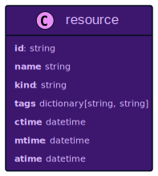
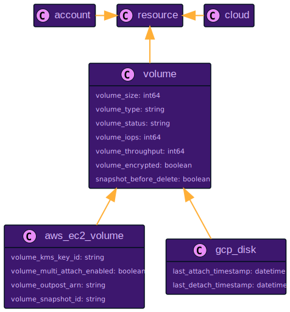

# Unified Data Model

**Resoto has a unified data model (UDM) with support for static typing and inheritance.**

When working with multiple clouds, it can be tedious to what resource kinds and attributes are named. To implement org policies (such as "no unencrypted storage volumes" or "every compute instance must have a cost center tag"), you don't want to rewrite those checks for every cloud provider.

While Resoto has knowledge of cloud-specific resource kinds like [`aws_ec2_volume`](./aws.mdx#aws_ec2_volume) and [`gcp_disk`](./gcp.mdx#gcp_disk), both of those kinds inherit from the base `volume` kind, which in turn inherits from the `resource` kind:

- The `resource` kind defines basic attributes common to all resources (e.g.: name, creation time, etc.).

- The `volume` kind defines properties that are common to most storage volumes.

- The `aws_ec2_volume` and `gcp_disk` kinds define properties that are specific to AWS and GCP, respectively.

The information whether a volume is encrypted or not comes from a boolean of the volume kind.

When searching for unencrypted volumes, `search is(volume) and encrypted = false` will find _any_ unencrypted volume, no matter which cloud they were created in.

You can also perform searches using virtual attributes like `age` across all resources without having to worry about provider-specific naming of the creation timestamp.

At the same time, you can still search by cloud provider-specific properties (e.g., AWS KMS Key ID or Google Cloud "last attach" timestamp).

## `resource` Base Kind

**Every resource collected by Resoto has the `resource` base kind, which defines properties common to all resources.**



| Property | Description |
| --- | --- |
| `id` | Resource identifier (does not need to be unique across all resources) |
| `name` | Cloud-specific resource name |
| `kind` | Resource kind in Resoto<br /><br /><Admonition type="tip" title="Example">[AWS EC2 Volumes](https://docs.aws.amazon.com/AWSCloudFormation/latest/UserGuide/aws-properties-ec2-ebs-volume.html) are of kind [`aws_ec2_volume`](./aws.mdx#aws_ec2_volume).</Admonition> |
| `tags` | Key-value `string` pairs held in a dictionary |
| `ctime` | Resource creation time<br /><br /><Admonition type="note">Resoto uses the time this resource was first discovered when the cloud provider does not provide this value.</Admonition> |
| `atime` | Last accessed time as of the most recent [resource collection](../../concepts/cloud-data-sync/index.mdx)<br /><br /><Admonition type="note">Resoto attempts to synthesize the last access timestamp when the cloud provider does not provide this value.</Admonition> |
| `mtime` | Last modified time as of the most recent [resource collection](../../concepts/cloud-data-sync/index.mdx)<br /><br /><Admonition type="note">Resoto attempts to synthesize the last modified timestamp when the cloud provider does not provide this value.</Admonition> |

## Resource Hierarchy

**Resoto's resource hierarchy abstracts over data models from different cloud providers to deliver a unified data model that allows for data retrieval across clouds.**

Every resource in Resoto has the `resource` base kind as its root.

Resoto also introduces abstract model classes for different resource types, making it easy to query and reason about common data.

<details>

<summary>Example</summary>

<div>

<ZoomPanPinch>



</ZoomPanPinch>

- **`aws_ec2_volume` inherits from the base `volume` kind, which itself inherits all properties from `resource`.**

  As such, `aws_ec2_volume` has all properties of `volume` and `resource`, in addition to its own properties:

  

- **`gcp_disk` is also a volume.**

  A [Google Cloud Disk resource](https://cloud.google.com/compute/docs/reference/rest/v1/disks) is conceptually similar to an AWS EC2 Volume and the two resource types have many properties in common.

</div>

</details>

## Supported Resource Types

Resoto has built-in support for resource types from the following cloud providers:

<DocCardList />

## Resource Kinds {#kinds}

For a list of available kinds, you can use the [`kinds` CLI command](../cli/kinds.mdx):

```bash
> kinds
# highlight-start
​- access_key
​- account
​- any
​- autoscaling_group
​- aws_account
​  .
​  .
# highlight-end
```

To view the properties of a specific kind, use `kind <name>`:

```bash
> kind aws_ec2_volume
# highlight-start
​name: aws_ec2_volume
​bases:
​- resource
​- volume
​- aws_ec2_volume
​properties:
​- name: id
​  kind: string
​  .
​  .
# highlight-end
```

### Complex and Simple Kinds

We have looked at complex kinds so far: a complex kind has a name and a set of properties.

Each property has a name and also a kind. The kind of such a property can be a complex or a simple kind.

There are several simple kinds that are available in Resoto out of the box:

| Kind       | JSON Type           | Example                                           |
| ---------- | ------------------- | ------------------------------------------------- |
| `string`   | `string`            | `"foo"`, `"bla"`, `"some long string"`            |
| `boolean`  | `boolean`           | `true`, `false`                                   |
| `null`     | `null`              | `null`                                            |
| `int32`    | `number`            | `1234`, `4321`, `-123`                            |
| `int64`    | `number`            | `1234`, `4321`, `-123`                            |
| `float`    | `number`            | `12`, `12.1234`, `-23.123`                        |
| `double`   | `number`            | `12, 12.1234, -23.123`                            |
| `datetime` | `string`            | `"2021-03-15T23:04:56Z"`, `"2021-03-15"`, `"-3d"` |
| `date`     | `string`            | `"2021-03-15"`, `"03/15/2021"`, `"-3d"`           |
| `any`      | any of the above \* | `null`, `true`, `"test"`, `123`, `-12.43`         |

\* The special type `any` is only used in scenarios where the type is really not known and could be anything. Coercing is not possible for such a type.

Since Resoto uses JSON in order to exchange data, all the different simple types have to be expressed as simple type.

Resoto also introduces some additional simple types like `datetime` or `date`. The reason for this is the ability to coerce proper values from values given to Resoto.

<details>

<summary>Example</summary>

<div>

**Assume a user wants to query a resource by creation time.**

According to the model, we would need to filter for the `ctime` property. Since Resoto knows the type `ctime` (which is of kind `datetime`), it can interpret the value given by the user.

```bash
> search ctime < "2018-09-28"
```

`ctime` is of type `datetime`. `datetime` values in Resoto are always stored as ISO-formatted datetime strings, so `"2018-09-28"` is coerced into a valid `datetime`. Depending on the server time, the value would be evaluated to something like:

```bash
> search ctime < "2021-09-28T22:00:00Z"
```

**This also allows the usage of relative times.** If we want to query resources that have been created in the last 3 days, we could express this with a relative datetime string:

```bash
> search ctime > "-3d"
```

This translates `"-3d"` using the current server time into a valid datetime string.

</div>

</details>
