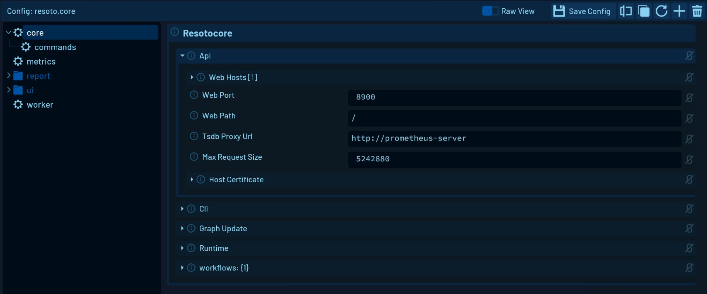

# Configuration Editor

## Overview

The Configuration Editor gives you an easy way of editing Resoto [configurations](../configuration/).

Configurations that are described in the model are rendered as an interface with input forms and buttons. If it is a custom configuration or it is not described in the model, the config will be displayed in a text editor.

Configurations can be saved, deleted, duplicated, renamed, and added using this component.

## Interface



### Left Side

On the left side of the interface, you can find the navigation. Here you can select which configuration you want to edit. The displayed folder structure is created by the configuration names.

<details>
<summary>How the folder structure is created</summary>
<div>

- config: `resoto.core`

  resulting structure:

  ```
  root
    > core *
  ```

- config: `resoto.core.commands`

  resulting structure:

  ```
  root
    > core
        > commands *
  ```

- config: `resoto.ui.dashboard.example_dashboard`

  resulting structure:

  ```
  root
    > ui
        > dashboard
           > example_dashboard *
  ```

</div>
</details>

### Right Side

On the **right side, you see the editor** for the **selected configuration**.

On the top of the right side, you can find buttons to **switch to the raw view**, **save the config**, **rename**, **duplicate**, **reload** or **delete** the config.

There is also a button to **add a new config**.

:::info

Changes **have to be saved manually** using the `Save Config` button on the top.

:::
