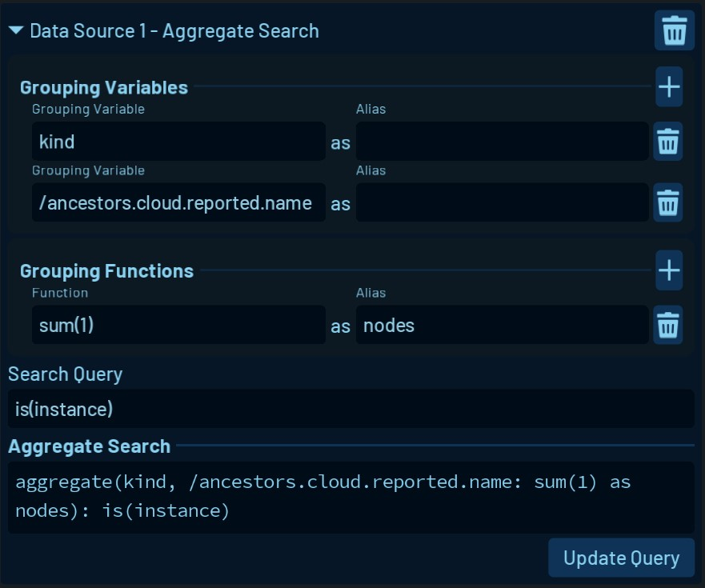
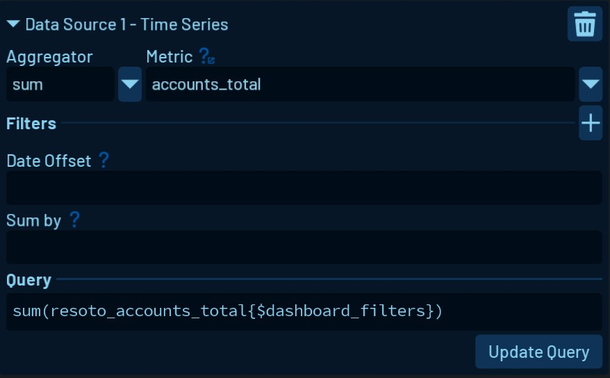
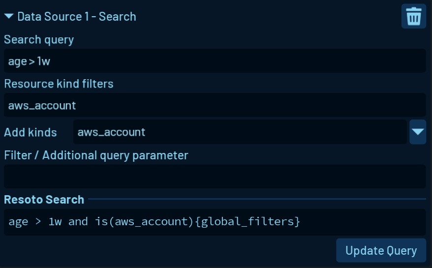
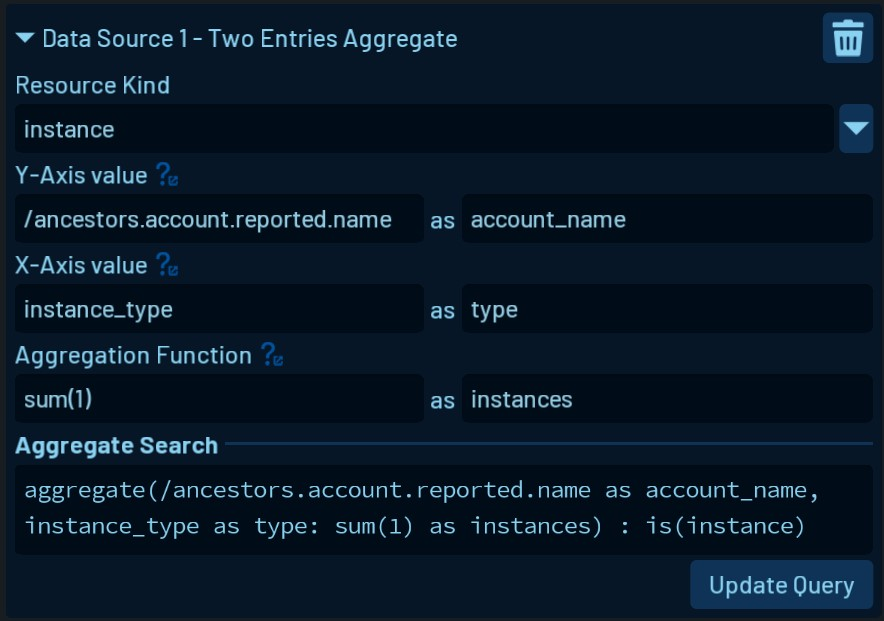
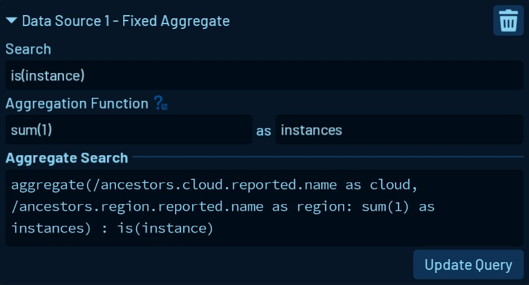

# Data Sources

## Overview

Dashboard Widgets need one or multiple Data Sources to retrieve and display data.

Depending on the Widget, only certain types of Data Sources can be selected.

In most cases, Data Sources come with an interface to help you build the query used to fill the widget with data to display.

# Data Source Types

## Aggregate Search (Live Data)

This Data Source gives you an interface to build an [aggregation search](../../../search/aggregation.md).

## Time Series (Historic Data)

This Data Source helps you build time series queries using the [configured metrics](../../../../reference/components/metrics/) and the time series database that is set up.

In [this blog post](https://some.engineering/blog/2022/06/09/building-actionable-cloud-infrastructure-metrics) about building actionable cloud metrics you can learn more about helpful queries.

## Search (Live Data)

Executing a [Resoto Search](../../../../reference/search/) can be performed using this Data Source.

## Two Entries Aggregate (Live Data)

The Two Entries Aggregate Data Source is used to create a result that is mappable onto a two-dimensional grid. It is used exclusively on the [Heatmap Widget](../widgets/index.md#heatmap) and helps you to create data that the Heatmap can display in a meaningful way.

## Fixed Aggregate (Live Data)

The Fixed Aggregate Data Source is used on the [World Map Widget](../widgets/index.md#world-map) to create results that always include **cloud and region**. This way they can be mapped on a geolocation corresponding to the region that is saved in Resoto.
