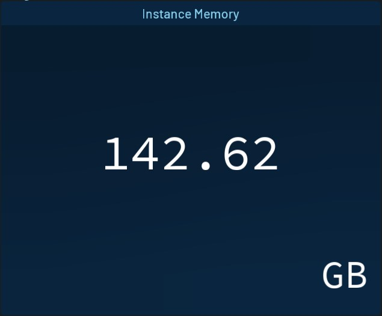
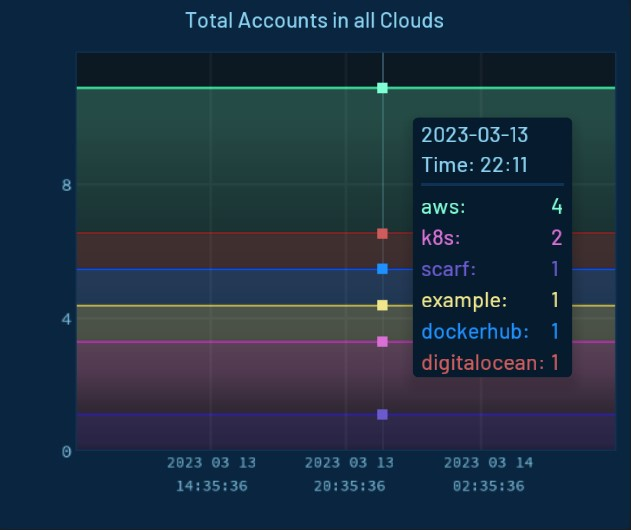
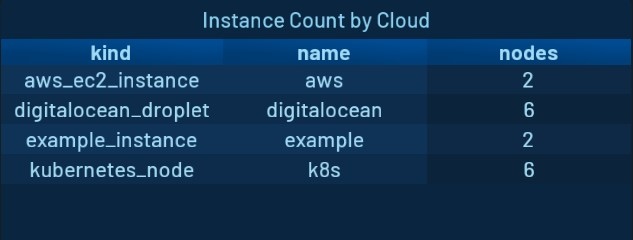
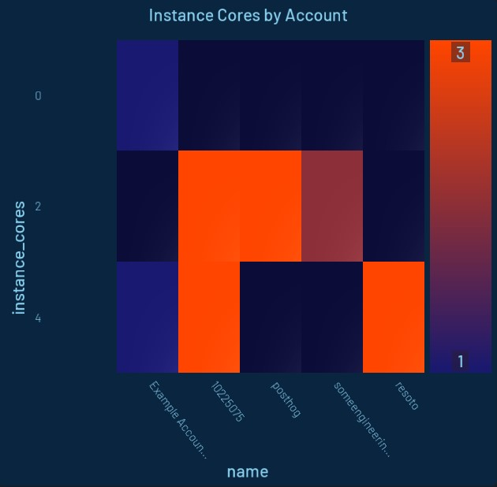
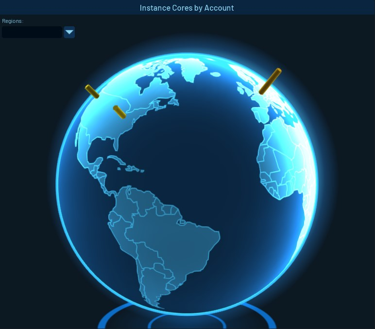

# Widgets

## Overview

A Dashboard Widget can be imagined best as a small application to display Resoto data in a visual representation. A Widget is placed inside a Dashboard and gets its content from a [Data Source](../data-sources/index.mdx) that is attached to the Widget.

Every Widget can only display certain types of data and use only certain types of [Data Sources](../data-sources/index.mdx).

# Adding Widgets to a Dashboard

When the Dashboard is in Edit Mode, you can add a new Widget by clicking the `+ Add Widget` button at the top right.

![Resoto UI Add Widget Popup]In this view, you can configure the new widget. On the left half of the windows, you find all the settings to set which data the Widget will use. You can add one or more [Data Sources](../data-sources/index.mdx) and select their types on the top part, after clicking the `+` button, you need to set up the Data Source below.

On the right side, you get a preview of the widget and find all the visual settings.

# Widget Types

## Indicator



The Indicator Widget displays data as a Number. In the Widgets Options, you can change the background color to change according to the current value.

**Data Sources**

- [Time Series (Historic Data)](../data-sources/index.mdx#time-series)
- [Aggregate Search (Live Data)](../data-sources/index.mdx#aggregate-search)

<details>

<summary>Indicator Aggregate Data Source examples</summary>

<div>

- Monthly Volume Cost estimation
  ```
  aggregate(sum(/ancestors.volume_type.reported.ondemand_cost) as volumes_monthly_cost_estimate): is(volume)
  ```
- Total Instance memory across all clouds
  ```
  aggregate(sum(instance_memory  * 1024 * 1024 * 1024) as instances_memory): is(instance)
  ```
- Total Instances across all clouds
  ```
  aggregate(sum(1) as instances_total): is(instance)
  ```
- The Number of volumes that are available and have are older than 2 hours.
  ```
  aggregate(sum(1) as volumes_total): is(volume) and volume_status = available and age > 2h
  ```

</div>

</details>

## Chart



The Chart Widget displays time series data as a line chart. You can change settings to display the values of each Data Source stacked or unstacked.

**Data Sources**

- [Time Series (Historic Data)](../data-sources/index.mdx#time-series)

<details>

<summary>Chart Time Series Data Source examples</summary>

<div>

- Total Accounts across all clouds
  ```
  sum(resoto_accounts_total{$dashboard_filters})
  ```
- Accounts per cloud
  ```
  resoto_accounts_total{$dashboard_filters}
  ```

</div>

</details>

## Table

The Table Widget is a very flexible way to display [search](../../../../reference/cli/index.mdx) or [aggregation](../../../../reference/cli/aggregate.mdx) results. When using a [Search Data Source](../data-sources/index.mdx#search), a click on a row takes you to [Explore view](../../explore.mdx) to display the clicked resource.



**Data Sources**

- [Aggregate Search (Live Data)](../data-sources/index.mdx#aggregate-search)
- [Search (Live Data)](../data-sources/index.mdx#search)

:::tip

You can export the displayed data directly from the widget by clicking the export button on the top right.

:::

<details>

<summary>Table Aggregate Search Data Source examples</summary>

<div>

- Instances per kind and cloud
  ```
  aggregate(kind, /ancestors.cloud.reported.name: sum(1) as nodes): is(instance)
  ```
- Instances per type and account
  ```
  aggregate(instance_type, /ancestors.account.reported.name: sum(1) as instances): is(instance)
  ```

</div>

</details>

## Heatmap

The Heatmap Widget provides a visual tool to quickly find hotspots of certain metrics in the infrastructure. A good example would be to display the core count or memory of compute instances.



**Data Sources**

- [Aggregate Search (Live Data)](../data-sources/index.mdx#aggregate-search)
- [Two Entries Aggregate (Live Data)](../data-sources/index.mdx#two-entries-aggregate)

<details>

<summary>Heatmap Aggregate Data Source examples</summary>

<div>

- Instances per type and account
  ```
  aggregate(instance_type, /ancestors.account.reported.name: sum(1) as instances): is(instance)
  ```
- Instance number per account and instance type
  ```
  aggregate(/ancestors.account.reported.name as account_name, instance_type as type: sum(1) as instances) : is(instance)
  ```

</div>

</details>

## World Map

The World Map Widget is a way of displaying elements grouped by the geolocation of their regions on a world map.



**Data Sources**

- [Aggregate Search (Live Data)](../data-sources/index.mdx#aggregate-search)
- [Fixed Aggregate (Live Data)](../data-sources/index.mdx#fixed-aggregate)

<details>

<summary>World Map Fixed Aggregate Data Source examples</summary>

<div>

- Instances number per region and cloud
  ```
  aggregate(/ancestors.cloud.reported.name as cloud, /ancestors.region.reported.name as region: sum(1) as instances) : is(instance)
  ```

</div>

</details>
