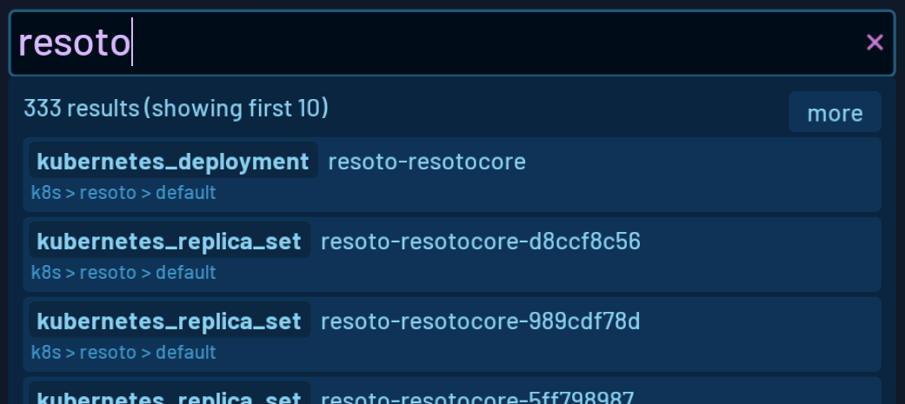
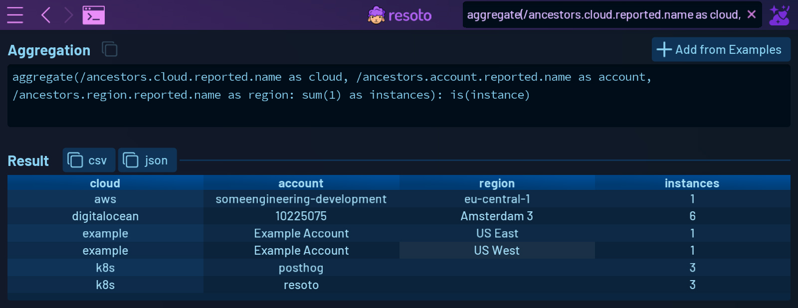

# Search

## Overview

You can search your infrastructure using the search box on the top right in the [top menu bar](./index.mdx#top-menu-bar), or the big search box on the home screen.

## Interface

**Using the search offers you three modes:**

- Start typing in the search box to start a [full-text search](../search/full-text.mdx).
- Begin your search with the keyword `search` to start a Resoto [search query](../search/index.mdx).
- Begin your search with the keyword `aggregate` to start a Resoto [aggregation query](../search/aggregation.mdx)

## Search Results

You will be presented with the search or aggregation results right away.

### Search or Full-Text Search Results

Clicking on a single search result takes you to the [Explore view](./explore.mdx). Clicking on `more` shows you all results in [Explore List view](./explore.mdx#list-view).

### Aggregation Results

When using an aggregation, clicking on `more` will take you to the Aggregation View.

