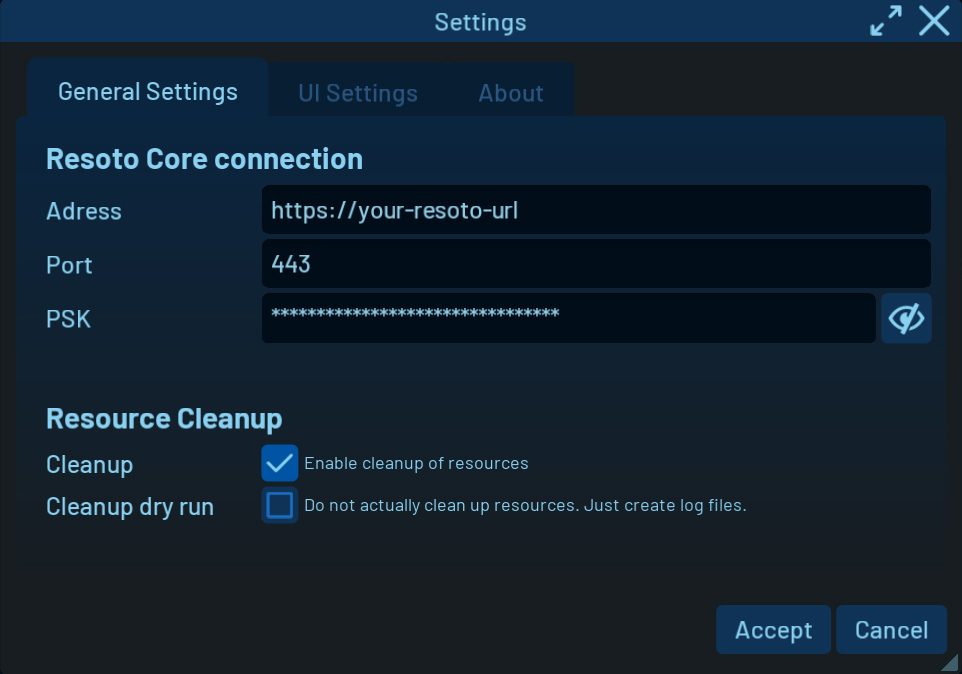
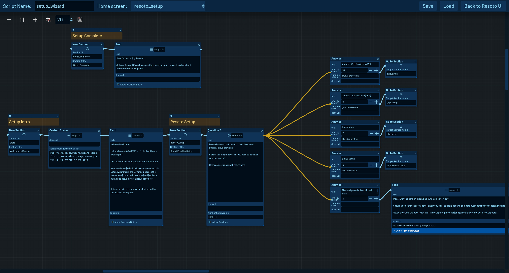

# Settings and Tools

## Overview

The Settings can be found in the [side menu bar](./index.md#top-menu-bar) (<kbd>Esc</kbd>) on the bottom by clicking the `Gear icon`.

## User Interface Settings

In the `General Settings` tab, you can access UI connection settings to Resoto Core and [resource clean-up settings](../../concepts/resource-management/cleanup.md#enabling-cleanup).

In the `UI Settings` tab, you can access the interface scale, activate the `Test Mode` or start the [Wizard Editor](#wizard-editor).

:::info

In `Test Mode`, the UI will not change config changes and does not save edited tags, changed protection or changed clean-up status in Explore view.

:::

## Wizard Editor

The Wizard Editor is a node-based interface to build and edit wizard scripts.
